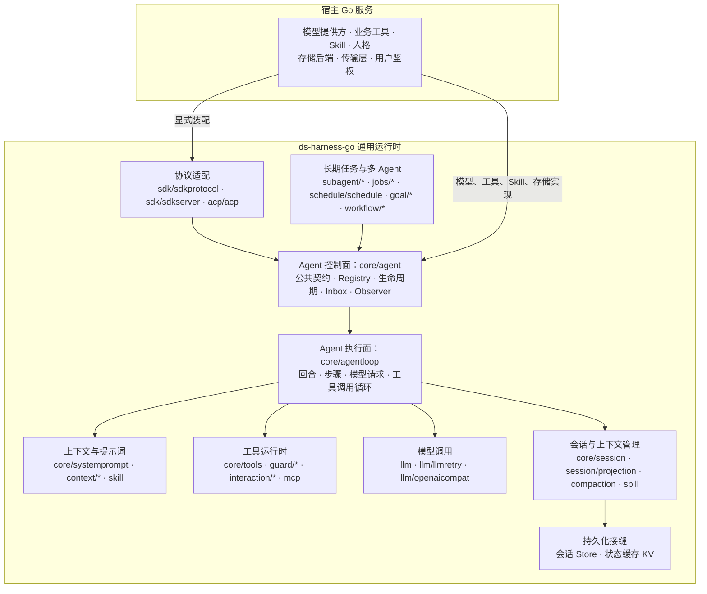
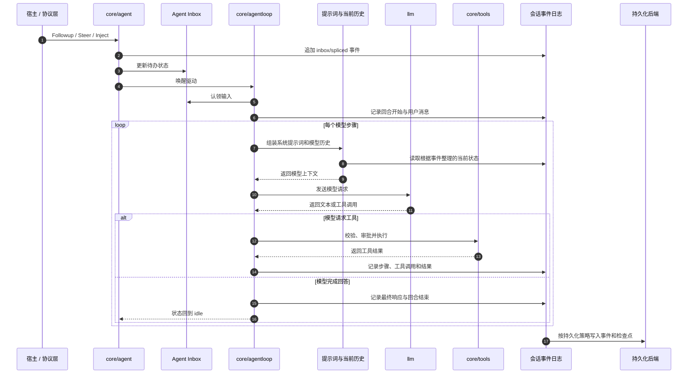

# ds-harness-go

`ds-harness-go` 是一个面向服务端的 Go Agent 运行时，目标是作为组件嵌入现有 Go 服务。

宿主负责提供模型、工具、Skill、人格提示词和持久化后端；运行时负责 Agent 循环、上下文组装、工具调度、会话事件、恢复、多 Agent 协作及对外协议适配。业务能力留在宿主中，运行时本身不绑定具体行业。

项目是 [DeepSeek Harness](https://github.com/deepseek-ai/deepseek-harness) 的非官方 Go 服务端重构，参考其能力和行为语义，但不逐行翻译 TypeScript，也不隶属于 DeepSeek 或受其官方认可。Go 已有成熟机制的部分直接采用 Go 的实现方式；每项移植或排除决定都记录在 `docs/portmap/`。

文档入口：[项目文档](docs/README.md) · [总体架构](docs/architecture.md) · [嵌入 Go 服务](docs/embedding.md) · [逐包文档映射](docs/packages.md)

## 引入方式

公开 module path 是 `github.com/snight1983/ds-harness-go`，与仓库地址一致。所有包都从这个前缀引入：

```go
import (
    "github.com/snight1983/ds-harness-go/core/agentloop"
    "github.com/snight1983/ds-harness-go/core/session"
)
```

分发走标准 Go 模块代理，不提供 vendor 目录、不提供单独发布的子模块——`tools/` 下的门禁工具是 `package main`，`internal/` 下的包按语言规则外部进不来，其余 79 个包全部对外可引。

**尚未打稳定版本 tag。** 在打 tag 之前，外部宿主用 `replace` 指到本地检出：

```
require github.com/snight1983/ds-harness-go v0.0.0

replace github.com/snight1983/ds-harness-go => ../ds-harness-go
```

「仓库外面引得进来」这件事在仓库内部是验不出来的：`go build ./...` 解析 import 走的是主模块自己的 module 行，module path 写错了内部照样全绿，外部调用方才会撞上 `package ... is not in std`。所以它有一道单独的门禁，见下面的开发与核验。

## 项目边界

- 面向长期运行、多用户的服务端进程，而不是桌面编程助手。
- 不执行任意 Shell 命令，不提供本机终端、子进程、代码沙箱或本地文件工具。
- 文件能力通过 `fs` 接口暴露，生产实现面向 S3、MinIO 等对象存储。
- 模型、工具、Skill、存储和协议适配器都由宿主显式装配。
- SDK 服务端不强制宿主采用指定的 HTTP 框架或进程模型。

## 已实现能力

| 能力 | 主要包 |
|---|---|
| Agent 生命周期与 ReAct 循环 | [Agent](docs/modules/agent.md)、[Agent Loop](docs/modules/agentloop.md) |
| 系统提示词与工具运行时 | [Skill、提示词与预设](docs/modules/skill.md)、[Tools](docs/modules/tools.md) |
| 模型抽象、OpenAI 兼容协议、重试与计量 | [LLM](docs/modules/llm.md) |
| 模型响应录制与回放 | `llm/replay`、`llm/mockserver` |
| 会话事件、持久化接口、当前状态整理与恢复原语 | [Session](docs/modules/session.md) |
| 检查点、统计、标题与遥测 | `session/checkpointpolicy`、`session/stats`、`session/sessiontitle`、`session/telemetry` |
| 上下文、压缩与大结果外置 | `context/*`、`compaction`、`spill` |
| Skill、计划、待办与人工介入 | `skill`、`plan/planmode`、`todo`、`interaction/*` |
| MCP 工具桥接 | `mcp` |
| 多 Agent、派生、续行与控制 | [多 Agent](docs/modules/subagent.md) |
| 后台任务、定时、目标与固定工作流 | [后台任务、目标与工作流](docs/modules/workflow.md) |
| SDK JSON-RPC、ACP 与 MCP 适配 | [协议适配](docs/modules/protocol.md) |
| 可替换存储、对象存储、附件与凭据 | [存储、文件与附件](docs/modules/storage.md) |
| 设置、凭据、附件与工作区 | `settings`、`credentials`、`attachment`、`workspace` |

## 架构

### 整体分层



框内是 `ds-harness-go` 的通用运行时，宿主业务不进入运行时核心。宿主提供具体能力和后端，运行时负责把它们装配进 Agent 生命周期并驱动执行。

`core/agent` 与 `core/agentloop` 刻意分开：前者定义活 Agent 的稳定公共接口和控制面，后者实现 ReAct 执行循环。协议层、子 Agent 和后台任务只需要依赖 `core/agent`，不必绑定循环实现。

### 一轮对话



会话事件日志是状态的权威来源。Inbox 变化、用户消息、步骤、模型调用和工具结果都通过事件表达；内存对象是根据这些事件整理出的当前状态。进程重启后，运行时由持久化事件重建会话、Inbox 和模型历史。

### 接口与实现分离

| 运行时接口或协调层 | 可替换实现 |
|---|---|
| `llm` | `llm/openaicompat` 或宿主自定义适配器 |
| `storage` | `datastore/kvstore` 或宿主存储后端 |
| `fs` | `fs/objectstore`，面向 S3、MinIO 等对象存储 |
| `session/persistence.Store` | `datastore/sessionstore` 或宿主自己的会话后端 |
| `sdk/sdkserver` | 宿主自己的传输层与进程模型 |

运行时不通过接口名称推断部署方式。`fs` 是文件能力抽象，不等于访问服务器本地磁盘；`sdk/sdkserver` 提供协议服务能力，不强制宿主采用指定 HTTP 框架。模型、存储、对象存储和传输实现均由宿主选择。

## 包结构

```text
ds-harness-go/
|-- core/
|   |-- agent/                 Agent 接口、注册表和生命周期事件
|   |-- agentdefaultmodel/     没自带模型选择的 Agent 用哪个模型
|   |-- agentloop/             回合、步骤和工具调用循环
|   |-- scope/                 作用域：身份、父子链和所有权边界
|   |-- session/               运行中的会话对象
|   |-- systemprompt/          系统提示词组装
|   `-- tools/                 工具定义、校验和运行时
|-- llm/
|   |-- openaicompat/          OpenAI 兼容模型适配
|   |-- llmretry/              重试策略
|   |-- mockserver/            测试用的模型服务端
|   |-- replay/                响应录制与回放
|   `-- tokenmeter/            Token 统计
|-- session/
|   |-- persistence/           会话持久化协调
|   |-- projection/            根据事件整理当前状态
|   |-- projectioncache/       当前状态缓存
|   |-- checkpointpolicy/      检查点策略
|   |-- stats/                 会话统计
|   |-- sessiontitle/          会话标题
|   |-- sessiontitlellm/       用模型拟会话标题
|   `-- telemetry/             会话遥测
|-- sessionquery/              会话与事件查询，及给模型用的查询工具
|-- storage/
|   |-- domain/                串行写入和领域存储
|   `-- storagetest/           后端一致性测试套件
|-- datastore/                 唯一操作数据库的地方
|   |-- dbtest/                挑选测试跑在哪种库上
|   |-- kvstore/               记录集接到通用键值后端
|   `-- sessionstore/          日志集接到会话持久化后端
|-- context/                   指令、会话引用和时间上下文
|-- compaction/                上下文压缩
|-- skill/                     Skill 注册表和加载工具
|-- subagent/                  多 Agent 运行时及工具
|-- interaction/               审批、提问和命令
|-- jobs/                      后台任务
|-- goal/                      长期目标和自动续行
|-- plan/                      计划模式
|-- todo/                      待办清单
|-- schedule/                  定时提醒
|-- workflow/                  固定工作流
|-- guard/                     运行时护栏：重复调用提醒和超时策略
|-- mcp/                       MCP 客户端桥接
|-- sdk/                       SDK 协议与服务端
|-- acp/                       ACP 适配
|-- fs/                        文件接口与对象存储后端
|-- attachment/                附件与图片
|-- spill/                     大结果外置
|-- credentials/               凭据
|-- preset/                    Agent 预设、人格和预设仓库
|-- settings/                  动态设置
|-- workspace/                 工作区注册表
|-- invariants/                不变量诊断
|-- util/                      通用运行时工具
|-- example/                   可运行的最小宿主示例
|-- cmd/                       可执行入口
|-- tools/                     移植裁决与门禁工具
`-- docs/                      设计和能力映射文档
```

完整包列表以 `go list ./...` 的输出为准，README 不再维护一份容易过期的逐包完成状态树。

## 当前状态

项目仍处于开发阶段：核心运行时和主要扩展包已经落地，但尚未发布稳定版本，也尚未提供一行代码完成全部装配的顶层 Builder。会话持久化提供接口、写后队列、恢复原语和活会话协调器（`persistence.Coordinator`），落盘实现在 `datastore/sessionstore`；连接池由装配方 `sql.Open` 出来传进去，驱动仍是部署期的选择。换别的介质就自己实现 `persistence.Backend`。宿主需要按自身需求显式创建并连接各组件。

数据库那一摊整个收在 `datastore` 底下：它是唯一 import `database/sql`、唯一挂驱动、唯一写 SQL 的地方，`session` 和 `storage` 两棵树里不许出现任何一处提到数据库。这条界线由 `tools/dbcheck` 把着，详见[持久化抽象层](docs/modules/datastore.md)。

以下检查当前通过：

```powershell
go build ./...
go vet ./...
go test ./...
go test -race ./...
go run ./tools/doccheck
go run ./tools/consumercheck
go run ./tools/dbcheck
```

`tools/consumercheck` 在临时目录里建一个仓库外的模块，用公开 module path 把全部可发布包引进去，编译、vet，再跑一遍最小闭环。它是 module path 和「每个公开包都对外可引」这两件事唯一测得到的地方。

移植完整性门禁以此命令为准：

```powershell
go run ./tools/portcheck
```

`PENDING` 表示对应 DSH 符号仍未完成最终裁决。只要存在 `PENDING`，移植完整性门禁就不会通过；不能把单元测试通过等同于项目已经完成。

门禁校验溯源注释时要读 DSH 源码，当前基准快照是 `deepseek-harness-dsh-v0.1.2-alpha.3`，默认从 `-dsh-root` 指向的目录读取。快照放在别处时用 `-dsh-root` 指定；指向不存在的目录只会让每条注释都报「出处不存在」，那是路径错了，不是移植漏了。

`datastore` 那批用例每一行都要一个真的数据库才执行得到，所以它们缺省跑在一个临时目录里的 SQLite 库文件上——`go test ./...` 就整批执行，不必先起一台库。设 `DSH_POSTGRES_DSN` 把同一批用例体换到 Postgres 上再跑一遍：两种方言都要过，因为这批用例压的正是两边会分歧的地方。

CI 上再设 `DSH_REQUIRE_POSTGRES=1`，声明「这一轮就是要跑真库」；此时缺 DSN 会失败而不是悄悄退回 SQLite——service container 没起来正是长那个样子，不拦住的话一整批本该压两种方言的用例只压了一种。

## 开发与核验

```powershell
gofmt -l .
go build ./...
go vet ./...
go test ./...
go test -race ./...
$env:CGO_ENABLED = "0"
$env:GOOS = "linux"
go build ./...
$env:GOOS = "darwin"
go build ./...
Remove-Item Env:GOOS
Remove-Item Env:CGO_ENABLED
go run ./tools/doccheck
go run ./tools/consumercheck
go run ./tools/dbcheck
go run ./tools/portcheck
```

这串命令同时由 `.github/workflows/ci.yml` 在每次 push 和 PR 上跑一遍，分成三个 job：`gates`（格式、构建、vet、测试、竞态、四道门禁）、`postgres`（起一个 `postgres:16` service container，跑那批只有真库才执行得到的后端契约）、`cross`（linux / darwin / windows 三个目标各编一次）。分开是因为它们红的时候含义不同：代码有问题、真库跑不通、换个平台编不过，混在一个 job 里说不清是哪一类。

`portcheck` 的溯源注释验真需要 DSH 上游快照，路径由 `DSH_ROOT` 环境变量给出。CI 上没有那份快照，所以显式传 `-no-provenance` 只跑裁决表门禁；工具会打一行横幅说明这一轮没有对过源码，不静默降级。

交叉编译要关掉 cgo。本仓库自己不用 cgo，但只要机器上装了 C 工具链，`go build` 就会拿本机的 gcc 去编 runtime 里那几个 cgo 文件，报出一串跟本仓库无关的 `sigset_t` 错误。`CGO_ENABLED=0` 是在验「纯 Go 代码能不能为目标平台编出来」这个真问题。

关键文档：

- `docs/README.md`：文档站首页和完整模块导航。
- `docs/architecture.md`：总体分层、主流程和设计边界。
- `docs/embedding.md`：嵌入现有 Go 服务的装配指南。
- `docs/modules/`：主要模块的职责、架构、能力和边界。
- `docs/packages.md`：每个可发布 Go 包到主文档的机器校验映射。
- `docs/DESIGN.md`：详细运行时边界、持久化和移植设计。
- `docs/portmap/rulings.md`：DSH 包级裁决。
- `docs/portmap/decisions.md`：符号级裁决依据。
- `docs/portmap/portmap.tsv`：机器读取的逐符号状态表。

## 移植规则

- 按通用服务端 Agent 运行时是否需要该能力决定范围，不按某个业务项目裁剪。
- Go 有原生等价机制时使用 Go 机制，不复制 TypeScript 基础设施。
- 运行时接口与具体后端分离，宿主决定模型、存储、对象存储和传输实现。
- 源码使用 `// 源: packages/...:行号` 或 `// 新增: 理由` 记录实现依据，并由 `tools/portcheck` 校验。

## 许可证

本项目以 [MIT License](LICENSE) 发布。来源于或改编自 DeepSeek Harness 的部分保留上游版权与许可声明，见 [THIRD_PARTY_NOTICES.md](THIRD_PARTY_NOTICES.md)。
