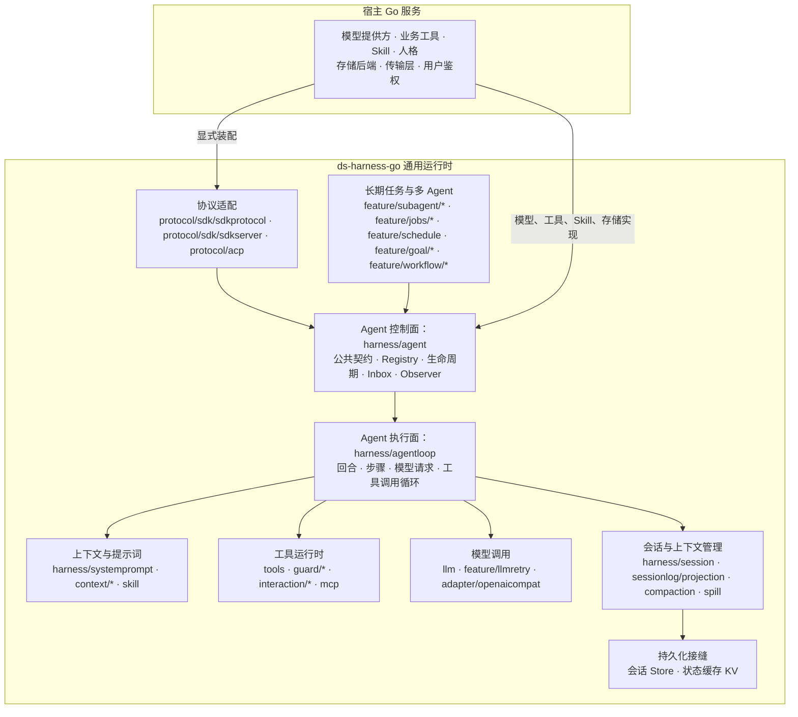
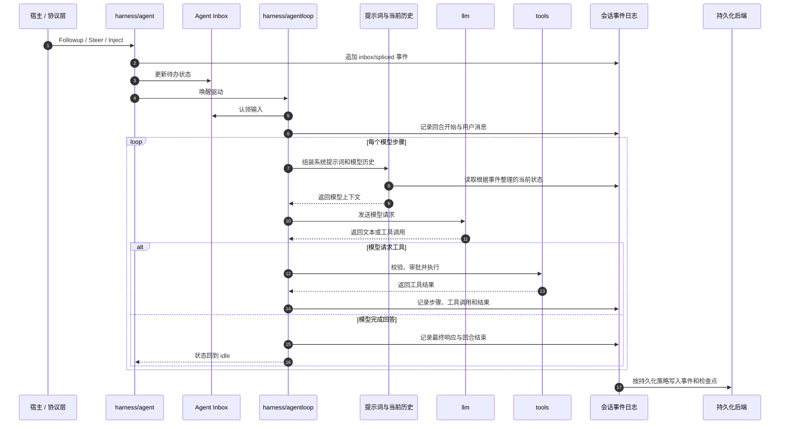

# ds-harness-go

`ds-harness-go` 是可嵌入现有 Go 服务的 Agent 运行时。

宿主提供模型、工具、Skill、人格提示词和持久化后端；运行时提供 Agent 循环、上下文组装、工具调度、会话事件、恢复、多 Agent 协作及协议适配。

文档入口：[项目文档](docs/README.md) · [总体架构](docs/architecture.md) · [嵌入 Go 服务](docs/embedding.md) · [逐包文档映射](docs/packages.md)

## 引入方式

Module path：`github.com/snight1983/ds-harness-go`

```go
import (
    "github.com/snight1983/ds-harness-go/harness"
    "github.com/snight1983/ds-harness-go/sessionlog"
)
```

## 项目边界

- 面向长期运行、多用户的服务端进程，而不是桌面编程助手。
- 不执行任意 Shell 命令，不提供本机终端、子进程、代码沙箱或本地文件工具。
- 文件能力通过 `fs` 接口暴露，生产实现面向 S3、MinIO 等对象存储。
- 模型、工具、Skill、存储和协议适配器都由宿主显式装配。
- SDK 服务端不强制宿主采用指定的 HTTP 框架或进程模型。

## 已实现能力

| 能力 | 主要包 |
|---|---|
| Agent 生命周期与 ReAct 循环 | [Agent](docs/modules/agent.md)、[Agent Loop](docs/modules/agentloop.md) |
| 系统提示词、人格预设与工具运行时 | [系统提示词](docs/modules/systemprompt.md)、[预设](docs/modules/presets.md)、[Tools](docs/modules/tools.md) |
| 模型抽象、OpenAI 兼容协议、重试与计量 | [LLM](docs/modules/llm.md) |
| 模型响应录制与回放 | `feature/replay`、`llm/mockserver` |
| 会话事件、持久化接口、当前状态整理与恢复原语 | [Session](docs/modules/session.md) |
| 检查点、统计、标题与遥测 | `feature/checkpointpolicy`、`feature/sessionstats`、`feature/sessiontitle`、`feature/telemetry` |
| 上下文、压缩与大结果外置 | `feature/context/*`、`feature/compaction`、`spill` |
| Skill、计划、待办与人工介入 | `feature/skill`、`feature/plan/planmode`、`feature/todo`、`feature/interaction/*` |
| MCP 工具桥接 | `protocol/mcp` |
| 多 Agent、派生、续行与控制 | [多 Agent](docs/modules/subagent.md) |
| 后台任务、定时、目标与固定工作流 | [后台任务、目标与工作流](docs/modules/workflow.md) |
| SDK JSON-RPC、ACP 与 MCP 适配 | [协议适配](docs/modules/protocol.md) |
| 可替换存储、数据库与对象存储 | [存储、文件与附件](docs/modules/storage.md) |
| 设置、凭据、附件与工作区 | `settings`、`credentials`、`attachment`、`feature/workspace` |

## 架构

### 整体分层



### 一轮对话



会话状态以事件日志为准；进程重启后从持久化事件重建会话、Inbox 和模型历史。

### 接口与实现分离

| 运行时接口或协调层 | 可替换实现 |
|---|---|
| `llm` | `adapter/openaicompat` 或宿主自定义适配器 |
| `storage` | `adapter/datastore/kvstore` 或宿主存储后端 |
| `fs` | `adapter/objectstore`，面向 S3、MinIO 等对象存储 |
| `feature/persistence.Store` | `adapter/datastore/sessionstore` 或宿主自己的会话后端 |
| `protocol/sdk/sdkserver` | 宿主自己的传输层与进程模型 |

## 包结构

```text
ds-harness-go/
|
| == 契约层：这个模块对外的门面，平铺在顶层，不套容器 ==
|-- llm/                       模型契约    mockserver/ 是测试替身
|-- tools/                     工具定义、校验和运行时
|-- scope/                     作用域：身份、父子链和所有权边界
|-- sessionlog/                会话事件日志    projection/ 根据事件整理当前状态
|-- storage/                   可替换存储    domain/ 串行写入   storagetest/ 一致性套件
|-- fs/                        文件接口    fstest/ 测试替身
|-- attachment/                附件与图片
|-- spill/                     大结果外置
|-- settings/                  动态设置
|-- credentials/               凭据
|-- invariants/                不变量诊断
|
| == 运行期与装配 ==
|-- harness/                   宿主装配门面
|   |-- agent/                 Agent 接口、注册表和生命周期事件
|   |-- agentloop/             回合、步骤和工具调用循环
|   |-- session/               运行中的会话对象
|   |-- systemprompt/          系统提示词组装
|   `-- agentdefaultmodel/     没自带模型选择的 Agent 用哪个模型
|
| == 能力层：建在运行期之上，彼此可以互引 ==
|-- feature/
|   |-- compaction/            上下文压缩    basic/  toolresultpruner/
|   |-- context/               指令、会话引用和时间上下文
|   |-- goal/                  长期目标和自动续行
|   |-- guard/                 运行时护栏：重复调用提醒和超时策略
|   |-- interaction/           审批、提问和命令
|   |-- jobs/                  后台任务
|   |-- subagent/              多 Agent 运行时及工具
|   |-- skill/                 Skill 注册表和加载工具
|   |-- plan/                  计划模式        todo/         待办清单
|   |-- preset/                预设与人格      workflow/     固定工作流
|   |-- schedule/              定时提醒        workspace/    工作区注册表
|   |-- sessionquery/          会话与事件查询  sessionstats/ 会话统计
|   |-- sessiontitle/          会话标题        telemetry/    会话遥测
|   |-- checkpointpolicy/      检查点策略      spillpolicy/  外置策略
|   |-- persistence/           会话持久化协调  projectioncache/ 当前状态缓存
|   |-- llmretry/              重试策略        tokenmeter/   Token 统计
|   |-- replay/                响应录制与回放  outputretention/ 输出留存
|   `-- timeout/               超时
|
| == 适配层：生产后端实现 ==
|-- adapter/
|   |-- datastore/             唯一操作数据库的地方
|   |   |-- internal/dbtest/   挑选测试跑在哪种库上
|   |   |-- kvstore/           记录集接到通用键值后端
|   |   `-- sessionstore/      日志集接到会话持久化后端
|   |-- objectstore/           面向 S3、MinIO 的文件后端
|   |-- openaicompat/          OpenAI 兼容模型适配
|   |-- imagestore/            图片后端        textstore/    大文本后端
|   `-- domainjobs/            领域作业后端    localjobs/    进程内作业后端
|
| == 协议层：对外线协议 ==
|-- protocol/
|   |-- acp/                   ACP 适配
|   |-- mcp/                   MCP 客户端桥接
|   `-- sdk/                   SDK 协议与服务端
|
| == 模块外不可见 ==
|-- internal/devtools/         工程检查工具
|
|-- cmd/                       可执行入口
`-- docs/                      设计和能力映射文档
```

## 开发与核验

```powershell
gofmt -l .
go build ./...
go vet ./...
go test ./...
go test -race ./...
$env:CGO_ENABLED = "0"
$env:GOOS = "linux"
go build ./...
$env:GOOS = "darwin"
go build ./...
Remove-Item Env:GOOS
Remove-Item Env:CGO_ENABLED
go run ./internal/devtools/doccheck
go run ./internal/devtools/consumercheck
go run ./internal/devtools/dbcheck
go run ./internal/devtools/oscheck
go run ./internal/devtools/layercheck
```

关键文档：

- `docs/README.md`：文档站首页和完整模块导航。
- `docs/architecture.md`：总体分层、主流程和设计边界。
- `docs/embedding.md`：嵌入现有 Go 服务的装配指南。
- `docs/modules/`：主要模块的职责、架构、能力和边界。
- `docs/packages.md`：每个可发布 Go 包到主文档的机器校验映射。
- `docs/DESIGN.md`：详细运行时边界、持久化和设计决策。

## 许可证

本项目以 [MIT License](LICENSE) 发布。第三方许可声明见 [THIRD_PARTY_NOTICES.md](THIRD_PARTY_NOTICES.md)。
