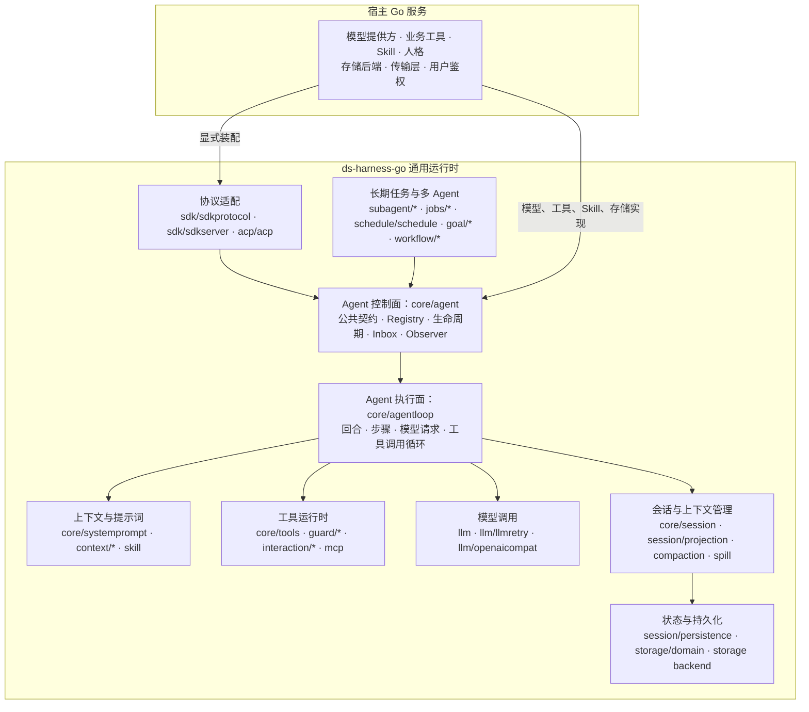

# ds-harness-go

`ds-harness-go` 是一个面向服务端的 Go Agent 运行时，目标是作为组件嵌入现有 Go 服务。

宿主负责提供模型、工具、Skill、人格提示词和持久化后端；运行时负责 Agent 循环、上下文组装、工具调度、会话事件、恢复、多 Agent 协作及对外协议适配。业务能力留在宿主中，运行时本身不绑定具体行业。

项目参考 [DeepSeek Harness](https://github.com/deepseek-ai/deepseek-harness) 的能力和行为语义，但不逐行翻译 TypeScript。Go 已有成熟机制的部分直接采用 Go 的实现方式；每项移植或排除决定都记录在 `docs/portmap/`。

文档入口：[项目文档](docs/README.md) · [core/agent 模块](docs/core/agent.md)

## 项目边界

- 面向长期运行、多用户的服务端进程，而不是桌面编程助手。
- 不执行任意 Shell 命令，不提供本机终端、子进程、代码沙箱或本地文件工具。
- 文件能力通过 `fs` 接口暴露，生产实现面向 S3、MinIO 等对象存储。
- 模型、工具、Skill、存储和协议适配器都由宿主显式装配。
- SDK 服务端不强制宿主采用指定的 HTTP 框架或进程模型。

## 已实现能力

| 能力 | 主要包 |
|---|---|
| Agent 生命周期与 ReAct 循环 | [`core/agent`](docs/core/agent.md)、`core/agentloop`、`core/session` |
| 系统提示词与工具运行时 | `core/systemprompt`、`core/tools` |
| 模型抽象、OpenAI 兼容协议、重试与计量 | `llm`、`llm/openaicompat`、`llm/llmretry`、`llm/tokenmeter` |
| 模型响应录制与回放 | `llm/replay`、`llm/mockserver` |
| 会话事件、持久化、投影与恢复 | `session`、`session/persistence`、`session/projection`、`session/projectioncache` |
| 检查点、统计、标题与遥测 | `session/checkpointpolicy`、`session/stats`、`session/sessiontitle`、`session/telemetry` |
| 上下文、压缩与大结果外置 | `context/*`、`compaction`、`spill` |
| Skill、计划、待办与人工介入 | `skill`、`plan/planmode`、`todo`、`interaction/*` |
| MCP 工具桥接 | `mcp` |
| 多 Agent、派生、续行与控制 | `subagent/*` |
| 后台任务、定时、目标与固定工作流 | `jobs/*`、`schedule/schedule`、`goal/*`、`workflow/toolralph` |
| SDK JSON-RPC 与 ACP 适配 | `sdk/sdkprotocol`、`sdk/sdkserver`、`acp/acp` |
| 可替换存储与对象存储 | `storage`、`storage/domain`、`storage/postgres`、`fs/objectstore` |
| 设置、凭据、附件与工作区 | `settings`、`credentials`、`attachment`、`workspace` |

## 架构

### 整体分层



框内是 `ds-harness-go` 的通用运行时，宿主业务不进入运行时核心。宿主提供具体能力和后端，运行时负责把它们装配进 Agent 生命周期并驱动执行。

`core/agent` 与 `core/agentloop` 刻意分开：前者定义活 Agent 的稳定公共接口和控制面，后者实现 ReAct 执行循环。协议层、子 Agent 和后台任务只需要依赖 `core/agent`，不必绑定循环实现。

### 一轮对话

```mermaid
sequenceDiagram
    autonumber
    participant Host as 宿主 / 协议层
    participant Agent as core/agent
    participant Inbox as Agent Inbox
    participant Loop as core/agentloop
    participant Context as 提示词与历史投影
    participant LLM as llm
    participant Tools as core/tools
    participant Session as 会话事件日志
    participant Persistence as 持久化后端

    Host->>Agent: Followup / Steer / Inject
    Agent->>Session: 追加 inbox/spliced 事件
    Agent->>Inbox: 更新待办投影
    Agent->>Loop: 唤醒驱动
    Loop->>Inbox: 认领输入
    Loop->>Session: 记录回合开始与用户消息

    loop 每个模型步骤
        Loop->>Context: 组装系统提示词和模型历史
        Context->>Session: 读取事件投影
        Context-->>Loop: 返回模型上下文
        Loop->>LLM: 发送模型请求
        LLM-->>Loop: 返回文本或工具调用

        alt 模型请求工具
            Loop->>Tools: 校验、审批并执行
            Tools-->>Loop: 返回工具结果
            Loop->>Session: 记录步骤、工具调用和结果
        else 模型完成回答
            Loop->>Session: 记录最终响应与回合结束
            Loop-->>Agent: 状态回到 idle
        end
    end

    Session->>Persistence: 按持久化策略写入事件和检查点
```

会话事件日志是状态的权威来源。Inbox 变化、用户消息、步骤、模型调用和工具结果都通过事件表达；内存对象只是当前投影。进程重启后，运行时由持久化事件重建会话、Inbox 和模型历史。

### 接口与实现分离

| 运行时接口或协调层 | 可替换实现 |
|---|---|
| `llm` | `llm/openaicompat` 或宿主自定义适配器 |
| `storage` | `storage/postgres` 或宿主存储后端 |
| `fs` | `fs/objectstore`，面向 S3、MinIO 等对象存储 |
| `session/persistence` | `storage/domain` 与具体存储后端 |
| `sdk/sdkserver` | 宿主自己的传输层与进程模型 |

运行时不通过接口名称推断部署方式。`fs` 是文件能力抽象，不等于访问服务器本地磁盘；`sdk/sdkserver` 提供协议服务能力，不强制宿主采用指定 HTTP 框架。模型、存储、对象存储和传输实现均由宿主选择。

## 包结构

```text
ds-harness-go/
|-- core/
|   |-- agent/                 Agent 接口、注册表和生命周期事件
|   |-- agentloop/             回合、步骤和工具调用循环
|   |-- session/               运行中的会话对象
|   |-- systemprompt/          系统提示词组装
|   `-- tools/                 工具定义、校验和运行时
|-- llm/
|   |-- openaicompat/          OpenAI 兼容模型适配
|   |-- llmretry/              重试策略
|   |-- replay/                响应录制与回放
|   `-- tokenmeter/            Token 统计
|-- session/
|   |-- persistence/           会话持久化协调
|   |-- projection/            事件投影
|   |-- projectioncache/       投影缓存
|   |-- checkpointpolicy/      检查点策略
|   `-- stats/                 会话统计
|-- storage/
|   |-- domain/                串行写入和领域存储
|   |-- postgres/              PostgreSQL 后端
|   `-- storagetest/           后端一致性测试套件
|-- context/                   指令、会话引用和时间上下文
|-- compaction/                上下文压缩
|-- skill/                     Skill 注册表和加载工具
|-- subagent/                  多 Agent 运行时及工具
|-- interaction/               审批、提问和命令
|-- jobs/                      后台任务
|-- goal/                      长期目标和自动续行
|-- schedule/                  定时任务
|-- workflow/                  固定工作流
|-- mcp/                       MCP 客户端桥接
|-- sdk/                       SDK 协议与服务端
|-- acp/                       ACP 适配
|-- fs/                        文件接口与对象存储后端
|-- preset/                    Agent 预设和人格
|-- settings/                  动态设置
|-- workspace/                 工作区注册表
|-- tools/                     移植裁决与门禁工具
`-- docs/                      设计和能力映射文档
```

完整包列表以 `go list ./...` 的输出为准，README 不再维护一份容易过期的逐包完成状态树。

## 当前状态

项目仍处于开发阶段：核心运行时和主要扩展包已经落地，但尚未发布稳定版本，也尚未提供一行代码完成全部装配的顶层 Builder。宿主目前需要按自身需求显式创建并连接各组件。

以下检查当前通过：

```powershell
go build ./...
go vet ./...
go test ./...
go test -race ./...
```

移植完整性门禁以此命令为准：

```powershell
go run ./tools/portcheck
```

`PENDING` 表示对应 DSH 符号仍未完成最终裁决。只要存在 `PENDING`，移植完整性门禁就不会通过；不能把单元测试通过等同于项目已经完成。

PostgreSQL 后端测试需要设置真实数据库连接环境变量；未提供连接时，对应集成测试会跳过。

## 开发与核验

```powershell
gofmt -l .
go build ./...
go vet ./...
go test ./...
go test -race ./...
$env:GOOS = "linux"
go build ./...
$env:GOOS = "darwin"
go build ./...
Remove-Item Env:GOOS
go run ./tools/portcheck
```

关键文档：

- `docs/README.md`：文档站首页和模块导航。
- `docs/core/agent.md`：Agent 公共契约、架构、能力与边界。
- `docs/DESIGN.md`：运行时边界、持久化和装配设计。
- `docs/portmap/rulings.md`：DSH 包级裁决。
- `docs/portmap/decisions.md`：符号级裁决依据。
- `docs/portmap/portmap.tsv`：机器读取的逐符号状态表。

## 移植规则

- 按通用服务端 Agent 运行时是否需要该能力决定范围，不按某个业务项目裁剪。
- Go 有原生等价机制时使用 Go 机制，不复制 TypeScript 基础设施。
- 运行时接口与具体后端分离，宿主决定模型、存储、对象存储和传输实现。
- 源码使用 `// 源: packages/...:行号` 或 `// 新增: 理由` 记录实现依据，并由 `tools/portcheck` 校验。
