# ds-harness-go 设计

## 一、这是什么

一个 Go 模块，给**服务端** agent 用。`aiboys-go` 只是第一个消费方，不是唯一那个。

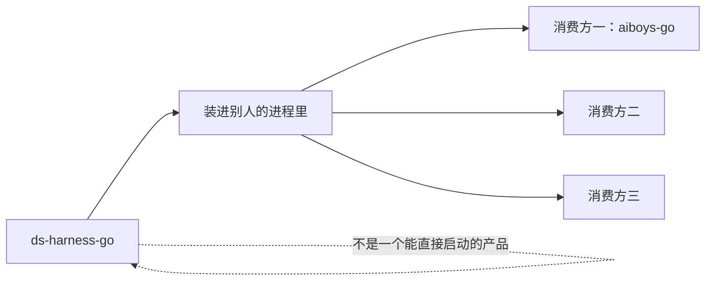

能力来源是 DeepSeek Harness（下称 DSH，TypeScript，250 个包）。


### 通用是硬约束，不是口号

装出来是一个**空的 agent 运行时**。给它四样东西，它就能跑：

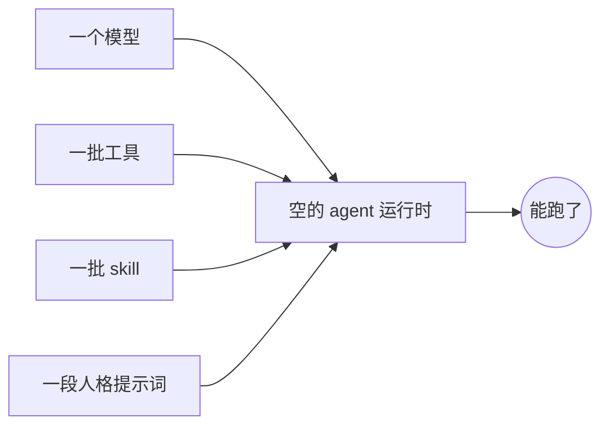

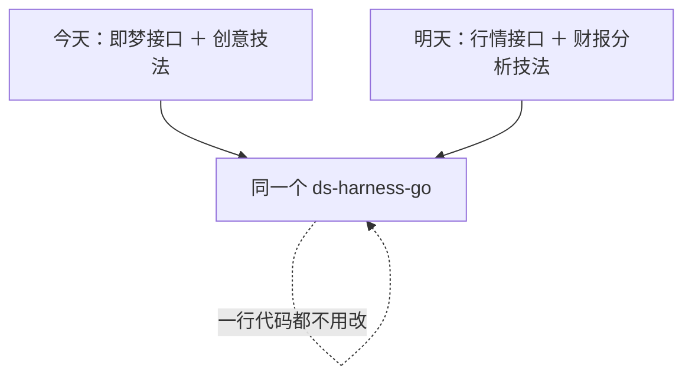

落到可执行的规矩上，三条：

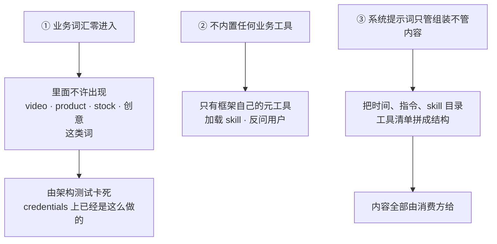

反过来也要说清楚：

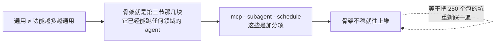

---

## 二、这不是什么

DSH 是**桌面编程助手**：给一台机器上的一个人用，主业是改代码、跑测试、执行 shell。

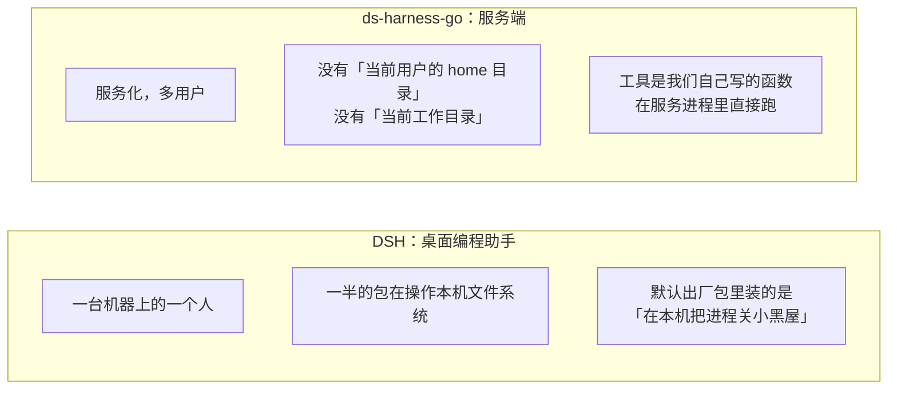

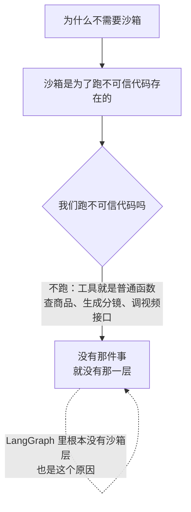

一句话：

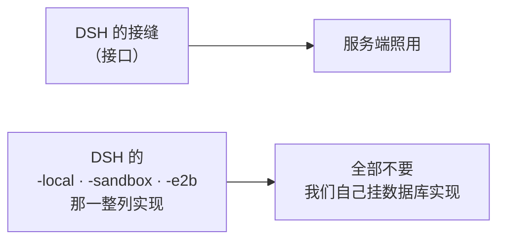

---

## 三、范围：九块

范围由消费方定，不由 DSH 的包列表定。

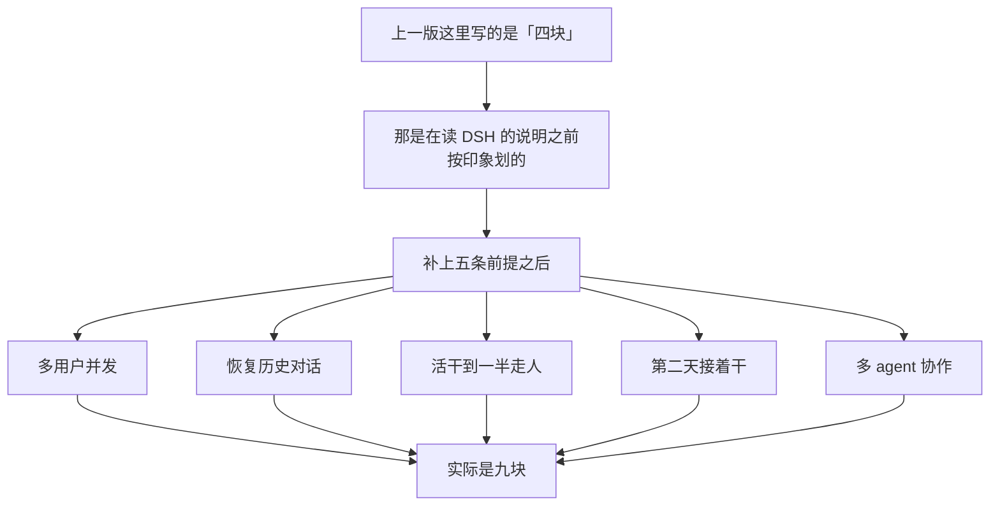

真正的分界是**两条线**，后四块整个漏在了第二条线上：

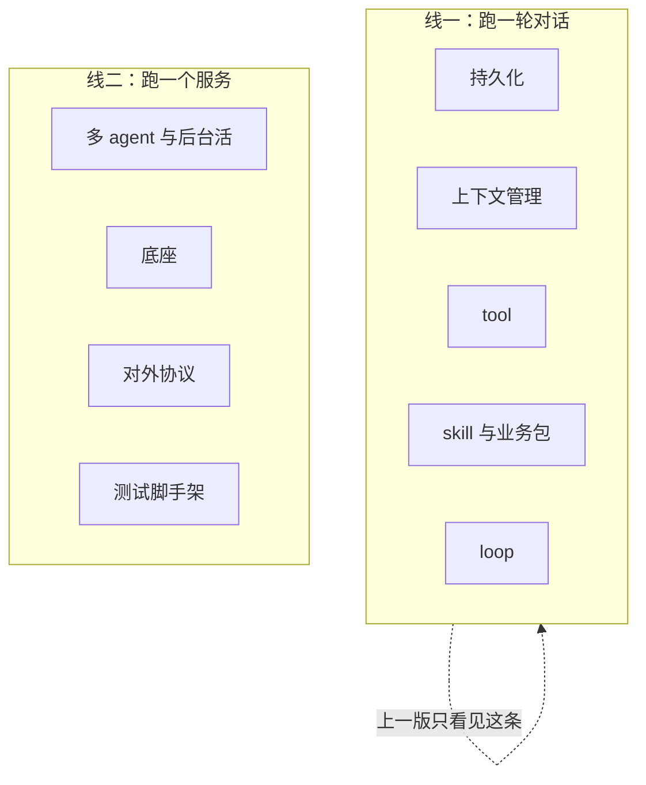

| 块 | 数 | 要解决的问题 |
|---|---|---|
| **持久化** | 17 | 会话、凭据、附件、资源文件存哪；崩了怎么恢复；过大的工具结果外置到哪 |
| **上下文管理** | 6 | 对话变长之后喂给模型的东西怎么组织、怎么压缩 |
| **tool** | 11 | 工具怎么声明、怎么校验参数、怎么要审批、结果怎么回给模型 |
| **skill 与业务包** | 4 | 按需加载的提示词：平时只给模型看目录，用到了才把全文塞进上下文 |
| **loop** | 14 | 拿着上面几样把一轮对话跑完 |
| **多 agent 与后台活** | 18 | 前提 5 要的委派与协作；前提 3、4 要的活能跨进程活下来；外部事件怎么叫醒运行时 |
| **底座** | 4 | 设置、不变量、超时、输出留存 |
| **对外协议** | 3 | 消费方唯一的入口形状 |
| **测试脚手架** | 6 | 不用真模型跑完整轮次；崩溃路径要能在精确位置断开 |

对应 DSH 的包，**83 个**（不是 250，也不是更早那一版猜的 46）。逐包的理由在
[`portmap/rulings.md`](portmap/rulings.md)，依据是那 2009 条功能清单和五条前提。下面只列结论。

### 持久化（17）

```
storage/storage  storage/storage-domain  session/session-persistence
session/session-checkpoint-policy  session/session-projection
session/session-projection-cache  session/session-turn-outline
session/session-stats  session/session-telemetry
session-query/session-query  session-query/tool-session-query
credentials/credentials  attachment/attachment
spill/spill  spill/spill-policy  fs/fs  workspace/workspace
```

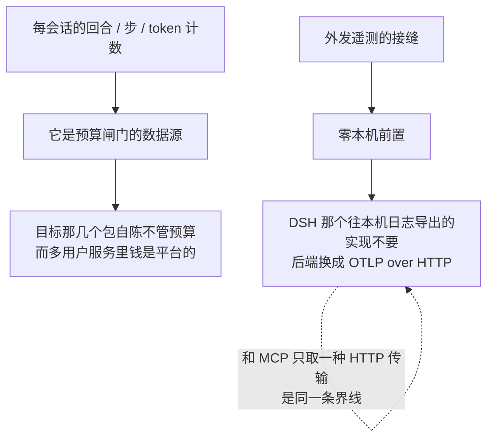

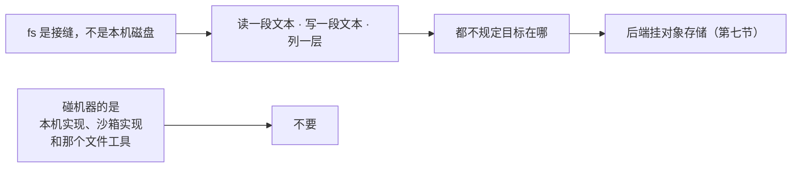

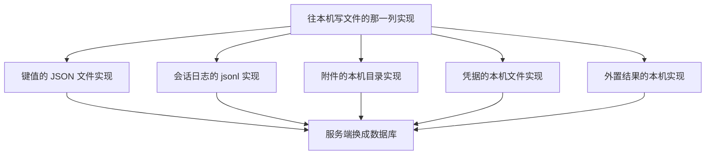

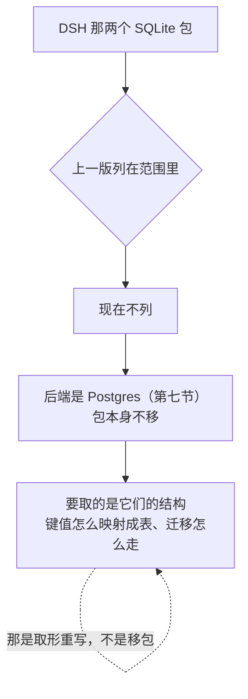

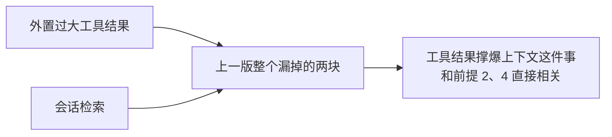

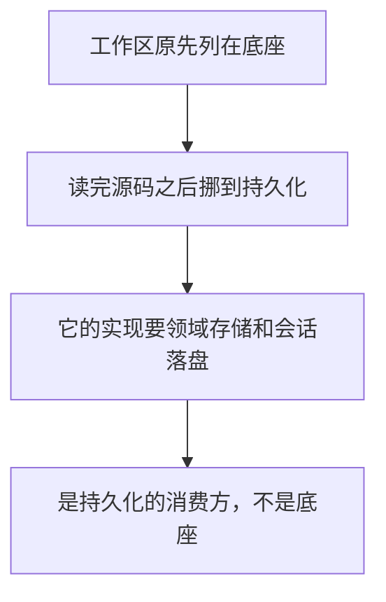

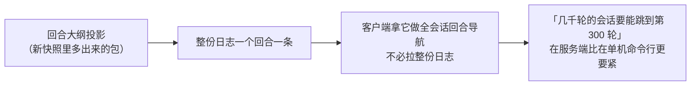

### 上下文管理（6）

```
context/agent-instructions  context/session-reference  context/time-context
compaction/compaction  compaction/compaction-basic
compaction/compaction-tool-result-pruner
```

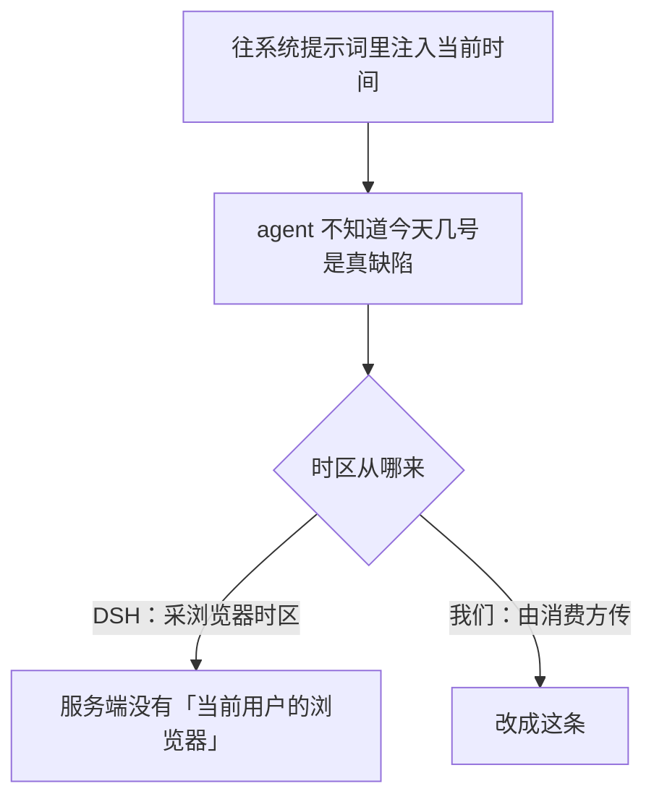

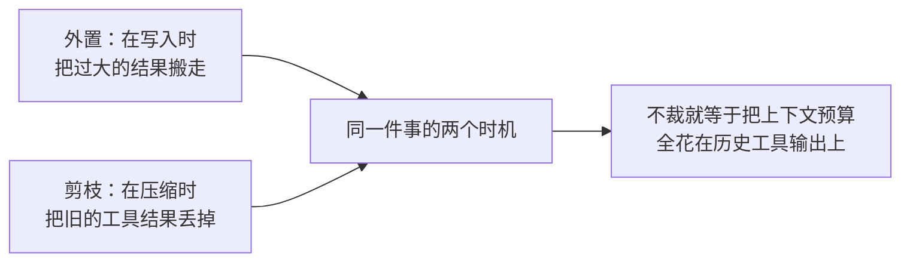

```mermaid
flowchart LR
    A["整段总结和结果剪枝<br/>是消费方裁定要的"] --> B["接缝没有实现方就是空的"]
    B --> C["而这两个都不依赖任何本机资源"]
```

不要读本地文件的引用包和读终端的上下文包。

### tool（11）

```
core/tools  guard/timeout-policy  guard/repeat-tool-reminder
interaction/user-approval  interaction/tool-ask-user
interaction/permission-presets  interaction/commands
interaction/user-questions  todo/tool-todo
plan/plan-mode  mcp/mcp-client
```

```mermaid
flowchart LR
    A["同一个工具被反复调用时<br/>提醒模型"] --> B["零前置"]
    B --> C["而模型卡在死循环里<br/>每多转一轮就是一次付费的模型调用"]
```

```mermaid
flowchart TD
    A["MCP 客户端"] --> B["把外部服务器的工具<br/>桥接进本地工具运行时"]
    B --> C["模型看到的是<br/>mcp__服务器名__工具名"]
    C --> D["它不提供任何能力"]
    D --> E["能力在对面那台服务器上"]
    E --> F["它只是一个插口<br/>让消费方不用为每个第三方服务<br/>各写一遍 Go 工具"]
```

```mermaid
flowchart TD
    A["MCP 两种传输"] --> B["stdio：要在本机起子进程"]
    A --> C["Streamable HTTP：一个网址加几个头"]
    B --> D["不移"]
    C --> E["只移这条，零本机前置"]
    E -.->|"和「fs 后端换对象存储」<br/>是同一条界线"| E
```

```mermaid
flowchart LR
    A["那条界线"] --> B["服务进程自己去某处取东西<br/>可以"]
    A --> C["在本机起进程<br/>不行"]
```

多用户下要补一件 DSH 不用管的：

```mermaid
flowchart TD
    A["服务器地址和请求头里的凭据"] --> B{"是谁的"}
    B -->|"DSH：写死在配置文件里"| C["单机单人，不存在这个问题"]
    B -->|"我们：每个用户各自的"| D["挂到凭据服务的归属校验上"]
```

```mermaid
flowchart TD
    A["DSH 那支编译期元数据机制<br/>三个包"] --> B["装饰器 ＋ 构建期扫源码"]
    B --> C["Go 有 struct tag、方法集和反射"]
    C --> D["整支一个包都不进来"]
    E["其中那个运行时反射注册表"] --> F["归「Go 已有等价物」<br/>反射 ＋ struct tag 白送"]
```

```mermaid
flowchart TD
    A["DSH 那个「工具怎么呈现给模型」的插件"] --> B["在三档之间选一个"]
    B --> C["两档要代码运行时<br/>而代码运行时已判不要"]
    C --> D["只剩一个可选值"]
    D --> E["而那个值本来就是工具运行时的默认"]
    E -.->|"一行插件选唯一值，等于不装"| E
```

### skill 与业务包（4）

```
skill/skill  skill/tool-skill  preset/agent-presets  preset/persona
```

不要从本机文件夹读的那个 provider，也不要前端角标那个。

```mermaid
flowchart TD
    A["skill 不是一种文件格式"] --> B["是一个 provider 接缝"]
    B --> C["注册表自己不知道 skill 从哪来"]
    C --> D["它只认三个方法"]
    D --> D1["报个名"]
    D --> D2["列目录：给候选，不含正文"]
    D --> D3["取正文：要用的时候才调"]
```

```mermaid
flowchart LR
    P1["文件夹 provider"] --> R["同一个注册表"]
    P2["数据库 provider"] --> R
    P3["远程注册表 provider"] --> R
    R --> Z["可以同时挂着"]
```

```mermaid
flowchart TD
    A["所以「库还是文件」<br/>在 DSH 那里根本不是二选一"] --> B["我们只是不装文件那个 provider"]
    B --> C["接缝一个字都不用改"]
```

字段是 DSH 定死的，不是我们发明的（源: `packages/skill/skill/src/index.ts`）：

| 字段 | 在哪一层 | 干什么 |
|---|---|---|
| 名字 | 目录 | 短横线小写，模型按它加载 |
| 一句描述 | 目录 | **必填非空**。模型只看这一句决定要不要加载 |
| 什么时候该用 | 目录 | 可选，补一句 |
| 谁能调起它 | 目录 | 模型能调 / 人能调，两个开关 |
| 从哪来的 | 目录 | 用于排障和展示 |
| 配套资源在哪 | 目录 | 可选 |
| 重名时谁赢 | 候选 | **同一层内**重名时比这个，小的赢 |
| provider 自己的句柄 | 候选 | 不透明，别人不许解释 |
| 正文 | 正文 | markdown 全文，取过之后才进上下文 |

```mermaid
flowchart TD
    A["那一句描述是最要命的字段"] --> B["模型看不到正文<br/>只靠这一句路由"]
    B --> C["这句写砸了<br/>那篇 skill 就等于不存在"]
    C -.->|"写得再好也永远不会被调用"| C
```

```mermaid
flowchart TD
    A["「配套资源在哪」是三选一"] --> A1["一个目录"]
    A --> A2["一个网址"]
    A --> A3["一句不透明的描述"]
    A1 --> B["服务端永远不产出目录那个变体"]
    B --> C["全仓库产出它的只有<br/>本机文件夹 provider 和前端角标 provider<br/>两个都不移"]
    A2 --> D["我们产出网址（指向对象存储）"]
    A3 --> D
```

```mermaid
flowchart LR
    A["顺带把这个变体的性质说死"] --> B["它全仓库只被渲染函数读一处"]
    B --> C["产物是提示词里的一行说明文本"]
    C --> D["没有任何代码拿它去打开文件"]
    D -.->|"它是给模型看的一句话<br/>不是一个句柄"| D
```

**真正的挂载单位不是单条 skill，是业务包：**

```mermaid
flowchart LR
    P["一个业务包"] --> P1["一组工具"]
    P --> P2["一组 skill"]
    P --> P3["一段人格／指令提示词"]
```

```mermaid
flowchart TD
    A["skill 和 tool 必须一起切"] --> B{"不一起切会怎样"}
    B --> C["做 A 业务的用户<br/>在工具清单里看见了 B 的工具"]
    C --> D["模型看见了就会去调"]
```

```mermaid
sequenceDiagram
    participant C as 消费方
    participant U as 用户 / 工作区
    participant S as 开会话时
    C->>C: 启动时定义若干业务包
    U->>U: 记着挂了哪几个
    S->>S: 按这个用户挂载的包组装
    S-->>S: 他这次的工具清单
    S-->>S: 他这次的 skill 目录
    S-->>S: 他这次的系统提示词
```

```mermaid
flowchart LR
    A["同一个进程里"] --> B["A 用户跑的 agent"]
    A --> C["B 用户跑的 agent"]
    B --> D["两个完全不同"]
    C --> D
    D --> E["共用一套 ds-harness-go"]
```

```mermaid
flowchart TD
    A["DSH 有同一个概念<br/>「按会话组装 agent」"] --> B["但它的实现绑在<br/>一份插件树配置上"]
    B --> C["描述的是「装哪些插件」"]
    C --> D["我们不要那个容器<br/>所以这块重做"]
    D --> E["描述的是<br/>「挂哪些工具集、哪些 skill 集、哪段人格」"]
```

**分层这件事 DSH 已经有了，缺的只是归属。**

```mermaid
flowchart LR
    G["全局层"] --> P["链上最远的祖先"] --> N["最贴近的作用域"] --> R["近的那层同名条目<br/>直接盖掉远的"]
    R -.->|"「重名时谁赢」那个数<br/>只在同一层内决胜"| R
```

```mermaid
flowchart LR
    A["工具注册表用的是同一条规则"] --> B["而这套叠放结构就在 scope 里"]
    B --> C["已经移过来了"]
    C --> D["「A 业务的用户看不见 B 的 skill」<br/>不需要新发明机制"]
    D --> E["把业务包挂成一层就行"]
```

真正要新增的是 DSH 不需要的那一半——它单机单人，不存在「这是谁的」：

```mermaid
flowchart TD
    A["① 三层可见性"] --> A1["平台内置 / 租户 / 用户私有<br/>各占一层"]
    B["② 加载时校验归属"] --> B1["用户 A 调「加载 B 的技能名」<br/>必须被拒"]
    C["③ skill 目录按用户组装进系统提示词"] --> C1["不是常量"]
```

```mermaid
flowchart TD
    A["只靠分层够不够"] --> B["分层决定「看得见什么」"]
    A --> C["归属决定「够得着什么」"]
    B --> D["一个猜到名字的调用<br/>绕得过前者"]
    C --> E["绕不过后者"]
    E -.->|"跟凭据的归属校验同一个道理<br/>每个操作都带「谁」，不靠调用方自觉"| E
```

第三条有个必须提前定死的副作用：

```mermaid
flowchart TD
    A["每个用户的 skill 目录不同"] --> B["模型的前缀缓存就分裂了"]
    B --> C["缓解办法"]
    C --> C1["「所有人都一样」的部分<br/>内置目录、通用指令<br/>排在系统提示词前面"]
    C --> C2["用户私有的排后面"]
    C1 --> D["前缀能共享多少算多少"]
    C2 --> D
    D -.->|"这个顺序一开始定好<br/>后面再改就是全员缓存失效"| D
```

### loop（14）

```
core/agent  core/agent-loop  core/session  core/scope  core/system-prompt
core/agent-default-model  session/session-title  session/session-title-llm
session/session-title-first-prompt-llm  session/session-title-all-prompts-llm
llm/llm  llm/llm-retry  llm/llm-pi-ai  llm/token-meter
```

```mermaid
flowchart TD
    A["会话标题这条接缝在主干挂载清单里"] --> B["接缝没有实现方就是空的"]
    B --> C["所以三个提供方一起进来"]
    C --> C1["共享策略与路由"]
    C --> C2["按首条消息生成<br/>默认走这条，最省"]
    C --> C3["总结全部消息<br/>更好也更贵"]
    C1 --> D["三个都只调模型接缝，零本机前置"]
    C2 --> D
    C3 --> D
```

```mermaid
flowchart LR
    A["DeepSeek 官方接口的适配器"] --> B["不要：走本地模型"]
    C["OpenAI 兼容协议的<br/>通用多提供方适配器"] --> D["要：本地模型正好走这条"]
    D -.->|"上一版整个漏了"| D
```

```mermaid
flowchart TD
    A["默认模型这个包"] --> B["它记住默认用哪个模型"]
    B --> C{"不装会怎样"}
    C --> D["每开一个会话<br/>都得由调用方点名模型"]
    E["它自陈只有一项进程级默认值"] --> F["「每个会话的选择仍由入口负责」"]
    F --> G["多用户下「这个用户偏好哪个模型」<br/>是每人各自的"]
    G --> H["要在它上面按用户叠一层<br/>做法同凭据的归属"]
```

### 多 agent 与后台活（18）

```
subagent/subagent  subagent/subagent-in-process-driver
subagent/subagent-spawn-in-process  subagent/subagent-fork-in-process
subagent/tool-subagent  subagent/tool-subagent-control
subagent/tool-subagent-report  workflow/workflow  workflow/tool-ralph
jobs/jobs  jobs/jobs-local  jobs/tool-jobs  schedule/schedule
goal/goal  goal/goal-round-driver  goal/tool-goal  goal/command-goal
webhook/webhook
```

```mermaid
flowchart TD
    A["上一版把这一支全挂在「未定」"] --> B["前提 5：多 agent 协作"]
    A --> C["前提 3、4：活干到一半跨天"]
    B --> D["把它们定死了"]
    C --> D
```

```mermaid
flowchart LR
    A["四个进程外的子 agent 提供方"] --> B["各自自陈<br/>「每次运行使用全新进程」<br/>「仅支持本地子进程」"]
    B --> C["都不要"]
```

```mermaid
flowchart TD
    A["这一支同时是缺口最集中的地方"] --> B["多 agent 域是<br/>一半有、一半自陈无"]
    B --> C["全清单唯一对半开的域"]
    C --> D["缺的那半正好是前提 3、4 要的<br/>跨进程驻留、持久上报信箱"]
    E["后台作业更麻烦"] --> F["「约定是进程内的」是接缝自陈"]
    F --> G["换实现也补不上<br/>而它在主干里"]
```

```mermaid
flowchart LR
    A["目标那四个包<br/>是消费方定的"] --> B["DSH 作者自己把它们标成可选"]
    B --> C["给的能力是<br/>一次交代<br/>agent 自己一轮接一轮<br/>跑到完成／阻塞／轮数上限"]
    C --> C1["一个存目标状态"]
    C --> C2["一个在 agent 空闲时自动排下一轮"]
    C --> C3["一个让模型声明完成或阻塞"]
    C --> C4["一个让人喊暂停"]
```

这一支带两个必须写在这里的事实：

```mermaid
flowchart TD
    A["① 它只数轮数"] --> A1["不计 token"]
    A --> A2["不计钱"]
    A --> A3["不计时间"]
    A --> A4["不计提供方配额"]
    A1 --> B["DSH 是桌面单机<br/>钱是用户自己的<br/>跑飞了按一下就停"]
    B --> C["服务端三条全反过来"]
    C --> D["预算闸门不在这四个包里<br/>要在消费它的那一层加"]
```

```mermaid
flowchart TD
    A["② 续行权限从不持久化"] --> B["会话恢复或分叉之后<br/>目标还在、阶段还是进行中"]
    B --> C["但不会自动重启工作<br/>必须显式说「继续」"]
    C --> D["这是作者有意的设计，不是缺陷"]
    D --> E["但它意味着目标那几个包<br/>没有替前提 3、4 解决跨天续跑"]
    E -.->|"别把它当成那个答案"| E
```

```mermaid
flowchart LR
    A["webhook 是新快照里多出来的包"] --> B["也是这一块唯一<br/>「从外面叫醒运行时」的入口"]
    B --> C["一条规则把「什么外部事件」映射成<br/>用哪个工作区、哪个预设、哪个模型<br/>哪套权限，开一个会话跑什么提示词"]
    C --> D["发出去就不管"]
```

```mermaid
flowchart TD
    A["零本机前置"] --> B["它要的工作区、预设<br/>默认模型、会话标题，我们全有"]
    B --> C["这是一块实打实的缺口"]
    C --> D["现在的运行时<br/>只能被人从协议层叫醒"]
    E["提供方那一侧<br/>（签名校验与 HTTP 路由）"] --> F["取形重写，不移包"]
```

### 底座（4）

```
runtime-diagnostics/invariants  util/timeout  util/output-retention
settings/settings
```

```mermaid
flowchart TD
    A["DSH 的通用工具那一支<br/>有八个包单列一档「Go 已有等价物」"] --> B["行为要，手段不要，不移包"]
    B --> B1["类型标记 → 类型别名 ＋ 未导出字段"]
    B --> B2["原子写 → 标准库的写文件与改名"]
    B --> B3["随机与十六进制 → 标准库"]
    B --> B4["双端队列 → 切片或链表"]
    B --> B5["时区加载 → 标准库"]
    B --> B6["值比较与序列化 → 标准库"]
    B --> B7["工作区路径 → 标准库的路径包"]
    B --> B8["运行时反射注册表 → 反射 ＋ struct tag"]
```

**这一块已经做完了。** 原先列在这里的另外三个包，逐个读完源码之后都不在这里了：

```mermaid
flowchart TD
    A["工作区"] --> A1["实现要领域存储和会话落盘<br/>两者都在持久化那一块"]
    A1 --> A2["它不是底座<br/>是持久化的消费方"]
    B["钩子协议"] --> B1["它是别家两套钩子配置格式的共享内核"]
    B1 --> B2["核心动作是在本机跑用户写的 shell 命令<br/>按退出码拦住 agent"]
    B2 --> B3["shell 全族已因「服务端不提供沙箱」出局<br/>执行器随之没了"]
    B3 --> B4["整包出局"]
    C["桌面启动器"] --> C1["它的全部非标准库依赖<br/>是那个插件框架本体加四个插件"]
    C1 --> C2["干的事：读插件树配置<br/>读本机 profile 目录下的包<br/>靠模块解析找到插件、挂进装载器、监听热重载"]
    C2 --> C3["那个框架不移植，它一没<br/>这个包就只剩「把配置里写的插件名变成实例」"]
    C3 --> C4["Go 里这件事是在入口函数里写构造函数<br/>编译期就查得出来"]
```

### 对外协议（3）

```
acp/acp  sdk/protocol  sdk/server
```

```mermaid
flowchart LR
    A["上一版把这几个挂在「未定」<br/>或者「整包不要」"] --> B["协议方法表和通知表<br/>是消费方唯一的入口形状"]
    B --> C["要移"]
    C --> D["承载从 stdio 换成 HTTP"]
```

### 测试脚手架（6）

```
test-support/llm-replay  test-support/llm-mock-server
test-support/agent-loop-testkit  test-support/acp-snapshot
test-support/session-snapshot  test-support/loader-smoke
```

```mermaid
flowchart TD
    A["ACP 快照那个包 DSH 已删"] --> B["继任者是会话快照"]
    B --> C["作者把它扩成了通用的会话日志快照核心<br/>ACP 只是它的一个协议适配器"]
    C --> D["要的是三样"]
    D --> D1["清单化的夹具"]
    D --> D2["身份脱敏"]
    D --> D3["期望输出归一化"]
    D3 --> E["没有归一化<br/>任何带时间戳和 ID 的会话日志<br/>都没法做快照比对"]
    F["它的工作区文件快照那部分不要"] --> G["那部分的前置是本机文件系统"]
```

```mermaid
flowchart TD
    A["上一版把测试脚手架整支排除<br/>理由是「它自己的脚手架」"] --> B["错了"]
    B --> C["没有模型回放<br/>前提 3、4 那些「进程中途死掉」的路径<br/>根本没法写测试"]
    C --> D["崩溃恢复的用例<br/>要求在精确的位置断开"]
    D --> E["真模型给不了这个精确度"]
```

### 不移包，但要取形重写（23）

```
bundle/base  bundle/headless  bundle/web-app
bundle/acp-app  bundle/sdk-app  bundle/sdk-minimal
examples/agent-spine-demo  examples/acp-demo  examples/jsonrpc-demo
host/apiproxy  api/gateway  api/remotes  sdk/client
api/session-controller  api/settings-controller  api/workspace-controller
experimental/agent-team  experimental/tool-agent-team
storage/storage-sqlite  session-query/session-query-sqlite
credentials/authorization  llm/deepseek-llm-api-extensions
webhook/webhook-github
```

```mermaid
flowchart TD
    A["这一批绑在<br/>插件框架 / 浏览器 / 子进程驱动上"] --> B["不移"]
    B --> C["但里面记着三样东西"]
    C --> C1["装配顺序"]
    C --> C2["对外 API 方法清单"]
    C --> C3["协议形状"]
```

```mermaid
flowchart LR
    A["那两个 SQLite 包"] --> B["后端已定 Postgres（第七节）<br/>包不移"]
    B --> C["取的是键值怎么映射成表<br/>迁移怎么走<br/>查询的表结构与索引"]
```

```mermaid
flowchart TD
    A["OAuth 与人工授权流程"] --> B["形状要，实现要重写"]
    B --> C["它自陈「流程不可恢复」<br/>那是浏览器进程的限制"]
    C --> D["和前提 3、4 直接相撞"]
```

新快照带来的五个：

```mermaid
flowchart TD
    A["三个控制器<br/>会话 / 设置 / 工作区"] --> A1["「浏览器要什么<br/>宿主就得答什么」的方法表"]
    A1 --> A2["承载换成 HTTP，方法表照录"]
    B["三份组合包"] --> B1["取的还是装配顺序"]
    C["模型请求的扩展字段注册表"] --> C1["「插件各认领一个顶层字段<br/>声明式合并」的形状"]
    C1 --> C2["已落在 OpenAI 兼容适配器里"]
    D["签名校验 ＋ 单条 HTTP 路由<br/>＋ 立刻回一个已接受"] --> D1["配合 webhook 那个接缝"]
```

```mermaid
flowchart TD
    A["扩展位为什么留在适配器<br/>而不是模型契约里"] --> B["顶层字段是某一条线上协议自己的事"]
    B --> C["换条协议就换套字段名"]
    C --> D["写进契约等于让每个适配器<br/>都得认一个只有一家看得懂的形状"]
```

```mermaid
flowchart LR
    A["agent 团队是消费方裁定要的能力"] --> B["多个 agent 之间的持久信箱<br/>＋ 共享任务板"]
    B --> B1["花名册状态机"]
    B --> B2["攒着不打断 / 立刻唤醒<br/>两档投递"]
    B --> B3["修订号对不上就拒绝的任务板<br/>任务之间是有向无环图"]
```

```mermaid
flowchart TD
    A["包不移"] --> B["它自陈「单进程、共享检出」<br/>「信箱不保证跨进程恰好一次」"]
    B --> C["和前提 1、4 直接相撞"]
    C --> D["照其原样落进来<br/>等于把单进程假设焊死"]
    E["但这三样的形状与进程模型无关"] --> F["换成数据库存储照样成立"]
    F --> G["修订号比对本来就是为并发写设计的"]
```

```mermaid
flowchart TD
    A["这一条已经落地"] --> B["三样形状照其原样取<br/>进程模型整个换掉"]
    B --> C["团队状态不折队长的会话日志"]
    C --> D["落在花名册、任务板、收件箱三处存储上<br/>谁在哪个副本上都能改"]
    B --> E["信箱明确只承诺至少一次"]
    E --> F["抓着消息的副本掉线之后<br/>别人过了认领期就能捡回来重送"]
    B --> G["等待也补上了"]
    G --> H["DSH 那张进程内的等待者名单<br/>在多副本下等不到别处那次改动"]
    H --> I["换成介质上的条件轮询<br/>只承诺看得见本次调用之后的改动"]
```

---

## 四、不要的（143 个）

```mermaid
flowchart LR
    A["257 行"] --> B["需要 83"]
    A --> C["取形重写 23"]
    A --> D["Go 已有等价物 8"]
    A --> E["不要 143"]
    A --> F["说不清 0"]
    F -.->|"每一行都有终判"| F
```

```mermaid
flowchart TD
    A["为什么是 257 而不是 250"] --> B["清单里留着 7 行 DSH 已删的包"]
    B --> C{"删掉它们会怎样"}
    C --> D["「我们当初判过它」这件事<br/>就没人看得见了"]
    D --> E["下一个人会照着新快照<br/>重新判一遍"]
```

### 「不要」的判据只有一条

```mermaid
flowchart TD
    A["它有一个我们给不了的前置"] --> B{"注意区别"}
    B -->|"不是"| C["「用不上」"]
    B -->|"是"| D["「装不上」"]
```

| 域 | 数 | 给不了的前置 |
|---|---|---|
| 客户端 | 45 | 浏览器 DOM / React。有自己的前端 |
| shell | 10 | 本机命令执行；接缝无沙箱可挂 |
| 宿主 | 7 | 桌面对话框 / 本机磁盘 / 内建 HTTP；插件清单在 Go 里没有那个装载器 |
| 实验性 | 6 | 三个是插件装配清单（团队接缝已落地，清单本身不是能力）；一个要 Chrome 调试协议，两个是纯浏览器运行时 |
| 文件系统 | 6 | 本机磁盘读写；观察策略也不要——后端是对象存储，模型不逐个读文件，没有观察对象 |
| 网络搜索 | 6 | 三个搜索提供方都要第三方 API key，现在没有数据源；抓取单独存在没用。**推后，不是永久出局**——接缝零依赖，补回来不动已有代码 |
| 子 agent | 4 | 本机子进程（四个进程外提供方） |
| 沙箱 | 4 | 本机沙箱；接缝没有实现方 |
| 动态扩展 | 4 | 浏览器页面 ＋ 虚拟机沙箱执行，两个前置都给不了 |
| 会话 | 4 | 本机文件或 SQLite 落盘、遥测外发、浏览器 ZIP 下载 |
| 编译期元数据 | 3 | TypeScript 编译期元数据与构建期源码分析 |
| 通用工具 | 3 | 本机路径 / 启动环境 / 原生命令 |
| 上下文 | 3 | 本机文件引用、终端 |
| 钩子 | 3 | 两套钩子配置的方言桥与共享内核，动作是在本机跑用户写的 shell 命令 |
| 终端 · 代码运行时 · LSP · 远程沙箱 · 子进程 | 各 3 | 终端 / Python 与工作线程 / LSP 的 stdio / 远程沙箱 / 起本机进程；前四支的接缝同样无沙箱可挂 |
| skill · 反馈 · 工作流 · 模型 · 启动 | 各 2 | 本机文件夹 / 前端角标 / JavaScript 编排脚本与工作线程引擎 / DeepSeek 官方接口直连 / 桌面启动器与插件装载器 |
| 其余十支 | 各 1 | 手动压缩入口（推后）/ 本机文件 / 本机凭据文件 / 本机附件目录 / SQLite 后端 / 本机 JSON 文件 / 本机设置文件 / 桌面匿名标识 / 只剩默认值的呈现插件 / 前端脚手架 |

### 上一版这张表有三处是错的

```mermaid
flowchart TD
    A["① 那 35 个<br/>上一版是整支不装"] --> B["错了"]
    B --> C["这八支各自有一个纯接缝包"]
    C --> D["纯服务定义，零本机前置"]
    C --> E["碰机器的是<br/>本机实现 / 沙箱实现 / stdio 实现<br/>那一列，和它们的工具"]
    E --> F["实现那 24 个：不要"]
    D --> G["接缝 11 个后来也定完了<br/>文件系统那条要，其余 10 条不要"]
    F --> H["35 ＝ 11 ＋ 24"]
    G --> H
```

```mermaid
flowchart LR
    A["② 测试脚手架整支<br/>被当成「它自己的脚手架」排除"] --> B["错了，见第三节"]
    C["③ 外置与 ACP<br/>被当成「大输出写本地文件 /<br/>编辑器集成协议」整支排除"] --> D["两个接缝都要<br/>只有本机外置实现不要"]
```

### 说不清清零

```mermaid
flowchart TD
    A["这一档曾经有 20 个"] --> B["含义是「五条前提没要求它<br/>要不要由消费方定」"]
    B --> C["不是「不要」"]
    C --> D["现在一个都不剩"]
```

| 走向 | 包数 | 判据 |
|---|---|---|
| **需要** | 7 | 零本机前置，且各自补上一个真缺陷：不知道今天几号 / 死循环白烧钱 / 没有预算数据源 / 线上出事没法查 / 接缝没实现方 |
| **取形重写** | 3 | 结构值得取形，实现要按 Postgres 与可恢复流程重写 |
| **Go 已有等价物** | 1 | 反射 ＋ struct tag 白送 |
| **不要** | 9 | 各自的前置：唯一可选值 / 没有观察对象 / 浏览器加虚拟机沙箱 / 别家产品的钩子点 / 插件装载器 / 前端脚手架 |

**执行那一整支也在这里定完了。**

```mermaid
flowchart TD
    A["shell · 沙箱 · 终端 · 子进程<br/>代码运行时 · LSP · 远程沙箱<br/>九个纯接缝"] --> B["它们零本机前置不假"]
    B --> C["但语义是「执行命令／代码／终端」"]
    C --> D["而那件事的前置是沙箱"]
    D --> E["服务端不提供沙箱"]
    E --> F["所以这九条接缝<br/>一个实现方都挂不上"]
    F --> G["接缝没有实现方，就是空的"]
    G --> H["那 24 个实现包<br/>也不用写远程版的替代了"]
```

---

## 五、目录结构

### 最早那版做法是错的

```mermaid
flowchart TD
    A["根目录平铺<br/>包名每次现起"] --> B["域名丢掉或者粘进包名"]
    B --> C["后果一：根目录看不出谁跟谁是一伙的"]
    B --> D["后果二：同一件事有两套规则<br/>有的嵌套了，有的没嵌"]
```

### 中间定过一版，也被取代了

```mermaid
flowchart TD
    A["那一版的规则"] --> A1["镜像 DSH 的域分组"]
    A --> A2["接缝包占域名本身<br/>同域其它包挂在它下面"]
    A1 --> B["它解决了「看不出谁跟谁一伙」"]
    B --> C{"但没解决另一件事"}
    C --> D["百来个包平铺在顶层<br/>打开看不出主次"]
    D --> E["其中只有十来个是对外门面<br/>其余是实现"]
    E --> F["两者平铺在一起<br/>读的人分不出该看哪个"]
```

### 现在的规则

```mermaid
flowchart TB
    Root["模块根"]
    Root --> C1["契约包平铺在顶层<br/>llm · tools · scope · storage · fs<br/>sessionlog · attachment · spill<br/>settings · credentials · invariants"]
    Root --> C2["harness/<br/>运行期本身与装配门面"]
    Root --> C3["feature/　能力"]
    Root --> C4["adapter/　生产后端实现"]
    Root --> C5["protocol/　对外线协议"]
    Root --> C6["internal/　模块外不可见"]
    Root --> C7["cmd/　可执行文件"]
```

```mermaid
flowchart TD
    A["为什么契约包不套进任何容器"] --> B["它们是这个模块对外的门面"]
    B --> C["一层目录都不该隔"]
    D["为什么 harness 单列一个顶层目录"] --> E["宿主装配这件事只有一个入口"]
    E --> F["不该让人先猜它在哪个容器里"]
```

```mermaid
flowchart LR
    A["目录名是给人读的索引"] --> B["它不是承诺"]
    C["真正的约束是<br/>档位表 ＋ 一道门禁"] --> D["低档 import 高档就变红"]
    D --> E["把一个包挪进 feature/<br/>不会让它变成一个能力包"]
    E --> F["只会让门禁按能力包的规矩查它"]
    F -.->|"目录名骗得了人，骗不过门禁"| F
```

完整的分层规则与门禁在[总体架构](architecture.md)，包到文档的映射在 [`packages.md`](packages.md)。

```mermaid
flowchart LR
    A["Go 的包名保持短名"] --> B["只有导入路径带层级"]
    C["迁移时不动 package 声明"] --> D["所以裁决表里那几千行的<br/>Go 落点列一个字都不用改"]
```

---

## 六、现有 Go 代码的处置

这一节记的是那一次裁剪，**已经执行完**。留着是为了让人知道那些目录去哪了。

**留下并搬位置**

| 那时叫 | 搬到 | 属于 |
|---|---|---|
| `invariants/` | `invariants/` | 底座 |
| `storage/` | `storage/` | 持久化 |
| `storage/storagetest/` | `storage/storagetest/` | 接缝一致性测试套件 |
| `credentials/` | `credentials/` | 持久化 |
| `attachment/` | `attachment/` | 持久化 |
| `scope/` | `scope/` | loop |
| `timeout/` | 底座 | 底座 |
| `outputretention/` | 底座 | 底座（工具输出截断） |
| `llmmockserver/` | `llm/mockserver/` | 测模型接缝用的脚手架 |

**删掉**

| 目录 | DSH 来源 | 理由 |
|---|---|---|
| `anonymousid/` | 桌面匿名标识 | 服务端有自己的用户体系 |
| `atomicwrite/` | 原子写 | 只服务本机文件写入 |
| `cmdline/` | 启动参数 | 桌面版的 |
| `coderuntime/` `coderuntimepython/` | 代码运行时 | 执行代码 |
| `dirbrowse/` `dirpicker/` | 目录选择器 | 让对话挑服务器目录 |
| `frontendstatic/` | 前端静态文件 | 桌面版静态文件服务 |
| `webserver/` | 内建 HTTP 宿主 | 消费方有自己的 |
| `homepaths/` `launchenv/` `nativecmd/` | 通用工具三个 | 本机 home、启动环境、执行本机命令 |
| `sandboxwinacl/` | Windows ACL 沙箱 | 沙箱 |
| `subprocess/` `e2b/` | 子进程 / 远程沙箱 | 起进程、远程沙箱 |
| `storage/storagejson/` | 键值的 JSON 文件实现 | 本地文件实现，服务端用 Postgres |
| `typertprotocol/` | 编译期元数据协议 | 整支不移，见第三节 |

```mermaid
flowchart LR
    A["删掉的东西"] --> B["裁决表里对应那行<br/>同步改成「范围外」"]
    B --> C["理由统一写「服务化范围外」"]
    C --> D["不删裁决行"]
    D -.->|"留着才知道当初为什么没做"| D
```

---

## 七、数据放哪儿

### 服务端没有本地目录，一个都没有

```mermaid
flowchart TD
    A["这不是靠沙箱限制出来的"] --> B["是那一层压根不装"]
    B --> C["本机文件实现 · 本机 shell 实现<br/>本机沙箱 · 本机终端 · 本机子进程<br/>Python 运行时 · LSP 的 stdio<br/>那一列实现"]
    B --> D["文件工具 · shell 工具<br/>终端工具 · LSP 工具<br/>那一列工具"]
    C --> E["共 24 个包划在范围外"]
    D --> E
```

```mermaid
flowchart TD
    A["「一条删除命令把服务器清了」"] --> B{"有发生路径吗"}
    B --> C["agent 的工具清单里<br/>没有任何能碰目录或命令的东西"]
    C --> D["不是被拦住"]
    C --> E["是没有那个工具"]
```

```mermaid
flowchart LR
    A["接缝不在此列"] --> B["文件接缝只是<br/>读一段 · 写一段 · 列一层<br/>这么一组方法"]
    B --> C["不规定目标在哪"]
    C --> D["它要，后端挂对象存储"]
```

```mermaid
flowchart TD
    A["那条界线"] --> B["危险的是<br/>「模型给个路径<br/>就能读写任意目录」"]
    A --> C["不危险的是<br/>「服务进程自己<br/>去某处取一份资源」"]
    B --> D["不装"]
    C --> E["走对象存储"]
```

```mermaid
flowchart LR
    A["skill 那个「资源在某个目录」的变体<br/>也不是口子"] --> B["产出它的两个 provider 都不移"]
    B --> C["而它全仓库只被渲染函数读一处<br/>渲染成提示词里的一行文本"]
```

### 按数据形态分，不是一个答案

| 数据 | 形态 | 放哪儿 | 为什么 |
|---|---|---|---|
| 会话事件日志 | 结构化，按会话顺序读 | **数据库** | 要按「会话 ＋ 序号」顺序取和追加，对象存储做不了这件事 |
| skill 内容 | 一篇正文加它带的资源文件 | **对象存储**，库里只留索引 | 见下一小节 |
| 凭据 | 短字符串 | **数据库 ＋ 环境变量** | 归属校验在库里做 |
| 图片附件 | 几十 KB ~ 几 MB 二进制 | **对象存储** | 库里只留 key ＋ 摘要 ＋ 大小；内容按需取 |
| 生成的视频 | 几十 ~ 几百 MB | **对象存储，且不走附件接缝** | 那条接缝的方法是整块字节进出，几百 MB 走它等于把整个文件读进内存 |

```mermaid
flowchart LR
    A["一条界线"] --> B["「要查、要排序、要事务」的<br/>进数据库"]
    A --> C["「只按 key 整块取」的<br/>进对象存储"]
```

### skill 横跨这条界线，所以拆成两半

```mermaid
flowchart LR
    A["skill 不是一条记录"] --> B["是一个目录"]
    B --> C["一篇正文<br/>加上它可能带的资源文件"]
```

```mermaid
flowchart TD
    A["这个格式不是我们定的"] --> B["DSH 那个本机文件夹 provider<br/>读的就是它"]
    B --> C["而它读的又是那套公开的技能格式<br/>正文 ＋ 头部元数据<br/>名字和描述必填"]
    C --> D["照着存<br/>别人写好的 skill 原样丢上来就能用"]
```

| 存哪 | 放什么 |
|---|---|
| 对象存储 | 正文原文 ＋ 附带的资源文件，按目录原样存 |
| 数据库（一行几百字节） | 名字、描述、归属（内置 / 租户 / 用户）、挂载关系、对象存储的前缀 |

```mermaid
flowchart TD
    A["描述为什么必须进库"] --> B["每开一个会话都要按<br/>「这个用户挂了哪些」查一遍"]
    B --> C["把那几句话拼成目录<br/>塞进系统提示词"]
    D["对象存储只能按 key 取整个对象<br/>不能查"] --> E["放那边的话<br/>每次开会话都得<br/>先把全部 skill 拉下来读一遍"]
```

```mermaid
flowchart LR
    A["DSH 的接缝本来就是照这条线切的"] --> B["列目录只给候选<br/>含描述，不含正文"]
    A --> C["取正文才拿全文"]
    B --> D["正文晚一步再取<br/>正是为了让它能待在远处"]
    C --> D
```

```mermaid
flowchart TD
    A["搬过来的第三方 skill"] --> B{"哪些是死的"}
    B --> C["带脚本目录的那部分"]
    C --> C1["我们没有执行脚本的能力"]
    B --> D["在允许工具里点名<br/>读文件 / 写文件 / 跑命令 的"]
    D --> D1["那些工具我们一个都没有"]
    B --> E["能用的是纯方法论型的 skill"]
```

### 不做「先本地目录，以后换 S3」

```mermaid
flowchart TD
    A["这条一度考虑过，放弃了"] --> B["两个实现比一个实现复杂"]
    B --> C["而省下的只是一次对象存储部署"]
    C --> D["skill 本来就是一堆文件<br/>对象存储正是为这件事存在的"]
    D --> E["自建阶段跑一个自托管的<br/>接口和 S3 一样，真上云只换个地址"]
```

### 生产数据库只有 Postgres

```mermaid
flowchart LR
    A["键值这条接缝<br/>不是文件系统"] --> B["一个命名空间 ＋ 一个键<br/>＋ 一段不透明 JSON"]
    B --> C["而且它明写<br/>「记录键永远不会出现在文件路径里<br/>这是后端的义务」"]
    C --> D["后端换成什么<br/>上面的代码都看不见"]
```

```mermaid
flowchart TD
    A["判据不是吞吐"] --> B["是单机还是多机"]
    B --> C["SQLite 是一个文件<br/>靠操作系统的文件锁协调"]
    C --> D["所以两台机器共享不了"]
    D -.->|"别信网络文件系统"| D
```

```mermaid
flowchart TD
    A{"这三件里要做哪件"} --> A1["不停机发布"]
    A --> A2["备机"]
    A --> A3["扩一台"]
    A1 --> B["只要有一件<br/>SQLite 当场出局"]
    A2 --> B
    A3 --> B
    B --> C["而那一天要付的<br/>不是改个参数"]
    C --> D["是换后端 ＋ 一次数据迁移<br/>＋ 一次停机"]
    D --> E["既然迟早要走<br/>就不先修一条注定要拆的路"]
```

SQLite 的并发天花板顺带说清，免得以后有人以为那是个性能调优问题：

```mermaid
flowchart TD
    A["它的写锁粒度是整个数据库文件"] --> B["不是行，也不是命名空间"]
    B --> C["A 往自己的会话追一条事件<br/>B 往自己的追一条"]
    C --> D["这两条毫不相干的写<br/>照样一前一后"]
    D --> E["不是因为撞上了<br/>是因为锁就这么粗"]
```

```mermaid
flowchart LR
    A["原因"] --> B["SQLite 嵌在进程里<br/>没有仲裁进程"]
    B --> C["协调只能靠文件锁"]
    C --> D["而文件锁的单位就是文件"]
    E["Postgres 有那个进程"] --> F["所以写不同的行是真并行"]
    F --> G["而按主体分开的数据<br/>本来就不会撞同一行"]
```

```mermaid
flowchart TD
    A["代价说清楚，它是真的"] --> A1["本地开发和 CI<br/>都要有一个 Postgres 起着"]
    A --> A2["连接串和密码要管"]
    A --> A3["备份从「拷一个文件」<br/>变成一次导出"]
    A1 --> B["这笔成本是天天付的"]
    A2 --> B
    A3 --> B
    B --> C["换来的是后面不用再做一次<br/>带停机的迁移"]
```

### 内存后端与 SQLite 方言：同一个理由的两次应用

```mermaid
flowchart TD
    A["另装一个内存后端<br/>给上层包的测试用"] --> B["不碰任何数据库<br/>起停零成本"]
    B --> C["「必须有个库才能跑测试」的范围<br/>被压到只剩 SQL 那一层"]
```

```mermaid
flowchart TD
    A["它不是「第二个实现」的浪费"] --> B["它是那套一致性用例的<br/>第二个受测对象"]
    B --> C["套件早就在仓库里了"]
    C --> D{"只有一个后端可跑的时候"}
    D --> E["它的价值一分都没兑现"]
    B --> F["两个后端过同一套用例"]
    F --> G["「换后端不用改上层」<br/>才从一句主张<br/>变成每次跑测试都在验的事实"]
```

```mermaid
flowchart TD
    A["后来补了一个 SQLite 方言"] --> B["上面那条判据一个字没变<br/>生产仍然只有 Postgres"]
    B --> C["补它是为了另一件事"]
    C --> D["持久化抽象层底下那几千行<br/>每一行都要一个真的数据库才执行得到"]
    D --> E{"只认 Postgres 的时候"}
    E --> F["它们在开发机上永远跳过"]
    E --> G["在 CI 上只由一个环境变量<br/>决定跑不跑"]
    F --> H["于是「跑绿了」和「一行没跑」<br/>长得一模一样"]
    G --> H
```

```mermaid
flowchart LR
    A["缺省落在一个临时库文件上之后"] --> B["这批用例进了默认的测试命令"]
    C["设上 Postgres 连接串"] --> D["把同一批用例体<br/>换到 Postgres 上再跑一遍"]
    B --> E["两种方言过同一套用例<br/>方言那道缝才变成事实"]
    D --> E
```

```mermaid
flowchart LR
    A["上面那段 SQLite 的锁粒度依然成立"] --> B["而它对一个<br/>一次只跑一条用例的测试进程<br/>不构成问题"]
```

### 实现那一列

DSH 的实现换成服务端的，接缝一行不动：

| 接缝 | DSH 的实现 | 我们的实现 |
|---|---|---|
| 键值存储 | 本机 JSON 文件 / SQLite 文件 | Postgres（生产）＋ 内存后端（测试） |
| 会话落盘 | jsonl 文件 / SQLite | 同上 |
| 凭据 | 本机文件 ＋ 环境变量 | 数据库 ＋ 环境变量 |
| 附件 | 本机文件 | 对象存储，库里存元数据 |
| skill 的 provider | 从本机文件夹扫 | 自己写一个：目录查库、正文取对象存储 |
| 模型 | DeepSeek 官方接口 | 本地模型 |
| 文件 | 本机磁盘 | 对象存储；那个文件工具不装 |
| shell / 沙箱 | 各种本机沙箱与远程沙箱 | **没有** |

---

## 八、移植顺序

这一节记的是那次排程，**已经执行完**。

```mermaid
flowchart TD
    A["不按依赖层序从最底下无差别推平"] --> B["那个顺序不区分<br/>「服务端装不装得上」"]
    B --> C["会花几周移一堆<br/>永远不会被造出来的包"]
    D["按九块从下往上<br/>块内按依赖"] --> E["每块做完<br/>消费方应该能立刻用上一部分"]
    E --> F["而不是等全部包都绿"]
```

```mermaid
flowchart TB
    S1["① 底座<br/>不变量 · 超时 · 输出留存 · 设置"]
    S2["② 持久化<br/>键值 → 内存后端 → 领域存储<br/>→ 持久化抽象层 → 键值后端<br/>凭据 · 附件 · 文件 → 对象存储<br/>会话落盘 · 投影 · 投影缓存<br/>统计 · 遥测 · 会话检索 · 外置 · 工作区"]
    S3["③ 上下文管理<br/>指令 · 会话引用 · 时间<br/>压缩 → 基础压缩 · 结果剪枝"]
    S4["④ tool<br/>工具运行时 · 超时策略 · 重复提醒<br/>交互那一组 · 待办 · 计划模式 · MCP<br/>＋ 三个从第 ② 块挪来的"]
    S5["⑤ skill<br/>skill → skill 工具 → 预设 → 人格"]
    S6["⑥ loop<br/>作用域 · 系统提示词 · 会话 · agent · 循环<br/>默认模型 · 会话标题那四个<br/>模型 → 重试 → 兼容适配器 · token 计量"]
    S7["⑦ 测试脚手架<br/>模型回放 · 模型假服务<br/>循环测试套件 · 会话快照 · 冒烟"]
    S8["⑧ 多 agent<br/>子 agent 那一组 · 作业 · 定时<br/>工作流 · 目标那四个"]
    S9["⑨ 对外协议<br/>SDK 协议 → SDK 服务端 · ACP"]
    S1 --> S2 --> S3 --> S4 --> S5 --> S6 --> S7 --> S8 --> S9
```

### 三个包从第 ② 块挪到第 ④ 块

```mermaid
flowchart TD
    A["落盘策略那个包<br/>整个就是三处拦截"] --> A1["模型请求前"]
    A --> A2["顶层工具分派前"]
    A --> A3["每个步骤前"]
    A1 --> B["三处拦截点分别属于<br/>模型、工具运行时、agent"]
    A2 --> B
    A3 --> B
    B --> C["一个都不在第 ② 块"]
```

```mermaid
flowchart TD
    A["在第 ② 块写它会怎样"] --> B["只能造一个<br/>没有任何调用方的落盘接口出来"]
    B --> C["然后等第 ④、⑥ 块<br/>来决定它长得对不对"]
    C --> D["那是一次凭空的猜测，不是移植"]
    E["它拦的是工具副作用"] --> F["所以跟着工具运行时走"]
```

```mermaid
flowchart LR
    A["落盘能力本身"] --> B["第 ② 块已经就位"]
    C["挪的只是<br/>「在哪几个位置调它」这条策略"] --> B
```

```mermaid
flowchart TD
    A["会话检索工具和外置策略<br/>同样从第 ② 块挪到第 ④ 块"] --> B["两个包都不是<br/>「读侧／外置能力再加一层」"]
    B --> C["而是把已有能力接到工具管线上"]
    C --> D["它们通篇都是工具定义、<br/>工具运行上下文、执行后决定<br/>这类类型"]
    D --> E["这些类型全在工具运行时<br/>也就是第 ④ 块"]
    E --> F["它们各自的底座<br/>留在第 ② 块不动"]
```

### 第 ⑦ 块的位置是故意的，不能往后挪

```mermaid
flowchart TD
    A["前提 3、4 那些崩溃恢复路径<br/>要在精确的位置断开"] --> B["真模型给不了这个精确度"]
    B --> C["模型回放不先就位"]
    C --> D["第 ⑧ 块的测试<br/>就只能靠手动碰运气"]
    E["第 ① 到 ⑥ 块用不上它"] --> F["纯逻辑，直接构造输入即可"]
    F --> G["所以放在这里正好"]
```

```mermaid
flowchart LR
    A["MCP 排在第 ④ 块末尾"] --> B["它挂进工具运行时"]
    B --> C["工具运行时不先就位<br/>就没地方挂"]
```

---

## 九、不变的规矩

```mermaid
flowchart TD
    A["① 裁决表继续维护"] --> A1["一行一个符号"]
    A1 --> A2["「待定」是唯一会让门禁变红的状态"]
    B["② 溯源注释由门禁机器校验"] --> B1["「源:」记实现依据<br/>「新增:」记本仓库自有的决定"]
    B1 --> B2["行号选填，一行可以引好几处"]
    B2 --> B3["每一处路径都要在<br/>DSH 快照里真实存在"]
    C["③ 语言"] --> C1["注释、错误信息、测试信息<br/>一律中文"]
    C1 --> C2["面向模型和线上协议的文本<br/>保持英文"]
    D["④ 覆盖率"] --> D1["纯逻辑包 ≥99%"]
    D1 --> D2["有 I/O 的包低于这个数<br/>要在源码里写明为什么"]
```

```mermaid
flowchart LR
    E["⑤ 每次改完要跑的门禁"] --> E1["构建 · 静态检查<br/>测试 · 竞态测试"]
    E --> E2["文档 · 消费方 · 数据库<br/>操作系统 · 分层 · 移植账本<br/>六道自建门禁"]
    E --> E3["两种目标平台的交叉编译"]
```

权威清单在 `README.md` 的「开发与核验」一节。
