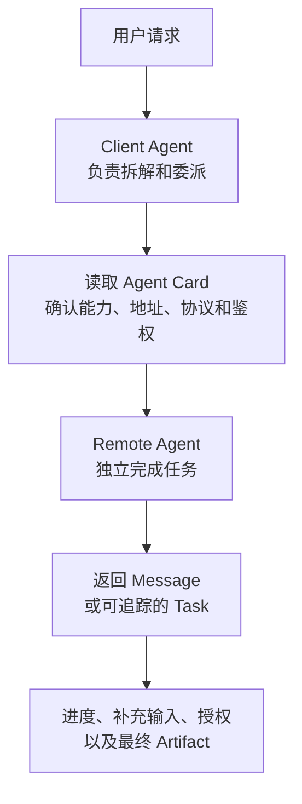
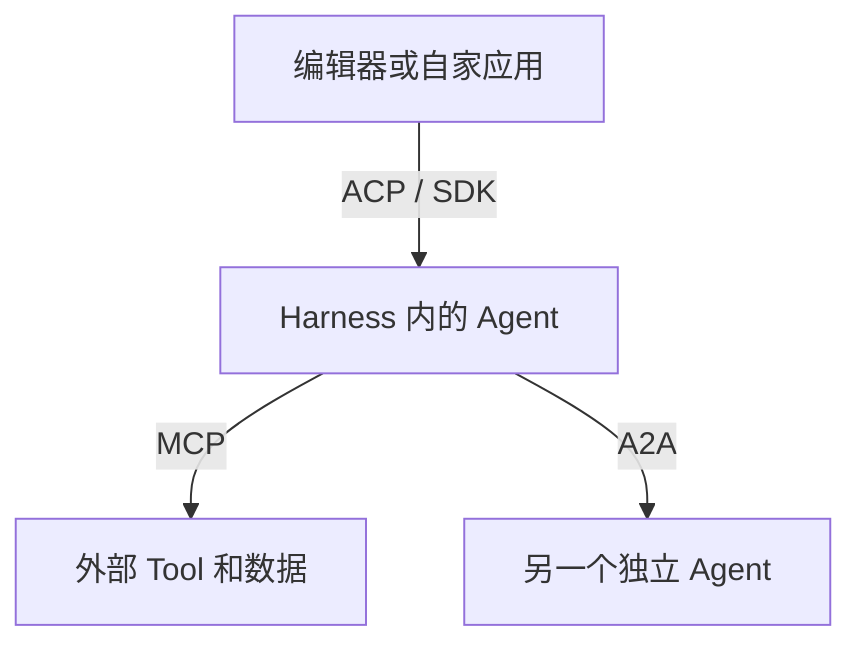
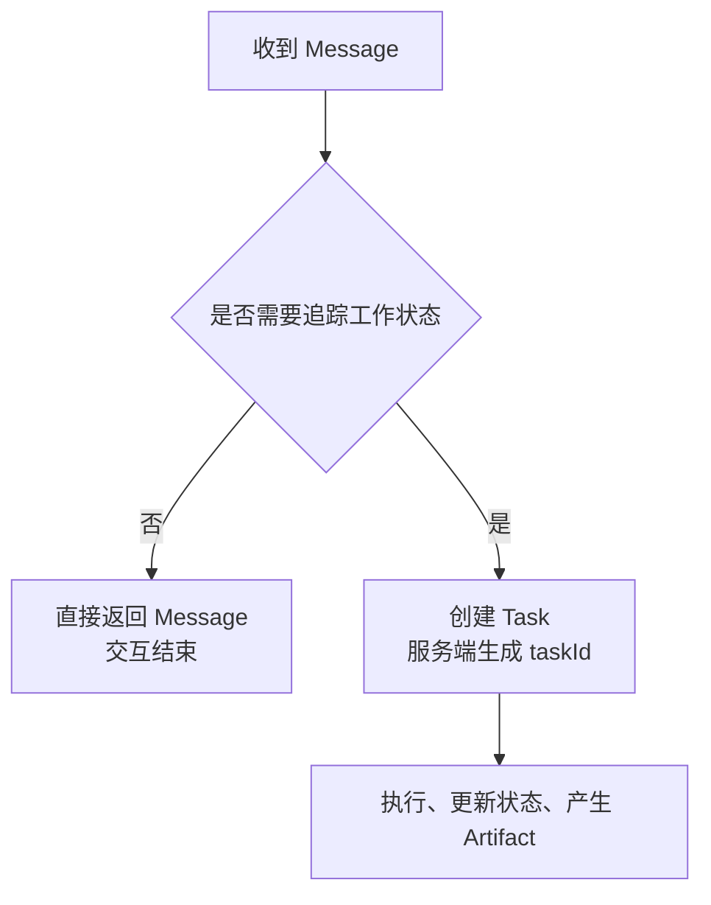
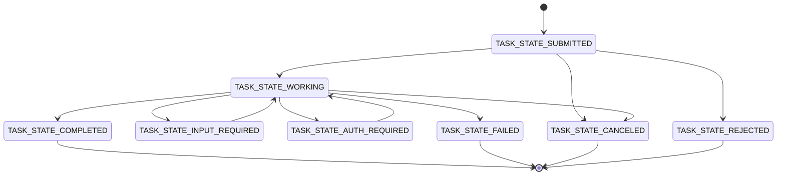
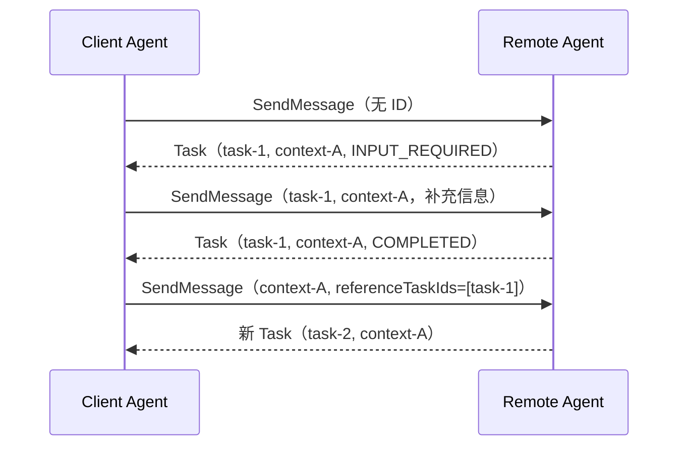
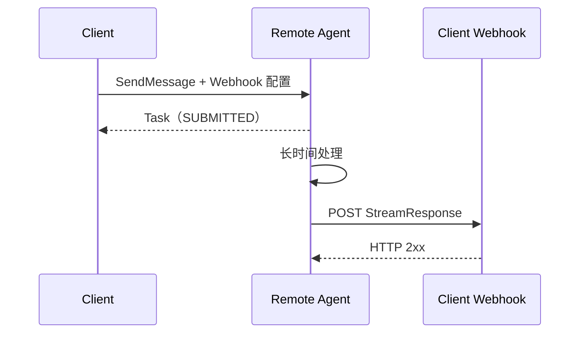
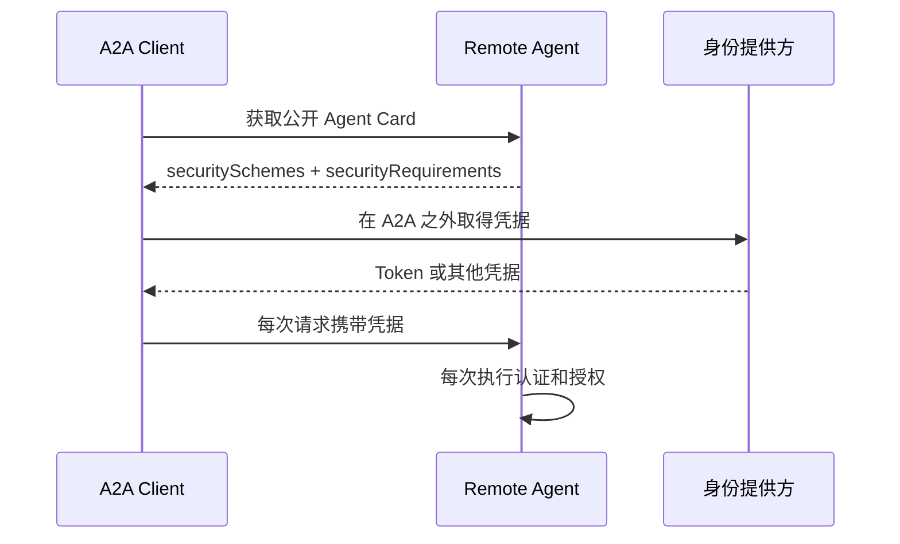
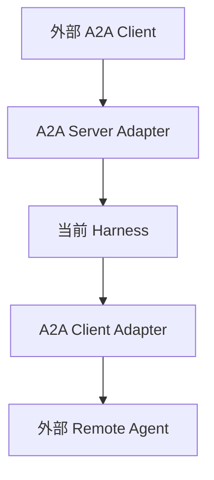

# A2A 协议规范中文版

版本：`1.0`

本文对应 A2A 官方稳定规范 `1.0.0`，用于学习 A2A 的角色、发现机制、数据模型、任务生命周期、操作、传输绑定、鉴权、扩展和错误处理。协议字段名保留英文，因为线上 JSON 必须使用这些原名。

A2A 最初由 Google 开发并捐赠给 Linux Foundation，现在由开放的技术委员会维护。它是不同厂商、不同语言和不同框架实现的 Agent 之间的通信标准。

官方规范：<https://a2a-protocol.org/v1.0.0/specification>

官方仓库：<https://github.com/a2aproject/A2A>

官方权威数据定义：<https://github.com/a2aproject/A2A/blob/main/specification/a2a.proto>

本文使用以下强度：

| 中文 | 官方用词 | 含义 |
|---|---|---|
| 必须 | MUST / REQUIRED | 不满足就不符合协议 |
| 禁止 | MUST NOT | 协议明确不允许 |
| 应该 | SHOULD | 通常要做，只有充分理由才能偏离 |
| 不应该 | SHOULD NOT | 通常不能做，只有充分理由才能偏离 |
| 可以 | MAY / OPTIONAL | 可选能力 |

## 1. A2A 是什么

A2A 解决的是：一个 Agent 怎样发现另一个 Agent 能做什么，怎样把工作交给它，怎样继续多轮协作，以及怎样取得长任务的进度和结果。

两个 Agent 不需要使用同一种框架，也不需要暴露各自的内部状态、记忆、计划或 Tool。它们只交换协议定义的 `Message`、`Task`、状态更新和 `Artifact`。



A2A 明确规定三层内容：

1. **统一数据模型**：`Message`、`Task`、`Part`、`Artifact`、`AgentCard` 等对象。
2. **统一操作语义**：发消息、查任务、取消、订阅、配置 Webhook 等。
3. **协议绑定**：把这些操作映射成 JSON-RPC、gRPC 或 HTTP+JSON。

A2A 不规定：

- Agent 内部使用什么模型、提示词、记忆系统或 Tool。
- Agent 内部怎样规划和执行。
- 业务数据库怎样设计。
- Agent 怎样寻找适合自己的远端 Agent；可以使用固定配置、目录服务或注册中心。
- 授权策略、数据保留期和任务清理策略的具体实现。

## 2. A2A、MCP、ACP 和 SDK 的区别

| 协议 | 连接谁 | 交换的核心对象 | 主要用途 |
|---|---|---|---|
| A2A | Agent 与远端 Agent | `Message`、`Task`、`Artifact` | 委派任务和跨系统协作 |
| MCP | Host 与能力提供方 | Tool、Resource、Prompt | 给模型接入外部数据和动作 |
| ACP | 编辑器或客户端与 Agent Harness | Session、Prompt、Update | 从外部操作 Harness |
| 本项目 SDK 协议 | 自家应用与本 Harness | 自有会话和运行时对象 | 程序内或自有服务集成 |

最直接的关系是：



远端 Agent 内部也可能调用 MCP Tool，但这属于远端 Agent 的实现细节。A2A Client 只看到它声明的技能、任务状态和输出。

## 3. 四个角色

| 角色 | 含义 |
|---|---|
| User | 提出目标的人或上游系统 |
| Client Agent | 代表用户选择远端 Agent、发送请求和处理结果的 Agent |
| A2A Client | Client Agent 内负责 Agent Card、协议编码、连接、鉴权和重试的协议组件 |
| A2A Server / Remote Agent | 暴露 A2A 接口并实际处理任务的 Agent 系统 |

Client Agent 和 A2A Client 不是同一个概念。前者决定“要不要委派、委派什么”；后者只负责“按标准怎样发、怎样收”。同一份 A2A Client 代码可以连接很多遵循 A2A 的 Agent。

模型通常不会直接拼 HTTP 或 JSON-RPC。Harness 可以把远端 Agent 包装成内部可调用能力，也可以由编排器直接调用 A2A Client。

## 4. 发现：Agent Card

A2A Server 必须发布 `AgentCard`。标准公开地址是：

```text
https://{domain}/.well-known/agent-card.json
```

也可以通过注册中心或预先配置的地址取得 Agent Card。Agent Card 是能力说明书，不是一次对话的动态状态。

### 4.1 Agent Card 的主要字段

| 字段 | 必需 | 含义 |
|---|---:|---|
| `name` | 是 | Agent 名称 |
| `description` | 是 | Agent 的用途 |
| `supportedInterfaces` | 是 | 地址、协议绑定、协议版本和可选租户路由 |
| `version` | 是 | Agent 自己的软件或能力版本，不是 A2A 协议版本 |
| `provider` | 否 | 提供方组织和网站 |
| `documentationUrl` | 否 | 使用文档 |
| `iconUrl` | 否 | 图标地址 |
| `capabilities` | 是 | 是否支持流、Push Notification、扩展和扩展卡 |
| `securitySchemes` | 否 | 可用鉴权方案的定义 |
| `securityRequirements` | 否 | 调用该 Agent 实际要求的鉴权组合 |
| `defaultInputModes` | 是 | 默认接受的 MIME 类型 |
| `defaultOutputModes` | 是 | 默认产生的 MIME 类型 |
| `skills` | 是 | 可发现的业务技能 |
| `signatures` | 否 | Agent Card 的 JWS 签名 |

### 4.2 `supportedInterfaces`

一个 Agent 可以同时提供多种绑定：

```json
{
  "supportedInterfaces": [
    {
      "url": "https://agent.example.com/a2a/v1/rpc",
      "protocolBinding": "JSONRPC",
      "protocolVersion": "1.0"
    },
    {
      "url": "agent.example.com:443",
      "protocolBinding": "GRPC",
      "protocolVersion": "1.0"
    },
    {
      "url": "https://agent.example.com/a2a/v1",
      "protocolBinding": "HTTP+JSON",
      "protocolVersion": "1.0"
    }
  ]
}
```

数组有优先顺序，第一个是服务端首选。Client 选择自己支持的第一项，并使用该项的 `url`、`protocolBinding` 和 `protocolVersion`。

`tenant` 是可选的不透明路由值。Agent Card 中某个接口带有 `tenant` 时，Client 必须在发往该接口的每个请求中原样携带；Client 不解释其业务含义。

### 4.3 `skills`

`AgentSkill` 是给 Client 选择 Agent 用的业务描述，不是 MCP Tool Schema，也不是让模型直接执行的函数签名。

| 字段 | 必需 | 含义 |
|---|---:|---|
| `id` | 是 | 技能的稳定标识 |
| `name` | 是 | 名称 |
| `description` | 是 | 能做什么、适用边界 |
| `tags` | 是 | 搜索和分类标签，至少一个 |
| `examples` | 否 | 示例请求 |
| `inputModes` | 否 | 覆盖 Agent 默认输入 MIME 类型 |
| `outputModes` | 否 | 覆盖 Agent 默认输出 MIME 类型 |
| `securityRequirements` | 否 | 覆盖 Agent 级鉴权要求；空数组表示该技能不要求鉴权 |

### 4.4 完整的简化 Agent Card

```json
{
  "name": "商品研究 Agent",
  "description": "分析商品资料并生成结构化研究报告",
  "supportedInterfaces": [
    {
      "url": "https://research.example.com/a2a/v1",
      "protocolBinding": "HTTP+JSON",
      "protocolVersion": "1.0"
    }
  ],
  "provider": {
    "organization": "Example Inc.",
    "url": "https://example.com"
  },
  "version": "2.3.0",
  "capabilities": {
    "streaming": true,
    "pushNotifications": true,
    "extendedAgentCard": true
  },
  "securitySchemes": {
    "oauth": {
      "oauth2SecurityScheme": {
        "oauth2MetadataUrl": "https://auth.example.com/.well-known/oauth-authorization-server"
      }
    }
  },
  "securityRequirements": [
    { "schemes": { "oauth": { "list": ["research.read"] } } }
  ],
  "defaultInputModes": ["text/plain", "application/json"],
  "defaultOutputModes": ["text/plain", "application/json"],
  "skills": [
    {
      "id": "product-research",
      "name": "商品研究",
      "description": "根据商品资料分析卖点、受众和风险",
      "tags": ["product", "research"],
      "examples": ["分析 SKU-100 的目标市场"]
    }
  ]
}
```

### 4.5 缓存、签名和扩展卡

Agent Card 应使用标准 HTTP 缓存头，例如 `Cache-Control`、`ETag` 和 `Last-Modified`。Client 应按 HTTP 缓存规则使用条件请求，避免每次调用前都重新下载。

Agent Card 可以使用 JWS 签名。签名前必须：

1. 按字段存在性规则构造 JSON。
2. 排除 `signatures` 字段。
3. 使用 RFC 8785 JCS 规范化 JSON。
4. 使用 RFC 7515 JWS 计算签名。

`capabilities.extendedAgentCard` 为 `true` 时，已鉴权的 Client 可以调用 `GetExtendedAgentCard` 取得更详细或因调用者而异的 Agent Card。扩展卡不能代替公开卡；公开卡仍负责首次发现和说明鉴权方式。

## 5. 核心数据模型

### 5.1 `Part`

`Part` 是内容的最小容器。每个 Part 的内容只能四选一：

| 内容字段 | 用途 |
|---|---|
| `text` | 文本 |
| `raw` | 原始字节；JSON 中使用 Base64 |
| `url` | 文件或内容地址 |
| `data` | 任意 JSON 值，包括对象、数组和标量 |

通用附加字段：

| 字段 | 含义 |
|---|---|
| `mediaType` | MIME 类型，例如 `text/plain`、`image/png` |
| `filename` | 文件名 |
| `metadata` | 自定义 JSON 元数据 |

因此文本、图片、音频、视频、文件和结构化 JSON 都能传。大文件通常使用 `url`，避免把大块 Base64 放进请求。

### 5.2 `Message`

`Message` 表示一次交流，不等于任务结果。

| 字段 | 必需 | 含义 |
|---|---:|---|
| `messageId` | 是 | 由消息创建方生成的唯一 ID |
| `role` | 是 | `ROLE_USER` 或 `ROLE_AGENT` |
| `parts` | 是 | 一个或多个 Part |
| `contextId` | 否 | 所属对话上下文 |
| `taskId` | 否 | 要继续的现有任务 |
| `referenceTaskIds` | 否 | 作为额外上下文引用的其他任务 |
| `extensions` | 否 | 本消息使用的扩展 URI |
| `metadata` | 否 | 自定义元数据 |

服务端产生的 Message 必须有 `contextId`；已经创建 Task 时还要带 `taskId`。Client 同时提供 `contextId` 与 `taskId` 时，两者必须匹配。

### 5.3 `Task`

`Task` 是可追踪、有状态的工作单元。

| 字段 | 必需 | 含义 |
|---|---:|---|
| `id` | 是 | 服务端生成的任务 ID |
| `contextId` | 否 | 相关任务和消息的上下文 ID |
| `status` | 是 | 当前状态、状态消息和时间戳 |
| `artifacts` | 否 | 已生成的任务产物 |
| `history` | 否 | 服务端选择保留的消息历史 |
| `metadata` | 否 | 自定义元数据 |

Client 不能自己指定新任务的 `taskId`。如果 Message 带有 `taskId`，它必须引用现有且非终态的任务。

### 5.4 `Artifact`

Artifact 是 Task 产出的结果，例如报告、代码、图片或结构化数据。

| 字段 | 必需 | 含义 |
|---|---:|---|
| `artifactId` | 是 | 在该 Task 内唯一 |
| `parts` | 是 | 一个或多个结果 Part |
| `name` | 否 | 人类可读名称 |
| `description` | 否 | 结果说明 |
| `extensions` | 否 | 本 Artifact 使用的扩展 URI |
| `metadata` | 否 | 自定义元数据 |

`Message` 用于沟通、提问和状态说明；正式任务结果应该放在 `Artifact`。Task 历史不保证保存所有 Message，关键结果不能只靠临时状态消息交付。

## 6. Message 还是 Task

`SendMessage` 的响应是二选一：

- 简单、立即结束且无需追踪的交互，可以直接返回 `Message`。
- 需要状态、输入、授权、取消、进度或产物的工作，返回 `Task`。



Agent 可以是仅 Message、仅 Task 或混合型。一旦某次交互已创建 Task，后续对该 Task 的响应应该继续使用 Task；终态 Task 不能重启。

## 7. Task 状态机

| 状态 | 类别 | 含义 |
|---|---|---|
| `TASK_STATE_UNSPECIFIED` | 非业务状态 | 未指定或无法确定 |
| `TASK_STATE_SUBMITTED` | 进行中 | 已接收，尚未开始处理 |
| `TASK_STATE_WORKING` | 进行中 | 正在处理 |
| `TASK_STATE_INPUT_REQUIRED` | 中断 | 需要 Client 补充输入 |
| `TASK_STATE_AUTH_REQUIRED` | 中断 | 需要额外授权 |
| `TASK_STATE_COMPLETED` | 终态 | 成功完成 |
| `TASK_STATE_FAILED` | 终态 | 执行失败 |
| `TASK_STATE_CANCELED` | 终态 | 已取消 |
| `TASK_STATE_REJECTED` | 终态 | Agent 拒绝执行 |

协议定义状态含义，但没有规定一张只允许固定边的严格状态转换表。实现必须保证：终态不可恢复，终态 Task 不再接受 Message；中断态可以在取得输入或授权后继续。



这张图展示常见流程，不是官方额外规定的唯一合法转换表。

终态 Task 的后续修改应创建新 Task，复用相同 `contextId`，并通过 `referenceTaskIds` 引用旧 Task。

## 8. `contextId`、`taskId` 与多轮协作

这两个 ID 解决不同问题：

| ID | 范围 | 谁生成 | 用途 |
|---|---|---|---|
| `contextId` | 一组相关 Message 和 Task | 通常由服务端生成 | 表示同一段协作上下文 |
| `taskId` | 一个具体工作单元 | 必须由服务端生成 | 查询、继续、取消和订阅该任务 |

常见组合：

| Client Message 携带 | 含义 |
|---|---|
| 两个都不带 | 开始全新交互；服务端可以生成 `contextId` |
| 只带 `contextId` | 在已有上下文中开始新交互或新 Task |
| 只带 `taskId` | 继续已有 Task；服务端从 Task 推断 `contextId` |
| 两个都带 | 继续指定 Task；两者必须匹配 |

当 Task 进入 `TASK_STATE_INPUT_REQUIRED` 时，Client 用同一个 `taskId` 和 `contextId` 再发 Message。终态以后则创建新 Task，不能继续旧 Task。



## 9. 标准操作

| 操作 | 作用 | 核心返回 |
|---|---|---|
| `SendMessage` | 开始交互或继续 Task | `Task` 或 `Message` |
| `SendStreamingMessage` | 发消息并实时接收更新 | `StreamResponse` 流 |
| `GetTask` | 读取 Task 最新快照 | `Task` |
| `ListTasks` | 按上下文、状态、时间筛选并分页 | Task 列表 |
| `CancelTask` | 尝试取消非终态 Task | 更新后的 `Task` |
| `SubscribeToTask` | 订阅已有非终态 Task | `StreamResponse` 流 |
| `CreateTaskPushNotificationConfig` | 为 Task 创建 Webhook | 配置对象 |
| `GetTaskPushNotificationConfig` | 查询一个 Webhook 配置 | 配置对象 |
| `ListTaskPushNotificationConfigs` | 列出 Task 的 Webhook 配置 | 配置列表 |
| `DeleteTaskPushNotificationConfig` | 删除一个 Webhook 配置 | 空成功响应 |
| `GetExtendedAgentCard` | 鉴权后取得扩展 Agent Card | `AgentCard` |

并不是所有可选操作都能无条件调用：流式操作要求 `capabilities.streaming=true`；Push Notification 要求 `capabilities.pushNotifications=true`；扩展卡要求 `capabilities.extendedAgentCard=true`。

### 9.1 `SendMessageConfiguration`

| 字段 | 含义 |
|---|---|
| `acceptedOutputModes` | Client 能接收的输出 MIME 类型 |
| `taskPushNotificationConfig` | 创建任务时顺便配置 Webhook |
| `historyLength` | 响应最多带多少条最近历史；`0` 表示不带 |
| `returnImmediately` | 是否创建 Task 后立即返回 |

`returnImmediately` 默认是 `false`：如果返回 Task，调用要等到 Task 达到终态或中断态。设为 `true` 时，创建 Task 后立即返回，Client 再通过轮询、订阅或 Webhook 获得更新。

该字段不影响直接返回 Message 的情况，也不影响流式调用。

### 9.2 `ListTasks`

可按 `contextId`、`status` 和 `statusTimestampAfter` 筛选。分页使用 `pageToken` / `nextPageToken` 游标；`pageSize` 默认最多 50，最小 1，最大 100。

返回按状态更新时间倒序排列。`includeArtifacts=false` 时必须省略 `artifacts` 字段。所有查询必须按已鉴权调用者的权限过滤，不能泄漏其他租户或用户的 Task。

## 10. 获取更新的三种方式

### 10.1 轮询

Client 周期调用 `GetTask`。实现最简单，不需要长连接，但有延迟并产生空请求。

### 10.2 流式

`SendStreamingMessage` 从发消息开始建立流；`SubscribeToTask` 给已经存在的非终态 Task 建立流。

Task 型流必须先返回完整 `Task` 快照，再返回零个或多个状态或产物事件，达到终态后关闭。直接 Message 型流只能包含一个 Message，然后关闭。

流中有两种增量事件：

| 事件 | 内容 |
|---|---|
| `TaskStatusUpdateEvent` | `taskId`、`contextId` 和新的 `TaskStatus` |
| `TaskArtifactUpdateEvent` | `taskId`、`contextId`、Artifact，以及 `append`、`lastChunk` |

同一 Task 可以有多个并发订阅流。事件必须按生成顺序发送给所有流；关闭某一个流不能终止 Task 或其他流。

### 10.3 Push Notification

Client 给 Task 注册一个可访问的 Webhook。Agent 在状态变化时向该 URL 发 HTTP POST，正文使用与流式更新相同的 `StreamResponse` 结构。



Webhook 是至少尝试一次，可能重复。接收方必须按 Task 和事件内容做幂等处理。发送方应防止 Webhook URL 引起 SSRF，接收方必须验证通知鉴权和预期 Task ID。

## 11. `StreamResponse` 与产物分块

每个 `StreamResponse` 只能包含以下一个字段：

- `task`
- `message`
- `statusUpdate`
- `artifactUpdate`

`TaskArtifactUpdateEvent.append=true` 表示把本次 Part 追加到同一 `artifactId` 的旧内容；`lastChunk=true` 表示这是该 Artifact 的最后一块。Client 需要按 `artifactId` 合并，不能仅按到达次数猜测是否结束。

流断开并不改变 Task 生命周期。Client 可以 `GetTask` 取得当前快照，并对非终态 Task 再调用 `SubscribeToTask`。协议不保证断线期间的临时状态 Message 全部补发，因此关键结果必须成为 Task 的 Artifact 或可查询状态。

## 12. 三种标准协议绑定

三种绑定必须提供等价的数据模型、操作、错误语义、流式行为和鉴权能力。Agent Card 明确告诉 Client 具体接口使用哪一种。

| 功能 | JSON-RPC 方法 | gRPC 方法 | HTTP+JSON |
|---|---|---|---|
| 发消息 | `SendMessage` | `SendMessage` | `POST /message:send` |
| 流式发消息 | `SendStreamingMessage` | `SendStreamingMessage` | `POST /message:stream` |
| 查 Task | `GetTask` | `GetTask` | `GET /tasks/{id}` |
| 列 Task | `ListTasks` | `ListTasks` | `GET /tasks` |
| 取消 Task | `CancelTask` | `CancelTask` | `POST /tasks/{id}:cancel` |
| 订阅 Task | `SubscribeToTask` | `SubscribeToTask` | `GET /tasks/{id}:subscribe` |
| 创建通知配置 | `CreateTaskPushNotificationConfig` | 同名 | `POST /tasks/{id}/pushNotificationConfigs` |
| 查询通知配置 | `GetTaskPushNotificationConfig` | 同名 | `GET /tasks/{id}/pushNotificationConfigs/{configId}` |
| 列通知配置 | `ListTaskPushNotificationConfigs` | 同名 | `GET /tasks/{id}/pushNotificationConfigs` |
| 删除通知配置 | `DeleteTaskPushNotificationConfig` | 同名 | `DELETE /tasks/{id}/pushNotificationConfigs/{configId}` |
| 扩展卡 | `GetExtendedAgentCard` | 同名 | `GET /extendedAgentCard` |

说明：官方规范的抽象映射表一处把订阅列为 `POST`，权威 `a2a.proto` 的 HTTP annotation 与 HTTP+JSON 章节使用 `GET /tasks/{id}:subscribe`。本文按权威 Proto 与绑定章节记录为 GET。

### 12.1 JSON-RPC

- JSON-RPC 2.0 over HTTP(S)。
- 普通请求和响应使用 `application/json`。
- 方法名为 PascalCase，例如 `SendMessage`。
- 流式响应使用 SSE，即 `text/event-stream`。

```json
{
  "jsonrpc": "2.0",
  "id": "req-1",
  "method": "GetTask",
  "params": {
    "id": "task-123",
    "historyLength": 10
  }
}
```

### 12.2 gRPC

- gRPC over HTTP/2，并在生产环境使用 TLS。
- 使用官方 `a2a.proto` 生成类型和 `A2AService`。
- `SendStreamingMessage` 与 `SubscribeToTask` 是服务端流式 RPC。
- A2A 服务参数通过 gRPC metadata 传递。

### 12.3 HTTP+JSON

- 使用普通 HTTP 方法和资源路径。
- JSON 使用 `application/a2a+json`。
- 流式端点使用 SSE。
- 请求与响应对象直接使用 ProtoJSON 对应的 JSON 形状，没有 JSON-RPC 外壳。

### 12.4 JSON 公共规则

- 字段必须使用 camelCase，例如 `contextId`、`protocolVersion`。
- 枚举按 ProtoJSON 使用完整枚举名，例如 `TASK_STATE_WORKING`、`ROLE_USER`。
- 时间戳使用 UTC ISO 8601，例如 `2026-09-11T10:30:00.000Z`。
- 未识别字段应该忽略，以便向前兼容。
- 标为 required 的数组至少有一个元素。

## 13. 一次完整 JSON 调用

下面使用 HTTP+JSON，因为它最容易看清业务对象。

### 13.1 请求

```http
POST /message:send HTTP/1.1
Host: research.example.com
Content-Type: application/a2a+json
Authorization: Bearer example-token
A2A-Version: 1.0

{
  "message": {
    "messageId": "msg-001",
    "role": "ROLE_USER",
    "parts": [
      {
        "text": "分析 SKU-100，返回目标人群和主要风险",
        "mediaType": "text/plain"
      }
    ]
  },
  "configuration": {
    "acceptedOutputModes": ["application/json"],
    "returnImmediately": false,
    "historyLength": 5
  }
}
```

### 13.2 返回 Task

```json
{
  "task": {
    "id": "task-001",
    "contextId": "context-001",
    "status": {
      "state": "TASK_STATE_COMPLETED",
      "timestamp": "2026-09-11T10:31:22.000Z"
    },
    "artifacts": [
      {
        "artifactId": "artifact-001",
        "name": "product-research.json",
        "parts": [
          {
            "data": {
              "audience": ["城市通勤人群"],
              "risks": ["价格敏感"]
            },
            "mediaType": "application/json"
          }
        ]
      }
    ]
  }
}
```

### 13.3 请求补充输入

```json
{
  "task": {
    "id": "task-001",
    "contextId": "context-001",
    "status": {
      "state": "TASK_STATE_INPUT_REQUIRED",
      "message": {
        "messageId": "msg-agent-001",
        "contextId": "context-001",
        "taskId": "task-001",
        "role": "ROLE_AGENT",
        "parts": [
          { "text": "请补充目标国家。" }
        ]
      },
      "timestamp": "2026-09-11T10:30:10.000Z"
    }
  }
}
```

Client 随后再次调用 `SendMessage`，在 Message 中同时带 `taskId: "task-001"` 和 `contextId: "context-001"`。

## 14. 鉴权与授权

A2A 使用现有 Web 安全机制，不发明账号系统。Agent Card 可以声明：

- API Key
- HTTP Authentication，例如 Bearer 或 Basic
- OAuth 2.0
- OpenID Connect
- Mutual TLS

OAuth 2.0 支持 Authorization Code、Client Credentials 和 Device Code。Implicit 与 Password Flow 已废弃。

流程是：



生产环境的 HTTP 绑定必须使用 HTTPS，gRPC 必须使用 TLS。服务端必须对每个操作鉴权，并按调用者权限限制 `GetTask`、`ListTasks`、取消、订阅和通知配置。

`TASK_STATE_AUTH_REQUIRED` 只是“任务需要额外授权”的状态，不等于已经授权。授权凭据的取得、作用域、有效期和撤销不由 A2A 核心协议定义，通常通过安全的带外通道或明确协商的扩展完成。

## 15. Push Notification 配置与安全

`TaskPushNotificationConfig` 的主要字段：

| 字段 | 含义 |
|---|---|
| `tenant` | Agent Card 接口声明的可选不透明路由值 |
| `taskId` | 对应 Task；在首次 SendMessage 内嵌配置时应为空 |
| `id` | 配置 ID；创建后由服务端分配 |
| `url` | Agent 回调的 Webhook URL |
| `token` | Client 用于校验通知的不透明 Token |
| `authentication` | Agent 调用 Webhook 时使用的 HTTP 鉴权方案和凭据 |

发送方需要校验 URL，拒绝 localhost、私有地址和 link-local 地址等危险目标，必要时使用域名白名单。接收方要验证鉴权、Task ID、速率和重复通知。Webhook Token 和凭据都必须按秘密存储。

## 16. 版本协商

规范发布版本是 `1.0.0`，线上协议协商只使用 `Major.Minor`，即 `1.0`，不使用 patch。

Client 每次请求必须通过 `A2A-Version` 服务参数声明协议版本。HTTP/JSON-RPC 使用请求头，gRPC 使用 metadata；HTTP 也允许把它作为查询参数。服务端不支持时返回 `VersionNotSupportedError`。

```http
A2A-Version: 1.0
```

为兼容旧客户端，空版本被解释为 `0.3`。需要 1.0 功能的 Client 不应该静默回退到 0.3，否则可能丢失功能或采用错误的数据形状。

`AgentCard.version` 是 Agent 产品版本；`supportedInterfaces[].protocolVersion` 才是 A2A 协议版本。两者不能混用。

### 16.1 从 0.3 到 1.0 的重要变化

- 方法名统一为 PascalCase，例如 `message/send` 改为 `SendMessage`。
- `Part` 改为同一对象中的 `text`、`raw`、`url`、`data` 四选一。
- 流事件改为 `StreamResponse` 中的明确 oneof 字段。
- Agent Card 使用 `supportedInterfaces` 声明多种协议、地址和版本。
- 状态枚举和角色枚举使用完整 Proto 枚举名。
- 新增 `ListTasks`、租户路由、执行模式等能力。
- 错误统一采用可映射到 `google.rpc.Status` 的模型。

## 17. 扩展机制

Agent 在 `capabilities.extensions` 中声明扩展：

```json
{
  "uri": "https://example.com/a2a/extensions/citations/v1",
  "description": "在 Artifact 中携带引用来源",
  "required": false,
  "params": {}
}
```

Client 通过 `A2A-Extensions` 服务参数选择本次要使用的扩展。Message 和 Artifact 的 `extensions` 字段说明该对象实际使用了哪些扩展，扩展数据通常放入 `metadata` 中，以扩展 URI 作为命名空间。

规则：

- 扩展 ID 使用全局唯一 URI，并把版本放进 URI。
- breaking change 必须换新 URI。
- Agent Card 标记 `required=true` 的扩展，Client 不支持时不能安全调用该 Agent。
- 非必需扩展不被 Client 支持时，应退回核心协议行为。
- Client 请求 Agent 不支持的必需扩展时，返回 `ExtensionSupportRequiredError`。

A2A 也允许自定义协议绑定，但必须保持核心数据和操作语义等价，并定义传输、流、鉴权和错误映射。自定义绑定的标识应该是 URI。

## 18. 错误模型

所有绑定都必须表达机器可读错误码、人类可读消息和可选结构化详情。详情对象使用 ProtoJSON `Any` 形状，并带 `@type`。

| A2A 错误 | JSON-RPC | gRPC | HTTP |
|---|---:|---|---:|
| `TaskNotFoundError` | `-32001` | `NOT_FOUND` | 404 |
| `TaskNotCancelableError` | `-32002` | `FAILED_PRECONDITION` | 400 |
| `PushNotificationNotSupportedError` | `-32003` | `FAILED_PRECONDITION` | 400 |
| `UnsupportedOperationError` | `-32004` | `FAILED_PRECONDITION` | 400 |
| `ContentTypeNotSupportedError` | `-32005` | `INVALID_ARGUMENT` | 400 |
| `InvalidAgentResponseError` | `-32006` | `INTERNAL` | 500 |
| `ExtendedAgentCardNotConfiguredError` | `-32007` | `FAILED_PRECONDITION` | 400 |
| `ExtensionSupportRequiredError` | `-32008` | `FAILED_PRECONDITION` | 400 |
| `VersionNotSupportedError` | `-32009` | `FAILED_PRECONDITION` | 400 |

JSON-RPC 还使用标准错误 `-32700`、`-32600`、`-32601`、`-32602`、`-32603`。HTTP+JSON 使用 RFC 9457 Problem Details 风格的错误正文，gRPC 使用 `google.rpc.Status`。

鉴权失败通常映射为 HTTP 401 / gRPC `UNAUTHENTICATED`；已认证但无权操作通常映射为 HTTP 403 / gRPC `PERMISSION_DENIED`。

## 19. 幂等、重试和一致性

- Get 类操作天然幂等。
- Cancel Task 幂等；重复取消已经清理的 Task 仍可能得到 `TaskNotFoundError`。
- `SendMessage` 可以使用 `messageId` 检测重复，但协议只说“可以”，Client 不能假定所有 Agent 都实现了严格幂等。
- Push Notification 至少尝试一次，Client 必须接受重复。
- 状态流保证同一流内按生成顺序传递，不代表跨网络故障的 exactly-once。
- Task 是服务端持有的权威状态；流和 Webhook 是更新通道，断线后用 `GetTask` 对账。

如果业务动作不可重复，Remote Agent 必须自己实现幂等键、事务或去重记录。A2A 的 `messageId` 是可利用的输入，但不会自动替业务保证一致性。

## 20. A2A Client 和 A2A Server 各自负责什么

### 20.1 A2A Client

- 获取、缓存并可选验证 Agent Card。
- 根据 `supportedInterfaces` 选择自己支持的绑定和版本。
- 按 `securityRequirements` 取得并携带凭据。
- 编码请求、解码响应和统一不同绑定的错误。
- 维护 `contextId`、`taskId` 和 `messageId` 的关联。
- 处理轮询、SSE/gRPC 流、断线重订阅和 Webhook 对账。
- 校验服务端响应是否符合声明的 MIME 类型和协议对象。

### 20.2 A2A Server

- 发布正确的 Agent Card。
- 暴露至少一种标准或合规自定义绑定。
- 把收到的 Message 交给内部 Agent，并决定返回 Message 还是创建 Task。
- 维护 Task 的权威状态、Artifact 和选定历史，并按自身策略决定耐久化与清理周期。
- 执行鉴权、授权、租户隔离、限流和输入校验。
- 按声明提供流式、Push Notification 和扩展卡。
- 保证终态不可恢复，并正确处理取消、重复请求和清理策略。

## 21. 对当前 Harness 的含义

当前仓库中存在：

- `protocol/acp`：让外部 ACP Client 操作本 Harness。
- `protocol/mcp`：让本 Harness 连接外部 MCP 能力。
- `protocol/sdk`：自有应用接入本 Harness 的协议。
- `feature/subagent` 与 `feature/agentteam`：同一运行时内部的 Agent 协作。

当前没有 `protocol/a2a`，`go.mod` 也没有 A2A SDK 依赖。因此本项目现在不能因为“有子 Agent”就声称支持标准 A2A。

如果以后增加 `protocol/a2a`，建议把职责拆成两侧：



Client Adapter 应负责 Agent Card、绑定选择、协议编解码、鉴权、流和 Task 追踪；不要把远端 Agent 假装成本地函数后丢掉 `Task`、`contextId`、中断状态和 Artifact 语义。

Server Adapter 应把外部 A2A 请求映射到内部 Session/Agent 执行，并提供独立的 A2A Task 存储。内部 Session ID 不应该直接当公开 `taskId`，因为两者生命周期、权限范围和暴露边界不同。

### 21.1 与 `scope` 和 Tool 的关系

A2A Remote Agent 可以由业务层注册成 Agent 可见能力，但它不是 MCP Tool。若为了兼容当前 Agent Loop 而包装成 Tool，包装层至少需要保留：

- Agent Card 身份和 Skill。
- `taskId`、`contextId` 与本地 Session 的映射。
- `INPUT_REQUIRED` 和 `AUTH_REQUIRED` 的挂起/恢复。
- Streaming、轮询或 Push Notification 的生命周期。
- Artifact 以及文本、文件、结构化数据的类型。
- 取消、超时、权限和预算传播。

只做一个 `call_remote_agent(prompt string) string` 会损失 A2A 最重要的长任务语义。

### 21.2 与 Session Log 的关系

A2A 不要求当前项目使用 Session Log，也不规定投影。若接入，业务层可以把以下事实写入日志：

- 已向哪个 Remote Agent 发送哪个 `messageId`。
- A2A `taskId` / `contextId` 与本地 Session 的对应关系。
- 收到的状态更新和 Artifact。
- 取消、重试、断线和最终结果。

这样做是本 Harness 的持久化设计，不是 A2A 协议要求。远端 Task 的权威状态仍在 A2A Server，本地日志用于恢复编排和审计。

## 22. 实现时最容易出错的地方

1. 把 Agent Card 的 `version` 当成 A2A `protocolVersion`。
2. 把 Skill 当成 MCP Tool Schema，假设它有精确函数参数。
3. 用 Message 交付关键结果，忽略 Artifact 和 Task 可查询状态。
4. 终态 Task 继续收 Message，而不是创建同 `contextId` 的新 Task。
5. 流断开就取消 Task，混淆连接生命周期和任务生命周期。
6. 只实现 SSE，不实现 `GetTask` 对账和重订阅。
7. 假设 `messageId` 自动提供严格幂等。
8. Webhook 不防 SSRF、不验来源、不能处理重复通知。
9. `ListTasks` 没按调用者和租户过滤，造成跨用户数据泄漏。
10. 把 `TASK_STATE_AUTH_REQUIRED` 当成授权已经通过。
11. 把 0.3 的方法名、Part 形状或枚举值混入 1.0。
12. 将内部思维链、完整记忆或内部 Tool 清单暴露给对端；A2A 不需要这些数据。

## 23. 最小实现顺序

要给当前 Harness 增加可用的 A2A，建议按以下顺序：

1. 固定 A2A `1.0`，选择官方 Go SDK 或从权威 Proto 生成类型。
2. 实现并测试 Agent Card，先只发布一种协议绑定。
3. 实现 `SendMessage`、Task 持久化和 `GetTask`。
4. 实现状态机、Artifact、`INPUT_REQUIRED` 和取消。
5. 加 `SendStreamingMessage` 与 `SubscribeToTask`。
6. 加鉴权、授权、租户隔离、限流和审计。
7. 确有离线长任务需求时再加 Push Notification。
8. 确有差异化能力时再加 Extended Agent Card 和扩展。

不要一开始同时手写三种绑定。先用同一套领域对象和操作语义跑通一种绑定，再由测试验证其他绑定的行为等价。

## 24. 一句话判断边界

```text
要调用一个能力：MCP。
要把一项工作交给另一个独立 Agent，并持续追踪它：A2A。
要从编辑器或外部客户端控制这个 Harness：ACP 或本项目 SDK。
```

## 25. 本文核对基线

本文按以下官方源码核对：

- A2A 规范版本：`1.0.0`。
- 官方仓库提交：`6d6640c29b102f7a8d23784901351b5d2454fe71`，日期 `2026-09-10`。
- 权威结构：`specification/a2a.proto`，包名 `lf.a2a.v1`。
- 标准绑定：`JSONRPC`、`GRPC`、`HTTP+JSON`。

官方规范可能继续演进。实现时应以选定发布版本的 `a2a.proto` 为准，不要只依赖博客、示例代码或旧版 SDK 类型。
