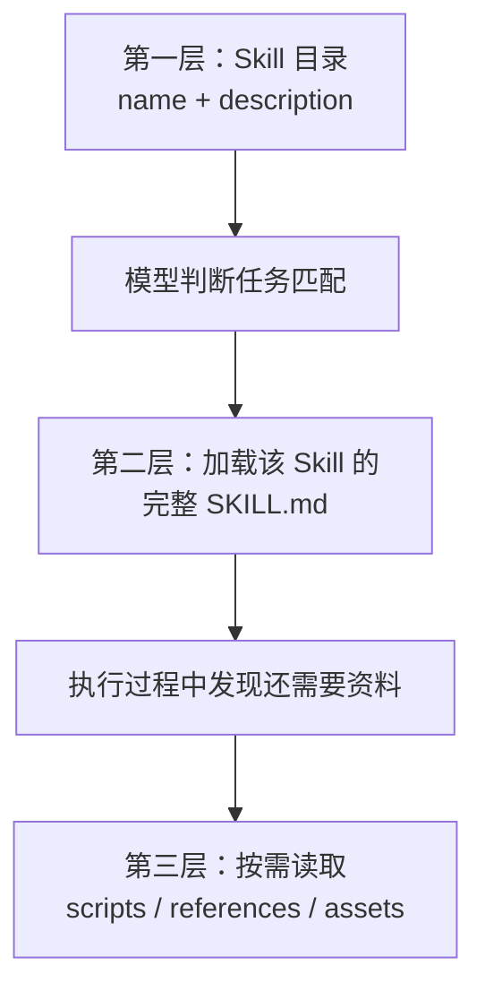
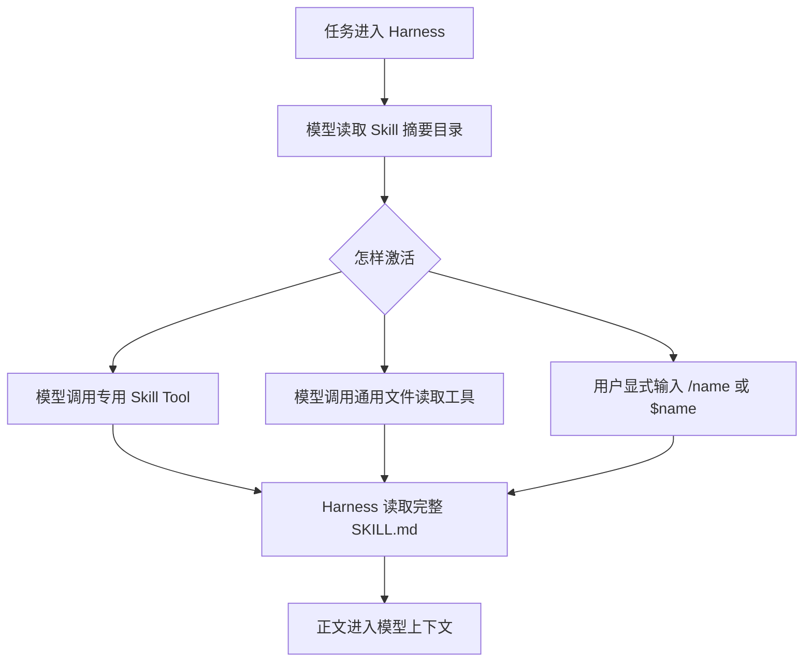
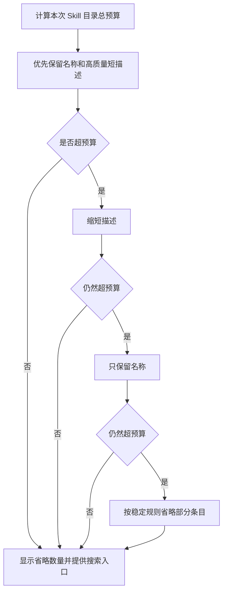

# Agent Skills 开放规范中文版

本文说明 Agent Skills 的文件格式、加载方式和运行时边界，并核对当前 Harness、DSH、Codex、Grok、LangChain、LangGraph 与 LangChain Deep Agents 的实际做法。

先给结论：**Skill 是一份可按需加载的操作说明，不是 Tool，也不是模型能力。** 标准规定 Skill 文件怎样写；由 Harness 决定去哪里找、什么时候把目录给模型、怎样加载正文、怎样执行脚本以及怎样控制权限。

---

## 1. 标准是谁定义的

Agent Skills 最初由 Anthropic 开发，后来作为开放格式发布。它不是 IETF、ISO 或 W3C 协议，也不是某一家模型 API 的一部分。

官方仓库中的 `docs/specification.mdx` 是格式要求的权威来源。本文核对的官方仓库版本：

- 仓库：`agentskills/agentskills`
- 提交：`69ef37e9424c0a7ea9dd2293b559e43ec8176379`
- 提交日期：2026-08-09

标准主要规定：

- Skill 是一个目录，目录中至少有 `SKILL.md`。
- `SKILL.md` 的 YAML frontmatter 有哪些字段和约束。
- 正文是 Markdown 指令。
- 脚本、参考资料和资产怎样随 Skill 一起组织。
- 客户端应采用渐进加载，先给元数据，匹配后再加载正文和资源。

标准没有规定：

- Skill 必须安装在哪个目录。
- Harness 怎样扫描、缓存、排序和处理同名 Skill。
- 模型必须通过专用 Tool 还是文件读取来加载正文。
- 目录使用多少 token，过大时怎样裁剪。
- 脚本执行沙箱、网络权限、人工审批和凭据管理。
- Skill 在一次会话中加载后保留多久。

这些都由具体 Harness 定义。

---

## 2. Skill、Tool、Prompt、Plugin 和 Memory 的区别

| 概念 | 解决的问题 | 是否会执行动作 | 常见内容 |
|---|---|---:|---|
| Skill | 这类任务应该怎样做 | 本身不会 | 步骤、规则、示例、脚本和参考资料 |
| Tool | 模型可以做什么动作 | 会 | 函数 schema、执行器、返回值 |
| Prompt | 这次模型应遵守什么上下文和规则 | 不会 | 系统指令、用户消息、临时说明 |
| Plugin | 怎样打包和分发一组扩展 | 视所含能力而定 | Skill、Tool、MCP、配置 |
| Memory | 过去有哪些事实需要继续保留 | 不会 | 用户偏好、历史事实、会话状态 |

Skill 可以要求模型调用 Tool，也可以附带脚本，但 `SKILL.md` 本身仍是一份指令。模型读到 Skill 之后，仍只能使用 Harness 已经授予的 Tool 和运行权限。

---

## 3. 标准目录结构

最小 Skill：

```text
my-skill/
└── SKILL.md
```

常见完整结构：

```text
my-skill/
├── SKILL.md
├── scripts/
│   └── run.py
├── references/
│   └── REFERENCE.md
├── assets/
│   └── template.json
└── LICENSE.txt
```

只有 `SKILL.md` 是必需文件。`scripts/`、`references/` 和 `assets/` 是推荐约定，Skill 目录也可以包含其他文件。

各部分的作用：

| 路径 | 是否必需 | 里面放什么 | 怎样使用 |
|---|---:|---|---|
| `SKILL.md` | 是 | Skill 的名称、描述和完整操作说明 | Harness 先读取文件头的名称和描述；模型选择该 Skill 后，再读取正文并按正文执行 |
| `scripts/` | 否 | Python、Shell、JavaScript 等可执行脚本 | 模型根据 `SKILL.md` 的指示调用执行工具运行脚本；目录里的脚本不会因为 Skill 被加载就自动执行 |
| `references/` | 否 | 详细规范、字段说明、业务规则、API 说明和较长示例 | 模型只在正文要求或当前步骤需要时读取，避免所有资料同时占用上下文 |
| `assets/` | 否 | 模板、图片、样例数据、配置骨架等产出素材 | 模型或脚本把它们作为输入使用；它们通常不是给模型完整阅读的指令 |
| `LICENSE.txt` | 否 | 这份 Skill、脚本和资源的许可证全文 | 供人和分发系统判断能否复制、修改和发布；`SKILL.md` 的 `license` 字段可以指向它 |

具体来说：

- `SKILL.md` 是入口。没有它，这个目录就不是一份符合规范的 Skill。
- `scripts/run.py` 把确定性工作写成程序。例如解析文件、转换数据或执行重复检查。Skill 正文负责说明什么时候运行它以及参数是什么。
- `references/REFERENCE.md` 保存模型偶尔才需要查的知识。例如一百个字段的含义不必全部塞进 `SKILL.md`，用到时再读。
- `assets/template.json` 是工作材料。例如生成配置时复制并填写这个模板，而不是让模型重新猜一份结构。
- `LICENSE.txt` 只处理许可问题，不参与 Skill 的选择和执行。

Harness 不会仅凭这些目录名自动获得新的执行能力。它仍然需要文件读取工具才能读取资料，需要进程工具才能运行脚本，并且必须通过原有的权限检查。

---

## 4. `SKILL.md` 格式

`SKILL.md` 由两部分组成：

1. 文件开头的 YAML frontmatter。
2. frontmatter 后面的 Markdown 正文。

### 4.1 Frontmatter 字段

| 字段 | 必需 | 约束 |
|---|---:|---|
| `name` | 是 | 1 到 64 个字符；只允许小写字母 `a-z`、数字 `0-9` 和单个连字符；不能以连字符开头或结尾；不能出现连续连字符；必须与父目录名一致 |
| `description` | 是 | 1 到 1024 个字符；同时说明“做什么”和“什么时候使用” |
| `license` | 否 | 许可证名称，或指向 Skill 包内许可证文件的说明 |
| `compatibility` | 否 | 1 到 500 个字符；说明产品、系统包、网络等运行条件 |
| `metadata` | 否 | 字符串到字符串的键值表 |
| `allowed-tools` | 否 | 用空格分隔的预批准工具列表；实验字段，各实现支持程度不同 |

最小示例：

```markdown
---
name: pdf-processing
description: Extract text and tables from PDF files. Use when the user asks to read, fill, merge, or inspect PDF documents.
---
```

带可选字段的示例：

```markdown
---
name: pdf-processing
description: Extract text and tables from PDF files. Use when handling PDFs, forms, or document extraction.
license: Apache-2.0
compatibility: Requires Python 3.12+ and access to local PDF files
metadata:
  author: example-org
  version: "1.0"
allowed-tools: Read Bash(python:*)
---
```

### 4.2 `name`

合法名称：

```yaml
name: pdf-processing
name: data-analysis
name: code-review
```

非法名称：

```yaml
name: PDF-Processing   # 有大写字母
name: -pdf             # 以连字符开头
name: pdf-             # 以连字符结尾
name: pdf--processing  # 连续连字符
```

如果目录叫 `pdf-processing`，frontmatter 中的 `name` 也必须是 `pdf-processing`。

### 4.3 `description`

`description` 不是普通介绍。它是模型在未读取正文前判断“要不要加载这份 Skill”的主要依据，必须同时包含能力和触发场景。

较好：

```yaml
description: Extracts text and tables from PDF files, fills PDF forms, and merges PDFs. Use when the user mentions PDFs, forms, or document extraction.
```

较差：

```yaml
description: Helps with PDFs.
```

描述过于宽泛会导致误触发；缺少用户常用关键词会导致漏触发。

### 4.4 `license`

这个字段写许可证名称，或者说明许可证文件在哪里：

```yaml
license: Proprietary. See LICENSE.txt for complete terms
```

### 4.5 `compatibility`

只有存在明确环境要求时才需要它：

```yaml
compatibility: Requires git, docker, jq, and internet access
```

它只是声明条件。Harness 仍需在运行时检查这些条件。

### 4.6 `metadata`

`metadata` 给客户端保存扩展信息。键和值都必须是字符串。客户端应使用不易冲突的键名。

```yaml
metadata:
  author: example-org
  version: "1.0"
```

### 4.7 `allowed-tools`

```yaml
allowed-tools: Bash(git:*) Bash(jq:*) Read
```

它是实验字段，不是跨 Harness 一致的权限协议。某个客户端不认识这个字段时，不能假定它会自动拦截工具。真正的权限控制仍由 Harness 的工具注册、策略检查、沙箱和审批机制负责。

---

## 5. Markdown 正文

frontmatter 后的正文没有固定章节格式。正文可以写：

- 任务步骤。
- 输入和输出示例。
- 错误处理。
- 边界情况。
- 需要读取的参考文件。
- 可以运行的脚本。

官方建议 `SKILL.md` 少于 500 行，正文少于约 5000 token。较长材料应拆入 `references/`，避免正文一加载就占用大量上下文。

资源引用从 Skill 根目录解析：

```markdown
完整字段说明见 `references/REFERENCE.md`。

需要提取内容时运行 `scripts/extract.py`。
```

引用链应尽量只有一层：`SKILL.md` 直接指向资源。不要让一个参考文件再指向多层参考文件，否则模型难以判断还要读多少内容。

---

## 6. 三层渐进加载

Agent Skills 的核心不是文件扩展名，而是渐进加载。



官方给出的量级是：

- 第一层：每个 Skill 的元数据大约 100 token。
- 第二层：激活后加载完整正文，建议少于 5000 token。
- 第三层：资源只在需要时加载。

第一层解决“模型怎样知道有哪些 Skill”；第二层解决“模型怎样学会具体做法”；第三层避免把所有参考材料一次塞进上下文。

---

## 7. 有 100 个 Skill 时，模型到底看到什么

**不会把 100 篇 `SKILL.md` 正文全部提交给模型。** 通常先提交一个目录，其中每条只有名称和描述；匹配后再加载少数正文。

100 条目录摘要仍然不是免费的。按每条约 50 到 100 token 估算，仅目录就可能占 5000 到 10000 token，还没有计算外围提示词、路径和 XML/Markdown 标记。

具体 Harness 的答案不同：

| 实现 | 模型先看到什么 | 正文怎样加载 | 有 100 个 Skill 时 |
|---|---|---|---|
| 官方推荐模式 | 所有 Skill 的 `name + description` | 激活后加载 `SKILL.md` | 基本模式是 100 条摘要，不是 100 篇正文；具体预算由客户端决定 |
| 当前 Go Harness | 所有当前可见、允许模型调用的 `name + 截断后的 description` | 调用 `skill(name)`；用户 `/name` 也可直接注入 | 100 条摘要都会进入目录；没有总目录预算 |
| DSH | 所有可见 Skill 的 `name + description` | Skill Tool 或用户 `/name` | 与当前 Go Harness 相同 |
| Codex | Skill 名称、说明和文件位置；这张清单限制总字数 | 读取对应 `SKILL.md`；显式调用可直接注入 | 放不下时删掉部分说明或少展示几个 Skill；正文按需加载 |
| Grok | Skill 名称、路径、说明和可选触发条件；这张清单限制总字数 | Skill Tool、文件读取或 Slash 调用 | 放不下时先缩短说明，再只留名称，最后少展示几个 Skill |
| LangChain Core | 没有原生 Agent Skills 目录 | 应用自己实现 | 没有统一答案 |
| LangGraph Core | 没有原生 Agent Skills 目录 | Graph 或 middleware 自己实现 | 没有统一答案 |
| LangChain Deep Agents | 所有 Skill 的 metadata 和路径 | 使用 `read_file` 读取 `SKILL.md` | 当前实现会把 100 条摘要注入每次模型请求；未见总目录预算 |

这里的“提交”指组装进模型请求可见的上下文。HTTP 是否通过提示词缓存节省传输或计费，是模型供应商的另一层机制，不改变模型能看到哪些内容。

---

## 8. 谁决定什么时候加载 Skill

标准只规定渐进加载原则，不规定唯一的激活协议。常见方式有三种：



模型之所以知道应该加载哪一份，靠的是目录里的 `name` 和 `description`。Harness 负责把目录放入上下文，并提供可用的加载通道。

用户显式指定某个 Skill 时，Harness 可以跳过模型选择，直接加载正文。具体使用 `/name`、`$name` 还是其他语法，不属于开放规范。

---

## 9. Skill 正文加载后的生命周期

开放规范没有规定正文加载后必须保留多久。实现通常有两种选择：

1. 只在当前模型调用中注入，需要时再次读取。
2. 把已加载正文写入会话上下文，后续步骤继续可见，直到上下文压缩或会话结束。

第二种节省重复选择，但正文会持续占用上下文。做上下文压缩时，Harness 还要决定保留全文、保留摘要，还是允许再次加载。

---

## 10. 安装位置、发现和同名覆盖

开放规范不规定固定安装目录，也不规定注册中心。`.agents/skills` 是跨客户端使用中的一种约定，不是格式规范强制要求。

一个 Harness 可以从这些位置发现 Skill：

- 用户全局目录。
- 当前仓库目录。
- Agent 预设。
- Plugin 包。
- 远程注册表。
- 宿主程序运行时注册。

如果多个来源有同名 Skill，Harness 必须定义稳定的优先级，并在同一优先级内拒绝歧义或采用明确顺序。开放规范没有替实现决定覆盖规则。

---

## 11. 权限和安全边界

Skill 是会进入模型上下文的指令，因此它和仓库里的脚本一样属于需要信任的输入。

需要分别控制：

- **可见性**：哪些 Agent 能看到某个 Skill 的摘要。
- **可调用性**：模型能否主动加载，用户能否显式加载。
- **工具权限**：加载后能调用哪些 Tool。
- **执行权限**：脚本能否启动进程、读写文件、访问网络。
- **凭据权限**：Skill 或脚本能否取得密钥。
- **预算**：目录、正文、工具调用和模型调用能消耗多少资源。

`allowed-tools` 只能表达一部分工具偏好，而且仍是实验字段。它不能代替 Harness 的真实权限检查。加载 Skill 也不应自动授予新的工具、网络或文件权限。

仓库提供的 Skill 可能被提交内容修改。客户端应在可信边界内发现 Skill，并在执行脚本或高风险 Tool 前继续使用原有审批规则。

---

## 12. 当前 Go Harness 的实现

当前实现位于 `feature/skill` 和 `feature/skill/skilltool`。

它分开保存摘要和正文：

- `Summary` 保存名称、描述、调用许可、来源和资源基址。
- `Definition` 在摘要之外增加完整 `Content`。

每个 Agent step 进入模型前，`catalogPreStep` 读取当前 Agent 可见的 Skill，只保留允许模型调用的条目，再生成 `<available_skills>` 目录。目录只含：

- `name`
- 截断后的 `description`

模型调用名为 `skill` 的 Tool 后，Harness 才读取完整 `Definition`，把正文渲染为 `<skill_content>` 交给模型。用户在消息中显式写 `/name` 时，也可以直接注入正文。

目录会记录在 Session Log 中。技能集合变化时，新目录替换旧目录在模型输入中的有效位置，避免历史目录一直叠加。这里记录的是“模型当时看见了哪份目录”，不是把所有 Skill 正文提前持久化。

### 12.1 100 个 Skill 的准确行为

如果 100 个 Skill 对当前 Agent 都可见并允许模型调用：

- 100 条名称和描述进入目录。
- 每条描述受单条长度上限约束。
- 100 篇正文不会进入目录。
- 模型选择并调用 `skill(name)` 后，才加载对应正文。
- 当前代码没有总目录字符或 token 预算，所以目录会随 Skill 数量线性增长。

### 12.2 当前需要注意的问题

- 只有单条描述截断，没有整个目录的预算。
- Skill 很多时，目录会挤占会话上下文。
- 越靠后的 Skill 仍会提交，但模型可能因注意力下降而漏选。
- 应增加总目录预算，并明确超预算后的降级顺序。
- 应记录省略数量，让模型知道还有未展示 Skill。
- 如果未来采用搜索式发现，需要先给模型一个稳定的 Skill 搜索 Tool，不能直接隐藏目录又不给发现入口。

---

## 13. DSH 的实现

DSH 的 Skill 实现位于：

- `packages/skill/skill/src/index.ts`
- `packages/skill/tool-skill/src/index.ts`
- `packages/skill/skill-filesystem/src/index.ts`

它在每个步骤给模型发布 `<available_skills>`，每条是名称和描述。模型调用 Skill Tool 精确读取一篇正文；用户 `/name` 可以直接注入正文。

当前 Go Harness 的这部分按 DSH 的结构移植，因此两者的 100 Skill 行为相同：全量摘要目录，正文按需加载，未见整个目录的总 token 预算。

---

## 14. Codex 的实现

Codex 先给模型 `## Skills` / `### Available skills` 目录。每条通常包含名称、描述和定位信息。模型决定使用后读取相应 `SKILL.md`；用户显式 `$SkillName` 时，可以在 turn 开始时直接加载正文。

Codex 给 Skill 清单限制总长度。未取得模型上下文大小时，默认上限是 8000 个字符；取得上下文大小时，默认拿出上下文的 2% 存放 Skill 清单。配置可以覆盖这个值，但最多配置为 10000 token。

Codex 不会让模型重新概括说明。缩短工作完全由程序完成：

1. 单条说明超过 1024 个字符时，程序先保留前 1021 个字符，再加 `...`。
2. 如果所有名称、说明和文件位置加起来仍然超过清单上限，程序先保证每个 Skill 的名称和文件位置有位置可放。
3. 剩下的空间依次分给每个 Skill 的说明：第一轮每条分 1 个字符，第二轮每条再分 1 个字符，如此循环，直到空间用完。
4. 因此每条说明留下的都是原文开头，不是改写后的摘要。这个阶段被截断的说明不会逐条加 `...`，Codex 只会另外给出统一警告。
5. 如果连所有 Skill 的“名称加文件位置”都放不下，程序按稳定顺序保留能放下的 Skill，其余 Skill 不交给模型。

例如三条说明分别有 200、100 和 50 个字符，而除去名称和路径后只剩 90 个字符，程序会尽量给三条各保留约 30 个字符。它不会判断哪句话更重要。

因此有 100 个 Skill 时，不保证 100 条完整说明都能进入模型，但也不会一次加载 100 篇正文。

这解决了目录无限增长问题，代价是被省略的 Skill 无法只靠当前目录被模型发现。实现需要稳定的排序或额外搜索入口，避免重要 Skill 长期排在预算之外。

---

## 15. Grok 的实现

Grok 先发布 `<agent_skill>` 目录。条目可以包含路径、描述和 `when_to_use`。正文通过 Skill Tool、文件读取或 Slash Skill 调用加载。

Grok 也给整张 Skill 清单限制总字数。它同样由程序截取原文开头，不让模型改写。具体步骤是：

1. 每个 Skill 的说明和 `when_to_use` 加起来最多保留 400 字节，超出的部分截掉并加省略标记。
2. 如果整张清单仍然放不下，就用“剩余字数除以 Skill 数量”，算出每个 Skill 大致能分到多少字。
3. 同一个 Skill 同时有说明和 `when_to_use` 时，再按照两段原文的长度比例分配这份空间，然后分别截取开头。
4. 如果平均每条连 20 字节都分不到，就不再显示说明，只显示名称。
5. 名称仍然放不下时，省略排在后面的 Skill，并显示还有多少个没有展示。

代码还限制每条说明和触发条件最多写多长。因此有 100 个 Skill 时，模型最后能看到多少条完整说明，取决于这张清单允许放多少字；正文仍然等模型选中后再读取。

---

## 16. Claude / Anthropic

Agent Skills 格式本身来自 Anthropic。公开规范明确采用三层渐进加载：先加载所有 Skill 的名称和描述，激活时加载 `SKILL.md`，随后按需加载资源。

Claude 产品内部怎样给目录设置总预算、排序和缓存，不属于开放规范。没有对应产品源码证据时，不应假定一个固定上限。可以确定的是，开放模式不要求把全部正文一起提交。

---

## 17. LangChain 和 LangGraph

### 17.1 LangChain Core

LangChain Core 提供模型、消息、Tool、Runnable 和 middleware 等基础抽象。核对本地源码后，没有发现原生 Agent Skills 规范实现，也没有统一的 `SKILL.md` 扫描、目录注入和正文加载流程。

应用可以自行实现：

- 把 Skill 摘要写进 system prompt。
- 把 Skill 做成一个 Tool。
- 用 middleware 在模型调用前注入目录。
- 用文件读取 Tool 加载正文。

因此不能说“LangChain 有 100 个 Skill 时一定提交多少”。答案完全取决于应用代码。

### 17.2 LangGraph Core

LangGraph Core 管理图、节点、状态、检查点和执行流程。核对本地源码后，同样没有发现原生 Agent Skills 规范实现。

开发者可以把 Skill 发现和加载做成：

- 一个 graph node。
- 模型调用前的 middleware。
- 状态字段。
- 一个 Skill 搜索或读取 Tool。

LangGraph 负责执行开发者画出的图，不会自动判断哪些目录是 Skill，也不会自动决定 100 个 Skill 怎样进入模型。

### 17.3 LangChain Deep Agents

Deep Agents 是建立在 LangChain 和 LangGraph 之上的高层 Agent 实现。它的 `SkillsMiddleware` 才提供了 Agent Skills：

1. `before_agent` 从配置来源扫描 Skill 元数据，并写入 `skills_metadata` 状态。
2. `modify_request` 在每次模型调用前，把 metadata 格式化进 system prompt。
3. 每条目录包含名称、描述、路径和可选的允许工具信息。
4. 模型通过 `read_file` 按路径读取完整 `SKILL.md`。

当前源码没有看到整个 Skill 目录的预算或省略算法。因此，如果状态里有 100 个 Skill，默认会把 100 条 metadata 注入每次模型请求，正文仍按需读取。

这也说明了一点：**Deep Agents 的行为不能直接归为 LangChain Core 或 LangGraph Core 的标准行为。** 它是建立在两者之上的一种具体实现。

---

## 18. 跨实现对比

| 问题 | 当前 Harness / DSH | Codex | Grok | LangChain Core | LangGraph Core | Deep Agents |
|---|---|---|---|---|---|---|
| 原生识别 `SKILL.md` | 是 | 是 | 是 | 否 | 否 | 是 |
| 先给摘要目录 | 是 | 是 | 是 | 应用决定 | 应用决定 | 是 |
| 正文按需加载 | 是 | 是 | 是 | 应用决定 | 应用决定 | 是 |
| 专用 Skill Tool | 是 | 可通过读取/调用路径加载 | 是 | 无 | 无 | 使用 `read_file` |
| 用户显式调用 | `/name` | `$name` | Slash Skill | 应用决定 | 应用决定 | 应用决定 |
| 总目录预算 | 未见 | 有 | 有 | 无统一实现 | 无统一实现 | 未见 |
| 100 条摘要是否保证全展示 | 是 | 否 | 否 | 无统一答案 | 无统一答案 | 默认是 |

---

## 19. 推荐的目录预算策略

一个可扩展的 Harness 不应只依赖“把所有摘要都塞进去”。推荐顺序：



排序必须稳定。可以综合当前 Agent 作用域、用户显式提及、近期使用、仓库匹配度和配置优先级。搜索结果仍只返回摘要，正文继续按需加载。

---

## 20. 一个完整 Skill 示例

```markdown
---
name: release-check
description: Verify a Go repository before release by checking status, tests, build output, and release notes. Use when the user asks to publish, tag, or prepare a release.
license: Apache-2.0
compatibility: Requires git and Go 1.25+
metadata:
  owner: platform-team
  version: "1.0"
allowed-tools: Read Bash(git:*) Bash(go:*)
---

# Release Check

1. Read `references/RELEASE_POLICY.md`.
2. Inspect the working tree and current branch.
3. Run the repository's required tests and build.
4. Check release notes against the final diff.
5. Report blockers before creating a tag.

Do not publish or push unless the user has authorized that action.

For the exact checklist, read `references/CHECKLIST.md`.
```

这个例子让摘要负责触发，正文负责流程，参考文件负责细节，真实权限仍由 Harness 控制。

---

## 21. 编写和维护建议

- 让 `description` 同时回答“做什么”和“什么时候用”。
- 一个 Skill 聚焦一类稳定做法，避免写成所有任务都能触发的总规则。
- 正文写可执行步骤，背景资料放进 `references/`。
- 大段确定性处理放进 `scripts/`，不要让模型反复手写。
- 不在 Skill 中硬编码密钥。
- 不把 `allowed-tools` 当成真实安全边界。
- 更新正文后做版本和回归验证，防止指令变化破坏旧流程。
- 对来自仓库和第三方 Plugin 的 Skill 建立信任来源。
- 为目录设置总预算，并让省略行为可观察。
- 记录加载了哪份 Skill 和版本，便于复现模型行为。

---

## 22. 校验

官方参考工具可以检查 frontmatter 和命名规则：

```bash
skills-ref validate ./my-skill
```

格式校验只能证明文件符合规范，不能证明 Skill 的步骤正确、脚本安全或模型一定会在正确时机选中它。还需要测试触发词、漏触发、误触发、工具权限和上下文预算。

---

## 23. 本文核对的源码

当前项目：

- `feature/skill/skill.go`
- `feature/skill/registry.go`
- `feature/skill/skilltool/catalog.go`
- `feature/skill/skilltool/prestep.go`
- `feature/skill/skilltool/tool.go`

其他本地项目：

- `deepseek-harness-dsh-v0.1.2-alpha.3/packages/skill/tool-skill/src/index.ts`
- `codex-main/codex-rs/ext/skills/src/catalog_prompt.rs`
- `codex-main/codex-rs/ext/skills/src/host_prompt.rs`
- `codex-main/codex-rs/skills/src/selection.rs`
- `grok-build/crates/codegen/xai-grok-agent/src/prompt/skills.rs`
- `grok-build/crates/codegen/xai-grok-tools/src/types/skill_discovery_tracker/listing.rs`
- `langchain-master/libs/langchain`
- `langchain-master/libs/core`
- `langgraph-main/libs/langgraph`
- `langgraph-main/libs/prebuilt`
- `deepagents-main/libs/deepagents/deepagents/middleware/skills.py`

官方规范本地核对副本：

- `agent-skills-spec/docs/specification.mdx`
