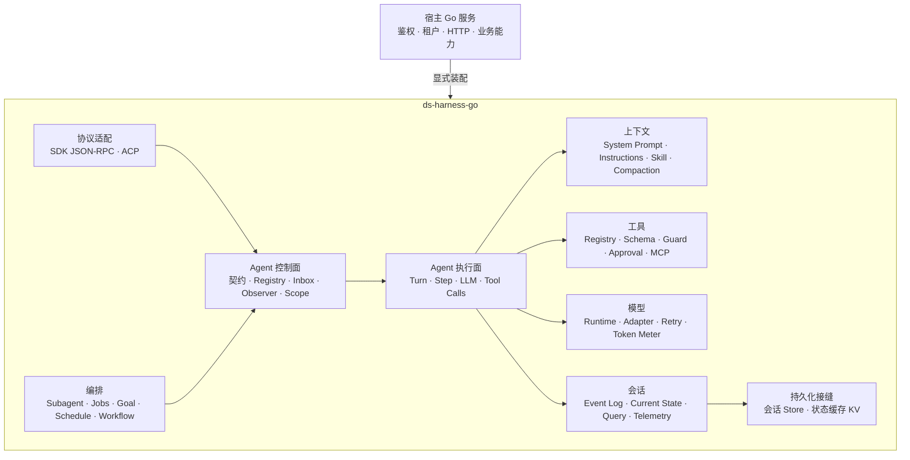
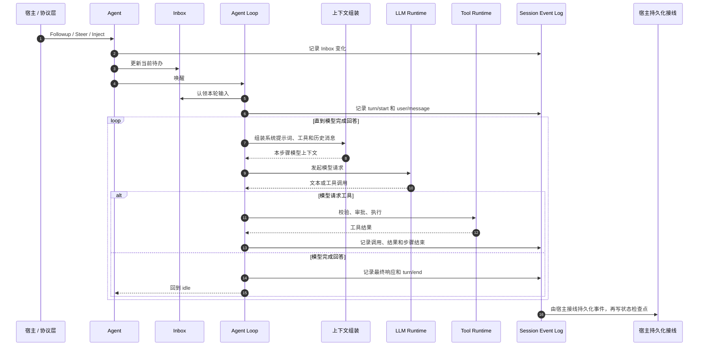
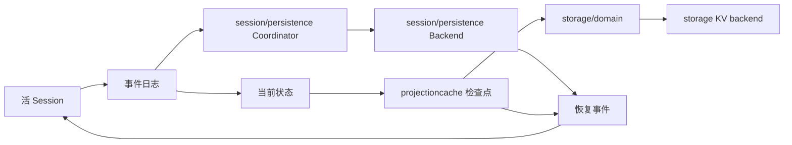

# 总体架构

## 目标

`ds-harness-go` 是可嵌入现有 Go 服务的 Agent 运行时。宿主提供模型、工具、Skill、人格、存储、鉴权和传输；运行时负责 Agent 生命周期、ReAct 循环、上下文组装、工具调度、会话记录、恢复和多 Agent 协作。

运行时不绑定业务领域，不接管宿主进程，也不执行任意 Shell 命令。

## 分层



## 控制面与执行面

`core/agent` 是控制面，定义活 Agent 的公共接口、注册表、作用域、收件箱和扩展点。协议层、后台任务和子 Agent 只依赖这层。

`core/agentloop` 是执行面，实现 `Agent` 和 `Factory`，真正驱动回合、模型请求和工具调用。控制面不依赖具体循环实现。

这种拆分保证上层不会被 ReAct 循环的内部状态绑死，也允许将来替换执行实现而保留公共控制接口。

## 一轮请求



## 事件记录与当前状态

会话事件日志按时间保存“发生过什么”，例如用户发言、模型分块、工具调用、工具结果和回合结束。日志只追加，不把旧记录改成新状态。

程序实际使用的是“现在是什么”，例如当前模型历史、当前 Inbox、Token 统计和会话标题。代码会按固定规则把事件记录整理成这些当前结果；源码中把这种结果称为 `projection`。

```text
固定的事件记录                         当前结果
-------------------------------       -------------------------
消息 A 加入 Inbox                     Inbox 当前还有消息 B
消息 B 加入 Inbox            --->     当前模型历史
消息 A 被认领                         当前 Token 用量
工具调用与结果                        当前会话标题
```

运行中的会话在内存里增量更新当前结果，不会每次重算全部历史。`session/projectioncache` 会定期保存计算检查点；冷启动时只需读取最近检查点，再处理检查点之后的事件。缓存缺失、损坏或版本不兼容时才从头计算。

事件日志是权威事实，当前结果和缓存都可以重建。

## 作用域

`core/scope` 用一条父子链隔离配置和扩展：

- 全局层对全部 Agent 生效。
- 预设层对该预设下面的 Agent 生效。
- Agent 层只对自身及子作用域生效。
- 同名配置由较近的作用域覆盖，但保留原有排列位置。
- 事件只向祖先作用域传播，不会传播给兄弟 Agent。
- 作用域释放时，按后进先出顺序清理登记在其上的资源。

工具、系统提示词、Agent Observer 和多种策略都复用这套规则。

## 接口与实现

| 接口或协调层 | 内置实现 | 宿主可替换 |
|---|---|---|
| `llm` | `llm/openaicompat` | 自定义模型适配器 |
| `storage` | `storage/postgres` | 自定义 KV 后端 |
| `session/persistence` | `Coordinator`、写后队列和恢复编排；无内置生产 Backend | 自定义会话介质与顶层装配 |
| `fs` | `fs/objectstore` | 自定义对象或文件后端 |
| `spill.Store` | 无强制默认实现 | 自定义大结果外置服务 |
| `attachment.Store` | 无强制默认实现 | 自定义附件存储 |
| `credentials.Provider` | 内存实现用于测试/简单部署 | 自定义凭据服务 |
| `sdk/sdkserver` | 协议服务对象 | 宿主决定 HTTP、WebSocket 或其他传输 |

接口不拥有具体实现的生命周期。注册表的注销通常只移除登记，关闭后端由创建并持有它的宿主负责。

## 并发规则

- Registry、存储设施和共享服务对并发访问提供内部保护。
- 用户回调和 Observer 尽量在内部锁外执行，避免回调重入造成死锁。
- 单个会话事件日志保持单写者；Agent 循环是正常写入者。
- Inbox 自身不加锁，外部输入通过 `Agent` 方法进入。
- 工具可以并行派发，但执行前和执行后策略保持确定顺序。
- Context 取消沿模型流、工具执行和装配过程向下传递。
- Dispose 和 Close 要么幂等，要么由一次性句柄明确限制所有权。

## 持久化与恢复



会话日志 Backend 和状态缓存 KV Backend 是两条接口，不要求使用同一介质。`session/persistence.Coordinator` 可以连接活 Session 的创建、事件、Flush 和释放边界，并负责按会话串行、写入攒批、准备池、崩溃修复提交和关闭排干；宿主仍需提供具体会话 Backend 并完成顶层装配。持久化顺序必须保证事件先于对应的状态缓存落盘。缓存可以落后于日志，但不能领先于日志，否则恢复时会出现没有事实依据的状态。

## 模块关系

| 文档模块 | 覆盖的主要包 |
|---|---|
| [Agent](modules/agent.md) | `core/agent`、`core/scope`、`core/agentdefaultmodel` |
| [Agent Loop](modules/agentloop.md) | `core/agentloop`、上下文组装、压缩与外置接线 |
| [Session](modules/session.md) | `session`、`core/session`、`session/*`、`sessionquery` |
| [LLM](modules/llm.md) | `llm`、`llm/*` |
| [Tools](modules/tools.md) | `core/tools`、`guard/*`、`interaction/*`、`mcp`、`todo`、`plan` |
| [Skill](modules/skill.md) | `skill`、`preset/*`、`context/*`、`core/systemprompt` |
| [Subagent](modules/subagent.md) | `subagent/*` |
| [Storage](modules/storage.md) | `storage/*`、`session/persistence`、`fs/*`、`attachment`、`credentials` |
| [Workflow](modules/workflow.md) | `jobs/*`、`goal/*`、`schedule/*`、`workflow/*` |
| [Protocol](modules/protocol.md) | `sdk/*`、`acp/*`、`mcp` |

## 明确不做

- 不提供任意 Shell、终端、子进程、代码执行器或本地代码沙箱。
- 不读取宿主服务器目录作为默认文件能力。
- 不内置业务人格、行业 Skill 或业务工具。
- 不强制数据库、HTTP 框架、进程模型或部署平台。
- 不把内存 Agent 当作长期状态来源。
- 当前不提供自动完成全部装配的顶层 Builder。
