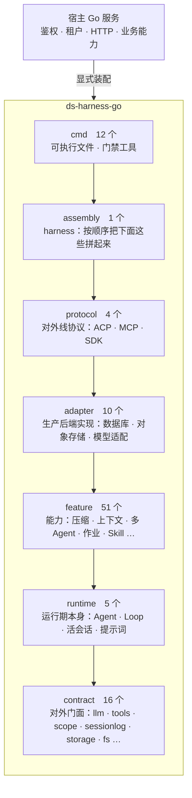
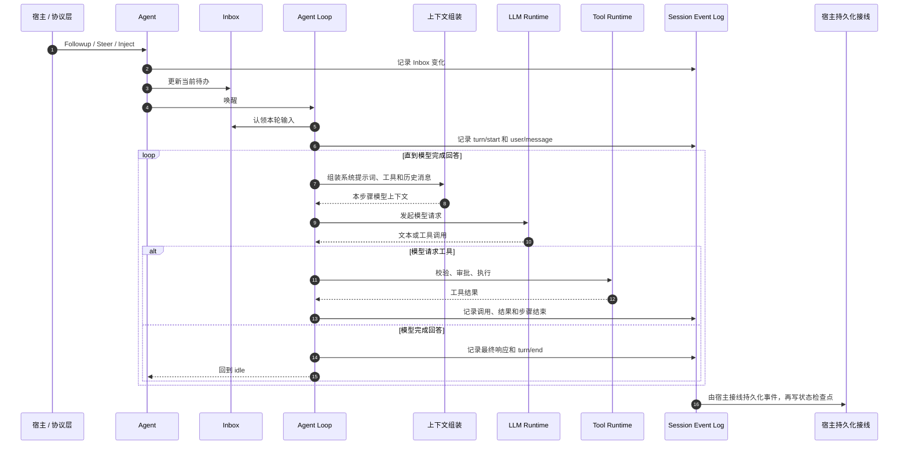
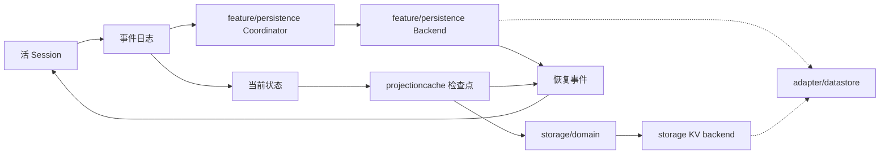

# 总体架构

## 目标

`ds-harness-go` 是可嵌入现有 Go 服务的 Agent 运行时。宿主提供模型、工具、Skill、人格、存储、鉴权和传输；运行时负责 Agent 生命周期、ReAct 循环、上下文组装、工具调度、会话记录、恢复和多 Agent 协作。

运行时不绑定业务领域，不接管宿主进程，也不执行任意 Shell 命令。

## 分层

99 个包按角色分成七档。**箭头是允许的 import 方向，反过来就是错的**——这不是一张示意图，档位表写在 [`layers.tsv`](layers.tsv) 里，加一条反方向的 import 会让 `internal/devtools/layercheck` 变红。



同档之间可以互引，跨档只许从上往下。契约层零依赖，是这张图的地板：它不许 import 任何别的档，所以宿主可以只引 `llm`、`tools`、`storage` 这几个包来写自己的实现，不会被整个运行时拖进来。

目录名和档位不是一回事。目录名是给人读的索引，把一个包挪进 `feature/` 不会让它变成能力包，只会让门禁按能力包的规矩查它——**目录名骗得了人，骗不过门禁**。

### 七档各自的边界

一档是什么，看的不是它叫什么，是**它该干什么、不该干什么、谁能引它**。下面每一行的「不该干什么」后面都跟着执行它的那道门禁；跟着「靠人」两个字的，是本仓库明知道没有机器守着、仍然选择这么写的地方。

| 档 | 该干什么 | 不该干什么 | 谁能引它 |
|---|---|---|---|
| **contract**　16 个 | 定义全仓库共用的词汇和对外接口：一条消息、一个事件、一次释放、一份存储、一个工具长什么样 | 不许 import 任何别的档（`layercheck`）；不许碰磁盘（`oscheck`）；不许出现 SQL 或 `database/sql`（`dbcheck`）；**不许自带生产后端实现**——只声明接口和纯计算，实现归 `adapter`（靠人，见下） | 所有档，以及仓库外的宿主 |
| **runtime**　5 个 | 运行期本身：一个活 Agent 长什么样、驱动它的 ReAct 循环、会话活着的那一半、这一步该看到什么提示词、没自带模型选择时用哪个 | 不许 import 能力、后端、协议、装配（`layercheck`）；不许碰磁盘、不许知道下面是个数据库（`oscheck`／`dbcheck`） | `feature` 及以上 |
| **feature**　51 个 | 建在运行期之上的能力：压缩、上下文注入、多 Agent、作业、Skill、计划模式、会话查询…… | 不许 import 后端实现与协议（`layercheck`）；不许碰磁盘、不许连数据库（`oscheck`／`dbcheck`）；不许引 `adapter/datastore`，要引就引业务接口（`dbcheck`） | `adapter` 及以上 |
| **adapter**　10 个 | 契约层那些接口的生产实现：SQL 方言底座、键值与会话存储、对象与图片与文本存储、模型适配、作业后端 | 不许被 `feature` 及以下引用（`layercheck`）；`adapter/datastore` 之外不许出现 SQL 语句文本（`dbcheck`） | `protocol` 及以上 |
| **protocol**　4 个 | 对外线协议：ACP、MCP、SDK 的编解码与服务端 | 不许被 `adapter` 及以下引用（`layercheck`）；不许自己装配运行时——装配在 `harness`（`layercheck`：`protocol` 引不到 `harness`） | `assembly` 及以上 |
| **assembly**　1 个 | `harness`：按顺序把上面这些拼起来，交出生命周期 | 不许被 `protocol` 及以下引用（`layercheck`）；**不许含业务逻辑**——它只管装配顺序（靠人，见下） | `cmd`，以及仓库外的宿主 |
| **cmd**　12 个 | 可执行文件、样例宿主、门禁工具自己 | 不许被任何包引用（`layercheck`） | 谁都不引它 |

`cmd` 这一档是唯一**允许**碰磁盘和连数据库的：`oscheck` 和 `dbcheck` 都明写放行 `cmd/` 与 `internal/devtools/`。理由是它们跑在本机上，是装配点和门禁工具，不是这个服务的业务代码——一个装配点从磁盘读一份配置、决定连哪个库、池子开多大，正是它的活儿。

这张表上的门禁列不是照抄各自的文档写的，是**逐条把它弄红过**：往契约包 `spill` 里加一条引 `protocol/mcp` 的 import，`layercheck` 报 `spill/spill.go:49：spill（contract）引了 protocol/mcp（protocol）`；加一句 `os.ReadFile`，`oscheck` 报出行号；加一个 `database/sql` 和一句 `SELECT ... FROM`，`dbcheck` 报出两处。三次都退出码非零，改回去之后 `git diff` 为空。跑绿证明不了门禁在干活，能变红才证明。

`oscheck` 另有两项豁免，且明写「不许再加」：`adapter/datastore/internal/dbtest`（数据库测试夹具，起一个临时 SQLite 文件再删掉，因为要供别的包的测试 import 所以不能写成 `_test.go`）和 `feature/replay`（快照测试用的假模型，读回放脚本）。

### 三条只靠人守的边界

写在这里是因为**没写下来的例外会变成惯例**。

1. **契约包不许自带生产后端实现。**`dbcheck` 和 `oscheck` 兜住了一半——契约包里写一份 Postgres 实现会被 `dbcheck` 判红，写一份本地磁盘实现会被 `oscheck` 判红。兜不住的是内存实现：在 `storage` 里塞一个 map 后端，机器看不出问题。判据只能靠人：契约包里的代码要么是接口声明，要么是不依赖任何后端的纯计算。测试替身（`fs/fstest`、`storage/storagetest`、`llm/mockserver`）是显式的例外，它们跟着自己的契约放，标准库同理。
2. **`harness` 不许含业务逻辑。**它是装配门面，全部内容应该是「按什么顺序把谁挂上去」。机器分不出一行代码是装配还是业务。
3. **`feature` 之间的互引不设方向。**这是刻意的：51 个能力包之间的真实依赖是一张网不是一条链，强行定序只会逼出假的中间层。Go 编译器禁 import 循环，那是唯一的约束。

第三条的代价要说清楚：`feature` 内部出现「A 依赖 B、B 也想依赖 A」时，门禁不会提醒，编译器会——但那时已经写完了。

### 边界一路落到了包这一级

上面这张表管的是**档**，往下还有两级，两级都有门禁：

| 这一级 | 谁要写 | 写什么 | 缺了会怎样 |
|---|---|---|---|
| 档 | 七档各自 | 上面那张表 | `layercheck` 判 import 方向 |
| 模块 | `docs/modules` 下每一篇 | 定位、架构、生命周期与并发、失败语义、**能力边界**、对应的 DSH 能力、相关源码 | `doccheck` 缺一节变红 |
| 包 | 全部 99 个包 | 包注释末尾一节「不做什么」，3 到 6 条，逐条指出不负责什么、各归谁 | `doccheck` 缺这一节变红 |

最后一行是这三级里最容易漏的一级，也是**唯一一级说的全是否定句**。理由：一个包该干什么，读它的导出符号大致读得出来；**不该**干什么读不出来——那是当初做决定时排除掉的东西，不写下来就只活在写的人脑子里，下一个人照着「这里加一下最方便」就把它加进来了。

三级都只查**在不在**，不查**对不对**。后者机器判不了，是评审的事。

### 三个包被半个仓库引着，这是要的形状

数一遍谁被引得最多（含测试引用）：

| 包 | 被多少个包引 | 它是什么 |
|---|---|---|
| `llm` | 57 | 消息、内容块、模型请求与流式响应的词汇 |
| `sessionlog` | 56 | 事件、会话 ID 与事件词汇 |
| `scope` | 52 | 作用域与释放语义 |
| `harness/session` | 33 | 活会话 |
| `harness/agent` | 32 | 活 Agent 的控制面 |

前三个都在契约层，也就是那张图的地板。一个包被半数以上的包引着，通常是「这里堆了太多不相干的东西」的信号，但这三个不是：它们定义的是**全仓库共用的那套词汇**，谁要谈一条消息、一个事件、一次释放，就绕不开它们。把 `llm` 拆成 `llm/message` `llm/stream` 只会让每个调用方从引一个包变成引三个，词汇本身一个字都没少。

真正管着这件事的不是包的大小，而是方向：契约层零依赖，它不许 import 任何别的档。所以扇入再高也不会把调用方拖进整个运行时——宿主引 `llm` 拿到的就是 `llm`。这一条由 `internal/devtools/layercheck` 守着。

包的行数同理不作为拆分理由。最大的几个包非测试代码在三千到六千行之间，标准库的 `net/http` 一个包就两万多行。**要拆的是文件，不是包**：一个包摊在十几个各管一件事的文件里读得动，一个一千七百行的文件读不动。

## 控制面与执行面

`harness/agent` 是控制面，定义活 Agent 的公共接口、注册表、作用域、收件箱和扩展点。协议层、后台任务和子 Agent 只依赖这层。

`harness/agentloop` 是执行面，实现 `Agent` 和 `Factory`，真正驱动回合、模型请求和工具调用。控制面不依赖具体循环实现。

这种拆分保证上层不会被 ReAct 循环的内部状态绑死，也允许将来替换执行实现而保留公共控制接口。

## 一轮请求



## 事件记录与当前状态

会话事件日志按时间保存“发生过什么”，例如用户发言、模型分块、工具调用、工具结果和回合结束。日志只追加，不把旧记录改成新状态。

程序实际使用的是“现在是什么”，例如当前模型历史、当前 Inbox、Token 统计和会话标题。代码会按固定规则把事件记录整理成这些当前结果；源码中把这种结果称为 `projection`。

```text
固定的事件记录                         当前结果
-------------------------------       -------------------------
消息 A 加入 Inbox                     Inbox 当前还有消息 B
消息 B 加入 Inbox            --->     当前模型历史
消息 A 被认领                         当前 Token 用量
工具调用与结果                        当前会话标题
```

运行中的会话在内存里增量更新当前结果，不会每次重算全部历史。`feature/projectioncache` 会定期保存计算检查点；冷启动时只需读取最近检查点，再处理检查点之后的事件。缓存缺失、损坏或版本不兼容时才从头计算。

事件日志是权威事实，但它**不是完整的**：一个会话的事件超过上限时，最老的那一段会被删掉（见 `docs/session-log-limit.md`）。所以「当前结果可以重建」这句要加一个范围——只能从**还在的**那一段重建。

```text
一个长会话的事件记录
┌──────────────┬────────────────────────────────┐
│  已被删掉    │            还  在              │
└──────────────┴────────────────────────────────┘
        ↑
   最后一次更新落在这一段里的当前结果，重建不出来，就缺着
```

缺着不算故障，读照常走完：读的一方拿到的是「现在能算出来的那些」，不是一条错误。比如一份待办清单可能少几项，会话仍然继续。

## 作用域

`scope` 用一条父子链隔离配置和扩展：

- 全局层对全部 Agent 生效。
- 预设层对该预设下面的 Agent 生效。
- Agent 层只对自身及子作用域生效。
- 同名配置由较近的作用域覆盖，但保留原有排列位置。
- 事件只向祖先作用域传播，不会传播给兄弟 Agent。
- 作用域释放时，按后进先出顺序清理登记在其上的资源。

工具、系统提示词、Agent Observer 和多种策略都复用这套规则。

## 接口与实现

| 接口或协调层 | 内置实现 | 宿主可替换 |
|---|---|---|
| `llm` | `adapter/openaicompat` | 自定义模型适配器 |
| `storage` | `adapter/datastore/kvstore` | 自定义 KV 后端 |
| `feature/persistence` | `Coordinator`、写后队列和恢复编排，生产 Backend 是 `adapter/datastore/sessionstore` | 自定义会话介质与顶层装配 |
| `fs` | `adapter/objectstore` | 自定义对象或文件后端 |
| `spill.Store` | 无强制默认实现 | 自定义大结果外置服务 |
| `attachment.Store` | 无强制默认实现 | 自定义附件存储 |
| `credentials.Provider` | 内存实现用于测试/简单部署 | 自定义凭据服务 |
| `protocol/sdk/sdkserver` | 协议服务对象 | 宿主决定 HTTP、WebSocket 或其他传输 |

接口不拥有具体实现的生命周期。注册表的注销通常只移除登记，关闭后端由创建并持有它的宿主负责。

## 并发规则

- Registry、存储设施和共享服务对并发访问提供内部保护。
- 用户回调和 Observer 尽量在内部锁外执行，避免回调重入造成死锁。
- 单个会话事件日志保持单写者；Agent 循环是正常写入者。
- Inbox 自身不加锁，外部输入通过 `Agent` 方法进入。
- 工具可以并行派发，但执行前和执行后策略保持确定顺序。
- Context 取消沿模型流、工具执行和装配过程向下传递。
- Dispose 和 Close 要么幂等，要么由一次性句柄明确限制所有权。

## 持久化与恢复



会话日志 Backend 和状态缓存 KV Backend 是两条接口，不要求使用同一介质。两条上仓库自带的实现都落在 `adapter/datastore` 底下——那是唯一 import `database/sql`、唯一写 SQL 的地方，`sessionlog` 和 `storage` 两棵树里不许出现任何一处提到数据库，界线由 `internal/devtools/dbcheck` 把着（见[持久化抽象层](modules/datastore.md)）。`feature/persistence.Coordinator` 可以连接活 Session 的创建、事件、Flush 和释放边界，并负责按会话串行、写入攒批、准备池、崩溃修复提交和关闭排干；宿主仍需提供具体会话 Backend 并完成顶层装配。持久化顺序必须保证事件先于对应的状态缓存落盘。缓存可以落后于日志，但不能领先于日志，否则恢复时会出现没有事实依据的状态。

## 模块关系

这里只列主干，全部 99 个包到文档的映射在 [`packages.md`](packages.md) 里，由 `internal/devtools/doccheck` 校验。

| 文档模块 | 覆盖的主要包 |
|---|---|
| [Agent 控制面](modules/agent.md) | `harness/agent` |
| [Agent Loop](modules/agentloop.md) | `harness/agentloop`、上下文组装、压缩与外置接线 |
| [活会话](modules/livesession.md) | `harness/session` |
| [Session](modules/session.md) | `sessionlog`、`sessionlog/projection`、`feature/persistence` 等会话周边能力 |
| [LLM](modules/llm.md) | `llm`、`adapter/openaicompat`、`feature/llmretry`、`feature/tokenmeter` |
| [Tools](modules/tools.md) | `tools` |
| [系统提示词装配](modules/systemprompt.md) | `harness/systemprompt` |
| [作用域](modules/scope.md) | `scope` |
| [Skill、提示词与预设](modules/skill.md) | `feature/skill`、`feature/skill/skilltool` |
| [多 Agent](modules/subagent.md) | `feature/subagent/*` |
| [存储、文件与附件](modules/storage.md) | `storage/*`、`fs/*`、`attachment`、`credentials` |
| [持久化抽象层](modules/datastore.md) | `adapter/datastore` 及其 `kvstore`、`sessionstore` |
| [后台作业](modules/jobs.md)、[长期目标](modules/goal.md)、[耐久提醒](modules/schedule.md)、[Ralph 工作流](modules/ralph.md) | `feature/jobs/*`、`feature/goal/*`、`feature/schedule`、`feature/workflow/*` |
| [ACP 接入](modules/acp.md)、[MCP 客户端](modules/mcp.md)、[SDK 协议与服务端](modules/sdk.md) | `protocol/*` |
| [移植与文档门禁工具](modules/migration-tools.md) | `internal/devtools/*` |

## 明确不做

- 不提供任意 Shell、终端、子进程、代码执行器或本地代码沙箱。
- 不读取宿主服务器目录作为默认文件能力。
- 不内置业务人格、行业 Skill 或业务工具。
- 不强制数据库、HTTP 框架、进程模型或部署平台。
- 不把内存 Agent 当作长期状态来源。
- 当前不提供自动完成全部装配的顶层 Builder。
