# 总体架构

## 这是什么

`ds-harness-go` 是一个能装进现有 Go 服务里的 Agent 运行时。它不是一个可以直接启动的产品，也不是一个框架——它不接管你的进程。

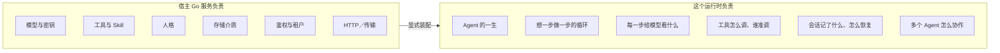

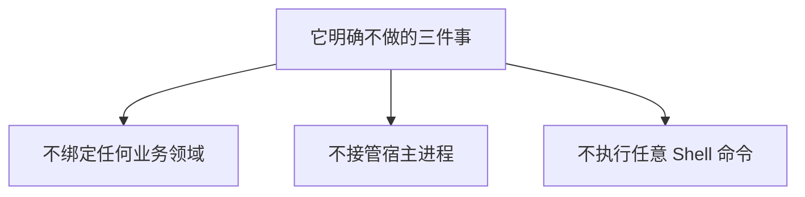

---

## 分层：箭头是允许的 import 方向

112 个包按角色分成七档。

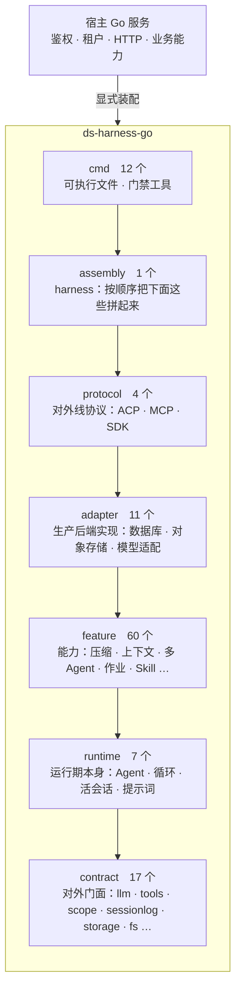

### 这不是一张示意图

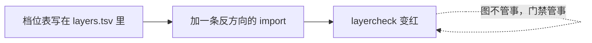

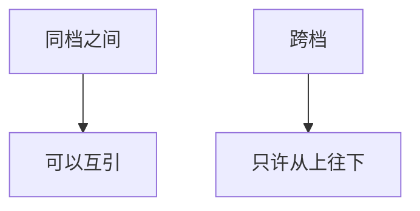

### 契约层是这张图的地板

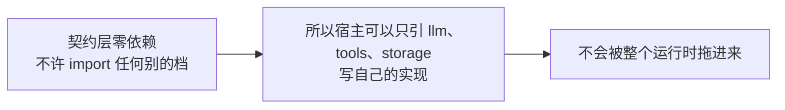

### 目录名和档位不是一回事

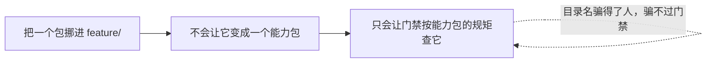

---

## 七档各自的边界

一档是什么，看的不是它叫什么，是**它该干什么、不该干什么、谁能引它**。

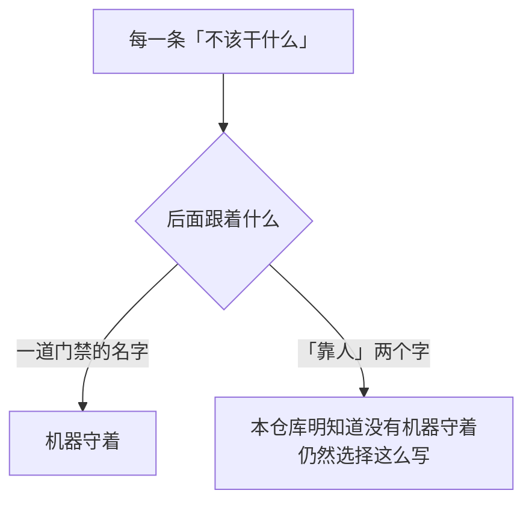

| 档 | 该干什么 | 不该干什么 | 谁能引它 |
|---|---|---|---|
| **contract**　17 个 | 定义全仓库共用的词汇和对外接口：一条消息、一个事件、一次释放、一份存储、一个工具长什么样 | 不许 import 任何别的档（`layercheck`）；不许碰磁盘（`oscheck`）；不许出现 SQL 或数据库标准库（`dbcheck`）；**不许自带生产后端实现**——只声明接口和纯计算，实现归 `adapter`（靠人，见下） | 所有档，以及仓库外的宿主 |
| **runtime**　7 个 | 运行期本身：一个活 Agent 长什么样、驱动它的循环、会话活着的那一半、这一步该看到什么提示词、没自带模型选择时用哪个 | 不许 import 能力、后端、协议、装配（`layercheck`）；不许碰磁盘、不许知道下面是个数据库（`oscheck`／`dbcheck`） | `feature` 及以上 |
| **feature**　60 个 | 建在运行期之上的能力：压缩、上下文注入、多 Agent、作业、Skill、计划模式、会话查询…… | 不许 import 后端实现与协议（`layercheck`）；不许碰磁盘、不许连数据库（`oscheck`／`dbcheck`）；不许引持久化抽象层，要引就引业务接口（`dbcheck`） | `adapter` 及以上 |
| **adapter**　11 个 | 契约层那些接口的生产实现：SQL 方言底座、键值与会话存储、对象与图片与文本存储、模型适配、作业后端 | 不许被 `feature` 及以下引用（`layercheck`）；持久化抽象层之外不许出现 SQL 语句文本（`dbcheck`） | `protocol` 及以上 |
| **protocol**　4 个 | 对外线协议：ACP、MCP、SDK 的编解码与服务端 | 不许被 `adapter` 及以下引用（`layercheck`）；不许自己装配运行时——装配在 `harness`（`layercheck`：`protocol` 引不到 `harness`） | `assembly` 及以上 |
| **assembly**　1 个 | `harness`：按顺序把上面这些拼起来，交出生命周期 | 不许被 `protocol` 及以下引用（`layercheck`）；**不许含业务逻辑**——它只管装配顺序（靠人，见下） | `cmd`，以及仓库外的宿主 |
| **cmd**　12 个 | 可执行文件、样例宿主、门禁工具自己 | 不许被任何包引用（`layercheck`） | 谁都不引它 |

### cmd 是唯一被允许碰磁盘和连数据库的一档

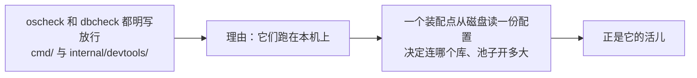

### 这张表的门禁列是逐条弄红过的

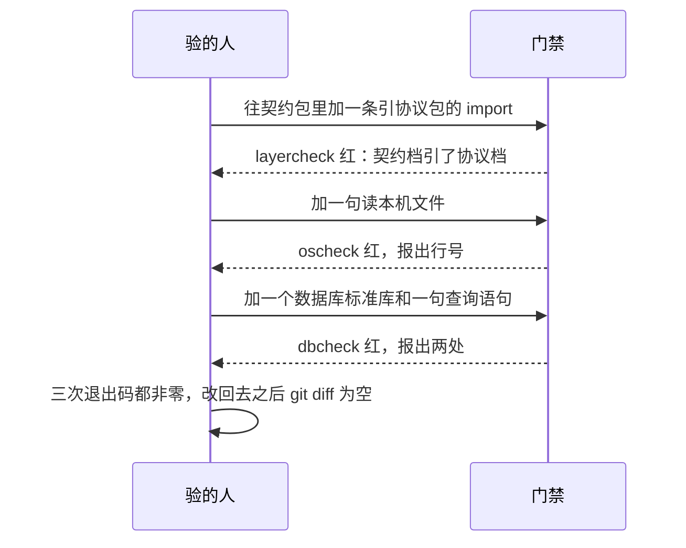

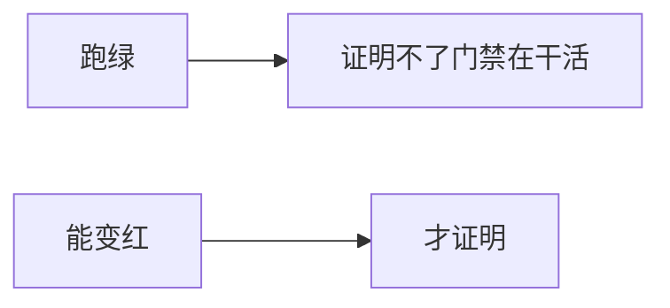

### oscheck 的两项豁免，且明写「不许再加」

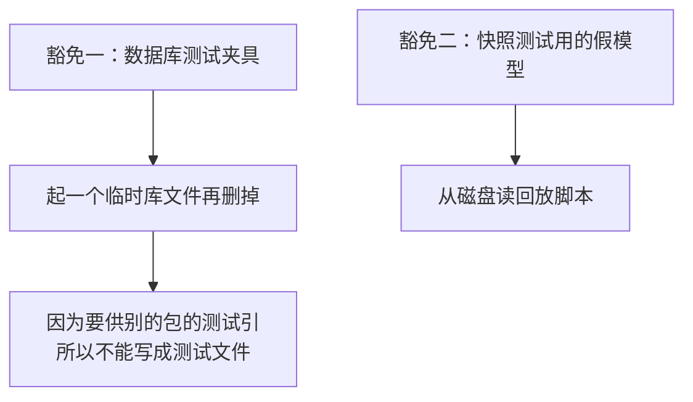

---

## 三条只靠人守的边界

写在这里是因为**没写下来的例外会变成惯例**。

### ① 契约包不许自带生产后端实现

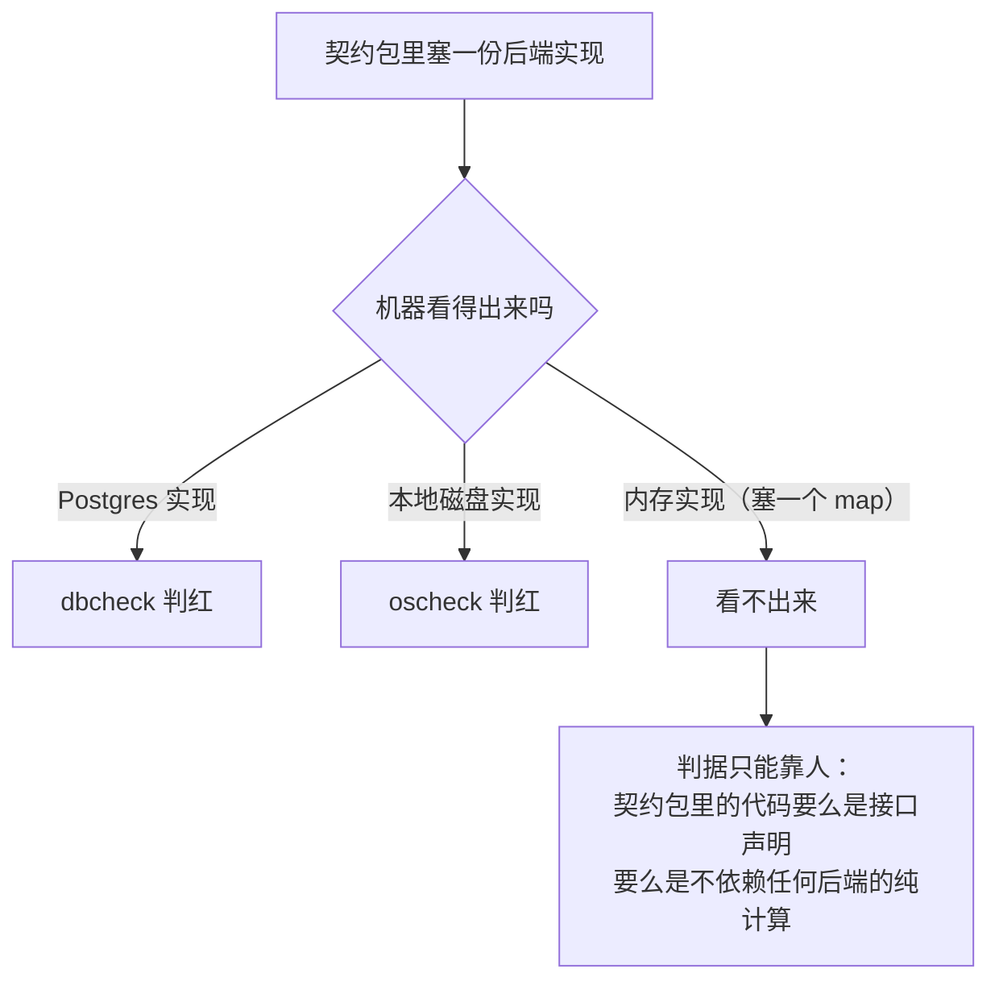

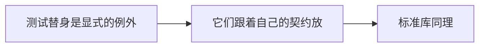

### ② harness 不许含业务逻辑

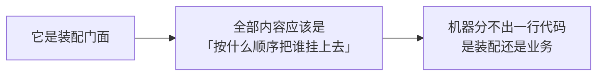

### ③ feature 之间的互引不设方向

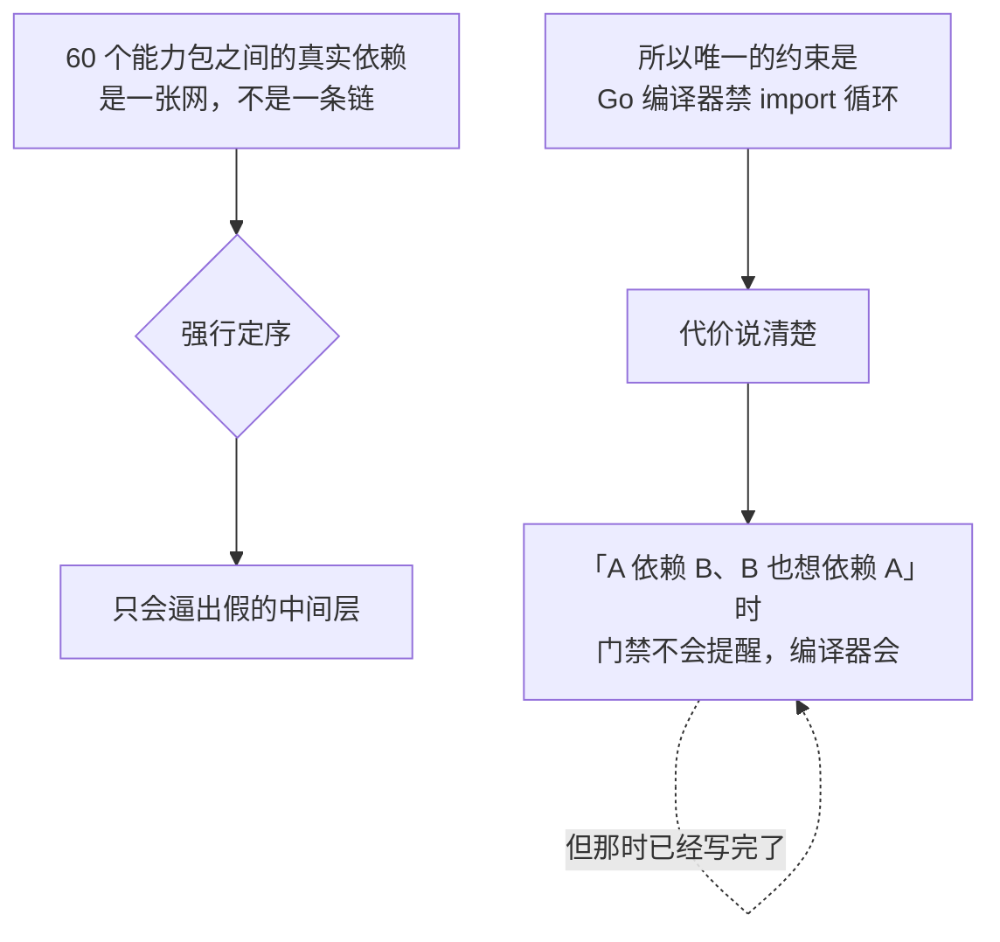

---

## 边界一路落到了包这一级

上面那张表管的是**档**，往下还有两级，两级都有门禁：

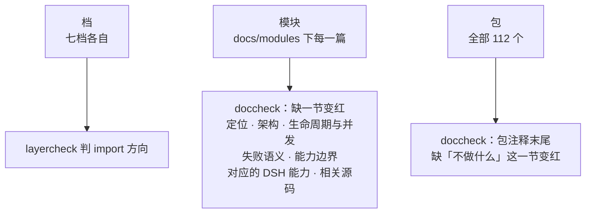

### 最后一级最容易漏，也是唯一一级说的全是否定句

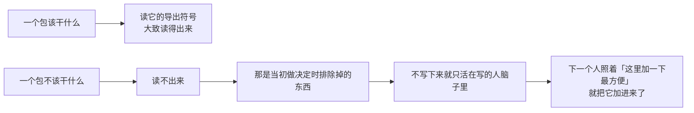

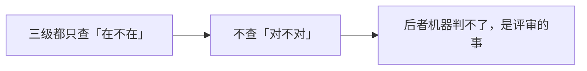

---

## 三个包被半个仓库引着，这是要的形状

数一遍谁被引得最多（含测试引用）：

| 包 | 被多少个包引 | 它是什么 |
|---|---|---|
| `llm` | 57 | 消息、内容块、模型请求与流式响应的词汇 |
| `sessionlog` | 56 | 事件、会话标识与事件词汇 |
| `scope` | 52 | 作用域与释放语义 |
| `harness/session` | 33 | 活会话 |
| `harness/agent` | 32 | 活 Agent 的控制面 |

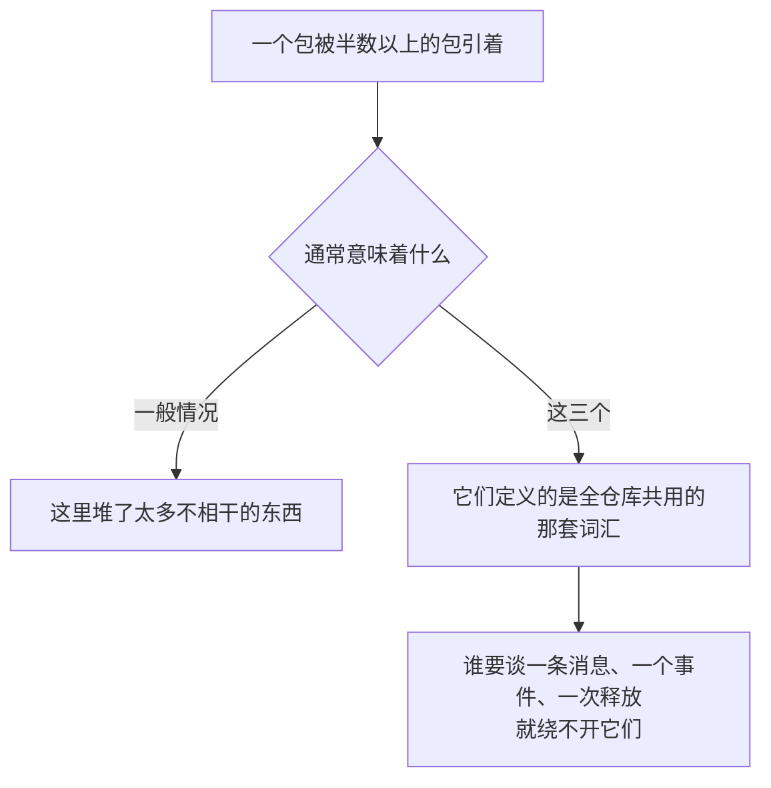

```mermaid
flowchart LR
    subgraph BAD["把 llm 拆成三个包"]
        A1["每个调用方从引一个包<br/>变成引三个"] --> A2["词汇本身一个字都没少"]
    end
```

### 真正管着这件事的是方向，不是大小

```mermaid
flowchart LR
    A["契约层零依赖"] --> B["扇入再高也不会<br/>把调用方拖进整个运行时"]
    B --> C["宿主引 llm，拿到的就是 llm"]
    C -.->|"这一条由 layercheck 守着"| C
```

### 行数同样不作为拆分理由

```mermaid
flowchart TD
    A["最大的几个包<br/>非测试代码三千到六千行"] --> B["标准库的 net/http<br/>一个包两万多行"]
    C["要拆的是文件，不是包"] --> C1["一个包摊在十几个<br/>各管一件事的文件里，读得动"]
    C --> C2["一个一千七百行的文件，读不动"]
```

---

## 控制面与执行面

```mermaid
flowchart TD
    P["控制面<br/>harness/agent"] --> P1["活 Agent 的公共接口"]
    P --> P2["名册"]
    P --> P3["作用域"]
    P --> P4["收件箱"]
    P --> P5["扩展点"]
    E["执行面<br/>harness/agentloop"] --> E1["真正驱动回合"]
    E --> E2["发模型请求"]
    E --> E3["调工具"]
    Users["协议层 · 后台作业 · 子 Agent"] --> P
    Users -.->|"只依赖控制面<br/>不依赖具体循环实现"| E
```

```mermaid
flowchart LR
    A["这样拆的两个好处"] --> B["上层不会被循环的内部状态绑死"]
    A --> C["将来换一套执行实现<br/>公共控制接口不用动"]
```

---

## 一轮请求

```mermaid
sequenceDiagram
    autonumber
    participant H as 宿主 / 协议层
    participant A as Agent
    participant I as 收件箱
    participant L as Agent 循环
    participant C as 上下文组装
    participant M as 模型运行时
    participant T as 工具运行时
    participant S as 会话事件日志
    participant P as 宿主持久化接线

    H->>A: 追问 / 打断 / 注入
    A->>S: 记录收件箱变化
    A->>I: 更新当前待办
    A->>L: 唤醒
    L->>I: 认领本轮输入
    L->>S: 记录回合开始与用户消息

    loop 直到模型完成回答
        L->>C: 组装系统提示词、工具和历史消息
        C-->>L: 这一步的模型上下文
        L->>M: 发起模型请求
        M-->>L: 文本或工具调用

        alt 模型要调工具
            L->>T: 校验、审批、执行
            T-->>L: 工具结果
            L->>S: 记录调用、结果和这一步结束
        else 模型答完了
            L->>S: 记录最终响应和回合结束
            L-->>A: 回到闲置
        end
    end

    S->>P: 由宿主接线把事件落下去，再写状态检查点
```

---

## 事件记录与当前状态

```mermaid
flowchart LR
    A["会话事件日志<br/>按时间记「发生过什么」"] --> A1["用户发言 · 模型分块<br/>工具调用 · 工具结果 · 回合结束"]
    A --> A2["只追加<br/>不把旧记录改成新状态"]
    B["程序实际要用的<br/>是「现在是什么」"] --> B1["当前模型历史 · 当前收件箱<br/>token 统计 · 会话标题"]
```

```mermaid
flowchart LR
    E1["消息甲进了收件箱"] --> P["按固定规则整理"]
    E2["消息乙进了收件箱"] --> P
    E3["消息甲被认领了"] --> P
    E4["一次工具调用与结果"] --> P
    P --> R1["收件箱里现在还剩消息乙"]
    P --> R2["当前模型历史"]
    P --> R3["当前 token 用量"]
    P --> R4["当前会话标题"]
```

### 不是每次都从头重算

```mermaid
flowchart TD
    A["运行中的会话"] --> A1["在内存里增量更新"]
    B["定期存一个计算检查点"] --> B1["冷启动只读最近那个检查点<br/>再处理它之后的事件"]
    C["检查点缺失 / 损坏 / 版本不兼容"] --> C1["才从头算一遍"]
```

### 事件日志是权威事实，但它不是完整的

```mermaid
flowchart LR
    A["一个会话的事件超过上限"] --> B["最老的那一段会被删掉"]
    B --> C["所以「当前状态可以重建」<br/>要加一个范围"]
    C --> D["只能从还在的那一段重建"]
```

```mermaid
flowchart LR
    subgraph LOG["一个长会话的事件记录"]
        direction LR
        D1["已被删掉的那一段"] --> D2["还在的那一段"]
    end
    D1 --> X["最后一次更新落在这一段里的当前状态<br/>重建不出来，就缺着"]
```

### 缺着不算故障

```mermaid
flowchart TD
    A["读的一方"] --> B["拿到的是「现在能算出来的那些」"]
    B --> C["不是一条错误"]
    C --> D["比如一份待办清单可能少几项<br/>会话仍然继续"]
```

---

## 作用域

```mermaid
flowchart LR
    G["全局层<br/>对全部 Agent 生效"] --> P["预设层<br/>对这个预设下面的 Agent 生效"] --> A["Agent 层<br/>只对自身及子作用域生效"]
```

```mermaid
flowchart TD
    A["同名配置"] --> A1["较近的那一层覆盖"]
    A1 --> A2["但保留原有的排列位置"]
    B["事件"] --> B1["只往祖先方向传"]
    B1 --> B2["传不到兄弟 Agent"]
    C["作用域释放"] --> C1["按后进先出清理挂在它上面的资源"]
```

```mermaid
flowchart LR
    A["工具"] --> S["同一套规则"]
    B["系统提示词"] --> S
    C["Agent 观察者"] --> S
    D["多种策略"] --> S
```

---

## 接口与实现

| 接口或协调层 | 内置实现 | 宿主可替换 |
|---|---|---|
| `llm` | `adapter/openaicompat` | 自定义模型适配器 |
| `storage` | `adapter/datastore/kvstore` | 自定义键值后端 |
| `feature/persistence` | 协调器、写后队列和恢复编排，生产后端是 `adapter/datastore/sessionstore` | 自定义会话介质与顶层装配 |
| `fs` | `adapter/objectstore` | 自定义对象或文件后端 |
| `spill` | 无强制默认实现 | 自定义大结果外置服务 |
| `attachment` | 无强制默认实现 | 自定义附件存储 |
| `credentials` | 内存实现，用于测试与简单部署 | 自定义凭据服务 |
| `protocol/sdk/sdkserver` | 协议服务对象 | 宿主决定 HTTP、WebSocket 或别的传输 |

```mermaid
flowchart LR
    A["接口不拥有具体实现的生命周期"] --> B["名册里注销通常只移除登记"]
    B --> C["关掉后端由建它、持有它的宿主负责"]
```

---

## 并发规则

```mermaid
flowchart TD
    A["名册、存储设施、共享服务"] --> A1["自己带内部保护"]
    B["用户回调与观察者"] --> B1["尽量在内部锁外跑<br/>避免回调重入造成死锁"]
    C["单个会话事件日志"] --> C1["保持单写者<br/>Agent 循环是正常写入者"]
    D["收件箱自身不加锁"] --> D1["外部输入统一从 Agent 的方法进来"]
    E["工具可以并行派发"] --> E1["但执行前和执行后的策略<br/>保持确定的顺序"]
    F["取消"] --> F1["沿模型流、工具执行、装配过程往下传"]
    G["释放与关闭"] --> G1["要么幂等<br/>要么由一次性句柄明确限制所有权"]
```

---

## 持久化与恢复

```mermaid
flowchart LR
    Live["活会话"] --> Events["事件日志"]
    Events --> Coordinator["persistence 协调器"]
    Coordinator --> SessionStore["会话日志后端"]

    Events --> Current["当前状态"]
    Current --> Cache["投影缓存检查点"]
    Cache --> Domain["storage 领域层"]
    Domain --> KVBackend["键值后端"]

    SessionStore --> Restore["恢复事件"]
    Cache --> Restore
    Restore --> Live

    SessionStore -.-> DS["adapter/datastore"]
    KVBackend -.-> DS
```

### 两条接口，不要求同一介质

```mermaid
flowchart LR
    A["会话日志后端"] --> C["两条上仓库自带的实现<br/>都落在 adapter/datastore 底下"]
    B["状态缓存的键值后端"] --> C
    C --> D["那是唯一 import 数据库标准库<br/>唯一写 SQL 的地方"]
    D --> E["sessionlog 和 storage 两棵树里<br/>不许出现任何一处提到数据库"]
    E -.->|"界线由 dbcheck 把着"| E
```

详见[持久化抽象层](modules/datastore.md)。

### 落盘顺序：缓存可以落后，不能领先

```mermaid
flowchart TD
    A["事件必须先于对应的状态缓存落盘"] --> B{"反过来会怎样"}
    B --> C["恢复的时候读到一份状态"]
    C --> D["而日志里找不到任何一条<br/>能推出这份状态的事实"]
    D -.->|"一个没有事实依据的状态"| D
```

### 协调器管的几件事

```mermaid
flowchart LR
    A["persistence 协调器"] --> A1["按会话串行"]
    A --> A2["写入攒批"]
    A --> A3["准备池"]
    A --> A4["崩溃修复提交"]
    A --> A5["关闭时排干"]
    B["宿主仍然要提供"] --> B1["具体的会话后端"]
    B --> B2["顶层装配"]
```

---

## 模块关系

这里只列主干，全部 112 个包到文档的映射在 [`packages.md`](packages.md) 里，由 `internal/devtools/doccheck` 校验。

| 文档模块 | 覆盖的主要包 |
|---|---|
| [Agent 控制面](modules/agent.md) | `harness/agent` |
| [Agent Loop](modules/agentloop.md) | `harness/agentloop`、上下文组装、压缩与外置接线 |
| [活会话](modules/livesession.md) | `harness/session` |
| [Session](modules/session.md) | `sessionlog`、`sessionlog/projection`、`feature/persistence` 等会话周边能力 |
| [LLM](modules/llm.md) | `llm`、`adapter/openaicompat`、`feature/llmretry`、`feature/tokenmeter` |
| [Tools](modules/tools.md) | `tools` |
| [系统提示词装配](modules/systemprompt.md) | `harness/systemprompt` |
| [作用域](modules/scope.md) | `scope` |
| [Skill、提示词与预设](modules/skill.md) | `feature/skill`、`feature/skill/skilltool` |
| [多 Agent](modules/subagent.md) | `feature/subagent/*` |
| [存储、文件与附件](modules/storage.md) | `storage/*`、`fs/*`、`attachment`、`credentials` |
| [持久化抽象层](modules/datastore.md) | `adapter/datastore` 及其 `kvstore`、`sessionstore` |
| [后台作业](modules/jobs.md)、[长期目标](modules/goal.md)、[耐久提醒](modules/schedule.md)、[工作流与 Ralph](modules/ralph.md) | `feature/jobs/*`、`feature/goal/*`、`feature/schedule`、`feature/workflow/*` |
| [ACP 接入](modules/acp.md)、[MCP 客户端](modules/mcp.md)、[SDK 协议与服务端](modules/sdk.md) | `protocol/*` |
| [移植与文档门禁工具](modules/migration-tools.md) | `internal/devtools/*` |

---

## 明确不做

```mermaid
flowchart TD
    N["这个运行时不提供"] --> N1["任意 Shell、终端、子进程<br/>代码执行器或本地代码沙箱"]
    N --> N2["把宿主服务器的目录<br/>当成默认的文件能力"]
    N --> N3["内置的业务人格、行业 Skill 或业务工具"]
    N --> N4["对数据库、HTTP 框架<br/>进程模型或部署平台的强制选择"]
    N --> N5["把内存里的 Agent 当成长期状态来源"]
    N --> N6["一个自动完成全部装配的顶层构建器<br/>（当前没有）"]
```
