# 嵌入现有 Go 服务

## 接入目标

宿主把这套运行时当作**进程内的一个组件**用，而不是启动一个固定形态的独立应用。

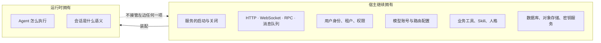

---

## 最小能力闭环

一个能完成普通对话和工具调用的部署，至少要有这几样：

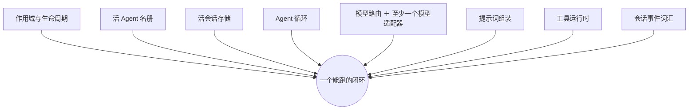

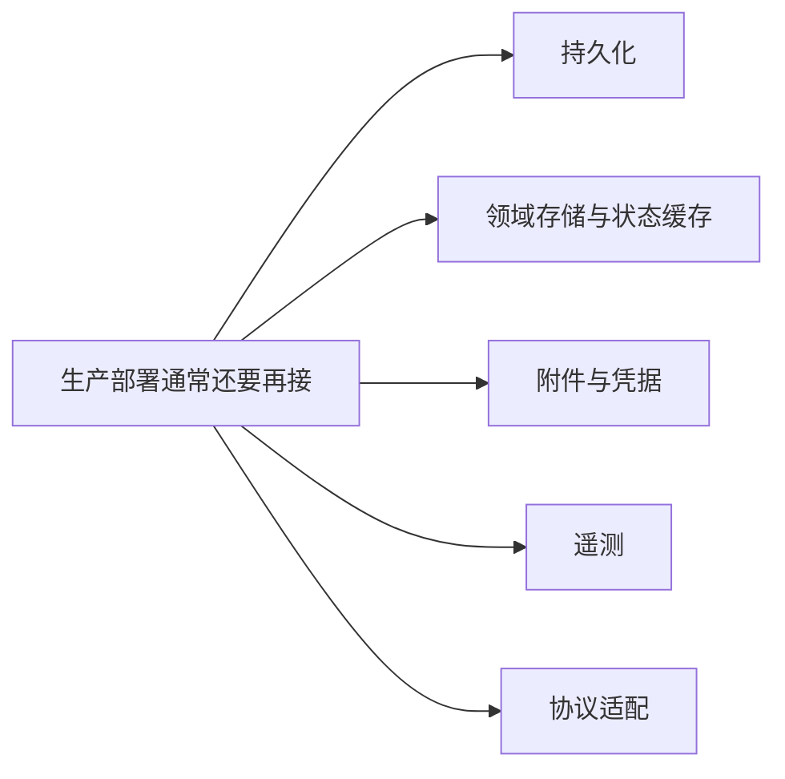

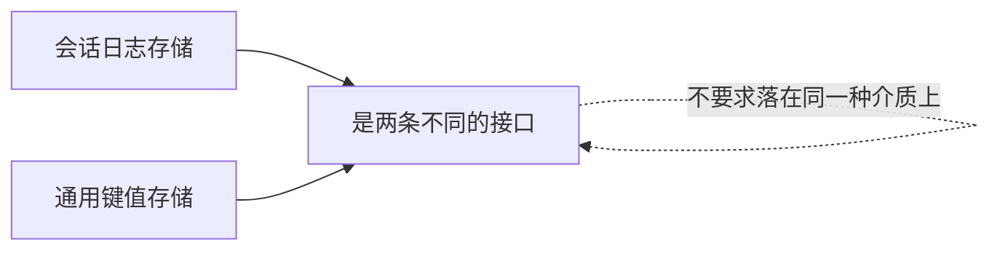

---

## 推荐装配顺序

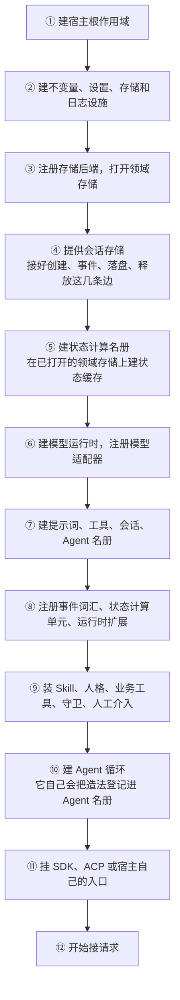

### 第 ⑩ 步不要再登记一次

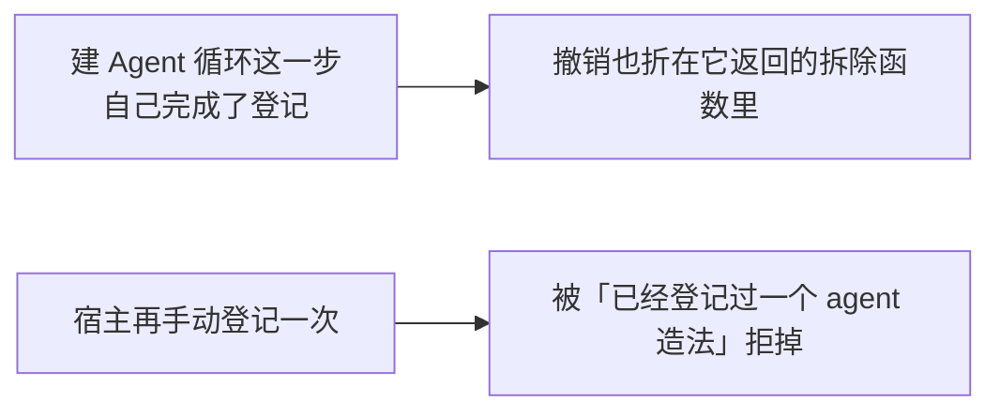

### 两条通用规矩

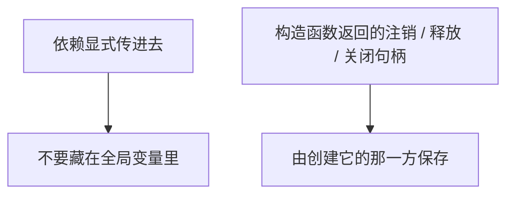

### 前 ⑩ 步里不碰外部介质的那一段，有一份可编译的版本

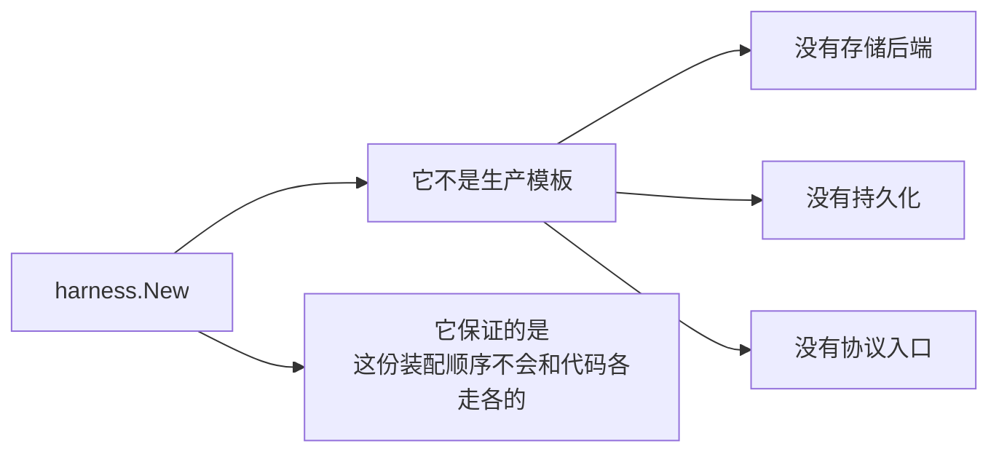

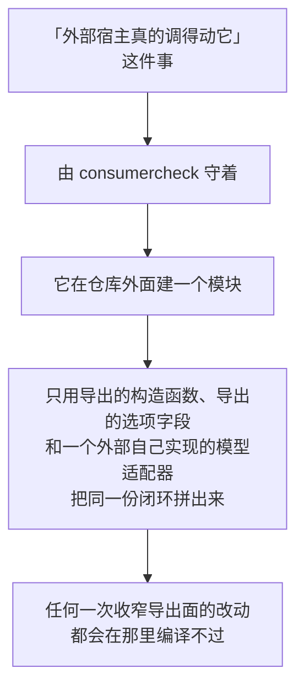

---

## 验这份装配真的活着

装完了不等于跑得动。一棵装好的树要过的最低那道线是三件事连起来：

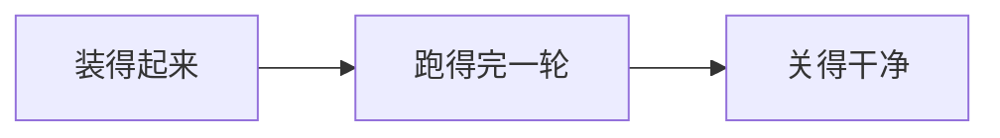

`harness/smoketest` 就是这条线的那把尺子：给它一棵已经公布的树，它送一句话进去、等整棵树静下来、把最终那句回答和这一轮的 token 记账交回来。

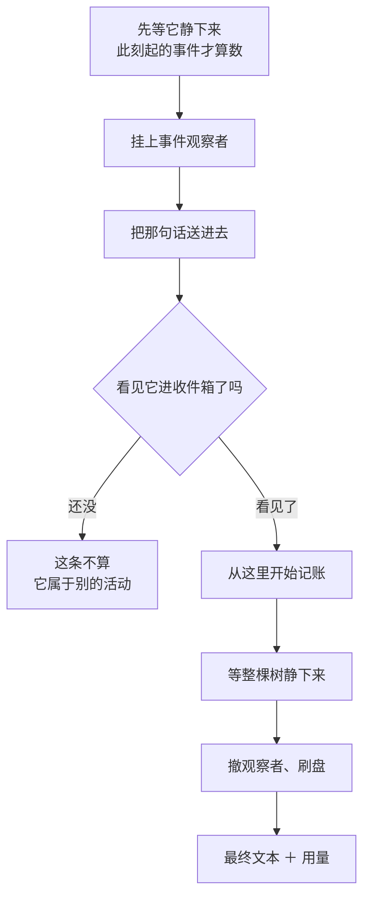

### 那道闸为什么必须有

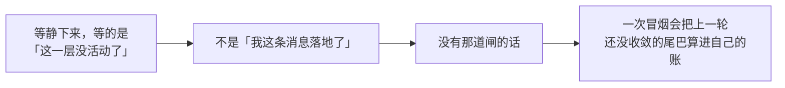

### 对树只有一条要求

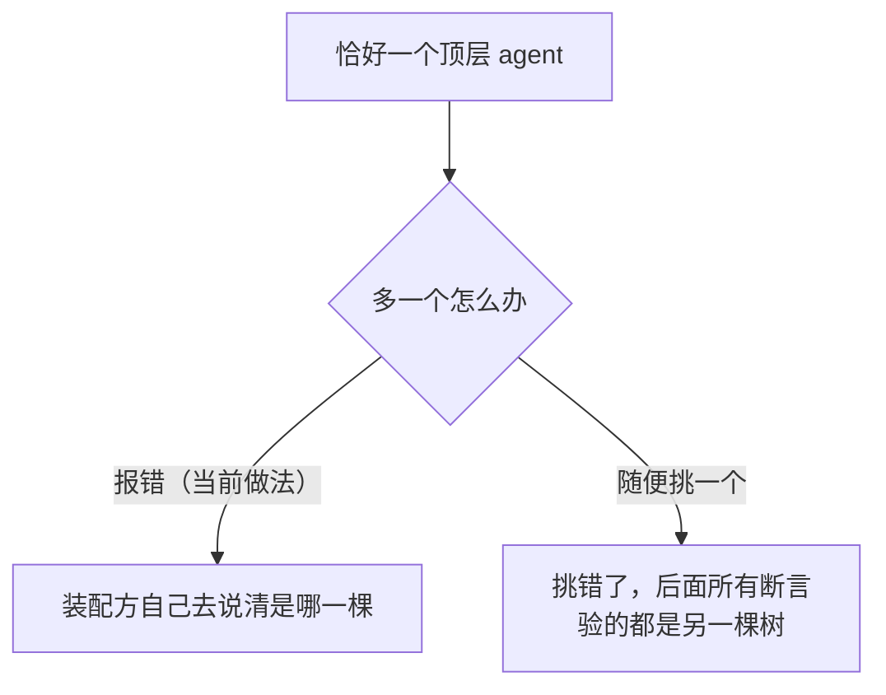

### DSH 那台冒烟机有三样没有移过来

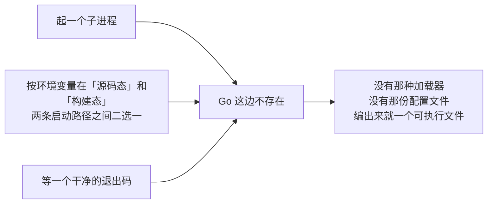

---

## 事件词汇

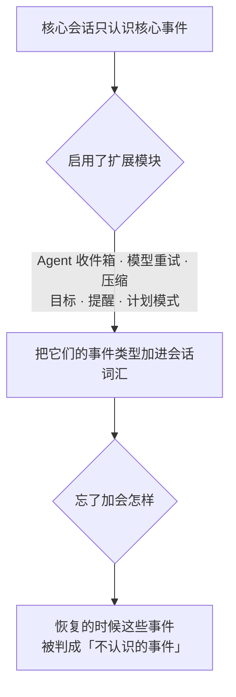

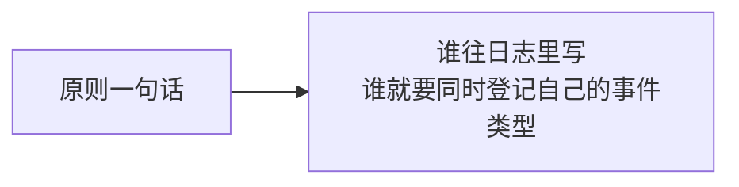

---

## 模型接入

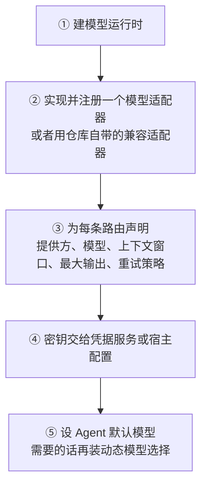

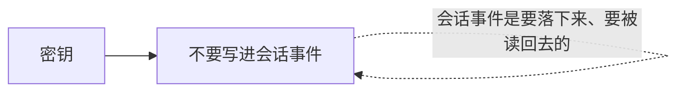

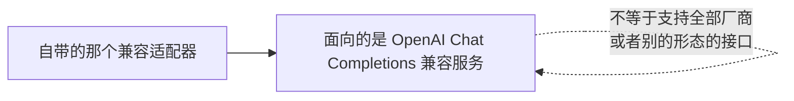

---

## 工具接入

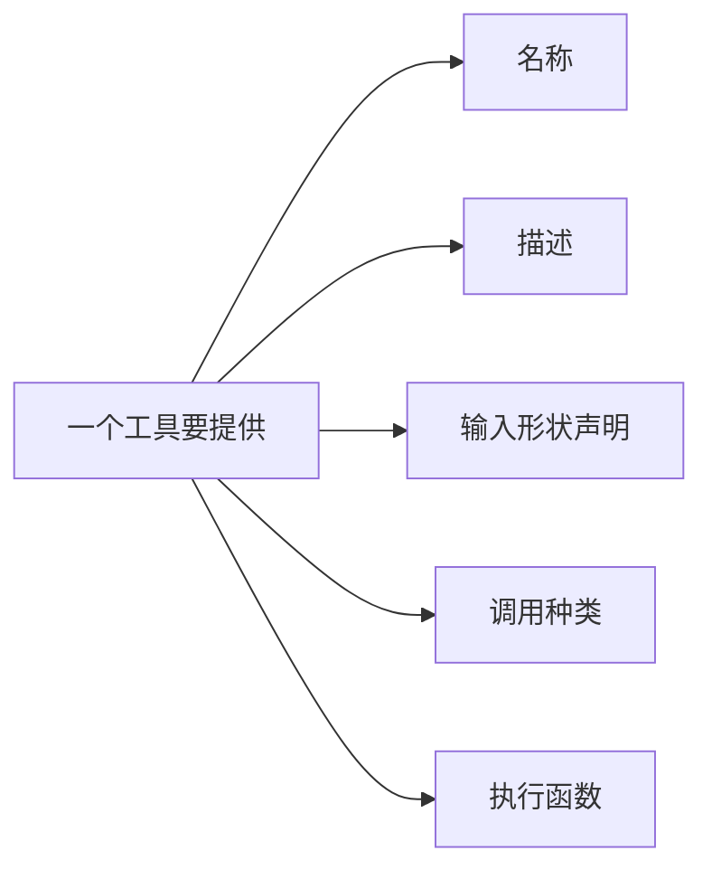

```mermaid
flowchart TB
    R["剩下的由运行时负责"] --> R1["按作用域算出哪些工具可见"]
    R1 --> R2["校验模型给的参数"]
    R2 --> R3["执行前策略、审批、守卫"]
    R3 --> R4["调度执行"]
    R4 --> R5["规范化错误和结果"]
    R5 --> R6["执行后策略、外置、附加上下文"]
```

### 超时只能发信号

```mermaid
flowchart LR
    A["工具实现必须接住并往下传取消"] --> B["超时策略发出的是一个取消信号"]
    B --> C["它停不掉一段忽略取消的代码"]
    C -.->|"那段代码会一直跑下去"| C
```

---

## Skill 与人格

```mermaid
flowchart TD
    A["人格"] --> A1["系统提示词里的<br/>部署方身份与行为约束"]
    B["Skill 注册表"] --> B1["保存可发现、可读取的技能"]
    C["Skill 工具"] --> C1["模型按需把正文读进来"]
    C1 --> C2["而不是把全部技能正文<br/>塞进每一次请求"]
    D["Agent 预设"] --> D1["把人格、技能、工具和别的贡献<br/>组合成一份可选的配置"]
```

```mermaid
flowchart LR
    A["这些都可以按作用域安装"] --> B["避免一个租户或一个 Agent 的配置<br/>漏到另一个那里去"]
```

---

## 会话与恢复

```mermaid
flowchart LR
    A["建一个新 Agent 时"] --> B["Agent 标识与会话标识必须一致"]
```

```mermaid
flowchart TB
    S1["① 读出并校验已经落下来的事件"] --> S2["② 建活会话"]
    S2 --> S3["③ 建收件箱"]
    S3 --> S4["④ 建 Agent 循环"]
```

### 事件日志是权威事实，状态缓存只是加速

```mermaid
flowchart TD
    A["状态缓存不可用"] --> B["必须能退回到重放事件"]
    B --> C{"但重放的是什么"}
    C --> D["现存的那一段日志<br/>不是全部历史"]
```

```mermaid
flowchart LR
    A["一个会话的事件超过上限"] --> B["最老的一段会被删掉"]
    B --> C["所以宿主要接受两件事"]
    C --> C1["恢复出来的状态可能残缺<br/>（最后一次更新落在被删区间里的那些）"]
    C --> C2["残缺不阻断读"]
```

```mermaid
flowchart TD
    A["把残缺当成一次失败"] --> B["去重试，或者拒绝这个会话"]
    B -.->|"那才是真的把会话弄坏了"| B
```

### 序号不再从 0 起

```mermaid
flowchart LR
    A["日志里事件的序号"] --> B["因为删过头部，不从 0 起"]
    B --> C["宿主拿序号定位时<br/>要用仓库提供的换算"]
    C -.->|"不要当成数组下标"| C
```

### 持久化这一路当前提供什么

```mermaid
flowchart TD
    A["仓库提供"] --> A1["会话日志的存储与后端接口"]
    A --> A2["写后队列"]
    A --> A3["恢复原语"]
    A --> A4["协调器"]
    B["宿主要做"] --> B1["给协调器注入具体后端与活会话存储"]
    B --> B2["调安装，接上创建、事件、落盘、释放这四条边"]
    B --> B3["把准备期的发布／释放<br/>和后端的列举适配到消费方接口"]
```

```mermaid
flowchart LR
    A["宿主不要直接改"] --> A1["会话事件切片"]
    A --> A2["收件箱内部的切片"]
    A --> A3["状态缓存记录"]
```

---

## 多租户

运行时不会替宿主做租户鉴权。

```mermaid
flowchart TD
    A["宿主必须做的"] --> A1["外部标识转成会话标识之前<br/>先校验访问权"]
    A --> A2["为租户挑对模型、凭据、工具<br/>Skill、存储和作用域"]
    A --> A3["限制会话检索、子 Agent<br/>后台作业、附件的访问范围"]
```

```mermaid
flowchart TD
    N["两个常见的误用"] --> N1["把「发起方」当成一份授权"]
    N1 --> N2["它只记录调用链从哪来<br/>不代表准不准"]
    N --> N3["从模型给的字符串<br/>直接解析出内部资源句柄"]
    N3 --> N4["那等于让模型自己指定<br/>要访问哪个对象"]
```

---

## 请求入口

```mermaid
sequenceDiagram
    participant U as 请求
    participant H as 宿主入口
    participant R as Agent 名册
    participant A as Agent
    U->>H: 进来
    H->>H: 认证用户
    H->>H: 解析租户和会话
    H->>R: 取，或者建 / 恢复
    R-->>H: 一个 Agent
    H->>H: 构造带超时和取消原因的上下文
    H->>A: 追问 / 打断 / 注入
    A-->>H: 状态、事件或最终响应
    H-->>U: 转成宿主自己的协议
```

```mermaid
flowchart LR
    A["SDK 服务端和 ACP 桥<br/>可以提供现成的协议语义"] --> B["但网络监听、连接管理、认证方式<br/>仍由宿主决定"]
```

---

## 关闭顺序

关闭要先停新请求，再从外向内释放：

```mermaid
flowchart TB
    S1["协议入口"] --> S2["后台作业、定时器、子 Agent"]
    S2 --> S3["Agent 句柄"]
    S3 --> S4["Agent 循环"]
    S4 --> S5["状态缓存与会话持久化"]
    S5 --> S6["领域存储"]
    S6 --> S7["存储后端"]
    S7 --> S8["根作用域"]
```

```mermaid
flowchart TD
    A["关闭过程中要等的三样"] --> A1["正在跑的回合"]
    A --> A2["写后队列"]
    A --> A3["持久化屏障"]
```

```mermaid
flowchart LR
    A["从名册里注销一项"] --> B["不等于关掉它背后的资源"]
    B -.->|"注销只是「别人查不到它了」"| B
```

---

## 失败处理

```mermaid
flowchart TD
    A["模型失败"] --> A1["走结构化的失败值和重试策略"]
    B["工具失败"] --> B1["转成模型看得见的工具结果"]
    B1 --> B2["不让第三方工具的崩溃<br/>把整个服务带走"]
    C["观察者失败"] --> C1["语义各不相同：<br/>有的只记一笔<br/>有的可以否决<br/>有的会中止当前边界"]
    D["状态缓存写失败"] --> D1["只影响性能<br/>不该破坏已经提交的事件"]
    E["持久化事件失败"] --> E1["不能报告成成功"]
    F["外置失败"] --> F1["默认保留原结果<br/>不能把一次成功的工具调用改成失败"]
```

---

## 当前限制

```mermaid
flowchart TD
    L1["模块路径不是一个能直接取到的地址"] --> L1a["外部宿主要在自己的模块文件里<br/>写一条指向本仓库检出的替换<br/>或者把本仓库当成工作区成员"]
    L1a -.->|"这是有意的：<br/>模块名不跟着某个托管地址走"| L1a
```

```mermaid
flowchart TD
    L2["harness.New 只装得出<br/>第 ⑩ 步为止那段不碰外部介质的闭环"] --> L2a["存储后端、持久化、协议入口<br/>仍要宿主显式连"]
    L2a --> L2b["没有一个把这些也一并包办的顶层构建器"]
```

```mermaid
flowchart TD
    L3["其余几条"] --> L3a["协调器只负责编排，不决定介质<br/>成品后端在 adapter/datastore/sessionstore<br/>宿主递一个连接池即可"]
    L3 --> L3b["没有任意代码执行、Shell<br/>本地终端或本地文件工具"]
    L3 --> L3c["Postgres 那一批集成测试<br/>要一个真的数据库连接"]
    L3 --> L3d["portcheck 仍可能报出<br/>尚未做最终裁决的 DSH 能力"]
```
