# ACP 接入

对应包：`protocol/acp`

## 定位

除了人坐在界面前面敲字，还有一类调用方：**另一个程序**。它想把这套 agent 当成一个可编程的服务用——建一段会话、扔一条提示词进去、等它跑完、把结果收走。

ACP（Agent Client Protocol）就是这类调用方说话的那套规矩。这个包实现它的**agent 端**，也就是被调用的那一半。

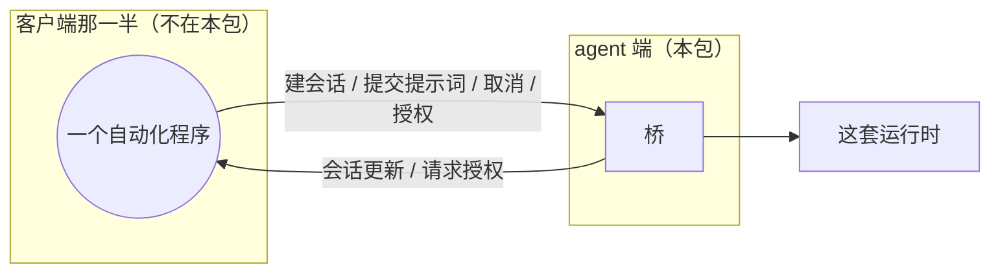

一句话概括这个包的性格：**它只搬已经落定的那一半**。

---

## 架构

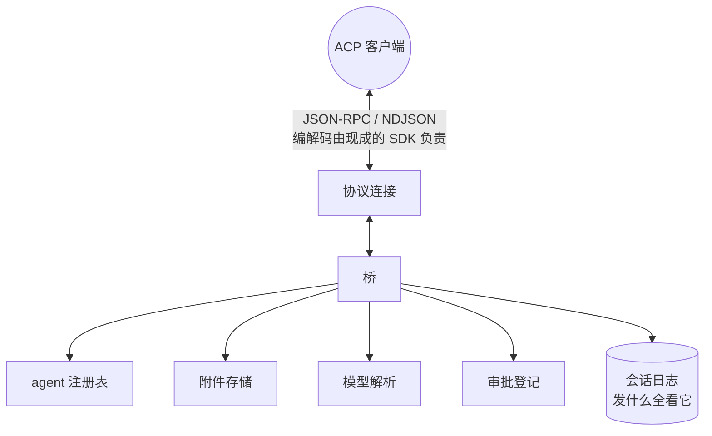

### 线上格式一行都不写

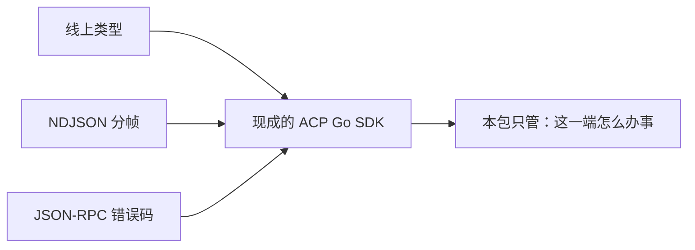

那个 SDK 是由官方 schema 生成的，零间接依赖，协议版本对得上 DSH 那条线。

### 造和装分两步，因为这里有个环

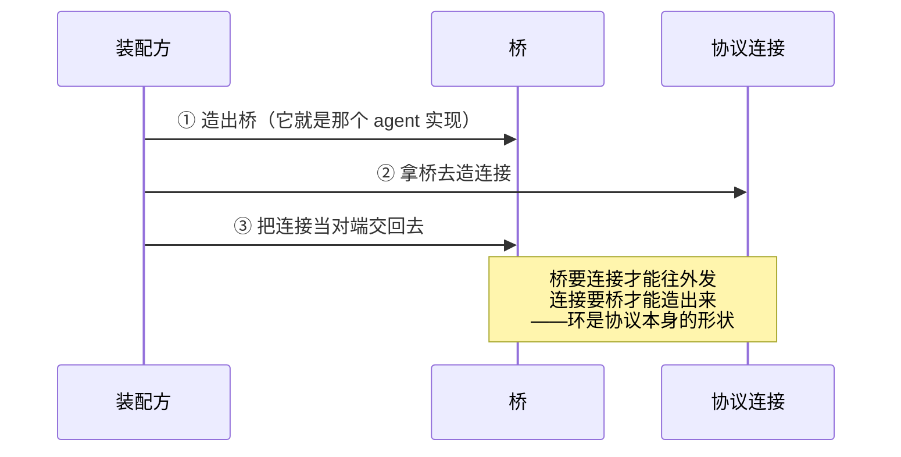

---

## 只搬已提交的东西

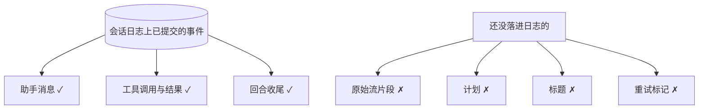

**这不是「少发一点」，是「发出去的每一条都已经是事实」**：

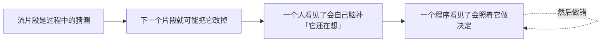

---

## 能力跟着协作者走，不是跟着开关走

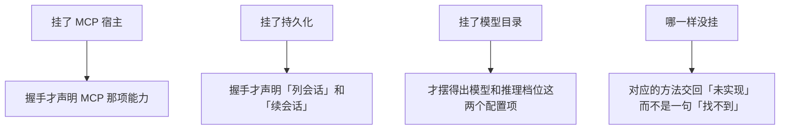

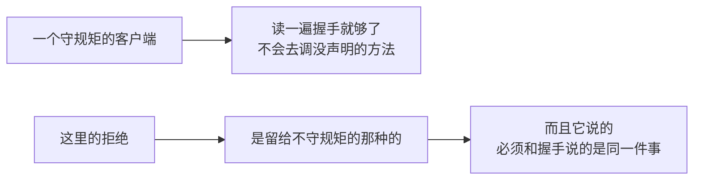

---

## 一次提示词的来回

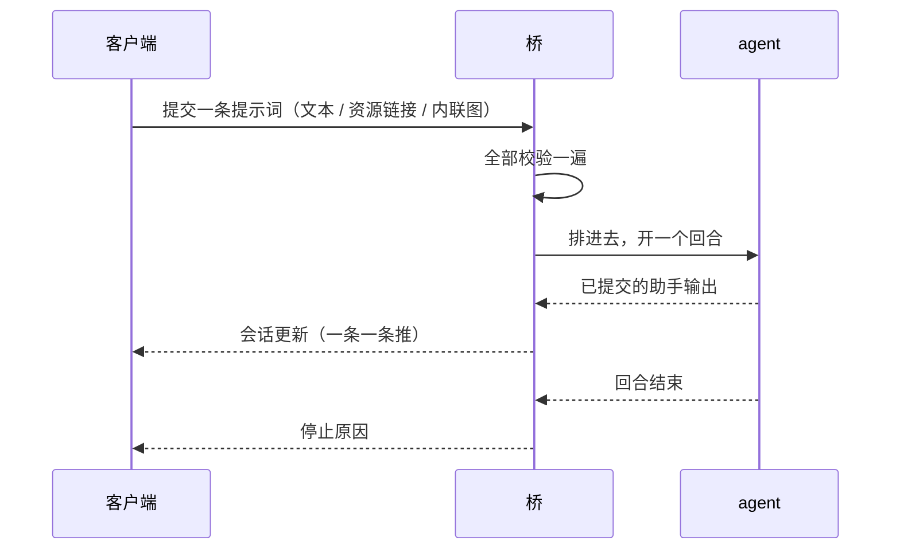

### 图片先全验完再落盘

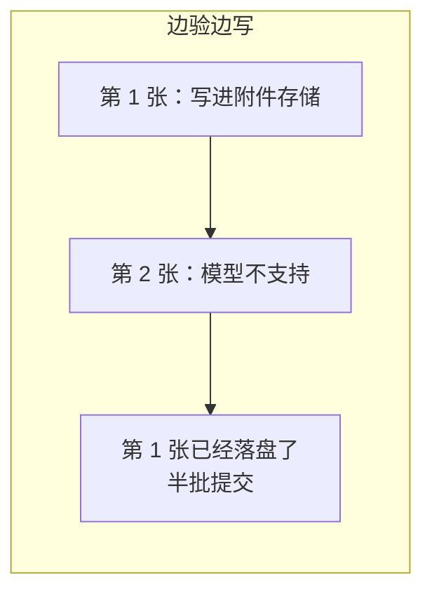

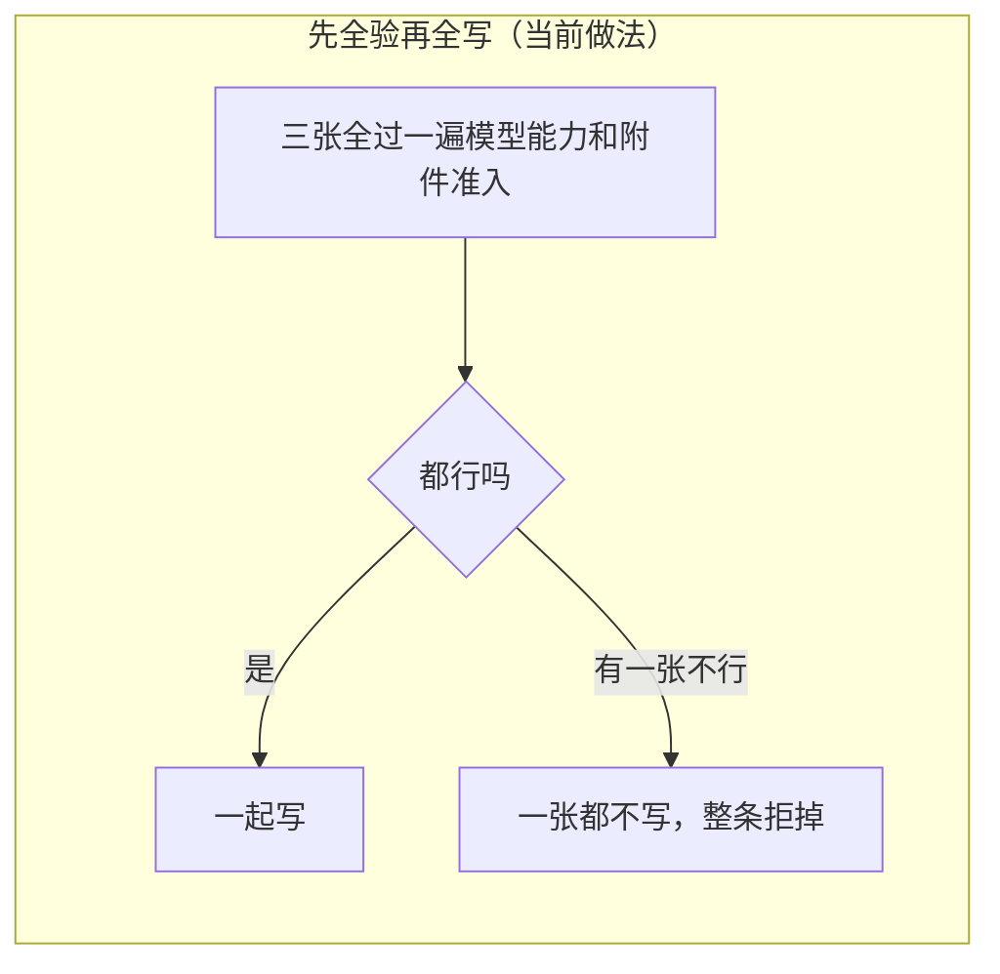

### 资源链接只传引用

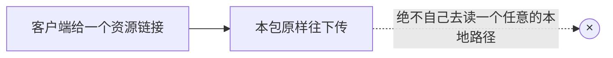

---

## 授权：这条线上只有一次性的两档

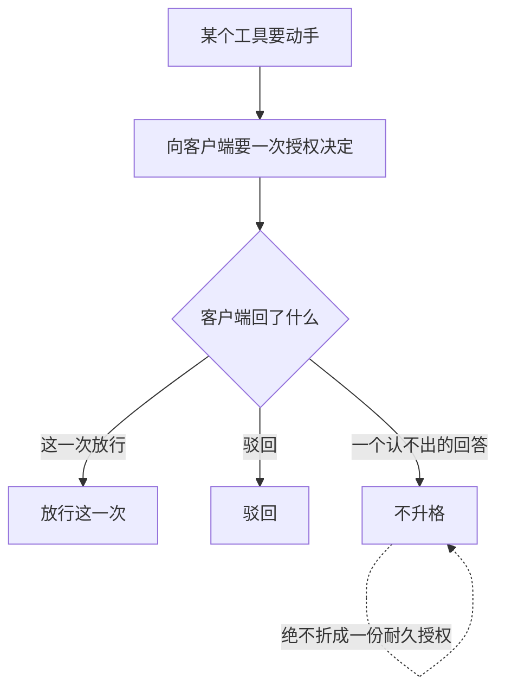

耐久的那一种在权限那一层，不在这条线上。

---

## 生命周期与并发

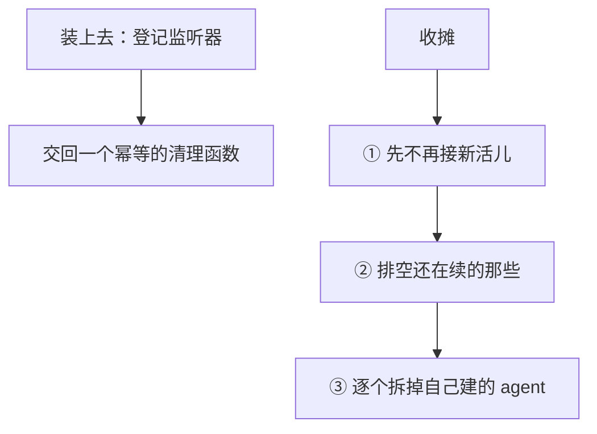

### 它拥有什么

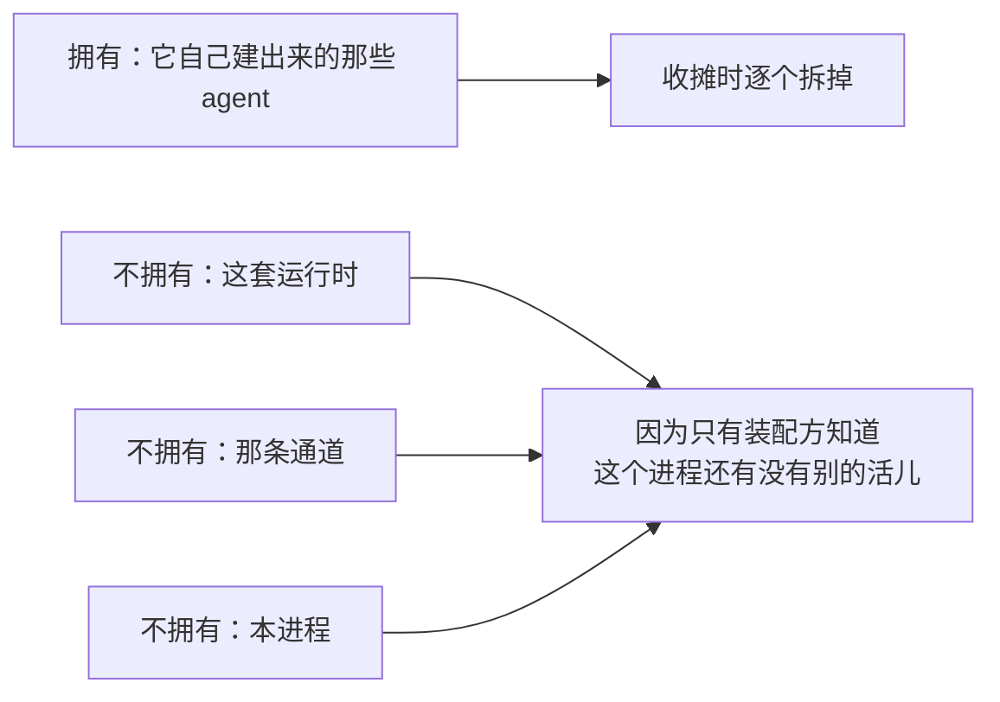

DSH 那边直接读进程的标准输入输出来造流；这里那两样是装配方交进来的入参。

### 并发

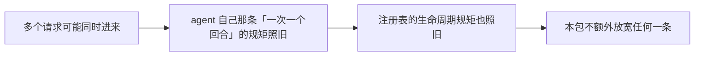

---

## 失败语义

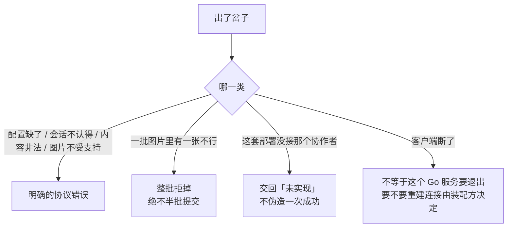

---

## 能力边界

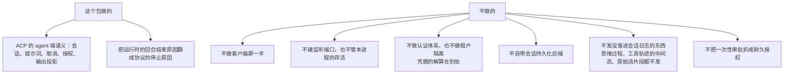

## 对应的 DSH 能力

下表由 [`docs/packages.md`](../packages.md) 与 [能力覆盖表](../portmap/capability-coverage.tsv) 机器 join 得到：本篇覆盖的 Go 包，承接的是上游 DSH 的哪几条能力，以及各自还缺什么。落点列由源码里的 `// 源:` 注释反查，不是手写的。

| 上游能力 | DSH 包 | 裁决 | 落在哪个 Go 包 | 这里缺什么 |
|---|---|---|---|---|
| Agent Client Protocol仅自动化JSON-RPC服务器，通过stdio驱动harness agent | `acp/acp` | 需要 | `protocol/acp` | — |
| 纯自动化 ACP stdio 应用 profile 组合包，在 base 之上设 coding persona 与默认模型路由，命令提供方接受调用后才启动 ACP bridge | `bundle/acp-app` | 取形重写 | `protocol/acp` | 走 HTTP 不走 stdio，进程外壳那半不要。ACP 场景关掉 session-title-llm 这条取舍已记在裁决里 |

## 相关源码

- `protocol/acp/config.go`
- `protocol/acp/bridge.go` —— 桥本身：攥着哪些会话、怎么装上去、握手与收摊
- `protocol/acp/bridgesession.go` —— 会话台账：开、恢复、列出、关掉、配置项
- `protocol/acp/bridgeprompt.go` —— 一次提示词从准入到结算的状态机
- `protocol/acp/bridgeevents.go` —— 运行时那几条边翻成线上的话
- `protocol/acp/content.go`
- `protocol/acp/codec.go`
- `protocol/acp/invariant.go`
