# Agent 控制面

对应包：`core/agent`

## 一句话

它管的是「现在有哪些 agent 活着、一个 agent 怎么生怎么死、活儿怎么排进去、外部功能从哪些位置插手」。

它自己不跑一个 agent。

---

## 为什么需要它

一个 agent 真正跑起来是一件很重的事：拼提示词、发模型请求、解析工具调用、写会话日志、处理取消和重试。这些全在 `core/agentloop` 里。

但要用 agent 的地方有十几处，它们关心的只有很少几件事：

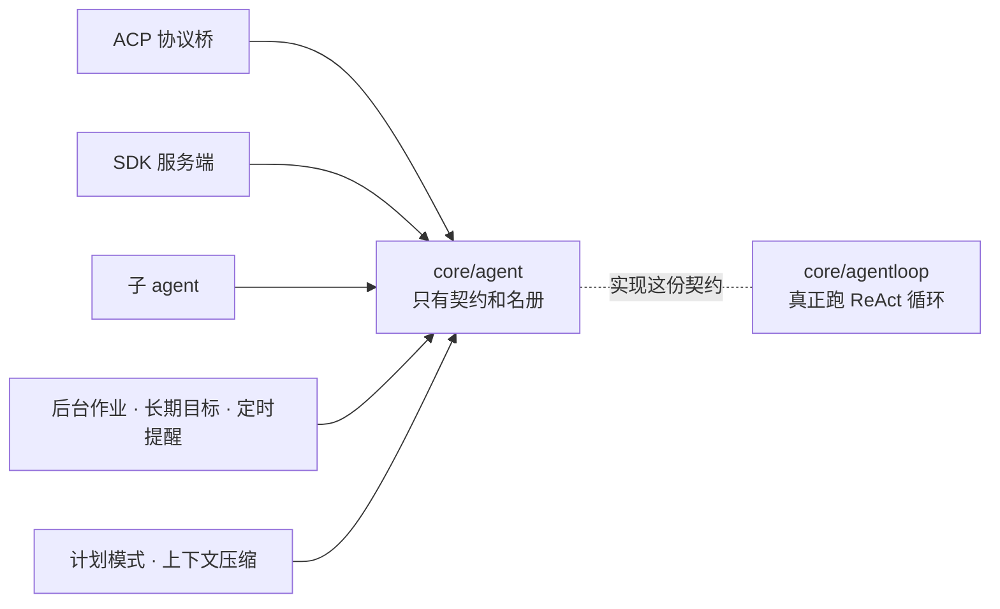

如果这十几处直接依赖循环那一层，循环内部改一次结构，十几处一起返工。所以把「一个 agent 对外长什么样」单独摘出来放在这里。

这个包回答四个问题：

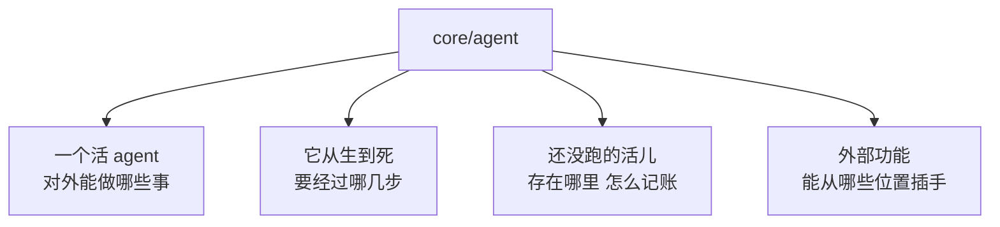

---

## 一、一个活 agent 对外的样子

16 件事，分四组：

| 组 | 能做什么 |
|---|---|
| 身份 | 它的身份、它驱动的那个会话、它的默认模型配置、它那把作用域钥匙 |
| 状态 | 现在是闲着还是在跑；等到它彻底静下来；在真正的空闲期插一件维护活儿 |
| 送活儿进去 | 送一条普通后续、送一条引导、送一份上下文、送到指定队列并决定要不要唤醒 |
| 改还没跑的活儿 | 放回队头、按身份拿掉一条、按身份原地换掉一条 |
| 停 | 中止正在跑的那段活动 |

**状态只有「闲着」和「在跑」两个值，没有第三个「已拆除」。** 拆除的表达方式是从名册里消失。

三条送活儿的路子区别在**落在哪条边界上、唤不唤醒**：

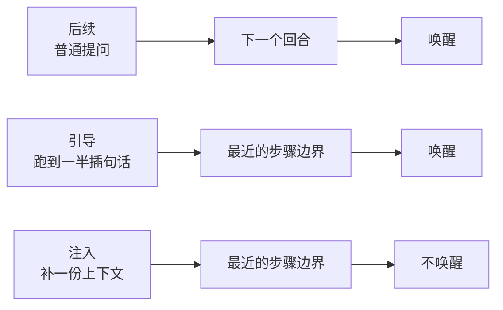

「不唤醒」的意思是：正在跑的循环会在下一个步骤边界顺手带上它；闲着的时候它就一直躺着，等下一次有别的活儿把循环叫醒。

---

## 二、一个 agent 怎么生

不是「注册」一步，是三步：

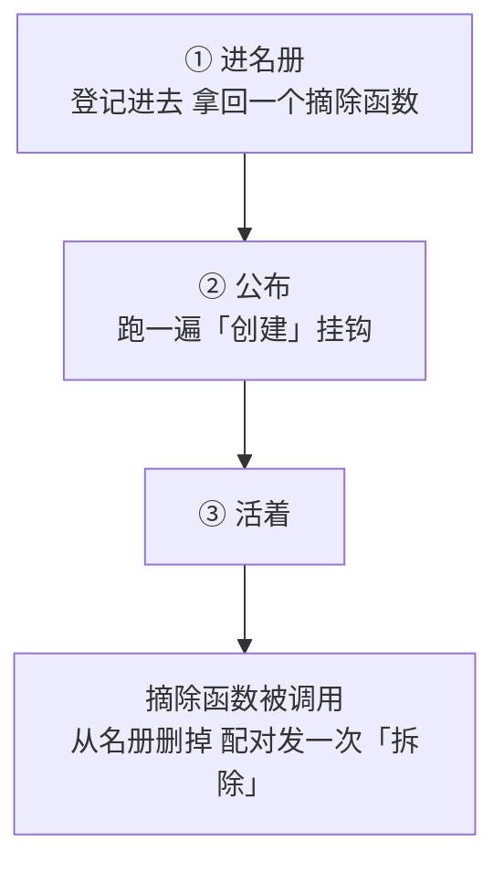

**为什么第①步和第②步要分开：为了公布失败时能干净地撤回。**

调用方先拿到摘除函数并挂上，再去公布。公布跑到一半被否决，撤回路径是现成的。合成一步的话，撤回逻辑就得藏在这个包里，而真正需要把撤回编进一条更长回滚链的是调用方。

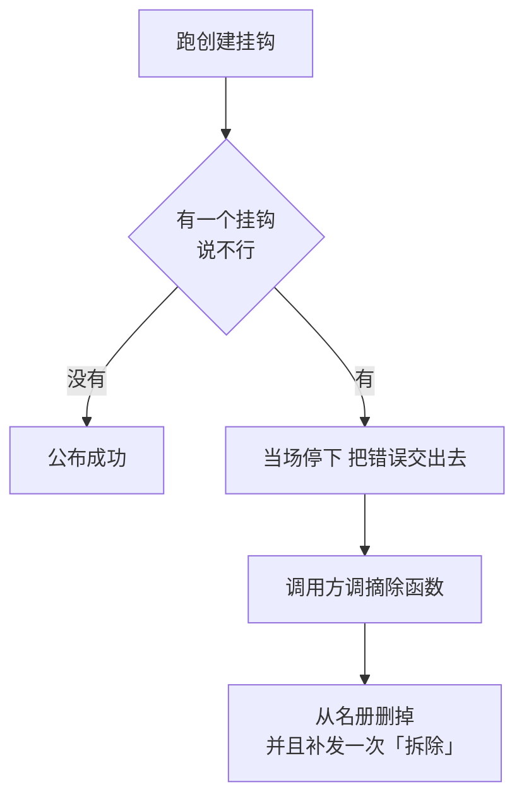

**最后那一步「补发拆除」是关键。** 被否决之前已经跑过的那几个挂钩，是见过这个 agent 的。不补这条配对的边，它们手上会留下一个永远等不到结束的记录。

为此，「已公布」这个标记在挂钩开始跑**之前**就置真了，不是跑完才置真。标记后置的话，被否决时就找不到依据去补发。

公布进行当中来的摘除请求不立刻执行，先记下来，等公布跑完再兑现——不让名册在挂钩的调用栈里被改掉。

---

## 三、名册里存的两份东西

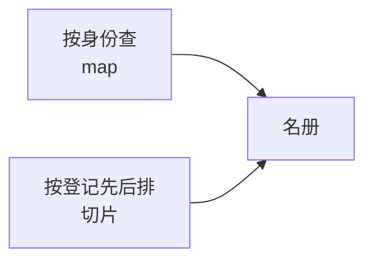

多存一份顺序，是因为**登记先后本身是语义**：列出全部 agent、列出根 agent，交出来的次序必须每次一样。map 没有顺序。

还有一条容易混的关系：

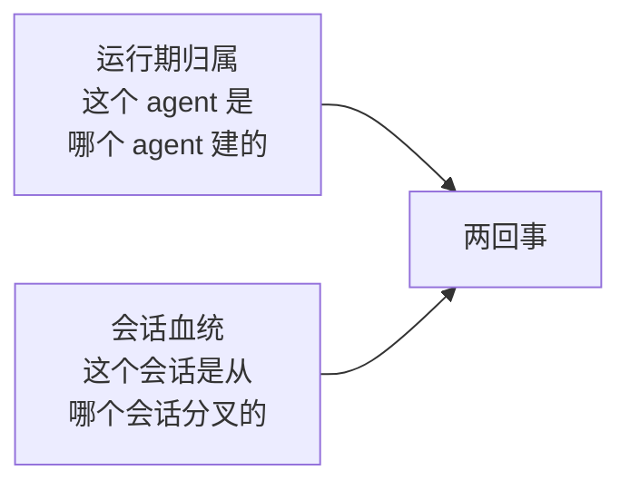

一个从分叉会话恢复出来的 agent，在当前进程里完全可以是一个没有归属方的根 agent。

---

## 四、还没跑的活儿存在哪里

两条队列：

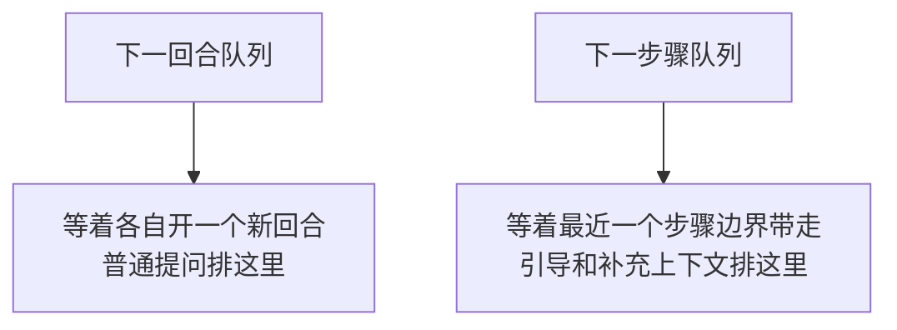

认领规则不对称：

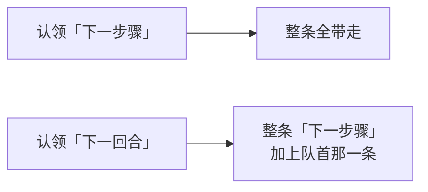

理由是一个回合只应该有一条普通提问打头，而引导和补充上下文本来就是附着在这次提问上的。

**清空的顺序是先清「下一步骤」再清「下一回合」。** 引导依附于它要插入的那次提问，反过来清会出现一个中间态：提问没了，附着在它上面的引导还在。每一步都写日志，这个中间态是能被观察到的。

---

## 五、这两条队列是算出来的，不是存着的

耐久事实是会话日志里的一条条改动记录，两条队列是照着这些记录重放出来的当前样子。

于是每次改动的顺序被写死了：

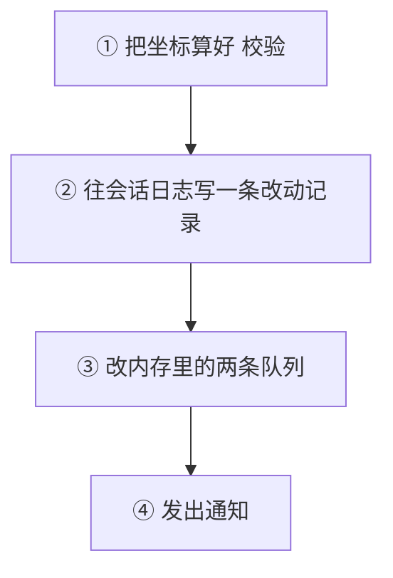

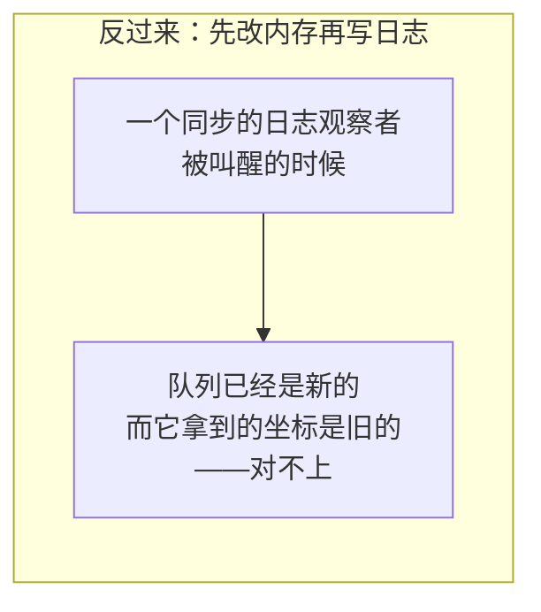

日志里存的坐标是**规整过**的：负数、越界都先收敛成一个确定值再写。这样重放的时候照着做就行，不需要再解释一遍边界规则。

校验有两条，都在写日志之前：坐标在不在范围内、同一条消息的身份是不是在两条队列里同时出现。

---

## 六、被取消的活和被干完的活要分得开

日志里那条改动记录带一个标记：这次删除是「干完了」还是「取消掉了」。

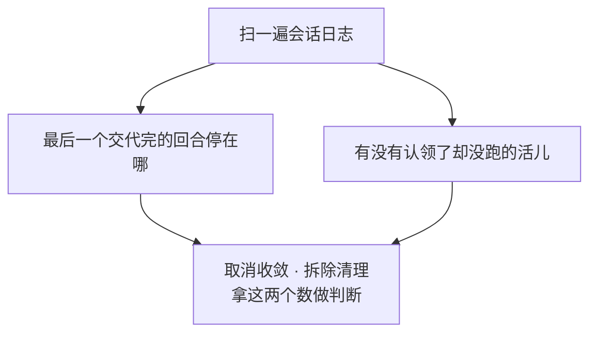

没有这个标记，「认领走了然后被取消」和「认领走了然后跑完了」在日志里长得一模一样，拆除的时候就说不清还有没有活儿没交代。

这次盘账**对格式坏掉的记录是跳过，不是报错**。调用它的两处是取消收敛和拆除清理，那两处没有「拒绝这份日志」这个选项——报错只会让拆除卡住。

---

## 七、外部功能能从哪些位置插手

12 个位置，分三类跑法：

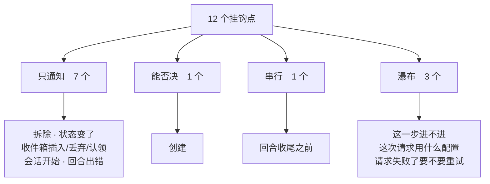

### 只通知的七个

事情已经发生了，通知只是让外部知道。

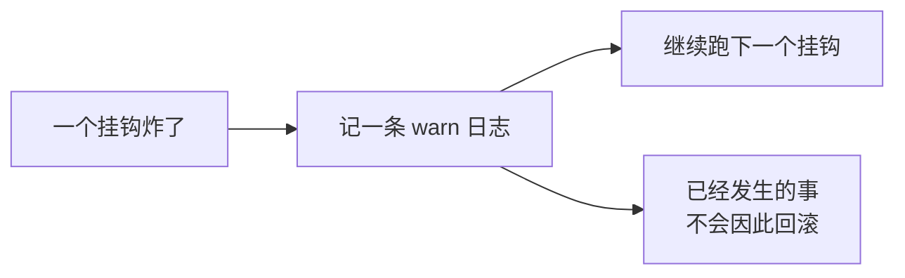

### 唯一能否决的：创建

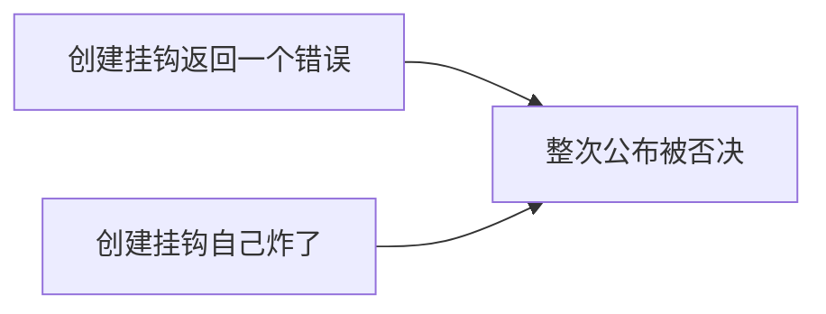

炸了也算否决，不是记日志兜掉。理由是这个挂钩的返回值**就是**否决权本身——炸掉的那一下，分不出是「反对」还是「这儿坏了」，按反对处理最坏是多拆一次。

### 串行的那一个：回合收尾之前

按登记顺序一个个跑，第一个失败当场停下。这条边界在提交之前，一个失败说明收尾这件事本身出了问题。

### 瀑布的三个

瀑布的意思是每一层都能改结果，也能直接短路不往下走：


「先登记的在外层」和 `core/tools`、`core/systemprompt` 是同一条规矩。

三条瀑布各自决定一件事：

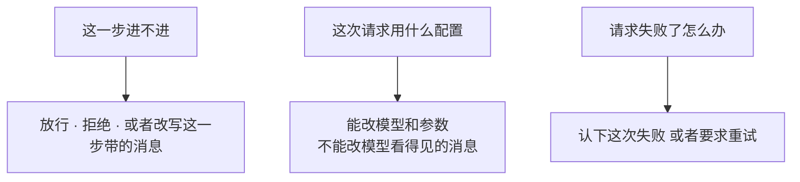

「这一步进不进」的默认值来自最里面那一层，不来自空值——空值本身是「拒绝」，靠它兜底会让所有步骤都被拒。

---

## 八、挂钩的可见范围

挂钩不是全局平铺的，登记时要指定挂在哪一层：


派发顺序就是这个顺序：全局在前，远祖次之，agent 自己最后。

用显式的层替代隐式的全局插件状态，是为了让部署级能力、父 agent 的能力、单个 agent 的能力同时存在而互不串味。一个 agent 被拆除时，挂在它自己那层上的挂钩跟着散掉。

层本身的规则见[作用域](core-scope.md)。

---

## 九、这条调用是哪个 agent 发起的

跨过好几层函数调用之后，仍然要能问出「这一串动作最初是哪个 agent 发起的」。

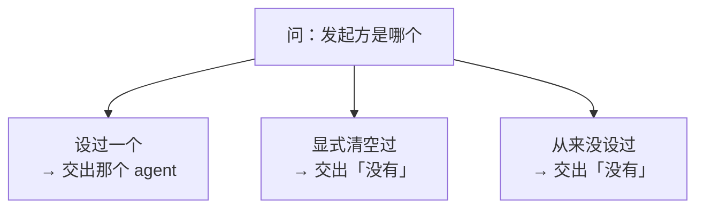

第二种和第三种在结果上一样，但在实现里必须可分辨，否则「明确切断继承」这个动作就无从表达。

**这条线索只说明因果归属，不是存活证明，也不是权限。** 外部请求仍然要先做身份校验，把校验过的 agent 放进来，才能往下走。

---

## 十、换模型不能换到一半

用户在一个步骤跑到一半的时候切了模型。如果提示词已经拼好了写着模型 A，请求却按模型 B 发出去，模型会读到一份说自己是 A 的交底材料。

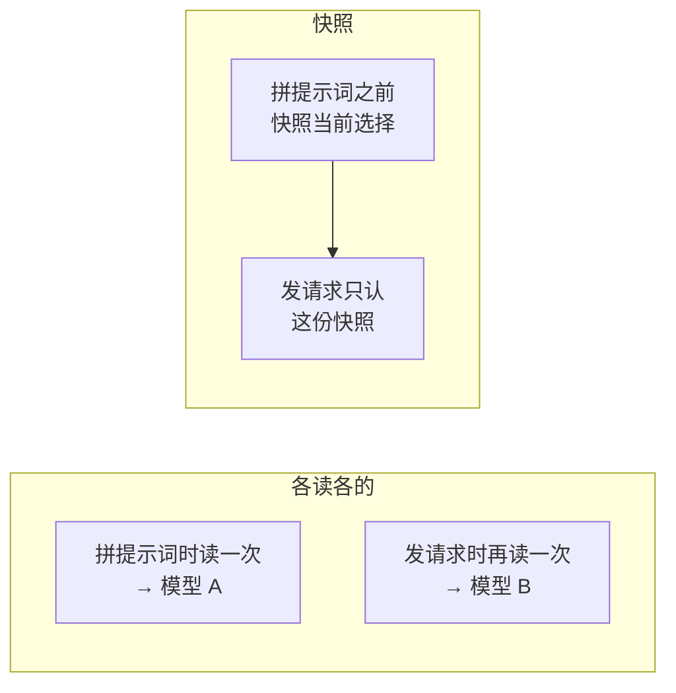

所以这里存两份：用户当前选的那份，和这次装配开始时快照下来的那份。装配规则**在往下走之前**就把快照取了，请求那条瀑布只认快照。一次切换要么整体落在这一步，要么整体落在下一步。

这两处接线是一起装的：第二处装失败会把第一处回滚掉，不留半套。

---

## 十一、并发

```mermaid
flowchart LR
    A["名册有一把锁"] --> B["锁内：取出这次要跑的挂钩名单"]
    B --> C["解锁"]
    C --> D["锁外：一个个跑"]
```

**挂钩永远在锁外跑。** 这样一个挂钩可以在回调里反过来查这个名册，不会自己把自己锁死。和 `core/session` 那边是同一条规矩。

**收件箱自己不加锁。** 它是单写者，改动过程中夹着会话追加和三条通知，加锁会把重入直接变成死锁。所以收件箱那一族改动方法只当只读投影用，任何一次改动都得走 agent 自己那把锁——这也是「放回队头」「按身份拿掉」「按身份换掉」这三条要出现在 agent 契约上的原因。

---

## 十二、一次后续从进来到进模型历史

```mermaid
sequenceDiagram
    autonumber
    participant H as 协议层
    participant A as Agent
    participant I as 收件箱
    participant S as 会话日志
    participant R as 名册
    participant L as Agent Loop

    H->>A: 送一条后续
    A->>S: 先写一条收件箱改动记录
    A->>I: 再改内存里的队列
    A->>R: 报「收件箱插入了一条」
    R->>R: 锁内取名单 锁外逐个通知
    A->>L: 唤醒
    L->>I: 认领这一批
    I->>S: 写一条认领记录
    L->>R: 跑「这一步进不进」那条瀑布
    R-->>L: 放行 并带上这一步的消息
    L->>S: 写正式的用户消息事件
    L->>L: 拼上下文 发模型请求
```

两处值得单看：

- **收件箱改动记录和正式的用户消息事件是两回事。** 前者只说「排队的活儿变了」，后者才是模型真正读到的那条消息。一条消息可以只经历前者就被取消掉，从来没进过模型历史。
- **通知是在名册的锁外发的**（第 5 步），所以一个通知挂钩可以在回调里查名册。

---

## 出错的时候

11 个错误值，是按「拿它怎么办」分的，不是按「从哪冒出来的」分的：

```mermaid
flowchart LR
    E1["装配期就配错了<br/>工厂没设 · 工厂设了两次"] --> P1["写装配代码的人"]
    E2["调用方用错了<br/>身份对不上 · 重名 · 公布两次<br/>缺发起方 · 登记参数不合法"] --> P2["调用方"]
    E3["状态不对<br/>这个 agent 不在名册里<br/>状态没变化"] --> P3["调用方 通常可忽略"]
    E4["数据坏了<br/>事件体解不开 · 坐标越界"] --> P4["日志本身有问题"]
```

---

## 这个包不做什么

- **不造 agent。** 创建和恢复由外部装上来的工厂做。
- **不跑回合、步骤和工具循环。** 那是 `core/agentloop`。
- **不发模型请求，不定义工具，不拼提示词。**
- **不持久化。** 只往活会话追加事件；事件怎么落盘是 `session/persistence` 的事。
- **不做模型路由，不管凭据。**
- **不碰传输协议。**
- **不提供一行接入的顶层装配器。** 各组件仍要显式装。

---

## 相关源码

| 路径 | 内容 | 行数 |
|---|---|---|
| `core/agent/registry.go` | 名册、生命周期、12 个挂钩点的登记与派发 | 1079 |
| `core/agent/inbox.go` | 两条队列的当前状态、认领与改动 | 371 |
| `core/agent/observer.go` | 12 个挂钩点的签名与语义 | 237 |
| `core/agent/runtime.go` | 活 agent 契约、状态、步骤与请求决策 | 236 |
| `core/agent/modelselection.go` | 模型切换的快照与两处接线 | 215 |
| `core/agent/types.go` | 收件箱改动记录的事件类型与编解码 | 150 |
| `core/agent/consumedwork.go` | 从日志盘出已消费和被取消的活儿 | 137 |
| `core/agent/doc.go` | 包说明与移植决定 | 99 |
| `core/agent/initiator.go` | 调用链发起方 | 98 |
| `core/agent/error.go` | 11 个错误值 | 83 |

---

## 深入阅读

[作用域](core-scope.md) · [Agent Loop](agentloop.md) · [活会话](core-session.md) · [系统提示词装配](systemprompt.md) · [运行时设置](settings.md) · [多 Agent](subagent.md)
