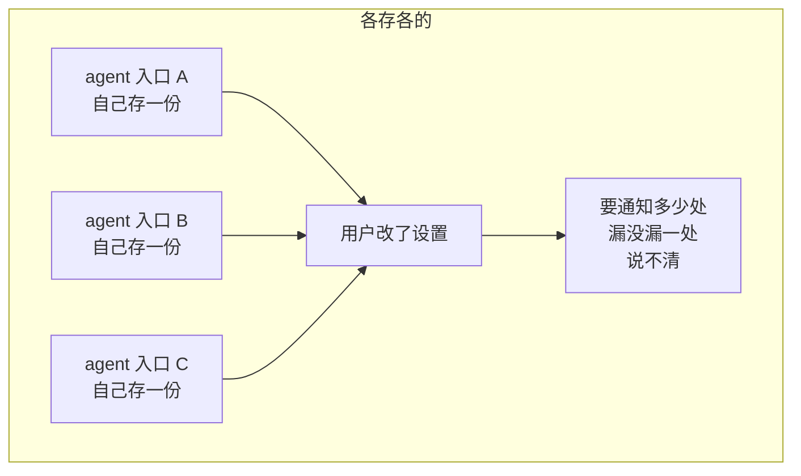
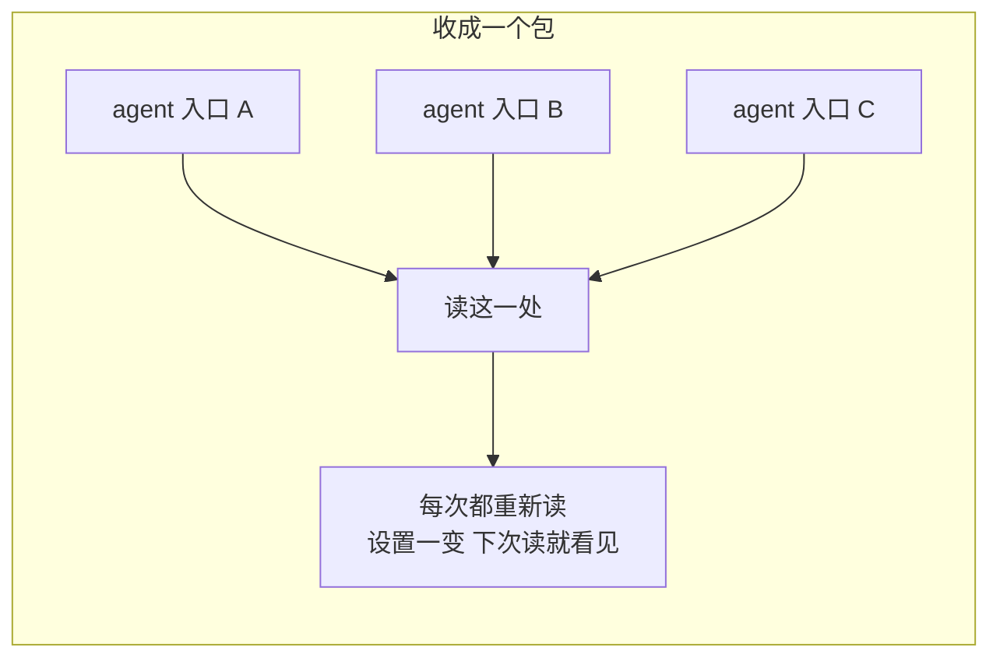
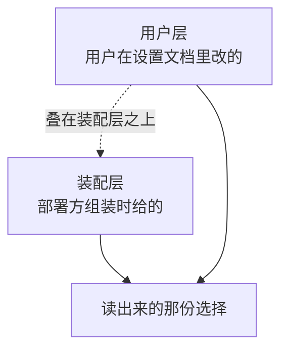
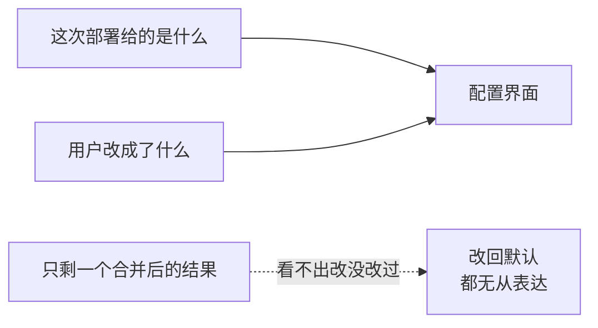
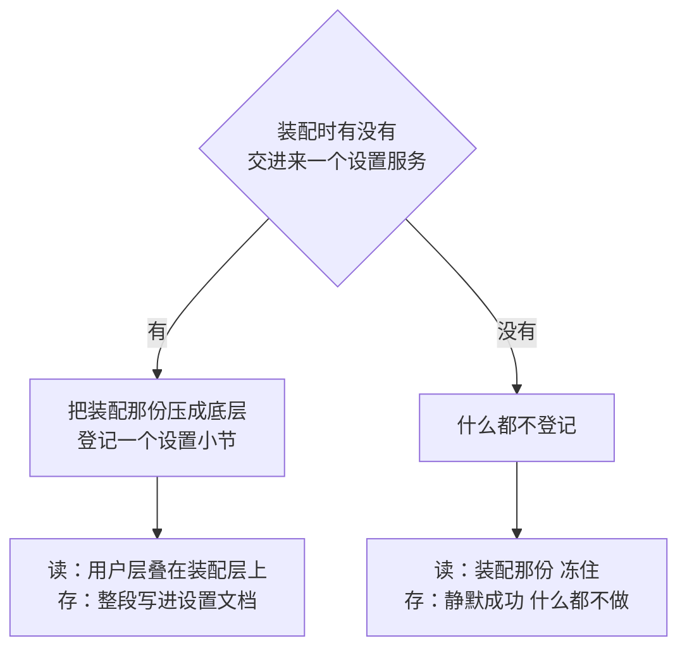
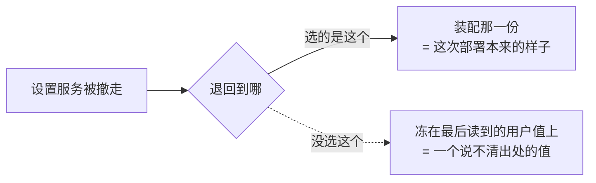
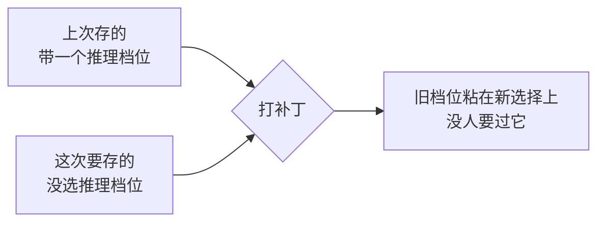
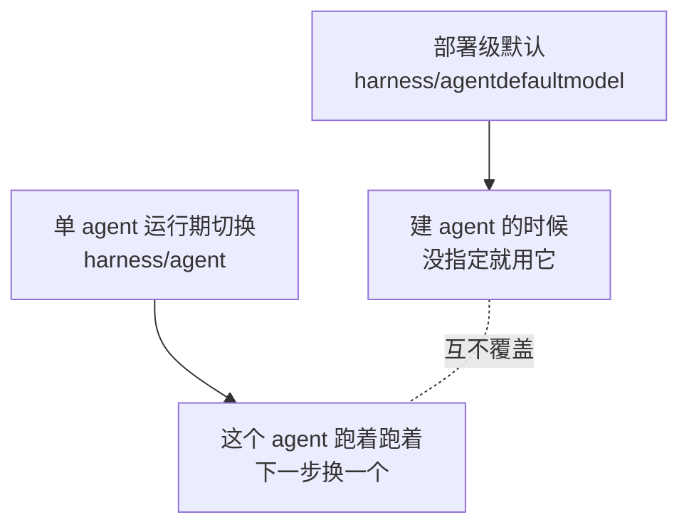
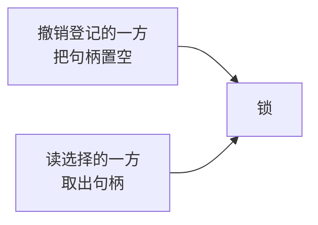

# 部署级默认模型

对应包：`harness/agentdefaultmodel`

## 定位

它拥有一份答案：**一个建的时候没指定模型的 agent，该用哪个模型。**

它不认识任何宿主、任何传输层，也不持有任何 agent。要用这份答案的地方自己来读。

---

## 为什么它是一个包，而不是一个字段

「默认模型」看着像装配时传一个字符串就完了。但它有一条装配传不了的性质：**用户能改，而且改完下一次读就得看见。**

关键在**每次都重新读、不缓存**。没有任何登记级的东西需要跟着变更重建，所以也就没有「通知漏了一处」这种故障。

---

## 架构：两层来源，不是一个可变值

两层刻意不压平成一个值。理由是配置界面要能分别显示这两件事：

装配那一份是压在最底下的一层，不是一个可以被写掉的初始值——所以用户那一层撤掉之后，底下那份还在。

---

## 挂没挂设置服务，是两条路

---

## 三个决定

### 一、撤销登记时退回装配那一份

### 二、存的时候整段替换，不打补丁

交进来的是一份已经解析完的完整选择。打补丁的话会出这种事：

### 三、推理档位用空串表示「没选」

跟模型调用配置和 agent 那边的模型选择保持一致，三处不必来回翻译零值和 nil。

---

## 和「单个 agent 换模型」不是一回事

这两件事最容易混：

一个 agent 自带的显式选择永远优先。这个包只在「没有显式选择」那个位置说话。

后一件事已经接上了，用的地方是 ACP 接入；它要解决的是「换模型不能换到一半」，细节见 [Agent 控制面](agent.md)。

---

## 生命周期与并发

造出来的时候交出两样：这个服务，和一个撤销函数。撤销函数把服务退回装配那一份，再摘掉设置登记；重复调用是空操作。

只有一把读写锁，只护一个字段——那个设置小节的句柄：

装配那一份造出来就不变，不需要护。

读这份选择不带取消口，也不做 I/O：设置服务已经把当前文档保持在内存里，读是一次内存取值。

---

## 失败语义

**缺提供方或者缺模型，当场拒绝。**

这道检查同时装在设置登记的校验位上，所以**用户改出来的值和装配传进来的值走的是同一道检查**，不存在「装配严、用户松」。

其余三条：

| 情形 | 结果 |
|---|---|
| 装配那份就不合法 | 造不出这个服务，当场报错 |
| 登记设置小节失败 | 造不出这个服务，错误里带上原因 |
| 没挂设置服务却要存 | **静默成功**，保留装配那份 |

最后一条是有意的：这次部署本来就没有可写的存储，「存不下来」不是故障。报错只会逼调用方去区分一件它管不着的事。

写进设置文档那一步失败时，由设置那一层决定后果——这个包不做补偿，也不缓存一份「本来想存的值」。

---

## 能力边界

- **不管它被读。** 哪个 agent 入口在什么时候读、读到之后怎么用，是那些入口自己的事。
- **不做模型路由。** 只交出提供方键和模型标识，找不找得到那个提供方是模型那一层的事。
- **不管凭据。**
- **不提供设置的存储后端。** 设置怎么落盘是 `settings` 和它的后端的事。
- **不覆盖 agent 自带的显式选择。**
- **没有不变量要注册。** 每一个可变的值在被读到之前，已经被设置登记那一层的校验位审过一遍了。包里只留一个名字，用来在不变量注册表里占住自己的所有权。

---

## 当前使用情况

**没有任何非测试代码读它。**

这不是漏了接线：

这个包是给嵌入方用的，不是给运行时内部用的。宿主拿它当「新建 agent 时的兜底选择」，并把它接到自己的配置界面上。

有一处确实空着：`harness.New` 是本仓库唯一那份可运行的装配，它建 agent 时把提供方和模型直接硬传进去，没有演示这条线该怎么装。

---

## 相关源码

| 路径 | 内容 | 行数 |
|---|---|---|
| `harness/agentdefaultmodel/config.go` | 服务、装配入口、两层来源、读与存 | 208 |
| `harness/agentdefaultmodel/doc.go` | 包说明与移植决定 | 64 |
| `harness/agentdefaultmodel/invariant.go` | 在不变量注册表里占的那个名字 | 18 |

---

## 深入阅读

[运行时设置](settings.md) · [Agent 控制面](agent.md) · [LLM](llm.md)
