# 部署级默认模型

对应包：`harness/agentdefaultmodel`

## 定位

它拥有一份答案：**一个建的时候没指定模型的 agent，该用哪个模型。**

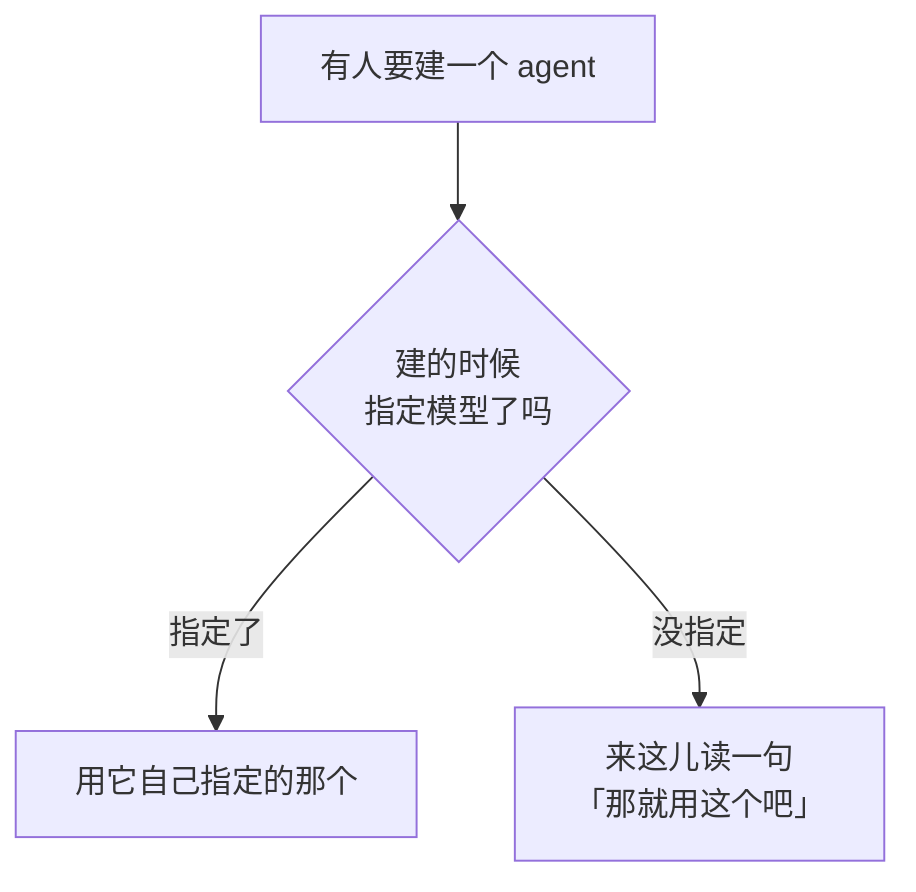

它只拥有这份答案，别的一概不认：

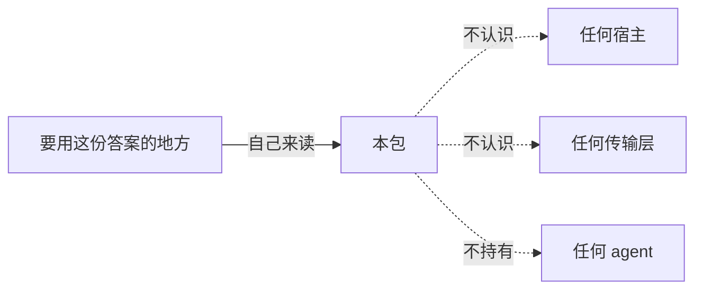

对外只有两个动作：

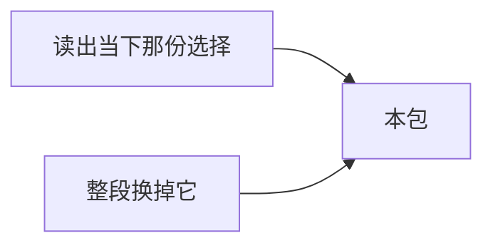

---

## 为什么它是一个包，而不是一个字段

「默认模型」看着像装配时传一个字符串就完了。但它有一条装配传不了的性质：**用户能改，而且改完下一次读就得看见。**

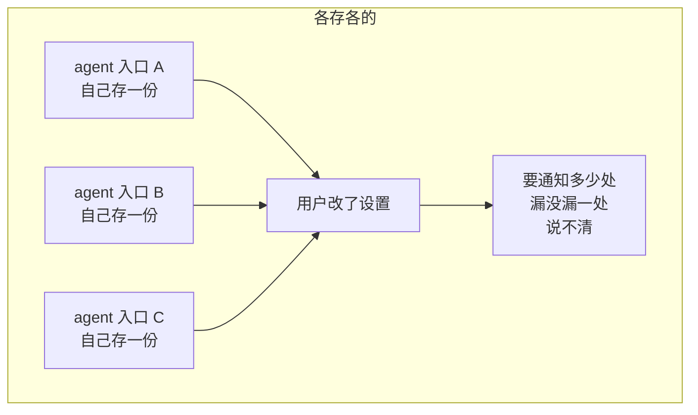

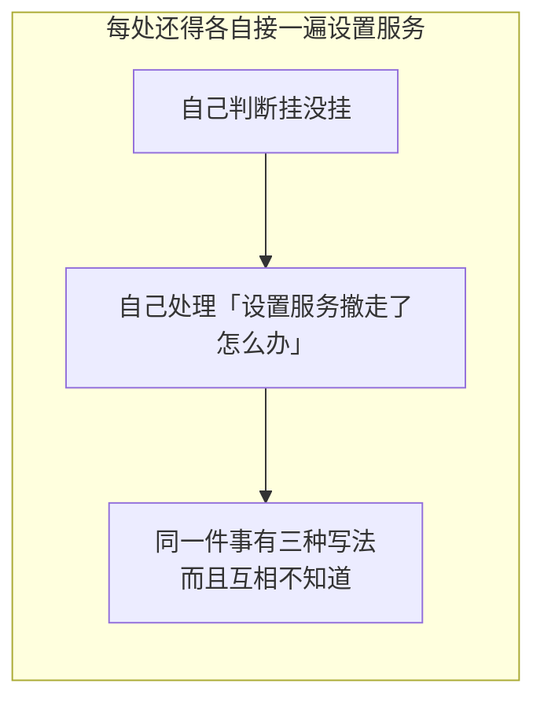

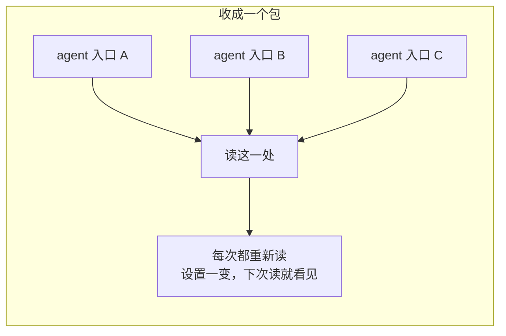

关键在**每次都重新读、不缓存**：


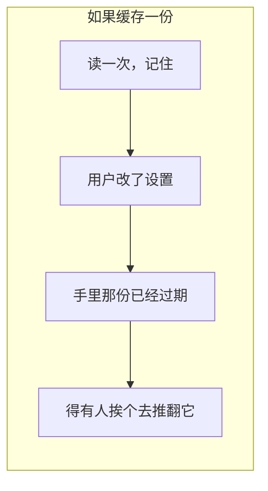

---

## 架构：两层来源，不是一个可变值

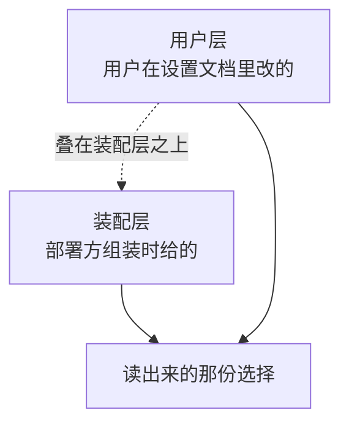

两层刻意不压平成一个值：

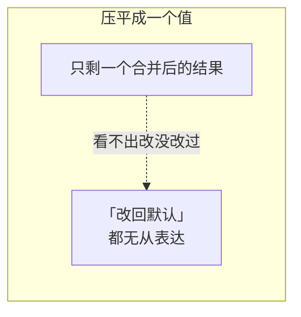

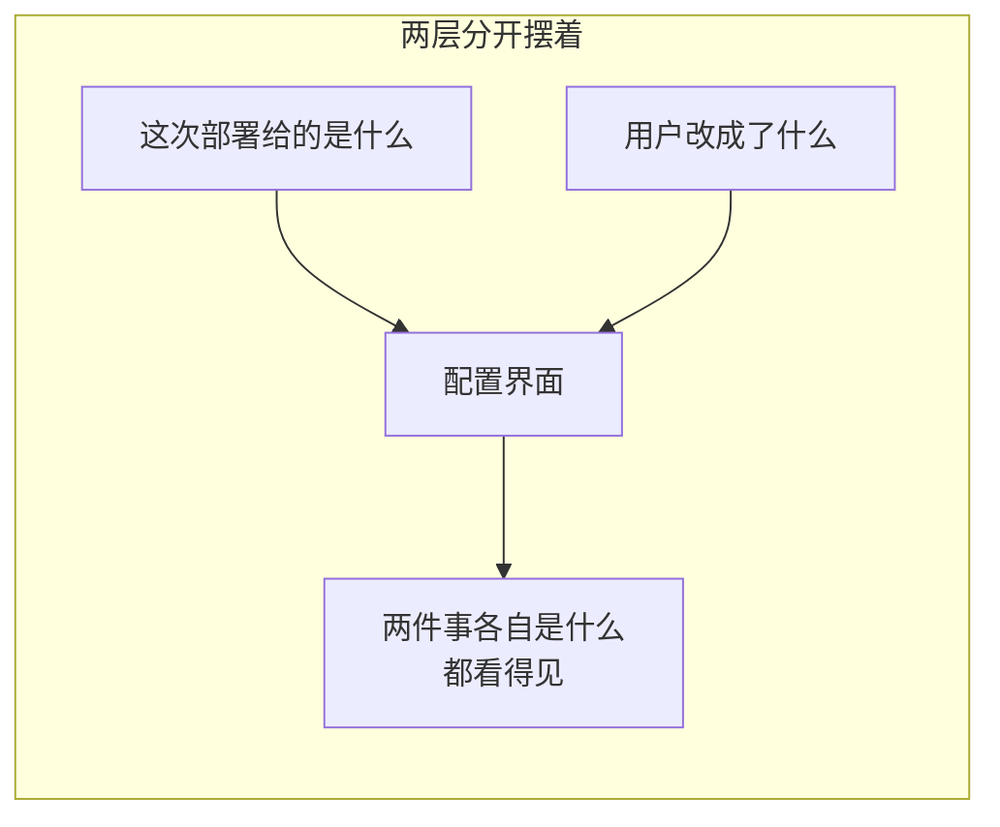

装配那一份是压在最底下的一层，不是一个可以被写掉的初始值：


### 挂没挂设置服务，是两条路

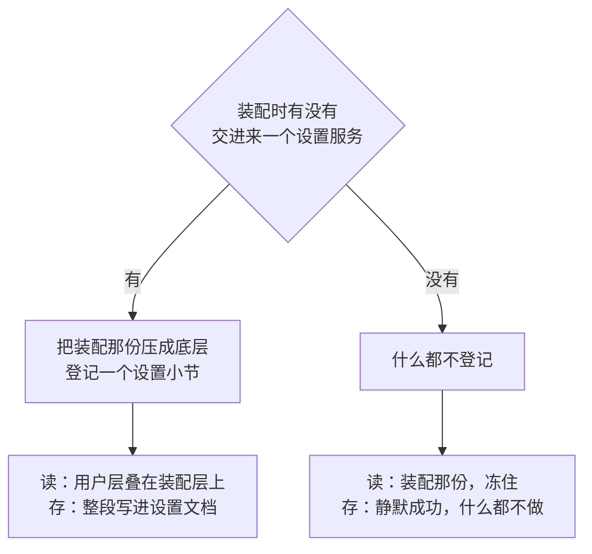

在 DSH 那边，这个岔口是靠万能上下文表达的——没挂时整段登记根本不跑。Go 里没有那个东西：

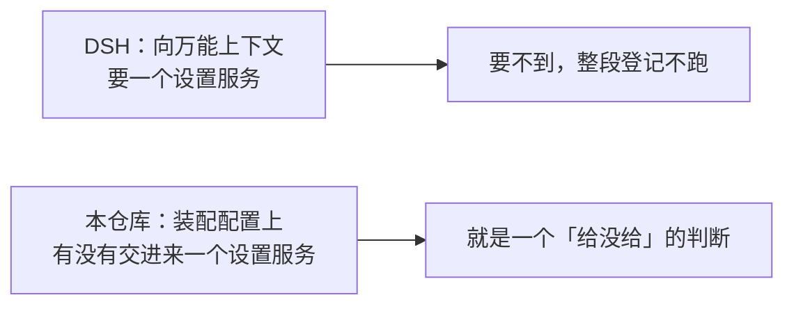

读一次选择走的路：

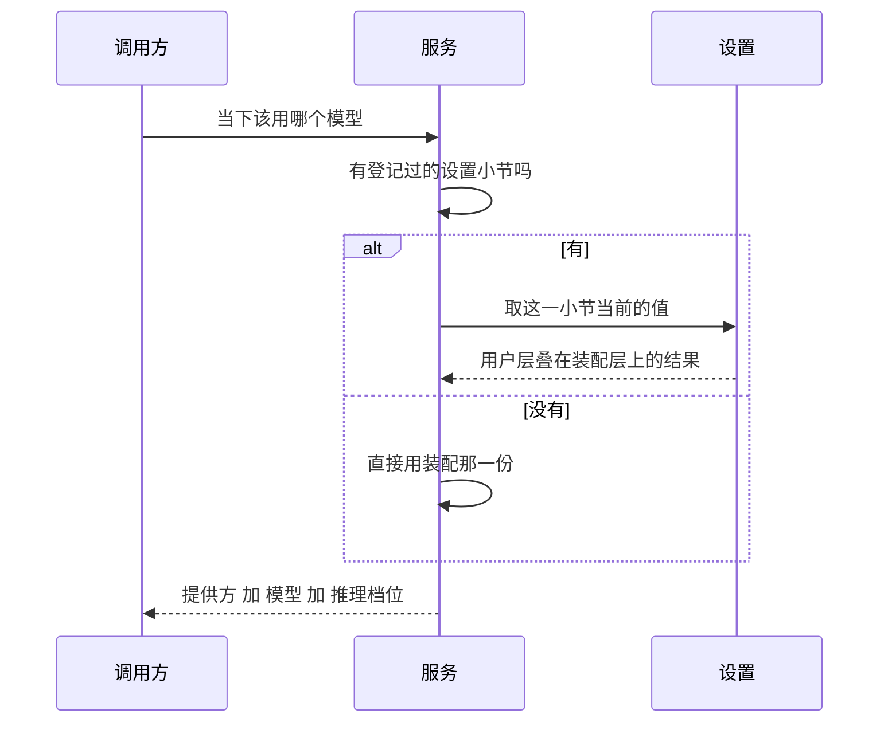

存一次选择走的路：

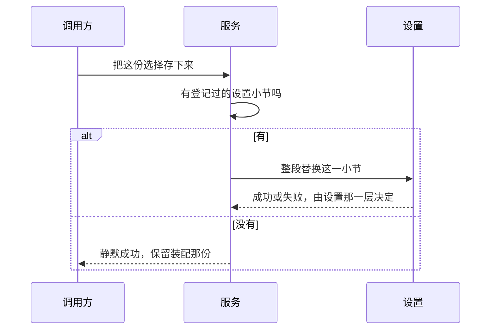

登记时还有一层被刻意留空：


---

## 三个决定

### 一、撤销登记时退回装配那一份

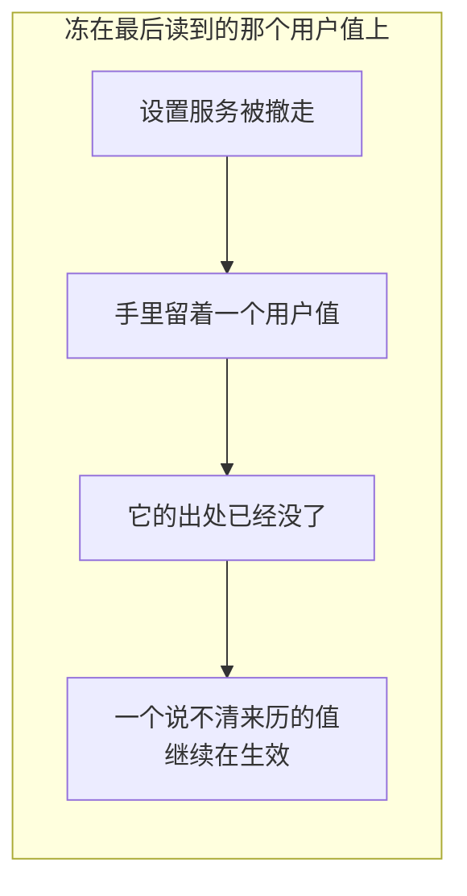

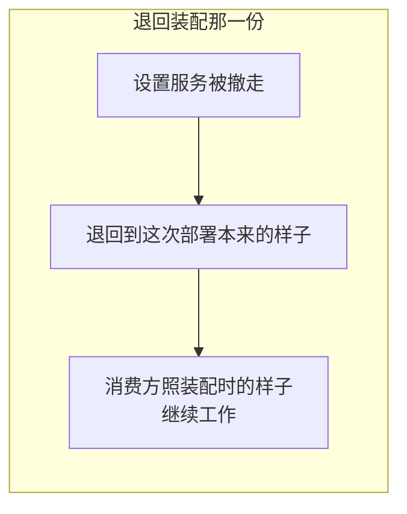

### 二、存的时候整段替换，不打补丁

交进来的是一份已经解析完的完整选择。

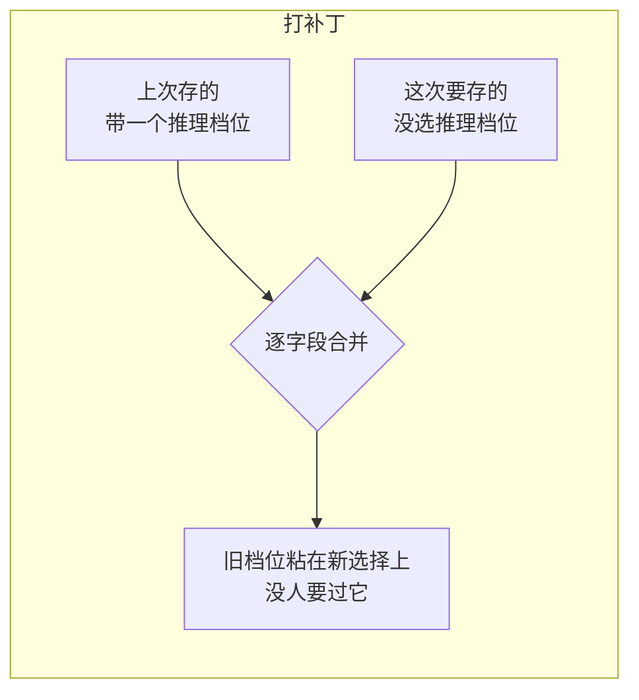

```mermaid
flowchart LR
    subgraph GOOD["整段替换"]
        A["这次要存的那一份<br/>就是全部"] --> B["没选的字段<br/>就是真的没选"]
    end
```

### 三、推理档位用空串表示「没选」

```mermaid
flowchart LR
    A["模型调用配置"] --> Z["空串 = 没选"]
    B["agent 那边的模型选择"] --> Z
    C["本包"] --> Z
    Z --> Y["三处不必来回翻译"]
```

```mermaid
flowchart LR
    subgraph BAD["用一个「可以为空」的指针表达"]
        A["每跨一处边界"] --> B["就要判一次空<br/>再翻译一次零值"]
        B --> C["翻译漏一处<br/>就多一种「没选」的形状"]
    end
```

---

## 和「单个 agent 换模型」不是一回事

这两件事最容易混：

```mermaid
flowchart TD
    A["部署级默认<br/>本包"] --> A2["建 agent 的时候<br/>没指定就用它"]
    B["单 agent 运行期切换<br/>Agent 控制面"] --> B2["这个 agent 跑着跑着<br/>下一步换一个"]
    A2 -.互不覆盖.- B2
```

```mermaid
flowchart TD
    Q{"这个 agent 自己<br/>有没有显式选择"}
    Q -->|"有"| A["永远优先用它自己那个"]
    Q -->|"没有"| B["这时候本包才说话"]
```

```mermaid
flowchart LR
    A["运行期切换那件事<br/>已经接上了"] --> B["用的地方是 ACP 接入"]
    B --> C["它要解决的是<br/>「换模型不能换到一半」"]
    C --> D["细节见 Agent 控制面"]
```

细节见 [Agent 控制面](agent.md)。

---

## 生命周期与并发

一个服务从造出来到撤销，只有三种状态：

```mermaid
stateDiagram-v2
    [*] --> 冻住的: 装配时没交进来设置服务
    [*] --> 可改的: 装配时交进来了，登记成功
    [*] --> 造不出来: 装配那份不合法，或者登记失败

    冻住的 --> 冻住的: 读，永远是装配那一份
    冻住的 --> 冻住的: 存，静默成功，什么都不做
    可改的 --> 可改的: 读，用户层叠在装配层上
    可改的 --> 可改的: 存，整段写进设置文档

    可改的 --> 冻住的: 撤销登记
    冻住的 --> [*]
    造不出来 --> [*]
```

造出来的时候交出两样：

```mermaid
flowchart LR
    A["造出来的时候"] --> B["交出这个服务"]
    A --> C["交出一个撤销动作"]
```

撤销那一步有次序：

```mermaid
flowchart LR
    A["先把服务退回装配那一份"] --> B["再摘掉设置登记"]
    B --> C["中间不存在<br/>「登记还在、答案已经没了」的空当"]
```

```mermaid
flowchart LR
    A["撤销被调用第二次"] --> B["空操作"]
    B --> C["拆除链上重复触发<br/>不会把已经摘掉的再摘一遍"]
```

只有一把读写锁，只护一个东西——那个设置小节的句柄：

```mermaid
flowchart LR
    A["撤销登记的一方<br/>把句柄置空"] --> L["锁"]
    B["读选择的一方<br/>取出句柄"] --> L
```

```mermaid
flowchart LR
    A["DSH 是单线程 JS"] --> B["那个换来换去的来源<br/>不需要同步"]
    C["Go 里撤登记的一方<br/>和读选择的一方<br/>是两条协程"] --> D["换的又是一个指针"]
    D --> E["不加锁就是一次真的数据竞争"]
```

装配那一份不需要护：

```mermaid
flowchart LR
    A["装配那一份<br/>造出来就不变"] --> B["谁都可以随便读"]
```

读这份选择既不带取消口，也不做 I/O：

```mermaid
flowchart LR
    A["设置服务已经把<br/>当前文档保持在内存里"] --> B["读就是一次内存取值"]
    B --> C["没有可等的东西<br/>也就没有可取消的东西"]
```

---

## 失败语义

**缺提供方或者缺模型，当场拒绝。**

```mermaid
flowchart LR
    subgraph BAD["放过一个空的提供方"]
        A["装配这一步不报错"] --> B["某个 agent 起来之后<br/>第一次发请求"]
        B --> C["模型路由那层报<br/>「查无此提供方」"]
        C --> D["那时已经没有任何线索<br/>指回这一段设置"]
    end
```

```mermaid
flowchart LR
    subgraph GOOD["当场拒"]
        A["造这个服务的那一刻<br/>就报出来"] --> B["报的地点<br/>就是值进来的地点"]
    end
```

这道检查同时装在设置登记的校验位上：

```mermaid
flowchart LR
    A["装配传进来的值"] --> C["同一道检查"]
    B["用户改出来的值"] --> C
    C --> D["不存在「装配严、用户松」"]
```

其余三条：

| 情形 | 结果 |
|---|---|
| 装配那份就不合法 | 造不出这个服务，当场报错 |
| 登记设置小节失败 | 造不出这个服务，错误里带上原因 |
| 没挂设置服务却要存 | **静默成功**，保留装配那份 |

最后一条是有意的：

```mermaid
flowchart LR
    subgraph BAD["「没挂设置服务」也报错"]
        A["调用方被逼着去区分<br/>「我这次存失败了」<br/>和「这次部署压根不能存」"] --> B["而后者它管不着"]
        B --> C["它只能把这个错<br/>原样往上抛，或者吞掉"]
    end
```

```mermaid
flowchart LR
    subgraph GOOD["静默成功"]
        A["这次部署本来就没有可写的存储"] --> B["「存不下来」不是故障"]
        B --> C["装配那一份原封不动<br/>继续当答案"]
    end
```

写进设置文档那一步失败时：

```mermaid
flowchart TD
    A["设置那一层报了错"] --> B["由它决定后果"]
    A -.->|"本包不做"| C["补偿"]
    A -.->|"本包不做"| D["缓存一份「本来想存的值」"]
```

---

## 能力边界

```mermaid
flowchart TD
    P["本包"] -.->|"不管它被读"| N1["哪个 agent 入口在什么时候读<br/>读到之后怎么用<br/>是那些入口自己的事"]
    P -.->|"不做模型路由"| N2["只交出提供方键和模型标识<br/>找不找得到那个提供方<br/>是模型那一层的事"]
    P -.->|"不管凭据"| N3["一个字都不碰"]
    P -.->|"不提供设置的存储后端"| N4["设置怎么落盘<br/>是设置那一族包的事"]
    P -.->|"不覆盖 agent 自带的显式选择"| N5["只在「没有显式选择」<br/>那个位置说话"]
```

还有一条：**没有不变量要注册。**

```mermaid
flowchart LR
    A["每一个可变的值<br/>在被读到之前"] --> B["已经被设置登记那一层的<br/>校验位审过一遍了"]
    B --> C["本包再查一遍<br/>查的是同一件事"]
```

```mermaid
flowchart LR
    A["DSH 留了一个空的安装器"] --> B["好让「这里确实什么都不查」<br/>在一份组装出来的清单里显式可见"]
    C["本仓库没有那种清单"] --> D["所以只留一个名字<br/>在那份不变量名册里<br/>占住自己的所有权"]
```

---

## 当前使用情况

**没有任何非测试代码读它。**

这不是漏了接线：

```mermaid
flowchart LR
    A["DSH 里读它的<br/>是宿主那几个包"] --> B["本仓库明确不提供宿主"]
    B --> C["零消费方是设计的结果"]
```

```mermaid
flowchart TD
    A["这个包是给嵌入方用的<br/>不是给运行时内部用的"] --> B["宿主拿它当<br/>「新建 agent 时的兜底选择」"]
    A --> C["并把它接到自己的配置界面上"]
```

有一处确实空着：

```mermaid
flowchart LR
    A["本仓库唯一那份<br/>可运行的装配"] --> B["建 agent 时把提供方和模型<br/>直接硬传进去"]
    B --> C["没有演示这条线该怎么装"]
```

## 对应的 DSH 能力

下表由 [`docs/packages.md`](../packages.md) 与 [能力覆盖表](../portmap/capability-coverage.tsv) 机器 join 得到：本篇覆盖的 Go 包，承接的是上游 DSH 的哪几条能力，以及各自还缺什么。落点列由源码里的 `// 源:` 注释反查，不是手写的。

| 上游能力 | DSH 包 | 裁决 | 落在哪个 Go 包 | 这里缺什么 |
|---|---|---|---|---|
| 为新建agent提供部署级的默认模型选择 | `core/agent-default-model` | 需要 | `harness/agentdefaultmodel` | — |
| 用户设置Service Definition，管理按namespace分节的schema默认值、组合base与用户层解析 | `settings/settings` | 需要 | `harness/agentdefaultmodel` | — |

## 相关源码

| 路径 | 内容 | 行数 |
|---|---|---|
| `harness/agentdefaultmodel/config.go` | 服务、装配入口、两层来源、读与存 | 208 |
| `harness/agentdefaultmodel/doc.go` | 包说明与移植决定 | 64 |
| `harness/agentdefaultmodel/invariant.go` | 在不变量注册表里占的那个名字 | 18 |

---

## 深入阅读

[运行时设置](settings.md) · [Agent 控制面](agent.md) · [LLM](llm.md)
