# Agent Loop

对应包：`core/agentloop`

## 定位

一个 agent 之所以会「动」——收到一句话、想一想、调几个工具、再想一想、最后给出回答——动起来的全部机器在这个包里。

它和 [Agent 控制面](agent.md) 是一对：

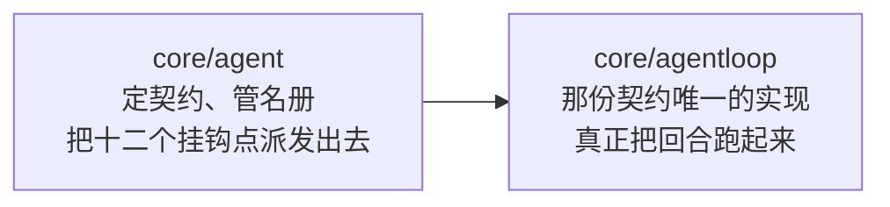

包里只有两样东西：

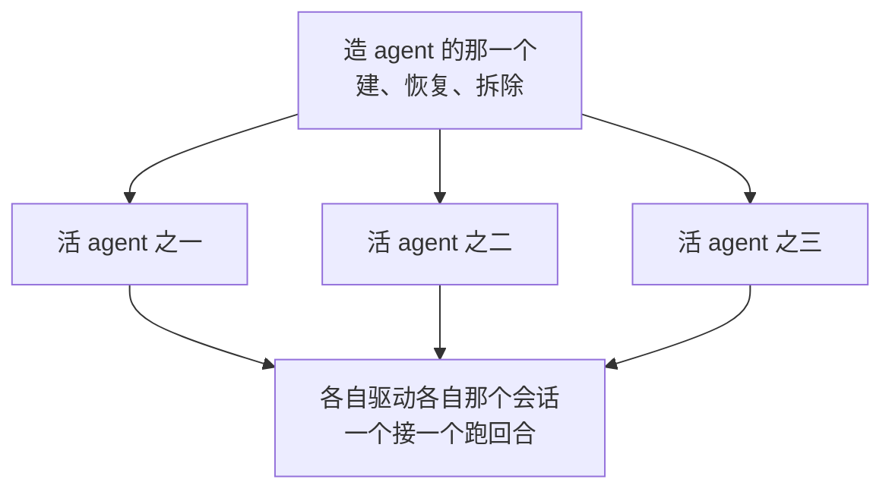

---

## 最要紧的一条：发给模型的东西是算出来的

这一条决定了这个包里几乎所有别的设计，所以放在最前面。

一个直觉的做法是在内存里存一份对话数组，每来一条消息就往后加，要发请求时把它交出去。这个包不这么做：

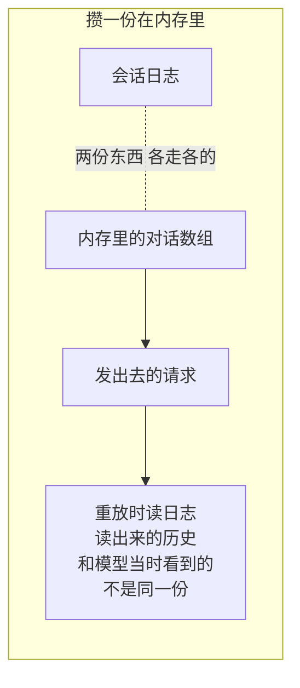

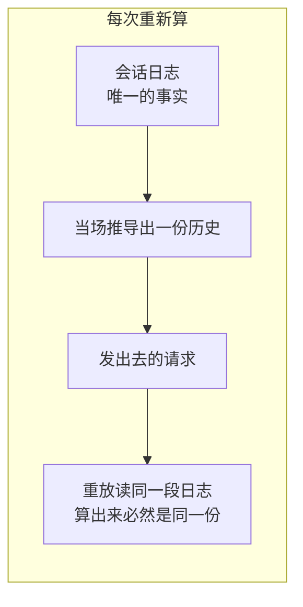

每一次要发请求之前重新推导一遍，连同一步里的重试也重新推导——因为上一次尝试可能已经在日志上留下了痕迹。

这条约定强到给它单独装了一道运行期检查，卡在模型流的最外层：

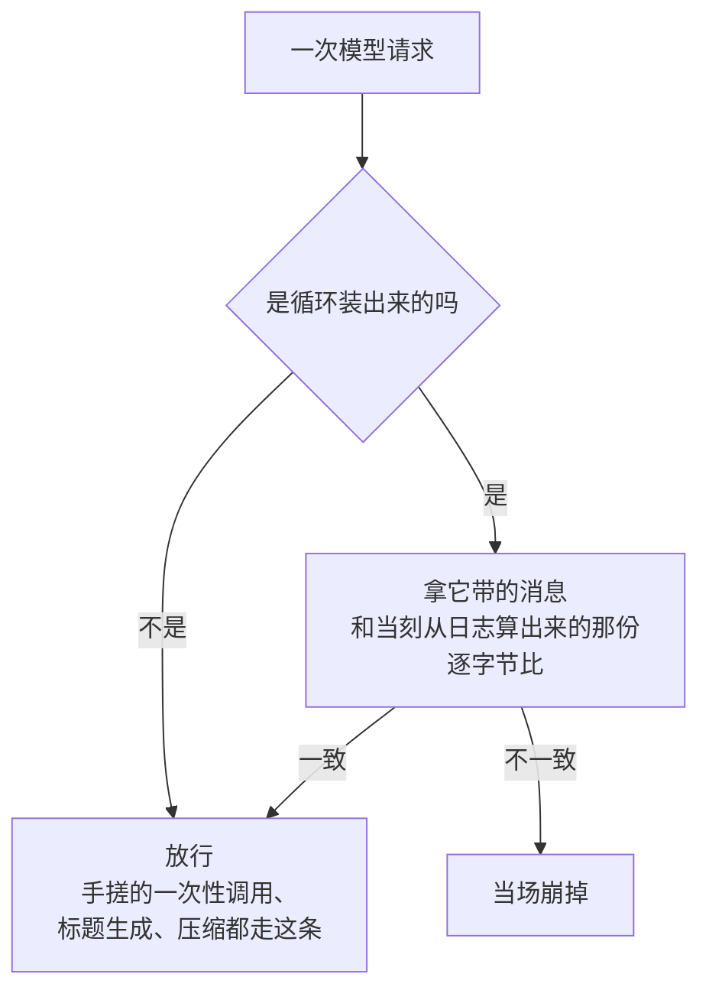

不是「记一条告警然后照发」。一份和日志对不上的请求发出去，事后从日志和从模型两侧都查不出问题在哪。

---

## 回合和步骤

这是理解整个包的坐标系。

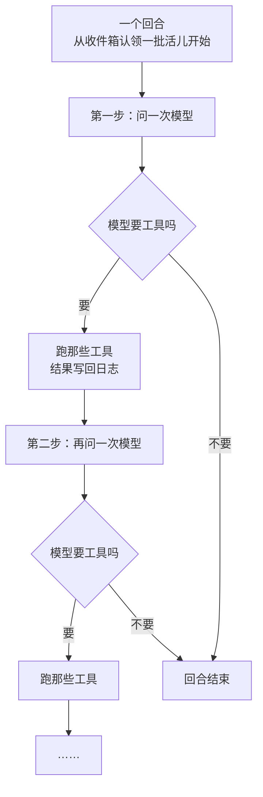

一句大白话：**一个回合是「从收到活儿到给出回答」，一个步骤是「问一次模型」。**一个回合里问几次模型，取决于模型自己要了几轮工具。

回合跑完，如果收件箱里还有排队的活儿，就再开一个回合；没有就静下来。

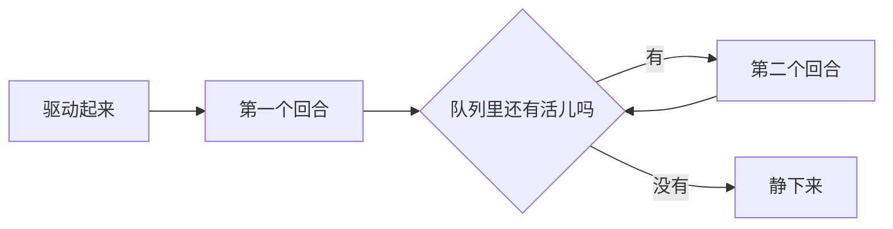

这一路上写进会话日志的东西，按发生次序：

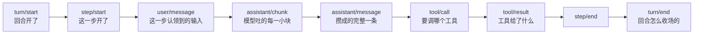

活 agent 自己身上除了「现在第几回合第几步」之外不留任何状态。重建一个 agent 就是从日志重建。

---

## 一个 agent 当下在做什么

三种相：

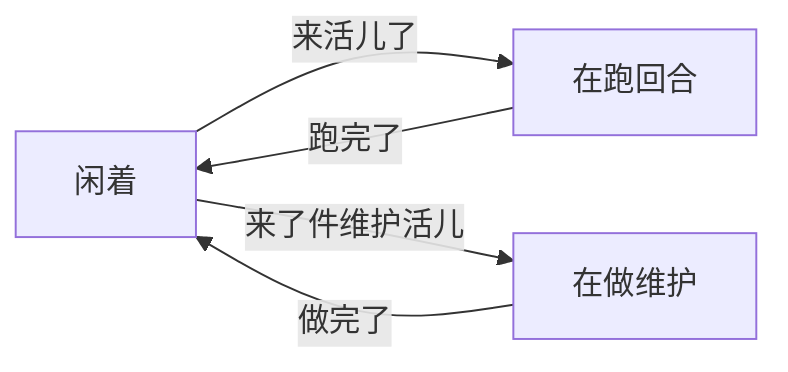

维护活儿是「不是回合」的那一类：存档检查点、清理之类。它占着这个 agent，同一时刻不会有回合在跑。

但对外只看得见两个状态：

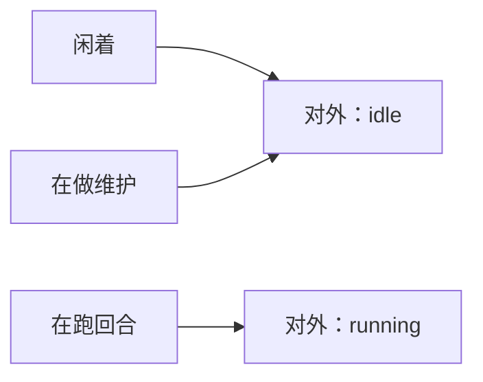

维护期间对外仍是闲的——这是有意的：维护是运行时自己安排的活儿，不该让配置界面显示成「这个 agent 忙着」。

### 一次唤醒送不到的时候

新消息进来通常顺带把驱动叫起来。有两种情况叫不起来：维护活儿正占着，或者当前这段活动已经被取消了。

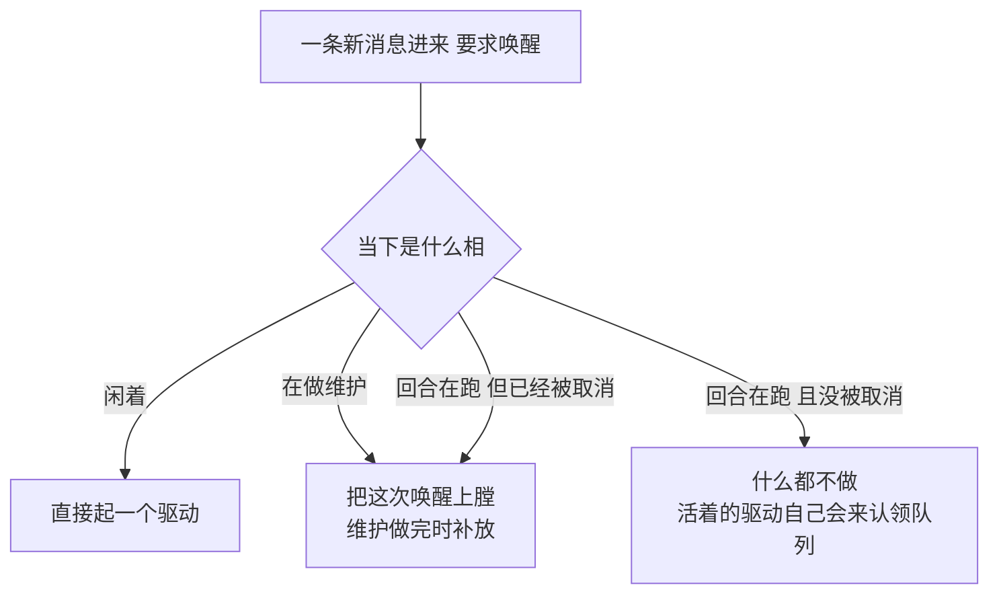

上膛这件事有一个例外：


---

## 一个步骤里发生什么

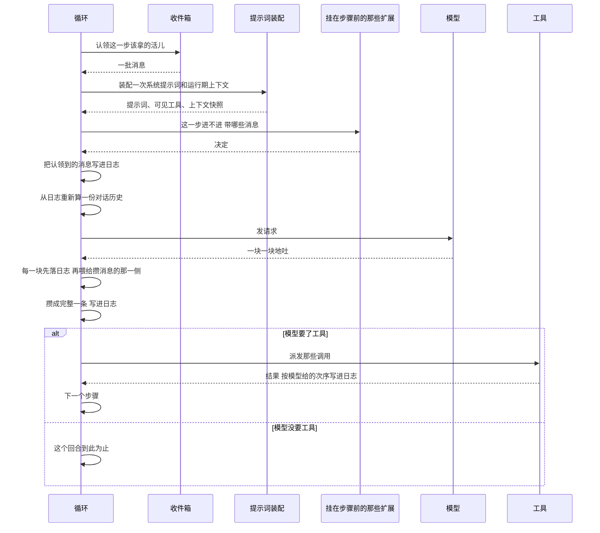

有两处次序是刻意的：


---

## 工具调用怎么排

模型一个步骤里可能一口气要好几个工具。排法：

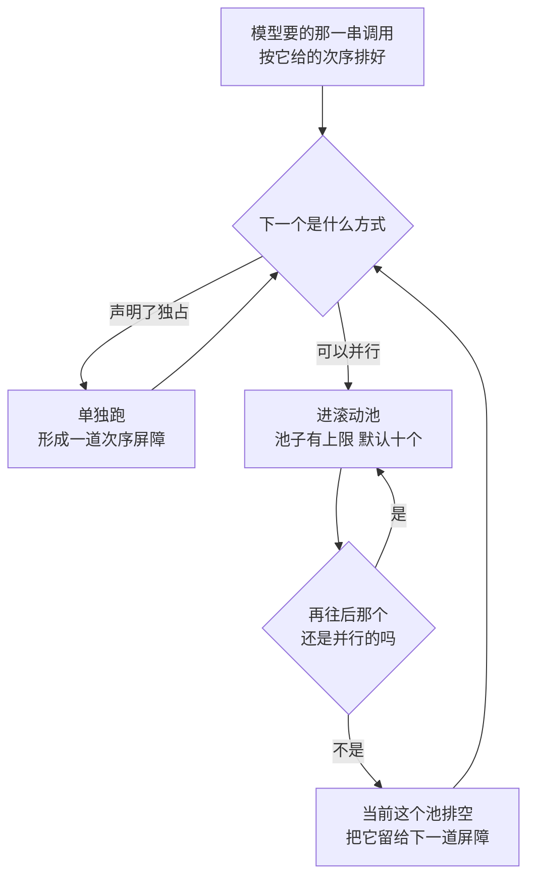

三件事值得说清楚：

**一、方式是起步之前才问的，不是一开始定死的。**

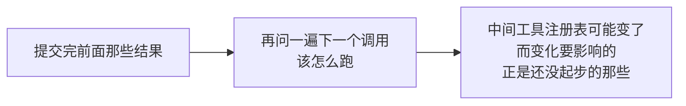

**二、派发可以重叠，落地严格按模型给的次序。**

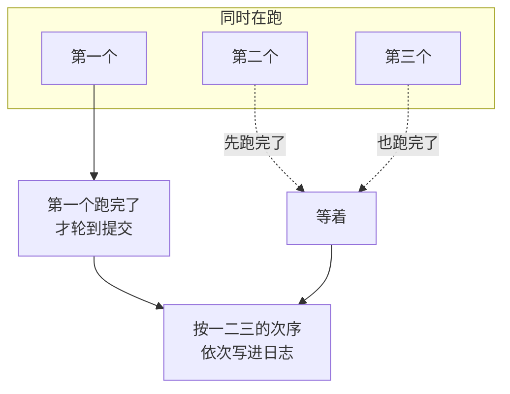

理由是日志要能重放。次序一乱，重放出来的就是另一段历史。

**三、取消的时候要给每一次调用补一份结果。**

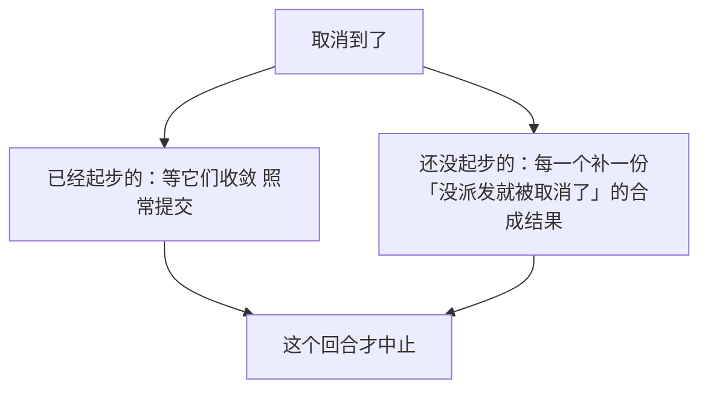

补的不是装样子：

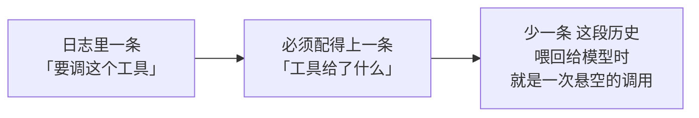

---

## 运行期上下文只在变了的时候说话

当前时间、可见的 skill、加载进来的指令这一类东西会随时变。它们以一条消息的形式呈现在会话表面上，但不是每一步都重发：

```mermaid
flowchart TD
    A["这一步算出来的<br/>那份上下文"] --> B{"和表面上还留着的那份<br/>一样吗"}
    B -->|"一样"| C["什么都不发"]
    B -->|"不一样"| D["提一条新的"]
```

有一处不直觉的：**上下文变成空的时候，发的不是「什么都不发」，是一句明说作废的话。**

```mermaid
flowchart LR
    A["上下文清空了"] --> B{"不发新的"}
    B --> C["早先那份快照<br/>还留在表面上"]
    C --> D["模型继续按<br/>一份已经作废的快照行事"]
```

所以清空时发的是一句正面陈述：当前没有运行期上下文，早先那些快照不再适用。

还有一个区分要记住：

```mermaid
flowchart TD
    A{"这个会话上<br/>曾经投过快照吗"}
    A -->|"从没投过 现在也是空的"| B["什么都不用说<br/>没有任何东西需要被作废"]
    A -->|"投过 现在空了"| C["必须发那句作废陈述"]
```

两种情况「表面上现在留着什么」是一样的——都是什么都没留。分不开这两种，就会在第一种情况下平白往对话里塞一句莫名其妙的话。

---

## 造一个 agent

### 拆除的次序是反着装的

```mermaid
flowchart TD
    A["装配时：<br/>第一个登记「把在飞的 agent 排干」"] --> B["然后登记提示词变量"]
    B --> C["然后登记别的"]
    C --> D["拆除时倒着来：<br/>别的先摘 提示词变量再摘<br/>最后才排干 agent"]
```

反过来会出这种事：

```mermaid
flowchart LR
    A["先排干 agent"] --> B["排干过程中<br/>那些 agent 还要跑完最后几步"]
    B --> C["而提示词变量已经被摘掉了"]
    C --> D["最后几步装不出系统提示词"]
```

### 公布的次序

一个新 agent 要在两个名册上登记——会话名册和 agent 名册——每一步之间都重新确认这个工厂还活着：

```mermaid
flowchart TD
    A["会话进名册"] --> B["agent 进名册"]
    B --> C["会话公布"]
    C --> D["把 agent 记进按作用域查的那张 map"]
    D --> E["agent 公布"]
    E --> F["发出「会话开始了」"]
```

第四步排在第五步前面，是因为公布会同步叫起那些「新 agent 建好了」的扩展，其中就有装系统提示词的：

```mermaid
flowchart LR
    A["一个扩展在公布的<br/>那一刻装提示词"] --> B["它要读这个 agent 的<br/>提供方和模型"]
    B --> C["所以那张 map<br/>必须已经记上了"]
```

### 恢复一个存档

```mermaid
flowchart TD
    A["按身份去持久化那边取"] --> B{"取到了吗"}
    B -->|"取到了"| C["从日志恢复出<br/>回合号、收件箱、请求头"]
    B -->|"没取到"| D{"是真的不存在<br/>还是取的过程出错了"}
    D -->|"确认不存在"| E["当成新会话建一个"]
    D -->|"出错了"| F["报错 不伪造一个空会话"]
```

---

## 生命周期与并发

`deepseek-harness-dsh-v0.1.2-alpha.3` 那边是单线程 JS，这一整块里一个同步原语都没有。Go 这边不行：外面的调用方在别的协程上发消息、取消、等待空闲，而驱动跑在自己那一条上。

一把锁护住三样东西：当下那一相、请求头写没写过、当前这段活动的结束信号——**以及所有对收件箱的触碰**。收件箱那一侧自己不加锁，那是它那个包写下的规矩，所以串行化只能由这里做。

通知一律排到锁外发：

```mermaid
flowchart TD
    A["往收件箱里放一条消息"] --> B["收件箱同步叫起<br/>「有新消息了」的回调"]
    B --> C{"回调在锁里直接派发"}
    C --> D["一个回调完全可能<br/>反手调回来取消这个 agent"]
    D --> E["那条路径当场自锁"]
```

所以回调只往待发队列上排闭包，等锁松开之后统一发出去。这既保住了原先的次序，也和本仓库「挂钩一律在锁外调用」那条通行规矩一致。

取消用的是带原因的取消函数。原因是一份结构化的东西，因为它要原样写进回合结束事件——读日志的人要看得出这个回合是被取消的、以及被什么取消的。

驱动那条取消链的父节点是刻意不可取消的：

```mermaid
flowchart LR
    A["驱动挂在<br/>调用方那条链上"] --> B["那次调用一返回<br/>链就断了"]
    B --> C["驱动活得比它长得多<br/>会被当场带走"]
```

等待空闲这件事要跟着接力：等到当前这段活动结束之后再看一眼句柄换没换，换了说明有替补活儿接上了，接着等。

---

## 失败语义

### 回合结束事件无条件写

```mermaid
flowchart LR
    A["回合正文<br/>不管怎么收场"] --> B["turn/end 一定写"]
    B --> C["一个开了却没关的回合<br/>读日志的人看不出<br/>它是怎么收场的"]
```

收尾这一步自己也可能失败。两条错误都保住，但只有正文没出错时收尾那条才成为交出去的那一条——根因比收尾的次生故障重要。

### 取消不算故障

```mermaid
flowchart LR
    A["取消"] --> B["不报错误挂钩"]
    B --> C["它已经作为<br/>「被取消」写进回合结束事件了"]
```

### panic 兜两层

```mermaid
flowchart TD
    A["回合正文里炸了"] --> B["第一层：兜在正文这一圈"]
    B --> C["走和普通失败完全相同的那条路：<br/>写 turn/end、报一次错、<br/>驱动收工、相回到闲着"]
    D["正文之外炸了"] --> E["第二层：兜在协程根上"]
    E --> F["只报 不试图把相收回闲着"]
```

第二层为什么必须存在：

```mermaid
flowchart LR
    A["协程里没人接的 panic"] --> B["是整个进程没<br/>不是这一个会话没"]
    B --> C["这个包嵌在长期运行的服务里<br/>一个坏存档不该掀掉全部会话"]
```

第二层只报不收拾，是因为走到那儿说明状态机自己的收尾都没跑完，那些字段处在什么样子无从知道——再去动只会把一次事故变成一次说谎。

### 其余几条

| 情形 | 结果 |
|---|---|
| 装配这个循环缺了名册、会话存储、模型、工具、提示词任意一样 | 造不出来，当场报错 |
| agent 身份和会话身份对不上 | 造不出来，当场报错 |
| 并行工具上限配成小于一 | 造不出来，当场报错 |
| 同一份配置里既指定存档身份又指定恢复身份 | 造不出来，当场报错 |
| 请求解算完还是没有提供方或模型 | 这一步失败，错误里点明该在哪两处补 |
| 模型流被打断 | 已经吐出来的那个安全前缀定稿写进日志，标记成被打断 |
| 一个字都没吐出来就被打断 | 什么都不写——一条空的助手消息在重放里是凭空多出来的一轮 |
| 往日志追加失败 | 停止续杯、把在飞的工具排空、把错误交出去，不伪造任何结果 |
| 清空收件箱失败 | 报出去，但取消照做——「这个回合停下来」是取消的主要承诺 |

---

## 能力边界

- **不定义任何具体工具或 skill。** 工具行为是提供方的事。
- **不实现模型协议。** 请求交给模型运行时，怎么说话是适配器的事。
- **不决定存储介质。** 恢复只要求一个「按身份取一份存档、列出有哪些存档」的最小契约。
- **不做鉴权、多租户和计费。**
- **不强行终止不响应取消的代码。** 工具必须自己应答取消链。
- **不认识设置系统。** 并行工具上限是一个「读出当下值」的函数，接到设置上去是装配那一层的事。
- **不给模型交代工作目录。** 服务端没有硬盘也没有目录这个概念，`deepseek-harness-dsh-v0.1.2-alpha.3` 那个工作目录变量在这里有意不移植——跟模型说有就是撒谎。

---

## 相关源码

| 路径 | 内容 | 行数 |
|---|---|---|
| `core/agentloop/agent.go` | 活 agent、三相、回合与步骤、模型请求装配 | 1464 |
| `core/agentloop/loop.go` | 工厂、建与恢复、拆除链、公布次序 | 1299 |
| `core/agentloop/toolcalls.go` | 工具调用调度、独占屏障、并行池、取消补齐 | 410 |
| `core/agentloop/invariant.go` | 「请求和日志对得上」那道检查 | 307 |
| `core/agentloop/runtimecontext.go` | 运行期上下文投影 | 236 |
| `core/agentloop/doc.go` | 包说明与移植决定 | 41 |
| `core/agentloop/constants.go` | 并行工具上限的默认值 | 13 |

---

## 深入阅读

[Agent 控制面](agent.md) · [Session](session.md) · [Tools](tools.md) · [系统提示词装配](systemprompt.md) · [LLM](llm.md)
