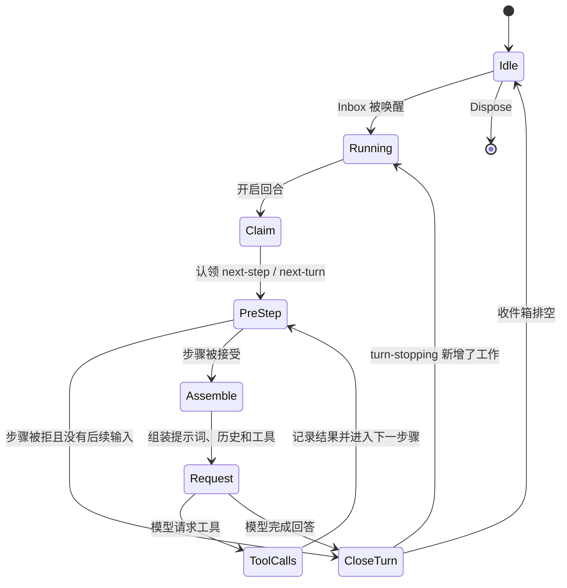

# Agent Loop

覆盖 `core/agentloop`，并说明它与 `core/agent`、模型、工具、提示词和会话的执行关系。

## 定位

`core/agentloop` 是 Agent 的执行面。它实现 ReAct 循环：认领输入、组装上下文、调用模型、执行工具、记录事件，并在模型完成回答时结束回合。

`core/agent` 只定义公共契约；本模块提供该契约的主要实现：

- `ReactLoopAgent` 实现 `agent.Agent`。
- `AgentLoop` 实现 `agent.Factory`。
- `AgentLoop` 通过 `agent.Registry.SetFactory` 接入控制面。

## 核心对象

| 对象 | 职责 |
|---|---|
| `AgentLoop` | 创建或恢复 ReAct Agent，管理其装配和生命周期 |
| `ReactLoopAgent` | 保存活 Agent 的运行控制状态，实现发送、取消、空闲等待和维护任务 |
| `Deps` | 循环所需的 Agent、Session、Prompt、Tools、LLM 和持久化依赖 |
| `Config` | 并行工具数、默认模型、启动行为和设置接线 |
| `RuntimeContextProjection` | 把动态上下文快照与会话事件连接起来 |
| `SessionPersistence` | 循环要求的最小持久化能力接口 |

## 回合与步骤

一个回合从 Inbox 认领输入开始，到模型不再请求工具为止。每次模型请求是一个步骤。



回合和步骤编号从会话日志恢复，不依赖进程内计数作为长期事实。

## 单步执行

每个步骤按以下边界运行：

1. 从 Inbox 认领待处理消息。
2. 运行 `pre-step` Observer，决定是否进入步骤以及携带哪些消息。
3. 将被接受的输入写入会话事件。
4. 通过 `core/systemprompt` 组装系统提示词、运行时上下文、可见工具和变量。
5. 从会话当前状态生成模型历史。
6. 运行 `request` Observer，解析最终模型调用配置。
7. 通过 `llm.Runtime` 发起流式请求。
8. 将模型分块、完整消息和结束原因写入事件日志。
9. 如果有工具调用，执行工具并进入下一步骤；否则准备关闭回合。
10. 运行 `turn-stopping` Observer；若它加入新的引导，则继续，否则写入 `turn/end`。

## 工具调用

`ExecuteToolCalls` 负责一个步骤内的工具调用调度。

- 参数校验和工具解析由 `core/tools` 完成。
- 多个工具调用可以并行派发。
- 默认最大并行数是 `DefaultMaxParallelToolCalls`。
- 实际并行度同时受配置和工具的并发声明约束。
- 执行前与执行后策略保持确定顺序，不因并行派发改变。
- 每个模型工具调用都必须得到一条结果，包括找不到工具、参数错误、拒绝、超时、panic 和取消。
- 一次调用声明结束回合时，不会抹掉同一步已经提交的附加上下文或并发结果。

工具失败被写成工具结果，而不是让 Go error 穿过模型协议。循环级、会话级或持久化级失败仍作为 Go error 处理。

## 上下文组装

循环把四类输入交给模型：

| 输入 | 来源 |
|---|---|
| 系统提示词 | `core/systemprompt` 的段落和变量 |
| 动态上下文 | Instructions、Skill、时间、会话引用和工具附加上下文 |
| 模型历史 | 会话事件计算出的当前可见消息 |
| 工具定义 | 当前作用域可见的 `core/tools.Definition` |

`RuntimeContextProjection` 记录模型实际看到的动态上下文快照，使恢复、压缩和诊断不依赖当时的进程内对象。

模型配置与提示词中的 Provider/Model 必须使用同一步骤抓取的选择，防止动态切换时两者不一致。

## 会话事件

循环会写入的核心执行事件包括：

```text
turn/start
user/message
step/start
assistant/chunk
assistant/message
tool/call
tool/result
step/end
turn/end
```

扩展模块还可能写入 Inbox、重试、压缩、Goal、Schedule 等事件。所有事件必须属于装配好的会话词汇。

日志是权威事实。`ReactLoopAgent` 只保留当前正在运行的控制状态，不作为恢复来源。

## 取消

取消使用 `context.Context` 和带原因的取消函数向下传播：

- 模型流、提示词提供方和工具执行收到同一条取消链。
- 取消原因会转成 `TurnEndCancelCause` 写入回合结束事件。
- `CancelOptions.KeepInbox` 决定是否保留尚未运行的输入。
- 空闲时调用 Cancel 是空操作，不会影响未来回合。
- Dispose 会停止循环、等待退出，再按装配顺序释放注册表、会话和作用域资源。

工具必须主动响应 Context。运行时不能强行终止忽略取消的 Go 代码。

## 空闲与维护

`WhenIdle` 等待当前回合、维护任务以及紧随其后的唤醒工作全部结束。

`RunMaintenance` 只在真正空闲时运行非回合任务，例如检查点或清理。维护期间 Agent 对外仍是 `idle`，新输入留在 Inbox，等维护完成后再运行。同一时间只能有一个回合或维护任务占用 Agent。

## 并发

- 每个 Agent 的驱动串行处理回合，避免一个会话出现多个事件写者。
- 外部 goroutine 可以并发发送、引导、取消和等待空闲。
- Inbox 的直接修改不是并发安全边界，外部必须使用 `Agent` 方法。
- 工具派发可以并行，但结果按事件和调用 ID 配对。
- Observer 在其定义的边界运行，不能假设都在同一个 goroutine。
- 内部锁不跨模型请求、工具执行、持久化或用户回调。

## 创建与恢复

### 创建

1. 校验 Session ID、工作目录、模型选项和 Seed。
2. 创建 Session、Agent Scope、Inbox 和 `ReactLoopAgent`。
3. 执行 `Setup` 与 commit，装配 Agent 局部世界。
4. 登记并公布 Session 与 Agent。
5. 发送 `session-start(startup)`。
6. 启动驱动。

### 恢复

1. 从持久化服务读取和校验会话。
2. 从事件恢复 Session、Inbox、回合编号和步骤边界。
3. 重建 Agent Scope，并重新执行 `Setup`。
4. 公布活对象。
5. 发送 `session-start(resume)`。
6. 启动驱动；不会自动继承进程局部授权。

任一步失败都应回滚已经登记的资源，并为已经公布的生命周期发出配对的 Dispose 通知。

## 配置重点

- 默认模型 Provider、Model 和最大输出 Token。
- 最大并行工具调用数。
- Session 持久化能力是否可用。
- System Prompt、Tools 和 LLM Runtime 是否完整装配。
- 启动失败 Observer。
- 动态设置与默认模型服务。

创建需要 Factory、模型路由和必要注册表；普通新会话可以不启用持久化。恢复时必须提供满足 `SessionPersistence` 的实现，并在恢复边界明确失败，不应等到第一次模型调用才暴露。

## 边界

本模块负责：

- Agent 创建、恢复和执行循环。
- 回合、步骤、模型流和工具调用调度。
- 取消、空闲等待和维护任务。
- 执行过程写入会话事件。

本模块不负责：

- 定义宿主业务工具或 Skill。
- 实现模型协议；由 `llm.Adapter` 负责。
- 实现工具行为；由工具提供方负责。
- 决定数据库、对象存储或网络传输。
- 用户鉴权、多租户授权和计费。
- 任意代码执行、Shell 或本地终端。

## 相关源码

| 文件 | 内容 |
|---|---|
| `core/agentloop/agent.go` | `ReactLoopAgent`、驱动、回合和步骤 |
| `core/agentloop/loop.go` | Factory、创建、恢复与生命周期装配 |
| `core/agentloop/toolcalls.go` | 工具调用并发调度与结果收敛 |
| `core/agentloop/runtimecontext.go` | 动态上下文事件连接 |
| `core/agentloop/doc.go` | 包级设计与移植边界 |
