# 附件与图片

对应包：`attachment`、`adapter/imagestore`

## 定位

人跟 agent 说话的时候会贴一张截图：「这个报错是什么意思」。这一下看着简单，麻烦全在后面——那张图有好几兆，而会话日志要被反复读、反复回放、还要送到客户端去。

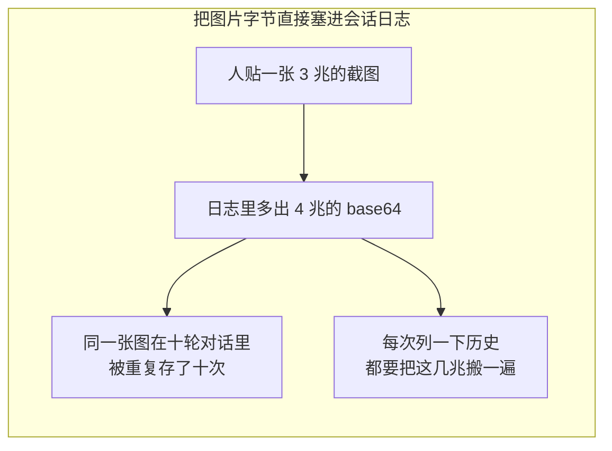

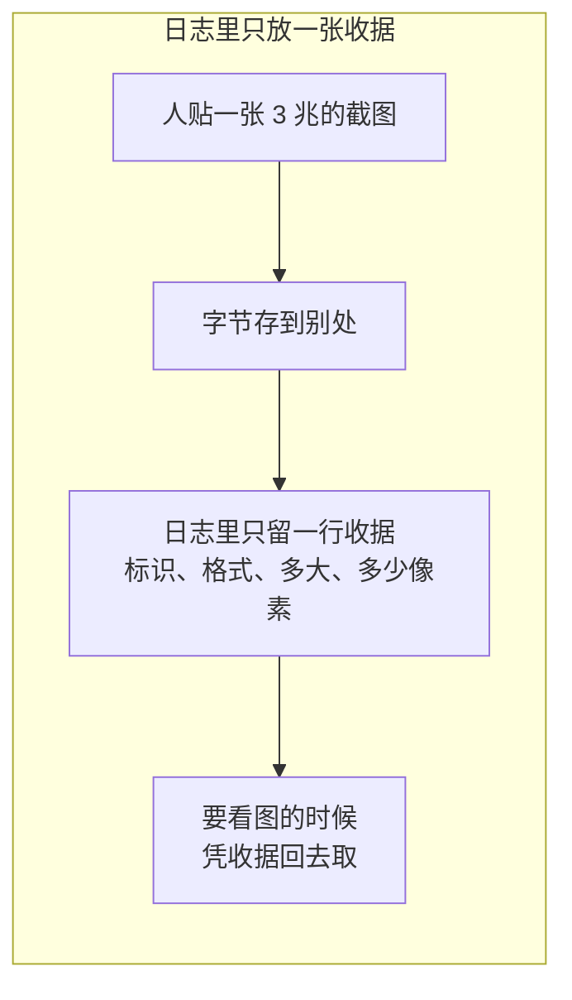

这两个包管的就是**那张收据**：怎么发、发出去之前要验什么、凭它怎么把字节取回来、以及取回来的东西凭什么相信还是当初那一张。

### 为什么这里不能说「路径」

一般人第一反应是「图存成一个文件，日志里记文件名」。这条路在本仓库走不通：

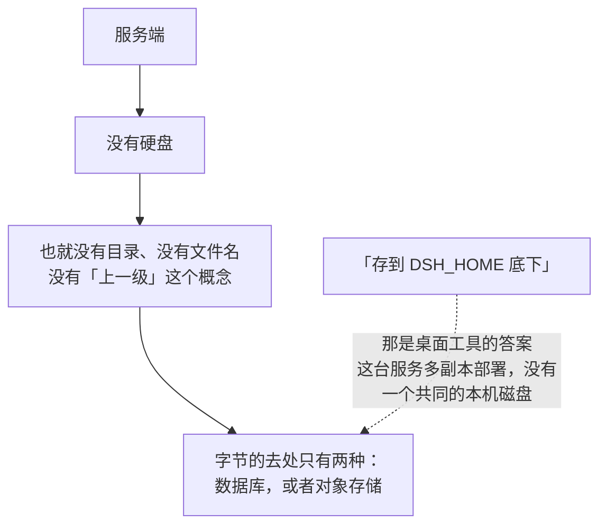

所以收据上写的不是路径，是一个**不透明标识**——它长什么样、怎么换回字节，只有存储那一侧知道。

---

## 架构

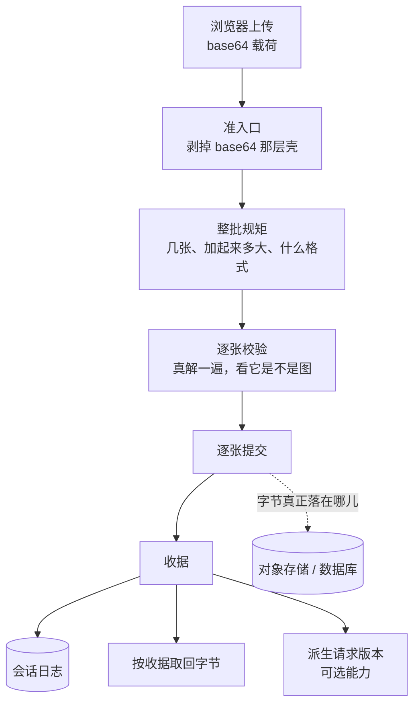

两个包的分工：

| 包 | 它管的 | 它明确不管的 |
|---|---|---|
| `attachment` | 词汇、**次序规矩**、失败分类 | 一个字节都不存 |
| `adapter/imagestore` | 字节怎么落、怎么取、怎么核对 | 不决定模型收不收图 |

### 两层图，不能混成一层

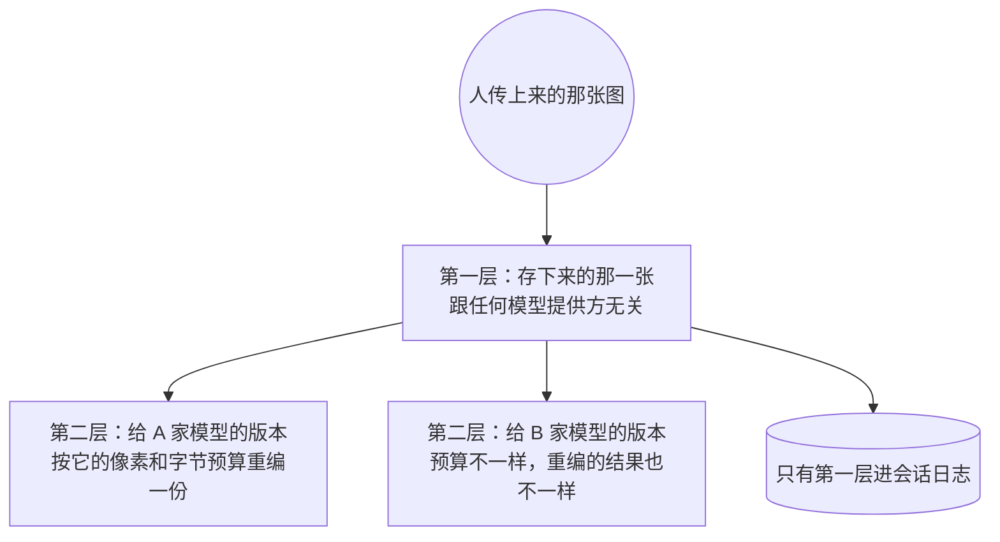

**为什么非要分开**：同一张图会被送给好几家模型，各家的预算不一样。如果日志里存的是「给 A 家裁好的那一份」，那么换一家模型、或者 A 家明天改了限额，整段历史就全废了。第二层是**派生出来的**，随时可以重新算；第一层是事实，只算一次。

第二层带一个确定性标识：同一张图配同一条预算，永远得到同一个标识和同样的字节——重编一次是有成本的，这个标识就是用来跨请求把这份成本省下来的。

### 收据上绝不放什么

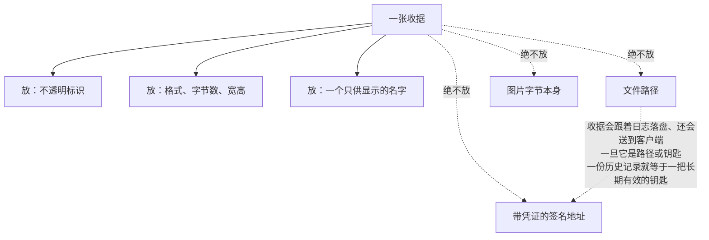

那个显示名同理：它来自浏览器或者别处，是不可信输入，**只用来显示，绝不参与任何路径解析**。

### 契约和实现是怎么分家的

DSH 那边这是一个抽象类：四个抽象成员留给子类填，三个已经写好的方法子类继承就有。Go 没有实现继承，接口里也放不下方法体，所以这里把两半拆开：

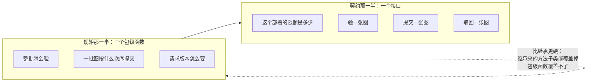

这么分的理由是「一批图怎么排队校验和提交」和「字节存在哪儿」是两件独立变化的事，而**前者一旦写错，代价是脏数据**。把它钉在契约上，任何实现方都绕不过去。

---

## 一批图的次序，这是整篇里最要紧的一段

一条消息可以带好几张图。操作者的期望是很朴素的：**要么这条消息整条发出去，要么整条不发**。

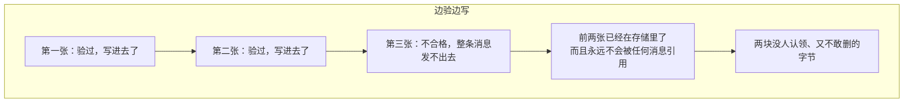

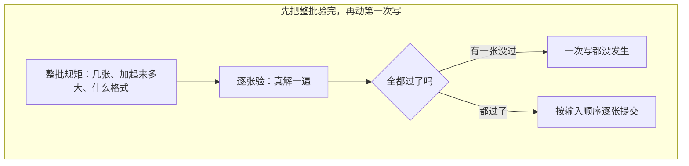

### 写这一段没有事务，所以退一步说实话


**能给的保证要给足，给不了的不许含糊。** 说得出「回滚了」而实际上没回滚，比老实说「有残留但没人指得着」坏得多。

### base64 只认一种写法

上传进来的是 base64 文本。这里不接受「能解出来就行」，只认**规范形**：空串、带换行、填充不对、以及网址安全的那套别名，一律拒。

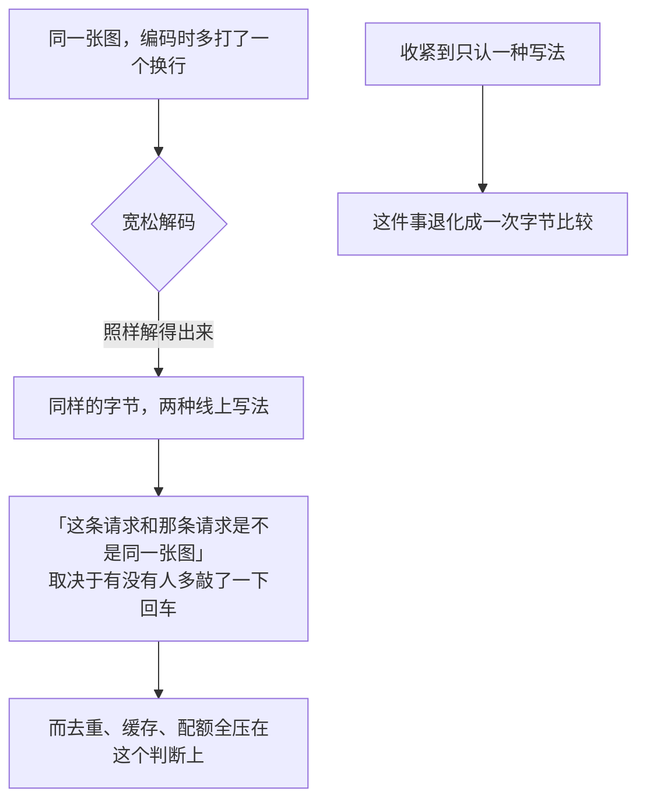

DSH 那边的做法是解完再编回去和原串比，因为它所在的运行时解码器极其宽松。Go 的严格解码器一趟就能拒掉绝大部分，只差两处，所以这里另外补两条显式检查：空串（一张零字节的图不是图），以及回车换行（Go 的解码器为了读分行编码，有意忽略这两个字符）。

---

## 落地那一台：字节的哈希就是它的名字

`adapter/imagestore` 是收据这条契约在本仓库的实现。它建在文件系统那条接缝上，所以服务端部署下面接的是对象存储——**换介质是装配时的一行事，不是改代码**。

它的办法叫内容寻址：

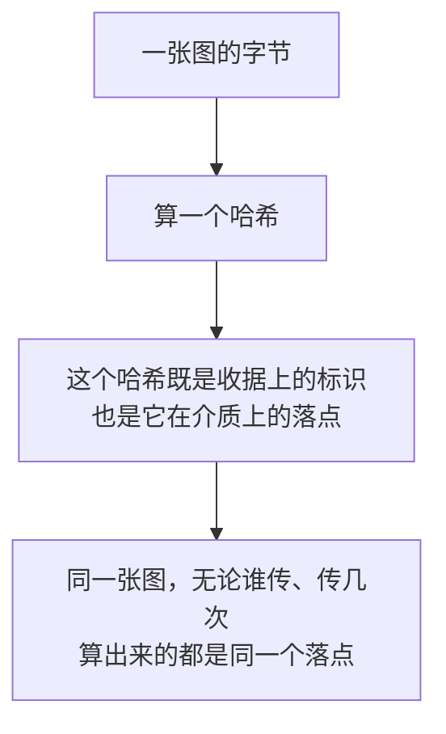

### 存第二次会发生什么

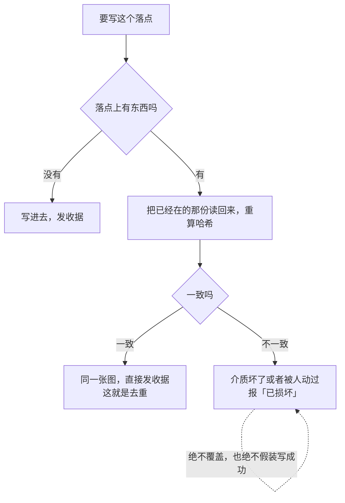

**同一张图存多少次都只占一份**——第二次写自然撞到同一个落点，于是塌成一次核对。这不是特意做的去重逻辑，是内容寻址白送的。

DSH 那边为了在本机磁盘上自己保证发布的原子性，用了「临时文件加硬链接再同步目录项」那一整套。这条接缝上不需要：接缝本身就有一个「不覆盖地发布」的原语，原子性由介质那一侧负责。

### 存储里绝不放第二份描述

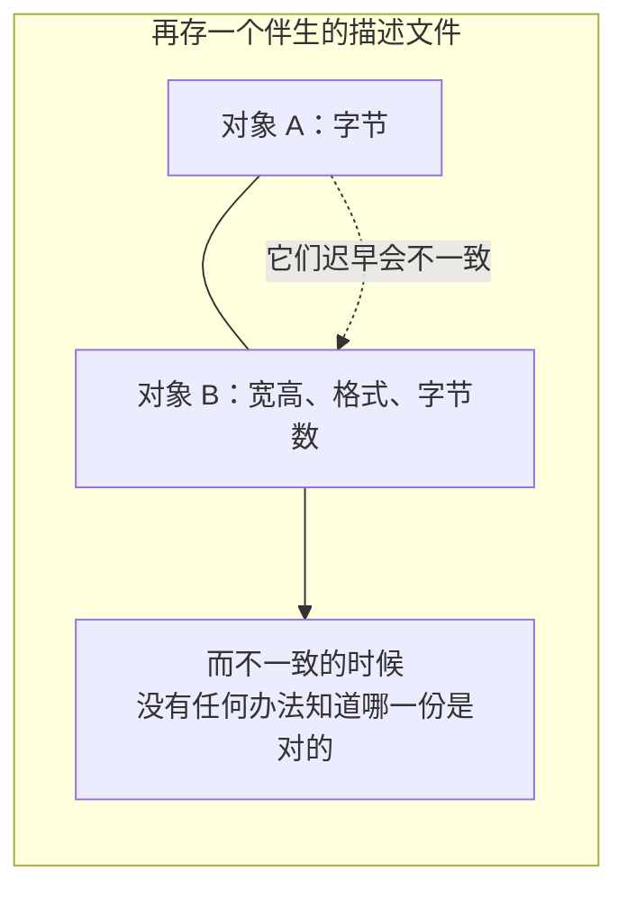

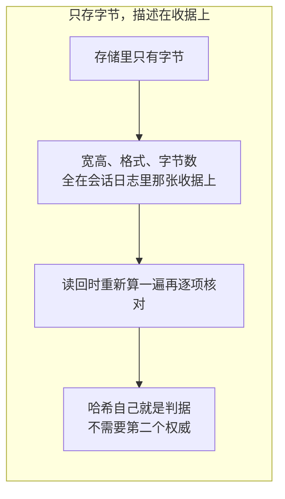

### 取回一张图要过三道

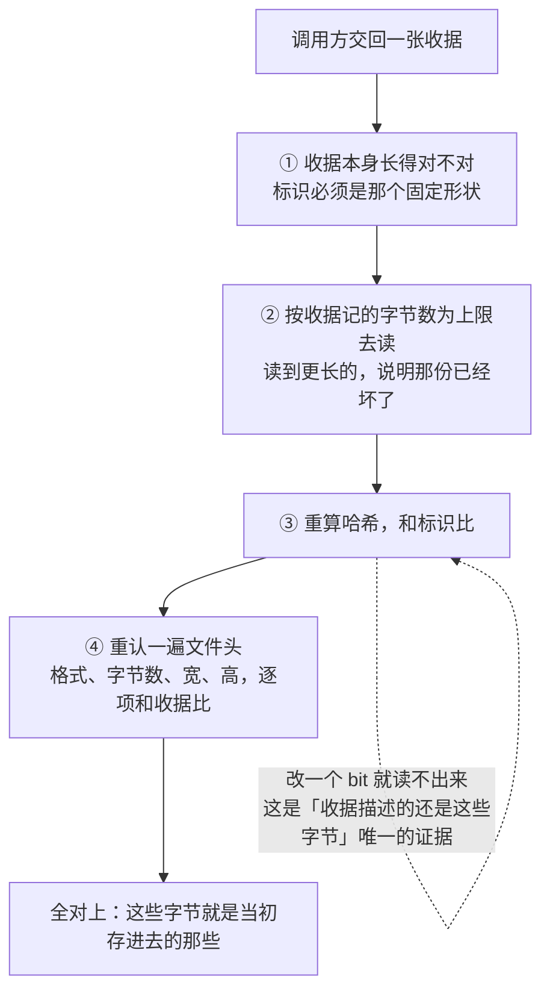

取回时**不再把整张栅格解一遍**：哈希对上就证明这些字节正是准入时完整解过的那些，而历史回放会一遍遍走这条路，多解一次是白花的力气。

### 六条限额，分两个地方判

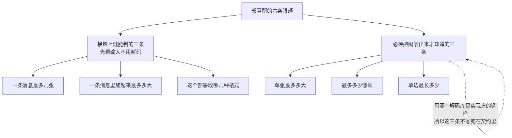

同时犯了好几条的时候，报出去的是**最外层那条**：

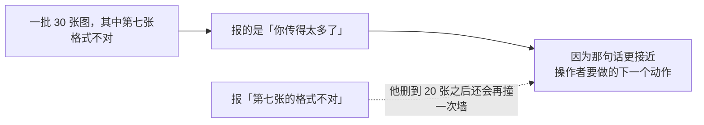

### 光看文件头不够

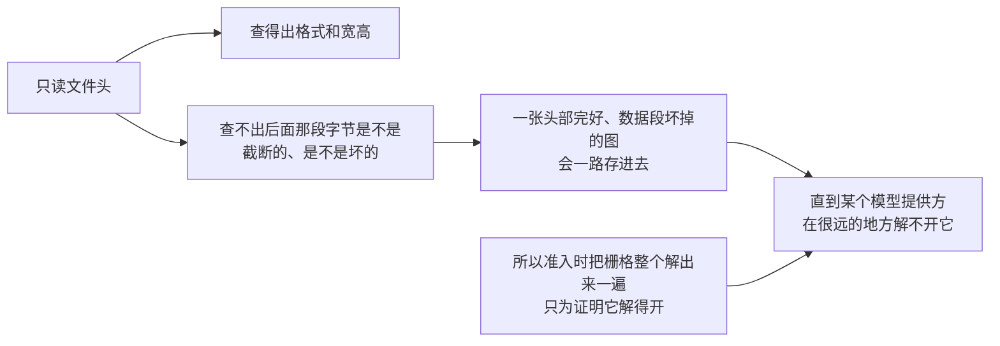

### 显示名要剥干净

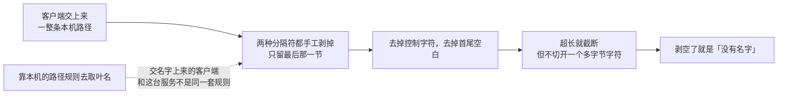

切开一个多字节字符的后果不是「显示难看」——那个半截字符会跟着收据一路落盘。

### 本轮画出来的三条边界

这三件事**不做，是决定，不是遗漏**：

```mermaid
flowchart TD
    N1["不做归一化缩放"] --> R1["缩放要一个编码器<br/>本轮不把它带进来"]
    R1 --> C1["后果：存下来的就是<br/>操作者传上来的那些字节"]
    N2["不派生请求版本"] --> R2["同样要编码器"]
    R2 --> C2["后果：调用方拿到一个明确的<br/>「这个实现不支持」"]
    N3["不认 EXIF 旋转"] --> R3["这里没有 EXIF 解析器"]
    R3 --> C3["后果：收据上记的是栅格自己的宽高<br/>那段 EXIF 原样留在字节里<br/>渲染方照旧转得过来"]
```

第二条之所以能这么干净地留白，是因为「派生请求版本」在契约上就是**可选能力**：实现方具备就走它，不具备就得到一个固定的失败码。不必为了「我不支持」去写一个只会报错的方法。

```mermaid
flowchart TD
    A["调用方要一份请求版本"] --> B{"挂着的这台存储<br/>具备这个能力吗"}
    B -->|"具备"| C["按预算派生一份"]
    B -->|"不具备"| D["「这个实现派生不出请求版本」"]
    D -.->|"是一句明确的话<br/>不是一次崩溃，也不是一张凑合的图"| D
```

---

## 生命周期与并发

```mermaid
flowchart TD
    A["这两个包都不持有后台协程"] --> B["也不持有任何可变状态"]
    C["并发安全由介质那一侧负责"] --> C1["「不覆盖地发布」由后端保证"]
    D["同一批字节的标识必须稳定"] --> D1["同一份派生的标识也必须稳定"]
    D1 -.->|"否则缓存和上传索引会各自为政"| D1
    E["交出去的限额是一份拷贝"] --> E1["这几条在一台存储的一生里不许变"]
    E1 -.->|"整批先按它判过、再逐张写<br/>中途变化会让两段按两套规矩走"| E1
```

对象一旦提交就是不可变的：没有「原地改一张图」这个动作，改了就是另一张图、另一个标识。**保留多久、要不要加密，归介质那一侧的策略管**，这两个包不表态。

---

## 失败语义

所有失败都带一个稳定的机器码，调用方**照码分派，绝不去匹配错误文字**。这些码是线上可见的，所以取值一律照 DSH 原样落地，不改拼写、不本地化。

```mermaid
flowchart TD
    A["出了岔子"] --> B{"谁能让下一次尝试成功"}
    B -->|"调用方自己"| C["图片准入类<br/>张数超了、总量超了、格式不收、<br/>base64 不规范、解不出是图、<br/>声称的格式和字节对不上、<br/>单张太大、像素太多、边太长"]
    B -->|"谁也不能，得修系统"| D["存储故障类<br/>收据不合法、已损坏、<br/>写失败、找不到、读失败、<br/>派生能力不具备"]
    C --> C1["界面提示操作者换一张图"]
    D --> D1["界面报一次系统故障"]
```

这条分界线上有一个**故意的偏向**：

```mermaid
flowchart LR
    A["一个判不出类别的错误"] --> B["一律当成存储故障"]
    C["反过来：把存储故障说成「你的图不行」"] -.->|"操作者会反复换图<br/>而问题根本不在他那边"| B
```

### 一条不显眼但要紧的次序

```mermaid
sequenceDiagram
    participant U as 调用方
    participant A as 附件层
    U->>A: 要一份请求版本
    Note over U: 这时候调用方自己已经走了<br/>（超时、取消、连接断了）
    A-->>U: 报「这次调用已取消」
    Note over A: 而不是报「这个实现不支持派生」
```

**取消优先于「不支持」。** 调用方已经不在了的时候，「这台实现具备不具备某项能力」根本不是它要知道的事——报「不支持」只会让日志里出现一条其实从没被真正需要过的能力缺口。

### 错误码不靠继承传递

```mermaid
flowchart LR
    A["别的包里的错误"] --> B["只要它答得出自己的码<br/>就照样按码分派"]
    B --> C["它不需要引用附件这个包"]
    C -.->|"因为模型消息那一层已经引用了附件的收据<br/>反过来再引一次就成环了"| C
```

判断还会**顺着包装链一路往下问**，而不是只看最外面那一层——在 Go 里包一层错误是常态，只看最外层等于让「谁顺手包了一下」决定这个判断的结果。

---

## 能力边界

```mermaid
flowchart TD
    Y["做的"] --> Y1["一套谁都绕不过去的准入与提交次序"]
    Y --> Y2["一张能进会话日志、也能送客户端的收据"]
    Y --> Y3["内容寻址：去重和完整性是同一件事"]
    Y --> Y4["一组稳定的失败码，分得清「换张图」和「修系统」"]
    N["不做的"] --> N1["不是文件系统<br/>没有路径、目录、列举、原地编辑<br/>只有「提交」和「按收据取回」两个动作"]
    N --> N2["不做图片编解码<br/>只解开来验一验，不重新编码"]
    N --> N3["不判断某条模型路由收不收图<br/>那是模型路由那一层的事"]
    N --> N4["不做事务，也不清垃圾<br/>没人引用的对象归介质的保留策略收"]
    N --> N5["不管保留期，也不管加密"]
```

最后补一句最容易被误会的：**附件不是网盘。** 它只认「提交一次、以后凭收据取回」这一种用法，而且提交进去的东西再也不会变。任何需要「改一改再存回去」的场景，答案都是另存一张新的。

## 对应的 DSH 能力

下表由 [`docs/packages.md`](../packages.md) 与 [能力覆盖表](../portmap/capability-coverage.tsv) 机器 join 得到：本篇覆盖的 Go 包，承接的是上游 DSH 的哪几条能力，以及各自还缺什么。落点列由源码里的 `// 源:` 注释反查，不是手写的。

| 上游能力 | DSH 包 | 裁决 | 落在哪个 Go 包 | 这里缺什么 |
|---|---|---|---|---|
| 持久附件服务边界，规范化并持久提交图片 | `attachment/attachment` | 需要 | `attachment` | — |
| dsh-attachment本地实现，对象存放在DSH_HOME/attachments | `attachment/attachment-local` | 不需要 | `adapter/imagestore` | 服务端替代实现见 adapter/imagestore；缺前置：本机文件系统 |

## 相关源码

- `attachment/attachment.go`
- `attachment/admission.go`
- `attachment/types.go`
- `attachment/error.go`
- `adapter/imagestore/`
