# 上下文压缩

对应包：`feature/compaction`、`feature/compaction/basic`、`feature/compaction/toolresultpruner`、`feature/compaction/compactcommand`

## 定位

上下文窗口是有限的，长对话迟早装不下。压缩就是**把一段旧历史换成一份摘要**。

麻烦在于这件事改的是已经写下去的东西，而会话日志是只增的——从此「模型现在看到的历史」和「日志里记着的历史」不再是同一件事：

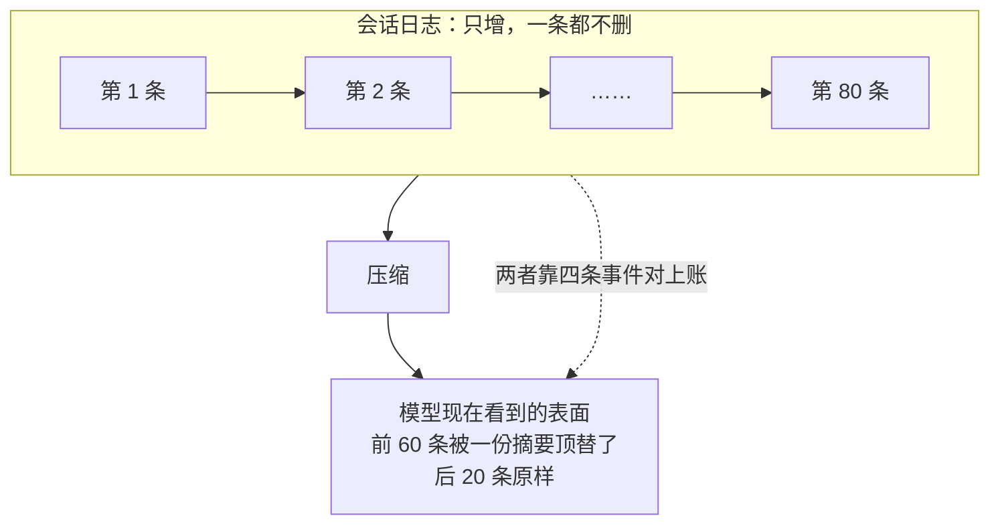

**日志里那 80 条一条都没少。** 少的只是模型这次能看见的那一份。

---

## 架构

### 四个包的分工

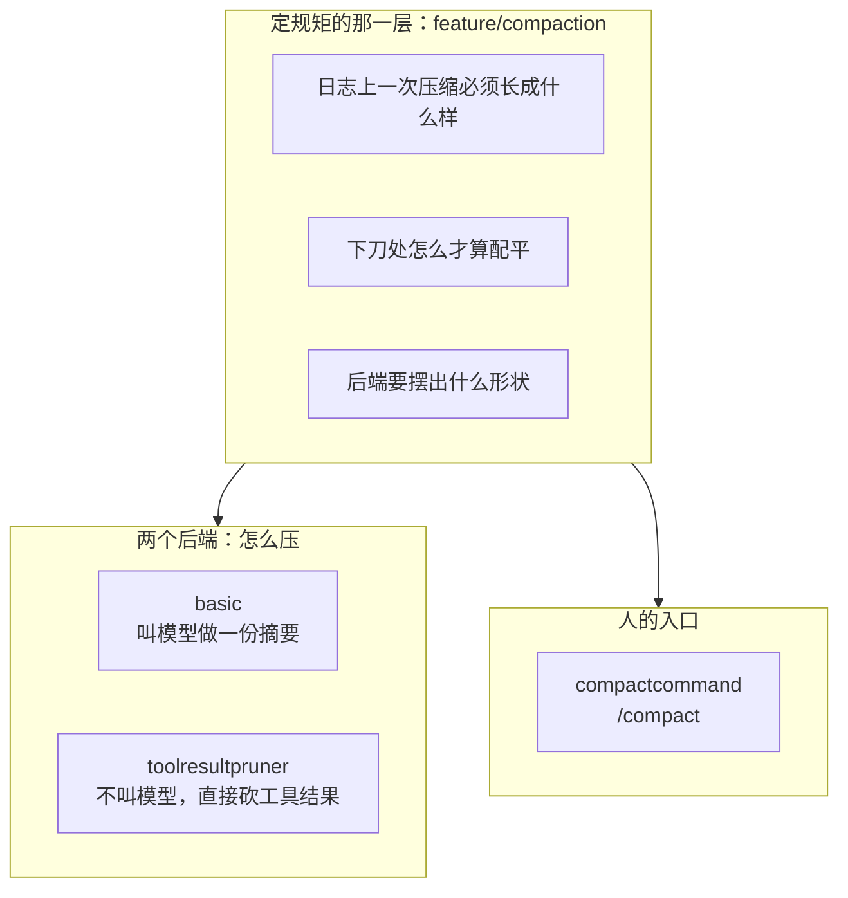

定规矩那一层**不管怎么压**：谁去调模型、按什么策略挑要遮的那一段、什么时候触发，全在后端和装配层。它只写下「不管哪个后端，写进日志的东西必须长成什么样」。

### 一次压缩在日志上的形状

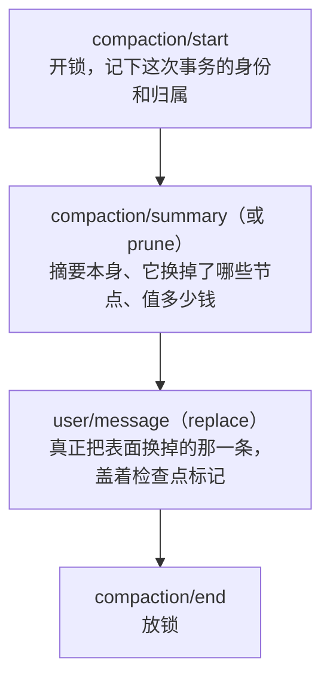

四条里**只有第三条上表面**。另外三条只进日志，记的是这次改动的锁、输入和计价。

### 三个入口，一把锁

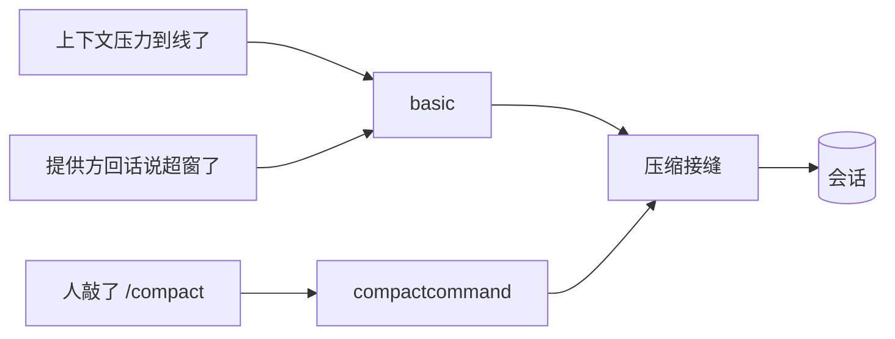

三条路共用**同一把持久锁**——那条 `compaction/start` 一直持有到 `compaction/end`，锁在日志里而不在内存里。所以自动压缩正开着的时候人敲 `/compact`，回的是「忙」；反过来也一样。

锁放在日志里而不是进程里，是因为进程锁在多副本部署下形同虚设：另一个副本看不见这把锁，会同时开第二次压缩。

---

## 三件必须说得清的事

这三条是那一层不变量守的东西。

### ① 括号必须配对

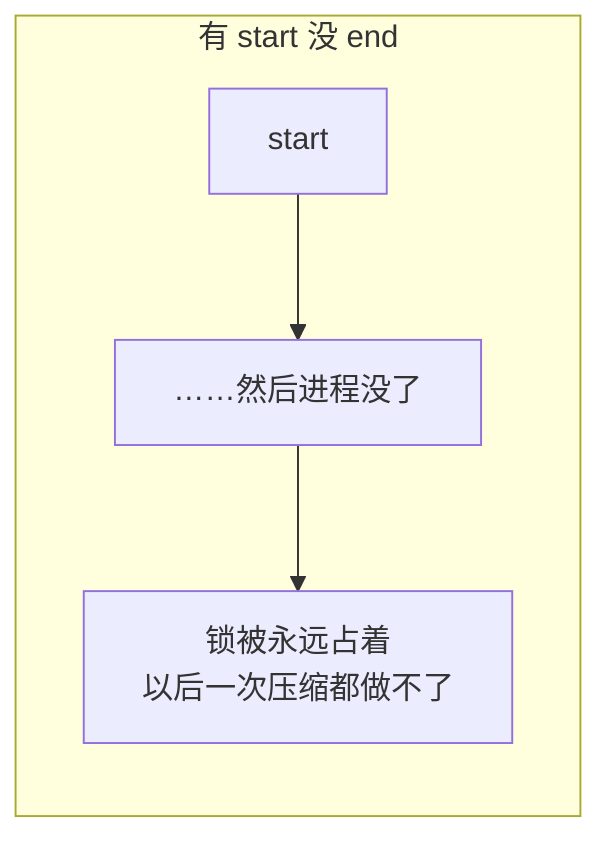

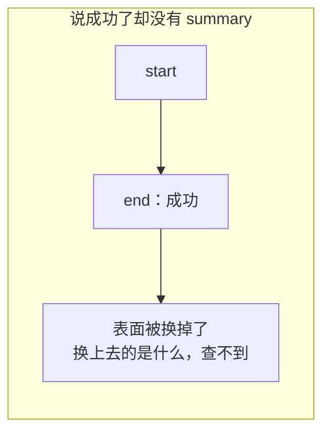

### ② 归属必须唯一

压缩期间如果开了一个新回合，那次压缩换掉的范围就横跨两个回合，而它的收尾只报得出一个归属：

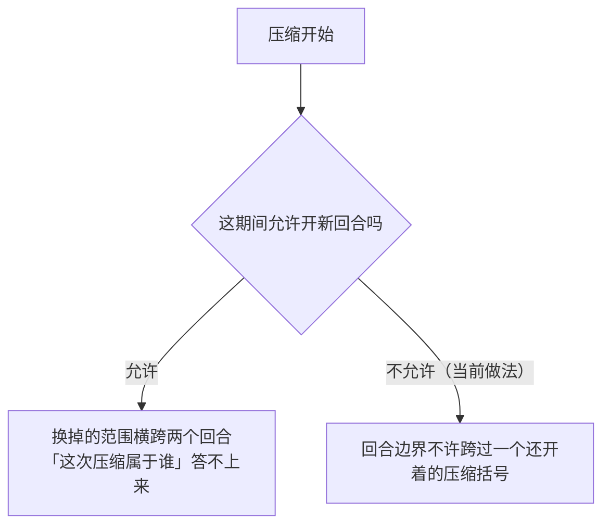

### ③ 价格必须对得上

替换事件自己不带价格，它靠**紧挨在它前面**的那条计价事件给出：

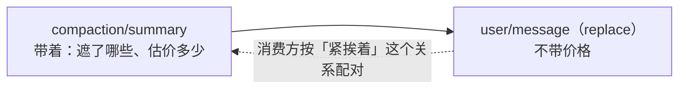

所以那几个「遮了什么」的字段必须自洽：列出来的序号，头尾要对得上声明的区间；估价不能是负数。

---

## 下刀处：不许把工具调用和它的结果劈开

表面上任意一刀都切得下去，但只有**配平**的那些刀切完之后，模型收到的历史仍然是自洽的：

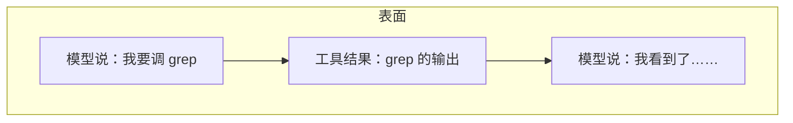

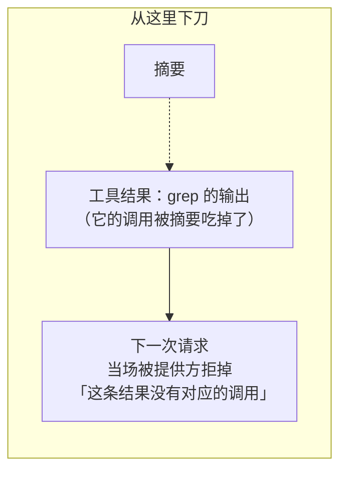

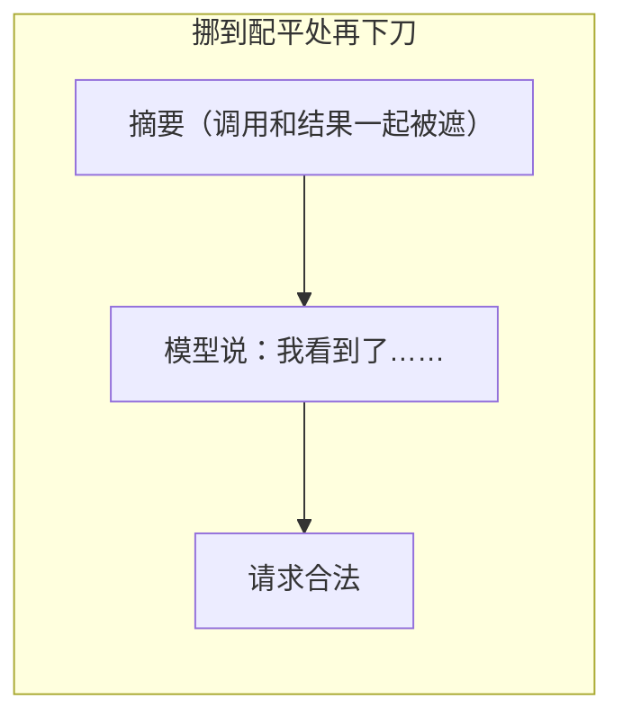

这道配平计算是**增量**的：表面每长一条就更新一次，而不是每次要压缩时从头扫一遍。

---

## 后端一：叫模型做摘要

这个后端回答五个问题。

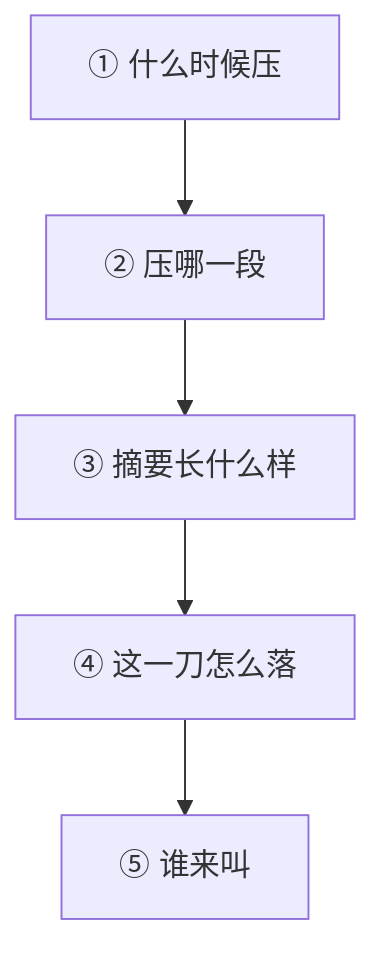

### ① 什么时候压：三步折算


**为什么要分三步**：前两步和模型窗口无关，而窗口大小是适配器那一侧才知道的。混在一起写，等于把「配置对不对」和「这个模型多大」绑死。

配错的后果是**安静的**，这是这一层最要紧的设计动机：

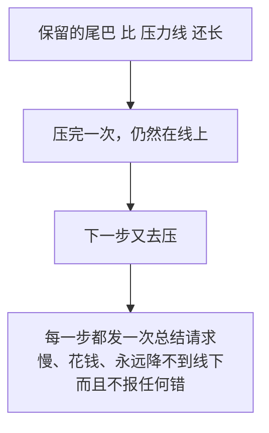

所以「验」和「用」被拆开了：**验不过就根本造不出一份可用的配置**，而不是留一个照样每步都去压一次的运行期。

### ② 压哪一段

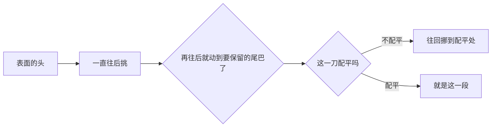

开工之前还要读一眼日志尾巴：**上一个压缩括号还开着**就不开工。

### ③ 摘要长什么样，以及为什么缓存不会作废

一次总结调用是「把对话前缀重放一遍，末尾接上那条总结指令」：

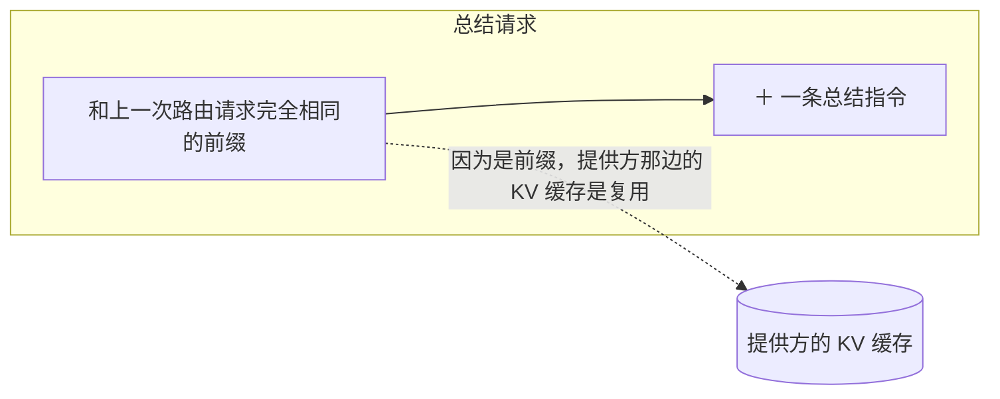

如果把消息重新排一遍或者塞点别的进去，这个前缀关系就断了，缓存作废，一次压缩会连带一次全量重算。

做出来的摘要再裹上前言和一对标签，变成落在表面上的那条检查点消息。

### ④ 这一刀怎么落：中途失败也不回滚

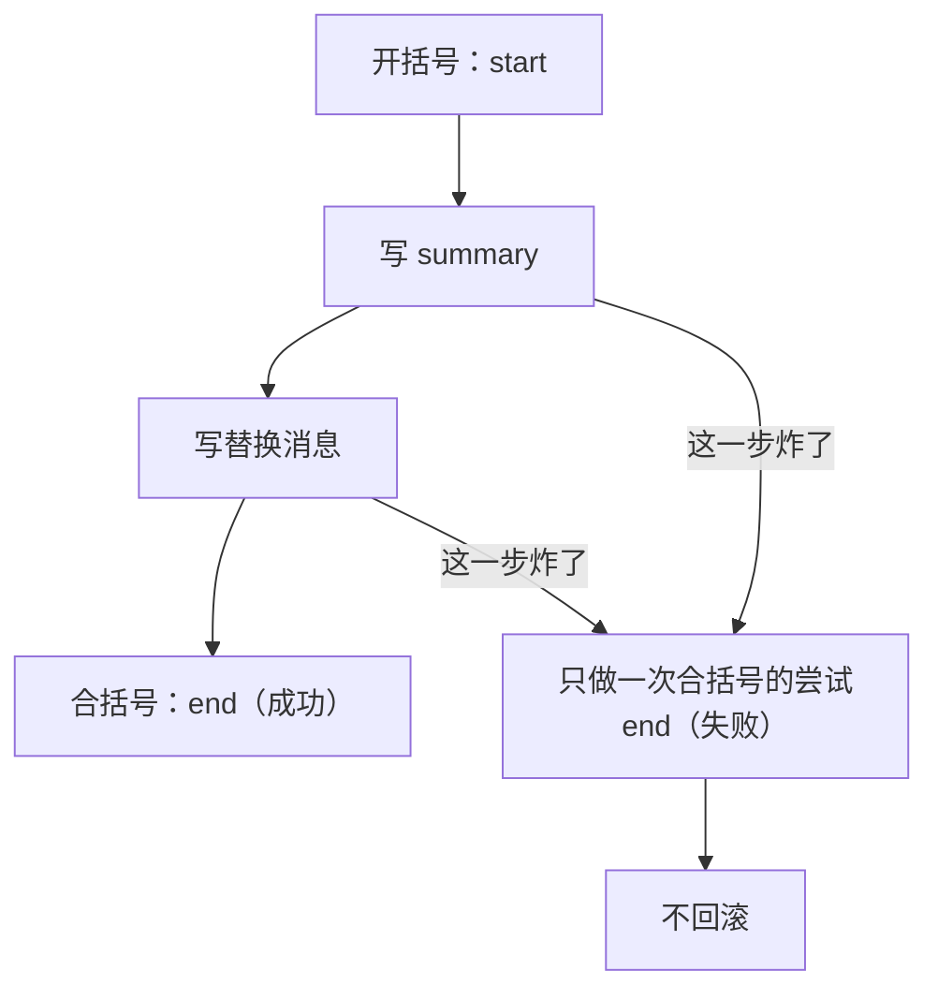

**为什么不回滚**：一次做砸了的压缩本身就是要在日志里看得见的。抹掉痕迹之后，下一个人只会看到「上下文莫名其妙变短了」而查不到原因。

### ⑤ 谁来叫

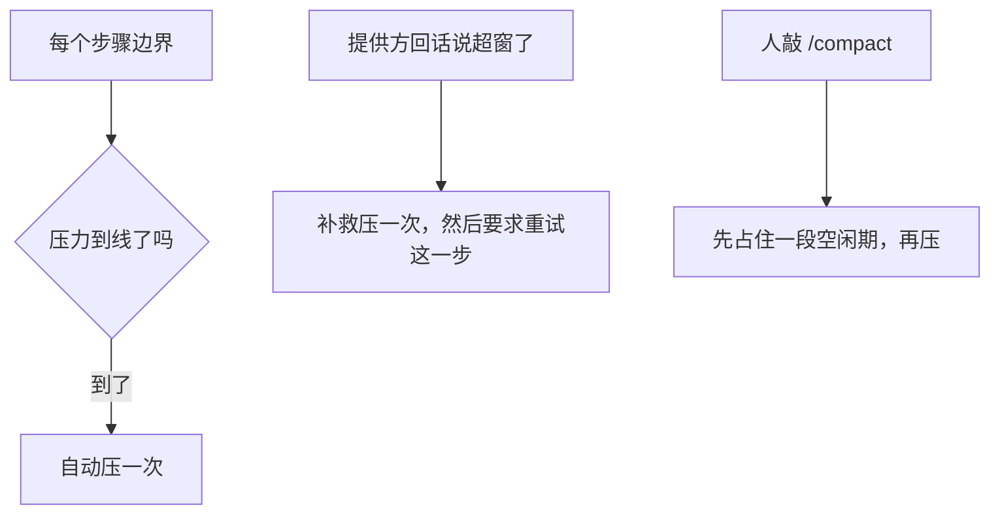

---

## 后端二：不问模型，直接砍工具结果

### 为什么要有第二个后端

上下文被撑爆，最常见的单一原因不是对话本身长，而是**一条**工具结果太大——一次搜索打回来几万行、一个文件整个读进来。


### 两个后端是互补的，不是二选一

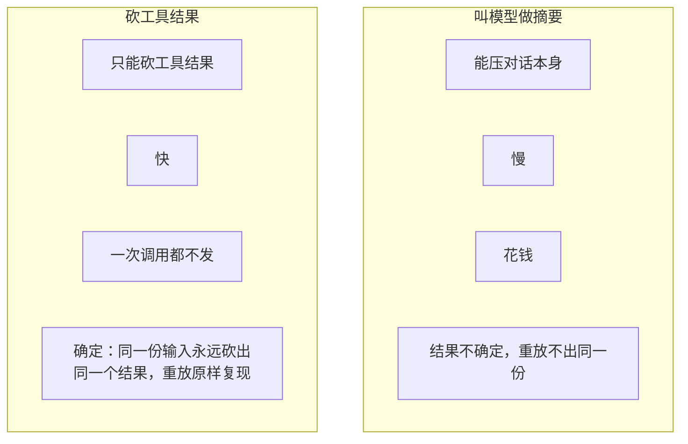

「确定」这条性质是回放能不能对上账的前提，摘要那一路给不了。

### 出错了也交出真实账目

```mermaid
flowchart LR
    A["砍到第 7 条时炸了"] --> B["前 6 条的替换是真的，已经落地"]
    B --> C["把这个数交给调用方<br/>由它决定还要不要重试"]
```

不把这个数吞掉，是因为「已经砍成了多少」直接决定下一步该干什么。

---

## 人的入口：/compact

### 它薄到什么程度

```mermaid
flowchart LR
    A["人敲的一行字"] --> B["这一层只做两件事"]
    B --> B1["这行字合不合法"]
    B --> B2["这个结局该怎么说成一句人话"]
    B --> C["压缩接缝"]
    C -.->|"挑区间、做摘要、写事件<br/>全在那一侧"| C
```

### 语法只有一条：不带参数

```mermaid
flowchart TD
    A["/compact 最近十条"] --> B{"后面跟东西了吗"}
    B -->|"跟了"| C["回一句用法提示<br/>而且一次都不去压"]
    B -->|"没跟"| D["压一次"]
```

**为什么带参数一定要拒**：人敲「最近十条」，心里想的就是那十条。照常压一段别的再回一句「成了」，比拒绝他严重得多。指定区间那条路存在，但它不是给人敲的。

### 结局分成三堆

```mermaid
flowchart TD
    A["压缩接缝的结局"] --> B{"哪一类"}
    B -->|"压成了"| C["「压掉了几条、大约省下多少 token」<br/>并指向那条摘要事件"]
    B -->|"还没有可压的历史"| D["也是成功<br/>那不是用户干错了什么"]
    B -->|"六种分好类的失败"| E["各配一句人读的话"]
    B -->|"其余一切"| F["原样抛出去"]
```

六种失败各说各的：

| 分类 | 这句话要让人知道 |
|---|---|
| 忙 | 有一次压缩正开着，或者这个 agent 不空闲——**等会儿再来** |
| 取消 | 做完之前被撤回了 |
| 变了 | 选中的那段在被换掉之前变了——**别再来了，先去看看会话现在什么样** |
| 摘要没做出来 | 对话没动，这次尝试留在日志里 |
| 收尾没干净 | 有些历史可能已经变了，重试之前先看一眼 |
| 存不下来 | 压完了，但会话没保存 |

「忙」和「变了」对人的意思**完全相反**，所以它们必须是两句不同的话。

而最后那一堆「原样抛出去」是刻意的：

```mermaid
flowchart LR
    A["一个认不得的失败分类"] --> X["抛出去"]
    B["装配没接对"] --> X
    C["后端自己炸了"] --> X
    X --> Y["这些不是「这次没压成」<br/>是这套东西装错了或者坏了"]
    Y --> Z["排成一句客气话<br/>等于把一次故障藏起来"]
```

---

## 生命周期与并发

```mermaid
flowchart TD
    A["引擎自己不拥有 agent"] --> B["通过安装函数接进维护周期"]
    B --> C["卸载时只撤监听器，不动任何会话状态"]
    D["/compact 的摘除"] --> E["① 先注销这条命令<br/>新的敲不进来了"]
    E --> F["② 再等已经进去的那几次跑完"]
```

**为什么摘除是先注销再等**：反过来先等再注销，等的过程中还能再进来一条，那个等永远等不完。

同一个会话在同一时刻只能有一个活动压缩事务，这条由日志里那把持久锁保证，不靠进程内的互斥量。

---

## 失败语义

```mermaid
flowchart TD
    A["出了岔子"] --> B{"哪一类"}
    B -->|"摘要没做出有用的东西"| C["留下一个可解释的失败结局"]
    B -->|"日志在这期间变了"| C
    B -->|"被取消"| C
    B -->|"找不到任何一处配平的下刀点"| D["拒绝压缩<br/>而不是硬切一刀"]
    C --> E["绝不写成一次成功的摘要"]
```

底线只有一条：**失败必须在日志里看得见，而且不能长得像成功。**

---

## 能力边界

```mermaid
flowchart TD
    Y["这几个包做的"] --> Y1["追加事件，改变模型看到的表面"]
    Y --> Y2["守住那三条对得上账的规矩"]
    Y --> Y3["提供两种互补的压法"]
    N["不做的"] --> N1["不删除任何原始日志<br/>不是数据库清理，也不是归档"]
    N --> N2["不保证摘要事实正确<br/>摘要模型和提示词由部署方选"]
    N --> N3["砍工具结果只砍模型看得见的那一份<br/>不篡改程序化的原始结果"]
    N --> N4["不是会话持久化实现"]
    N --> N5["/compact 不认参数，也不收图片"]
```

## 当前仓库有没有用上

结论：**实现已经写完，但当前仓库的正式运行装配没有启用它。**

这里要区分三件事：

1. `feature/compaction` 已经定义了事件、压缩接口和日志不变量。
2. `feature/compaction/basic`、`toolresultpruner` 和 `compactcommand` 已经有可运行实现和测试。
3. 当前仓库没有生产代码创建压缩引擎，也没有把自动触发器和 `/compact` 装进运行时。

源码搜索没有找到包外的生产代码调用以下入口：

- `basic.NewEngine`
- `basic.Install`
- `toolresultpruner.New`
- `compactcommand.New` 和 `Controller.Install`

因此，当前默认运行链路不会因为达到 token 压力线而自动压缩，也不会处理 `/compact`，更不会自动裁剪过大的工具结果。

有几个模块已经能够**读懂压缩结果**：

- `feature/tokenmeter` 识别压缩事件，重新计算模型当前能看到的 token。
- `feature/replay` 识别摘要事件，重建重放脚本。
- `feature/context/sessionref` 能报告一段会话是否压缩过。

这些属于消费能力，不会主动发起压缩。当前状态可以画成：

```mermaid
flowchart TD
    A["压缩事件和接口<br/>已经实现"]
    A --> B["basic 摘要引擎<br/>已经实现"]
    B --> C["自动触发安装函数<br/>已经实现"]
    C --> D["正式装配没有调用 Install"]
    D --> E["默认 Harness 运行时<br/>没有启用压缩"]
```

外部程序可以导入这些包并自行装配，所以更准确的说法是：**库具备能力，本仓库没有交出一套已经接通的成品运行时。**

### 真正启用时需要接哪些线

```mermaid
flowchart TD
    A["把 compaction.EventTypes<br/>加入会话 Vocabulary"]
    A --> B["创建 ToolResultPruner<br/>可选"]
    B --> C["创建 basic.Engine<br/>注入计量器、模型目录和 LLM Stream"]
    C --> D["调用 basic.Install<br/>监听步骤压力和模型超窗"]
    D --> E["创建 compactcommand.Controller"]
    E --> F["安装 /compact<br/>可选"]
```

缺第一步，带压缩事件的日志会被词汇检查拒绝。缺 `basic.Install`，引擎只能被业务代码手动调用。缺命令安装，用户就没有 `/compact` 入口。

## 其他 Harness 的做法

下面的结论来自各仓库源码，不来自产品文档。

### DSH

DSH 与本仓库的设计最接近，因为本仓库这一组包就是按它的结构重写的。

DSH 的基础 Bundle 默认装入：

- `compaction-basic`
- `command-compact`
- `compaction-tool-result-pruner`

所以 DSH 是**已经启用的成品能力**。它在每个 Agent 步骤之前检查压力；默认达到模型窗口的 80% 时开始压缩。模型明确返回上下文超窗后，它也会压缩并重试。压缩前先尝试裁剪大工具结果；用户还可以执行 `/compact`。

它和本仓库使用相同的追加式事务形状：`start → summary/prune → replace → end`。原始日志不删除，模型看到的表面被替换。

源码位置：

- `deepseek-harness-dsh-v0.1.2-alpha.3/packages/compaction/compaction-basic/src/index.ts`
- `deepseek-harness-dsh-v0.1.2-alpha.3/packages/bundle/base/cordis.patch.yml`

### Codex

Codex 把压缩直接放在 Session 和 Turn 的核心执行链里，不需要应用额外挂一个通用中间件。

它支持：

- token 达到模型的自动压缩上限后压缩。
- 切换到上下文窗口更小的模型之前压缩。
- 手动 Compact Task。
- Provider 支持时调用远程 `/responses/compact`；不支持时在本地发总结请求。
- 压缩请求本身超窗时，逐步丢弃最老的输入后重试。

压缩完成后，Codex 直接替换内存中的有效历史，同时追加一条 `Compacted` rollout 记录；这条记录带 `replacement_history`，恢复会话时据此重建当前历史。

这和本仓库的目标相同：保留可恢复依据，同时缩短模型输入。记录形状不同：本仓库用四条通用会话事件表达一次事务，Codex 用一条专用 `Compacted` rollout 项保存替换历史。

源码位置：

- `codex-main/codex-rs/core/src/session/turn.rs`
- `codex-main/codex-rs/core/src/tasks/compact.rs`
- `codex-main/codex-rs/core/src/compact.rs`
- `codex-main/codex-rs/core/src/session/mod.rs`

### Grok

Grok 也把压缩直接集成在 Session Actor 中，而且触发点更多：

- 模型请求之前按上下文占用百分比检查。
- Tool 结果进入历史后，发现已经超过窗口时立即检查。
- 切换到更小窗口的模型时检查。
- 用户执行 `/compact`；它允许附带压缩要求。

Grok 还实现了后台预生成第一阶段摘要、两阶段压缩、不同压缩模式，以及按失败原因暂停自动压缩。比如认证失败等登录刷新，额度失败等下一次成功响应，结构或尺寸错误则保持暂停，避免每一步重复撞同一个错误。

它会替换当前聊天历史，同时持久化 `CompactionCheckpoint`；恢复时读取检查点得到压缩后的历史。它比本仓库和 DSH 更偏成品应用，状态和故障分支也更多。

源码位置：

- `grok-build/crates/codegen/xai-grok-shell/src/session/compaction.rs`
- `grok-build/crates/codegen/xai-grok-shell/src/session/compaction_config.rs`
- `grok-build/crates/common/xai-grok-compaction/src/code_compaction/compact.rs`
- `grok-build/crates/codegen/xai-grok-pager/src/slash/commands/compact.rs`

### LangChain

LangChain 提供可选的 `SummarizationMiddleware`。应用创建 Agent 时必须主动把它加进中间件列表；LangChain 不会默认替所有 Agent 开启。

它在调用模型之前执行，可以按消息数、token 数或上下文占比触发。触发后调用摘要模型，然后用：

```text
RemoveMessage(REMOVE_ALL_MESSAGES)
+ 摘要消息
+ 需要保留的新消息
```

更新 Agent 状态。它会寻找安全切点，避免拆开 AI Tool Call 和 Tool Result。摘要调用的临时错误会重试，重试耗尽后错误继续向上抛，不会伪造摘要。

LangChain 另有可选的 `ContextEditingMiddleware`，可以在模型请求前把旧 Tool Result 换成 `[cleared]`。它改的是这一次请求使用的消息副本，与本仓库把裁剪事件写进会话日志的做法不同。

源码位置：

- `langchain-master/libs/langchain_v1/langchain/agents/middleware/summarization.py`
- `langchain-master/libs/langchain_v1/langchain/agents/middleware/context_editing.py`

### LangGraph

LangGraph 本身没有规定一套压缩策略。它提供的是实现压缩所需的底层机制：

- `pre_model_hook` 可以在模型调用前改消息。
- `RemoveMessage(REMOVE_ALL_MESSAGES)` 可以清空并替换消息状态。
- `add_messages` Reducer 负责应用删除和替换。
- 可选 Checkpointer 负责保存修改后的 Graph State。

什么时候压、调用哪个摘要模型、保留多少、失败后是否重试，都由应用或 LangChain 中间件决定。没有 Checkpointer 时，替换只存在于当前运行状态；配置了 Checkpointer 后，新的消息状态才会随 Graph Checkpoint 持久化。

源码位置：

- `langgraph-main/libs/prebuilt/langgraph/prebuilt/chat_agent_executor.py`
- `langgraph-main/libs/langgraph/langgraph/graph/message.py`
- `langgraph-main/libs/langgraph/langgraph/graph/state.py`

## 横向结论

| 项目 | 当前是否默认启用 | 自动触发 | 手动入口 | 压缩结果如何保存 |
|---|---|---|---|---|
| 本仓库 | 否，只有实现 | 安装后支持压力和超窗 | 安装后支持 `/compact` | 四条追加事件加表面替换 |
| DSH | 是 | 步骤压力、超窗恢复 | `/compact` | 四条追加事件加表面替换 |
| Codex | 是 | token 上限、模型切换等 | Compact Task | `Compacted` rollout 加替换历史 |
| Grok | 是 | 请求前、Tool 后超窗、模型切换 | `/compact`，可带要求 | 替换聊天历史并写 CompactionCheckpoint |
| LangChain | 否，应用选择中间件 | 消息数、token、窗口比例 | 没有统一内置命令 | 更新 Agent 消息状态 |
| LangGraph | 否，应用自行实现 | 应用定义 | 应用定义 | 可选 Checkpointer 保存 Graph State |

本仓库的实现完整度接近 DSH，审计能力也比直接覆盖消息状态更强。当前真正的缺口是**装配**：代码能压，但默认运行时从来没有调用它。

## 对应的 DSH 能力

下表由 [`docs/packages.md`](../packages.md) 与 [能力覆盖表](../portmap/capability-coverage.tsv) 机器 join 得到：本篇覆盖的 Go 包，承接的是上游 DSH 的哪几条能力，以及各自还缺什么。落点列由源码里的 `// 源:` 注释反查，不是手写的。

| 上游能力 | DSH 包 | 裁决 | 落在哪个 Go 包 | 这里缺什么 |
|---|---|---|---|---|
| Service Definition定义压缩做什么，判定历史过大并摘要为单个表层节点 | `compaction/compaction` | 需要 | `feature/compaction` | — |
| 基础压缩后端，使用token压力和摘要器实现压缩 | `compaction/compaction-basic` | 需要 | `feature/compaction/basic` | — |
| 不依赖模型的工具结果剪枝服务，改写超大结果为头部加尾部 | `compaction/compaction-tool-result-pruner` | 需要 | `feature/compaction/toolresultpruner` | — |
| 通过/compact命令提供面向用户的手动压缩控制 | `compaction/command-compact` | 需要 | `feature/compaction/compactcommand` | — |

## 相关源码

- `feature/compaction/engine.go`
- `feature/compaction/invariant.go`
- `feature/compaction/toolpairing.go`
- `feature/compaction/basic/`
- `feature/compaction/toolresultpruner/`
- `feature/compaction/compactcommand/`
