# 上下文压缩

对应包：`feature/compaction`、`feature/compaction/basic`、`feature/compaction/toolresultpruner`、`feature/compaction/compactcommand`

## 定位

上下文窗口是有限的，长对话迟早装不下。压缩就是**把一段旧历史换成一份摘要**。

麻烦在于这件事改的是已经写下去的东西，而会话日志是只增的——从此「模型现在看到的历史」和「日志里记着的历史」不再是同一件事：

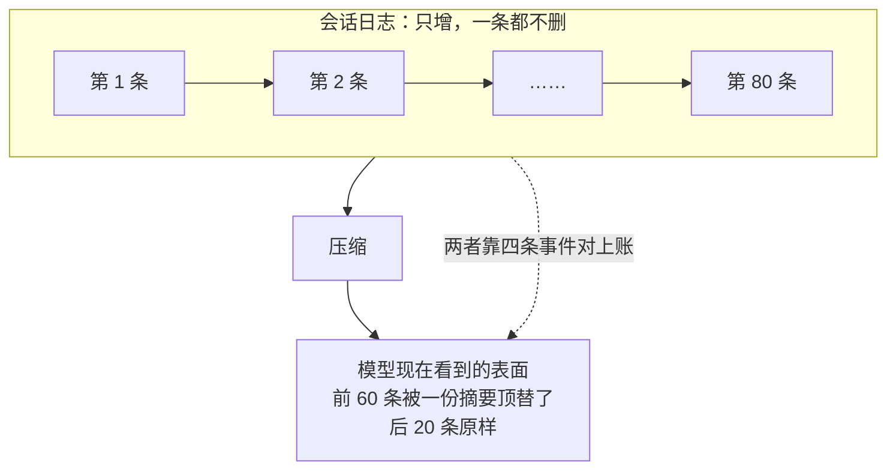

**日志里那 80 条一条都没少。** 少的只是模型这次能看见的那一份。

---

## 架构

### 四个包的分工

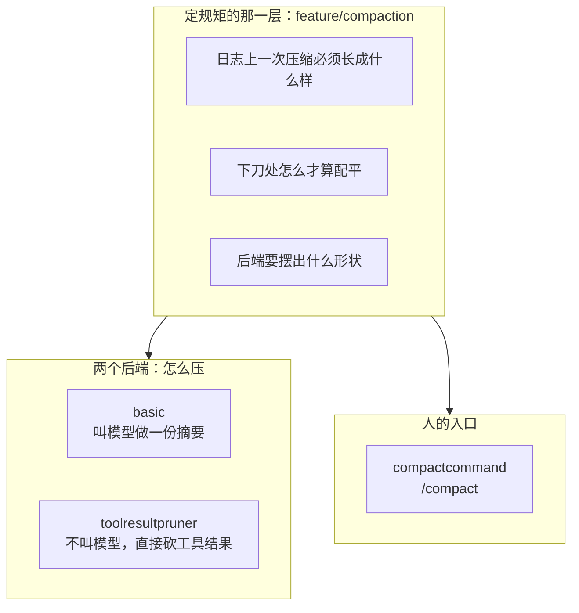

定规矩那一层**不管怎么压**：谁去调模型、按什么策略挑要遮的那一段、什么时候触发，全在后端和装配层。它只写下「不管哪个后端，写进日志的东西必须长成什么样」。

### 一次压缩在日志上的形状

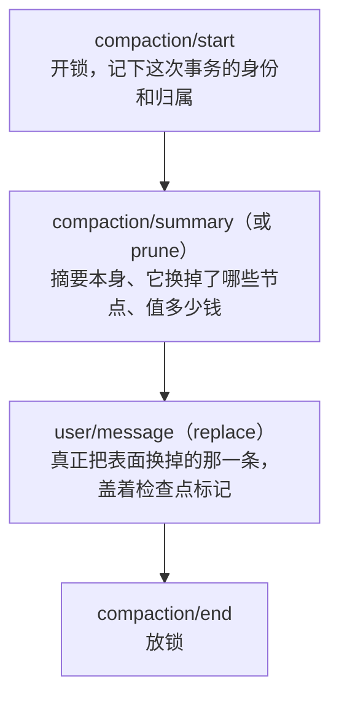

四条里**只有第三条上表面**。另外三条只进日志，记的是这次改动的锁、输入和计价。

### 三个入口，一把锁

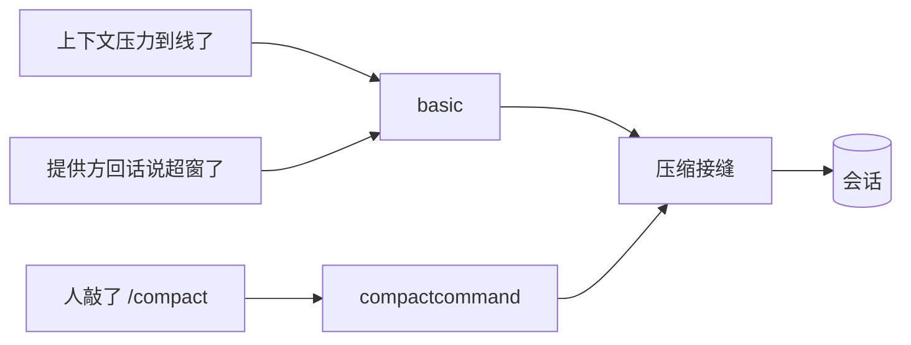

三条路共用**同一把持久锁**——那条 `compaction/start` 一直持有到 `compaction/end`，锁在日志里而不在内存里。所以自动压缩正开着的时候人敲 `/compact`，回的是「忙」；反过来也一样。

锁放在日志里而不是进程里，是因为进程锁在多副本部署下形同虚设：另一个副本看不见这把锁，会同时开第二次压缩。

---

## 三件必须说得清的事

这三条是那一层不变量守的东西。

### ① 括号必须配对

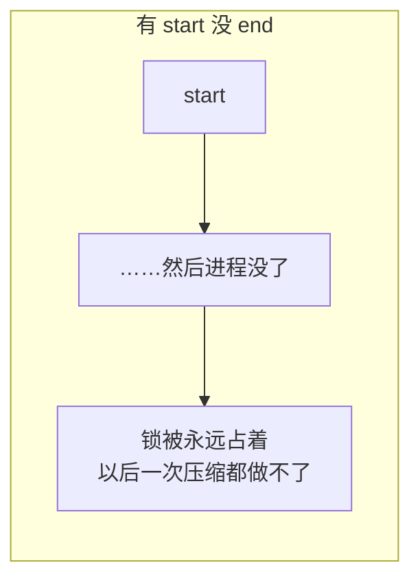

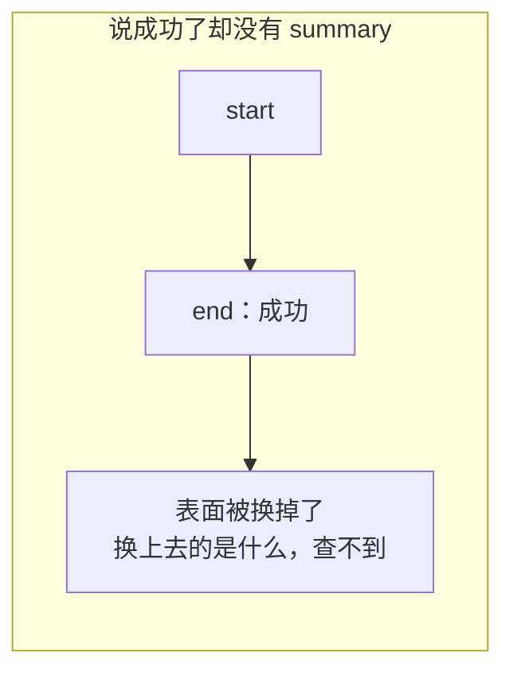

### ② 归属必须唯一

压缩期间如果开了一个新回合，那次压缩换掉的范围就横跨两个回合，而它的收尾只报得出一个归属：

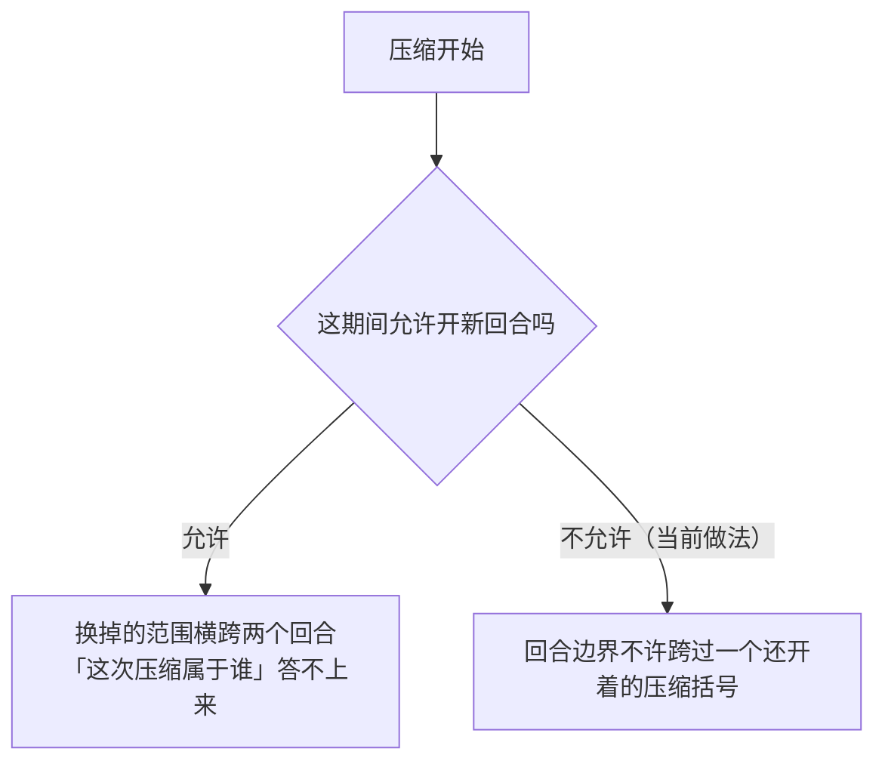

### ③ 价格必须对得上

替换事件自己不带价格，它靠**紧挨在它前面**的那条计价事件给出：


所以那几个「遮了什么」的字段必须自洽：列出来的序号，头尾要对得上声明的区间；估价不能是负数。

---

## 下刀处：不许把工具调用和它的结果劈开

表面上任意一刀都切得下去，但只有**配平**的那些刀切完之后，模型收到的历史仍然是自洽的：


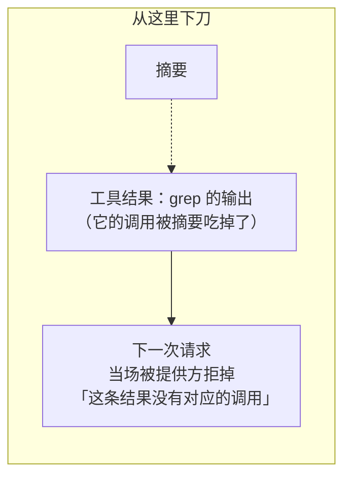

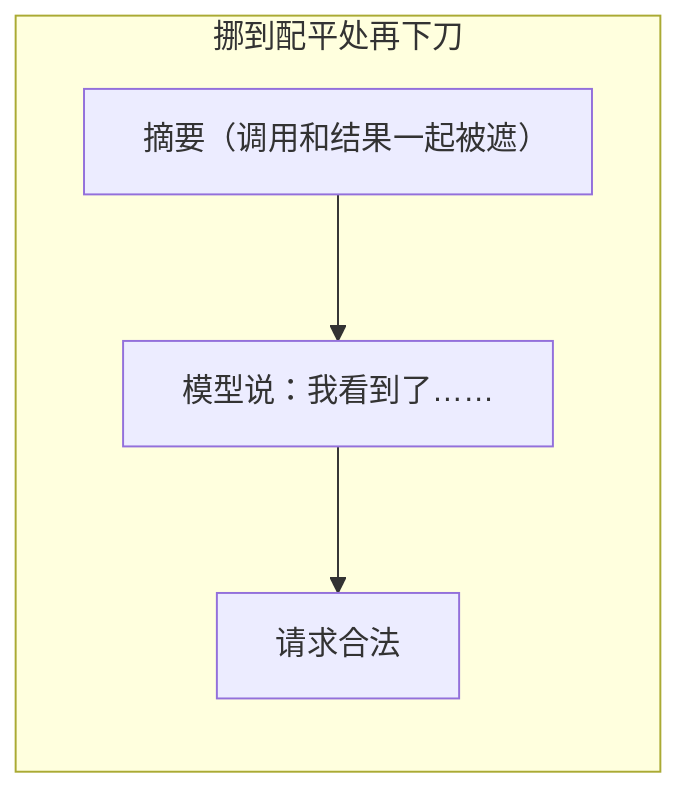

这道配平计算是**增量**的：表面每长一条就更新一次，而不是每次要压缩时从头扫一遍。

---

## 后端一：叫模型做摘要

这个后端回答五个问题。

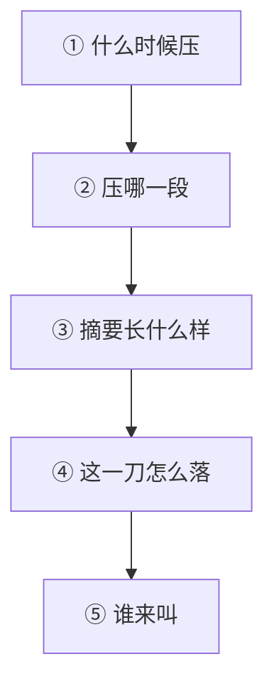

### ① 什么时候压：三步折算


**为什么要分三步**：前两步和模型窗口无关，而窗口大小是适配器那一侧才知道的。混在一起写，等于把「配置对不对」和「这个模型多大」绑死。

配错的后果是**安静的**，这是这一层最要紧的设计动机：

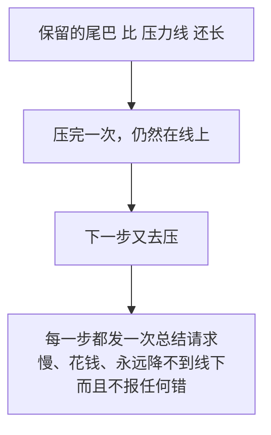

所以「验」和「用」被拆开了：**验不过就根本造不出一份可用的配置**，而不是留一个照样每步都去压一次的运行期。

### ② 压哪一段

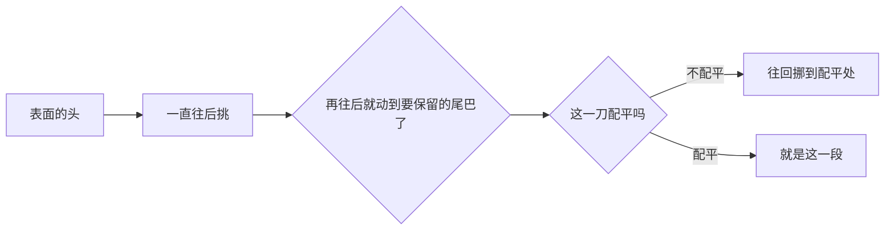

开工之前还要读一眼日志尾巴：**上一个压缩括号还开着**就不开工。

### ③ 摘要长什么样，以及为什么缓存不会作废

一次总结调用是「把对话前缀重放一遍，末尾接上那条总结指令」：

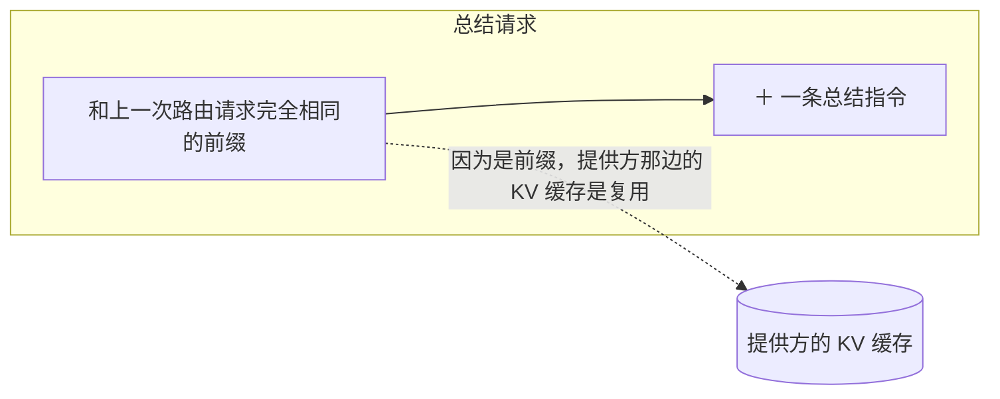

如果把消息重新排一遍或者塞点别的进去，这个前缀关系就断了，缓存作废，一次压缩会连带一次全量重算。

做出来的摘要再裹上前言和一对标签，变成落在表面上的那条检查点消息。

### ④ 这一刀怎么落：中途失败也不回滚

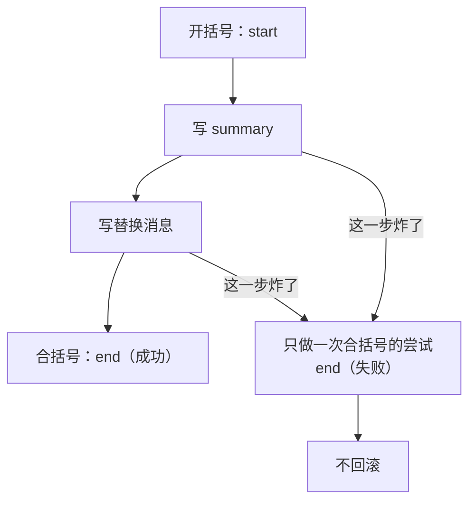

**为什么不回滚**：一次做砸了的压缩本身就是要在日志里看得见的。抹掉痕迹之后，下一个人只会看到「上下文莫名其妙变短了」而查不到原因。

### ⑤ 谁来叫

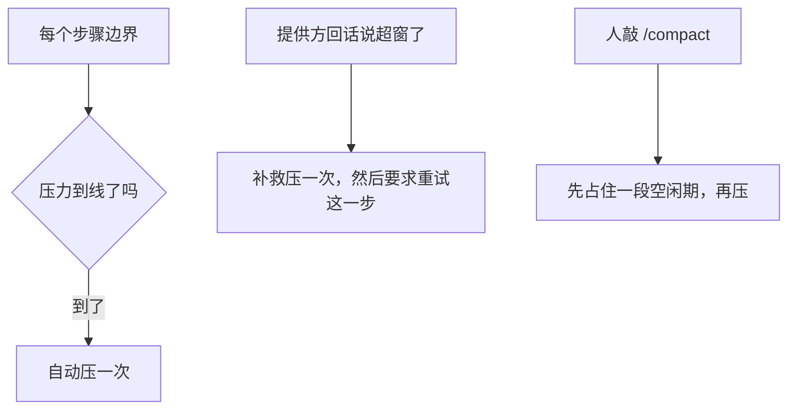

---

## 后端二：不问模型，直接砍工具结果

### 为什么要有第二个后端

上下文被撑爆，最常见的单一原因不是对话本身长，而是**一条**工具结果太大——一次搜索打回来几万行、一个文件整个读进来。


### 两个后端是互补的，不是二选一

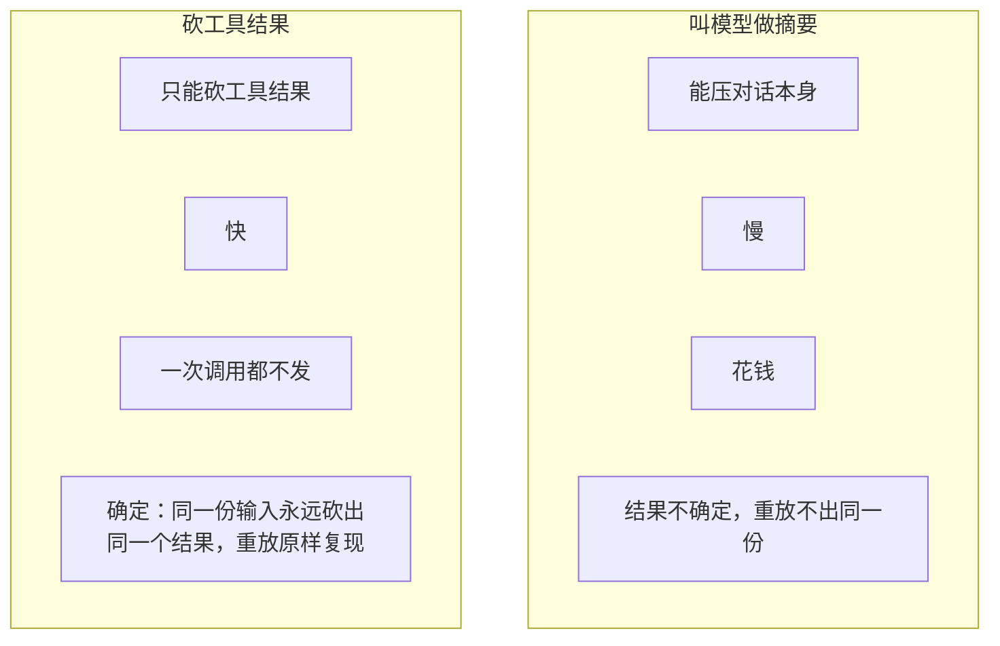

「确定」这条性质是回放能不能对上账的前提，摘要那一路给不了。

### 出错了也交出真实账目

```mermaid
flowchart LR
    A["砍到第 7 条时炸了"] --> B["前 6 条的替换是真的，已经落地"]
    B --> C["把这个数交给调用方<br/>由它决定还要不要重试"]
```

不把这个数吞掉，是因为「已经砍成了多少」直接决定下一步该干什么。

---

## 人的入口：/compact

### 它薄到什么程度

```mermaid
flowchart LR
    A["人敲的一行字"] --> B["这一层只做两件事"]
    B --> B1["这行字合不合法"]
    B --> B2["这个结局该怎么说成一句人话"]
    B --> C["压缩接缝"]
    C -.->|"挑区间、做摘要、写事件<br/>全在那一侧"| C
```

### 语法只有一条：不带参数

```mermaid
flowchart TD
    A["/compact 最近十条"] --> B{"后面跟东西了吗"}
    B -->|"跟了"| C["回一句用法提示<br/>而且一次都不去压"]
    B -->|"没跟"| D["压一次"]
```

**为什么带参数一定要拒**：人敲「最近十条」，心里想的就是那十条。照常压一段别的再回一句「成了」，比拒绝他严重得多。指定区间那条路存在，但它不是给人敲的。

### 结局分成三堆

```mermaid
flowchart TD
    A["压缩接缝的结局"] --> B{"哪一类"}
    B -->|"压成了"| C["「压掉了几条、大约省下多少 token」<br/>并指向那条摘要事件"]
    B -->|"还没有可压的历史"| D["也是成功<br/>那不是用户干错了什么"]
    B -->|"六种分好类的失败"| E["各配一句人读的话"]
    B -->|"其余一切"| F["原样抛出去"]
```

六种失败各说各的：

| 分类 | 这句话要让人知道 |
|---|---|
| 忙 | 有一次压缩正开着，或者这个 agent 不空闲——**等会儿再来** |
| 取消 | 做完之前被撤回了 |
| 变了 | 选中的那段在被换掉之前变了——**别再来了，先去看看会话现在什么样** |
| 摘要没做出来 | 对话没动，这次尝试留在日志里 |
| 收尾没干净 | 有些历史可能已经变了，重试之前先看一眼 |
| 存不下来 | 压完了，但会话没保存 |

「忙」和「变了」对人的意思**完全相反**，所以它们必须是两句不同的话。

而最后那一堆「原样抛出去」是刻意的：

```mermaid
flowchart LR
    A["一个认不得的失败分类"] --> X["抛出去"]
    B["装配没接对"] --> X
    C["后端自己炸了"] --> X
    X --> Y["这些不是「这次没压成」<br/>是这套东西装错了或者坏了"]
    Y --> Z["排成一句客气话<br/>等于把一次故障藏起来"]
```

---

## 生命周期与并发

```mermaid
flowchart TD
    A["引擎自己不拥有 agent"] --> B["通过安装函数接进维护周期"]
    B --> C["卸载时只撤监听器，不动任何会话状态"]
    D["/compact 的摘除"] --> E["① 先注销这条命令<br/>新的敲不进来了"]
    E --> F["② 再等已经进去的那几次跑完"]
```

**为什么摘除是先注销再等**：反过来先等再注销，等的过程中还能再进来一条，那个等永远等不完。

同一个会话在同一时刻只能有一个活动压缩事务，这条由日志里那把持久锁保证，不靠进程内的互斥量。

---

## 失败语义

```mermaid
flowchart TD
    A["出了岔子"] --> B{"哪一类"}
    B -->|"摘要没做出有用的东西"| C["留下一个可解释的失败结局"]
    B -->|"日志在这期间变了"| C
    B -->|"被取消"| C
    B -->|"找不到任何一处配平的下刀点"| D["拒绝压缩<br/>而不是硬切一刀"]
    C --> E["绝不写成一次成功的摘要"]
```

底线只有一条：**失败必须在日志里看得见，而且不能长得像成功。**

---

## 能力边界

```mermaid
flowchart TD
    Y["这几个包做的"] --> Y1["追加事件，改变模型看到的表面"]
    Y --> Y2["守住那三条对得上账的规矩"]
    Y --> Y3["提供两种互补的压法"]
    N["不做的"] --> N1["不删除任何原始日志<br/>不是数据库清理，也不是归档"]
    N --> N2["不保证摘要事实正确<br/>摘要模型和提示词由部署方选"]
    N --> N3["砍工具结果只砍模型看得见的那一份<br/>不篡改程序化的原始结果"]
    N --> N4["不是会话持久化实现"]
    N --> N5["/compact 不认参数，也不收图片"]
```

## 对应的 DSH 能力

下表由 [`docs/packages.md`](../packages.md) 与 [能力覆盖表](../portmap/capability-coverage.tsv) 机器 join 得到：本篇覆盖的 Go 包，承接的是上游 DSH 的哪几条能力，以及各自还缺什么。落点列由源码里的 `// 源:` 注释反查，不是手写的。

| 上游能力 | DSH 包 | 裁决 | 落在哪个 Go 包 | 这里缺什么 |
|---|---|---|---|---|
| Service Definition定义压缩做什么，判定历史过大并摘要为单个表层节点 | `compaction/compaction` | 需要 | `feature/compaction` | — |
| 基础压缩后端，使用token压力和摘要器实现压缩 | `compaction/compaction-basic` | 需要 | `feature/compaction/basic` | — |
| 不依赖模型的工具结果剪枝服务，改写超大结果为头部加尾部 | `compaction/compaction-tool-result-pruner` | 需要 | `feature/compaction/toolresultpruner` | — |
| 通过/compact命令提供面向用户的手动压缩控制 | `compaction/command-compact` | 需要 | `feature/compaction/compactcommand` | — |

## 相关源码

- `feature/compaction/engine.go`
- `feature/compaction/invariant.go`
- `feature/compaction/toolpairing.go`
- `feature/compaction/basic/`
- `feature/compaction/toolresultpruner/`
- `feature/compaction/compactcommand/`
