# core/scope：一条链，两个方向

> 本文只讲 `core/scope` 一个包。
>
> 它是 `core/` 底下唯一一个谁也不依赖的包，另外六个全都 import 它。仓库里 50 个包在非测试代码里用到它——`core/` 里没有第二个铺得这么开的，全仓库只有 `llm` 比它多两个。
>
> 用它搭出来的东西——活会话注册表、工具运行时、Skill 目录、Agent 名册——各自有各自的文档，不在本文范围内。

| 你是谁 | 从哪儿开始读 |
|---|---|
| 产品 | 「定位」整节，再看「两条关系走的是两套东西」 |
| 要**用**这个包的研发 | 「所有权边界」「分层注册表」「谁在用它」 |
| 要**改**这个包的研发 | 全篇，尤其「精确撤销」和「空层什么时候能回收」 |

---

## 定位

### 一句话

**它是「谁属于谁」这件事的唯一实现。**一个不透明的身份、一条可嵌套的父子链、一条决定事件往哪儿传的准入规则、一个把清理收在一起的所有权边界，再加上让别的注册表长成「全局一份 + 每个作用域一份」的那套叠放结构。

### 用产品的话说

一个进程里同时活着很多个 agent，每个 agent 又可能挂在某个预设下面。这就产生了一个层级，而两件事必须按这个层级来：

- **给的东西往下传。**挂在预设上的工具、限制、提示词片段，它下面每个 agent 都该看得到——不用给每个 agent 重新配一遍。
- **发生的事往上报。**某个 agent 发出的动静，它自己的监听器要收到，它所在预设的监听器也要收到。这正是「一个常驻的编排器能盯住它编排出来的每一个 agent」的实现方式。

这两件事共用**同一条**链，方向相反。链本身就是这个包的全部内容。

还有一条硬规则：**动静只往上传，绝不往下。**挂在预设上的监听器收得到底下 agent 的事；挂在 agent 上的监听器收不到预设的事。反过来的话，一个 agent 就会收到它兄弟的动静——而兄弟之间本来就该互相看不见。

除了层级，它还管一件不那么显眼但更要命的事：**收摊。**这个仓库里所有东西的关停都归到同一处——谁占了资源，谁就往自己那个作用域上挂一份清理，关停就是把作用域释放掉。agent、会话、观察者登记、通道、持久化编排器，全都往这里挂。

### 用研发的话说

四样东西：

| 东西 | 是什么 |
|---|---|
| `Key` | 一个按指针比较的不透明身份，自带一个原子的父指针 |
| `Scope` | 一个身份加上一摞后进先出的 teardown |
| `Layers[L]` | 一张「全局层 + 各作用域覆盖层」的表，外加把撤销挂到登记者身上的 `Effect` |
| `NamedEntries` / `AnonymousEntries` | 两张按插入顺序排的登记表，每次登记换回一个精确的撤销 |

包里没有 I/O、没有 goroutine 常驻、没有定时器。除了一把串写入的包级锁，全部是各自带锁的普通数据结构。

它对应上游的 `@deepseek-ai/dsh-scope`。上游那个包大半篇幅在处理 cordis——它自研的依赖注入 / 插件框架：Context 上挂标签、`ctx.plugin()` 起 fiber、`ctx.effect()` 登记副作用、`Context.filter` 分派钩子。这些一样都没照搬，全部换成了 Go 里的直接对应物。被保留下来的是**行为**：单次绑定、成环拒绝、链的走法、准入方向、以及释放的幂等与顺序。

### 术语对照

| 词 | 在代码里 | 意思 |
|---|---|---|
| 身份 | `Key` | 一个作用域是谁，按指针比较 |
| 诊断名 | `label` | 只用来报错和看日志，**不参与身份判定** |
| 父链 | `Key.parent` | 从一个身份一路走到根 |
| 特权句柄 | `ParentBinding` | 改链的唯一凭据，只交给当初绑定的那一方 |
| 准入 | `Admits` | 一个带标签的监听器该不该收到某次分派 |
| 载体 | `Carrier[T]` | 一个只管路由、不暴露内容的事件接收者 |
| 所有权边界 | `Scope` | 一摞会一起跑掉的清理 |
| 清理 | `teardown` / `Defer` | 一项登记进作用域的收尾动作 |
| 层 | `Layer` | 某个作用域在某张注册表里的全部贡献 |
| 覆盖层 | `Layers.scoped[key]` | 只有这个作用域及其子孙看得见的那一份 |
| 精确撤销 | `undo` | 只撤销**这一次**登记，且幂等 |

### 一条贯穿全包的原则

**一次撤销只许撤掉它自己那一次，绝不许碰到后来那一份。**

同名的东西先后登记两次是完全正常的：一个 agent 退场了，同一个名字又注册了一个；一层被回收了，同一个作用域又建了一层。如果撤销只认「名字」或者只认「作用域」，那么一个迟到的旧撤销就会把新的那一份删掉——而这种事故没有任何症状，只表现为「我明明注册了，怎么查不到」。

所以包里有四处看起来重复的身份比较，防的是同一类事故：

- 具名表的撤销要确认索引里那一项**仍然是**这次登记的那个链表元素。
- 单项 disposer 要确认这个元素**还在**链表上（作用域整体释放时会把元素标空）。
- 回收空层前要确认 map 里现在这一份**仍然是**手上这一份。
- 改链要拿当初那个句柄，光有键不行。

读这个包的任何一段代码，先问「这一步撤销的时候，撤的会不会已经不是当初那一份了」，多半就能推出它为什么这么写。

---

## 架构

### 全景

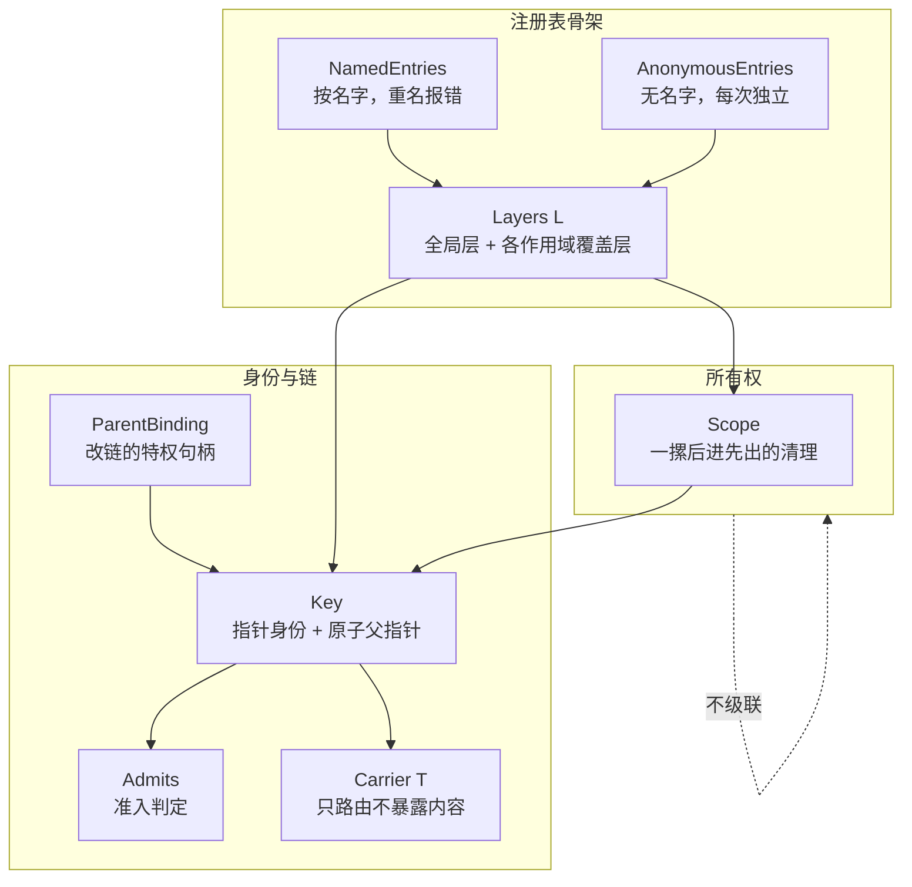

**图怎么看。**`Key` 是所有东西的中心：链挂在它上面，准入靠它判定，`Scope` 拿它当身份，`Layers` 拿它当索引。

右下角那条虚线是这个包最容易被想错的一处：**所有权不沿着链级联。**释放一个父作用域，**不会**顺带释放它的子作用域。理由见下一节。

### 两条关系走的是两套东西

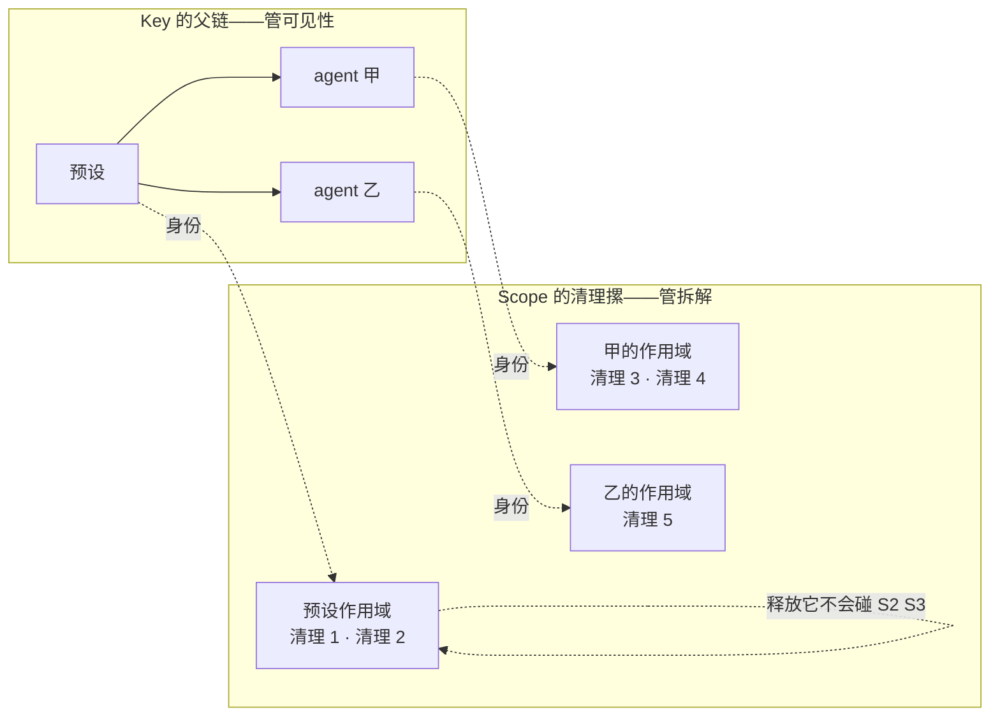

**图怎么看。**同一批身份，两套完全独立的关系：

- **父链决定谁看得见谁。**它长在 `Key` 上，是全局可读的，任何拿到键的代码都能一路走到根。
- **清理摞决定谁负责拆谁。**它长在 `Scope` 上，是私有的，只有持有那个 `Scope` 的人能往上挂、能把它拆掉。

`Scope` 这个结构体里压根没有「子作用域」这个字段，`Dispose` 也只走自己那一摞。**级联关停不在这个包里**——需要「预设倒了，它底下的 agent 也得倒」的话，那是编排层显式把子作用域的 `Dispose` 挂到父作用域上，而不是这个包替它做。

这不是漏了，是必须的。一个 agent 完全可以在生命周期中途被改挂到另一个预设下（见「改链」），如果关停跟着链走，那么「它现在归谁管」和「谁负责拆它」就会在改链的那一瞬间不一致。拆开之后，改链只影响可见性，不影响任何人手里已经攥着的拆解责任。

### 身份是指针，不是名字

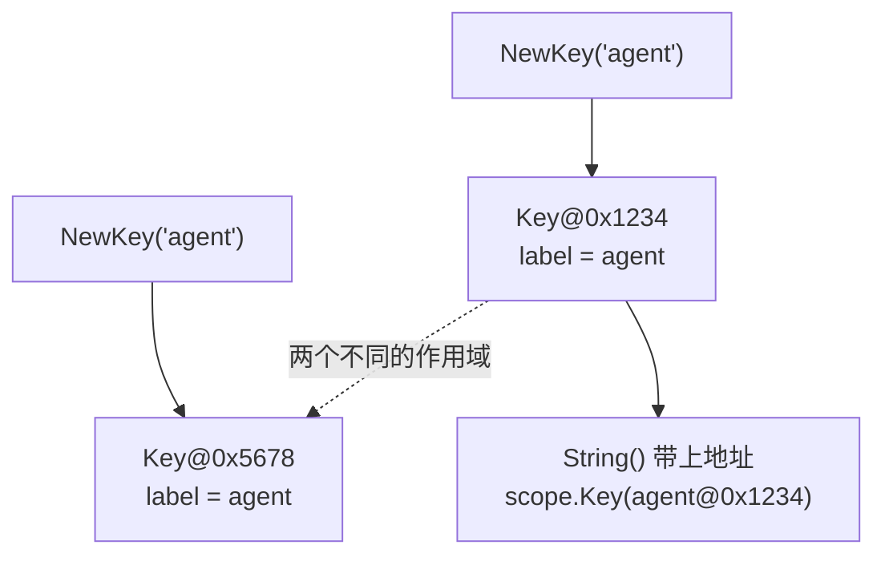

**图怎么看。**两个 `NewKey("agent")` 是两个**不同**的作用域。`label` 只用于诊断，一点都不参与身份判定。

上游那边 `ScopeKey = object`，任意对象都能当键（一个 Agent 常常拿自己当键），因为 JS 的 `===` 就是身份比较。这边做成一个具体的不透明结构体、用指针传，有两个理由：

**一是拿 `any` 当键会出事。**两个字段相同的结构体值在 Go 里**比较相等**，两个本该独立的作用域会串成一个；而切片、map、函数这类不可比较的值塞进 map 会直接 panic。指针没有这两个问题。

**二是父链能直接做成字段。**上游用两张全局 `WeakMap` 侧挂父链和载体键，是因为它没法往一个不属于自己的对象上加字段。这边键是自己的类型，就没有这个限制——于是那两张全局表一张都不需要，既没有全局表要加锁，也没有生命周期问题。

`String()` 特意把地址也打出来，就是因为 `label` 不参与身份：两个同名的键必须能在报错里区分开，否则一条「父链成环」的信息会指向两个看起来一模一样的名字。

---

## 父链

### 绑定是一次性的，改链要凭据

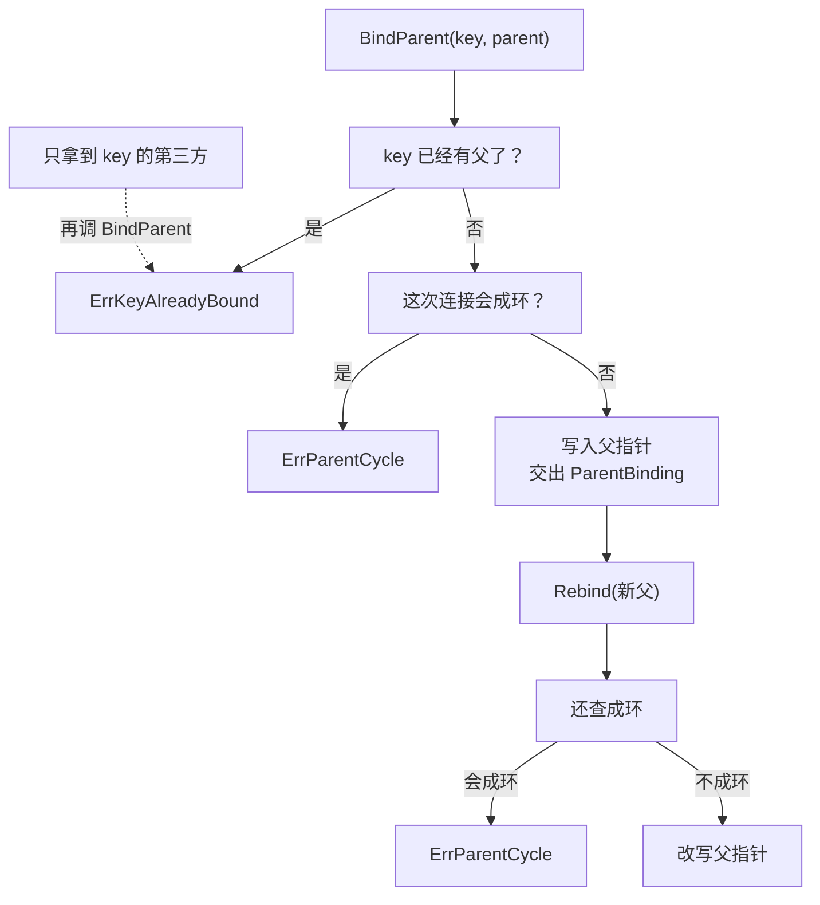

**图怎么看。**一个键只能被 `BindParent` 绑一次，之后**没有任何公开的改链路径**——除非你手里有当初那次绑定换回来的 `ParentBinding`。

**为什么要这么锁。**链决定了谁看得到谁的事件。如果任何拿到键的代码都能改链，那它就能把一个 agent 从它的预设下面挪走，或者塞到另一个预设下面去偷看事件。归属只能由当初把它接进来的那一方来改。

**改链保留成环检查。**`Rebind` 走的是和首次绑定同一段写入逻辑，父作用域不能认自己的后代当爹。

**改链的合法性这个包不查。**只有在「旧父作用域下产出的东西全都没有被留存」时改链才是干净的，但这个包看不见一个会话记了什么、一张表里存了什么。这一条由持有句柄的那一方保证。

### 用 `New` 带 `Parent` 建出来的作用域，链此后谁也改不了

`New(key, Options{Parent: p})` 会在作用域可用之前先把父绑好。绑定换回来的那个句柄**没有被留下**——它当场就被丢掉了。

后果很干脆：这条链从此是冻结的。外面再调 `BindParent` 撞 `ErrKeyAlreadyBound`，而能改它的那个句柄不存在。

需要改链的调用方（仓库里只有 Agent 名册一处）走的是另一条路：自己调 `BindParent`，自己把句柄收好，再自己造 `Scope`。

### 成环必须在写入的时候拦

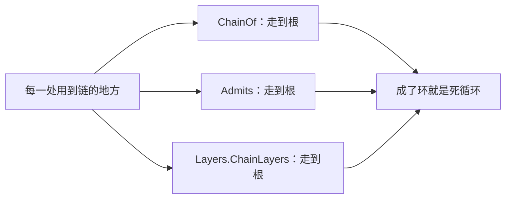

**图怎么看。**包里每一个用到链的地方都要一路走到根，没有任何一处带深度上限或者访问过标记。所以环不能靠读的一侧兜住，只能在**写入**的时候拒绝。

---

## 准入：事件只往上走

### 三条规则

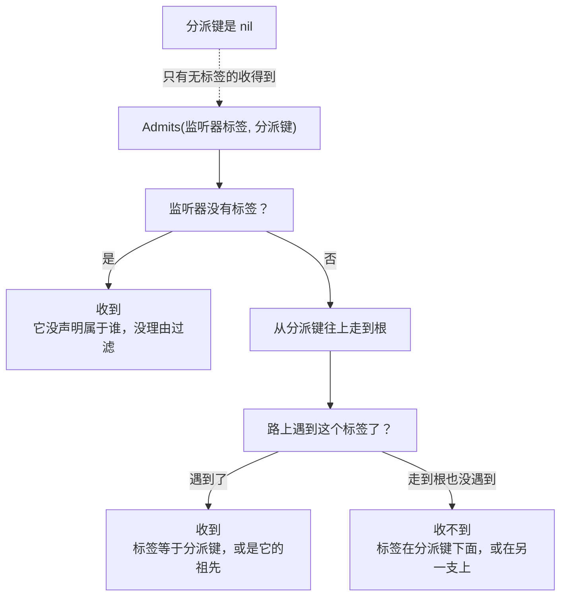

**图怎么看。**只走一个方向：从**分派键**往上找**监听器标签**。永远不从标签往下找。

于是：

| 监听器挂在 | 事件从哪儿发出 | 收得到吗 |
|---|---|---|
| 无标签 | 任何地方 | 收得到 |
| 预设 | 它底下的 agent | 收得到 |
| agent | 它自己 | 收得到 |
| agent | 它所在的预设 | **收不到** |
| agent 甲 | agent 乙（兄弟） | **收不到** |

倒数第二行是这条规则的全部意义。如果事件也往下传，那么预设上的事件会流到它底下每一个 agent；而兄弟之间虽然仍然互相看不见，但每个 agent 都能通过「预设」这个共同祖先间接收到本不该给它的东西。

### 载体：只路由，不暴露

`Carrier[T]` 是一个带着作用域键和一个可选基础过滤器的包装。它的被承载对象是**非导出字段**，拿到载体的人取不出来——事件真正的载荷走事件参数。

上游用一个品牌类型 `Scoped<T>` 加一张 `WeakMap` 做到这件事。这边非导出字段直接就是这个效果，一次类型断言就能认出载体，不需要侧挂表；`AnyCarrier` 上那个非导出的标记方法保证外面的类型冒充不了。

带基础过滤器时**过滤器先跑**，它否决了就直接不收，作用域规则不再参与——被承载对象自己那份可见性判断优先级更高，作用域只是在它之上再收窄一层。

`CarrierKeyOf` 返回两个值而不是一个键，是因为「这不是载体」和「这是个无作用域的载体」都会给出 nil 键，光看键分不出来。而分派侧的检查恰恰要靠这个区分：一个本该带载体分派的事件如果压根没带载体，那是必须报出来的错误，不是「它没有作用域」。

### 这半个包目前没有消费方

`Carrier`、`Target`、`TargetFiltered`、`IsCarrier`、`CarrierKeyOf`、`AnyCarrier`、以及独立函数 `Admits`——**这七个符号在仓库里的非测试调用方是零**，连别的包的测试里都没有。它们只被 `core/scope` 自己的测试覆盖。

真正在跑的作用域路由走的是另一条路：注册表把观察者按作用域分层存进 `Layers`，分派时用 `ChainLayers` 把全局层和父链上各层的名单叠起来。等价的过滤是由「这个观察者登记在哪一层」完成的，而不是由「这个观察者带什么标签」完成的。

两条路的效果一样，代价不一样：`Admits` 那条是每个监听器判一次，`ChainLayers` 那条是每次分派走一遍链、把名单拼出来。仓库选了后者。

---

## 所有权边界

### 一个作用域的一生

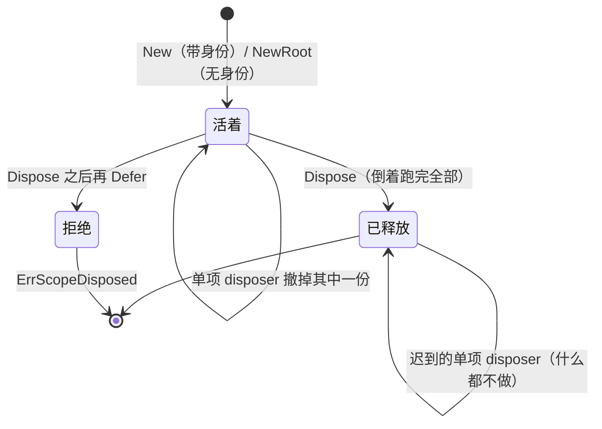

**图怎么看。**两条边值得单说。

**「Dispose 之后再 Defer」是报错，不是静默接受。**放行的话，登记进去的清理函数永远不会被跑到——也就是那份资源静默泄漏，而且没有任何症状。上游那边这由 cordis 的 fiber 状态兜着；这边没有那个东西，所以当场报错。

**「迟到的单项 disposer」什么都不做，而不是崩。**整体释放和单项撤销是两个人各自持有的能力，先后顺序没有保证，两种顺序都必须是安全的。

### 释放是后进先出的

`Dispose` **倒着**跑：后登记的先跑。因为后登记的东西可能依赖先登记的——正着跑会让一项清理在它依赖的东西已经没了之后才执行。

三条附带的承诺：

**幂等且并发共享。**重复调用、以及并发调用，都等同一次完成并拿到同一个错误。这对应上游那个 `quiesceFiber`——只不过在 Go 里 `sync.Once` 本身就保证「任何一次 `Do` 都要等到那唯一一次执行返回之后才返回」，不需要额外的等待逻辑。

**并发调用时，第一个进来的那个 ctx 说了算。**其余调用方的 ctx 不参与。

**全部跑完，错误合起来报。**前一项失败就跳过后面的话，剩下的资源就全泄漏了。

### 两条撤销路径

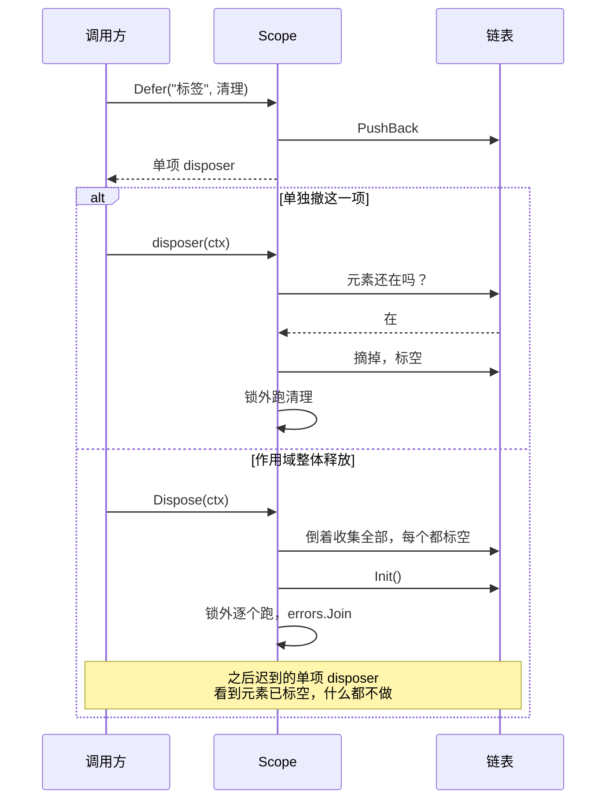

**图怎么看。**「元素还在不在链表上」这个判断是靠**把元素的值标成空**来实现的，而不是另设一个标志位。

这里有一处很具体的坑：`Dispose` 里只调 `list.Init()` 是**不够**的。`Init()` 只重置链表的头尾，元素自己仍然认为它在这个链表里；于是一个在释放之后才被调到的单项 disposer 会去 `Remove` 一个已经不在链上的元素，把链表长度改成负数。所以每个元素都要单独标空。

**为什么用链表不用切片。**一项清理在作用域整体释放之前被单独撤掉是常事——一个 agent 起来又结束、一条通道开了又关，每一次都是一挂一撤。链表删除是 O(1) 且不打乱其余顺序；切片要么留一堆墓碑，要么每删一次搬一遍后面的元素。

包里带一组关停基准，量的正是这条路径：一次性释放挂了 N 份清理的作用域、单项撤销在 N 份背景下的耗时、以及「开开关关很久之后再收摊」。第三条是用来抓泄漏的——撤掉的那些如果只是被打了标记还留在链上，它的耗时会明显高于同档的一次性释放。

### 清理跑在锁外

不管哪条路径，清理函数都是在放开作用域的锁之后才跑的。这样一个清理函数回头再碰同一个作用域（比如撤销它挂的另一项）不会自锁。

---

## 分层注册表

这是这个包被用得最多的部分：仓库里有 **10 张注册表**建在它上面。

### 三层叠加

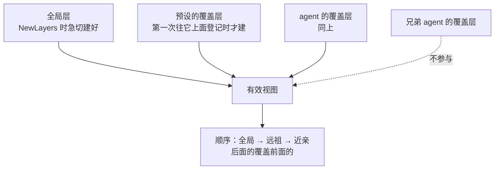

**图怎么看。**一个作用域看到的是「全局层 + 它父链上所有存在的覆盖层」，远祖在前、它自己在最后。按这个顺序依次叠加，**最近的那个作用域说了算**。

**全局层是急切构造的。**它一定会被用到（每一次合并都从它开始），而且早建早暴露构造函数自身的错误——留到第一次登记时才炸，报错点离原因就远了。

**覆盖层是懒建的**，第一次往某个作用域上登记时才出现。

### 读永远不创建覆盖层

`Peek`、`ChainLayers`、`MergeNamed` 都只看已经存在的层，一次查询把层建出来的话，「这个作用域有没有自己的贡献」这个问题就再也问不出真话了。

`Peek` 还有一条：它**故意不看父链**。问「这个作用域自己贡献了什么」（它自己的限制、它自己的守卫）的人，不该悄悄地把祖先那份也拿走。要继承请用 `ChainLayers` 或 `MergeNamed`。

### 同名覆盖只改值，不挪位置

`MergeNamed` 把各层的具名表叠成一份有效视图。同一个名字在后面的层里又出现时，**只把值换掉，位置不动**。

这一条来自 JS `Map.set` 的语义，但在这里是必须保留的行为：位置决定了工具的排列和提示片段的先后。一个作用域覆盖掉某个名字的实现，不该顺带把它挪到列表末尾去。

返回的是切片而不是 map，也是因为**顺序就是语义**——JS 的 Map 天然带插入顺序，Go 的 map 没有，所以顺序必须自己存、自己交出去。

### 一次登记的四步和三条回滚

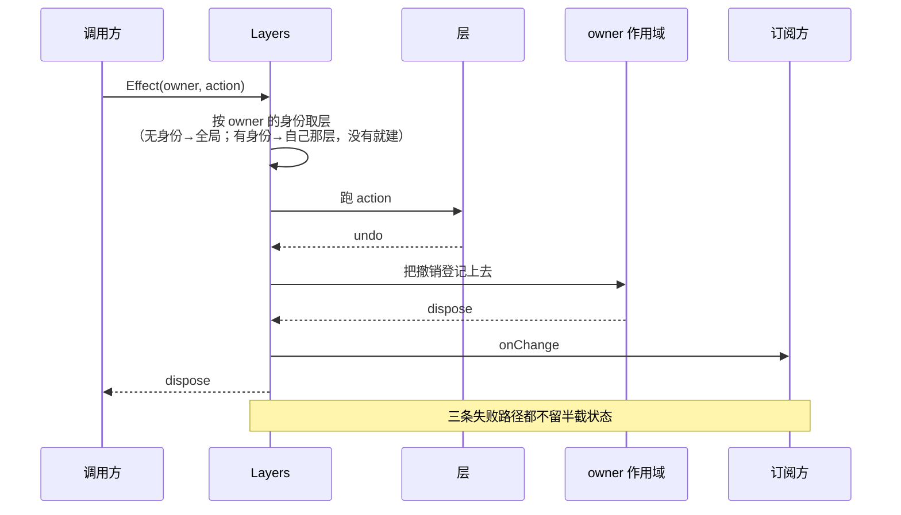

**图怎么看。**顺序是刻意的：**先把撤销攥在手里，再对外通知。**

三条回滚各不相同：

| 哪一步失败 | 怎么退 |
|---|---|
| `action` 失败 | 如果这一层是刚为它建的、而且现在还空着，删掉它 |
| 登记失败（owner 已释放） | 先跑掉 `undo`，再按上一条回收空层 |
| `onChange` 失败 | 跑一遍**完整的**撤销，然后把通知的错误报出去 |

第三条走的是**同一个** `dispose`，不是另写一段回滚。回滚和正常释放是同一条代码路径，就不会各走各的然后慢慢分岔。

**落在哪一层由 owner 的身份决定。**`NewRoot` 造的作用域没有身份，登记落在全局层；有身份的落在它自己那层。这就是「一个不带作用域的宿主装配出来的东西对所有人可见」的实现方式。

### 空层什么时候能回收

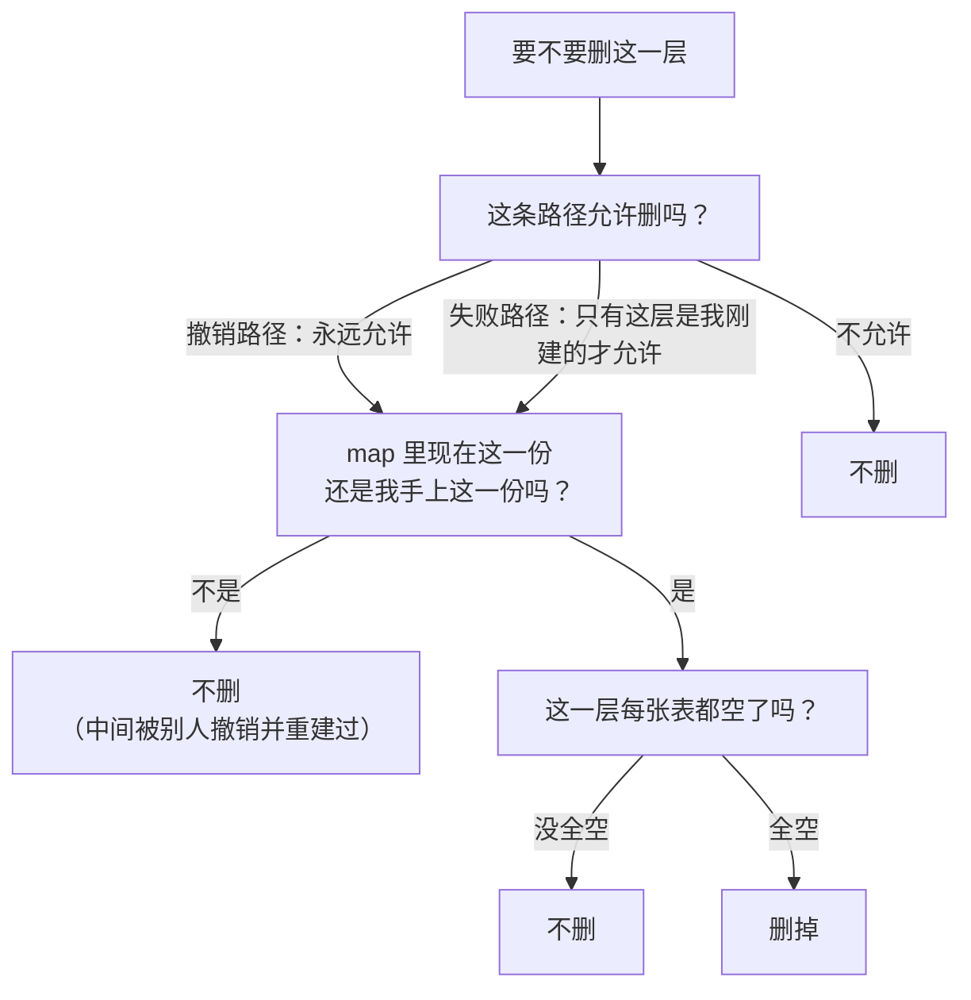

**图怎么看。**三道闸门，各有各的事故要防。

**第一道：一次失败的登记不该删掉一个本来就存在的层**，哪怕它此刻碰巧是空的——那一层的空是别人的状态，不是这次失败造成的。而撤销路径永远允许删，依据是「现在空了」，和当初是不是我建的无关。

**第二道防的是最隐蔽的一种。**从「决定要删」到「真的删」之间，这一层可能已经被别人撤销、回收、又重建了。删错了就把别人活着的登记一起带走。这也是 `Layer` 的类型约束里多要一个 `comparable` 的原因——身份比较写进约束就是编译期保证，而不是运行时拿 `any` 比较时才 panic。

**第三道是「全空」而不是「这张表空了」。**一层里可能既有具名表又有匿名表，删早了，另一张表里还活着的登记就跟着没了。

顺带一条：判断空的那个 `IsEmpty` 是在 `Layers` 的锁里调的，**实现里不许回头调用 `Layers` 的任何方法**——回调进去就是自己等自己。

---

## 两张登记表

`Layers` 只管叠放结构，每一层里装什么由使用方决定。包里给了两张现成的表，非测试代码里一共构造了 45 次。

|  | `NamedEntries` | `AnonymousEntries` |
|---|---|---|
| 有名字吗 | 有，且必须唯一 | 没有 |
| 重复登记 | 报错 | 允许，每次是独立的一份 |
| 用在哪 | 工具、Skill、命令这类「一个名字一份实现」的东西 | 观察者、中间件、拦截器这类「只有先后、本来就允许重复」的东西 |
| 非测试引用 | 11 处 | 72 处 |

两张表共用的约定：

- **顺序是插入顺序**，因为下游要按登记的先后决定谁先生效。Go 的 map 没有顺序，所以顺序必须自己存。
- **值是借来的**，表不拥有它们，也不复制它们。
- **每次登记换回一个幂等的、只撤销这一次的 undo。**

### 重名的话由调用方给

`NamedEntries` 自己压根不知道它装的是什么，所以重名的诊断信息是构造时传进来的一个函数给的。「工具 echo 已经注册过了」比「名字 echo 重复」有用得多。没传的话有一条兜底的错误。

### 精确撤销：旧的 undo 不许删掉新的那一份

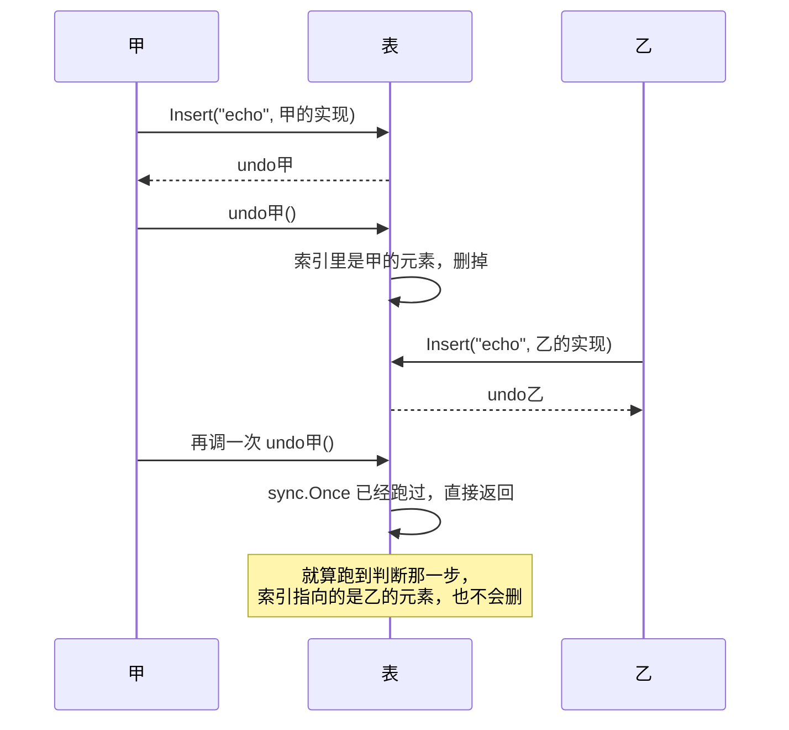

**图怎么看。**两道保险：`sync.Once` 保证幂等，元素身份比较保证「只撤这一次」。第二道才是关键——没有它的话，一个撤销过的旧 undo 会把后来同名登记的那一份删掉，而这种事故没有任何症状。

### 遍历是快照，不是实时视图

上游直接把 JS `Map` 的实时迭代器交出去，于是一个还没读完的迭代器能看见后来的插入；它为此还得在表清空时换一个新 `Map`，好把老迭代器和后来的内容隔开——那是在给「实时」这件事打补丁，不是在提供能力。

这边先在锁内拷一份顺序，再在锁外交出去。理由很直接：**遍历的过程中会调到使用方的代码，而这张表是有锁的。**在锁里回调使用方，使用方一旦回头碰这张表就是死锁。

代价是遍历期间的插入看不见，收益是不会死锁、也不会在遍历中途被并发修改弄乱。

---

## 并发

上游是单线程 JS，链和表都不需要并发保护。这边这些会被多个 goroutine 同时碰到，所以整套并发保护是这边加的。

### 父链：读走原子，写走一把全局锁

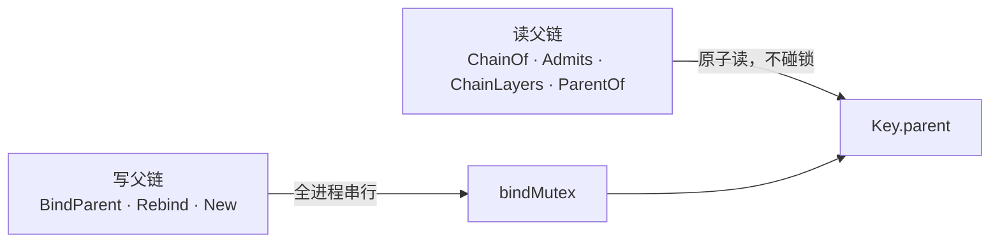

**图怎么看。**读是最热的路径——每分派一次事件就要走一遍链——所以用原子指针，没有锁竞争。

写必须串起来，因为成环检查是「先走一遍链，再写一个字段」两步。这两步之间如果有别人也在写，两次各自都通过了检查的绑定合起来就能造出一个环。

`bindMutex` 是**包级的**：整个进程里所有作用域树的链写入都在这一把锁上排队。这是可以接受的，因为改链只发生在作用域诞生或者一个 agent 换预设的时候，不在任何热路径上。

### 别的地方各自带锁

`Scope`、`Layers`、`NamedEntries`、`AnonymousEntries` 各有一把自己的锁，互相之间没有嵌套。

有两条外部代码的调用点是刻意放在锁外的：**清理函数**（`Dispose` 和单项 disposer）和**遍历的 yield**（快照之后）。这两处是使用方代码回头碰同一个对象最可能的地方。

`Layer.IsEmpty` 是唯一一处在锁里调用使用方代码的地方，所以它的约束写在了接口文档上：实现里不许回头调 `Layers`。

---

## 失败语义

| 错误 | 什么时候 | 调用方该做什么 |
|---|---|---|
| `ErrKeyAlreadyBound` | 绑一个已经有父的键 | 你不是当初接它进来的那一方；找那一方去改 |
| `ErrParentCycle` | 这次连接会让链成环 | 检查层级，父不能是自己的后代 |
| `ErrScopeDisposed` | 往已释放的作用域上 `Defer` | 这份资源已经晚了；查是不是拆解顺序反了 |
| `DuplicateNameError` | 具名表重名，且构造时没给诊断函数 | 换名字；顺便考虑给构造函数补一个说得清的诊断 |
| 四条 nil 检查 | 必填的函数漏了 | 补上参数 |

那四条 nil 检查里，最值得说的是**「`action` 成功了却没返回撤销函数」**。前三条漏了会在解引用时 panic，一眼就能看见；这一条不查的话没有任何症状——这次登记**永远撤不掉**，作用域释放时它还留在表里。

`Dispose` 返回的是 `errors.Join` 出来的合并错误，不是第一个失败。所有清理都会被跑到。

---

## 能力边界

这个包负责：

- 提供一个按指针比较、不透明、可诊断的作用域身份。
- 维护一条单次绑定、拒绝成环、改动需要凭据的父子链。
- 定义「事件只往上走」这条准入方向，并提供一个只路由不暴露内容的载体。
- 提供一个所有权边界：后进先出、幂等、并发共享、错误合并的释放，加上精确到单项的撤销。
- 提供「全局层 + 各作用域覆盖层」这套叠放结构，以及把改动和它的撤销一起挂到登记者身上的登记原语。
- 提供两张按插入顺序排、撤销精确到单次的登记表。

这个包不负责：

- **不做级联关停。**父链管可见性，清理摞管拆解，两者不联动；要「父倒了子也倒」，编排层自己把子的 `Dispose` 挂到父上。
- **不定义注册表里装什么。**层的内容完全由使用方给的类型决定，包里对工具、观察者、提示片段一无所知。
- **不做鉴权。**准入规则管的是「谁看得到」，不是「谁有权访问」。
- **不查改链的合法性。**它看不见旧父作用域下产出的东西有没有被留存，这一条由持有句柄的一方保证。
- **不做 I/O，不起 goroutine，不计时。**没有超时、没有 TTL、没有后台回收；层的回收是登记撤销时顺带发生的，不是定时扫的。
- **不跨进程。**全是内存里的指针关系。
- **不保证遍历看得见并发插入。**遍历是快照语义，这是拿实时性换的不死锁。

---

## 谁在用它

50 个包在非测试代码里引用它。用法高度集中：

| 用的是哪一面 | 谁在用 | 规模 |
|---|---|---|
| **所有权边界**（`Scope` / `NewRoot` / `Defer`） | 几乎所有包 | `scope.Scope` 199 处非测试引用；`NewRoot` 是最常见的构造 |
| **分层注册表**（`Layers` / `Effect`） | 10 张注册表：活会话、Agent 名册、工具运行时、系统提示、Skill、命令、审批、后台作业、目标、子 Agent 生命周期 | `EffectOptions` 41 处 |
| **两张登记表** | 同上，作为层的内容 | 匿名表 72 处，具名表 11 处 |
| **改链** | 只有 Agent 名册一处：一个 agent 认进预设、或者改认到另一个预设 | `BindParent` 3 处，`ParentBinding` 4 处 |
| **走链** | Skill 目录：拿父链参与缓存键 | `ChainOf` 1 处 |
| **读父** | Agent 名册：从 agent 的父反查它认了哪份预设 | `ParentOf` 1 处 |
| **载体与 `Admits`** | **没有** | 非测试调用方为零 |

三处值得记的事实：

**最常见的用法是「无身份的所有权边界」。**`NewRoot` 比 `New` 用得多得多。也就是说大多数调用方要的只是「一摞会一起跑掉的清理」，并不需要参与路由——而这两件事在同一个类型上，不需要为此拆出两个概念。

**分层注册表是这个包真正的产品。**十张注册表长得一模一样：一个 `Layers`，层里放一两张登记表，`OnXxx` 方法内部就是一次 `Effect`。这套结构写一次，十个地方省下十遍「怎么按作用域叠加、怎么保证撤销精确、怎么回收空层」。

**载体那一半目前是死的。**能力是完整的、测过的，但仓库选了用分层注册表来做等价的过滤。

---

## 相关源码

| 路径 | 内容 |
|---|---|
| `core/scope/scope.go` | 包的意图与不照抄的部分、身份、父链、准入、载体、所有权边界 |
| `core/scope/layers.go` | 全局层与覆盖层的叠放、登记原语与三条回滚、空层回收 |
| `core/scope/entries.go` | 两张按插入顺序排的登记表、精确撤销、快照遍历 |
| `core/scope/bench_test.go` | 关停路径的压力基线：一次性释放、单项进出、开关很久之后再收摊 |

---

## 深入阅读

[Agent](agent.md) · [活会话](core-session.md) · [Tools](tools.md) · [Agent 预设与 Persona](presets.md)
