# core/session：活着的会话

> 本文只讲 `core/session` 一个包。
>
> 会话的**词汇**——事件有哪些类型、负载长什么样、表面怎么折——在 `session` 包，见 [Session](session.md)。
> 落地归 `session/persistence`，读侧归 [Session 查询](sessionquery.md)。这三样都不在本文范围内。

| 你是谁 | 从哪儿开始读 |
|---|---|
| 产品 | 「定位」整节，再看「一个会话的一生」 |
| 要**用**这个包的研发 | 「为什么创建拆成三步」「四组观察者」「并发」 |
| 要**改**这个包的研发 | 全篇，尤其「seq 不是数组下标」和「两扇窗口」 |

---

## 定位

### 一句话

**它是活会话的持有者。**在内存里攥着一个会话只增不改的事件日志，负责往上追加、把每次追加同步广播出去、并增量折出请求头 / 路由元数据 / 模型消息历史；再用一张表管住这些会话的登记、公布、摘除、刷盘和分叉。

### 用产品的话说

一次对话正在进行的时候，"这次对话现在是什么样"这件事总得有个东西攥着。这个包就是那个东西。

它管的是**此刻**：谁在跑、跑到哪儿了、模型现在能看见哪些话。它不管这些东西怎么存下来（那是存储的事），也不管别人怎么回头查它们（那是查询的事）。它只做一件事——把正在发生的对话，在内存里如实地攥住，并且在每次有新东西发生的时候，让所有关心的人**当场**知道。

三件产品能感知到的能力从这里来：

- **对话能接着上次跑。**把存下来的日志交回来，它能原样还原成一个能继续往下写的会话。
- **对话能从中间岔开。**选一个历史位置，从那儿切出一个新会话，原来那个不受影响——这是子 agent 和"另开一支试试"的基础。
- **没落盘的东西丢不了。**每追加一条它就喊一声，落盘的插件听着这一声干活；要确保落干净的时候，还有一个"等到落完为止"的检查点。

### 用研发的话说

一个 `Session` 是一份只增不改的事件切片，外加挂在它上面的几份增量折叠（表面、请求头、路由元数据、派生消息）。一个 `Store` 是一张 `id → 会话` 的内存表，外加四组按作用域路由的观察者。

包里没有 I/O，没有 goroutine 常驻，没有定时器。它同步、当场、在调用方的 goroutine 上把事情做完。唯一的例外是刷盘——那里会为并行跑观察者起一批 goroutine，跑完就收。

它是**上游那个 session 包被劈开之后活着的那一半**。上游把词汇和活对象放在一起，本仓库拆成两个包，依赖单向：活的依赖词汇，词汇不认识活的。两个包的 Go 包名都叫 `session`，所以这边在源码里把词汇那一半 import 成 `sessionlog`。

### 术语对照

| 词 | 在代码里 | 意思 |
|---|---|---|
| 会话 | `Session` | 一份只增不改的事件日志，加挂在它上面的几份折叠 |
| 游离的 / 活的 | `entry == nil` / `!= nil` | 造出来了但没进表 / 已经进了某张表 |
| 登记 | `entry` | 一个会话在某张表里那份可变状态 |
| 公布 | `Announce` | 向创建观察者宣告"这儿有个新会话"，**可被否决** |
| 摘除 | `detach` | 把登记从表里拿掉，并补发配对的通知 |
| 载体作用域 | `carrierKey` | 这个会话登记在谁名下，决定谁能观察到它 |
| 表面 | `surface` | 模型此刻看得见的那串事件 |
| 构造 seed | `Options.Seed` | 造这个会话时喂进去的历史事件 |
| 起点 | `baseSeq` | 这份日志现存最早一条事件的序号 |
| 血统边界 | `SeedLength` | 当初从父会话继承了多长的前缀，**耐久** |
| 发布窗口 | `publishing` | 一次追加已提交、观察者还在跑的那段时间 |
| 刷盘 | `Flush` | 要等的耐久检查点 |

### 一条贯穿全包的原则

**一件事一旦被别人看见，就不能当它没发生过。**

这一条在四个不同的地方各出现一次，形状不一样但是同一件事：

- 事件进了日志，这次追加**就算提交了**。之后观察者怎么失败，都不改返回值、不回滚日志、也不妨碍后面的观察者看见这条事件。
- 创建公布**一旦开始**（哪怕跑到一半被否决），那条配对的"它退场了"就必须补发——因为已经有观察者看见过这个会话了。所以"公布过"这个标记是在派发**之前**就立起来的，不是成功之后。
- 窗口开着的时候提出的摘除**不能撤销，只能延后**。在同步派发中途把登记和钩子抽掉，会让还没跑完的观察者看到一个半拆的世界。
- 一份坏 seed 在**造会话的那一刻**就被拒。放它进来的话，它会变成一份"看起来能跑、但没有任何后端存得下"的活日志，而这种东西不会有别的地方报警。

读这个包的任何一段代码，先问"这一步之后，有没有人已经看见了什么"，多半就能推出它为什么这么写。

---

## 架构

### 全景

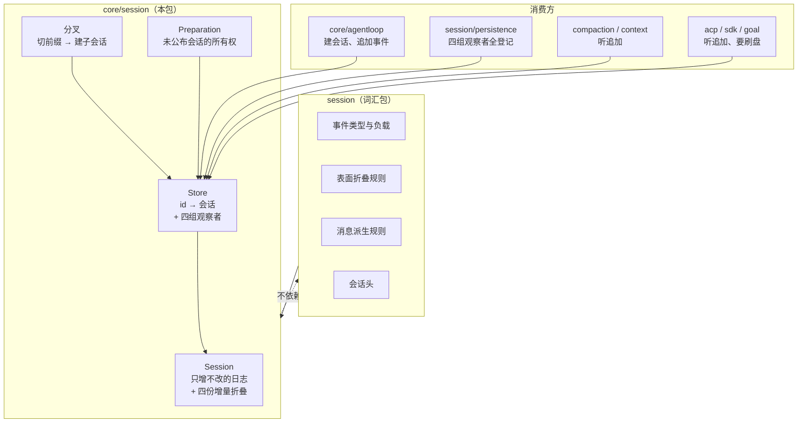

**图怎么看。**箭头是依赖方向。本包**向下**依赖词汇包——事件长什么样、表面怎么折、消息怎么派生，一条规则都不在这儿定，全是调词汇包的。词汇包**不知道**本包存在，这是刻意的：持久化、查询、统计、投影这些包只要词汇，谁也不该为了读一条事件而把一张内存注册表和它整套作用域依赖拖进来。

消费方一律通过 `Store` 进来，没有绕过它直接摸 `Session` 的路——因为一个活着的会话只能从这张表里拿到。

### 三样东西的分工

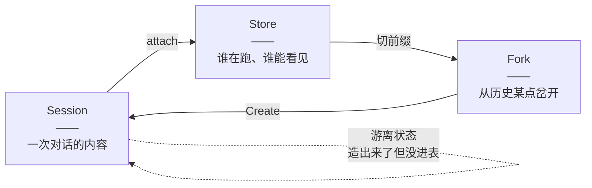

**图怎么看。**三样东西的边界很干净：

- **`Session` 管内容。**它不知道自己在不在某张表里（虽然它内部攥着一个指针），也不知道谁在观察它。把它单独造出来（游离态）照样能追加、能折叠——只是没人听得见。
- **`Store` 管身份和可见性。**它不碰日志内容，只管"这个 id 归谁"、"谁能观察到它"、"什么时候该喊一声"。
- **分叉是两者的组合**，不是第三种能力：从一个活会话切出一段前缀，拿它当 seed 走一遍普通的创建。

游离态是真实存在的一个状态，不是过渡态——`Prepare` 造出来的会话在 `Enter` 之前就是游离的，而这段时间里调用方可以对它做任意事情。

### 一个会话的一生

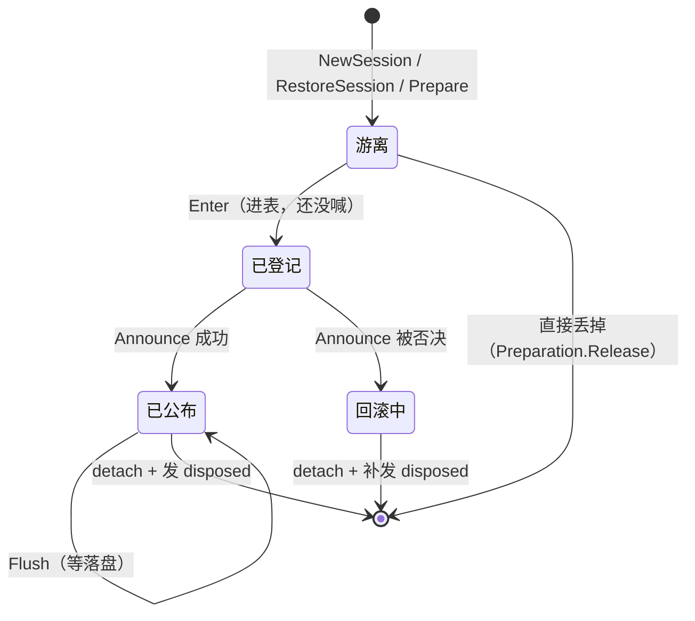

**图怎么看。**注意两条容易被忽略的边：

**「已登记 → 回滚中」**：公布被否决时，这个会话已经进过表、而且已经有一部分观察者看见过它了。所以它不是"当作没发生"，而是走一遍完整的退场——摘除加上配对的通知。

**「游离 → 直接丢掉」**：一个准备好但最终没被公布的会话，不需要经过表。`Preparation` 这个类型存在的全部意义就是让这条路和"公布成功"那条路调**同一个**释放函数，于是调用方只需要一句 `defer`，不必自己分情况。

### 为什么创建拆成三步

对外有一个 `Create` 一步到位，但它内部就是 `Prepare` → `Enter` → `Announce` 三步的封装，而这三步都是公开的。

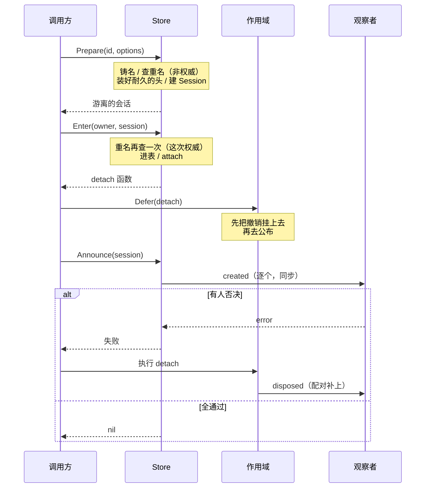

**图怎么看。**三个判断藏在这张图里：

**1. `Enter` 为什么不顺手把公布也做了。**因为要留出中间那一格，让调用方先把撤销挂到自己的作用域上。否则一个否决掉创建的观察者，会留下一份没人持有的登记加上它整套发布钩子——那个会话从此谁也摘不掉。

**2. 重名为什么查两次，而且第二次才算数。**`Prepare` 和 `Enter` 都是公开的跨包原语，两者之间调用方可以插进任意工作，包括另一次创建。一个过期的、准备好的会话绝不能盖掉一份已经活着的同名登记——它那个 `detach` 之后会把**真正那一个**删掉。第一次查只是为了让"这个名字已经有人了"在**造会话之前**就报出来，省掉一次白造。

**3. 什么时候不能用 `Create`。**当这个会话必须和它的驱动循环**按次序**一起拆的时候。作用域上的撤销是后进先出的一条链，把会话和 agent 折进**同一次**登记才有这个次序保证；两次独立登记之间没有。抢着拆的后果很具体：循环最后那几条收尾事件会在发布钩子被摘掉之后才提交，那几条就丢了。

仓库里 `core/agentloop` 走的正是三步那条路，不是 `Create`。

### 一次追加的全过程

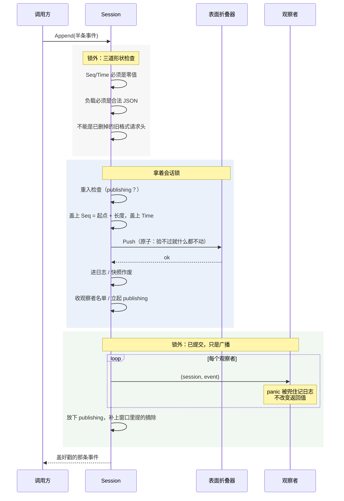

**图怎么看。**三段颜色就是三个阶段，边界是**锁**和**提交点**。

**Seq 和 Time 由会话自己盖，调用方填了就报错。**这里没有"默默盖掉"这个选项——调用方以为自己指定了位置、日志里却是另一个数，两边都不报警，那是最糟的一种处理。

**表面折叠是追加路径上唯一会失败的语义检查，而且它是原子的。**验不过时表面一动不动，这条事件也不会留下。所以代码里**不是**"先验一次再推一次"——那样只会多出一条永远走不到的错误分支。

**绿色那一段之后就没有回头路了。**事件已经在日志里，观察者做什么都改不了这次追加的结果。这就是为什么持久化插件挂在这里必须是非阻塞的：热路径不为 I/O 等待，缓冲是插件自己的事。

### seq 不是数组下标

这是本包和上游差别最大的一处，也是最容易写错的一处。

上游把"seq 恒等于数组下标"当成不变量——日志从 0 开始、连续、一条不删。本仓库不成立：日志会从**最老的一头**被弹掉一截（见 [会话日志上限](../session-log-limit.md)）。

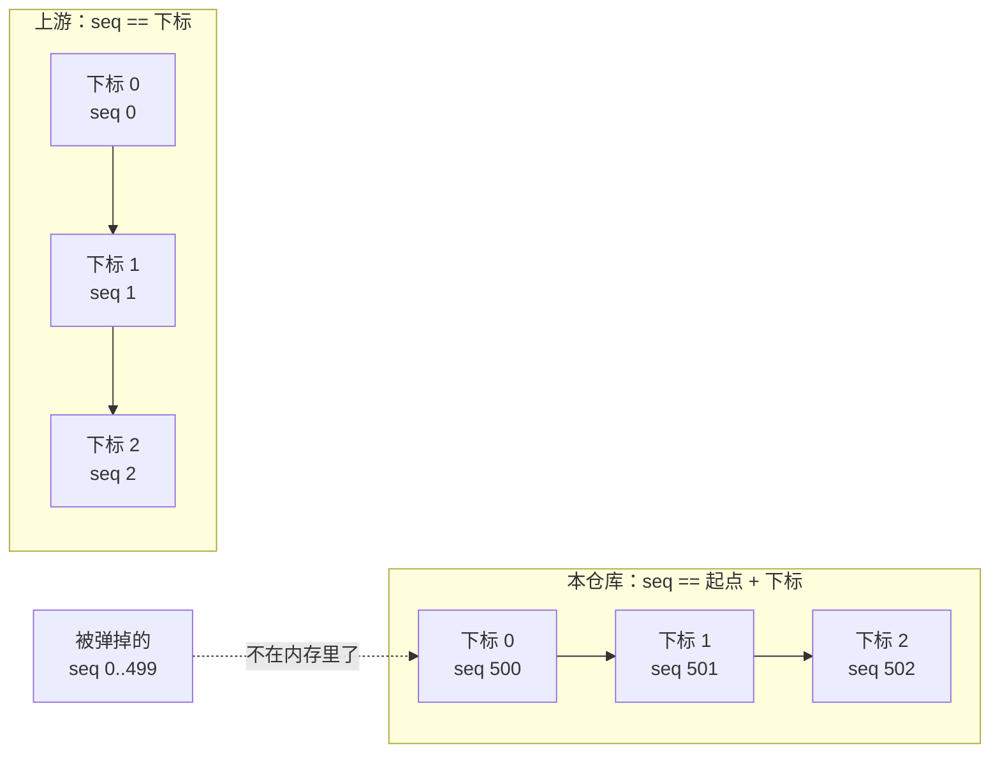

**图怎么看。**一份续跑起来的日志，它的第一条事件 seq 可能是 500。于是包里凡是拿 seq 定位的地方，都要**先减起点**，减完还要核对上的确实是同一条。

**起点这个值由装配方显式给，不从 `Seed[0].Seq` 推。**推的话等于放弃对第一条的校验——一份 seq 写错了的 seed 会被读成"哦，起点在那儿"，而不是被拒。分叉一个子会话的时候，那正是最需要拦住的错。起点是存储那一侧的事实，只有拿着存档的人说得出来。

少了这个概念的后果很具体：追加时会把下一条的 seq 算成"日志长度"而不是"起点 + 长度"，新事件**静默撞掉**已有的那一段。

**本包自己不弹。**包里只有追加，没有任何弹出或裁剪日志的方法。"从最老的一头弹"这个动作发生在别处，本包只是**能接受一个非零的起点**。

---

## 会话对象：能力与能力边界

### 日志：只增不改

`Session` 的核心是一份事件切片。对它只有一种写操作：往尾巴上加一条。没有删、没有改、没有插队。

调用方在候选事件上能填的是：类型、负载、可忽略标记、表面操作、来源事件序号。序号和时间戳由会话盖。

### 四份增量折叠

日志是"发生过什么"，但运行时要读的常常是"现在是什么"。包里挂了四份折叠，各自增量维护：

| 折的是什么 | 增量策略 | 什么时候整份重来 |
|---|---|---|
| **表面**（模型看得见的那串事件） | 每次追加折一条 | 从不（它就是权威） |
| **请求头**（下次请求要比对的那份） | 只折上次之后新增的那一段 | 从不 |
| **路由元数据** | 只扫上次之后新增的那一段 | 从不 |
| **派生消息**（模型消息历史） | 每个表面节点只投影一次 | 表面被**替换**过（替换代数变了） |

**表面是派生消息的唯一来源，这一条是有内容的。**每一次会产出消息的追加都记下了自己的表面操作，于是一条没带标记的原始事件（一个流式分块、一次回合边界）理所当然地缺席；而一次压缩带来的替换，会把被盖住的那些节点从派生结果里删掉。不需要额外写一套"哪些事件算数"的规则——表面已经是那套规则了。

**"替换代数"是重建的触发条件，不是追加。**普通追加只让派生历史往后长；只有位置替换（压缩、工具结果改写）才会让前面的内容失效，那时候才整份重建。

### 交出去的东西怎么算

| 交出去的 | 切片本身 | 里面的内容 |
|---|---|---|
| 事件日志快照 | 复制的 | **共享**（负载字节） |
| 派生消息 | 每次都是新的 | **共享** |
| 表面节点序号 | 复制的 | 值类型，无所谓 |
| 会话头 | 值，直接复制 | 全标量 |

"切片是复制的"保证了**之后的追加长不了你已经拿在手里的那一份**。但里面的负载字节是共享的——所以拿到的东西**当只读的用**，要一份自己拥有的就显式克隆。

上游靠深度冻结让"改不动"成为运行期事实。Go 里没有这回事，这条只是写在文档上的契约。

### 会话对象不负责什么

- **不知道自己被谁观察。**广播是存储那一侧的能力，游离的会话追加起来一样成功，只是没人听见。
- **不做 I/O。**追加是纯内存操作。
- **不弹自己的日志。**见上文。
- **不定义事件语义。**类型、负载形状、表面规则、消息派生规则全在词汇包。

---

## 存储表：能力与能力边界

### 四组观察者

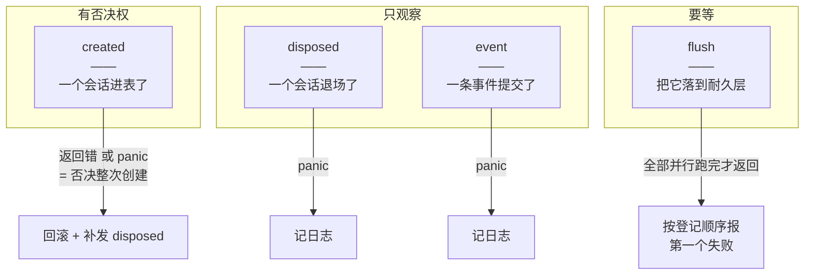

**图怎么看。**四组的失败语义**各不相同**，而且各有理由：

**created 观察者 panic 也算否决。**分不出"我拒绝这次创建"和"我这儿坏了"，所以只能挑一边。当成拒绝，最坏是白建一次会话；当成放行，一个装配到一半就炸了的持久化插件，会让这个会话被当成已经落好盘的。两种错法代价差得远。

**event 观察者失败只记日志。**因为事件已经提交了——见那条贯穿全包的原则。让一个观察者的故障回头把一条已被接受的事件变成失败，既做不到（日志里已经有了），也会挡住后面的观察者看见它。

**flush 报的是"登记顺序里第一个失败的"，不是"最先失败的那个"。**观察者是并行跑的，按到达顺序报的话，同一批观察者每次跑出来的诊断都不一样，没法查。

### 作用域派发

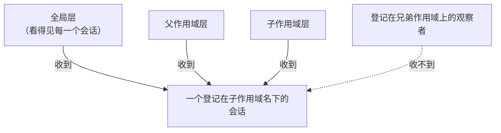

**图怎么看。**观察者名单按会话的**载体作用域**的父链取并集：全局层的看得见全部，某个作用域上的只看得见从它或它子孙那里登记进来的会话。顺序是全局在前、远祖次之、载体自己最后。

一个会话的**载体作用域**（谁能观察到它）和它的**摘除挂在哪儿**（谁负责拆它）是两件独立的事，由 `Enter` 的参数和调用方各自决定。

**收观察者名单这一步故意不拿存储的锁。**理由见「并发」。

### 刷盘

刷盘只有一个入口。这不是省事，是**一个主人一种写法**：载体作用域归存储所有，所以每请求一次的检查点策略、目标轮次驱动的空闲检查点、拆除时的排空、以及"读存储前先刷一次"的消费方，全都得从这里过，而不是各自去派发一遍。

它还会告诉调用方**有没有观察者参与**——"落完了"和"压根没人负责落盘"是两件事，混起来会让调用方把后者当成前者。

### 存储表不负责什么

- **不做持久化。**它只在追加和刷盘时把钩子拉响，落盘是挂上去的插件自己的事。这条分工是 `session/persistence` 那一族包存在的前提。
- **不管会话内容。**它不读日志、不折表面。
- **不做鉴权。**作用域过滤管的是"谁能观察到"，不是"谁有权访问"。
- **不回收。**表里的会话靠摘除离开，没有超时、没有 GC。
- **不跨进程。**它是一张内存表，没有任何跨节点一致性。

---

## 分叉

从一个活会话的稳定前缀，切出一个新的活会话。

### 边界怎么算

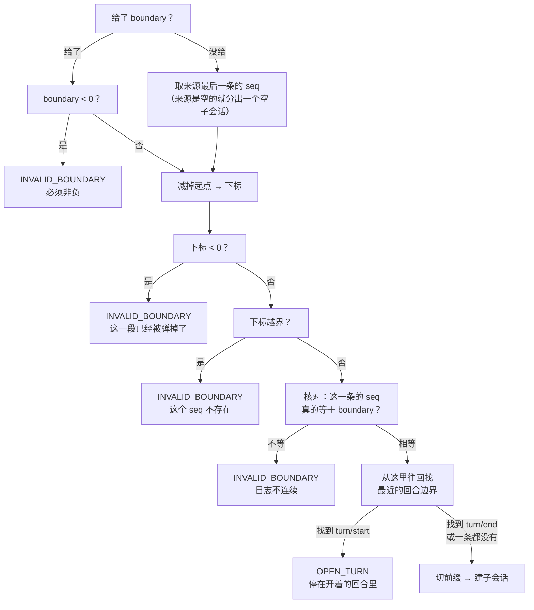

**图怎么看。**四个判断值得单说：

**边界是 seq，不是下标。**上游直接拿它当下标使，因为那边两者恒等。这边要先减起点。

**落在被弹掉的那一段，就如实说"它不在了"。**这里**没有**"残缺着往下走"这条路——分叉要的正是这些事件**本身**，不是从它们折出来的状态。少一段就是分不了。

**减完还要再核一次 seq 对不对得上。**这道检查看起来多余（前面已经按连续性算过了），但分叉是一道会**生出新会话**的边界：一份不连续的日志切出来的 seed 建不起来，与其让它在构造里报一句关于 seed 的话，不如在这里说清是边界对不上。

**回合没关就不许分，连负载读不回来也不放行。**那条 `turn/start` 摆在那儿就说明回合是开着的；读不出回合号只是让诊断少一个数字，不改变"不许分"这件事。

### 五种拒绝

| 码 | 意思 | 调用方该做什么 |
|---|---|---|
| `SESSION_NOT_FOUND` | 这个来源在表里不存在 | 换个来源 |
| `SESSION_NOT_LIVE` | 来源**对象**不是表里活着的那一份 | 重新取一次 |
| `SESSION_ALREADY_EXISTS` | 要给子会话的名字被占了 | 换个名字 |
| `INVALID_BOUNDARY` | 边界不是一个连续存在的 seq | 把边界往前挪 |
| `OPEN_TURN` | 前缀停在一个没关的回合里 | 把边界挪到回合边界上 |

**`SESSION_NOT_LIVE` 只可能从"给对象"那条路产生。**一个只给了名字的调用方压根说不出"我要的是**那一个**对象"。上游是一个联合类型的参数，这一点要读实现才看得出来；这边拆成两个入口，签名上就看得见。

### 子会话继承什么

- **事件连同它们的 seq**——所以子会话的起点就是来源的起点，来源头部被弹过时那个数不是 0。
- **工作目录**，从来源的头上抄。
- **父会话标识**，指向来源。
- **血统边界 = 这次继承的前缀长度。**这个值**不能**从 seed 长度反推——一个续跑起来的会话，它的 seed 是自己完整的存储日志，而血统边界说的是当初从父会话继承了多长。两者只在"刚分叉出来"这一刻恰好相等。

---

## 并发

上游是单线程 JS，一个会话的日志不可能被两处同时改。本仓库不行，所以整套并发保护是这边加的。

### 两把锁

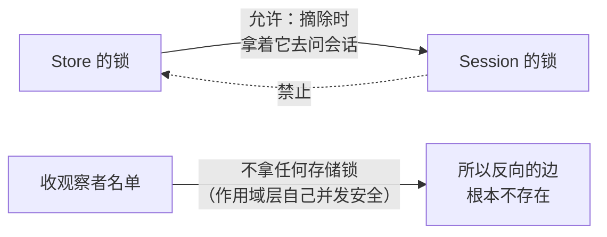

**图怎么看。**规矩只有一条：**存储的锁可以在会话的锁之前拿，不许在它之后拿。**

摘除路径正拿着存储的锁去问会话"你还在发布吗"，这条边是允许的。反方向那条边之所以不存在，是因为追加路径在拿着会话锁的时候要收观察者名单，而**那一步故意不拿存储的锁**——作用域那一层自己并发安全。这是个刻意的设计，不是省略。

两把锁**从不同时持有**。观察者一律在锁外调用，所以一个观察者回头读同一个会话不会自锁。

### 两扇窗口

包里有两段"事情做了一半、别人已经看见了"的时间：

- **公布窗口**：创建观察者正在被逐个调用。
- **发布窗口**：一次追加已提交，事件观察者正在被逐个调用。

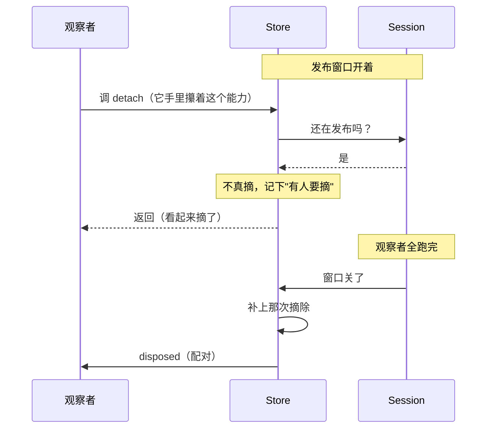

**图怎么看。**窗口开着的时候不能真摘——那会在同步派发的中途，把登记和发布钩子从正在跑的观察者脚下抽掉。所以记下来，等窗口关掉再补，连同那条配对的通知。

两扇窗口互相也要让：关掉其中一扇的时候，要确认**另一扇**也关了才执行延后的摘除。

### 只许有一个写者

追加路径上有一个重入标记。上游那个标记只挡一件事——某个事件观察者在回调里又对同一个会话追加。这边它同时挡住第二件：**另一个 goroutine 同时追加**。

这不是把并发追加序列化，是**拒绝**它。一个会话的日志只该有一个写者——它自己那个驱动循环。撞上这条错误说明有第二个写者，那是缺陷，不是需要重试的竞争。

### 能力是有身份的

包里有三处看起来重复的身份检查，防的是同一类事故：**一个过期的能力，不许动后来那一次同名生命周期的东西。**

- 摘除时要核对表里那一份**就是**自己这一份，不然不动。
- 解绑时要核对会话当前认的**就是**传进来的这一份。
- 刷盘和公布前要核对这个会话对象**确实**是本表里活着的那一份——游离的、已摘除的、属于另一张表的，一律拒。

同名生命周期先后发生是正常的（一个会话摘了，同一个 id 又建了一个）。少了这些检查，前一次的摘除函数会把后一次的登记删掉。

---

## 边界检查

进这个包的东西要过四道，各自的失败该让调用方做的事不一样。

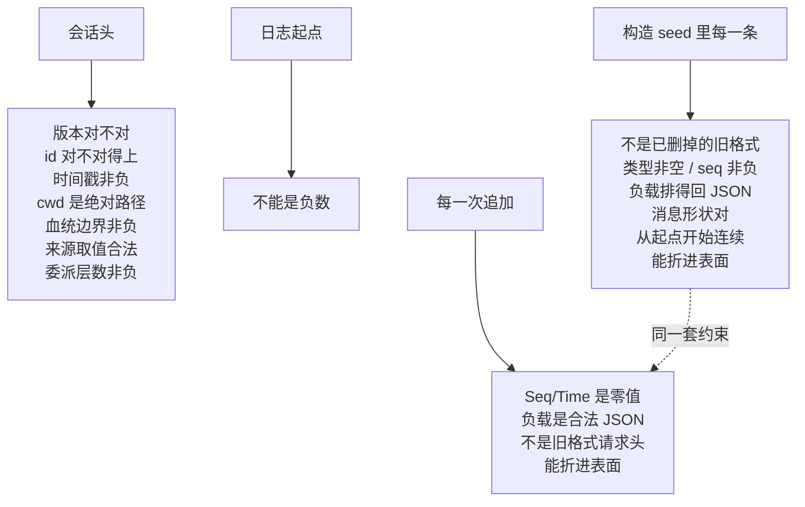

**图怎么看。**最重要的是那条虚线：**seed 按和追加一模一样的约束验。**

理由很直接：一次回放或分叉不能造出一份**没有任何持久化后端存得下**的活日志。少了这道检查，一份坏 seed 只会在后来某次刷盘被后端拒收时才浮出来，或者干脆表现为"活日志和存储悄悄分了岔"——那比当场报错难查得多。

三处细节：

**起点是负数当场就拒，报的是 seed 那一类错。**起点和 seed 是同一件事实的两半——"这份日志从哪儿起"和"从那儿起的这些事件"。一个负起点会让整段 seed 的连续性检查按一个不可能的期望值去比，与其让它在第一条事件上报一句"seq 应该是 -500"，不如在读 seed 之前就说清是起点本身给错了。

**包里认得两样已经删掉的旧格式**（一种增量请求头事件、一种请求头原因取值）。认它们纯粹是为了报一句说得清的话：一份旧日志读进来时，"不认识的类型"这句诊断帮不上忙，"这是已经删掉的旧格式"才帮得上。

**工作目录用跟着平台走的绝对路径判断。**这条路径的用途是给存储后端做目录键，也就是说它必须在**本机**上成立。用只认 POSIX 的那种判断，会在 Windows 上把每一条真实的工作目录都判成非绝对。

### nil 和空切片不是一回事

构造 seed 传 nil 表示"压根没给"；传一个长度为 0 的切片表示"给了一份空的"。

后者**照样会补**那条 seed 结束标记——分叉一个空会话走的就是这条路。前者不补。

这个标记还有一条规矩：**已经以它结尾的 seed 不再补**。一个冷会话是被第一次触碰时唤醒的，反复打开同一个会话不能让它的日志每开一次就长一条。

---

## 失败语义

| 分类 | 什么时候 | 日志变了吗 | 调用方该做什么 |
|---|---|---|---|
| 头不合法 | 造会话 / 恢复 | 没建成 | 别建，头本身有问题 |
| seed 不合法 | 造会话 | 没建成 | **别建这个会话**——坏 seed 造出的活日志没有后端存得下 |
| 追加不合法 | 追加 | **没变** | 修候选事件，或者查是不是有第二个写者 |
| 同名会话已存在 | 铸名 / 进表 | — | 换个名字 |
| 会话不在本表里活着 | 刷盘 / 公布 | — | 重新取一次，或者查是不是拿错了对象 |
| 会话已经有主了 | 进表 | — | 一个会话对象只能登记进一张表 |
| 已经公布过了 | 公布 | — | 查是不是在创建回调里递归公布 |
| 分叉被拒（五种） | 分叉 | — | 见分叉那一节的表 |

**"追加不合法时日志一动不动"这一条是硬承诺**，因为表面折叠是原子的。

**观察者的失败不在这张表里**，因为它们不构成调用失败：created 那一组会变成"创建被否决"，flush 那一组会变成"刷盘失败"，另外两组只进日志。

---

## 能力边界

这个包负责：

- 攥住一个会话只增不改的事件日志，并保证追加是定序、盖戳、验过表面的。
- 增量维护表面、请求头、路由元数据、模型消息历史四份折叠。
- 把会话登记进一张内存表，管住它的公布、摘除，以及两者的配对。
- 按作用域路由四组观察者，并为每一组定义各自的失败语义。
- 提供刷盘这个唯一的耐久检查点入口。
- 从一个活会话的稳定前缀分叉出子会话，并说清被拒时是哪一类。
- 在造会话和追加两道边界上，用同一套约束挡住存不下的日志。

这个包不负责：

- **不做持久化。**它只拉钩子，落盘归挂上来的插件。
- **不定义会话词汇。**事件类型、负载形状、表面规则、消息派生规则全在 `session`。
- **不弹日志。**只有追加，没有裁剪；它只是**能接受**一个非零起点。
- **不提供查询。**没有按内容检索、没有跨会话列举语义——那是 `sessionquery` 的事。
- **不跨进程。**一张内存表，没有分布式协议。
- **不做鉴权。**作用域过滤管的是可见性，不是权限。
- **不自己计时。**没有超时、没有 TTL、没有后台回收。
- **不为 I/O 阻塞。**追加是纯内存的；唯一会等的是刷盘，而那是调用方明确要求的。

---

## 谁在用它

| 消费方 | 用的是哪一面 |
|---|---|
| `core/agentloop` | 走 `Prepare`/`Enter`/`Announce` 三步把会话折进 agent 的登记；追加事件；听 disposed |
| `session/persistence` | **唯一一个把四组观察者全登记上的**：created 建档、event 收事件、flush 落盘、disposed 收尾；恢复时走 `PrepareRestored` |
| `compaction` / `context/instructions` | 听 event，据此维护自己的增量状态 |
| `acp` / `sdk` / `goal` / `subagent` / `schedule` | 听 event 往外推通知；在各自的检查点上调刷盘 |
| `sessionquery` | **还没接上**——见下 |

两处值得记的事实：

**刷盘有五类不同的调用方**（协议桥接、轮次驱动、提醒持久化、子 agent 收尾、压缩事务），这正是"一个主人一种写法"那条分工要解决的问题。

**分叉在仓库里目前没有非测试调用方。**能力是完整的、测过的，但还没有产品路径走它。

**`sessionquery` 和这个包之间还差一层适配。**读侧要的是"头 + 事件"这样一份借用观察，而这张表交出的是会话对象本身。两个读方法都现成，缺的只是那一小层转换——仓库里现在还没有。

---

## 相关源码

| 路径 | 内容 |
|---|---|
| `core/session/doc.go` | 为什么和词汇包分家、四组观察者的由来、不移的那几样 |
| `core/session/session.go` | 会话对象：日志、四份增量折叠、追加的三段、与存储的绑定 |
| `core/session/store.go` | 内存表：四组观察者、三步生命周期、作用域派发、刷盘、两扇窗口 |
| `core/session/fork.go` | 分叉：五种拒绝、边界怎么算、开着的回合怎么挡 |
| `core/session/validate.go` | 三道边界检查、七个哨兵错误、两样旧格式 |
| `core/session/preparation.go` | 未公布会话的所有权，一次性释放 |
