# 凭据

对应包：`credentials`、`feature/authorization`

## 定位

密钥是这个系统里最不该被存两遍的东西。一旦它的值出现在配置文件里，它就会跟着配置一起被备份、被同步、被贴进工单，还会顺手落进日志和模型上下文——而这些地方每多一处，泄一次要换的地方就多一处，且没人说得全到底有几处。

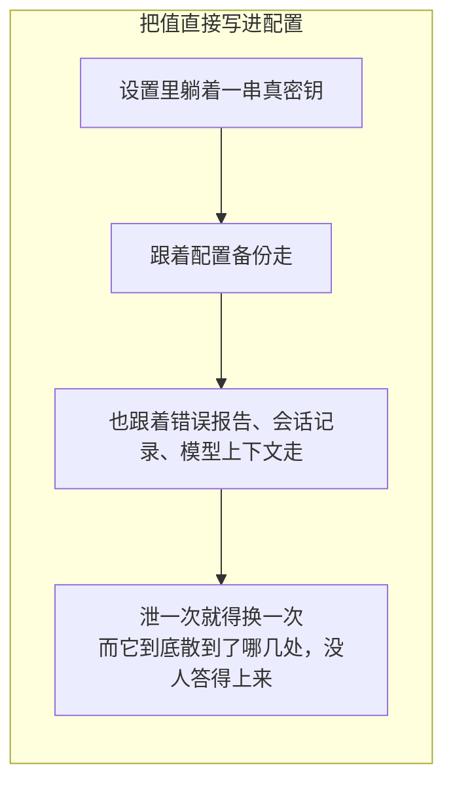

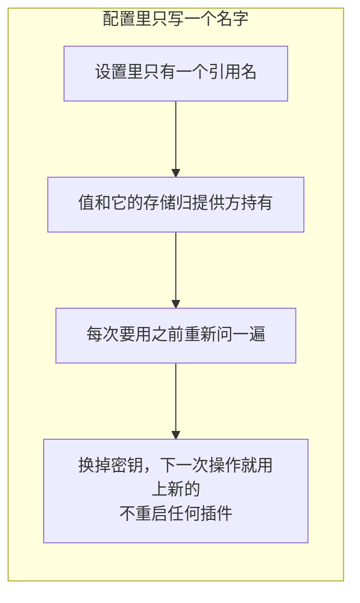

这两个包管的就是那个名字，以及围着它的四件事：怎么解析成值、怎么原子地换掉、变了怎么叫一声、以及**哪些路径绝不许把值交出去**。

凭据按「怎么来的」分两类，两个包各接一类：

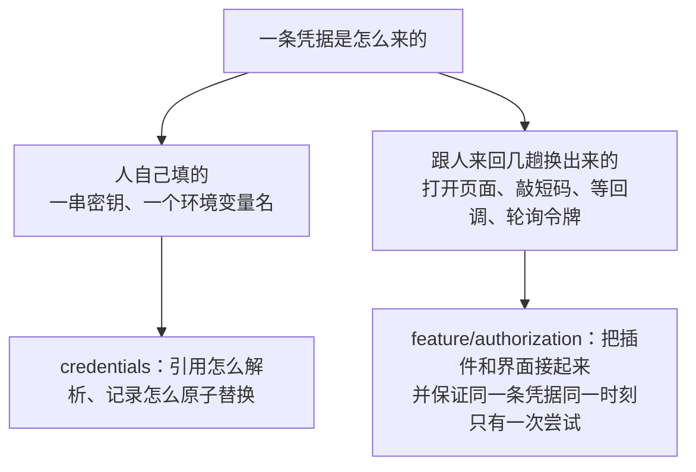

---

## 架构

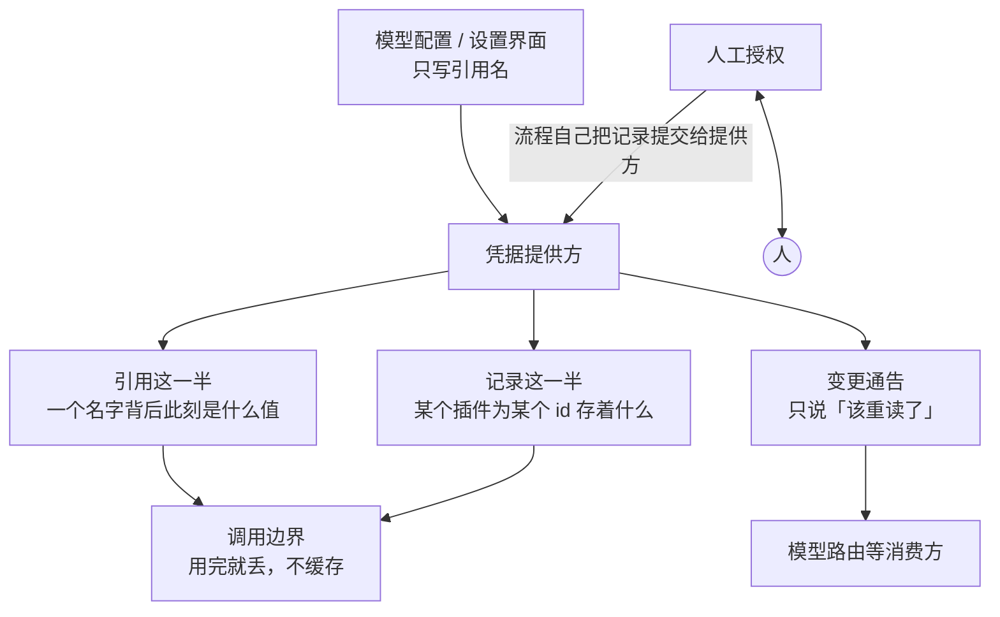

两个包的分工：

| 包 | 它管的 | 它明确不管的 |
|---|---|---|
| `credentials` | 引用和记录两套地址的语法、解析、原子替换、变更通告 | 值存在哪、怎么加密、谁有资格改 |
| `feature/authorization` | 谁认领哪条凭据、同一时刻只许一次尝试、一次尝试怎么算结束 | 任何一条具体流程怎么走、界面长什么样 |

### 两套地址，回答两个不同的问题

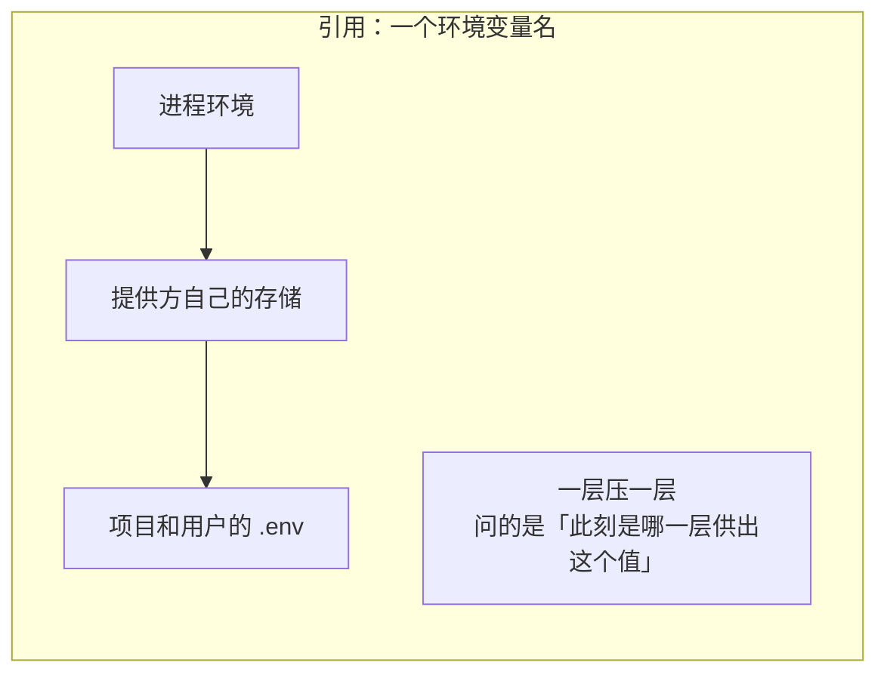

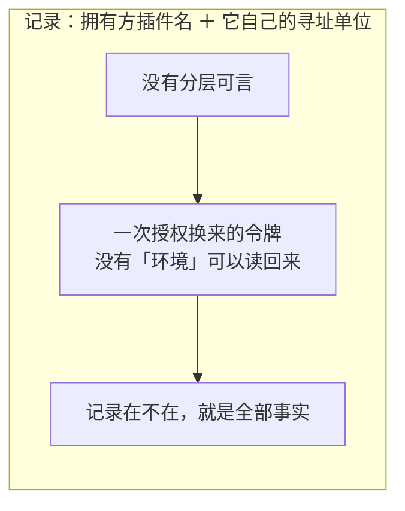

两套地址共用一个提供方，所以它们**绝不能撞上**：

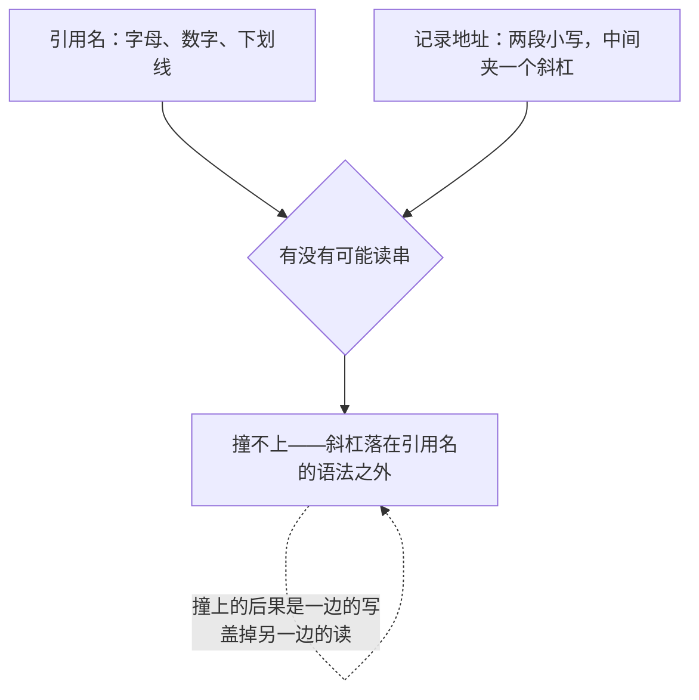

### 记录地址的前半段写拥有者，不写领域

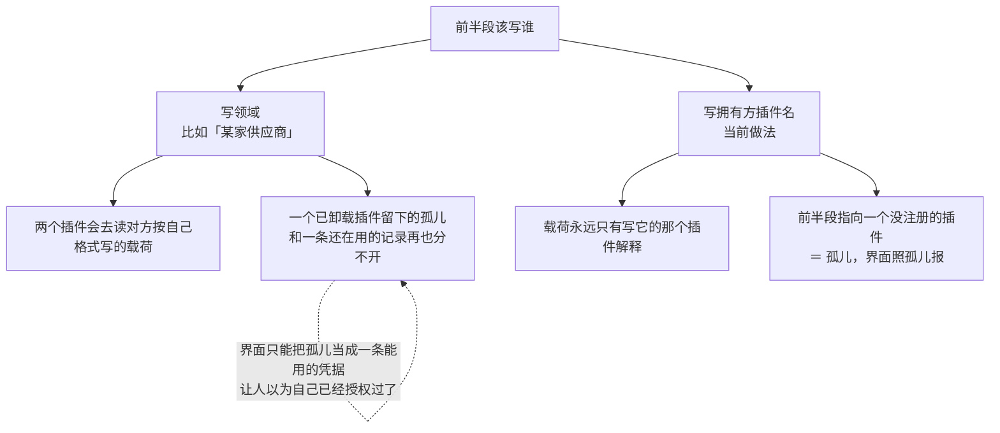

### 两类记录：一类读得懂，一类一个字都不读

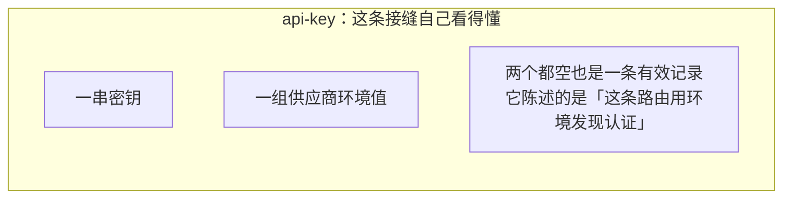

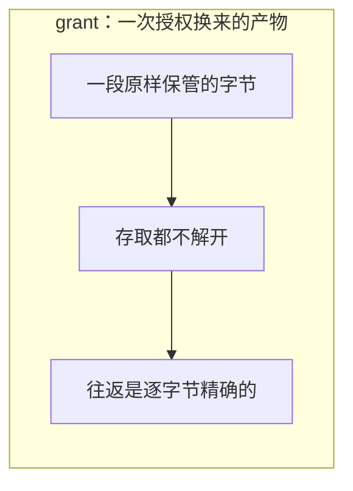

**为什么授权载荷要按字节保管**：把它解开成通用结构再排回去，大整数会被磨掉精度、键的次序会变。而这是别人的授权令牌——磨掉一位数字的后果是它再也换不回访问权，且没有任何一次报错能解释这件事。

### 存下来的空值等于没有

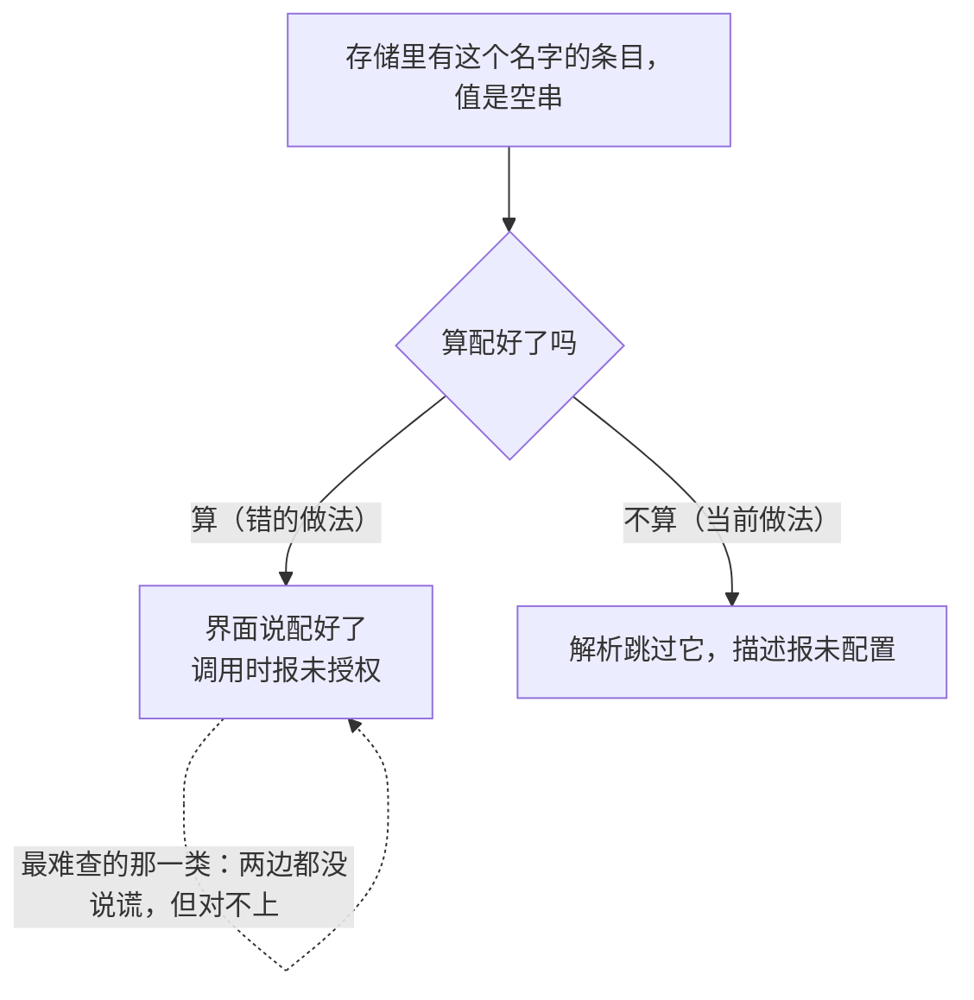

---

## 值只往一个方向走

这是这两个包最要紧的一条，所以单开一节。

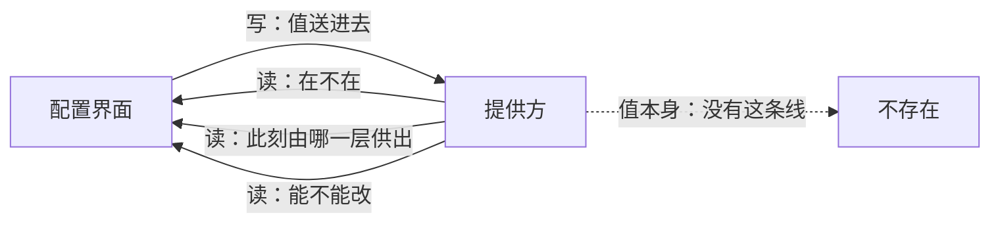

「脱敏」在这里不是把值打码之后交出去，而是**根本没有交出值的那条路**。

### 不给打码预览是有意的

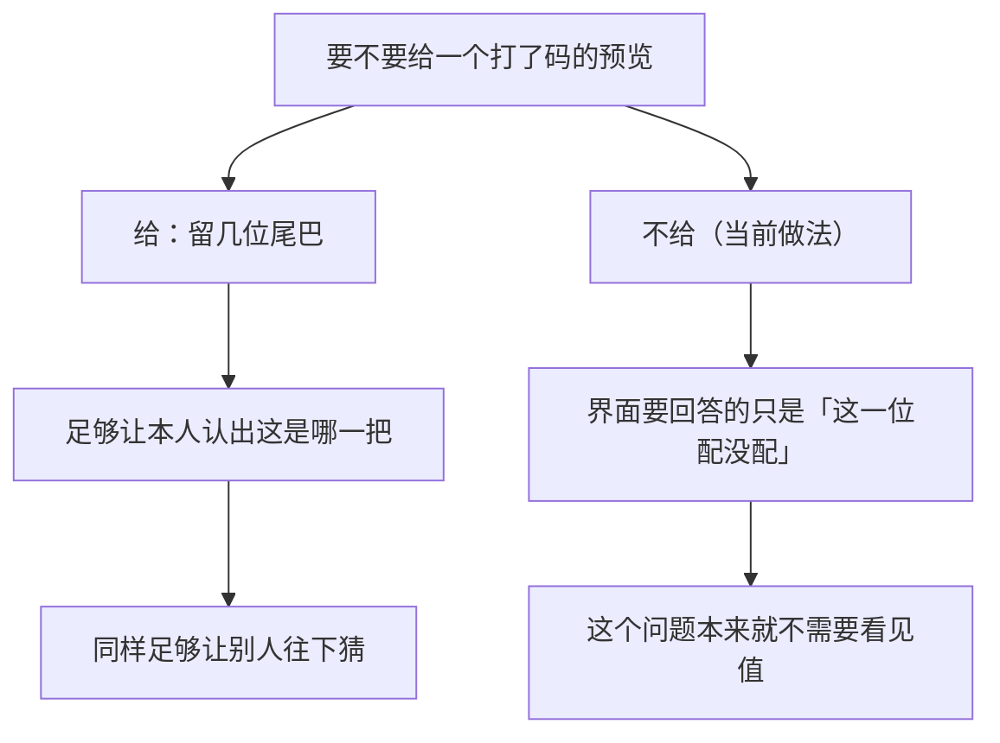

设置那一半用的是同一个原则，做法更彻底：


### 日志和模型上下文那一侧

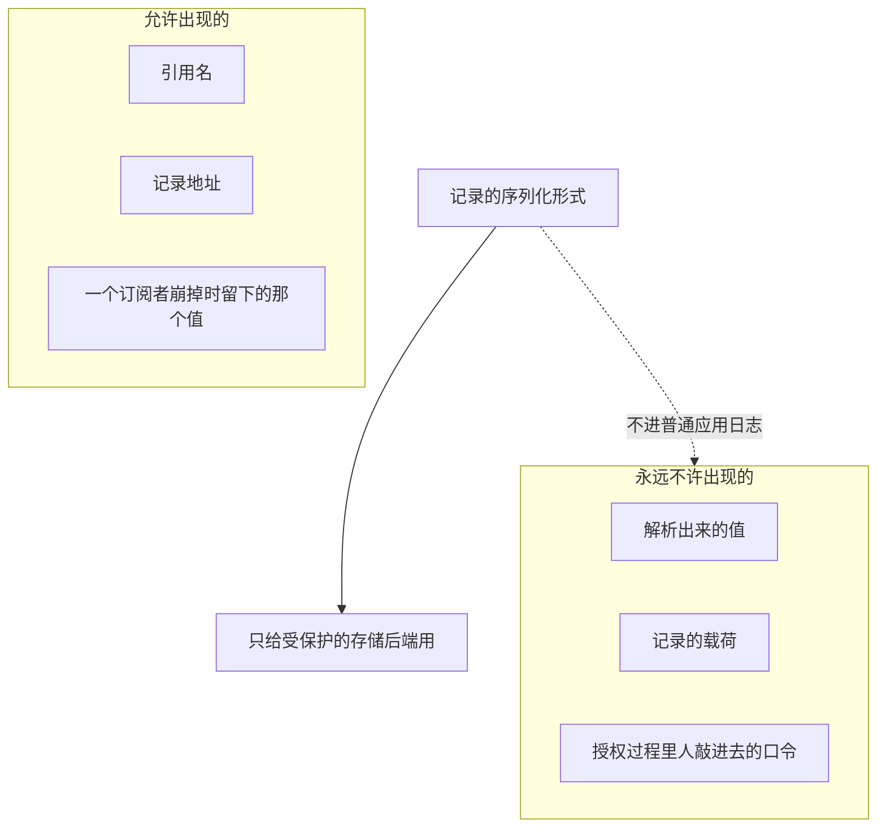

订阅者崩掉时那条诊断只记地址、不记别的，也是同一条规矩的延续：那一刻订阅者手上可能正拿着刚解析出来的值。

### 变更通告只说「该重读了」

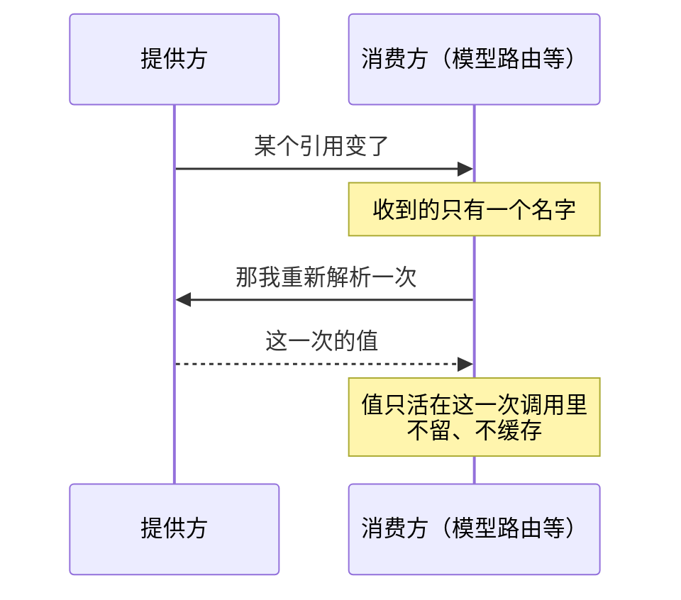

正因为消费方每次操作都重新解析一遍，换掉一个密钥之后下一次操作就用上了新值——这不是性能取舍，这是这条接缝存在的全部理由。

### 配置界面一次问一批


这条路上另外两道关，都在问提供方**之前**做完，一件不过就一个引用都不问：

| 关 | 不过的话 | 为什么不放宽 |
|---|---|---|
| 每个名字都要合语法 | 整次拒绝 | 跳过坏名字会让界面少一行，而少的那一行和「这个引用没配置」长得一模一样 |
| 一次最多问 64 个 | 整次拒绝 | 挡的是「一次已经通过鉴权的请求，让提供方开始一段没有上界的活」 |

提供方在任何一个引用上失败，整次也失败：一份缺了一行的描述，界面分不出缺的那行是「没配置」还是「没问出来」。

---

## 写只有一条路：读—决定—替换

刷新令牌是「读—决定—替换」，不是「写」。没有互斥的话：

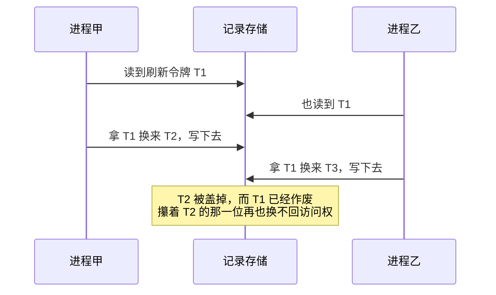

所以记录这一半只留一条写入路径，一次正确的写必须看得到当前值：


「不改」和「删空」是两件事，写出来也不一样——合成一个的代价是这两件事在代码里长得完全相同。

---

## 人工授权：跟人来回几趟换出来的那一类

这几趟里，知道该怎么走的是插件，能跟人说上话的是界面，而两者互相不认识：插件不知道此刻是哪个页面在看，界面不知道这条凭据要走几步。

```mermaid
flowchart LR
    F["插件<br/>知道这条凭据要走几步"] -->|"登记一条流程"| M["中间人"]
    UI["界面<br/>能跟人说上话"] -->|"起一次授权，<br/>并把「怎么跟人说话」一起交进来"| M
    M -->|"跑起来"| F
    F -->|"要问一句话"| M
    M -->|"摆到人面前"| UI
    UI -->|"人的答话"| M
    M --> R["结果：成了 / 撤了 / 砸了"]
```

「怎么跟人说话」跟着请求交、而不是登记进来，是因为**起这次授权的那一位才是能跟人说上话的那一位**——问题因此正好落到问出它的那个页面上。

### 值不经过这条缝

```mermaid
flowchart TD
    A["流程自己把凭据记录提交给提供方"] --> B["中间人只核实两件事"]
    B --> B1["① 这次尝试之内<br/>观察到过一次提交"]
    B --> B2["② 尝试结束之后<br/>那条记录还在"]
    B1 --> C{"两条都过吗"}
    B2 --> C
    C -->|"都过"| D["报成功"]
    C -->|"缺一条"| E["报「没写下去」"]
    G["把值誊回中间人，再写第二遍"] -.->|"没有这条路"| A
```

两条缺一不可：少了第一条，一条早就配好的记录会让任何流程都「成功」；少了第二条，一次提交完又被删掉的记录会被报成配好了。让流程自己写，是为了让一个用自己那套存储适配器落盘的库仍然是唯一的写者。

问出去的话和发出去的通告里也永远不含密钥——需要打码呈现的那一类问题单独标出来，界面既打码也不写进日志。

### 干到一半走人，第二天接着干

DSH 那份 TypeScript 实现里，一次授权活在一个浏览器进程的闭包里，所以它只有两种状态：在跑，和不在。它自己的文档写着「流程不可恢复」——对一个桌面工具那是对的。

这个仓库的前提不一样：人可以关掉窗口第二天再来，一次授权可以起在这个副本上、接在那个副本上。所以一次尝试是一条落在数据库里的记录，于是多出第三种状态：

```mermaid
stateDiagram-v2
    state "在跑：有副本攥着一份没过期的租约" as A
    state "停着：记录还在，跑它的那个进程没了" as B
    [*] --> A: 起一次新的
    A --> [*]: 结算，记录收走
    A --> B: 租约到期，没人续
    B --> A: 明说接手
    B --> [*]: 明说撤掉
```

「停着」那一种既不是忙也不是闲，所以起一次新的会被拒：

```mermaid
flowchart TD
    A["起一次新的授权"] --> B{"这个键上现在有什么"}
    B -->|"什么都没有"| C["起"]
    B -->|"有人正攥着"| D["拒：已经有人在跑了"]
    B -->|"停着一次没结算的"| E["拒：要人明说接手还是撤掉"]
    E -.->|"默认起一次新的<br/>会把上次攒下的进度悄悄扔掉"| E
```

### 接手不是恢复现场，是重跑一遍

一段正在跑的代码序列化不了，所以「接着上次干」不可能是把现场原样搬过去。做法是重跑那条流程，由流程自己读回上一次留下的脚印然后跳到那一步：

```mermaid
flowchart LR
    subgraph ONE["第一次跑"]
        A1["把人支去浏览器之前<br/>先留一份脚印"] --> A2[("尝试记录")]
        A3["这中间进程没了"]
    end
    subgraph TWO["接手的那一次"]
        B1["从头再跑一遍同一条流程"] --> B2["流程自己读回脚印"]
        B2 --> B3["直接跳到轮询令牌那一步<br/>不再要一次授权码"]
    end
    A2 --> B2
```

用哪种方式跟着**记录**走，不跟着这次请求走——一次「设备码」的尝试被接成「浏览器回调」，上一次留下的脚印就全白留了。

留一次脚印顺带办完三件事，一次往返做到底：

```mermaid
flowchart TD
    A["流程留一次脚印"] --> B["① 把进度写下去"]
    A --> C["② 续一次租"]
    A --> D["③ 把「有没有人要撤」读回来"]
    B -.->|"三件事本来就该看同一份记录的同一个时刻"| C
    E["写完脚印才发现自己已经被接手"] -.->|"那份脚印会盖到别人的记录上"| A
```

### 抢同一条凭据，只有一个能赢

记录的键就是凭据的地址，所以「一个键上只有一次尝试」是数据库自己保证的，不靠任何一台机器的内存：

```mermaid
sequenceDiagram
    participant A as 副本甲
    participant D as 尝试记录
    participant B as 副本乙
    A->>D: 建一条，键就是凭据地址
    B->>D: 也想建一条
    D-->>B: 这个键上已经有了
    Note over A,D: 甲每隔租期三分之一续一次租
    Note over A: 甲这个进程没了
    Note over D: 租约到期
    B->>D: 接手：条件写，把持有者改成自己
    A->>D: 甲又活过来，续租
    D-->>A: 这条记录已经归乙了
    Note over A: 停手，且不结算
```

「停手且不结算」是这里最要紧的一句：那条记录不再是甲的了，甲再去删它就是删别人的东西。租期的三分之一续一次，是为了在一次续租失败之后还剩两次机会——一次数据库抖动不该让一次正在等人输入的授权被别人抢走。

### 撤销要写下去

```mermaid
flowchart TD
    A["撤的那一位和跑的那一位<br/>可能不在同一个进程里"] --> B["所以撤销是写进记录里的一个标记"]
    B --> C{"此刻有人攥着吗"}
    C -->|"有"| D["攥着的那一位在下一次续租、发问<br/>或留脚印时读到它，自己走结算那条路"]
    C -->|"没有"| E["就地收掉，结算成「撤了」"]
    D -.->|"这里再动手<br/>就是两个人结算同一次尝试"| D
```

---

## 生命周期与并发

```mermaid
flowchart TD
    A["提供方的存储寿命由宿主管"] --> A1["这两个包不建数据库连接"]
    B["订阅名单按登记次序保存"] --> B1["分发次序每次一样<br/>不靠随机遍历"]
    C["订阅、退订、分发来自不同协程"] --> C1["一把互斥锁护住名单<br/>监听器一律锁外调"]
    D["授权服务关掉"] --> D1["撤掉本副本上跑着的那几次"]
    D1 --> D2["撤掉不等于结算<br/>没来得及结算的留在记录上，下次处置"]
```

装配有一个次序要求：通知器要比提供方活得长。

```mermaid
flowchart LR
    A["先造通知器"] --> B["交给提供方内嵌"] --> C["再用同一个通知器装那条自检"]
    D["反过来：让自检订阅在提供方身上"] -.->|"提供方一拆，自检跟着一起没了<br/>而它要查的恰恰是拆掉之后发生的事"| D
```

那条自检查的是：一条「已经提交」的变更通告，发出来的时候凭据服务还在不在。服务已经拆掉之后还发出来，说明有人把活漏到了自己的收尾静默期之后——也就是那次「提交」到底提交进了哪里，已经没有人答得上来。

授权那一侧的自检查另一件事：一次尝试结算之后，它那个键上的位子必须已经放开。一个卡住的位子从外面看不出来，而它会让之后每一次授权都被拒，直到重启。

---

## 失败语义

```mermaid
flowchart TD
    A["出了岔子"] --> B{"哪一类"}
    B -->|"这个引用没配置"| C["不是错误<br/>一个还没填的可选凭据是正常状态"]
    B -->|"后端读不动"| D["照后端失败报<br/>绝不伪装成「没有凭据」"]
    B -->|"记录的类别不认识"| E["拒绝，不当成一条空的 api-key"]
    B -->|"名字或地址不合语法"| F["各报各的，不合并成一句「不行」"]
    E -.->|"当成空记录的话<br/>下一次写就把它真的覆盖掉了"| E
```

把未配置报成错误的代价是日志里堆满不是故障的故障；把后端故障报成未配置的代价更大——那会让一次「读不出来」看起来像一次「你还没填」。

授权那一侧另有一套分类：

```mermaid
flowchart TD
    A["一次授权没成"] --> B{"是什么"}
    B --> C["人说不 → 算撤了，不是故障"]
    B --> D["界面自己坏了 → 故障"]
    B --> E["流程跑完但没写下去 → 故障"]
    B --> F["被别的副本接手 → 停手，且不结算"]
    B --> G["记录读不出、写不下 → 故障"]
    C -.->|"「人拒绝」这个分类只许人说不时用<br/>否则之后一次真的故障会被读成一次拒绝"| C
```

结算有两个口径：起这次尝试的那一位从返回值就知道结果，成了还是撤了，砸了是以一个错误交回去的；没起它的那些旁观者多一种「砸了」——旁观者没有别的办法把一次拒绝和一次故障分开。

一个订阅者崩掉不许连累别人：

```mermaid
flowchart TD
    A["一次已经提交的变更正在分发"] --> B["某个订阅者崩了"]
    B --> C["记一条日志，接着发给后面的"]
    C -.->|"掐断的话，没跑到的那几个<br/>从此和存储不一致，而它们永远不会知道"| C
    D["自检违例是唯一的例外"] --> E["等所有订阅者都跑完再重新抛出，只抛第一条"]
    E -.->|"降级成一行日志<br/>等于把这条检查悄悄关掉"| E
```

---

## 能力边界

```mermaid
flowchart TD
    Y["这两个包做的"] --> Y1["把配置里的名字解析成此刻的值"]
    Y --> Y2["把一条记录的读—决定—替换串成唯一的写入路径"]
    Y --> Y3["把「跟人换一条凭据」的两半接上<br/>并保证同一条凭据同一时刻只有一次尝试"]
    N["不做的"] --> N1["不加密、不轮换密钥<br/>这些在提供方和宿主那一侧"]
    N --> N2["不实现任何一条具体流程<br/>OAuth、设备码、粘贴密钥都是登记方的事"]
    N --> N3["不渲染任何界面"]
    N --> N4["不做访问控制<br/>谁有资格改哪条记录由宿主判"]
    N --> N5["不缓存解析结果"]
    N --> N6["不自动重试，也不自动接手<br/>一次停着的尝试要人明确选"]
    N --> N7["不枚举有哪些引用<br/>那是设置的结构说了算，要调用方点名来问"]
```

还有一条得单独说清，否则消费方会以为自己订阅了「凭据变了」这件事的全部：

```mermaid
flowchart LR
    A["提供方存储里的变更"] --> B["发通告"]
    C["外部对存储的编辑"] --> B
    D["进程环境自己变了"] -.->|"观察不到，永远不会发"| E["没有这条通告"]
```

## 对应的 DSH 能力

下表由 [`docs/packages.md`](../packages.md) 与 [能力覆盖表](../portmap/capability-coverage.tsv) 机器 join 得到：本篇覆盖的 Go 包，承接的是上游 DSH 的哪几条能力，以及各自还缺什么。落点列由源码里的 `// 源:` 注释反查，不是手写的。

| 上游能力 | DSH 包 | 裁决 | 落在哪个 Go 包 | 这里缺什么 |
|---|---|---|---|---|
| 浏览器配置界面的 Host Remote 属主，提供脱敏 settings 与凭据元数据读取、不回传密钥的写入，并在 Host 桌面打开 settings 或 preset 位置 | `api/settings-controller` | 取形重写 | `credentials` `settings` | 缺口已补：配置界面那条只读路径落在 `credentials` 的 `DescribeRefs`（一次问一批引用，带语法关与扇出上限）。上游同样不打码、不枚举引用——脱敏靠「没有任何一条读路径交出值」，不是靠掩码；`settings` 那一半的 `RedactSecrets` 早已落地 |
| 凭据Service Definition，配置引用与授权记录分离存储 | `credentials/credentials` | 需要 | `credentials` | — |
| 授权Service Definition，拥有凭据对话及生命周期 | `credentials/authorization` | 取形重写 | `feature/authorization` | 缺口已补：三个接缝取 DSH 的形状，状态落数据库——一次尝试是一条记录，进程没了第二天能接着走。单飞由记录键（就是凭据键）的条件写保证，跨副本有效；接手是重跑流程，由流程自己读回上一次留下的脚印 |

## 相关源码

- `credentials/credentials.go`
- `credentials/batch.go`
- `credentials/record.go`
- `credentials/provider.go`
- `credentials/notifier.go`
- `credentials/invariant.go`
- `feature/authorization/doc.go`
- `feature/authorization/service.go`
- `feature/authorization/session.go`
- `feature/authorization/spec.go`
- `feature/authorization/types.go`
- `feature/authorization/invariant.go`
