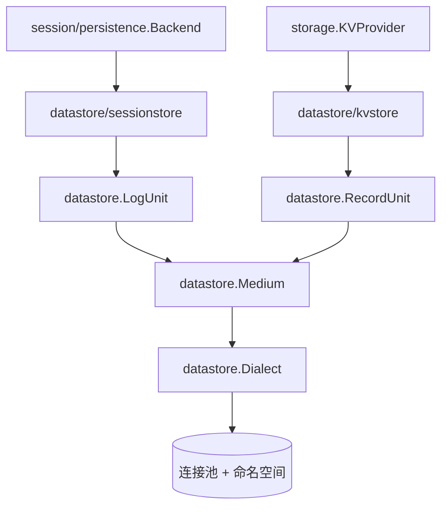

# 持久化抽象层

## 定位

`datastore` 是本仓库唯一操作数据库的地方：唯一 import `database/sql`、唯一挂驱动、唯一写 SQL。

在它之前，会话日志和键值中枢各自开连接池、各自建表、各自拼 SQL，两处形状抄来抄去（限定 schema、建表包在咨询锁里、值列用 TEXT、标识符长度上限 63）。抄出来的东西会分叉，而分叉只在换后端、换数据库、换部署时才露头。更要紧的是调用方：一个要存数据的模块凭什么知道后面挂的是 Postgres 还是 SQLite。

所以依赖方向是反的——适配层认识业务接口，业务接口不认识适配层：

```text
session/persistence.Backend   <- datastore/sessionstore
storage.KVProvider            <- datastore/kvstore
```

`session` 和 `storage` 两棵树里没有、也不许有任何一处提到数据库。这条界线由 `tools/dbcheck` 把着，不靠自觉。

一种根本不同的介质（对象存储、远端 API）不进本模块，它自己去实现同一道业务接口。本模块是「关系库这一种介质」的实现，不是所有持久化的总入口。

## 架构



对外只有两种通用形状，都不带领域含义：

| 形状 | 内容 | 谁落在上面 |
|---|---|---|
| 记录集 `RecordUnit` | 若干张「键 → 一段不透明 JSON」的表，外加一个可选单例槽 | 键值中枢 |
| 日志集 `LogUnit` | 若干条流，每条流是一份头加一串按 seq 升序、可从头弹出的条目 | 会话存档 |

本模块不提供「随便写一句 SQL」。一种新需求如果两种形状都装不下，那是往本模块加一种形状，而不是在使用方那边写 SQL——加形状要过一次设计，写 SQL 不用，这正是分岔的起点。

一个 `Medium` 是一份介质：一个连接池加一个命名空间。命名空间在 Postgres 上是一个 schema，在 SQLite 上是表名的一段（那里没有 schema，而 `ATTACH` 是连接上的状态，靠它就等于让「这条语句落在哪儿」取决于这次抓到了哪条连接）。两种落法之下，同一个库里的两个命名空间都是两份互不相干的介质。介质在第一次打开时盖上一个实例标识，此后不变；它拌进 revision 里，让两份各自从 0 数起的介质发不出相等的令牌。

语句里数据库之间会分歧的那几处（占位符、限定标识符、咨询锁、只读事务隔离级别、取大的函数）收在 `Dialect` 后面。加一种数据库是加一个 `Dialect`，不是加一个包。

## 两种方言

| | Postgres | SQLite |
|---|---|---|
| 命名空间 | `CREATE SCHEMA`，限定成 `"ns"."t"` | 折进表名，一个叫 `ns.t` 的表 |
| 占位符 | `$1 $2 …` | `?`，原样 |
| 建表并发 | `pg_advisory_xact_lock` | 空操作，写锁就是布局锁 |
| 读事务 | 明说可重复读 + 只读 | 退回缺省——它本身就是快照 |
| 标识符上限 | 63 字节，超了**静默截断** | 无上限 |

驱动不在本模块里：用 `lib/pq` 还是 `pgx`、用哪个 SQLite 驱动是部署期的选择，装配方 `sql.Open` 出来经 `Config.DB` 传进来。

SQLite 那一支有两件事本模块管不了，得由装配方在 DSN 上设：`busy_timeout`（否则两条写事务撞上时后到的那条当场失败而不是等一等）和 `foreign_keys`（否则条目表那道外键不生效，Postgres 那一轮拦得住的东西这一轮拦不住）。两件事都是连接上的状态而不是语句里的东西，所以它们进不了 `Dialect`——一个连接池里每条连接各自带着自己的 pragma，本模块没有「对每条新连接执行一句」的抓手，硬做只会做出一个漏掉一部分连接的假保证。

## 生命周期与并发

- `Open` 建立或校验版面（`LayoutVersion`），版面号对不上直接拒绝而不是就地升级。
- 同名单元不许重开；`Close` 释放单元，`Medium.Close` 关掉连接池。
- `storage.Backend.Close` 的契约是「释放介质」，所以 `kvstore.Backend.Close` 会把 `Medium` 连同连接池一起关掉；一份介质因此归一个后端所有。
- 一次写就是一个事务：要么整批提交，要么一条都没有，所以会话存档里不存在断尾，`TornMarker` 恒为 nil。
- revision 是来源限定的（实例 + 单元名 + 计数器），用于判断同一份物理日志在两次观察之间有没有变过。
- `TrimBefore` 从最老那头弹，不动 revision——被弹掉的那一段不算「内容变了」。
- 所有读写响应 `context.Context`；取消不会被翻译成「记录不存在」。

## 失败语义

本模块自己认得出来的那几种有哨兵：流不在、头冲突、版面版本不符、名字不合法、介质里的值坏了、已经关掉、同名单元已打开。连不上库、事务被中止、死锁重试没有分类码，原样往上冒，只裹一层说明是哪一步。

两个适配层各自把哨兵翻成本层的词汇：

- `kvstore` 翻成 `storage.ErrorCode` 那套封闭分类码；翻不出来的原样上冒。
- `sessionstore` 把解不回来的会话头、seq 对不上、身份与流名不符翻成 `persistence.CorruptionError`。

`LogUnit.Append` 不校验头和负载是不是合法 JSON——这一层只搬字节，语义在适配层判，坏数据因此读得出来也判得出来。记录集这一侧相反，写入前要求值是合法 JSON。

值列一律 TEXT 而非 jsonb：jsonb 拒收 `\u0000` 转义，而会话事件里出现得了。

## 能力边界

本模块不负责：

- 建库、备份、迁移编排、跨区域复制。
- 认识「会话」「设置」这些领域词汇——它只见到流、条目、表、键。
- 决定租户键、保留期限、加密和访问控制。
- 成为非关系介质的入口。

## 测试跑在哪种库上

本模块每一行代码都要一个**真的**数据库才执行得到，而一个要靠外部服务才跑得起来的测试等于没有测试：它在开发机上永远跳过，在 CI 上永远只由一个环境变量决定跑不跑，于是「跑绿了」和「一行没跑」长得一模一样。

所以缺省落在一个临时目录里的 SQLite 库文件上，这批用例在 `go test ./...` 里整批执行，不必先起一台库。设了 `DSH_POSTGRES_DSN` 就整批改跑 Postgres：同一批用例体、换一种方言。两种都要跑得过，因为这批用例压的正是两边会分歧的那些地方（`ON CONFLICT` 的语义、只读事务里的快照、外键与主键冲突、并发建表），而一种方言自己跟自己是没有分歧的。

设了 `DSH_REQUIRE_POSTGRES` 却没有连接串时**失败**而不是退回 SQLite——那种退回正是 CI 上 service container 没起来的样子，不拦住的话一整批本该压两种方言的用例只压了一种。

选库这件事收在 `datastore/dbtest`，`kvstore` 和 `sessionstore` 共用；`datastore` 自己的测试写在包内（要够得着未导出的东西），引 `dbtest` 会成环，所以那边留着一份自己的。

不拿 sqlmock 之类的东西刷覆盖率：那验的是「我拼出了我以为我会拼的那句 SQL」，而这里真正会出事的地方恰恰是假库看不见的。

## 相关源码

| 路径 | 内容 |
|---|---|
| `datastore/medium.go` | 介质、命名空间、版面、实例标识、单元注册 |
| `datastore/records.go` | 记录集：表、键值、单例槽 |
| `datastore/logs.go` | 日志集：流、条目、追加、弹出 |
| `datastore/dialect.go` | 各家数据库分歧处的收口，Postgres 与 SQLite 两支 |
| `datastore/error.go` | 本层哨兵 |
| `datastore/dbtest/` | 「这一轮跑在哪种库上」，两个适配层的测试共用 |
| `datastore/kvstore/` | 记录集 → `storage.KVProvider` |
| `datastore/sessionstore/` | 日志集 → `session/persistence.Backend` |
| `tools/dbcheck/` | 把着这条界线的门禁 |

## 深入阅读

[存储、文件与附件](storage.md) · [移植与文档门禁工具](migration-tools.md)
