# 持久化抽象层

对应包：`adapter/datastore`、`adapter/datastore/kvstore`、`adapter/datastore/sessionstore`、`adapter/datastore/searchstore`、`adapter/datastore/internal/dbtest`

## 定位

东西要存下来。而这套装置跑在服务端——**没有硬盘可用，也没有目录这个概念**，所以「存下来」实际上就是「进数据库」。

问题不在于会不会写 SQL，而在于**谁能写**。

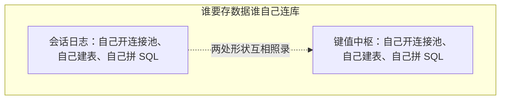

照录出来的两份一定会分叉：

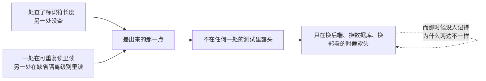

更要紧的是调用方：

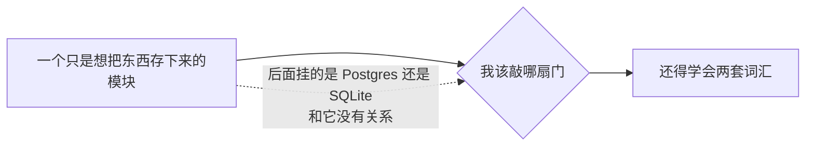

所以这一层的全部意义是一句话：**只有它碰数据库，只有它写 SQL。**

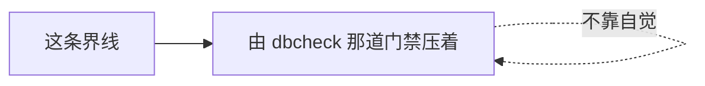

---

## 架构：依赖方向是反的

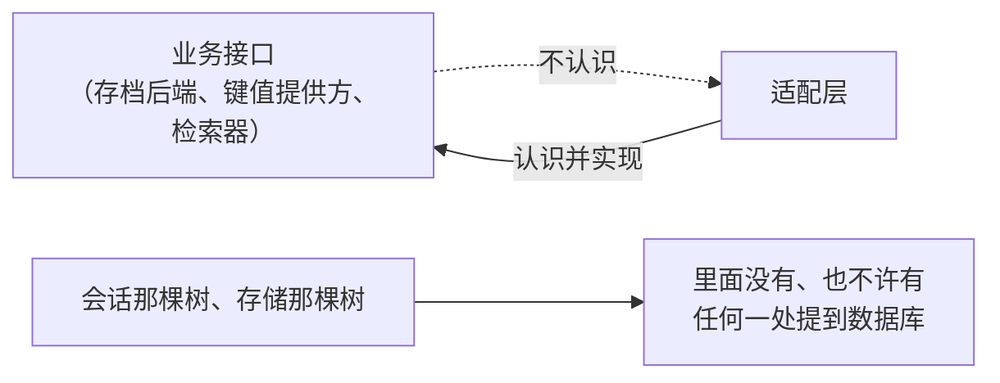

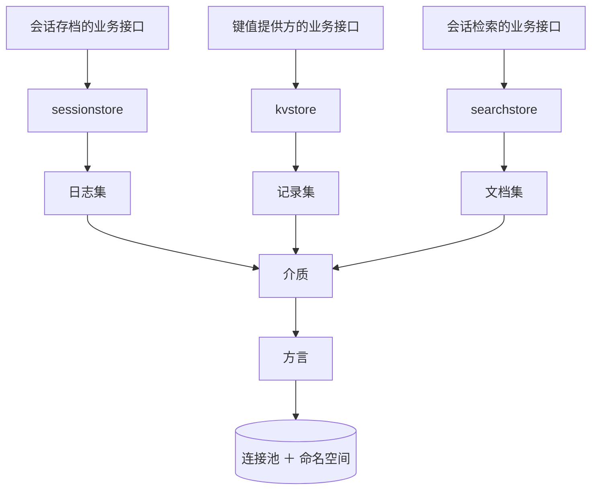

### 对外只有三种形状，都不带领域含义

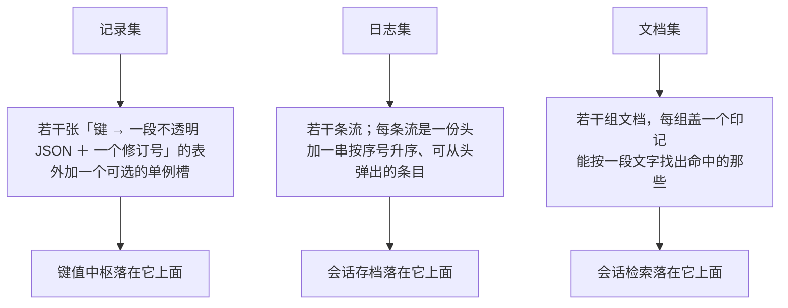

三种形状都不曾要求这一层认识「会话」「设置」这些词。

### 不提供「随便写一句 SQL」

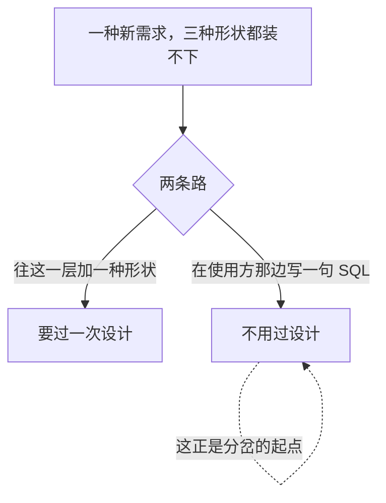

---

## 介质：一个连接池加一个命名空间

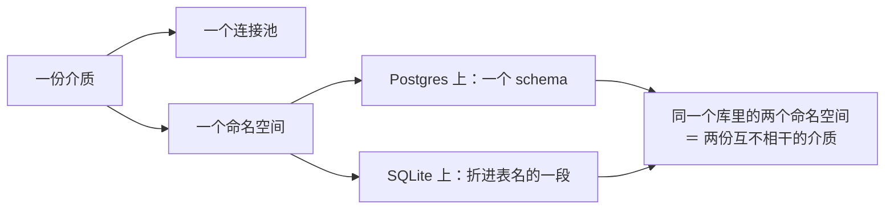

### SQLite 上为什么不用 ATTACH

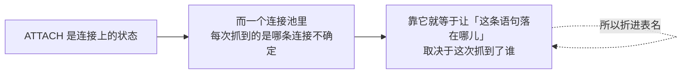

### 实例标识：让两份介质发不出相等的令牌

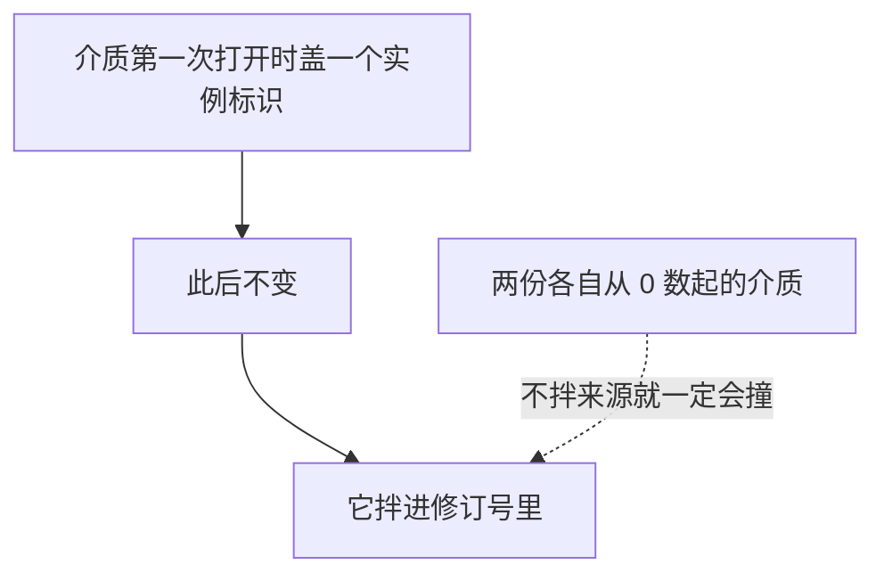

---

## 记录上的修订号

每一条记录随身带一个修订号，写入可以附一个前置条件：

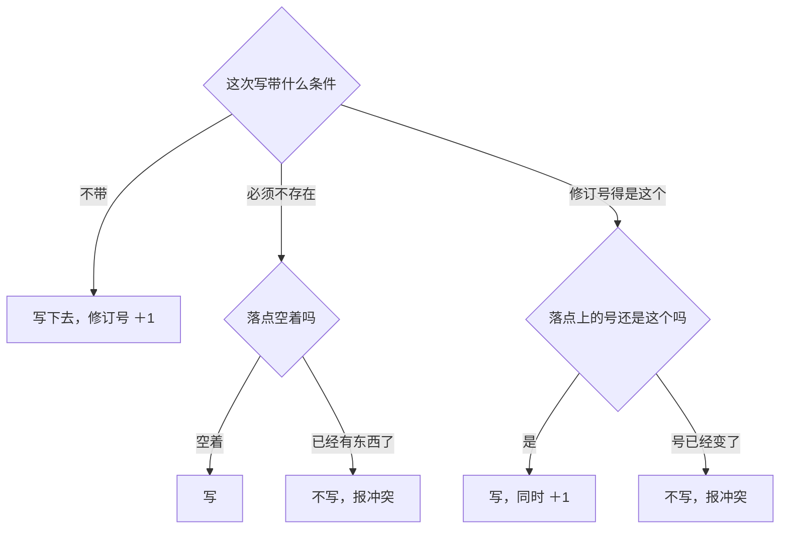

### 三条都是一句话完成

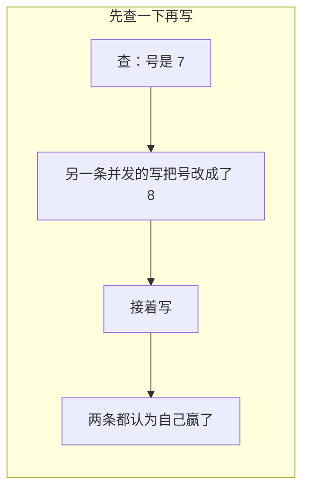

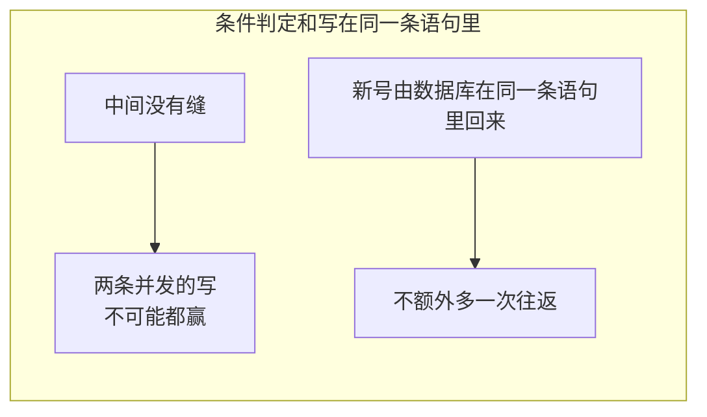

上层拿这个号挡多副本之间的丢更新，细节见[存储、文件与附件](storage.md)；这一层只负责把三种条件落成语句。

### 版面号从 1 提到 2，没有写迁移

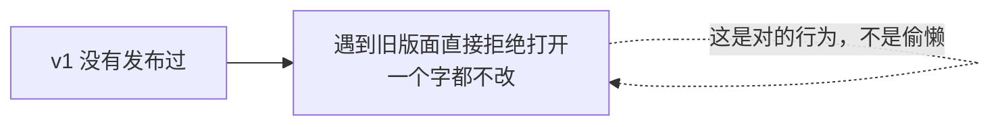

---

## 文档集：三种形状里唯一按内容找的那种

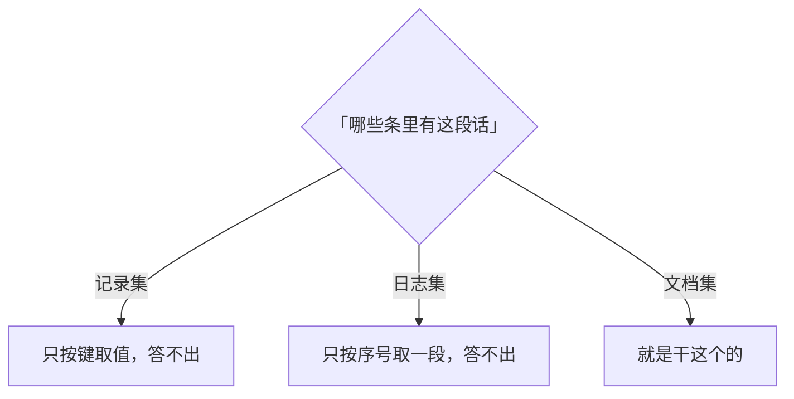

### 整组换，换的时候盖印记


### 一次查找带什么

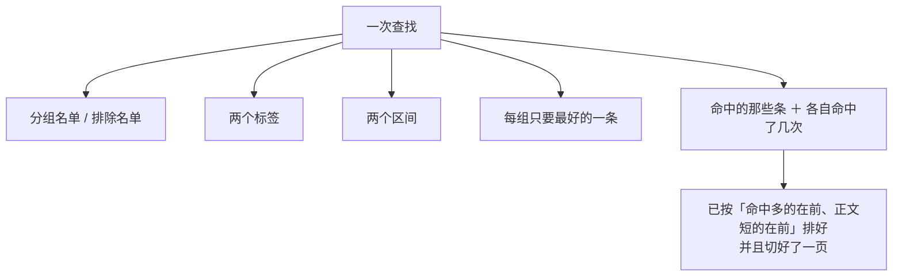

### 比对是字面的，这是故意的

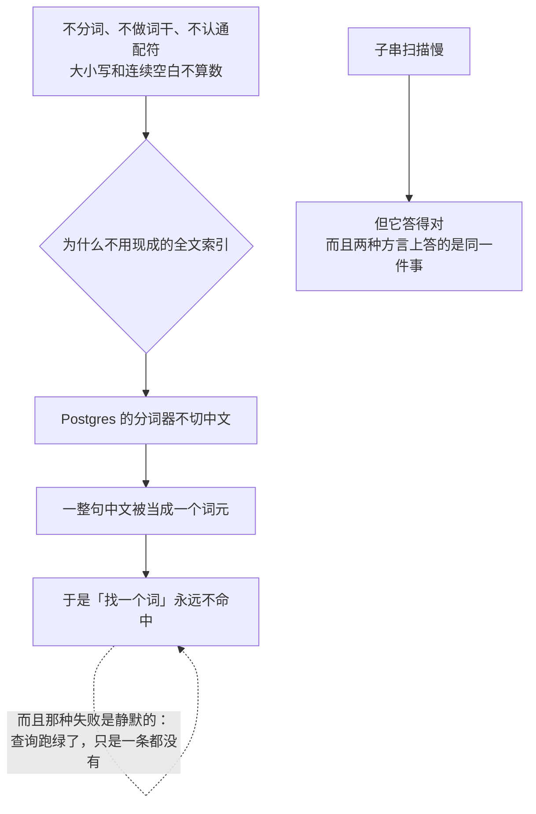

### 排序和「每组只要最好的一条」都在库里做

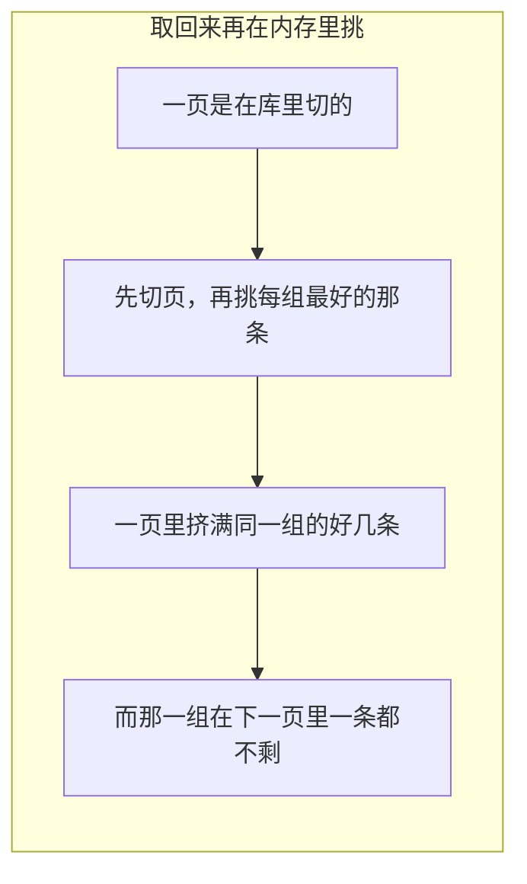

---

## 两种方言

```mermaid
flowchart LR
    A["各家数据库会分歧的那几处"] --> A1["占位符"]
    A --> A2["限定标识符"]
    A --> A3["咨询锁"]
    A --> A4["只读事务的隔离级别"]
    A --> A5["取大的那个函数"]
    A1 --> B["全收在方言后面"]
    B --> C["加一种数据库 ＝ 加一个方言<br/>不是加一个包"]
```

| | Postgres | SQLite |
|---|---|---|
| 命名空间 | 建 schema，限定成两段 | 折进表名，一个带点的表名 |
| 占位符 | 带序号的那种 | 问号，原样 |
| 建表并发 | 一次咨询锁 | 空操作，写锁就是布局锁 |
| 读事务 | 明说可重复读 ＋ 只读 | 退回缺省——它本身就是快照 |
| 标识符上限 | 63 字节，超了**静默截断** | 无上限 |
| 写完回修订号 | 同一条语句里返回 | 同一条语句里返回，需较新版本 |

### 驱动不在这一层里

```mermaid
flowchart LR
    A["用哪个驱动"] --> B["部署期的选择"]
    B --> C["装配方自己开出连接池<br/>从配置传进来"]
```

### SQLite 有两件事这一层管不了

```mermaid
flowchart TD
    A["得由装配方在连接串上设"] --> B1["等锁超时<br/>否则两条写事务撞上时<br/>后到的那条当场失败而不是等一等"]
    A --> B2["外键开关<br/>否则条目表那道外键不生效<br/>Postgres 那一轮拦得住的东西这一轮拦不住"]
```

```mermaid
flowchart LR
    A["这两件都是连接上的状态<br/>不是语句里的东西"] --> B["所以它们进不了方言"]
    C["一个连接池里<br/>每条连接各自带着自己的设置"] --> D["这一层没有「对每条新连接执行一句」的抓手"]
    D -.->|"硬做只会做出一个<br/>漏掉一部分连接的假保证"| D
```

---

## 生命周期与并发

```mermaid
flowchart TD
    A["打开：建立或校验版面"] --> A1["版面号对不上直接拒绝<br/>而不是就地升级"]
    B["同名单元不许重开"] --> B1["关掉单元释放单元<br/>关掉介质关掉连接池"]
    C["存储后端的关闭契约是「释放介质」"] --> C1["所以键值后端关掉时<br/>会把介质连同连接池一起关掉"]
    C1 --> C2["一份介质因此归一个后端所有"]
    D["所有读写响应取消"] --> D1["取消不会被翻译成「记录不存在」"]
```

### 一次写就是一个事务

```mermaid
flowchart LR
    A["要么整批提交"] --> B["要么一条都没有"]
    B --> C["所以会话存档里不存在断尾"]
    C --> D["那个「这份日志被截断过」的记号<br/>恒为空"]
```

### 修订号是来源限定的

```mermaid
flowchart LR
    A["实例标识 ＋ 单元名 ＋ 计数器"] --> B["用来判断同一份物理日志<br/>在两次观察之间有没有变过"]
    C["从最老那头弹掉一段"] --> D["不动修订号"]
    D -.->|"被弹掉的那一段<br/>不算「内容变了」"| D
```

---

## 失败语义

```mermaid
flowchart TD
    A["出了岔子"] --> B{"这一层认得吗"}
    B -->|"认得"| C["配一个哨兵"]
    C --> C1["流不在 / 头冲突 / 版面版本不符<br/>名字不合法 / 介质里的值坏了<br/>写的前置条件不成立 / 已经关掉 / 同名单元已打开"]
    B -->|"认不得"| D["连不上库、事务被中止、死锁重试"]
    D --> D1["原样往上冒<br/>只裹一层说明是哪一步"]
```

```mermaid
flowchart LR
    A["键值适配层"] --> A1["把哨兵翻成存储那套封闭分类码<br/>翻不出来的原样上冒"]
    B["存档适配层"] --> B1["解不回来的会话头、序号对不上、<br/>身份与流名不符 → 判成损坏"]
```

### 日志集不校验 JSON，记录集校验

```mermaid
flowchart TD
    A["日志集追加时不看头和负载是不是合法 JSON"] --> B["这一层只搬字节，语义在适配层判"]
    B --> C["坏数据因此读得出来<br/>也判得出来"]
    D["记录集相反：写入前要求值是合法 JSON"] --> D
```

### 值列一律用文本类型

```mermaid
flowchart LR
    A["不用二进制 JSON 那种列"] --> B["它拒收一个特定的空字符转义"]
    B --> C["而会话事件里出现得了那个字符"]
```

---

## 测试跑在哪种库上

```mermaid
flowchart TD
    A["这一层每一行代码<br/>都要一个真的数据库才执行得到"] --> B{"如果测试要靠外部服务才跑得起来"}
    B --> C["在开发机上永远跳过"]
    B --> D["在 CI 上永远只由一个环境变量决定跑不跑"]
    C --> E["于是「跑绿了」和「一行没跑」长得一模一样"]
    D --> E
```

```mermaid
flowchart LR
    A["缺省：落在一个临时库文件上的 SQLite"] --> B["整批用例跟着常规测试一起跑<br/>不必先起一台库"]
    C["设了 Postgres 连接串"] --> D["同一批用例体，换一种方言"]
```

### 为什么两种都要跑得过

```mermaid
flowchart TD
    A["这批用例压的正是两边会分歧的地方"] --> A1["冲突写入的语义"]
    A --> A2["只读事务里的快照"]
    A --> A3["外键与主键冲突"]
    A --> A4["并发建表"]
    B["而一种方言自己跟自己"] -.->|"是没有分歧的"| B
```

### 要求 Postgres 却没给连接串：失败，不退回

```mermaid
flowchart LR
    A["退回 SQLite"] --> B["那正是 CI 上库容器没起来的样子"]
    B --> C["不拦住的话<br/>一整批本该压两种方言的用例只压了一种"]
```

### 选库这件事收在哪儿

```mermaid
flowchart TD
    A["夹具收在 internal 底下"] --> A1["键值适配层和存档适配层共用"]
    B["这一层自己的测试写在包内<br/>（要够得着未导出的东西）"] --> B1["引夹具会成环<br/>所以那边留着一份自己的"]
    C["为什么进 internal"] --> C1["用得着它的只有这棵子树<br/>对外发布一个「挑测试跑在哪种库上」的包没有意义"]
```

### 不拿假库刷覆盖率

```mermaid
flowchart LR
    A["假库验的是<br/>「我拼出了我以为我会拼的那句 SQL」"] --> B["而这里真正会出事的地方<br/>恰恰是假库看不见的"]
```

---

## 能力边界

```mermaid
flowchart TD
    Y["这几个包做的"] --> Y1["把三种通用形状落在关系库上"]
    Y --> Y2["把各家数据库的分歧收在方言后面"]
    Y --> Y3["给三道业务接口各配一个生产实现"]
    N["不做的"] --> N1["不建库，不做备份、迁移编排、跨区域复制"]
    N --> N2["不认识「会话」「设置」这些词<br/>只见到流、条目、表、键"]
    N --> N3["不决定租户键、保留期限、加密和访问控制"]
    N --> N4["不做倒排索引<br/>要真正的全文索引是换一种介质"]
    N --> N5["不做非关系介质的入口<br/>对象存储那一路在别处"]
    N --> N6["不落本机文件"]
```

## 对应的 DSH 能力

下表由 [`docs/packages.md`](../packages.md) 与 [能力覆盖表](../portmap/capability-coverage.tsv) 机器 join 得到：本篇覆盖的 Go 包，承接的是上游 DSH 的哪几条能力，以及各自还缺什么。落点列由源码里的 `// 源:` 注释反查，不是手写的。

| 上游能力 | DSH 包 | 裁决 | 落在哪个 Go 包 | 这里缺什么 |
|---|---|---|---|---|
| 存储中心SQLite后端，单个数据库提供kv facet | `storage/storage-sqlite` | 取形重写 | `adapter/datastore` | 取键值怎么映射成表、迁移怎么走；后端已定 Postgres |
| SQL 方言底座：把键值与日志映射成表，Postgres 与 SQLite 共用一套语句 | （无上游出处） | 本仓库自有 | `adapter/datastore` | 替代 storage/storage-sqlite。服务端无磁盘，后端定 Postgres |
| 挑测试跑在哪种库上的夹具 | （无上游出处） | 本仓库自有 | `adapter/datastore/internal/dbtest` | 只有 datastore 子树用，收进 internal |
| 键值存储后端 | （无上游出处） | 本仓库自有 | `adapter/datastore/kvstore` | storage 契约的生产实现 |
| 会话日志的存储后端 | （无 DSH 出处） | 本仓库自有 | `adapter/datastore/sessionstore` | sessionlog 契约的生产实现 |
| 会话检索后端 | `session-query/session-query-sqlite` | 取形重写 | `adapter/datastore/searchstore` | feature/sessionquery 的检索实现，索引落在文档集上 |

## 相关源码

| 路径 | 内容 |
|---|---|
| `adapter/datastore/medium.go` | 介质、命名空间、版面、实例标识、单元注册 |
| `adapter/datastore/records.go` | 记录集：表、键值、单例槽、修订号与条件写 |
| `adapter/datastore/logs.go` | 日志集：流、条目、追加、弹出 |
| `adapter/datastore/documents.go` | 文档集：整组换、按一段文字找、命中计数与排序 |
| `adapter/datastore/dialect.go` | 各家数据库分歧处的收口，Postgres 与 SQLite 两支 |
| `adapter/datastore/error.go` | 本层哨兵 |
| `adapter/datastore/internal/dbtest/` | 「这一轮跑在哪种库上」，两个适配层的测试共用 |
| `adapter/datastore/kvstore/` | 记录集 → `storage.KVProvider` |
| `adapter/datastore/sessionstore/` | 日志集 → `feature/persistence.Backend` |
| `adapter/datastore/searchstore/` | 文档集 → `feature/sessionquery.Searcher` |
| `internal/devtools/dbcheck/` | 把着这条界线的门禁 |

## 深入阅读

[存储、文件与附件](storage.md) · [移植与文档门禁工具](migration-tools.md)
