# 文件系统

对应包：`fs`、`fs/fstest`、`adapter/objectstore`

## 定位

模型干活离不开读写内容：看一眼某份文档、改掉其中一段、把结果存回去。麻烦在于——**这套服务跑在没有硬盘的地方**。

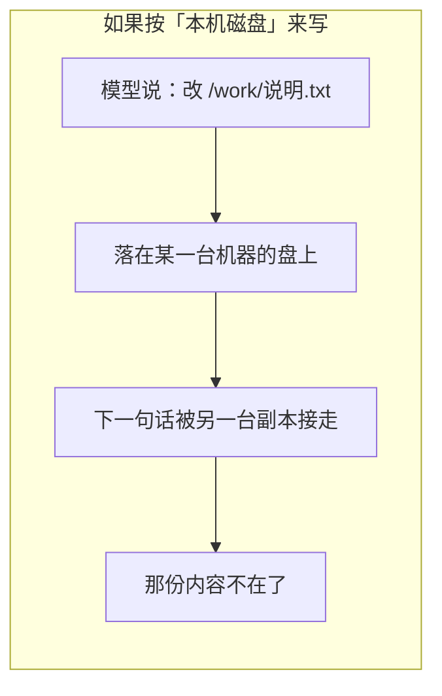

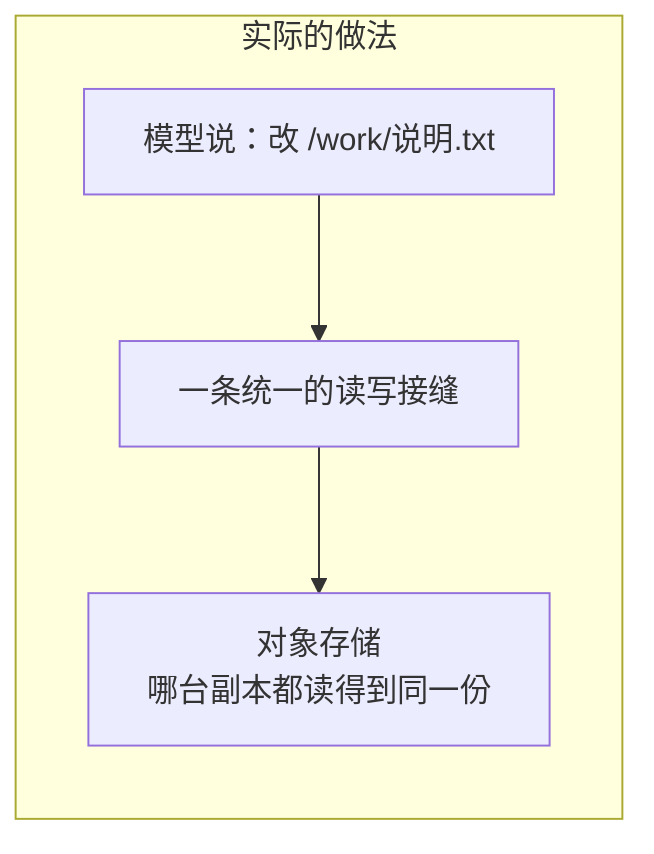

服务端没有硬盘、也没有目录这个概念，这是既定前提而不是猜测：**要能多副本部署，内容就不能落在某一台机器上**。

所以「文件系统」这个词在这里指的是**一套说法**，不是一块盘：

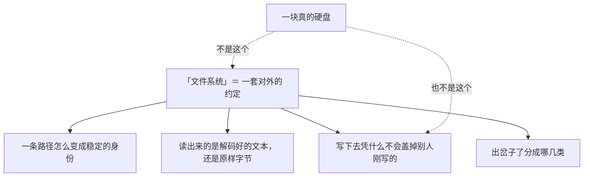

这条接缝存在的全部理由，是让业务代码只认一种说法：

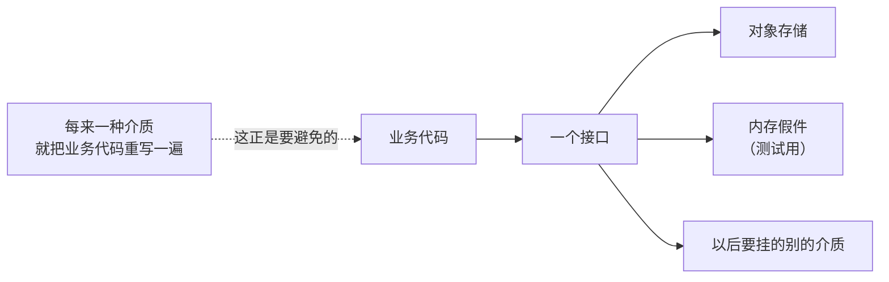

---

## 架构

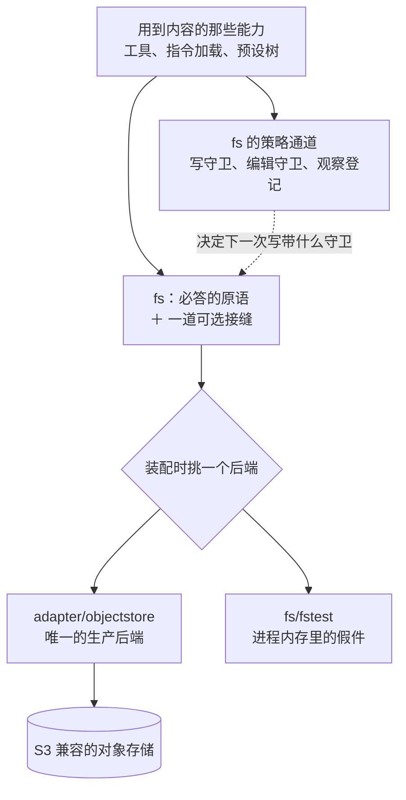

三个包的分工：

| 包 | 它管的 | 它明确不管的 |
|---|---|---|
| `fs` | 这条接缝答应了什么：路径解析、读、列、原子写、字面编辑、失败分类 | 内容真正放在哪儿 |
| `adapter/objectstore` | 把这套说法兑现在 S3 兼容的对象存储上 | 本机磁盘、沙箱、子进程 |
| `fs/fstest` | 一份**真能读写**的内存假件，供各包测试当被试 | 生产落地；进程一停全没 |

### 必答的那些，和一道可选接缝

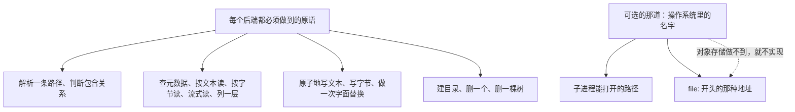

**为什么「操作系统里的名字」要单独拆一道接缝。** DSH 那份 TypeScript 把这两件事和别的写在同一个抽象类上，因为它那边每个后端都架在一份真的文件系统上。这里不是。逼着对象存储也实现，只剩三种写法，三种都坏：

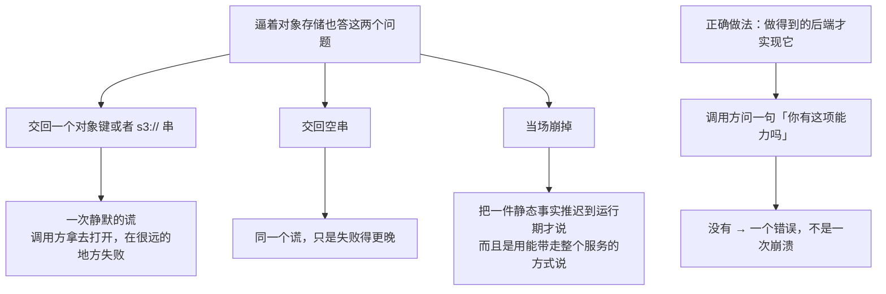

这道接缝本仓库**目前没有调用方**：会用到它的那一支（起子进程、拼命令行）整支在裁决里是范围外。留着是为了将来有人自己挂本地后端时，有个说得清的位置。

---

## 一次读写要走的四步

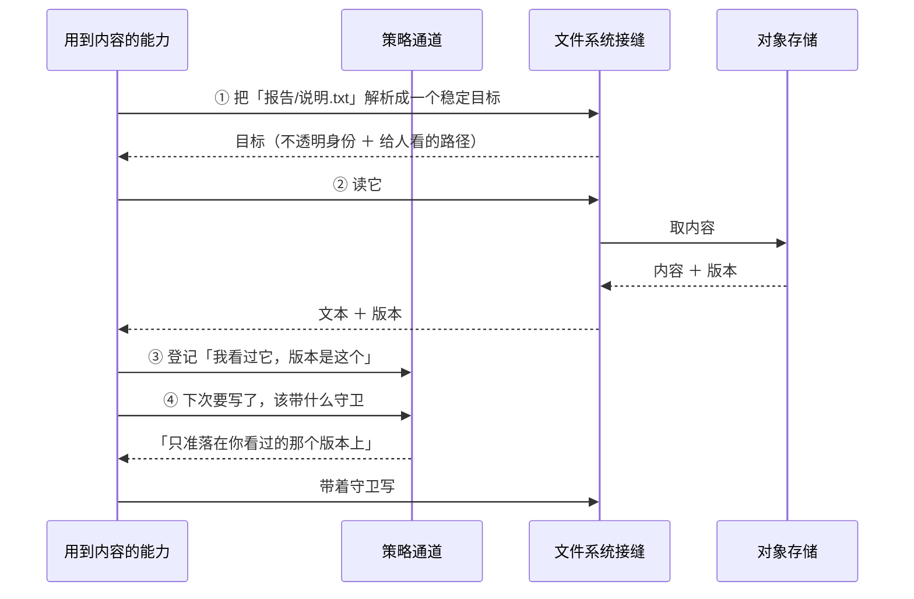

### 身份是不透明的，看不出它长什么样

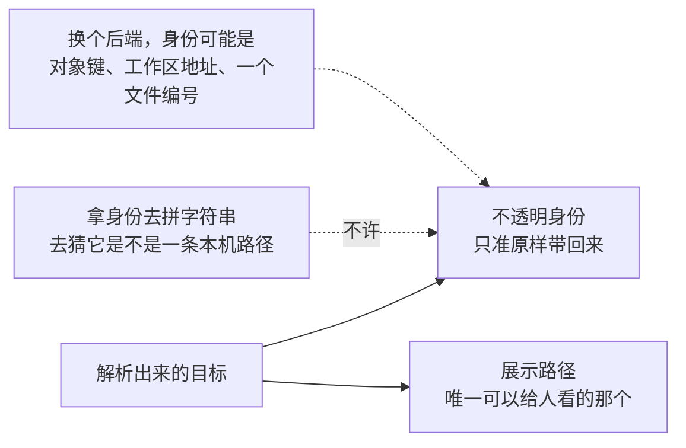

版本也是同一套规矩：一个只能原样交回去的凭据，谁都不许解释它。

### 越界要在「修好」之前就拦住

一个桶里的一片前缀圈出一个执行世界，同一个桶里可以放很多个世界，互相看不见。

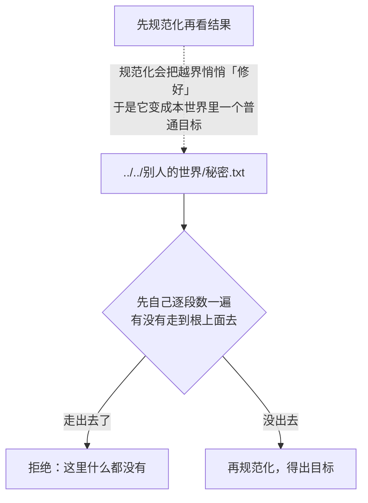

### 判包含关系一定要带上那道斜杠

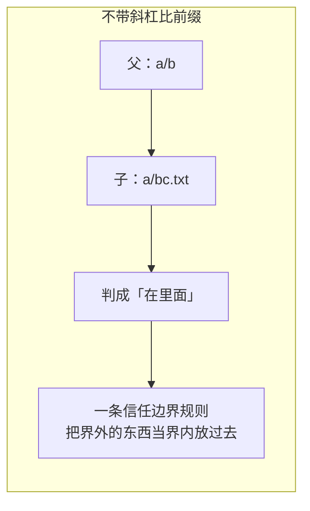

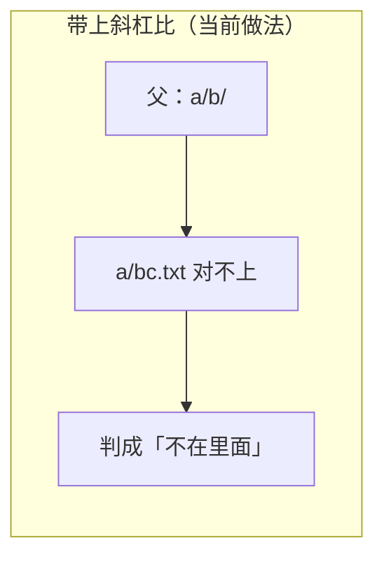

---

## 写：凭什么不会盖掉别人刚写的

这是整条接缝最要紧的一件事，所以单开一节。


### 三种写法，各拦各的

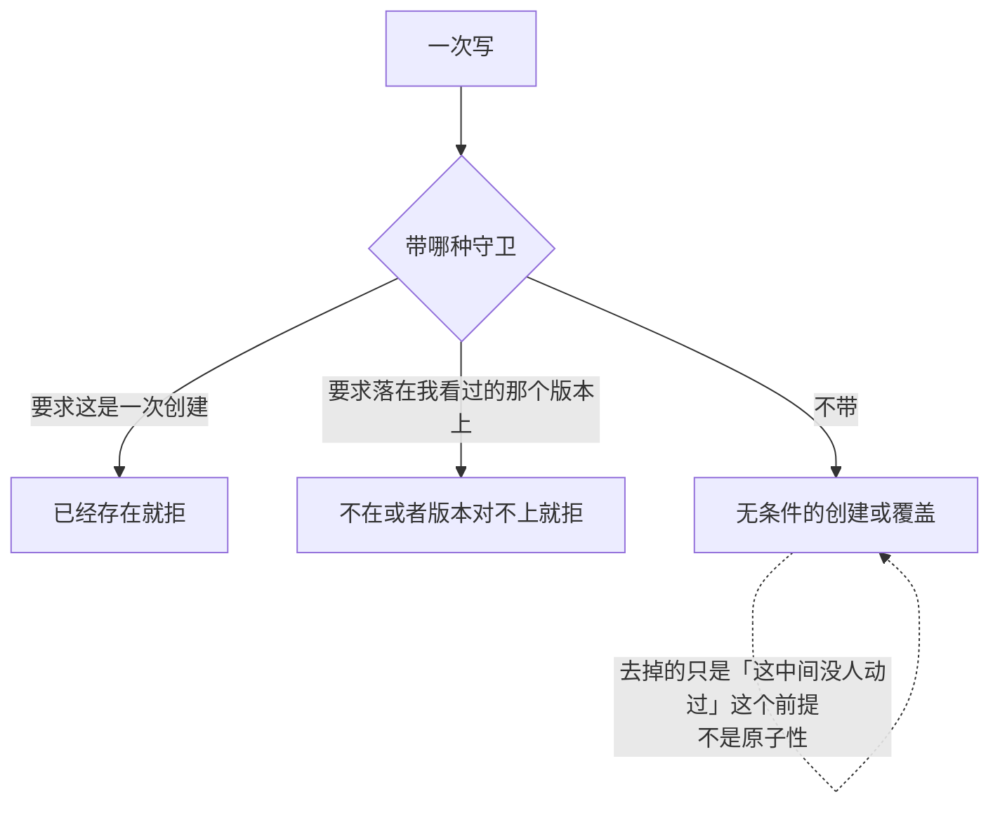

**「无条件」不等于「随便写、写坏了算了」。** 一次无守卫的写照样是整份原子发布的：读的人要么看到旧的整份，要么看到新的整份，永远看不到半份。

### 守卫必须由服务端保证，不能自己先探一下

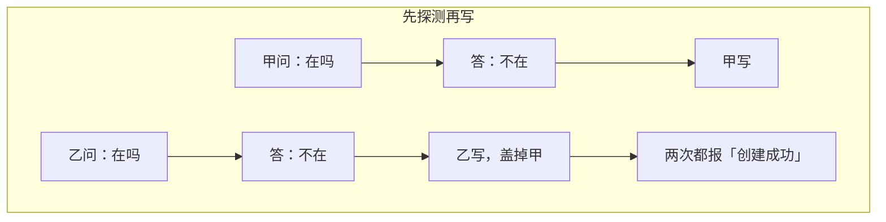

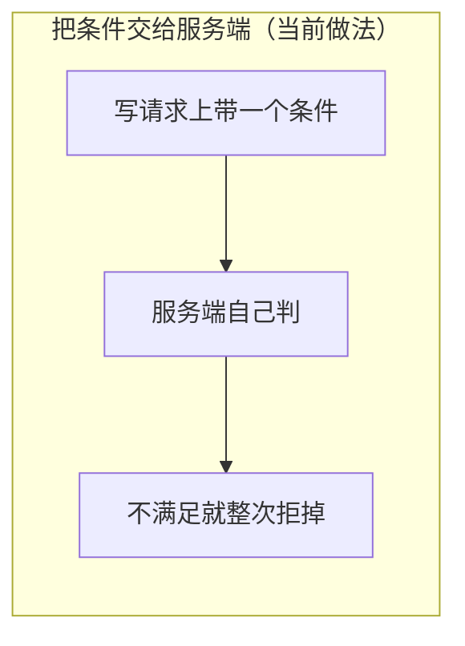

### 但要先确认服务端真的认这个条件

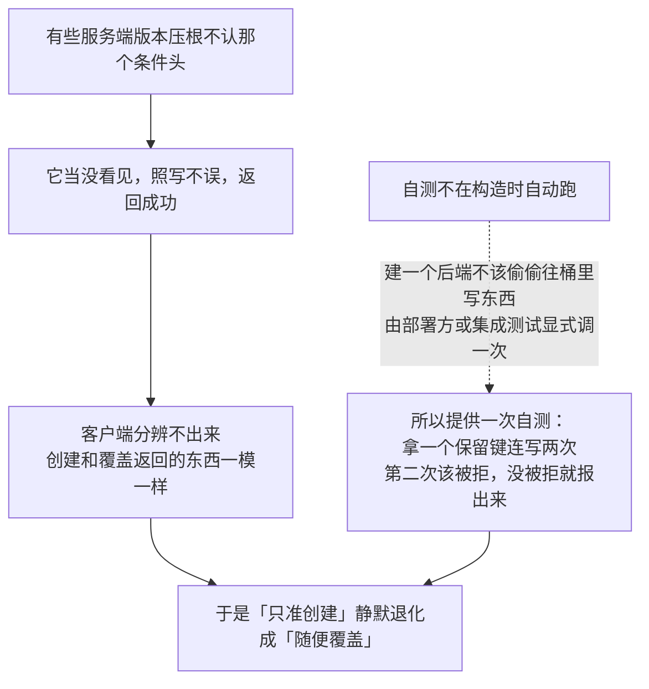

### 编辑：没有临界区，就用乐观并发换一个

接缝要求「校验版本 → 匹配那段字面文本 → 重写」三步不许被人插进来。对象存储上没有临界区可用：

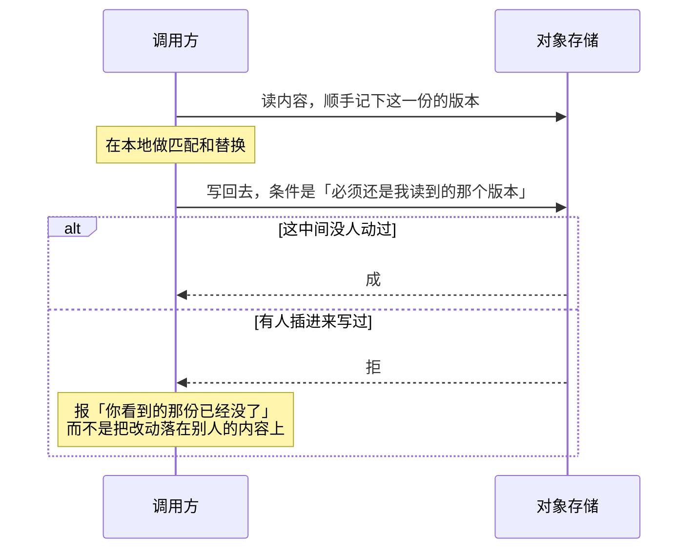

**版本校验一定要排在字面匹配之前。** 顺序反了的话，内容陈旧会被报成「找不到你要替换的那段字」：

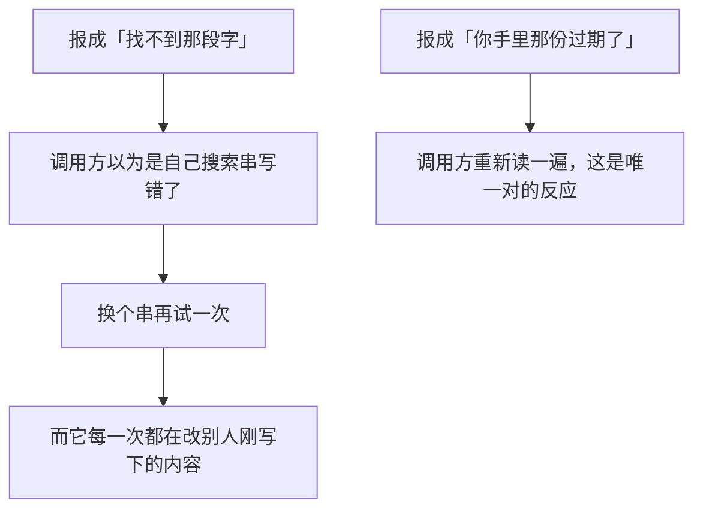

### 一处还是多处，是硬判据

```mermaid
flowchart TD
    A["要替换的那段字面文本"] --> B{"匹配到几处"}
    B -->|"零处"| C["报：找不到"]
    B -->|"恰好一处"| D["换掉"]
    B -->|"多处，且没说「全换」"| E["报：有歧义"]
    B -->|"多处，说了「全换」"| F["全换掉"]
    G["「多处就改第一处」"] -.->|"调用方会以为改完了<br/>而剩下几处还是旧的"| E
```

---

## 策略通道：谁来决定下一次带什么守卫

守卫不是写的人当场拍脑袋定的，而是**问出来**的。接缝上留着三个通道：

```mermaid
flowchart TD
    P["策略通道"] --> P1["写之前：这次该带什么守卫"]
    P --> P2["编辑之前：这次该带什么版本守卫"]
    P --> P3["读之后：登记一次「我确实看过它」"]
    P1 --> R1["单槽决定"]
    P2 --> R1
    P3 --> R2["扇出：每一个记录方都要被调到"]
```

### 两个决定是单槽的，不是合起来算

```mermaid
flowchart LR
    A["按登记顺序挨个问"] --> B{"这一个给答案了吗"}
    B -->|"给了"| C["这次决定归它，后面的不再问"]
    B -->|"说「不归我」"| A
    D["一个都没给答案"] --> E["这次写是无条件的"]
    F["把两个守卫合起来"] -.->|"两个守卫合不出第三个守卫<br/>只会互相覆盖"| C
```

中途有人报错就**当场中止，不退回无条件写**：

```mermaid
flowchart TD
    A["某个决定方报了错"] --> B["接着往下问"]
    B --> C["后面没人给守卫"]
    C --> D["这次写变成无条件的"]
    D --> E["它一定会成功<br/>然后盖掉别人刚写的"]
    F["所以：报错就地失败"] -.->|"报错的那个<br/>可能正是本该给出守卫的人"| A
```

### 观察登记失败，这次调用就得失败

```mermaid
flowchart LR
    A["登记失败却让调用继续"] --> B["后面那次带守卫的写去查登记"]
    B --> C["查不到，被拒"]
    C --> D["而现场早就过去了<br/>没人还答得上来它为什么没被观察到"]
```

这一条和凭据变更通知那边「订阅者炸了只记日志」正好相反，理由也正好相反：那边通知的是一件**已经提交**的事，这边登记的是一次**后面还要被查**的观察。

---

## 对象存储上没有目录，这件事影响了好几处

键空间是平的，路径里那些斜杠只是名字的一部分。

```mermaid
flowchart TD
    A["「a/b 是不是一个目录」"] --> B{"有没有别的键<br/>以 a/b 加斜杠开头"}
    B -->|"有"| C["是目录"]
    B -->|"没有"| D["不是"]
    E["于是：空目录在这里不存在"] --> D
    F["于是：目录没有版本<br/>那里没有任何东西可写"] --> C
```

```mermaid
flowchart LR
    A["建目录"] --> B["在这个后端上什么都不做<br/>只把路径解析出来交回"]
    B --> C["接下来那次写本来就不要求上级先存在"]
    D["为它建一个零字节的占位对象"] -.->|"故意不做：<br/>一个被清空的目录会永远显示成还在"| B
    E["这个方法仍然留在接缝上"] -.->|"因为本机磁盘后端做不到「什么都不做」"| A
```

删一棵树是「一次失败的写入什么都不留下」那条撤销路唯一的依靠，所以它中途遇到删不掉的**不停**：

```mermaid
flowchart TD
    A["逐个删这棵树"] --> B{"有一项删不掉"}
    B -->|"当场停下"| C["留下一半<br/>而调用方通常已经没别的手段清场了"]
    B -->|"继续往下删，最后一并报失败"| D["尽可能清干净"]
    D -.->|"当前做法"| D
```

---

## 文本和字节，两条故意分开的路

```mermaid
flowchart TD
    R["要读一份内容"] --> Q{"要的是什么"}
    Q -->|"能匹配、能显示的文本"| T["文本路：解码、行尾规范化、二进制当场拒掉"]
    Q -->|"原样的字节：图片、压缩包、要算摘要的东西"| Y["字节路：一个字节都不碰"]
    T --> T1["代价：真要保留 CRLF 的文件会被改掉"]
    Y --> Y1["代价：拿不到任何文本语义"]
```

行尾规范化必须**进出两侧都做**，否则「写进去什么、读出来什么」就不是一个往返，字面匹配也就无从谈起。

### 流式读要压住两种「还不能交出去的尾巴」

```mermaid
flowchart TD
    A["一块字节读上来"] --> B{"末尾是不是半个字符"}
    B -->|"是"| C["留到下一块再解"]
    B -->|"否"| D{"末尾是不是一个回车"}
    D -->|"是"| E["压住：下一个字节是换行的话<br/>这两个要折成一个"]
    D -->|"否"| F["交出去"]
    C -.->|"直接解会解出乱码<br/>于是一份完好的中文文件被报成二进制"| C
```

### 超过上限，宁可报错也不交半份

```mermaid
flowchart LR
    A["内容超过了这次读取的字节上限"] --> B["报「太大了」"]
    C["交回被截断的那份"] -.->|"它看上去是成功的<br/>然后被当成完整内容去算摘要、去做匹配"| B
```

同一条规矩在流式那条路上再守一遍：读到一半发现超了，立刻停，而不是把剩下的读完。取消也一样，**块与块之间**就要认。

---

## 那份内存假件是干什么的

```mermaid
flowchart TD
    A["要验一条接缝答应了什么"] --> B["就得有一个能真的读写的被试"]
    B --> C["守卫、上限、单处匹配这几条语义<br/>假件里都真的实现了"]
    C -.->|"因为它们正是契约里写着的<br/>而实现方最容易漏掉的部分"| C
```

它和别处那些「只实现两三个方法、其余一律崩掉」的窄假件是两种东西，不互相取代：

```mermaid
flowchart LR
    subgraph W["窄假件"]
        W1["只答两三个方法"] --> W2["用到别的就当场炸"]
        W2 --> W3["价值：偷偷用了别的方法会被抓出来"]
    end
    subgraph B["这份宽假件"]
        B1["什么都答得上"] --> B2["炸不出来"]
        B2 --> B3["价值：需要一棵真能读写的内容树时用它"]
    end
```

### 假件故意不模仿对象存储的局限

```mermaid
flowchart TD
    A["空目录在假件里是存在的、列得出来的"] --> B["在对象存储上不存在"]
    B --> C["两者不一致是有意的"]
    C --> D["接缝上没有哪一句话要求空目录不存在<br/>那是某一种介质的局限，不是契约"]
    E["让假件也照着装一遍"] -.->|"等于把后端特有的毛病<br/>伪装成消费方可以依赖的语义"| D
```

---

## 生命周期与并发

```mermaid
flowchart TD
    A["后端不拥有传给它的连接和配置"] --> A1["建的时候不做任何网络往返"]
    A1 -.->|"「建的时候好好的、用的时候坏了」和<br/>「建的时候就坏了」，调用方要写的处理是同一套"| A1
    B["后端自己没有可变状态"] --> B1["建好之后随便几条并发线一起用"]
    C["并发一致性全靠服务端的条件写"] --> C1["不靠任何进程内的锁"]
    C1 -.->|"进程内的锁管不住另一台副本"| C1
    D["策略那三份订阅名单是状态"] --> D1["所以它是一个具体类型，不是接口"]
    D --> D2["订阅按登记顺序排，不用无序容器"]
    D2 -.->|"「谁先被问到」直接决定结果<br/>无序会让同一份装配每次跑出不同的守卫"| D2
```

还有一处容易漏：判断「这个目录底下有没有东西」时，拿到第一条就该把列举停掉，否则一个很大的目录会让后台一直翻页翻下去。

---

## 失败语义

失败分成一组**封闭的**、可以逐个列全的类别，让重试、提示、界面照着它分派：

```mermaid
flowchart TD
    A["出了岔子"] --> B{"哪一类"}
    B -->|"不存在 / 不是目录 / 不是常规文件"| C["各报各的"]
    B -->|"不是能按文本读出来的内容"| C
    B -->|"超过了这次的字节上限"| C
    B -->|"版本对不上 / 要求的前置观察不成立"| D["冲突类：调用方必须重新读一遍"]
    B -->|"要替换的字面文本没匹配上 / 匹配到多处"| C
    B -->|"没权限 / 底层读写失败 / 被取消"| C
    E["一段自由文本"] -.->|"分派它只能做字符串匹配<br/>改一句文案就静默失配"| B
```

三条不留余地的规矩：

```mermaid
flowchart LR
    A["冲突绝不自动重试，也绝不改成覆盖"] --> A1["重新读版本是调用方的事"]
    B["取消要在别的判断之前认出来"] --> B1["否则重试层会去重试一个人已经放弃的操作"]
    C["超限绝不交回截断的内容"] --> C1["一份看上去成功的半份内容，比一次失败坏得多"]
```

底层原因照样挂着，但它只供排查用——**分派一律看类别**，因为底层错误在不同介质上根本不是同一种东西。

---

## 能力边界

```mermaid
flowchart TD
    Y["这几个包做的"] --> Y1["一条统一的读写说法：解析、读、列、原子写、字面编辑"]
    Y --> Y2["一套挡得住互相覆盖的守卫"]
    Y --> Y3["一个不碰任何机器磁盘的生产落地"]
    N["不做的"] --> N1["不是本机文件接口的完整替代<br/>没有文件描述符、没有符号链接创建、没有随机位置写"]
    N --> N2["不做沙箱"]
    N --> N3["不做读取窗口、不管「这个执行体看过哪些内容」<br/>那是用它的人和策略订阅方的事"]
    N --> N4["不解释身份和版本<br/>不拼接、不比较结构、不推断背后是什么介质"]
    N --> N5["不管预设目录<br/>预设树属于部署配置，故意不走这套执行世界"]
    N --> N6["对象存储那台不是本机磁盘的镜像<br/>没有子进程，也没有 file: 地址"]
```

**沙箱那一整支判为不需要。** DSH 那份 TypeScript 在这条接缝上有一个沙箱开关和几个沙箱策略参数，本仓库一个都没有搬——沙箱整支在裁决里是范围外，而**一个恒返回「不限制」的开关，比没有这个开关更容易让人误以为它在起作用**。失败分类里那条「被沙箱挡下」仍然留着：那套分类是对外可见的，万一有人把自己的实现挂上来并报出它，接收方得认得。

**同理，读本机磁盘和读沙箱磁盘那两个后端也没有搬**：它们都碰机器资源。服务端要的是一个不碰机器的后端，那就是对象存储——所以那一个包整份是新写的，不是任何一份 TypeScript 的对译。

## 对应的 DSH 能力

下表由 [`docs/packages.md`](../packages.md) 与 [能力覆盖表](../portmap/capability-coverage.tsv) 机器 join 得到：本篇覆盖的 Go 包，承接的是上游 DSH 的哪几条能力，以及各自还缺什么。落点列由源码里的 `// 源:` 注释反查，不是手写的。

| 上游能力 | DSH 包 | 裁决 | 落在哪个 Go 包 | 这里缺什么 |
|---|---|---|---|---|
| 定义执行世界的存储原语，抽象路径解析、读取、流式读取、列出、原子写入和字面量编辑操作 | `fs/fs` | 需要 | `fs` `fs/fstest` | — |
| 对象存储后端 | （无上游出处） | 本仓库自有 | `adapter/objectstore` | 服务端无磁盘，附件与溢出内容走对象存储 |

## 相关源码

- `fs/fs.go`
- `fs/types.go`
- `fs/policy.go`
- `adapter/objectstore/`
