# 长期目标

对应包：`feature/goal`、`feature/goal/goaltool`、`feature/goal/goalcommand`、`feature/goal/goalrounddriver`

## 定位

普通对话是「人说一句，agent 答一句」。目标是另一种节奏：**人交代一件事，然后 agent 自己一轮接一轮地往下推**，直到做完、卡住，或者用光预算。

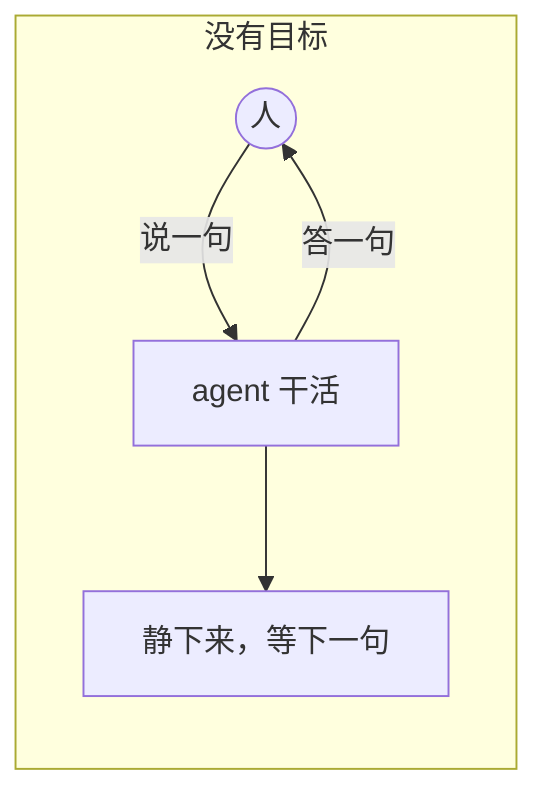

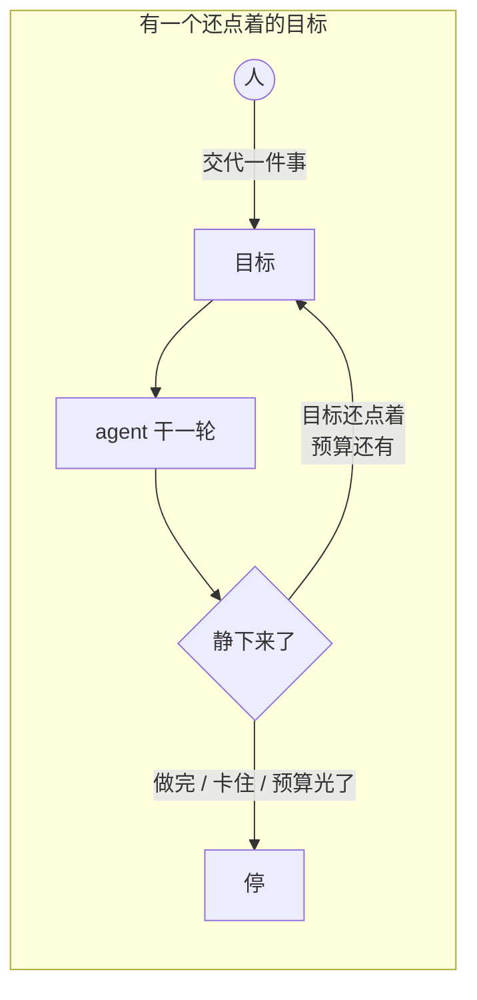

一件会自己往下推的东西，最要紧的问题不是「怎么推」，而是**谁有权让它动起来、以及它什么时候必须停**。这四个包大半的设计都在回答这两个问题。

---

## 架构

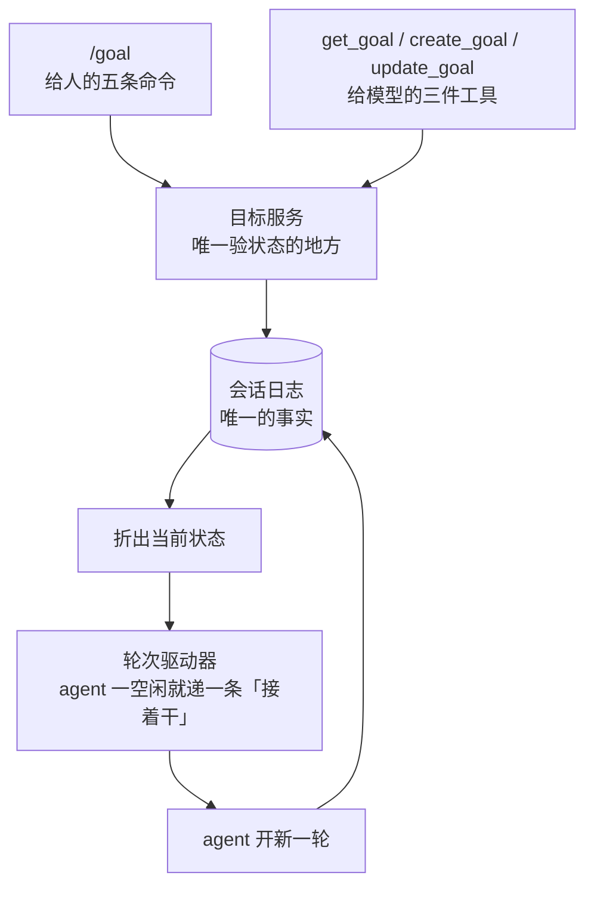

四个包的分工，一句话各自说清：

| 包 | 它管的 | 它明确不管的 |
|---|---|---|
| 目标服务 | 状态、修订号、阶段跃迁合不合法 | 谁有资格改、什么时候推 |
| 模型工具 | **这次调用够不够格** | 状态本身对不对 |
| 斜杠命令 | 人敲的这行字是什么意思、结果怎么说 | 任何状态 |
| 轮次驱动器 | 什么时候递下一条「接着干」 | 目标本身成不成立 |

---

## 唯一的事实：日志里那串变更

每一条变更都带着改完之后的**完整快照**，不是增量：


**为什么是全量而不是增量**：这样目标状态就完全不依赖收件箱怎么排、谁认领了哪一条。一段日志放在哪里折出来都一样——续会话、分叉、换一台机器读，答案都相同。

### 拿修订号挡住互相覆盖

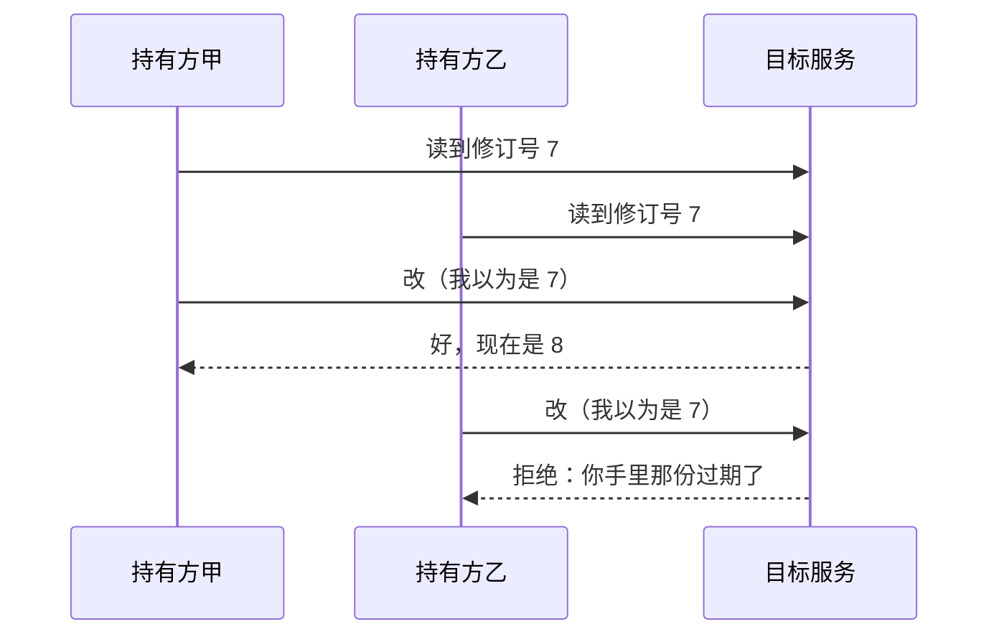

调用方每次改都得交出**它以为的那个修订号**。这条比对是唯一挡住「两个持有方各拿一份旧状态、后写的把先写的抹掉」的东西。

---

## 两条轴：阶段是耐久的，活化不是

这是这一层最容易被误解的地方，所以单开一节。

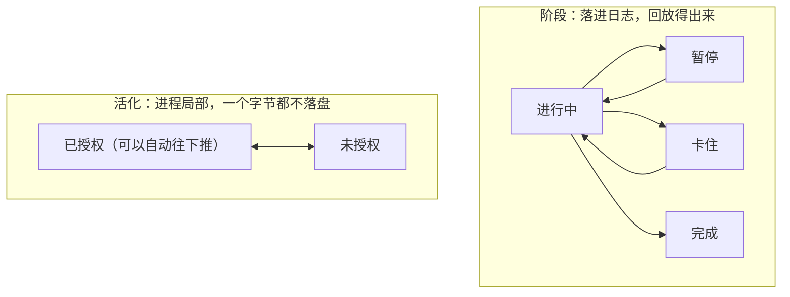

两条轴回答的是两个不同的问题：

| | 它回答的问题 |
|---|---|
| 阶段 | 这个目标**本身**还成立吗 |
| 活化 | **这个进程**此刻可以自动往下推它吗 |

### 为什么活化绝不落盘

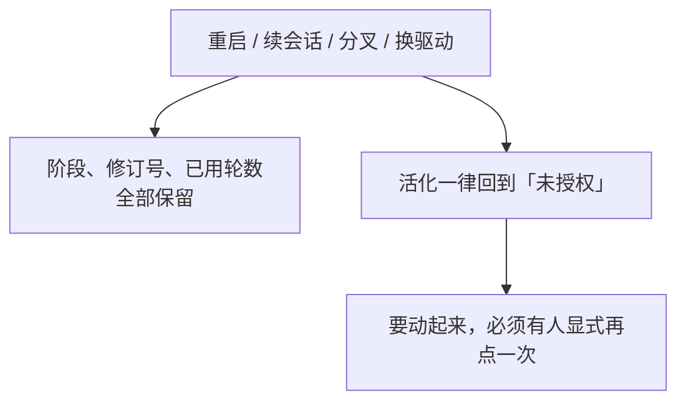

如果活化能落盘，那么一段旧日志被谁读到，那台机器就会自己开始跑起来——**一个没人盯着的进程自己动起来，是这一层最不能容忍的事**。同一条规矩还有另一半：不是本进程写的那条变更，一律打回未授权。一次分叉、一段被别的进程续上的日志，都不该让这里自己动。

驱动器装上去做的第一件事，就是把已经在场的 agent 一律打回原形——不从上一个生产方那里继承一份看不见的授权。

---

## 预算：轮数是数出来的，不是记下来的

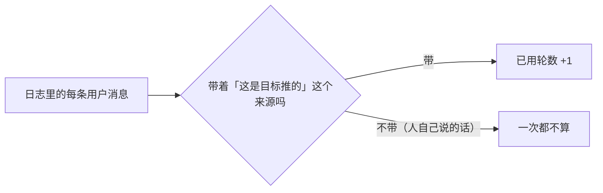

**为什么不存一个计数器**：存下来的数可以被改，数出来的数不能。那份来源标记是「这一轮是目标推的」唯一的耐久证据，所以轮数上限是一道**赖不掉**的预算。

---

## 授权：为什么模型不能自己给自己批预算

一个进行中的目标每一轮都会给模型开一个新回合。所以「建一个目标」和「把一个目标推起来」这两件事，如果模型自己就能做，它就能给自己批一份**无限**的预算。

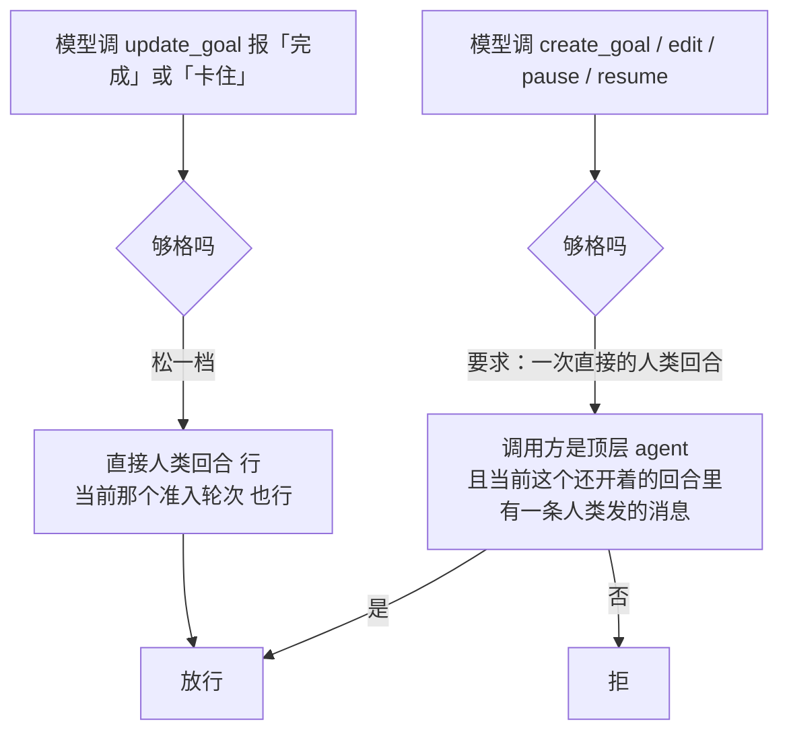

**为什么「完成」和「卡住」要松一档**：否则一个自动推进的目标永远没人能宣布它做完了——推它的是模型，而模型没资格说停。

「卡住」还多一道闸：在一个自动轮次里，非得**同一个卡点连着熬过若干轮**才准报，免得模型第一次遇上难处就把目标停掉。

这三条规矩全钉在**会话日志**上，不钉在调用参数上：

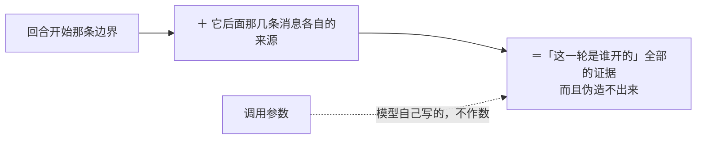

### 报完「完成」之后，模型还要说一句话

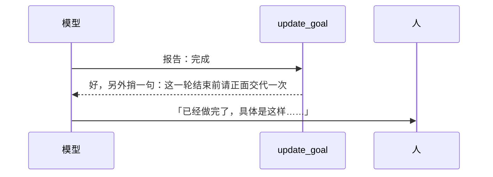

早先的做法是**硬停回合**，结果是最后一轮的产出没人转述——人只看到 agent 突然不说话了。

---

## 人和模型，两套故意不对称的入口

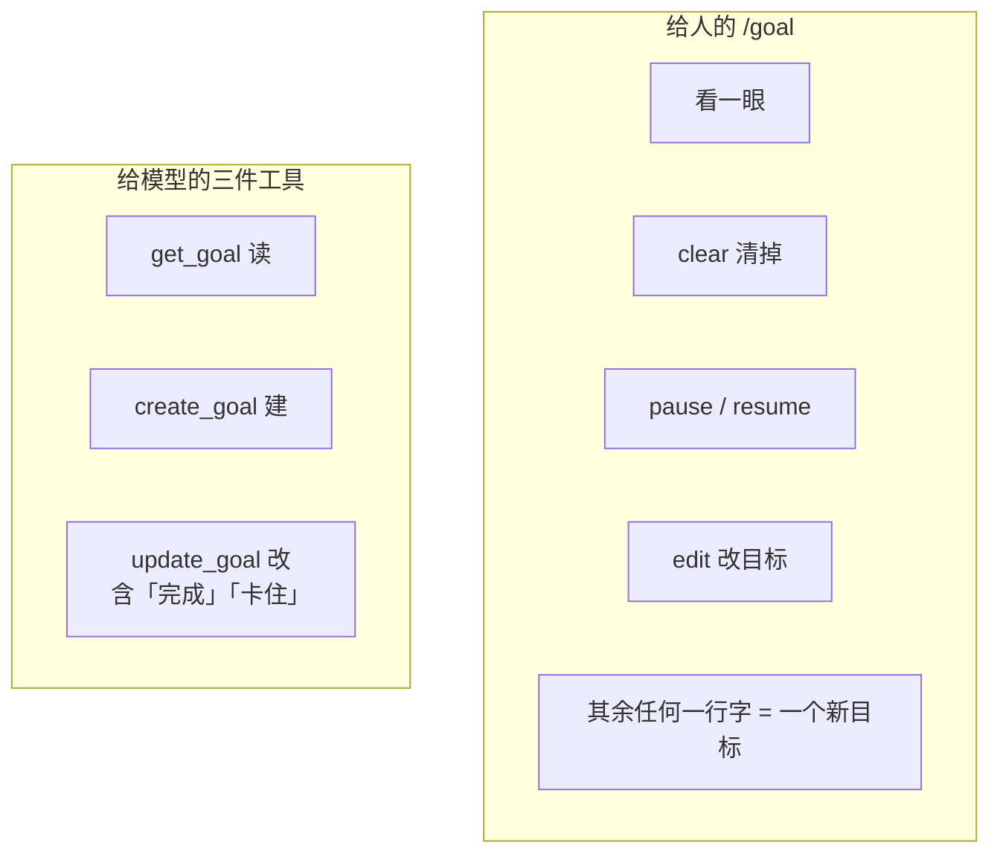

三处不对称，每一处都有理由：

| 差别 | 为什么 |
|---|---|
| 只有人这一套有 `clear` | 一个能自己清掉目标的模型，等于一个没有预算的模型 |
| 只有模型那一套能报「完成 / 卡住」 | 人不需要向自己报告进度 |
| 人这一套当场生效、直接回话，不经模型 | 它是命令，不是对话 |

### 不认识的一行字一律当成新目标

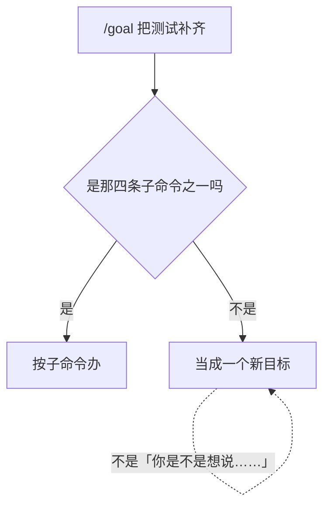

敲这一行的人不该被要求先背一张子命令表。

### 带图片的目标

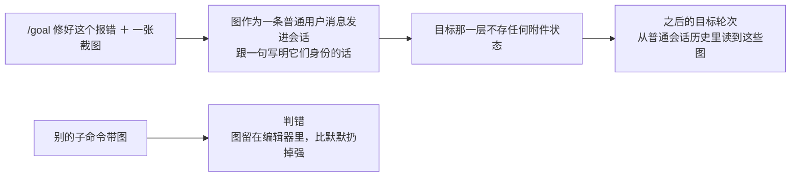

---

## 驱动器：四道边界，任何一处对不上就认输

「递一条『接着干』」这件事，从提出到落进日志之间隔着四道边界，每一道都可能被人抢在前面：

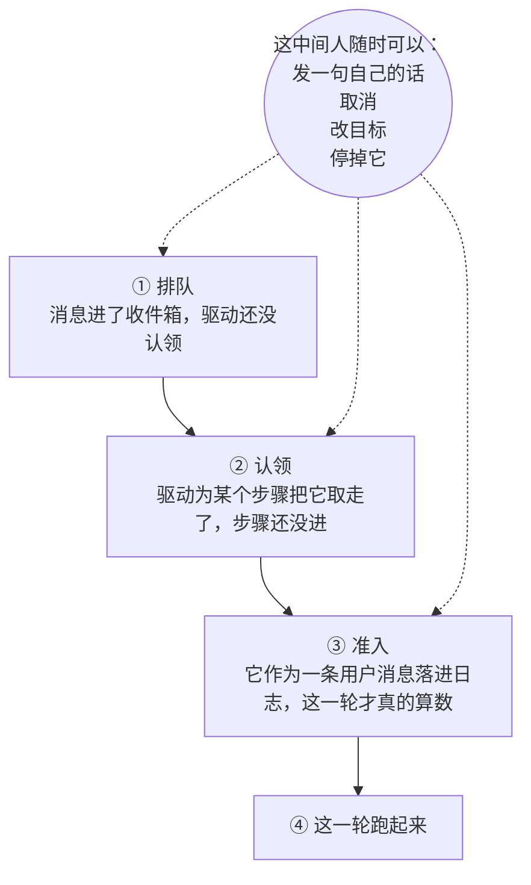

所以每一道边界上都要重新问一遍「我预定的那一轮此刻还成立吗」：

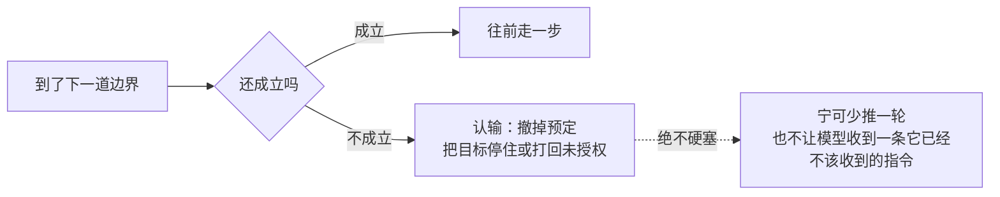

### 一条锁的规矩

DSH 跑在单线程事件循环上，那些回调之间不会交错。这里不一样——事件观察者跑在「谁追加了事件谁就跑」的那条协程上，而驱动自己是另一条协程，两边**真的会同时动同一份状态**。

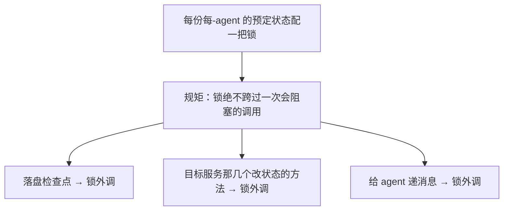

---

## 两套折日志的标准，不能混

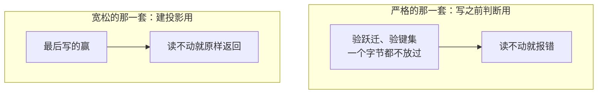

**标准可以不一样，是因为写的那一侧已经验过了。** 一条变更落进日志之前先严格折过一遍，装配处那道检查还会再拒一次。而投影这一侧要的是另一件事：**一个读不动的历史事件，不该让整份投影再也建不起来。**

---

## 生命周期与并发

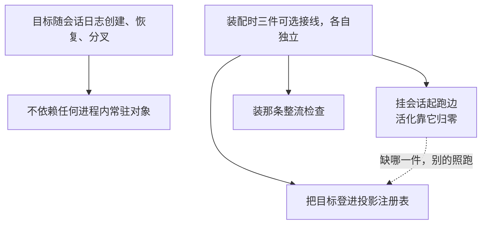

装那条整流检查有一个**次序要求**：待写的那条事件要接在日志末尾**再**交进来检查，然后才落盘。少了这一步，破规矩的改动会先落进日志，等下一次装载才被发现——那时已经晚了。

---

## 失败语义

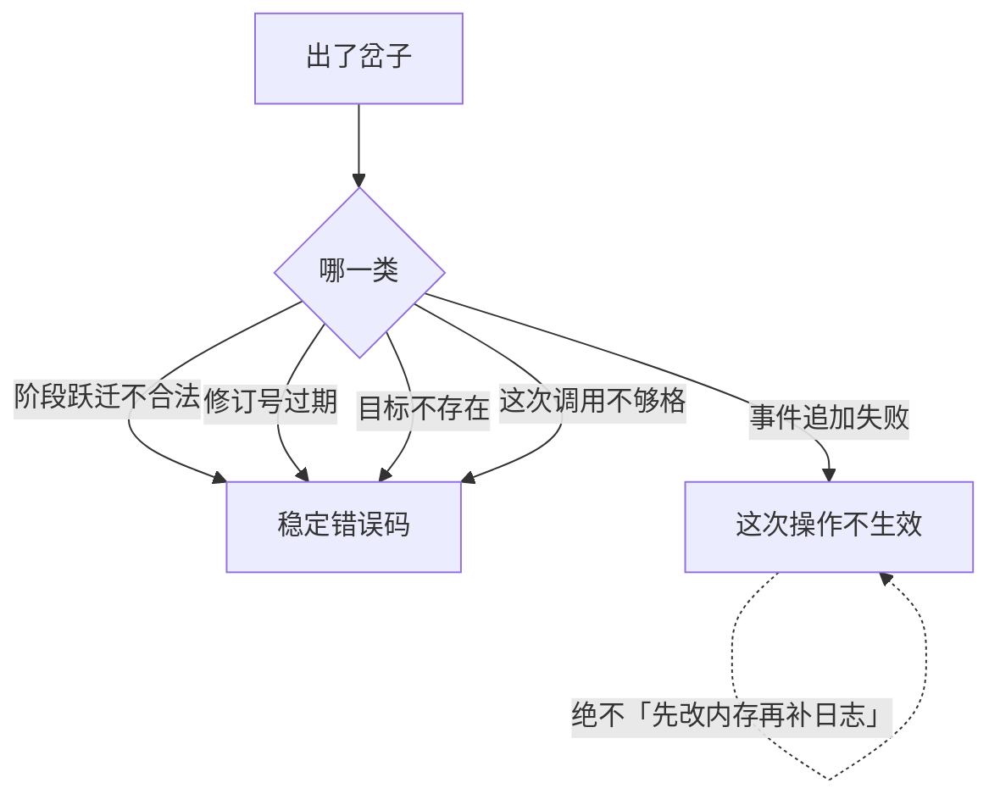

对人的那一面则收得更干净：一次因为状态不对被拒的命令，回的是「这条命令在当前状态下不成立，敲 `/goal` 看看现在能干什么」。**修订号是命令层和服务之间的事，跟人无关**，不露给人看。

---

## 能力边界

```mermaid
flowchart TD
    Y["做的"] --> Y1["单会话内的一件事，一轮接一轮推"]
    Y --> Y2["一道数得出来、赖不掉的轮数预算"]
    Y --> Y3["一套钉在日志上的授权规矩"]
    N["不做的"] --> N1["不是跨租户的项目管理系统"]
    N --> N2["不保证任务一定完成<br/>也不替业务定义什么叫成功"]
    N --> N3["「卡住」是目标的阶段<br/>不是子 agent 的停止原因"]
    N --> N4["不内置分布式锁，也不内置外部工作队列"]
    N --> N5["驱动器不跑模型、不执行工具<br/>它只递一条消息"]
```

## 对应的 DSH 能力

下表由 [`docs/packages.md`](../packages.md) 与 [能力覆盖表](../portmap/capability-coverage.tsv) 机器 join 得到：本篇覆盖的 Go 包，承接的是上游 DSH 的哪几条能力，以及各自还缺什么。落点列由源码里的 `// 源:` 注释反查，不是手写的。

| 上游能力 | DSH 包 | 裁决 | 落在哪个 Go 包 | 这里缺什么 |
|---|---|---|---|---|
| 面向用户的/goal控制，基于ctx.goals实现，提供状态展示和create/edit/pause/resume/clear命令 | `goal/command-goal` | 需要 | `feature/goal/goalcommand` | — |
| 事件溯源的同会话目标状态，维持当前待完成目标和续行权限 | `goal/goal` | 需要 | `feature/goal` `feature/goal/goaltool` | — |
| ctx.goals的同会话续行驱动器，把phase为active且已启用续行的目标转换为连续Goal Round | `goal/goal-round-driver` | 需要 | `feature/goal/goalrounddriver` | — |
| ctx.goals的面向模型控制API：get_goal、create_goal和update_goal | `goal/tool-goal` | 需要 | `feature/goal/goaltool` | — |

## 相关源码

- `feature/goal/`
- `feature/goal/goaltool/`
- `feature/goal/goalcommand/`
- `feature/goal/goalrounddriver/`
