# 运行时 Guard

对应包：`feature/guard/repeattoolreminder`、`feature/guard/timeoutpolicy`

## 定位

模型自己动手干活的时候，有两个毛病是必然会出现的，而且都不是模型「变笨了」，是这类系统的固有形状：

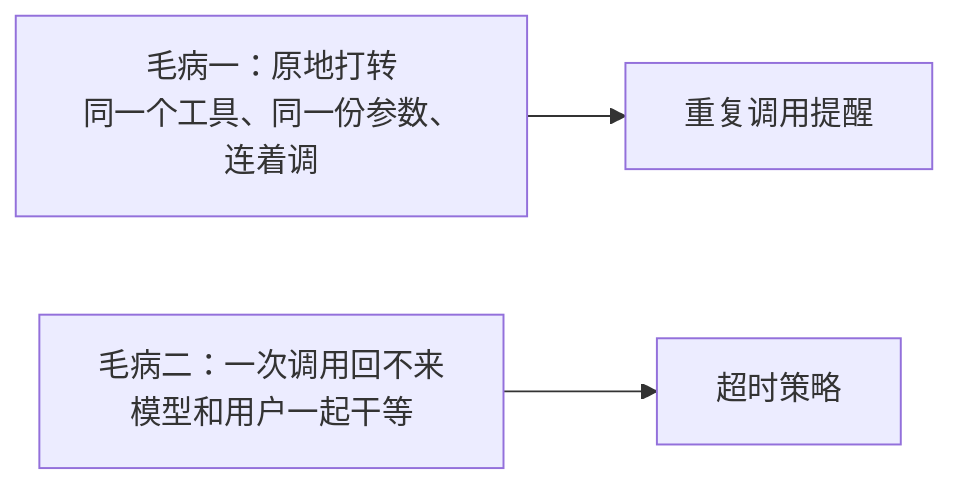
```mermaid
flowchart LR
    P1["毛病一：原地打转<br/>同一个工具、同一份参数、连着调"] --> R1["重复调用提醒"]
    P2["毛病二：一次调用回不来<br/>模型和用户一起干等"] --> R2["超时策略"]
```

### 原地打转长什么样

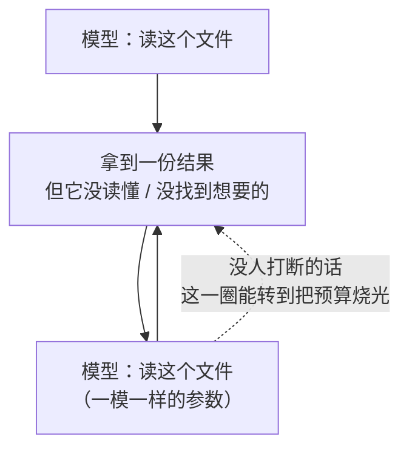
```mermaid
flowchart TD
    A["模型：读这个文件"] --> B["拿到一份结果<br/>但它没读懂 / 没找到想要的"]
    B --> C["模型：读这个文件<br/>（一模一样的参数）"]
    C --> B
    C -.->|"没人打断的话<br/>这一圈能转到把预算烧光"| B
```

用户那边看到的是：进度条一直在动，模型一直在「工作」，可什么都没往前走。账单照收。

### 一次调用回不来长什么样

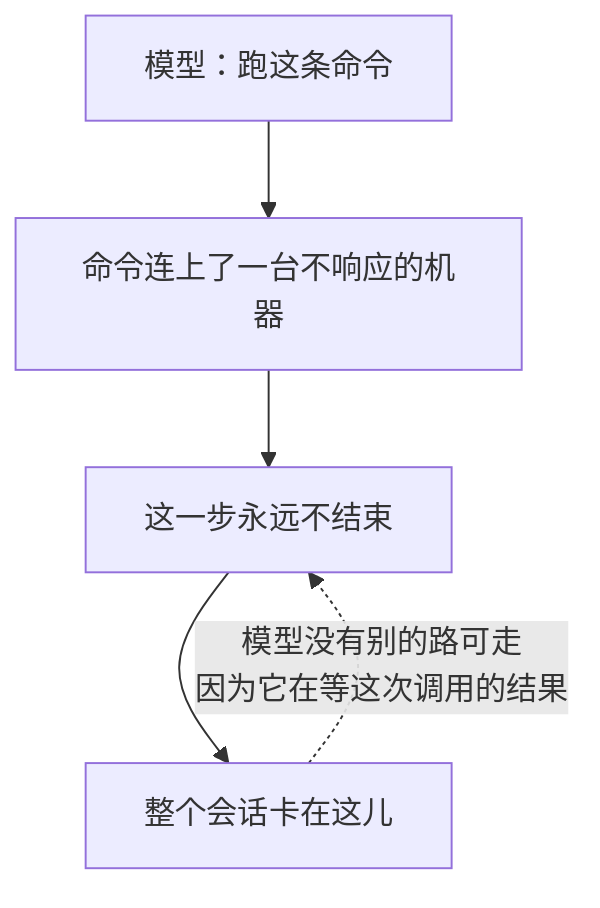
```mermaid
flowchart TD
    A["模型：跑这条命令"] --> B["命令连上了一台不响应的机器"]
    B --> C["这一步永远不结束"]
    C --> D["整个会话卡在这儿"]
    D -.->|"模型没有别的路可走<br/>因为它在等这次调用的结果"| C
```

### 两层的共同点：都不当闸门

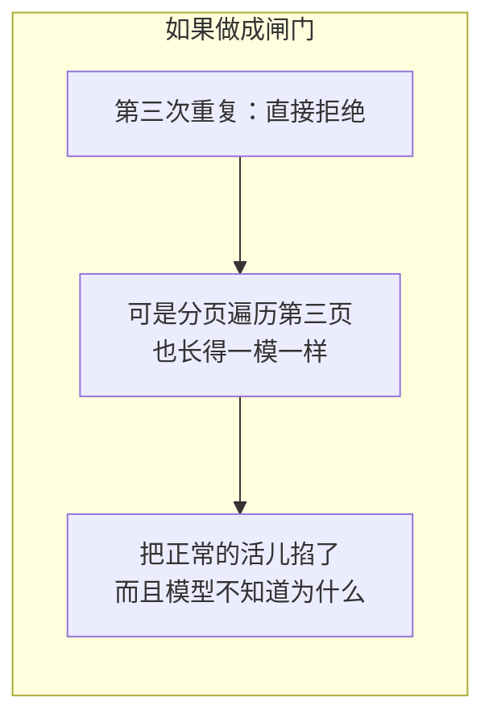
```mermaid
flowchart LR
    subgraph W["如果做成闸门"]
        A1["第三次重复：直接拒绝"] --> A2["可是分页遍历第三页<br/>也长得一模一样"]
        A2 --> A3["把正常的活儿掐了<br/>而且模型不知道为什么"]
    end
```

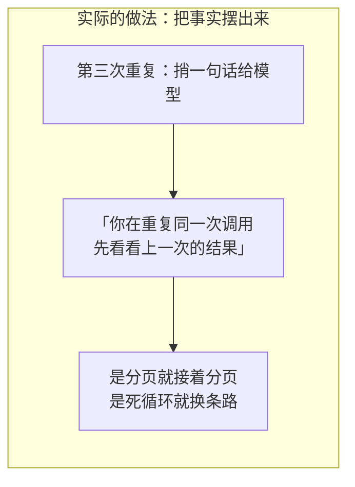
```mermaid
flowchart LR
    subgraph G["实际的做法：把事实摆出来"]
        B1["第三次重复：捎一句话给模型"] --> B2["「你在重复同一次调用<br/>先看看上一次的结果」"]
        B2 --> B3["是分页就接着分页<br/>是死循环就换条路"]
    end
```

这个克制是有理由的：**「连着调同一个工具」并不总是错的**。一次分页遍历、一次轮询、按顺序写十个文件，在调用记录上和死循环长得完全一样，只有模型自己知道它在干什么。

超时那一层的克制更彻底——它连「停下来」都做不到，只能改写模型看到的结果。这一点必须说在最前面，否则「设了超时」很容易被读成「超时了就不跑了」。

---

## 架构

两层挂在工具管线的两个不同位置上：

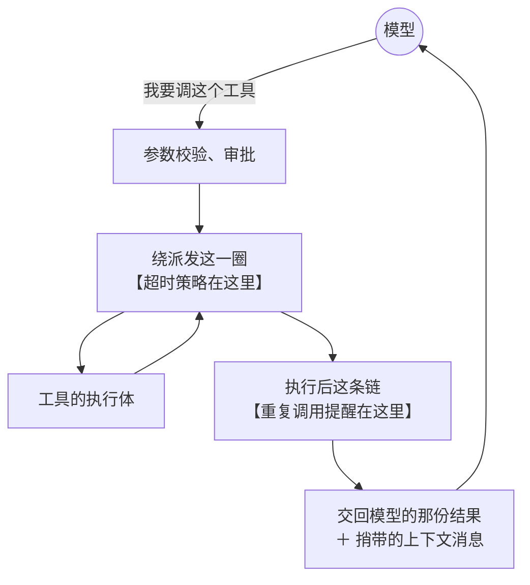
```mermaid
flowchart TD
    M(("模型")) -->|"我要调这个工具"| PRE["参数校验、审批"]
    PRE --> AROUND["绕派发这一圈<br/>【超时策略在这里】"]
    AROUND --> EXEC["工具的执行体"]
    EXEC --> AROUND
    AROUND --> POST["执行后这条链<br/>【重复调用提醒在这里】"]
    POST --> RES["交回模型的那份结果<br/>＋ 捎带的上下文消息"]
    RES --> M
```

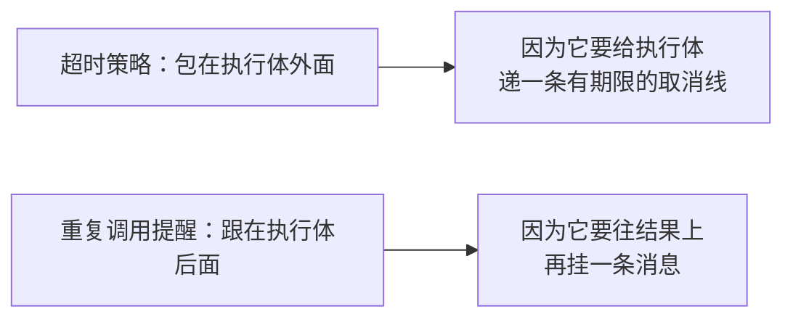
```mermaid
flowchart LR
    A["超时策略：包在执行体外面"] --> A1["因为它要给执行体<br/>递一条有期限的取消线"]
    B["重复调用提醒：跟在执行体后面"] --> B1["因为它要往结果上<br/>再挂一条消息"]
```

一次调用穿过两层的完整走法：

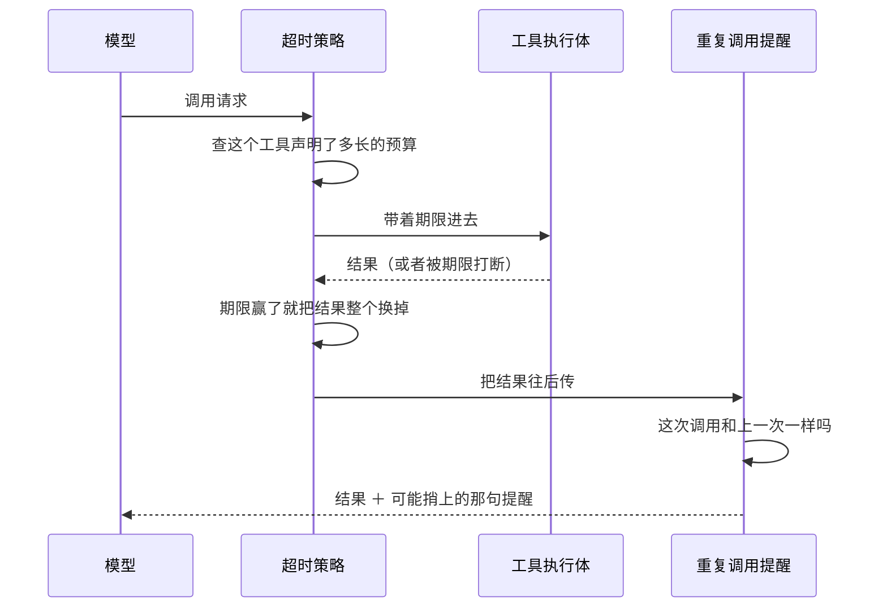
```mermaid
sequenceDiagram
    participant M as 模型
    participant T as 超时策略
    participant X as 工具执行体
    participant R as 重复调用提醒
    M->>T: 调用请求
    T->>T: 查这个工具声明了多长的预算
    T->>X: 带着期限进去
    X-->>T: 结果（或者被期限打断）
    T->>T: 期限赢了就把结果整个换掉
    T->>R: 把结果往后传
    R->>R: 这次调用和上一次一样吗
    R-->>M: 结果 ＋ 可能捎上的那句提醒
```

### 两层互不知道对方

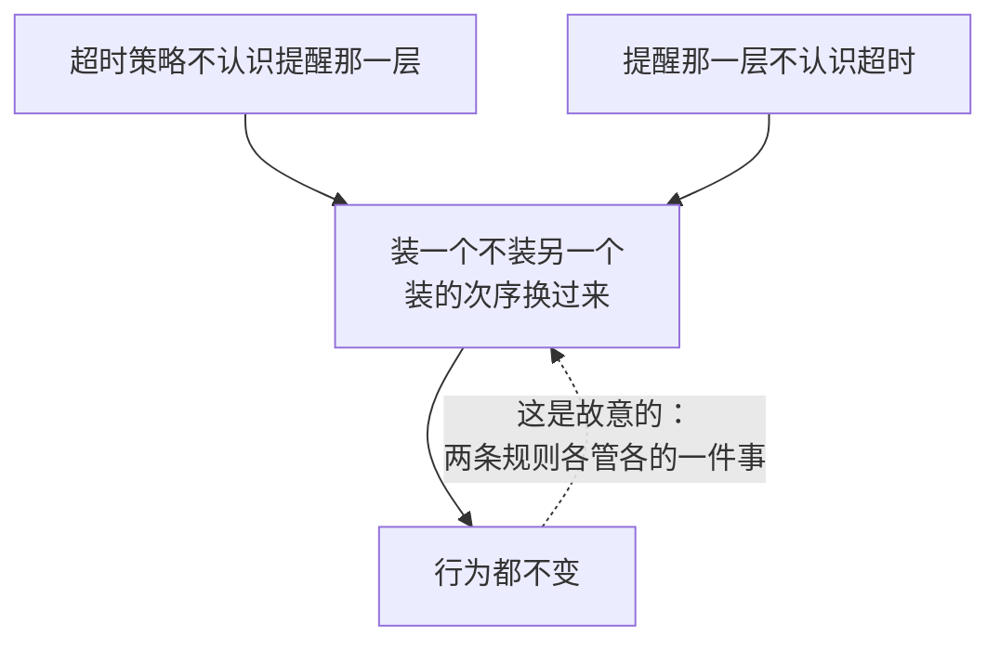
```mermaid
flowchart TD
    A["超时策略不认识提醒那一层"] --> C["装一个不装另一个<br/>装的次序换过来"]
    B["提醒那一层不认识超时"] --> C
    C --> D["行为都不变"]
    D -.->|"这是故意的：<br/>两条规则各管各的一件事"| C
```

---

## 重复调用提醒

### 什么算「同一次调用」

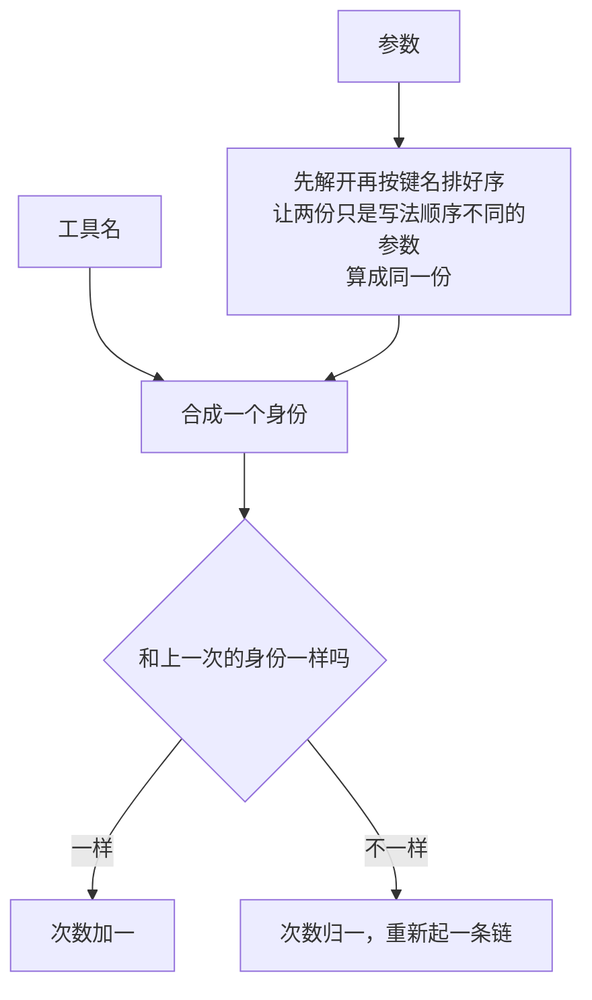
```mermaid
flowchart TD
    A["工具名"] --> K["合成一个身份"]
    B["参数"] --> N["先解开再按键名排好序<br/>让两份只是写法顺序不同的参数<br/>算成同一份"]
    N --> K
    K --> C{"和上一次的身份一样吗"}
    C -->|"一样"| D["次数加一"]
    C -->|"不一样"| E["次数归一，重新起一条链"]
```

参数解不开的时候（模型吐了一段坏 JSON）就原样当字符串比。这只降低**判定的精度**——两份写法不同的坏 JSON 会被当成两次不同的调用——不会把不同的调用错认成同一次。

### 三件事能把链断掉

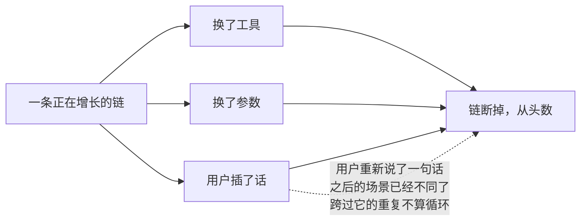
```mermaid
flowchart LR
    C["一条正在增长的链"] --> B1["换了工具"]
    C --> B2["换了参数"]
    C --> B3["用户插了话"]
    B1 --> Z["链断掉，从头数"]
    B2 --> Z
    B3 --> Z
    B3 -.->|"用户重新说了一句话<br/>之后的场景已经不同了<br/>跨过它的重复不算循环"| Z
```

前两件这一层自己认得出；第三件要靠 agent 循环在每一步之前叫一下它。**判断留在本包，接线留给循环**——这样这条规则在循环写好之前就能被完整地测到。

### 越劝越具体

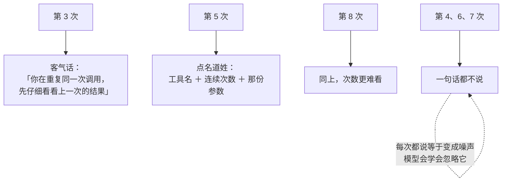
```mermaid
flowchart TD
    A["第 3 次"] --> A1["客气话：<br/>「你在重复同一次调用，<br/>先仔细看看上一次的结果」"]
    B["第 5 次"] --> B1["点名道姓：<br/>工具名 ＋ 连续次数 ＋ 那份参数"]
    C["第 8 次"] --> C1["同上，次数更难看"]
    D["第 4、6、7 次"] --> D1["一句话都不说"]
    D1 -.->|"每次都说等于变成噪声<br/>模型会学会忽略它"| D1
```

三级阈值可以配，但配上去的那几级里**最小的那一级**说客气话，其余的说详细话。绑的是次序而不是写死的数字，所以改了阈值之后「先客气、后详细」这个关系仍然成立。

### 参数只在文案里截断，判定永远看完整的

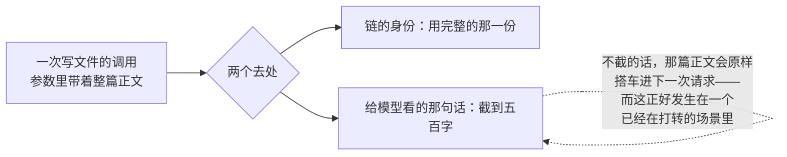
```mermaid
flowchart LR
    A["一次写文件的调用<br/>参数里带着整篇正文"] --> B{"两个去处"}
    B --> C["链的身份：用完整的那一份"]
    B --> D["给模型看的那句话：截到五百字"]
    D -.->|"不截的话，那篇正文会原样<br/>搭车进下一次请求——<br/>而这正好发生在一个<br/>已经在打转的场景里"| D
```

### 为什么计数落在执行**后**

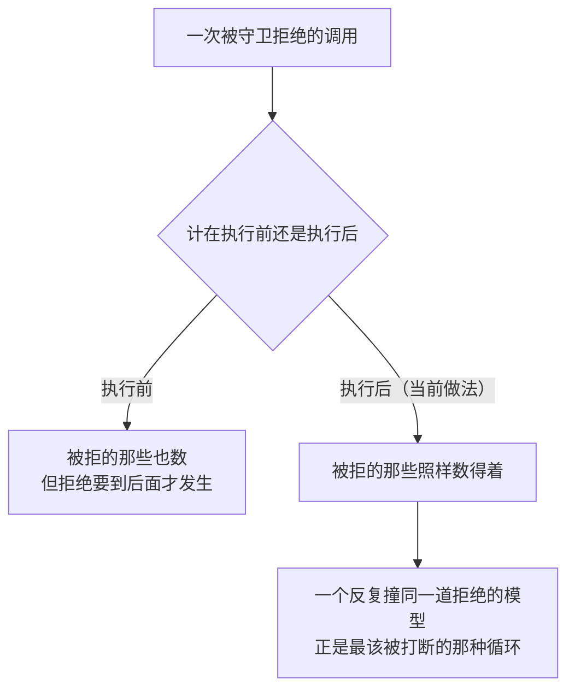
```mermaid
flowchart TD
    A["一次被守卫拒绝的调用"] --> B{"计在执行前还是执行后"}
    B -->|"执行前"| C["被拒的那些也数<br/>但拒绝要到后面才发生"]
    B -->|"执行后（当前做法）"| D["被拒的那些照样数得着"]
    D --> E["一个反复撞同一道拒绝的模型<br/>正是最该被打断的那种循环"]
```

而且计数在往后传之**前**就完成：链的状态只记「模型又调了一次」，和后面那些层最终怎么裁决无关。

### 没被跟踪的工具是透明的

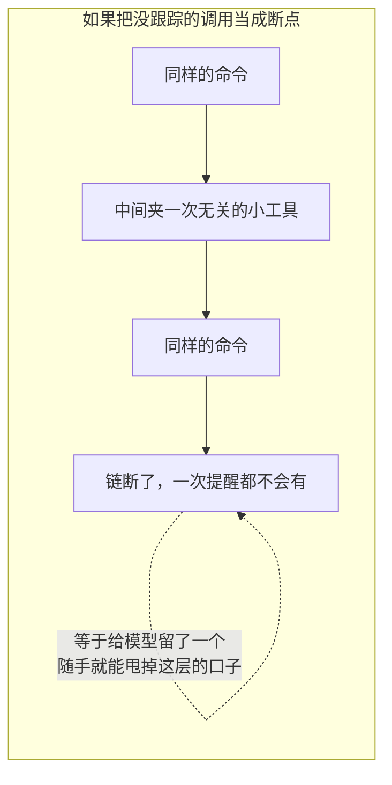
```mermaid
flowchart LR
    subgraph BAD["如果把没跟踪的调用当成断点"]
        A1["同样的命令"] --> A2["中间夹一次无关的小工具"] --> A3["同样的命令"]
        A3 --> A4["链断了，一次提醒都不会有"]
        A4 -.->|"等于给模型留了一个<br/>随手就能甩掉这层的口子"| A4
    end
```

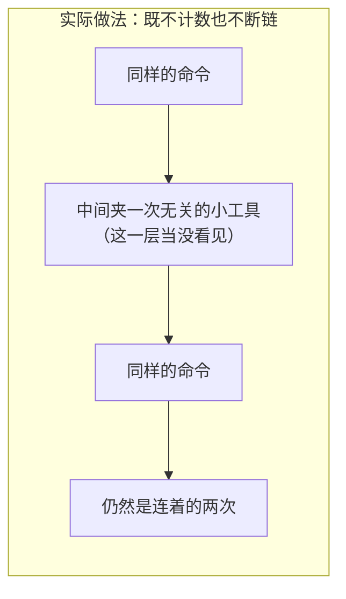
```mermaid
flowchart LR
    subgraph GOOD["实际做法：既不计数也不断链"]
        B1["同样的命令"] --> B2["中间夹一次无关的小工具<br/>（这一层当没看见）"] --> B3["同样的命令"]
        B3 --> B4["仍然是连着的两次"]
    end
```

### 那句提醒插在最前面，而且署名

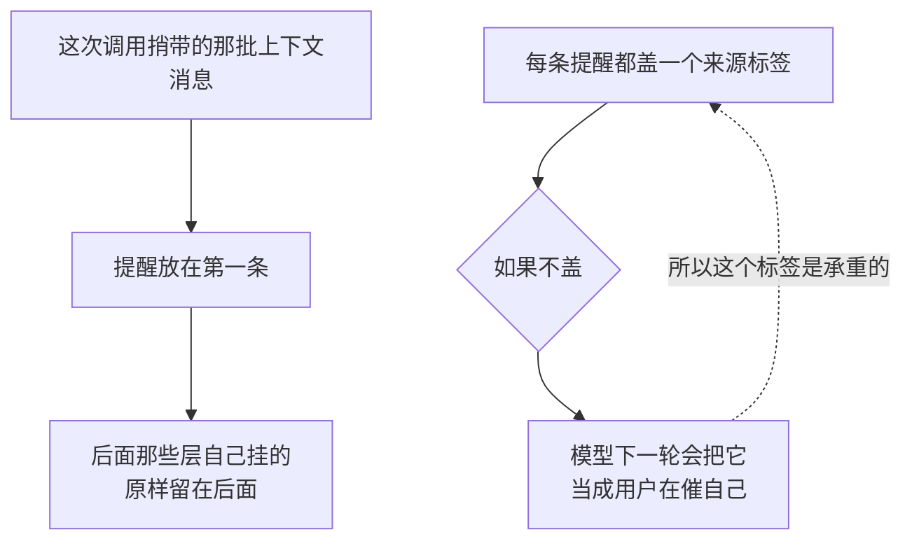
```mermaid
flowchart TD
    A["这次调用捎带的那批上下文消息"] --> B["提醒放在第一条"]
    B --> C["后面那些层自己挂的<br/>原样留在后面"]
    D["每条提醒都盖一个来源标签"] --> E{"如果不盖"}
    E --> F["模型下一轮会把它<br/>当成用户在催自己"]
    F -.->|"所以这个标签是承重的"| D
```

被拦下的调用一样收得到这句提醒——拦不拦是别的层的事，摆事实是这一层的事。

---

## 超时策略

### 「协作式」是这个包唯一的前提

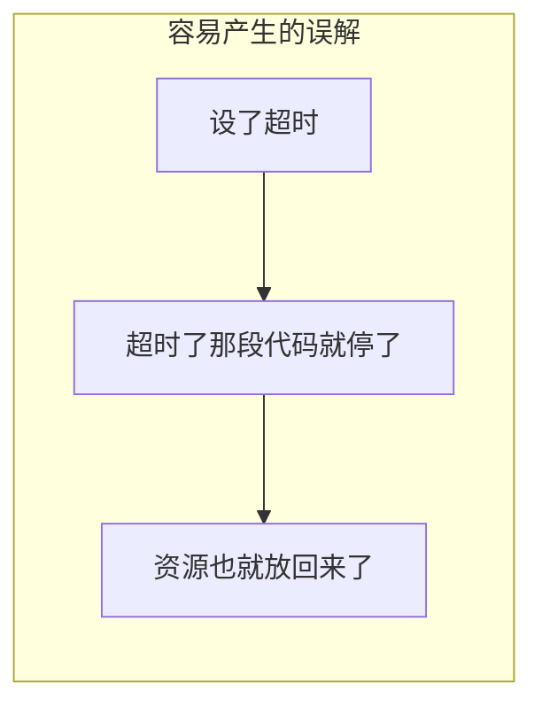
```mermaid
flowchart LR
    subgraph WRONG["容易产生的误解"]
        A1["设了超时"] --> A2["超时了那段代码就停了"]
        A2 --> A3["资源也就放回来了"]
    end
```

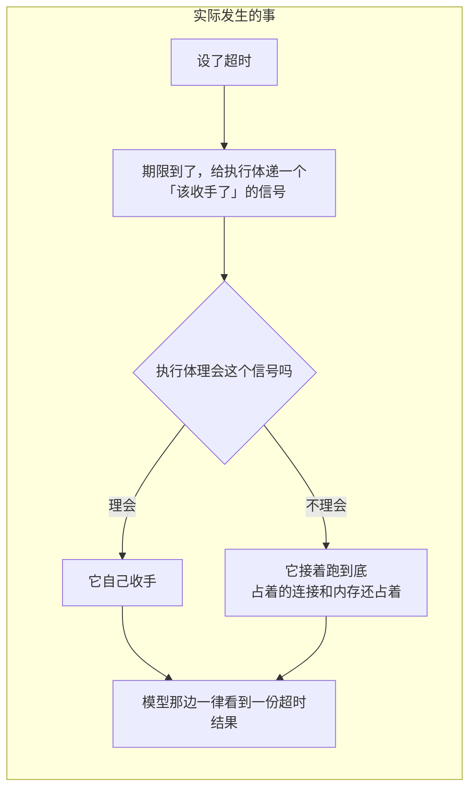
```mermaid
flowchart LR
    subgraph RIGHT["实际发生的事"]
        B1["设了超时"] --> B2["期限到了，给执行体递一个「该收手了」的信号"]
        B2 --> B3{"执行体理会这个信号吗"}
        B3 -->|"理会"| B4["它自己收手"]
        B3 -->|"不理会"| B5["它接着跑到底<br/>占着的连接和内存还占着"]
        B4 --> B6["模型那边一律看到一份超时结果"]
        B5 --> B6
    end
```

**变的只是模型收到的那份结果**，不是那段代码的命运。一个工具写下自己的时间预算，就是在向这一层保证：它会把这个「该收手了」的信号一路转发给真正干活的那一段。

### 预算从哪儿来，为什么每次都要重查

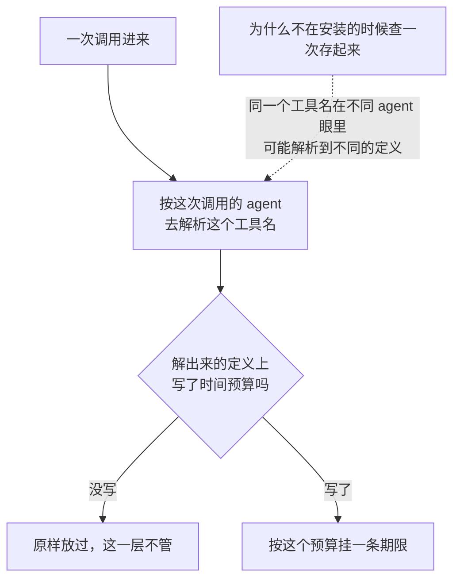
```mermaid
flowchart TD
    A["一次调用进来"] --> B["按这次调用的 agent<br/>去解析这个工具名"]
    B --> C{"解出来的定义上<br/>写了时间预算吗"}
    C -->|"没写"| D["原样放过，这一层不管"]
    C -->|"写了"| E["按这个预算挂一条期限"]
    F["为什么不在安装的时候查一次存起来"] -.->|"同一个工具名在不同 agent 眼里<br/>可能解析到不同的定义"| B
```

```mermaid
flowchart TD
    A["解不出这个工具"] --> B["也原样放过"]
    B --> C["这次派发接下来会以<br/>「找不到这个工具」失败"]
    C -.->|"那句诊断比这一层<br/>现编一个超时有用得多"| C
```

### 分辨「是我超时了」还是「别人取消了」

这是整层最要紧的一处判断：

```mermaid
flowchart TD
    A["这次调用被取消了"] --> B{"取消的原因上<br/>盖的是本层那个代号吗"}
    B -->|"是"| C["我的期限赢了<br/>把结果整个换成一份超时"]
    B -->|"不是"| D["是别人取消的<br/>结果和错误一律原样往上传"]
    D --> E["可能是用户按了停止<br/>也可能是外面一层更早的期限"]
```

```mermaid
flowchart LR
    A["为什么必须分开"] --> B["超时：可以换个更小的输入再试一次"]
    A --> C["用户按停止：绝不能重试"]
    B -.->|"只有一个「已取消」的布尔值<br/>这两件事就分不开了"| C
```

### 期限赢了之后为什么要把结果整个换掉

```mermaid
flowchart TD
    A["执行体看见取消之后<br/>交出来的东西"] --> B["可能是它自己的一份「已取消」"]
    A --> C["也可能是一份跑了一半的成功值"]
    B --> D["模型从这两种里都读不出「是超时」"]
    C --> D
    D --> E["所以换成一份带固定代号的超时结果"]
    E --> F["模型读得懂：该缩小范围重试"]
    E --> G["别的层读得懂：能按这个代号<br/>路由重试策略、沙箱策略和回放"]
```

那份换上去的结果里，一句人话的错误消息、一个给机器路由用的代号、一个给人看的错误名，三样都在。这个形状是这一层对别的层的承诺，不跟着任何内部改法走。

### 完整时序

```mermaid
sequenceDiagram
    participant C as 调用方
    participant P as 超时策略
    participant X as 工具执行体
    C->>P: 派发一次调用
    P->>P: 在调用方那条取消线之下<br/>挂一条自己的期限
    P->>X: 递进去
    Note over X: 期限到了
    X-->>P: 它自己那份收敛结果（作废）
    P->>P: 确认这条期限是自己挂的
    P-->>C: 一份带超时代号的结果
```

那条期限**必须从调用方那条线上派生**。这是这一圈里唯一不许犯的错——递一条不相干的取消线进去，等于把调用方停止这次调用的能力摘掉了。

---

## 生命周期与并发

```mermaid
flowchart TD
    A["两层都用同一种方式安装"] --> B["交回一个撤销函数"]
    B --> C["跟着它所属的作用域一起收回"]
    D["安装时给的作用域<br/>决定它管哪些 agent"] --> E["没有身份的作用域：管所有 agent"]
    D --> F["有身份的作用域：只管那条链下面的"]
```

```mermaid
flowchart LR
    A["链的状态按 agent 分开存"] --> B["一把互斥锁护着"]
    B --> C["因为工具结果可能是并行回来的"]
    D["超时那一层没有共享状态"] --> E["一次调用的期限只活在那一次调用里<br/>函数返回就没人拿得到了"]
```

一处 Go 特有的安排：

```mermaid
flowchart TD
    A["DSH 把每个 agent 那条链<br/>挂在以 agent 对象为键的弱引用结构上"] --> B["靠垃圾回收顺手清掉"]
    C["Go 这边用的是弱指针做键"] --> D["键死掉的那些条目<br/>在下一次写入时顺手扫掉"]
    D --> E["扫的代价是走一遍<br/>活着的 agent（几十个）"]
    E -.->|"比维护一个「攒够多少条才扫」的旋钮便宜<br/>也少一个调不准就退化成泄漏的开关"| E
```

DSH 那边还有一步「把执行体身上的取消信号换回原来那条」，Go 这边没有对应物：取消在 Go 里是**参数**不是字段，派生出来的那条线只递给执行体，函数一返回就没人拿得到它了。没有要还原的东西，也就没有还原时机出错的可能。

---

## 失败语义

```mermaid
flowchart TD
    A["出了岔子"] --> B{"哪一类"}
    B -->|"提醒那一层的配置不成立<br/>（阈值给了空的、写了两遍、小于二）"| C["安装当场失败<br/>绝不静默退回缺省值"]
    B -->|"工具自己业务上失败了"| D["两层都不改写<br/>原样交回模型"]
    B -->|"期限到了"| E["只说明期限到了<br/>不证明那段代码已经停下<br/>更不证明它回滚过"]
    B -->|"取消来自别处"| F["原样往上传<br/>不冒充成自己的超时"]
    B -->|"重复次数还没到阈值"| G["什么都不做<br/>这不是失败"]
```

配置错了要**响亮地**失败：一份写着「阈值是空的」的配置表达的是「我想改这件事」，把它读成「那就按缺省来」，等于让一次配置错误变成运行期的沉默。

---

## 能力边界

```mermaid
flowchart TD
    Y["这两层做的"] --> Y1["认出机械重复，并把这件事<br/>说给模型听"]
    Y --> Y2["给声明了预算的工具挂上期限<br/>并把超时翻译成模型读得懂的结果"]
    N["不做的"] --> N1["不拦调用，也不改写正常结果"]
    N --> N2["不判断一次重复到底是不是错的"]
    N --> N3["不保证模型真的停下来<br/>要真挡住得靠会拒绝的那些层"]
    N --> N4["不替工具声明预算<br/>没写预算的工具这一层不管"]
    N --> N5["不做进程隔离，也不回收资源<br/>谁开的连接和句柄谁收"]
    N --> N6["不重试<br/>要不要再来一次是读到结果的模型的事"]
    N --> N7["不是策略语言，不做内容审核<br/>也不做业务风控"]
```

授权和用户审批不在这两层：那是工具管线上另外一段的事。

## 对应的 DSH 能力

下表由 [`docs/packages.md`](../packages.md) 与 [能力覆盖表](../portmap/capability-coverage.tsv) 机器 join 得到：本篇覆盖的 Go 包，承接的是上游 DSH 的哪几条能力，以及各自还缺什么。落点列由源码里的 `// 源:` 注释反查，不是手写的。

| 上游能力 | DSH 包 | 裁决 | 落在哪个 Go 包 | 这里缺什么 |
|---|---|---|---|---|
| 循环中断器，监视连续重复工具调用并注入逐级增强的提醒 | `guard/repeat-tool-reminder` | 需要 | `feature/guard/repeattoolreminder` | — |
| 工具调用超时强制执行器，读取工具声明的timeoutMs并在超时时返回TOOL_TIMEOUT | `guard/timeout-policy` | 需要 | `feature/guard/timeoutpolicy` | — |

## 相关源码

- `feature/guard/timeoutpolicy/`
- `feature/guard/repeattoolreminder/`
- `tools/pipeline.go`
