# 用户交互

对应包：`feature/interaction/commands`、`feature/interaction/userquestions`、`feature/interaction/askuser`、`feature/interaction/userapproval`、`feature/interaction/permissionpresets`

## 定位

这五个包管的是同一件事的五个面：**人和这套装置之间怎么说话**。

模型和人说话只有一条正规通道——工具。但人和装置之间的对话远不止这一种：人可以主动敲一条命令，装置也可以停下来反问人一句，还可以在动手之前先请示一次。方向不同，能不能被模型看见也不同：

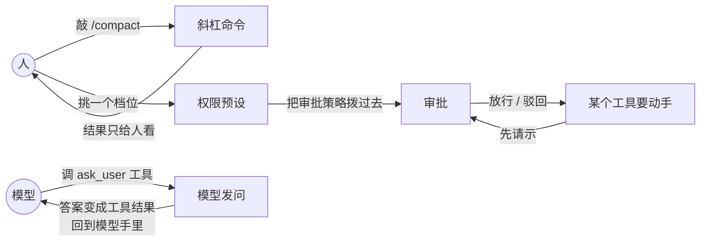

一句话分工：

| 谁发起 | 谁回答 | 模型看得见吗 |
|---|---|---|
| 人敲命令 | 装置 | **看不见**，斜杠命令不进上下文 |
| 模型发问 | 人 | 看得见，答案就是工具结果 |
| 工具要动手 | 人 | 看得见结局，看不见问答过程 |
| 人挑档位 | 装置 | 看得见档位换了，因为它会改系统提示里那句话 |

---

## 架构

五个包不是平级的。中间三个是**接缝**（只定形状，不画界面），外面两个是**用它的人**：

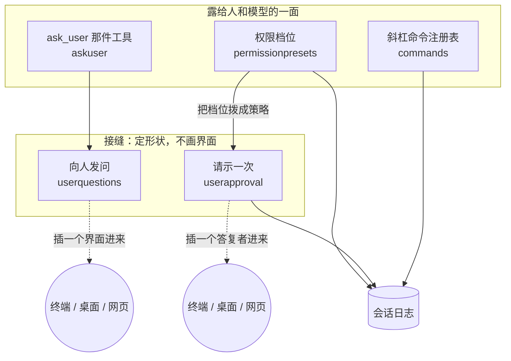

这么切的理由：**一个无界面的装配**（批处理、回放、压测）只要不接那两个插头，模型就问不出问题、工具也请示不到人——不需要在每个包里再写一遍「现在没人，怎么办」。

---

## 斜杠命令：人对着装置本身说的话

### 为什么它不进模型

`/compact`、`/status` 这类命令是人对**这套装置**说的，不是对模型说的。让它们进上下文有两个坏处：白占预算，而且模型会以为自己可以决定这条命令跑不跑。

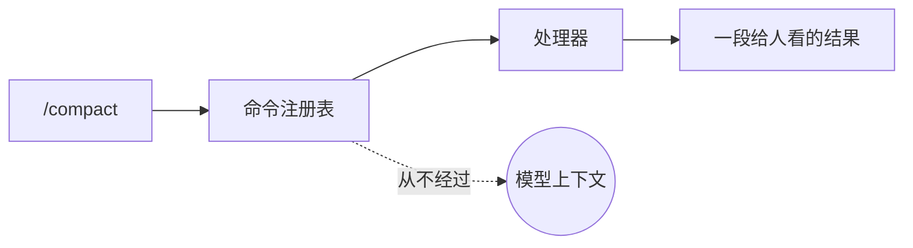

### 一次执行的七道关

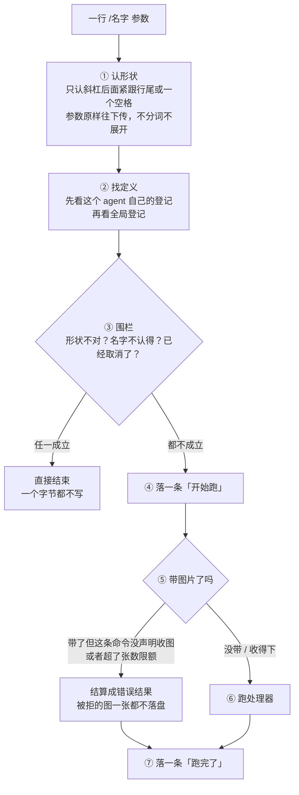

三处刻意的取舍：

- **第 ③ 关不写字。** 名字都不认得的一行输入，写进日志只会污染审计。
- **第 ④ 关写不进去就大声失败。** 因为第 ⑦ 关那条「跑完了」要配对；配不上对的孤儿记录比没有记录更难查。
- **第 ⑤ 关在处理器之前。** 一批注定被拒的图片不该先落盘再删。

### 同一个名字，不同的 agent 可以是不同的实现

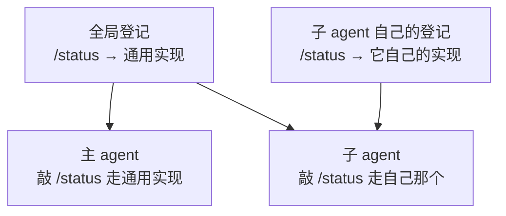

近的盖住远的。这样一个子 agent 可以换掉某条命令的行为，而不必去改全局那份。

### 停不下不合作的处理器

取消赢了那一局，这次执行就结算成「取消」并落账，但**那个处理器的协程还在跑**：

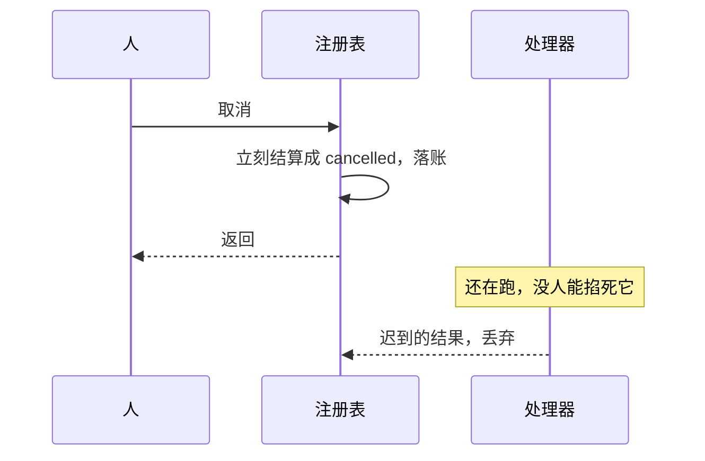

Go 没有掐死别人协程的办法，所以这里如实说明，而不是假装停住了。

---

## 向人发问：这个包自己不问任何人

### 它是一个插槽

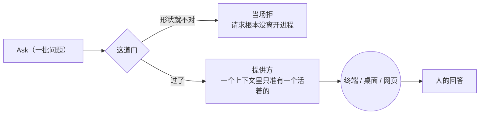

**为什么门要设在这里，不设在每个界面里**：错的是提问方。一个界面就算发现了这批问题有毛病，它也只能把一个坏问题画得好看一点。

### 没有提供方是什么后果

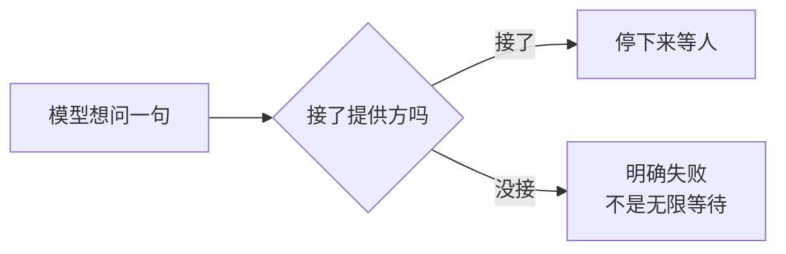

一个批处理装配根本不装这个插头，模型也就问不出问题来——这不是缺陷，是这条设计想要的结果。

---

## ask_user：模型那一侧的入口

这个包薄到只做**形状转换**，一个判断都不做：

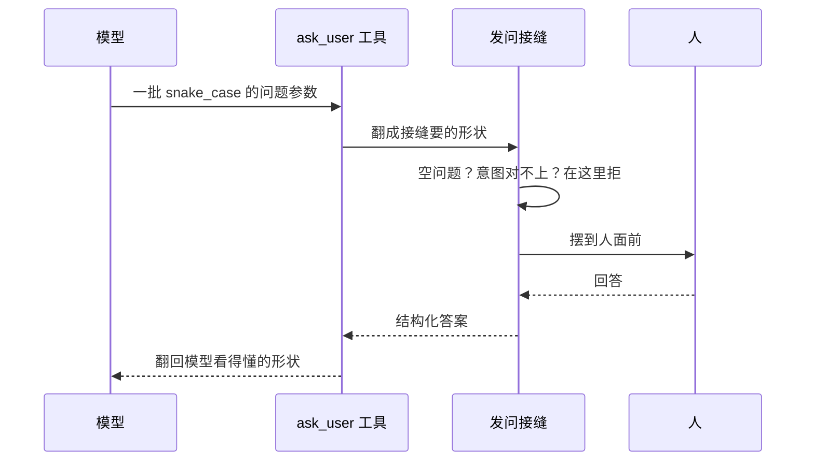

**拒绝的话术只有一份**：接缝报什么错，就原样成为这次工具调用的失败，工具层会把错误的身份原样带给模型，模型不必去解析错误文本。

---

## 审批：一次「要不要放这个工具过去」

### 三道关，顺序是设计的一部分

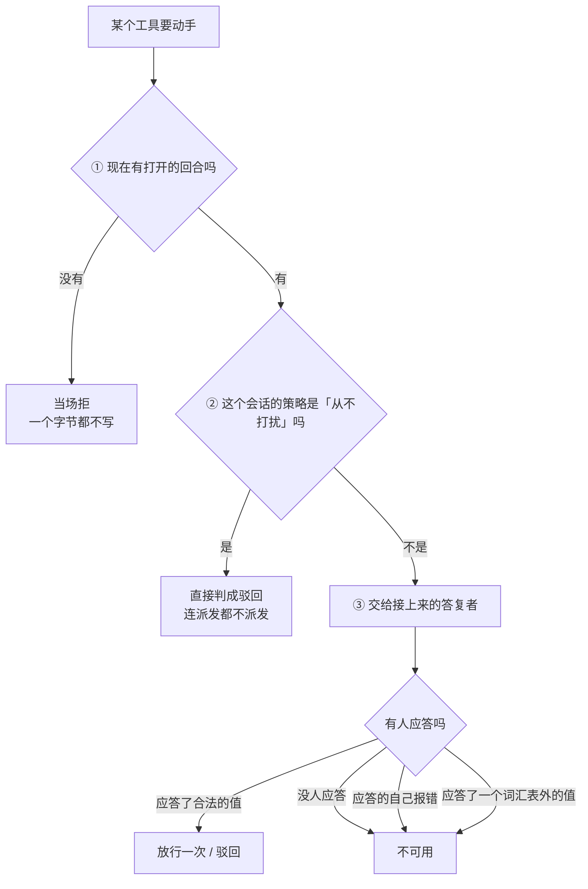

三个「为什么」：

- **① 为什么必须在回合里。** 问和答这一对是审计记录，必须被回合圈住。两个回合之间裸写的一条事件，重新装载时和一段崩溃残尾长得一模一样，会被静静丢掉。
- **② 为什么策略闸不做成一条答复者。** 做成答复者的话，任何一条后登记的答复者都可能排在它前面，「从不打扰就必然驳回」这句承诺就变成取决于登记顺序了。
- **③ 为什么三种意外都收敛成「不可用」。** 失败一律往**不放行**那一侧倒。

### 取消赢了，迟到的答复怎么办

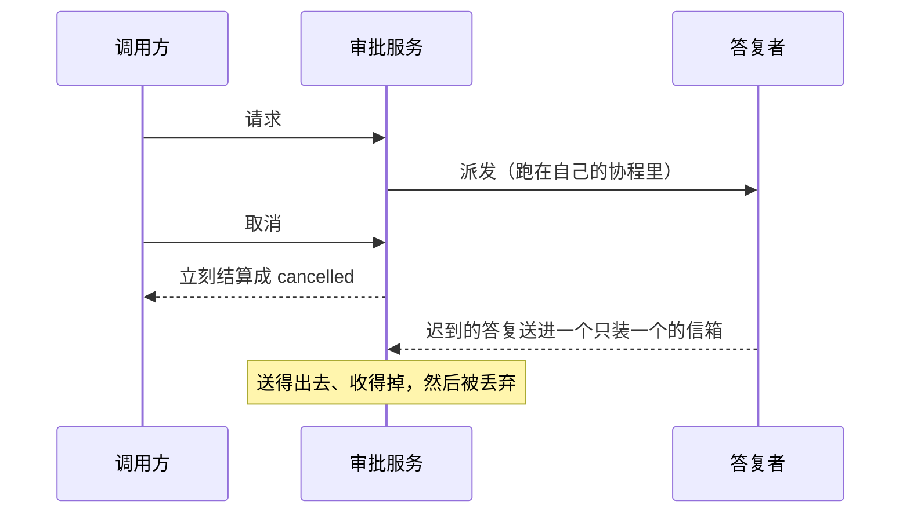

信箱容量是 1，为的是让那个答复者**送得出去**——否则它会永远卡在发送上，泄漏一条协程。

### 一次放行只管这一次

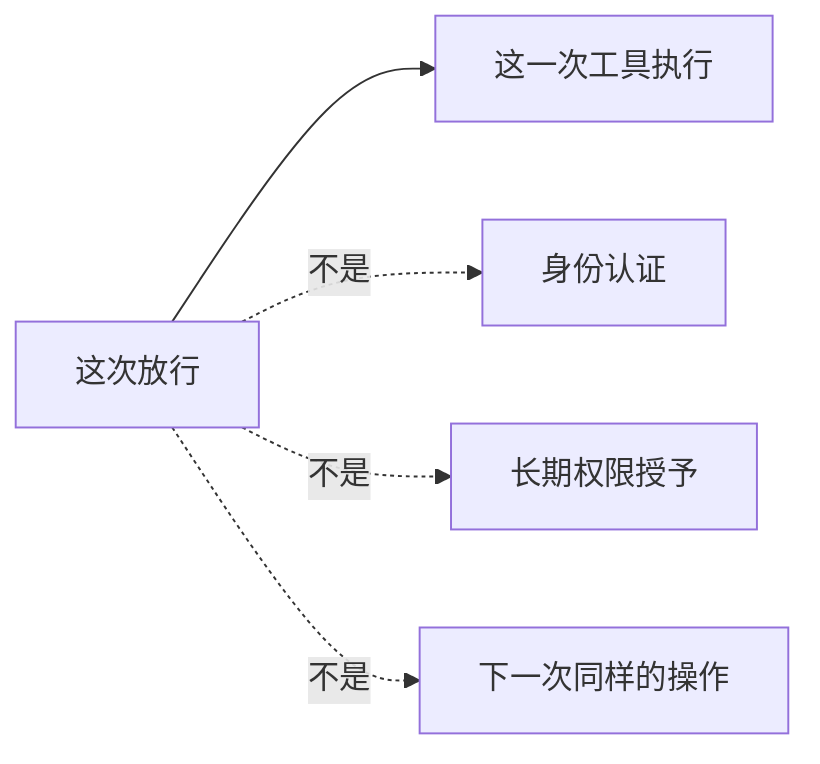

---

## 权限预设：给用户看的档位

### 为什么要有档位

底层旋钮是给部署方拨的，不是给用户拨的。档位把旋钮包成一份**起好名字、写好说明**的单子：

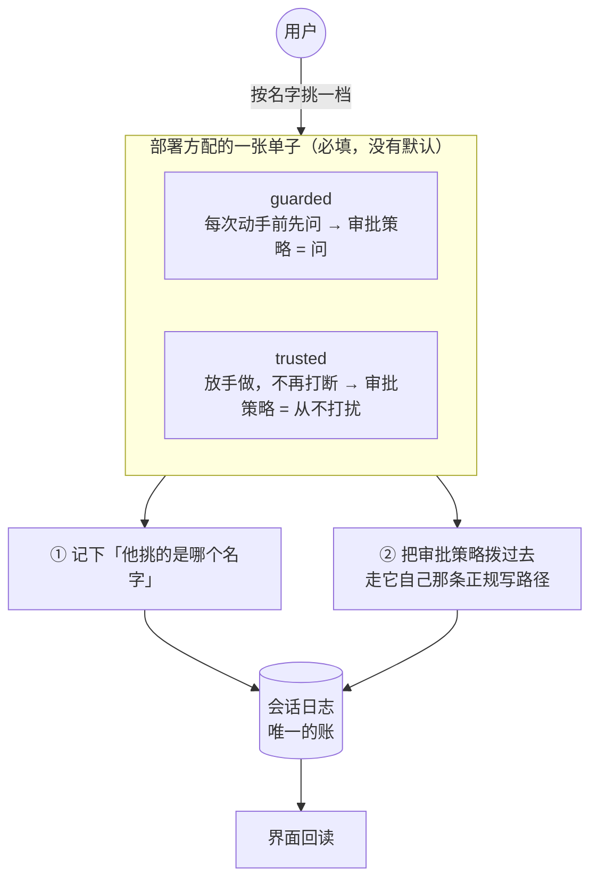

### 为什么①要单独记一笔

因为**两个档位完全可以拨出同一份旋钮值**：

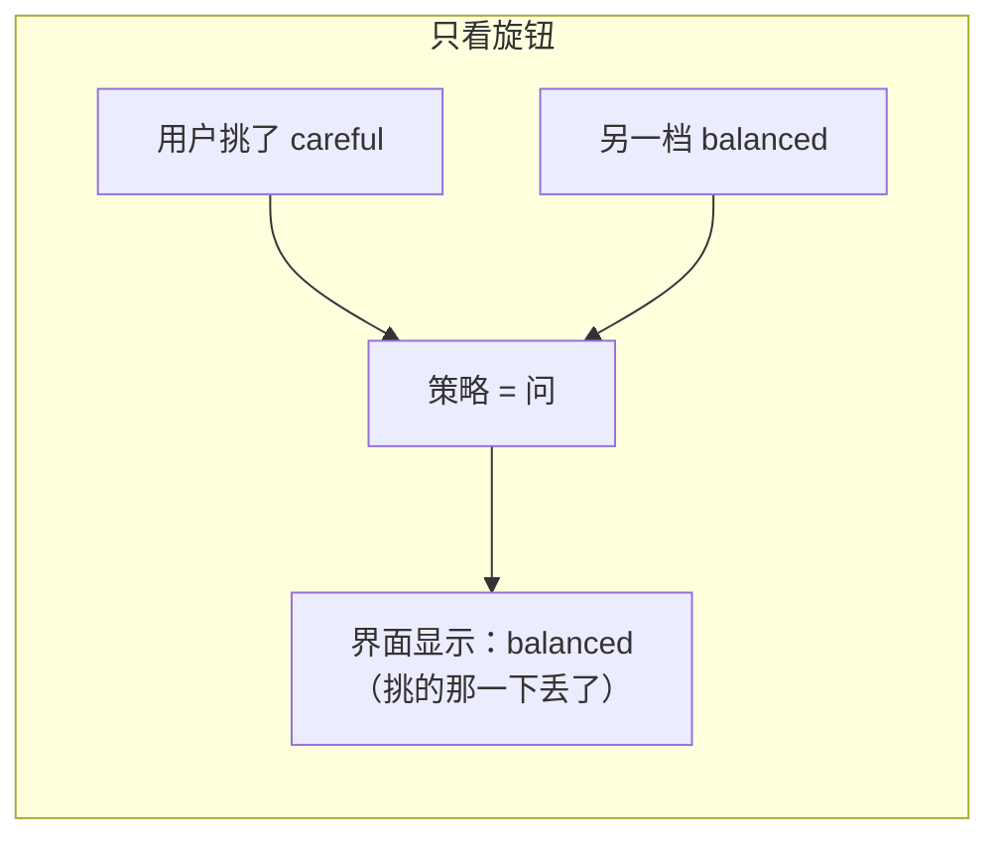

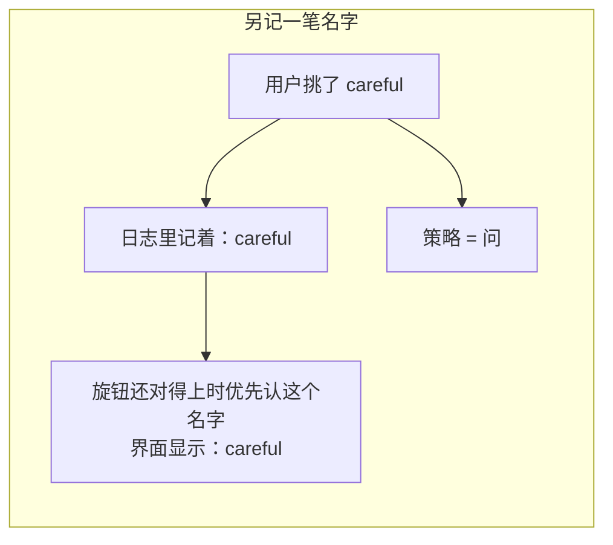

那条记名字的事实**只进日志、不进模型誊本**——它是给界面看的，模型不需要知道用户点的是哪个按钮。

### custom 不是一个能挑的档位

用户绕过档位直接改了底层旋钮，旋钮值配不上任何一条单子，这时当前值显示成 `custom`：

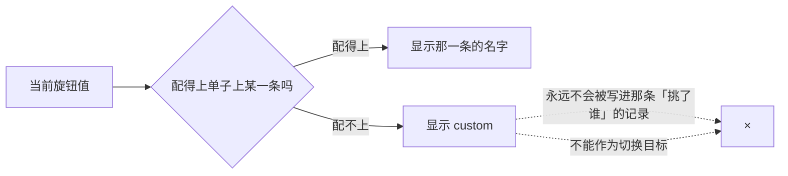

### 这个 Go 版本只捆一个旋钮

DSH 的档位捆两样：沙箱模式 + 审批策略。沙箱那一整支在本仓库判为不需要（理由见[文件系统](filesystem.md)），所以：

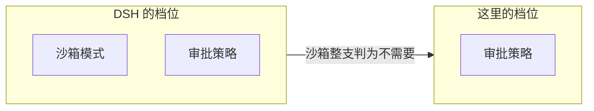

连带的两个后果：**不带默认档位表**（DSH 那两条默认档位是照沙箱模式起名的，照录过来会给用户看到一个叫「完全访问」、却根本不管文件访问的选项），以及**档位表必填**。

计划模式也没有折进来当第二个旋钮——沙箱和审批各自独立地施加限制，它们不读也不写计划状态，DSH 是刻意把计划模式挡在这个捆包外面的，这里跟着挡。

---

## 生命周期与并发

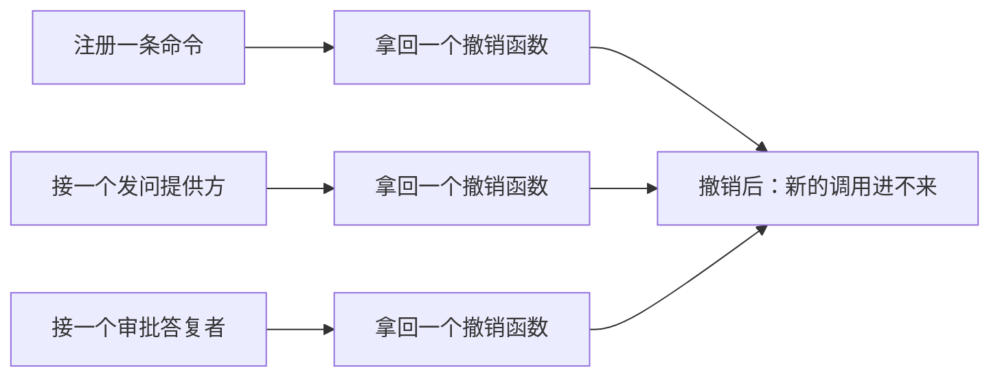

- 一个请求的答复**只收一次**，取消沿调用链传播。
- 策略变更写进目标会话，恢复之后可以重新折出当前有效策略——不靠内存里那份。
- 用户回调**不在注册表的锁里执行**，所以一个回调可以安全地反过来再查这些服务。

---

## 失败语义

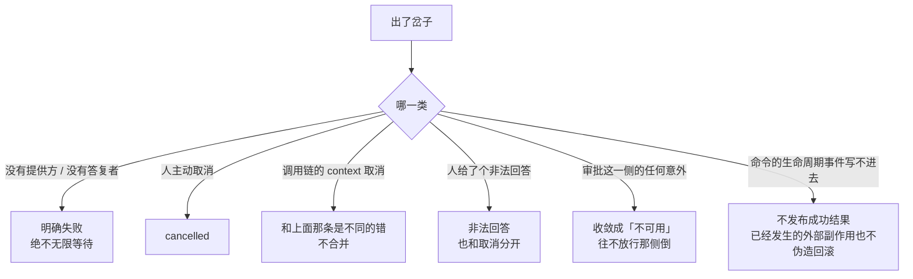

最后一条值得单说：一条命令已经把文件改了，事后日志写失败，这里**不会**假装那次修改没发生——伪造一次回滚比留下一条失败记录危险得多。

---

## 能力边界

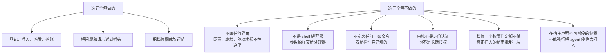

## 对应的 DSH 能力

下表由 [`docs/packages.md`](../packages.md) 与 [能力覆盖表](../portmap/capability-coverage.tsv) 机器 join 得到：本篇覆盖的 Go 包，承接的是上游 DSH 的哪几条能力，以及各自还缺什么。落点列由源码里的 `// 源:` 注释反查，不是手写的。

| 上游能力 | DSH 包 | 裁决 | 落在哪个 Go 包 | 这里缺什么 |
|---|---|---|---|---|
| 由插件注册的用户命令注册表，供交互式UI适配器使用 | `interaction/commands` | 需要 | `feature/interaction/commands` | — |
| 通过ctx.permissionPresets提供面向用户的权限预设组合沙箱与审批 | `interaction/permission-presets` | 需要 | `feature/interaction/permissionpresets` | 缺一角：捆包里只剩审批策略一个旋钮。沙箱那一整支（sandbox/*、shell/*-sandbox）本仓库判为不需要，DSH 那两条默认预设也照沙箱模式起名，所以 Go 这边不带默认表，预设表必填 |
| 模型侧ask_user_question工具，基于ctx.userQuestions实现 | `interaction/tool-ask-user` | 需要 | `feature/interaction/askuser` | — |
| 与通道无关的一次性审批seam，request返回allowed-once/rejected/cancelled/unavailable | `interaction/user-approval` | 需要 | `feature/interaction/userapproval` | — |
| 用户交互Service Definition，定义ctx.userQuestions与提供方注册 | `interaction/user-questions` | 需要 | `feature/interaction/userquestions` | — |

## 相关源码

- `feature/interaction/commands/`
- `feature/interaction/userquestions/`
- `feature/interaction/askuser/`
- `feature/interaction/userapproval/`
- `feature/interaction/permissionpresets/`
