# 不变量诊断

对应包：`invariants`

## 定位

「不变量」听着抽象，其实就是一句**永远为真的话**：

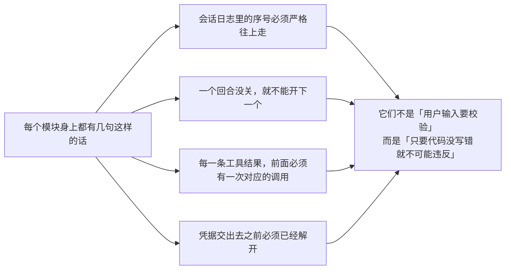
```mermaid
flowchart LR
    A["每个模块身上都有几句这样的话"] --> B["会话日志里的序号必须严格往上走"]
    A --> C["一个回合没关，就不能开下一个"]
    A --> D["每一条工具结果，前面必须有一次对应的调用"]
    A --> E["凭据交出去之前必须已经解开"]
    B --> F["它们不是「用户输入要校验」<br/>而是「只要代码没写错<br/>就不可能违反」"]
    C --> F
    D --> F
    E --> F
```

也正因为「只要没写错就不可能违反」，一旦真的违反了，那就是代码写错了——而这种错**不会自己喊疼**。

### 晚发现一次，代价差几个量级

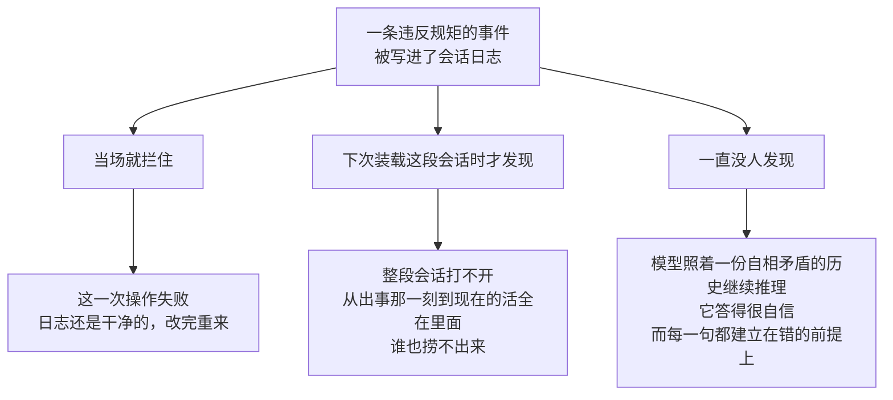
```mermaid
flowchart TD
    X["一条违反规矩的事件<br/>被写进了会话日志"] --> T1["当场就拦住"]
    X --> T2["下次装载这段会话时才发现"]
    X --> T3["一直没人发现"]
    T1 --> R1["这一次操作失败<br/>日志还是干净的，改完重来"]
    T2 --> R2["整段会话打不开<br/>从出事那一刻到现在的活全在里面<br/>谁也捞不出来"]
    T3 --> R3["模型照着一份自相矛盾的历史继续推理<br/>它答得很自信<br/>而每一句都建立在错的前提上"]
```

所以这个包的第一条主张是：**在写之前拦，不要等到下次装载。**

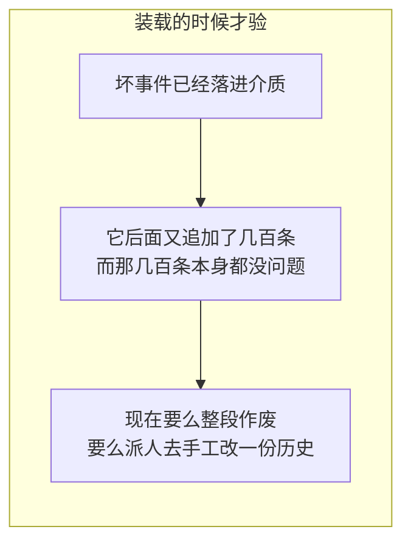
```mermaid
flowchart LR
    subgraph BAD["装载的时候才验"]
        A1["坏事件已经落进介质"] --> A2["它后面又追加了几百条<br/>而那几百条本身都没问题"]
        A2 --> A3["现在要么整段作废<br/>要么派人去手工改一份历史"]
    end
```

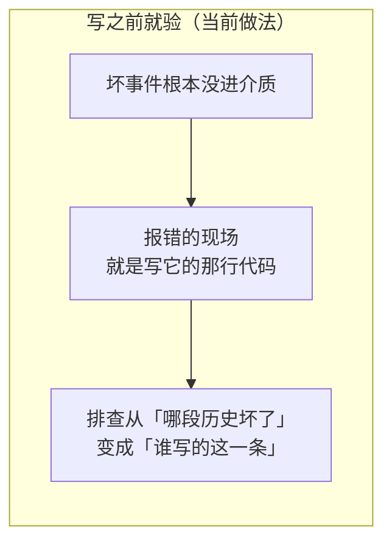
```mermaid
flowchart LR
    subgraph GOOD["写之前就验（当前做法）"]
        B1["坏事件根本没进介质"] --> B2["报错的现场<br/>就是写它的那行代码"]
        B2 --> B3["排查从「哪段历史坏了」<br/>变成「谁写的这一条」"]
    end
```

### 这些检查该由谁写、放在哪儿

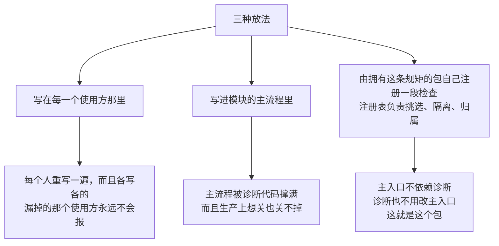
```mermaid
flowchart TD
    Q["三种放法"] --> O1["写在每一个使用方那里"]
    Q --> O2["写进模块的主流程里"]
    Q --> O3["由拥有这条规矩的包自己注册一段检查<br/>注册表负责挑选、隔离、归属"]
    O1 --> B1["每个人重写一遍，而且各写各的<br/>漏掉的那个使用方永远不会报"]
    O2 --> B2["主流程被诊断代码撑满<br/>而且生产上想关也关不掉"]
    O3 --> B3["主入口不依赖诊断<br/>诊断也不用改主入口<br/>这就是这个包"]
```

什么配放进来，什么不配：

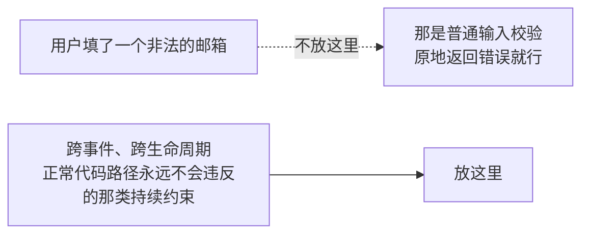
```mermaid
flowchart LR
    A["用户填了一个非法的邮箱"] -.->|"不放这里"| B["那是普通输入校验<br/>原地返回错误就行"]
    C["跨事件、跨生命周期<br/>正常代码路径永远不会违反的那类持续约束"] --> D["放这里"]
```

---

## 架构

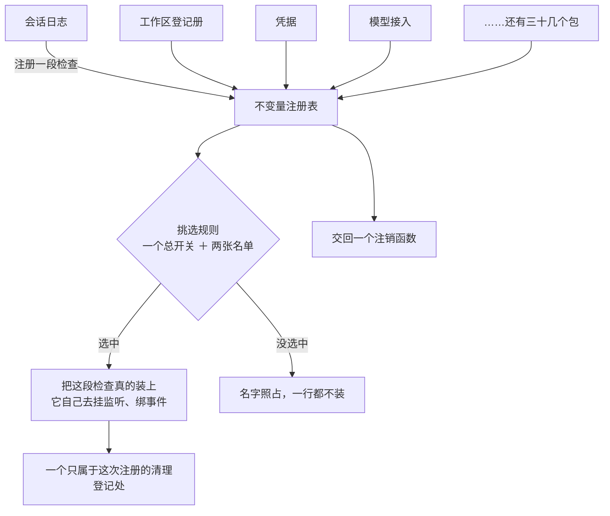
```mermaid
flowchart TD
    P1["会话日志"] -->|"注册一段检查"| REG["不变量注册表"]
    P2["工作区登记册"] --> REG
    P3["凭据"] --> REG
    P4["模型接入"] --> REG
    P5["……还有三十几个包"] --> REG
    REG --> SEL{"挑选规则<br/>一个总开关 ＋ 两张名单"}
    SEL -->|"选中"| INS["把这段检查真的装上<br/>它自己去挂监听、绑事件"]
    SEL -->|"没选中"| SKIP["名字照占，一行都不装"]
    INS --> SCOPE["一个只属于这次注册的清理登记处"]
    REG --> UNDO["交回一个注销函数"]
```

### 挑选规则

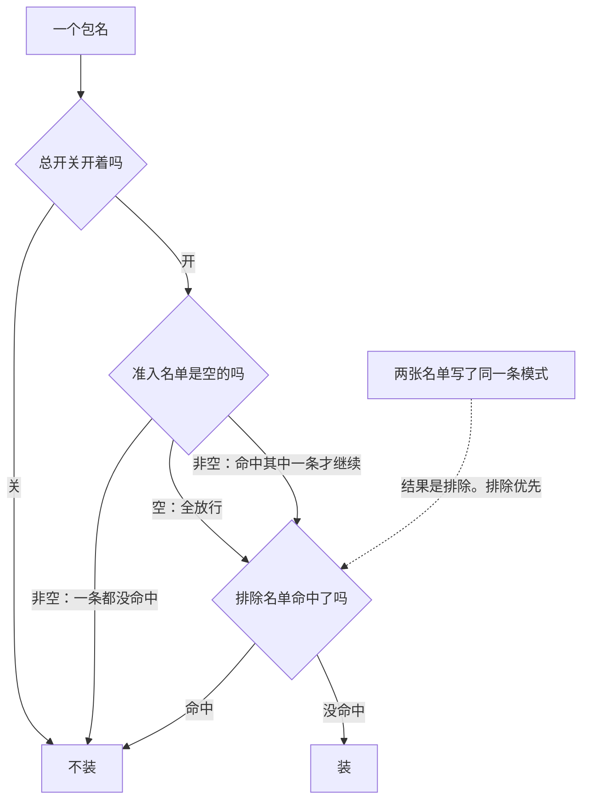
```mermaid
flowchart TD
    A["一个包名"] --> B{"总开关开着吗"}
    B -->|"关"| N["不装"]
    B -->|"开"| C{"准入名单是空的吗"}
    C -->|"空：全放行"| D{"排除名单命中了吗"}
    C -->|"非空：命中其中一条才继续"| D
    C -->|"非空：一条都没命中"| N
    D -->|"命中"| N
    D -->|"没命中"| Y["装"]
    E["两张名单写了同一条模式"] -.->|"结果是排除。排除优先"| D
```

### 规则本身写坏了，宁可起不来

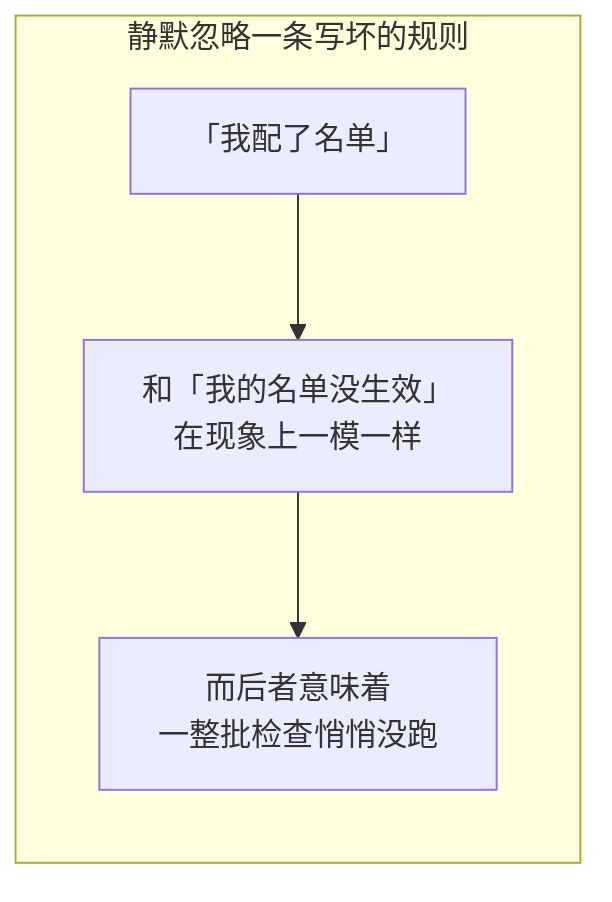
```mermaid
flowchart LR
    subgraph BAD2["静默忽略一条写坏的规则"]
        A1["「我配了名单」"] --> A2["和「我的名单没生效」<br/>在现象上一模一样"]
        A2 --> A3["而后者意味着<br/>一整批检查悄悄没跑"]
    end
```

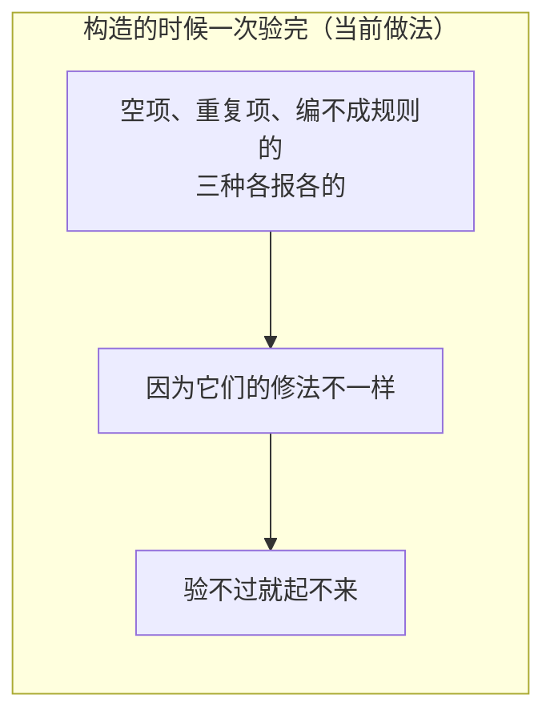
```mermaid
flowchart LR
    subgraph GOOD2["构造的时候一次验完（当前做法）"]
        B1["空项、重复项、编不成规则的<br/>三种各报各的"] --> B2["因为它们的修法不一样"]
        B2 --> B3["验不过就起不来"]
    end
```

---

## 一次注册

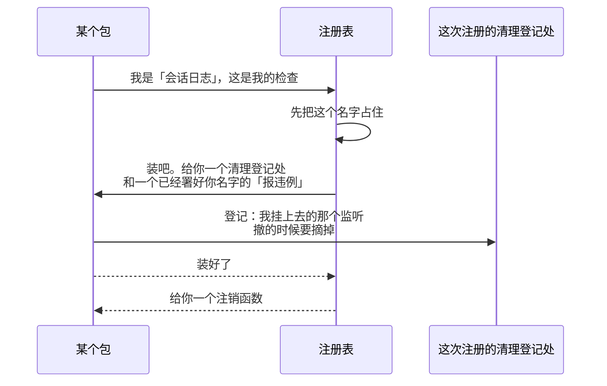
```mermaid
sequenceDiagram
    participant M as 某个包
    participant R as 注册表
    participant S as 这次注册的清理登记处
    M->>R: 我是「会话日志」，这是我的检查
    R->>R: 先把这个名字占住
    R->>M: 装吧。给你一个清理登记处<br/>和一个已经署好你名字的「报违例」
    M->>S: 登记：我挂上去的那个监听<br/>撤的时候要摘掉
    M-->>R: 装好了
    R-->>M: 给你一个注销函数
```

### 名字一律占住，哪怕这次检查被挑掉了

```mermaid
flowchart LR
    A["检查被规则挑掉了"] --> B["名字照样占着"]
    B --> C["于是「被过滤掉了」和「还没注册」<br/>永远不会混淆"]
    C --> D["开关关着的时候<br/>重复注册照样会报错"]
```

### 装到一半失败，要整体归位

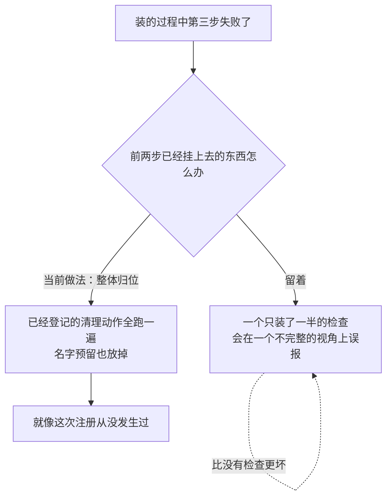
```mermaid
flowchart TD
    A["装的过程中第三步失败了"] --> B{"前两步已经挂上去的东西怎么办"}
    B -->|"留着"| C["一个只装了一半的检查<br/>会在一个不完整的视角上误报"]
    C -.->|"比没有检查更坏"| C
    B -->|"当前做法：整体归位"| D["已经登记的清理动作全跑一遍<br/>名字预留也放掉"]
    D --> E["就像这次注册从没发生过"]
```

### 注销的两个顺序都是有讲究的

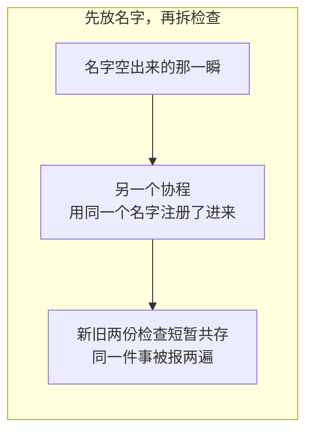
```mermaid
flowchart LR
    subgraph BAD3["先放名字，再拆检查"]
        A1["名字空出来的那一瞬"] --> A2["另一个协程<br/>用同一个名字注册了进来"]
        A2 --> A3["新旧两份检查短暂共存<br/>同一件事被报两遍"]
    end
```

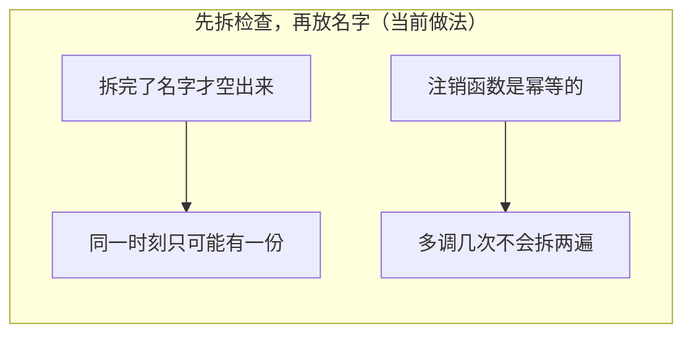
```mermaid
flowchart LR
    subgraph GOOD3["先拆检查，再放名字（当前做法）"]
        B1["拆完了名字才空出来"] --> B2["同一时刻只可能有一份"]
        B3["注销函数是幂等的"] --> B4["多调几次不会拆两遍"]
    end
```

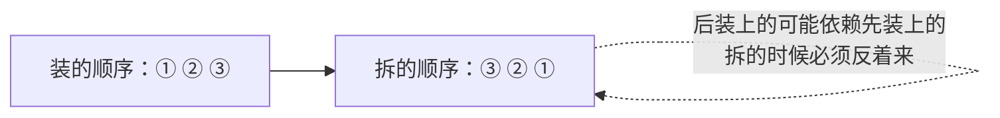
```mermaid
flowchart LR
    A["装的顺序：① ② ③"] --> B["拆的顺序：③ ② ①"]
    B -.->|"后装上的可能依赖先装上的<br/>拆的时候必须反着来"| B
```

---

## 真的违反了，会发生什么

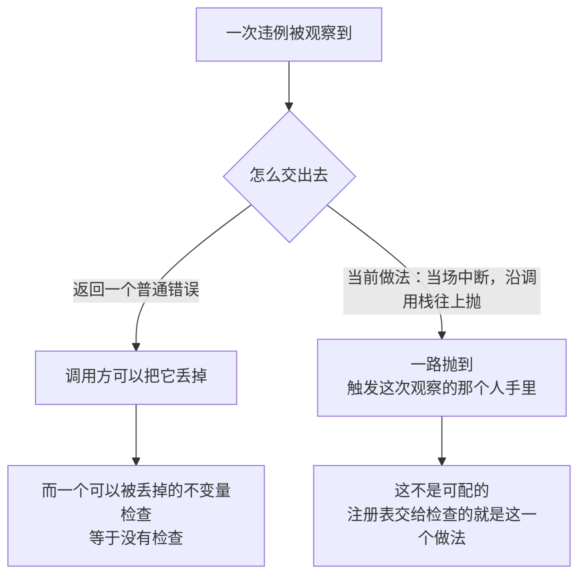
```mermaid
flowchart TD
    A["一次违例被观察到"] --> B{"怎么交出去"}
    B -->|"返回一个普通错误"| C["调用方可以把它丢掉"]
    C --> D["而一个可以被丢掉的不变量检查<br/>等于没有检查"]
    B -->|"当前做法：当场中断，沿调用栈往上抛"| E["一路抛到<br/>触发这次观察的那个人手里"]
    E --> F["这不是可配的<br/>注册表交给检查的就是这一个做法"]
```

为什么它不该被当成一个「可以处理的运行期状况」：

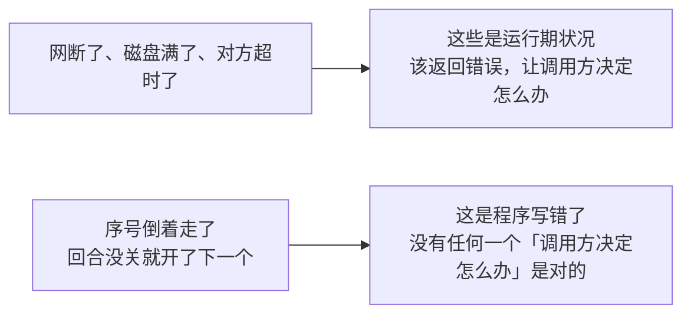
```mermaid
flowchart LR
    A["网断了、磁盘满了、对方超时了"] --> B["这些是运行期状况<br/>该返回错误，让调用方决定怎么办"]
    C["序号倒着走了<br/>回合没关就开了下一个"] --> D["这是程序写错了<br/>没有任何一个「调用方决定怎么办」是对的"]
```

违例一定盖着**注册方**的名字：

```mermaid
flowchart LR
    A["违例是在别人的操作过程中被观察到的"] --> B["报错现场那一层<br/>往往不是这条规矩的主人"]
    B --> C["所以每条违例都带着注册方的包名"]
    C --> D["一句「序号必须严格递增」<br/>这才知道该去找谁"]
```

### 有几个模块会把它**重新**抛出去

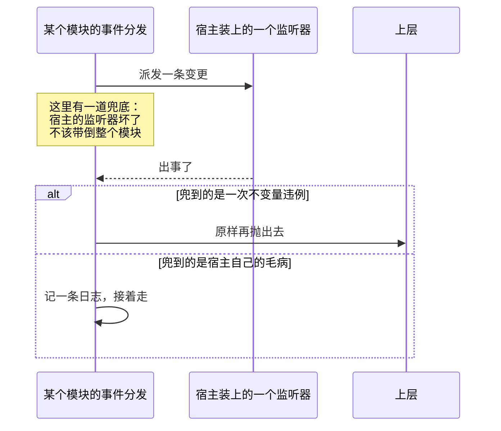
```mermaid
sequenceDiagram
    participant P as 某个模块的事件分发
    participant H as 宿主装上的一个监听器
    participant U as 上层
    P->>H: 派发一条变更
    Note over P: 这里有一道兜底：<br/>宿主的监听器坏了<br/>不该带倒整个模块
    H-->>P: 出事了
    alt 兜到的是一次不变量违例
        P->>U: 原样再抛出去
    else 兜到的是宿主自己的毛病
        P->>P: 记一条日志，接着走
    end
```

那道兜底兜的是「**别人**的监听器坏了」；而不变量违例是**我们自己**坏了，不能被降级成一条日志。

### 它不会带走整个进程

```mermaid
flowchart TD
    A["一次违例抛出来"] --> B{"它落在哪儿"}
    B -->|"Agent 回合的正文里"| C["回合边界那道兜底收住它<br/>写一条「这个回合失败了」<br/>广播出去，相回空闲"]
    B -->|"别处"| D["由调用方自己的边界负责"]
    C --> E["进程照常活着<br/>别的会话不受影响"]
```

### 宿主手上的开关是「装不装」，不是「失败了怎么办」

```mermaid
flowchart LR
    A["宿主能定的"] --> A1["总开关 ＋ 按包名挑"]
    B["宿主不能定的"] --> B1["违例了怎么办<br/>那是固定的：中断并上抛"]
    C["生产上不想让检查有能力打断请求"] -.->|"就在那一侧把它关掉<br/>而不是指望它自己降级"| A
```

---

## 生命周期与并发

```mermaid
stateDiagram-v2
    [*] --> 可注册: 构造，并把挑选规则一次验完
    可注册 --> 可注册: 注册一个新包名
    可注册 --> 可注册: 注销之后，同一个名字可以再注册进来
    可注册 --> 已关闭: Close
    已关闭 --> 已关闭: 之后的注册一律拒绝
```

已经拿到手的注销函数，在关闭之后仍然可以安全地调。

```mermaid
flowchart TD
    A["关掉注册表**不**替别人做注销"] --> B["谁装的谁拆"]
    B -.->|"注册表越权去拆<br/>装的人就再也说不准<br/>自己的清理动作何时跑过"| B
    C["登记簿由一把锁护住"] --> D["注册、查询、关闭<br/>可以来自不同的协程"]
    E["别人的装载函数和清理函数<br/>一律在锁外跑"] --> F["它们里面要做什么，注册表管不着<br/>也不该攥着锁等它们"]
```

```mermaid
flowchart LR
    A["DSH 那份 TypeScript 代码是单线程的<br/>它的注册表内部一点并发保护都不需要"] --> B["Go 这边注册和注销来自不同的协程"]
    B --> C["所以这把锁不是照其原样落地的<br/>是 Go 侧自己的必需品"]
```

---

## 失败语义

```mermaid
flowchart TD
    A["出了岔子"] --> B{"哪一类"}
    B -->|"挑选规则里有空项、重复项、编不成规则的"| C["构造就失败，起不来"]
    B -->|"包名是空的，或者里面带空白"| D["普通错误"]
    B -->|"这个包名已经有一份活着的注册"| E["普通错误"]
    B -->|"注册表已经关掉了"| F["普通错误"]
    B -->|"装载函数自己失败了"| G["整体归位，再返回普通错误"]
    B -->|"一条规矩真的被违反了"| H["当场中断，沿栈上抛<br/>带着注册方的包名"]
    H -.->|"只有这一支不是普通错误<br/>因为它说的是「程序写错了」"| H
```

---

## 能力边界

```mermaid
flowchart TD
    Y["它做的"] --> Y1["挑选：这一次装哪些包的检查"]
    Y --> Y2["隔离：装到一半失败要整体归位"]
    Y --> Y3["归属：每条违例都盖着注册方的名字"]
    N["不做的"] --> N1["不修复<br/>发现一次违例只报出来<br/>不回滚、不补齐、不改任何人的状态"]
    N --> N2["不替代普通输入校验"]
    N --> N3["不自己写检查<br/>每条检查由拥有那条规矩的包注册"]
    N --> N4["不决定生产上开不开<br/>那是宿主装配代码的事"]
    N --> N5["不做离线审计<br/>拿一份历史日志重验一遍<br/>走各模块自己那份纯校验函数"]
```

## 对应的 DSH 能力

下表由 [`docs/packages.md`](../packages.md) 与 [能力覆盖表](../portmap/capability-coverage.tsv) 机器 join 得到：本篇覆盖的 Go 包，承接的是上游 DSH 的哪几条能力，以及各自还缺什么。落点列由源码里的 `// 源:` 注释反查，不是手写的。

| 上游能力 | DSH 包 | 裁决 | 落在哪个 Go 包 | 这里缺什么 |
|---|---|---|---|---|
| 用于包自有运行时不变量检查的可配置注册表服务 | `runtime-diagnostics/invariants` | 需要 | `invariants` | — |

## 相关源码

- `invariants/invariants.go`
- 各模块的 `invariant.go`
