# 后台作业

对应包：`feature/jobs`、`feature/jobs/jobstool`、`adapter/localjobs`、`adapter/domainjobs`

## 定位

有些活儿一句话干不完：跑一个几分钟的构建、开一个长连着的进程、拉一份很大的数据。模型不能就这么杵在那儿等——它得**把活儿放到后台**，先去干别的，等干完了再回头看一眼。

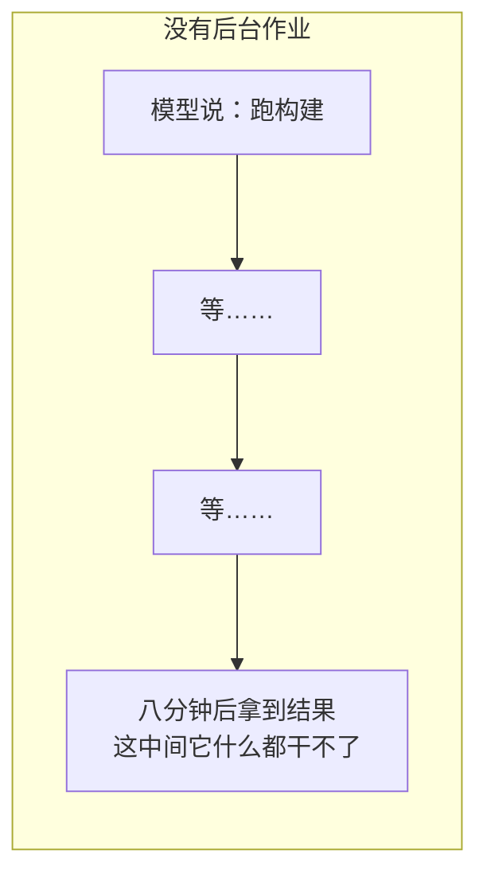

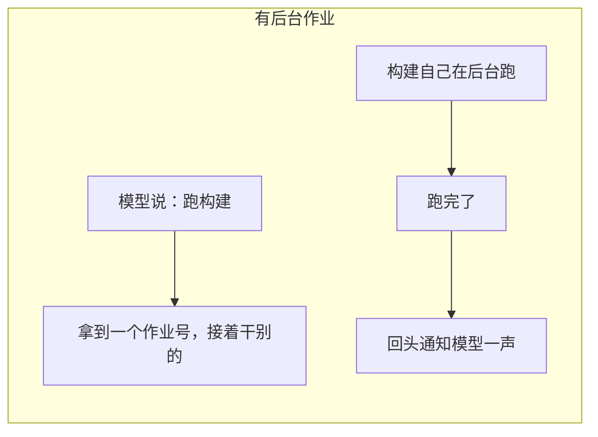

这几个包管的是那个**作业号**，以及围着它的四件事：谁看得见、怎么读、怎么停、跑完了怎么说一声。

**它们不跑那件活儿。** 起协程、干活、结算，全是生产方自己的事。

---

## 架构

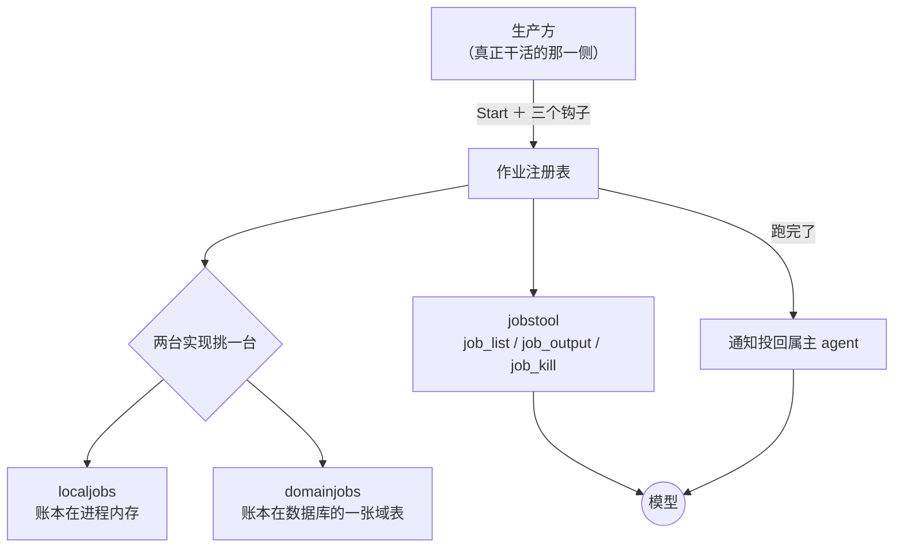

四个包的分工：

| 包 | 它管的 | 它明确不管的 |
|---|---|---|
| `feature/jobs` | 契约：作业号、可见性、生命状态、结算广播 | 谁去跑、跑在哪儿 |
| `adapter/localjobs` | 单进程里的一本账 | 别的副本 |
| `adapter/domainjobs` | 一本所有副本都读得到的账 | 把执行资源也共享出去 |
| `feature/jobs/jobstool` | 模型这一侧的三件工具、以及跑完了怎么惊动模型 | 作业本身 |

### 谁看得见一件作业，由作用域说了算

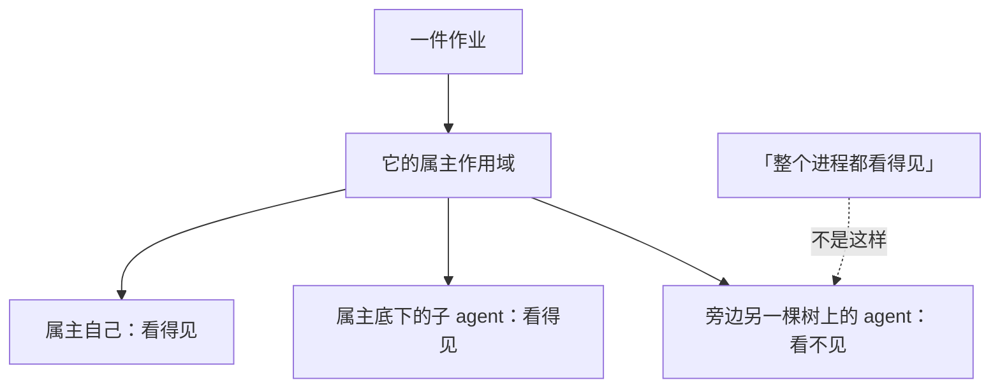

### 起活儿之前先看有没有人管得住它

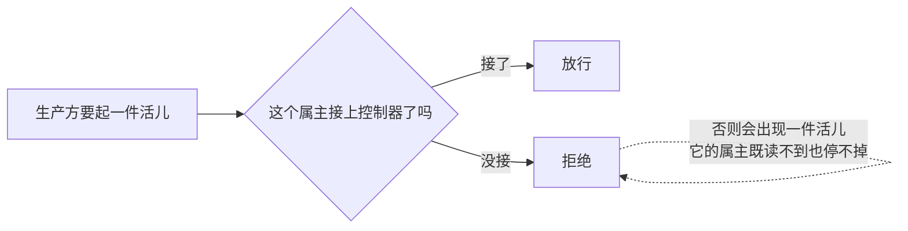

---

## 一件作业的一生

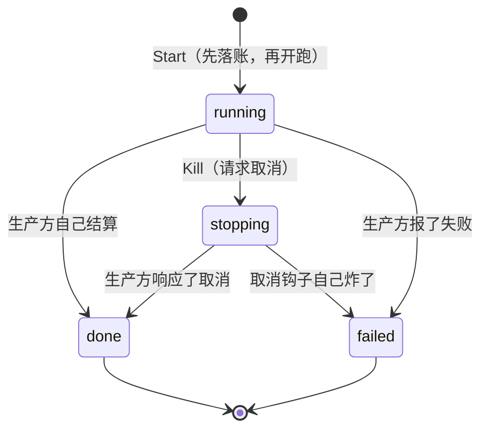

### 结算只发生一次

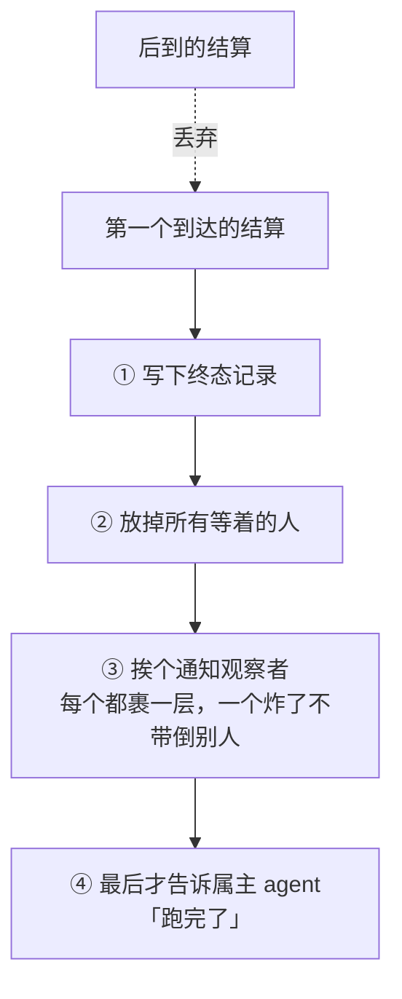

**为什么「告诉属主」要排在最后**：那一步可能当场开一个模型回合。排在前面的话，模型会在别的观察者还没看到这件事、终态记录还没写完的时候就开始动。

### Kill 是请求，不是保证

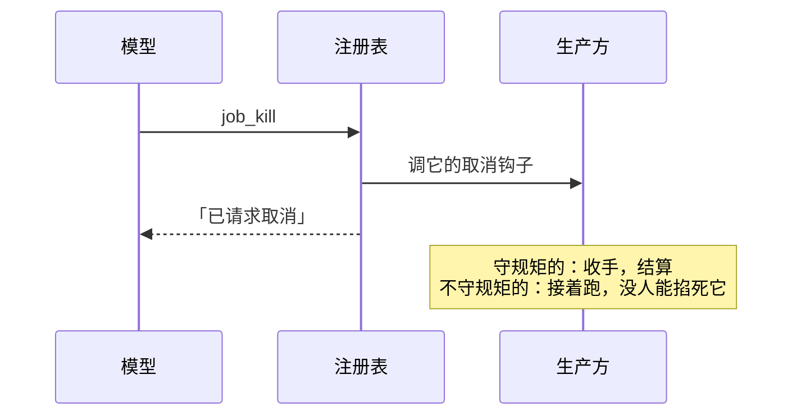

Go 没有掐死别人协程的办法。所以这里如实说「请求了」，而不是把「已请求取消」说成「已经停了」。

---

## 两台实现，按部署形态挑

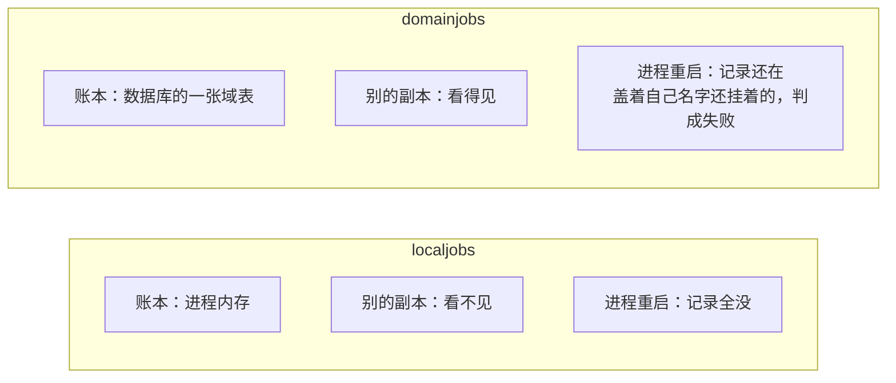

两台在装配面上对着换。多副本部署下用 `localjobs` 的后果：

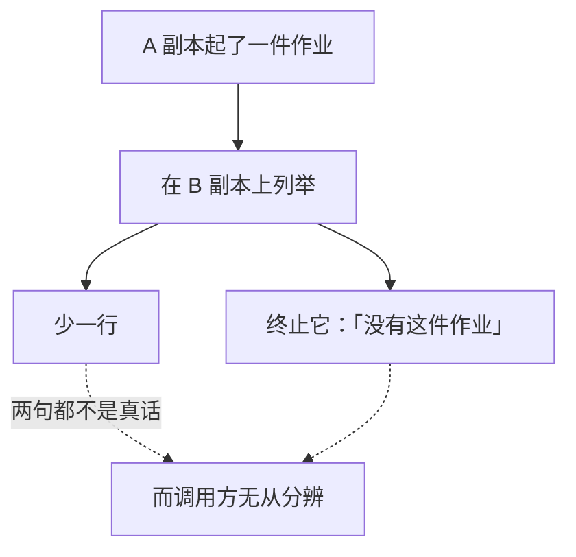

`domainjobs` 是本仓库自有的，DSH 那边只有一台进程内的实现——对一个桌面工具那是对的，对多副本部署不是。

---

## `domainjobs`：账本共享，执行不共享

理解它所有的分岔只需要这一条：

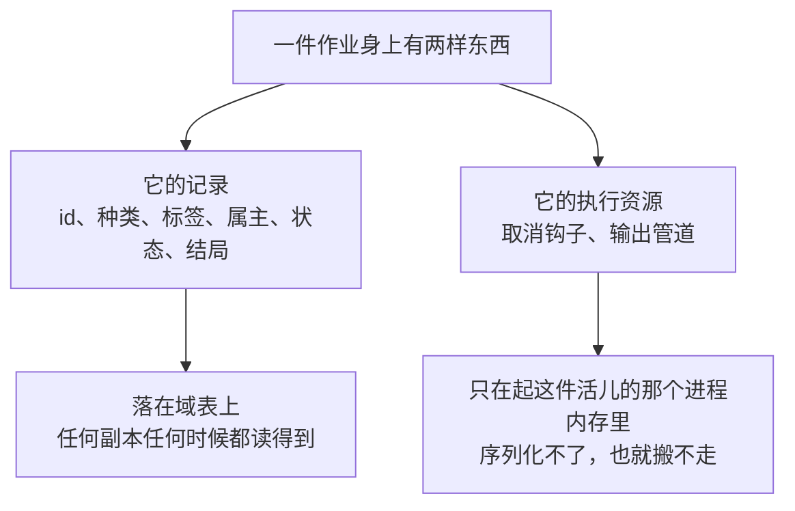

于是能力按副本分成两半：

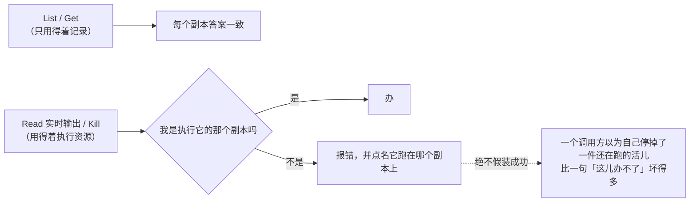

### 记录先于活儿

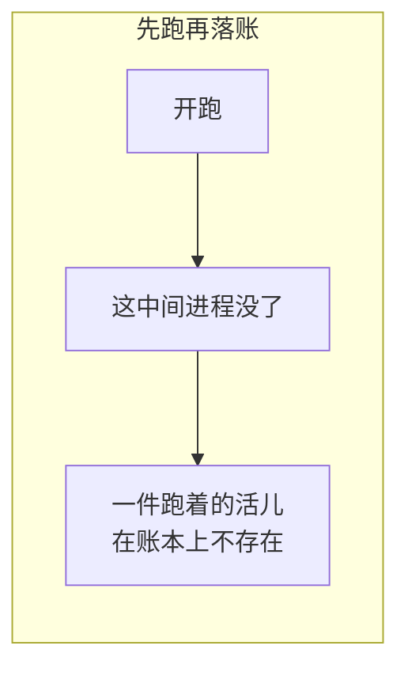

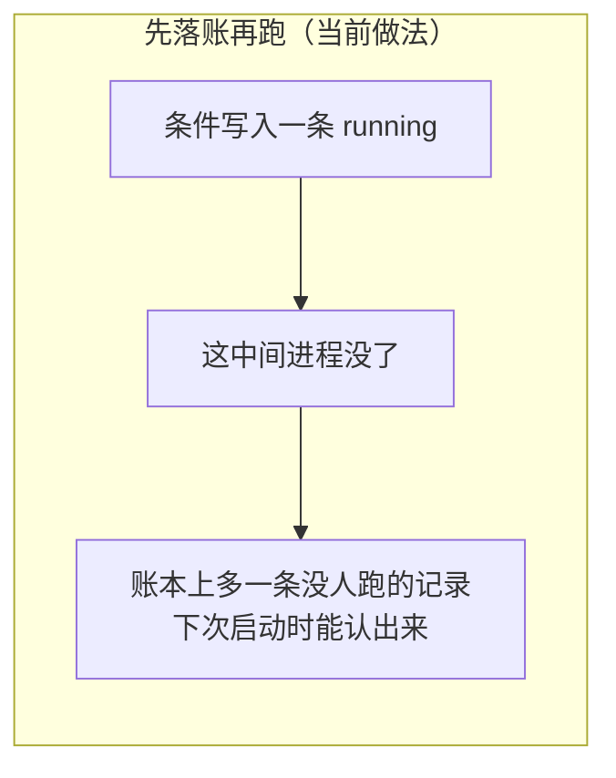

两种残留都可能发生，但**只有后一种是收得回来的**。

### 不用共享计数器发号

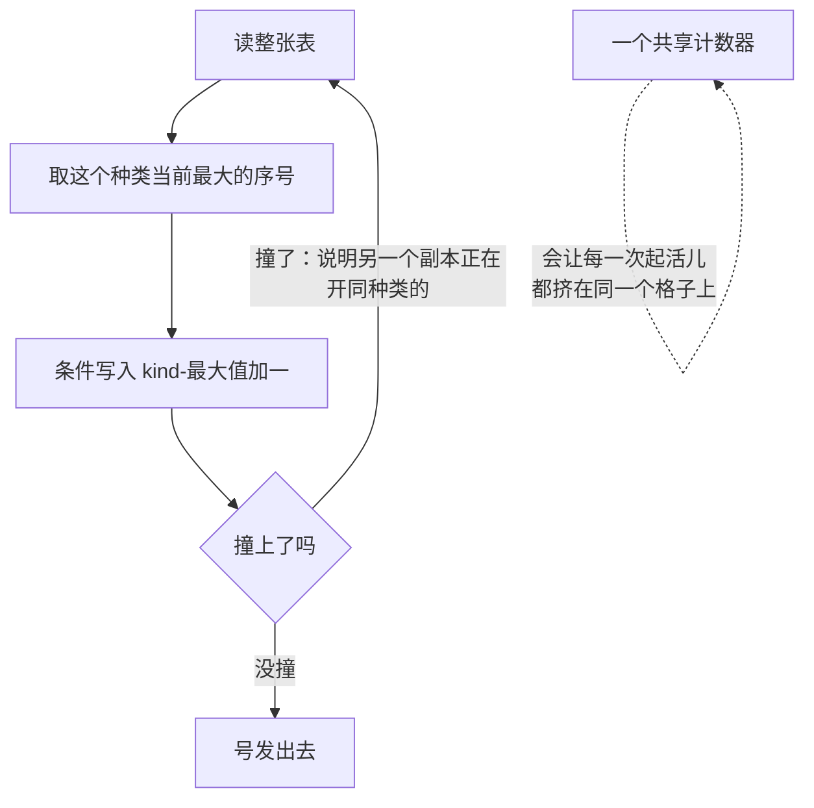

### 启动时先认领上一次的残局

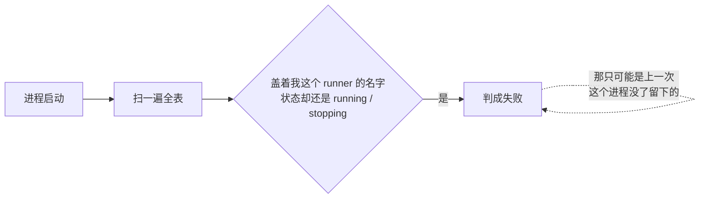

### 每属主的并发上限跨副本计

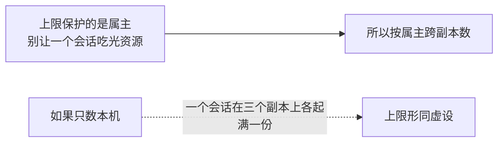

---

## `localjobs`：单进程那一台

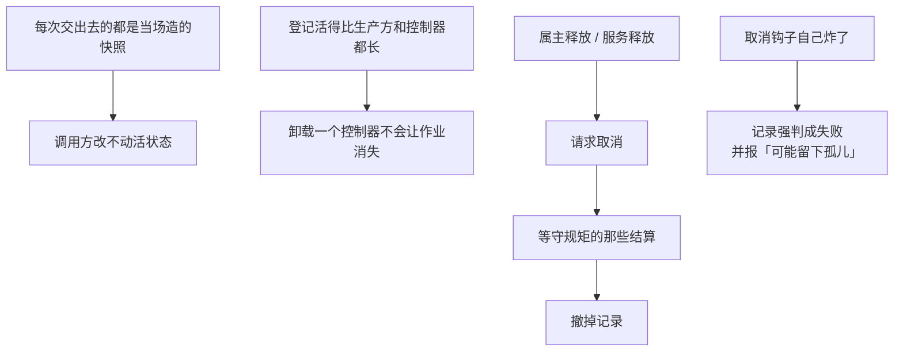

---

## `jobstool`：模型那一侧，以及跑完了怎么惊动它

### 装工具的同时把控制器也接上

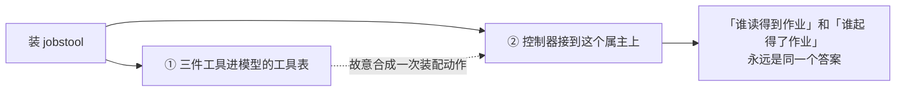

### 跑完了：属主忙就注入，属主闲就唤醒

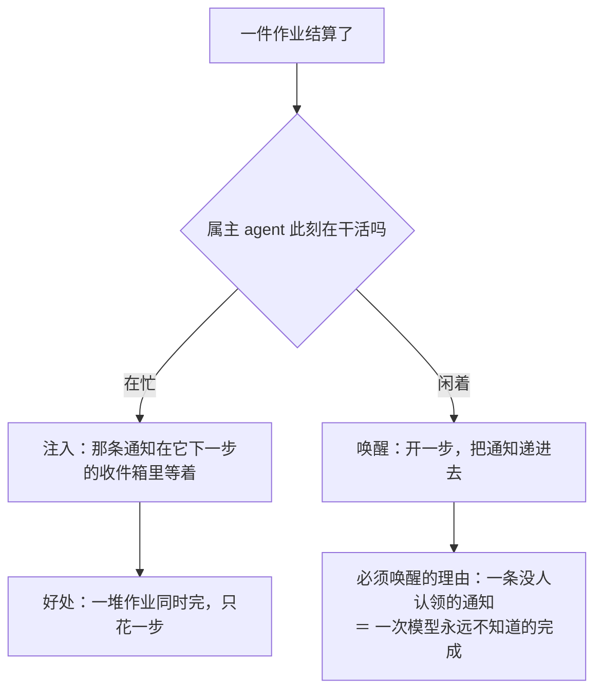

### 自激唤醒链要有闸

```mermaid
flowchart LR
    A["唤醒开了一步"] --> B["这一步里又起了一件作业"] --> C["它又完了，又唤醒一步"] --> A
    D["连续唤醒预算"] -.->|"到数就不再唤醒"| A
    E["一条人写的输入被认领"] -.->|"预算清零"| D
```

**为什么人的输入能清零**：链条是模型自己烧出来的；人重新说了一句话，说明这不是自激，是有人在看着。

### 两张记账用的映射

```mermaid
flowchart TD
    subgraph M1["按 agent 记：连续唤醒了几次"]
        A1["键：agent"] --> A2["清理挂在这个 agent 自己的作用域上"]
    end
    subgraph M2["按这次工具执行记：这一次的上下文"]
        B1["键：工具执行令牌"] --> B2["在结果规范化那一步删掉<br/>那一步每次执行恰好走一遍"]
    end
    LOCK["两张共一把互斥锁"] --> M1
    LOCK --> M2
    LOCK -.->|"因为结算来自生产方的协程<br/>而工具调用来自模型那一侧"| LOCK
```

DSH 那边这三处用的是 `WeakMap`，靠垃圾回收顺手清掉。Go 没有这个东西，所以清理点必须写明白——挂在作用域上，或者挂在一个恰好走一次的调用上。

---

## 生命周期与并发

```mermaid
flowchart TD
    A["注册表用一把互斥锁护住记录"] --> B["监听器和生产方钩子一律锁外调"]
    C["结算靠关一个 channel 广播"] --> D["多个等待者互不抢通知"]
    E["属主作用域释放 / 注册表释放"] --> F["请求取消 → 等守规矩的结算 → 撤记录"]
    G["交出去的快照和读到的输出"] --> H["都是副本"]
```

---

## 失败语义

```mermaid
flowchart TD
    A["出了岔子"] --> B{"哪一类"}
    B -->|"作业不存在 / 无权看 / 已经终止"| C["三种各报各的错<br/>不合并成一句「不行」"]
    B -->|"取消钩子失败"| D["判成失败，并说明可能留下孤儿"]
    B -->|"等待超时"| E["只结束这个等待者<br/>绝不替作业伪造一个终态"]
    B -->|"输出超了保留上限"| F["显式标出截断<br/>不静默冒充完整结果"]
```

---

## 能力边界

```mermaid
flowchart TD
    Y["这几个包做的"] --> Y1["发号、圈可见范围、记状态、广播结算"]
    Y --> Y2["把完成这件事送到模型面前"]
    N["不做的"] --> N1["不是任务队列<br/>没有排队、没有重试、没有跨副本调度"]
    N --> N2["不起协程<br/>活儿归生产方自己拥有"]
    N --> N3["Kill 是协作式取消<br/>不是强杀进程"]
    N --> N4["完成通知是副本本地的<br/>B 副本结算的作业唤不醒 A 副本上的 agent"]
    N --> N5["domainjobs 的终态记录一直留在表上<br/>谁来清、留多久，本轮没有答案"]
```

后两条各补一句：跨副本唤醒要补得有一套发布订阅，本轮不做；而终态记录之所以不敢顺手删，是因为**那是别的副本唯一还能读到结局的地方**。

## 对应的 DSH 能力

下表由 [`docs/packages.md`](../packages.md) 与 [能力覆盖表](../portmap/capability-coverage.tsv) 机器 join 得到：本篇覆盖的 Go 包，承接的是上游 DSH 的哪几条能力，以及各自还缺什么。落点列由源码里的 `// 源:` 注释反查，不是手写的。

| 上游能力 | DSH 包 | 裁决 | 落在哪个 Go 包 | 这里缺什么 |
|---|---|---|---|---|
| 后台任务注册表约定，为长时间运行的生产方提供共享id、owner隔离、读取、取消、等待、通知和清理 | `jobs/jobs` | 需要 | `feature/jobs` | — |
| ctx.jobs注册表约定的进程本地实现，把每条记录保存在内存中并按kind签发id | `jobs/jobs-local` | 需要 | `adapter/domainjobs` `adapter/localjobs` | — |
| ctx.jobs的面向模型控制器，提供job_output、job_list和job_kill三个与kind无关的工具 | `jobs/tool-jobs` | 需要 | `feature/jobs/jobstool` | — |

## 相关源码

- `feature/jobs/`
- `adapter/localjobs/`
- `adapter/domainjobs/`
- `feature/jobs/jobstool/`
