# harness/session：活着的会话

> 本文只讲一个包：把一次**正在进行**的对话，在内存里如实攥住的那个包。
>
> 会话的**词汇**——事件有哪些类型、负载长什么样、表面怎么折——在另一个包，见 [Session](session.md)。
> 落地归 `feature/persistence`，读侧归 [Session 查询](sessionquery.md)。这三样都不在本文范围内。

| 你是谁 | 从哪儿开始读 |
|---|---|
| 产品 | 「定位」整节，再看「一个会话的一生」 |
| 要**用**这个包的研发 | 「为什么创建拆成三步」「四组观察者」「生命周期与并发」 |
| 要**改**这个包的研发 | 全篇，尤其「序号不是下标」和「两扇窗口」 |

---

## 定位

### 为什么需要这么个东西

一次对话正在进行的时候，「这次对话现在是什么样」这件事总得有个东西攥着。

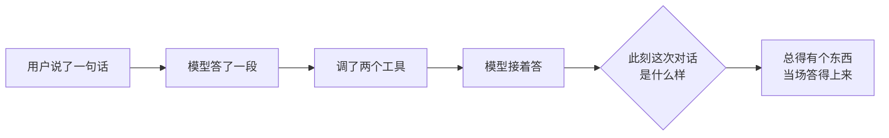

它管的是**此刻**。另外两件事各有各的主人，它一件都不碰：

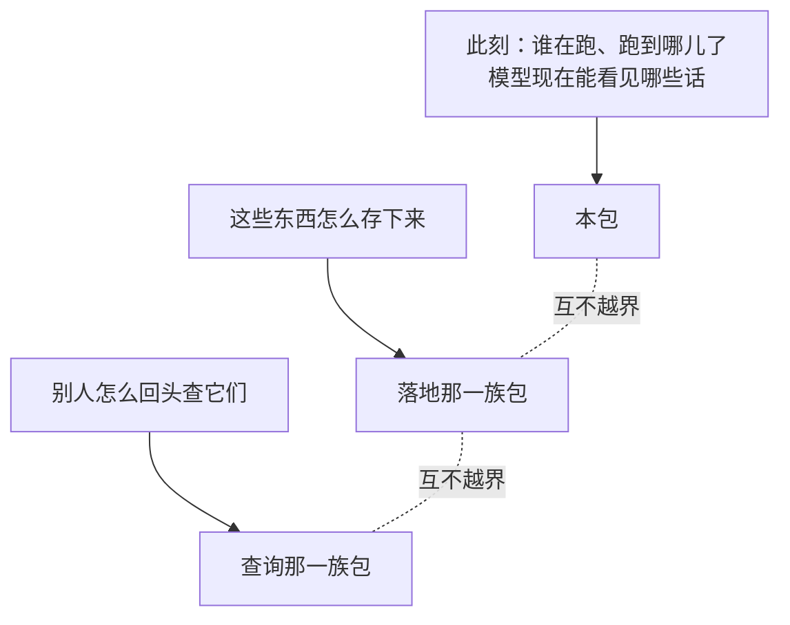

它只做一件事：把正在发生的对话在内存里如实攥住，并且每次有新东西发生的时候，让所有关心的人**当场**知道。

### 产品能感知到的三件事


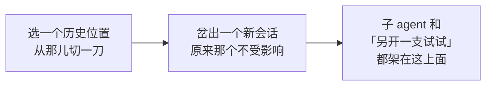

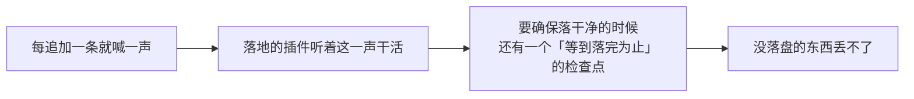

### 用研发的话说

一个会话是一份只增不改的事件序列，外加挂在它上面的几份增量折叠：

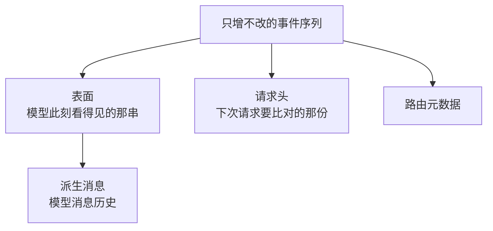

一份会话名册是一张身份到会话的 map，外加四组按作用域路由的观察者：

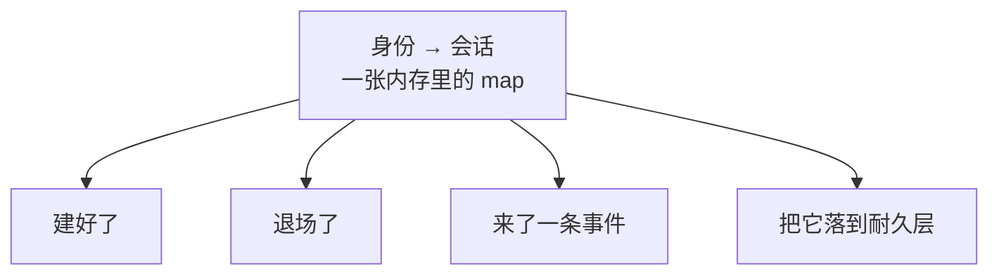

包里没有 I/O、没有常驻协程、没有定时器：

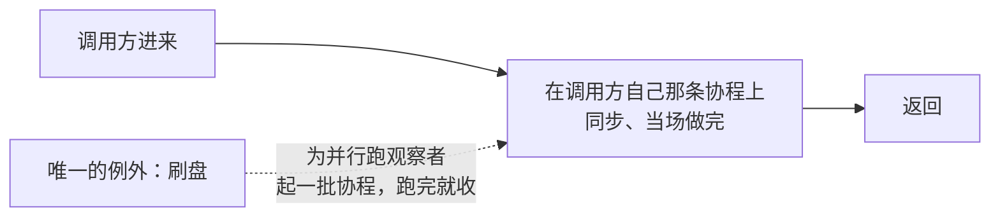

### 它是被劈开的那一半

DSH 把会话的词汇和会话的活对象放在同一个包里。本仓库劈成两个：

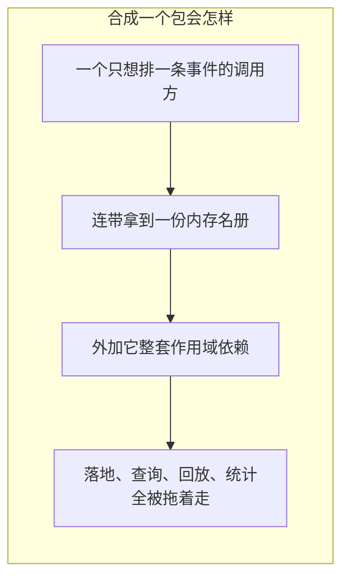

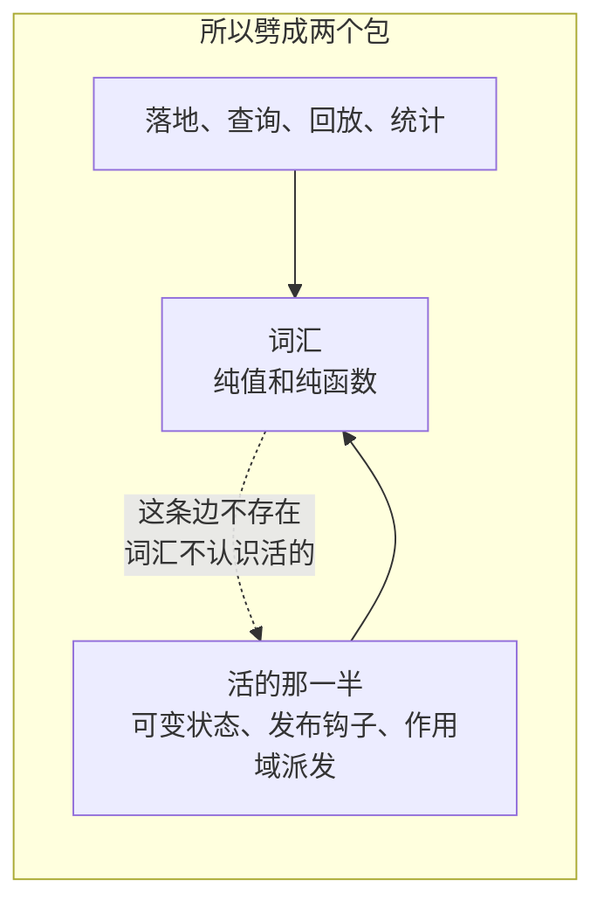

两个包在 Go 里的包名一模一样，所以活的这一半在源码里把词汇那一半改了个名字引进来。

### 术语对照

| 词 | 意思 |
|---|---|
| 会话 | 一份只增不改的事件日志，加挂在它上面的几份折叠 |
| 游离的 / 活的 | 造出来了但没进名册 / 已经进了某份名册 |
| 登记 | 一个会话在某份名册里那份可变状态 |
| 公布 | 向创建观察者宣告「这儿有个新会话」，**可被否决** |
| 摘除 | 把登记从名册里拿掉，并补发配对的通知 |
| 载体作用域 | 这个会话登记在谁名下，决定谁能观察到它 |
| 表面 | 模型此刻看得见的那串事件 |
| 构造种子 | 造这个会话时喂进去的历史事件 |
| 起点 | 这份日志现存最早一条事件的序号 |
| 血统边界 | 当初从父会话继承了多长的前缀，**耐久** |
| 发布窗口 | 一次追加已提交、观察者还在跑的那段时间 |
| 刷盘 | 要等的那个耐久检查点 |

### 一条贯穿全包的原则

**一件事一旦被别人看见，就不能当它没发生过。**

这一条在四个地方各出现一次，形状不一样，是同一件事：

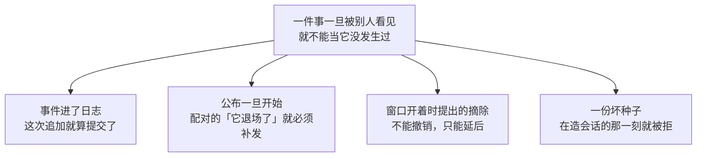

四条各自的展开在后文。这里先看最不直觉的一处——「公布过」这个标记是在派发**之前**立起来的：

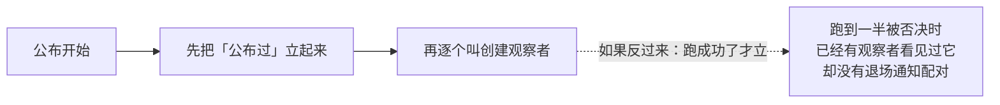

读这个包的任何一段，先问一句「这一步之后，有没有人已经看见了什么」，多半就能推出它为什么这么写。

---

## 架构

### 全景

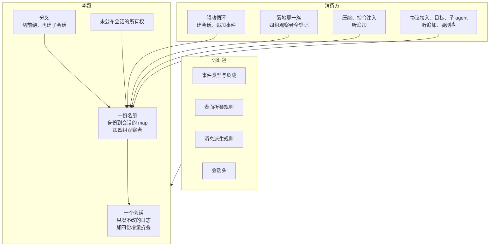

事件长什么样、表面怎么折、消息怎么派生，一条规则都不在这儿定，全是问词汇包要的。

消费方一律从名册进来，没有绕过它直接摸一个会话的路：

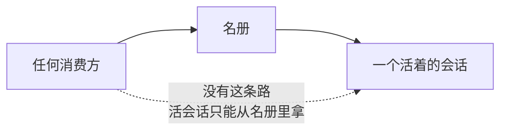

### 三样东西的分工

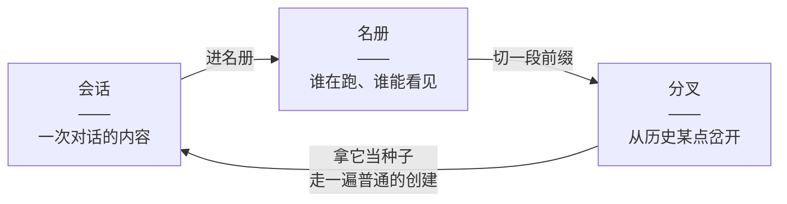

边界很干净：

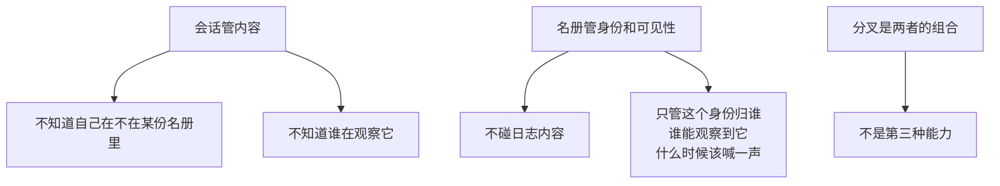

游离态是一个真实存在的状态，不是过渡态：

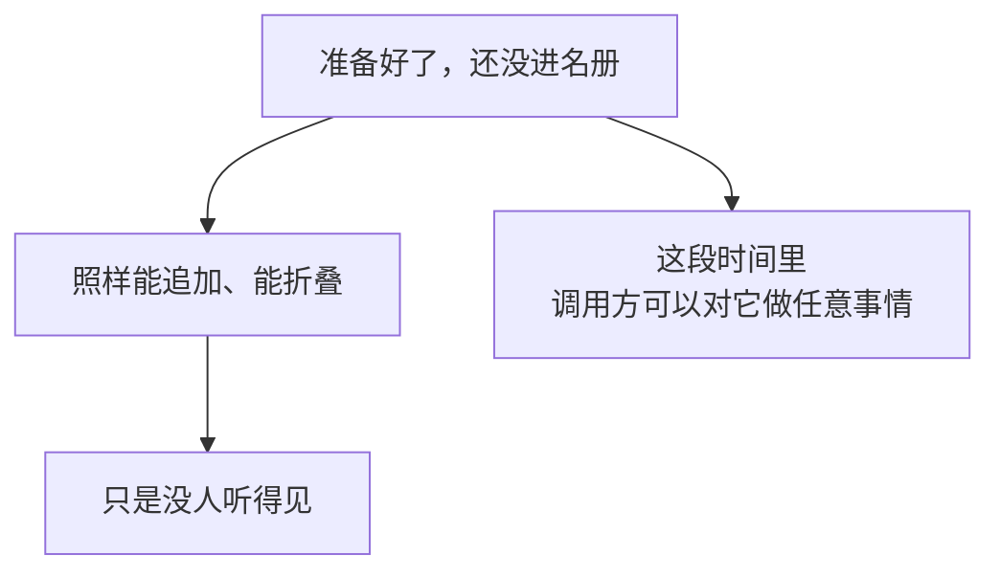

### 一个会话的一生

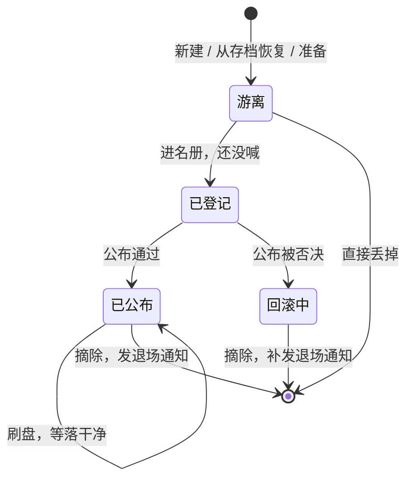

两条边容易被忽略。第一条：「公布被否决」不等于「当作没发生」。

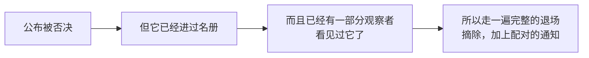

第二条：「准备好了但最终没公布」根本不必经过名册。

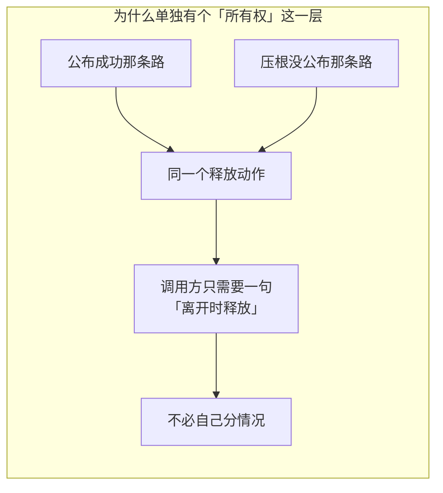

### 为什么创建拆成三步

对外有一个一步到位的入口，但它内部就是三步的封装，而这三步各自都是公开的。

```mermaid
sequenceDiagram
    participant 调用方
    participant 名册
    participant 作用域
    participant 观察者

    调用方->>名册: 第一步：准备
    Note over 名册: 铸名 / 查重名（非权威）<br/>装好耐久的头 / 造出会话
    名册-->>调用方: 一个游离的会话

    调用方->>名册: 第二步：进名册
    Note over 名册: 重名再查一次（这次权威）<br/>登记 / 绑定
    名册-->>调用方: 摘除这个能力

    调用方->>作用域: 把摘除挂到自己的作用域上
    Note over 作用域: 先把撤销挂上去<br/>再去公布

    调用方->>名册: 第三步：公布
    名册->>观察者: 逐个、同步地告诉它们「建好了」
    alt 有人否决
        观察者-->>名册: 报错
        名册-->>调用方: 失败
        调用方->>作用域: 执行摘除
        作用域->>观察者: 配对补上「退场了」
    else 全通过
        名册-->>调用方: 成功
    end
```

**第二步为什么不顺手把公布也做了。**

```mermaid
flowchart LR
    subgraph BAD["进名册顺手就公布"]
        A["一个观察者否决掉创建"] --> B["留下一份没人持有的登记"]
        B --> C["外加它整套发布钩子"]
        C --> D["那个会话从此谁也摘不掉"]
    end
```

```mermaid
flowchart LR
    subgraph GOOD["中间留一格"]
        A["进名册，拿到摘除"] --> B["先把撤销挂到自己的作用域上"]
        B --> C["再去公布"]
        C --> D["否决时有人负责把它拆掉"]
    end
```

**重名为什么查两次，而且第二次才算数。**

```mermaid
flowchart TD
    A["准备 和 进名册<br/>是两个公开的跨包动作"] --> B["中间调用方可以插进任意工作<br/>包括另一次创建"]
    B --> C{"如果只在准备时查一次"}
    C --> D["一个过期的、准备好的会话<br/>盖掉一份已经活着的同名登记"]
    D --> E["它那个摘除之后<br/>把真正那一个删掉了"]
```

```mermaid
flowchart LR
    A["第一次查<br/>准备的时候"] --> A1["非权威。只为了让<br/>「这个名字已经有人了」<br/>在造会话之前就报出来"]
    A1 --> A2["省掉一次白造"]
    B["第二次查<br/>进名册的时候"] --> B1["权威。它和登记<br/>发生在同一段临界区里"]
```

**什么时候不能用那个一步到位的入口。**

```mermaid
flowchart LR
    subgraph BAD["会话和它的驱动循环各登记一次"]
        A["作用域上的撤销<br/>是后进先出的一条链"] --> B["两次独立登记之间<br/>没有次序保证"]
        B --> C["会话可能先被拆掉"]
        C --> D["循环最后那几条收尾事件<br/>在发布钩子被摘掉之后才提交"]
        D --> E["那几条就丢了"]
    end
```

```mermaid
flowchart LR
    subgraph GOOD["折进同一次登记"]
        A["会话和 agent<br/>一起登记成一格"] --> B["拆的时候按次序一起拆"]
        B --> C["驱动循环走的正是三步那条路<br/>不是一步到位那个入口"]
    end
```

### 一次追加的全过程

```mermaid
sequenceDiagram
    participant 调用方
    participant 会话
    participant 表面折叠
    participant 观察者

    调用方->>会话: 交进来半条事件

    rect rgba(200,200,200,0.15)
    Note over 会话: 第一段 锁外：三道形状检查
    会话->>会话: 序号和时间戳必须是空的
    会话->>会话: 负载必须是合法 JSON
    会话->>会话: 不能是已删掉的旧格式请求头
    end

    rect rgba(120,160,220,0.15)
    Note over 会话,表面折叠: 第二段 拿着会话那把锁
    会话->>会话: 重入检查：正在发布吗
    会话->>会话: 盖上序号 = 起点 + 长度，盖上时间戳
    会话->>表面折叠: 推一条进去（验不过就什么都不动）
    表面折叠-->>会话: 通过
    会话->>会话: 进日志 / 让旧快照作废
    会话->>会话: 收观察者名单 / 立起发布标记
    end

    rect rgba(160,200,160,0.15)
    Note over 会话,观察者: 第三段 锁外：已提交，只是广播
    loop 每个观察者
        会话->>观察者: 把这条事件递过去
        Note over 观察者: 崩了被兜住记日志<br/>不改变返回值
    end
    会话->>会话: 放下发布标记<br/>补上窗口里提的摘除
    end

    会话-->>调用方: 盖好戳的那条事件
```

三段颜色就是三个阶段，边界是**那把锁**和**提交点**。

**序号和时间戳由会话自己盖，调用方填了就报错。**这里没有「默默盖掉」这个选项：

```mermaid
flowchart LR
    subgraph BAD["默默盖掉调用方填的那个"]
        A["调用方以为自己指定了位置"] --> B["日志里却是另一个数"]
        B --> C["两边都不报警"]
        C --> D["最糟的一种处理"]
    end
```

**表面折叠是追加路径上唯一会失败的语义检查，而且它是原子的。**

```mermaid
flowchart LR
    subgraph BAD["先验一次，再推一次"]
        A["验过了"] --> B["再推一次"]
        B --> C["推的时候还会不会失败"]
        C --> D["多出一条永远走不到的错误分支"]
    end
```

```mermaid
flowchart LR
    subgraph GOOD["推进去这一步本身就是原子的"]
        A["推"] --> B{"过得了吗"}
        B -->|"过了"| C["表面往前走一格"]
        B -->|"没过"| D["表面一动不动<br/>这条事件也不留下"]
    end
```

**绿色那一段之后就没有回头路了。**

```mermaid
flowchart TD
    A["事件已经在日志里"] --> B["观察者做什么<br/>都改不了这次追加的结果"]
    B --> C["所以挂在这里的落地插件<br/>必须是非阻塞的"]
    C --> D["热路径不为 I/O 等待<br/>缓冲是插件自己的事"]
```

### 序号不是下标

这是本包和 DSH 差别最大的一处，也是最容易写错的一处。

```mermaid
flowchart LR
    subgraph BAD["DSH：序号恒等于下标"]
        A0["下标 0<br/>序号 0"] --> A1["下标 1<br/>序号 1"] --> A2["下标 2<br/>序号 2"]
    end
```

```mermaid
flowchart LR
    subgraph GOOD["本仓库：序号 = 起点 + 下标"]
        B0["下标 0<br/>序号 500"] --> B1["下标 1<br/>序号 501"] --> B2["下标 2<br/>序号 502"]
    end
    X["被弹掉的<br/>序号 0 到 499"] -.->|"不在内存里了"| B0
```

DSH 把「序号恒等于下标」当成不变量，因为那边的日志从零开始、连续、一条不删。本仓库不成立：一份日志会从**最老的一头**被弹掉一截，见 [会话日志上限](../session-log-limit.md)。

```mermaid
flowchart TD
    A["包里凡是拿序号定位的地方"] --> B["先减起点，得到下标"]
    B --> C["减完还要核对<br/>落上的确实是同一条"]
```

**起点这个值由装配方显式给，不从种子的第一条推。**

```mermaid
flowchart LR
    subgraph BAD["从种子第一条的序号推起点"]
        A["一份序号写错了的种子"] --> B["被读成「哦，起点在那儿」"]
        B --> C["等于放弃对第一条的校验"]
        C --> D["分叉一个子会话时<br/>那正是最需要拦住的错"]
    end
```

```mermaid
flowchart LR
    subgraph GOOD["装配方显式给"]
        A["起点是存储那一侧的事实"] --> B["只有拿着存档的人说得出来"]
        B --> C["于是种子的第一条<br/>还能被核一遍"]
    end
```

少了这个概念的后果很具体：

```mermaid
flowchart LR
    A["追加时把下一条的序号<br/>算成「日志长度」"] --> B["而不是「起点 + 长度」"]
    B --> C["新事件静默撞掉<br/>已有的那一段"]
```

**本包自己不弹。**

```mermaid
flowchart LR
    A["包里只有追加"] --> B["没有任何弹出<br/>或裁剪日志的动作"]
    C["「从最老的一头弹」<br/>发生在别处"] --> D["本包只是<br/>能接受一个非零的起点"]
```

---

## 会话对象能做什么、不做什么

### 日志：只增不改

```mermaid
flowchart LR
    A["往尾巴上加一条"] --> B["日志"]
    C["删"] -.->|"没有这个动作"| B
    D["改"] -.->|"没有这个动作"| B
    E["插队"] -.->|"没有这个动作"| B
```

```mermaid
flowchart TD
    A["调用方在候选事件上能填的"] --> A1["类型"]
    A --> A2["负载"]
    A --> A3["可忽略标记"]
    A --> A4["表面操作"]
    A --> A5["来源事件序号"]
    B["会话自己盖的"] --> B1["序号"]
    B --> B2["时间戳"]
```

### 四份增量折叠

日志是「发生过什么」，运行时要读的常常是「现在是什么」：

```mermaid
flowchart TD
    L["日志：发生过什么"] --> F1["表面<br/>每次追加折一条<br/>从不整份重来"]
    L --> F2["请求头<br/>只折上次之后新增的那一段<br/>从不整份重来"]
    L --> F3["路由元数据<br/>只扫上次之后新增的那一段<br/>从不整份重来"]
    F1 --> F4["派生消息<br/>每个表面节点只投影一次<br/>表面被替换过才整份重来"]
```

表面从不整份重来，是因为**它就是权威**。

**表面是派生消息的唯一来源，这一条是有内容的：**

```mermaid
flowchart TD
    A["每一次会产出消息的追加<br/>都记下了自己的表面操作"] --> B["一条没带标记的原始事件<br/>一个流式分块、一次回合边界"]
    B --> C["理所当然地缺席"]
    A --> D["一次压缩带来的替换"]
    D --> E["把被盖住的那些节点<br/>从派生结果里删掉"]
    C --> F["不需要另写一套<br/>「哪些事件算数」的规则"]
    E --> F
    F --> G["表面已经是那套规则了"]
```

**「替换代数」是重建的触发条件，不是追加：**

```mermaid
flowchart LR
    A["普通追加"] --> A1["派生历史往后长一截"]
    B["位置替换<br/>压缩、工具结果改写"] --> B1["前面的内容失效"]
    B1 --> B2["这时候才整份重建"]
```

### 交出去的东西怎么算

| 交出去的 | 外面那一层壳 | 里面的内容 |
|---|---|---|
| 事件日志快照 | 复制的 | **共享**（负载字节） |
| 派生消息 | 每次都是新的 | **共享** |
| 表面节点序号 | 复制的 | 值类型，无所谓 |
| 会话头 | 值，直接复制 | 全标量 |

```mermaid
flowchart TD
    A["壳是复制的"] --> A1["之后的追加<br/>长不了你已经拿在手里的那一份"]
    B["里面的负载字节是共享的"] --> B1["拿到的东西当只读的用"]
    B1 --> B2["要一份自己拥有的<br/>就显式克隆一次"]
```

```mermaid
flowchart LR
    subgraph BAD["DSH 靠深度冻结"]
        A["在那边「改不动」<br/>是运行期事实"] --> B["Go 里没有这回事"]
        B --> C["所以这条只是<br/>写在文档上的契约"]
    end
```

### 会话对象不负责什么

```mermaid
flowchart TD
    A["会话对象"] -.->|"不知道自己被谁观察"| A1["广播是名册那一侧的能力<br/>游离的会话追加一样成功<br/>只是没人听见"]
    A -.->|"不做 I/O"| A2["追加是纯内存操作"]
    A -.->|"不弹自己的日志"| A3["只有追加，没有裁剪"]
    A -.->|"不定义事件语义"| A4["类型、负载形状、表面规则<br/>消息派生规则全在词汇包"]
```

---

## 会话名册能做什么、不做什么

### 四组观察者

```mermaid
flowchart TD
    subgraph 有否决权
        A["建好了<br/>——<br/>一个会话进名册了"]
    end
    subgraph 只观察
        B["退场了"]
        C["来了一条事件<br/>——<br/>它已经提交了"]
    end
    subgraph 要等
        D["落到耐久层"]
    end

    A -->|"报错 或 崩溃<br/>= 否决整次创建"| A1["回滚，加上补发退场通知"]
    B -->|"崩溃"| B1["记日志"]
    C -->|"崩溃"| C1["记日志"]
    D -->|"全部并行跑完才返回"| D1["按登记顺序<br/>报第一个失败"]
```

四组的失败语义**各不相同**，各有理由。

**「建好了」这一组，崩溃也算否决：**

```mermaid
flowchart TD
    A["分不出「我拒绝这次创建」<br/>和「我这儿坏了」"] --> B{"只能挑一边"}
    B -->|"当成拒绝"| C["最坏是白建一次会话"]
    B -->|"当成放行"| D["一个装配到一半就炸了的落地插件<br/>会让这个会话被当成已经落好盘的"]
    C --> E["两种错法代价差得远<br/>所以挑拒绝"]
    D --> E
```

**「来了一条事件」这一组失败只记日志**，因为事件已经提交了：

```mermaid
flowchart LR
    subgraph BAD["让观察者的故障回头改写结果"]
        A["把一条已被接受的事件<br/>变成失败"] --> B["做不到，日志里已经有了"]
        A --> C["还会挡住后面的观察者<br/>看见它"]
    end
```

**刷盘报的是「登记顺序里第一个失败的」，不是「最先失败的那个」：**

```mermaid
flowchart LR
    subgraph BAD["按到达顺序报"]
        A["观察者是并行跑的"] --> B["同一批观察者<br/>每次跑出来的诊断都不一样"]
        B --> C["没法查"]
    end
```

### 作用域派发

```mermaid
flowchart TD
    G["全局层<br/>看得见每一个会话"] -->|"收到"| S["一个登记在子作用域名下的会话"]
    P["父作用域层"] -->|"收到"| S
    C["子作用域层"] -->|"收到"| S
    O["登记在兄弟作用域上的观察者"] -.->|"收不到"| S
```

观察者名单按会话的**载体作用域**沿父链取并集：全局层的看得见全部，某个作用域上的只看得见从它或它子孙那里登记进来的会话。顺序是全局在前、远祖次之、载体自己最后。

两件独立的事，别混：

```mermaid
flowchart LR
    A["载体作用域<br/>谁能观察到它"] --> A1["由进名册那一步的参数决定"]
    B["摘除挂在哪儿<br/>谁负责拆它"] --> B1["由调用方自己决定"]
    A1 -.互不牵连.- B1
```

**收观察者名单这一步故意不拿名册那把锁**，理由见「生命周期与并发」。

### 刷盘

刷盘只有一个入口。这不是省事，是**一个主人一种写法**：

```mermaid
flowchart TD
    A["每请求一次的检查点策略"] --> Z["都从这一个入口过"]
    B["目标轮次驱动的空闲检查点"] --> Z
    C["拆除时的排空"] --> Z
    D["读存储前先刷一次的消费方"] --> Z
    Z --> Y["载体作用域归名册所有<br/>所以派发只能由它做"]
```

```mermaid
flowchart LR
    subgraph BAD["各自去派发一遍"]
        A["每个调用方自己<br/>拼一次作用域并集"] --> B["同一件事有五种写法"]
        B --> C["谁写漏一层作用域<br/>谁那条路上就少落一份"]
    end
```

它还会告诉调用方**有没有观察者参与**：

```mermaid
flowchart LR
    A["落完了"] --> C{"这是两件事"}
    B["压根没人负责落盘"] --> C
    C --> D["混起来会让调用方<br/>把后者当成前者"]
```

### 会话名册不负责什么

```mermaid
flowchart TD
    M["会话名册"] -.->|"不做落地"| M1["只在追加和刷盘时把钩子拉响<br/>落盘是挂上来的插件自己的事"]
    M -.->|"不管会话内容"| M2["不读日志、不折表面"]
    M -.->|"不做鉴权"| M3["作用域过滤管的是「谁能观察到」<br/>不是「谁有权访问」"]
    M -.->|"不回收"| M4["靠摘除离开<br/>没有超时、没有后台清理"]
    M -.->|"不跨进程"| M5["一张内存里的 map<br/>没有任何跨节点一致性"]
```

第一条是落地那一族包存在的前提。

---

## 分叉

从一个活会话的稳定前缀，切出一个新的活会话。

### 边界怎么算

```mermaid
flowchart TD
    A{"给了边界吗"} -->|"没给"| B["取来源最后一条的序号<br/>来源是空的就分出一个空子会话"]
    A -->|"给了"| C{"边界是负数吗"}
    C -->|"是"| E1["边界不合法<br/>必须非负"]
    C -->|"否"| D["减掉起点，得到下标"]
    B --> D
    D --> F{"下标是负数吗"}
    F -->|"是"| E2["边界不合法<br/>这一段已经被弹掉了"]
    F -->|"否"| G{"下标越界吗"}
    G -->|"是"| E3["边界不合法<br/>这个序号不存在"]
    G -->|"否"| H{"落上那一条的序号<br/>真的等于边界吗"}
    H -->|"不等"| E4["边界不合法<br/>日志不连续"]
    H -->|"相等"| I["从这里往回找<br/>最近的回合边界"]
    I -->|"找到的是回合开始"| E5["回合还开着<br/>不许分"]
    I -->|"找到回合结束，或一条都没有"| J["切前缀，建子会话"]
```

### 五种拒绝

| 码 | 意思 | 调用方该做什么 |
|---|---|---|
| `SESSION_NOT_FOUND` | 这个来源在名册里不存在 | 换个来源 |
| `SESSION_NOT_LIVE` | 来源**对象**不是名册里活着的那一份 | 重新取一次 |
| `SESSION_ALREADY_EXISTS` | 要给子会话的名字被占了 | 换个名字 |
| `INVALID_BOUNDARY` | 边界不是一个连续存在的序号 | 把边界往前挪 |
| `OPEN_TURN` | 前缀停在一个没关的回合里 | 把边界挪到回合边界上 |

其中「不是活着的那一份」只可能从一条路上产生：

```mermaid
flowchart LR
    subgraph BAD["DSH：一个联合类型的参数"]
        A["「给对象」和「给名字」<br/>是同一个入口"] --> B["这条错只可能<br/>从「给对象」产生"]
        B --> C["而这一点<br/>要读实现才看得出来"]
    end
```

```mermaid
flowchart LR
    subgraph GOOD["本仓库：拆成两个入口"]
        A["给名字那个入口"] --> A1["压根说不出<br/>「我要的是那一个对象」"]
        B["给对象那个入口"] --> B1["只有它会报<br/>「不是活着的那一份」"]
        B1 --> C["签名上就看得见"]
    end
```

### 四个判断

**边界是序号，不是下标。**

```mermaid
flowchart LR
    A["DSH 直接拿它当下标使"] -->|"因为那边两者恒等"| B["本仓库要先减起点"]
```

**落在被弹掉的那一段，就如实说它不在了。**

```mermaid
flowchart LR
    subgraph BAD["残缺着往下走"]
        A["分叉要的正是<br/>这些事件本身"] --> B["不是从它们折出来的状态"]
        B --> C["少一段就是分不了"]
    end
```

**减完还要再核一次序号对不对得上。**

```mermaid
flowchart TD
    A["这道检查看起来多余<br/>前面已经按连续性算过了"] --> B["但分叉是一道<br/>会生出新会话的边界"]
    B --> C["一份不连续的日志<br/>切出来的种子建不起来"]
    C --> D["与其让它在构造里<br/>报一句关于种子的话"]
    D --> E["不如在这里说清<br/>是边界对不上"]
```

**回合没关就不许分，连负载读不回来也不放行。**

```mermaid
flowchart LR
    A["那条「回合开始」摆在那儿"] --> B["就说明回合是开着的"]
    C["读不出回合号"] -.->|"只让诊断少一个数字"| D["不改变「不许分」这件事"]
```

### 子会话继承什么

```mermaid
flowchart TD
    S["来源会话"] --> C1["事件，连同它们的序号"]
    S --> C2["工作目录，从来源的头上原样取"]
    S --> C3["父会话标识，指向来源"]
    S --> C4["血统边界 = 这次继承的前缀长度"]
    C1 --> N1["所以子会话的起点就是来源的起点<br/>来源头部被弹过时，那个数不是零"]
```

**血统边界不能从种子长度反推：**

```mermaid
flowchart LR
    subgraph BAD["从种子长度反推"]
        A["一个续跑起来的会话"] --> B["它的种子是<br/>自己完整的存储日志"]
        B --> C["而血统边界说的是<br/>当初从父会话继承了多长"]
        C --> D["两者只在「刚分叉出来」<br/>这一刻恰好相等"]
    end
```

---

## 生命周期与并发

DSH 是单线程 JS，一个会话的日志不可能被两处同时改。本仓库不行，所以整套并发保护是这边加的。

### 两把锁

```mermaid
flowchart LR
    ST["名册那把锁"] -->|"允许：摘除时<br/>拿着它去问会话"| S["会话那把锁"]
    S -.->|"禁止"| ST
```

规矩只有一条：**名册那把锁可以在会话那把锁之前拿，不许在它之后拿。**

反方向那条边之所以根本不存在：

```mermaid
flowchart TD
    A["追加路径拿着会话那把锁的时候<br/>要收观察者名单"] --> B["而那一步<br/>故意不拿名册那把锁"]
    B --> C["作用域那一层<br/>自己并发安全"]
    C --> D["所以反向的边压根出现不了"]
    D --> E["这是刻意的设计，不是省略"]
```

```mermaid
flowchart LR
    A["两把锁从不同时持有"] --> B["观察者一律在锁外调用"]
    B --> C["一个观察者回头读同一个会话<br/>不会自锁"]
```

### 两扇窗口

包里有两段「事情做了一半、别人已经看见了」的时间：

```mermaid
flowchart LR
    A["公布窗口"] --> A1["创建观察者<br/>正在被逐个调用"]
    B["发布窗口"] --> B1["一次追加已提交<br/>事件观察者正在被逐个调用"]
```

```mermaid
sequenceDiagram
    participant 观察者
    participant 名册
    participant 会话

    Note over 名册,会话: 发布窗口开着
    观察者->>名册: 调摘除（它手里攥着这个能力）
    名册->>会话: 你还在发布吗
    会话-->>名册: 是
    Note over 名册: 不真摘，记下「有人要摘」
    名册-->>观察者: 返回（看起来摘了）

    Note over 会话: 观察者全跑完
    会话->>名册: 窗口关了
    名册->>名册: 补上那次摘除
    名册->>观察者: 配对发出「退场了」
```

```mermaid
flowchart LR
    subgraph BAD["窗口开着的时候真摘"]
        A["在同步派发的中途"] --> B["把登记和发布钩子<br/>从正在跑的观察者脚下抽掉"]
        B --> C["它们看到一个半拆的世界"]
    end
```

两扇窗口互相也要让：

```mermaid
flowchart LR
    A["关掉其中一扇"] --> B{"另一扇也关了吗"}
    B -->|"关了"| C["执行延后的摘除"]
    B -->|"还开着"| D["接着等"]
```

### 只许有一个写者

追加路径上有一个重入标记：

```mermaid
flowchart TD
    A["重入标记"] --> B["挡住 DSH 也挡的那件事<br/>某个事件观察者在回调里<br/>又对同一个会话追加"]
    A --> C["还挡住 Go 才有的那件事<br/>另一个协程同时追加"]
```

```mermaid
flowchart LR
    subgraph BAD["把并发追加序列化"]
        A["第二个写者排队等着"] --> B["等到了照样写进去"]
        B --> C["一份日志有了两个来源<br/>而且没人知道"]
    end
```

```mermaid
flowchart LR
    subgraph GOOD["直接拒绝"]
        A["一个会话的日志<br/>只该有一个写者"] --> B["它自己那个驱动循环"]
        B --> C["撞上这条错误<br/>说明有第二个写者"]
        C --> D["那是缺陷<br/>不是需要重试的竞争"]
    end
```

### 能力是有身份的

包里有三处看起来重复的身份检查，防的是同一类事故：**一个过期的能力，不许动后来那一次同名生命周期的东西。**

```mermaid
flowchart TD
    A["摘除时"] --> A1["核对名册里那一份<br/>就是自己这一份<br/>不然不动"]
    B["解绑时"] --> B1["核对会话当前认的<br/>就是传进来的这一份"]
    C["刷盘和公布前"] --> C1["核对这个会话对象<br/>确实是本名册里活着的那一份"]
    C1 --> C2["游离的、已摘除的<br/>属于另一份名册的，一律拒"]
```

```mermaid
flowchart LR
    subgraph BAD["少了这些检查"]
        A["一个会话摘了<br/>同一个身份又建了一个"] --> B["同名生命周期先后发生<br/>本来就是正常的"]
        B --> C["前一次的摘除动作<br/>把后一次的登记删掉"]
    end
```

---

## 边界检查

进这个包的东西要过四道，各自的失败该让调用方做的事不一样。

```mermaid
flowchart TD
    A["会话头"] --> A1["版本对不对<br/>身份对不对得上<br/>时间戳非负<br/>工作目录是绝对路径<br/>血统边界非负<br/>来源取值合法<br/>委派层数非负"]
    Z["日志起点"] --> Z1["不能是负数"]
    B["构造种子里每一条"] --> B1["不是已删掉的旧格式<br/>类型非空 / 序号非负<br/>负载排得回 JSON<br/>消息形状对<br/>从起点开始连续<br/>能折进表面"]
    C["每一次追加"] --> C1["序号和时间戳是空的<br/>负载是合法 JSON<br/>不是旧格式请求头<br/>能折进表面"]
    B1 -.->|"同一套约束"| C1
```

最重要的是那条虚线：**种子按和追加一模一样的约束验。**

```mermaid
flowchart LR
    subgraph BAD["种子验得比追加松"]
        A["一份坏种子进来了"] --> B["变成一份看起来能跑<br/>但没有任何后端存得下的活日志"]
        B --> C["要么在后来某次刷盘<br/>被后端拒收时才浮出来"]
        B --> D["要么干脆表现为<br/>活日志和存储悄悄分了岔"]
        C --> E["都比当场报错难查得多"]
        D --> E
    end
```

一次回放或分叉，不能造出一份没有任何落地后端存得下的活日志。

### 三处细节

**起点是负数当场就拒，报的是种子那一类错。**

```mermaid
flowchart LR
    A["起点和种子<br/>是同一件事实的两半"] --> B["「这份日志从哪儿起」<br/>和「从那儿起的这些事件」"]
    C["一个负起点"] --> D["会让整段种子的连续性检查<br/>按一个不可能的期望值去比"]
    D --> E["与其让它在第一条事件上<br/>报一句「序号应该是负五百」"]
    E --> F["不如在读种子之前<br/>就说清是起点本身给错了"]
```

**包里认得两样已经删掉的旧格式**——一种增量请求头事件、一种请求头原因取值：

```mermaid
flowchart LR
    A["一份旧日志读进来"] --> B{"报哪一句"}
    B -->|"不认得，只能说「不认识的类型」"| C["帮不上忙"]
    B -->|"认得，能说「这是已经删掉的旧格式」"| D["帮得上忙"]
```

认它们纯粹是为了报一句说得清的话。

**工作目录用跟着平台走的绝对路径判断。**

```mermaid
flowchart LR
    A["这条路径是存储那一侧<br/>用来给会话分组的那个键"] --> B["所以它必须在本机上成立"]
    C["用只认 POSIX 的那种判断"] -.->|"会怎样"| D["在 Windows 上把每一条<br/>真实的工作目录都判成非绝对"]
```

### 「没给」和「给了一份空的」不是一回事

```mermaid
flowchart TD
    A{"构造种子传的是什么"} -->|"压根没给"| B["不补那条种子结束标记"]
    A -->|"给了一份长度为零的"| C["照样补上那条标记"]
    C --> D["分叉一个空会话<br/>走的就是这条路"]
```

这个标记还有一条规矩：

```mermaid
flowchart LR
    A{"这份种子已经以它结尾了吗"} -->|"是"| B["不再补"]
    A -->|"否"| C["补一条"]
    B --> D["一个冷会话<br/>是被第一次触碰时唤醒的"]
    D --> E["反复打开同一个会话<br/>不能让它的日志每开一次就长一条"]
```

---

## 失败语义

| 分类 | 什么时候 | 日志变了吗 | 调用方该做什么 |
|---|---|---|---|
| 头不合法 | 造会话 / 恢复 | 没建成 | 别建，头本身有问题 |
| 种子不合法 | 造会话 | 没建成 | **别建这个会话**——坏种子造出的活日志没有后端存得下 |
| 追加不合法 | 追加 | **没变** | 修候选事件，或者查是不是有第二个写者 |
| 同名会话已存在 | 铸名 / 进名册 | — | 换个名字 |
| 会话不在本名册里活着 | 刷盘 / 公布 | — | 重新取一次，或者查是不是拿错了对象 |
| 会话已经有主了 | 进名册 | — | 一个会话对象只能登记进一份名册 |
| 已经公布过了 | 公布 | — | 查是不是在创建回调里递归公布 |
| 分叉被拒（五种） | 分叉 | — | 见分叉那一节的五种拒绝 |

```mermaid
flowchart LR
    A["「追加不合法时<br/>日志一动不动」是硬承诺"] --> B["因为表面折叠是原子的"]
```

观察者的失败没列在上面，因为它们不构成调用失败：

```mermaid
flowchart TD
    A["「建好了」那一组失败"] --> A1["变成「创建被否决」"]
    B["「落到耐久层」那一组失败"] --> B1["变成「刷盘失败」"]
    C["「退场了」和「来了一条事件」<br/>这两组失败"] --> C1["只进日志"]
```

---

## 能力边界

这个包负责：

```mermaid
flowchart TD
    P["本包"] --> D1["攥住一个会话只增不改的事件日志<br/>保证追加是定序、盖戳、验过表面的"]
    P --> D2["增量维护表面、请求头<br/>路由元数据、模型消息历史"]
    P --> D3["把会话登记进一份内存名册<br/>管住它的公布、摘除，以及两者的配对"]
    P --> D4["按作用域路由四组观察者<br/>并为每一组定义各自的失败语义"]
    P --> D5["提供刷盘这个唯一的耐久检查点入口"]
    P --> D6["从一个活会话的稳定前缀分叉出子会话<br/>并说清被拒时是哪一类"]
    P --> D7["在造会话和追加两道边界上<br/>用同一套约束挡住存不下的日志"]
```

这个包不负责：

```mermaid
flowchart TD
    P["本包"] -.->|"不做落地"| N1["只拉钩子<br/>落盘归挂上来的插件"]
    P -.->|"不定义会话词汇"| N2["事件类型、负载形状、表面规则<br/>消息派生规则全在词汇包"]
    P -.->|"不弹日志"| N3["只有追加，没有裁剪<br/>它只是能接受一个非零起点"]
    P -.->|"不提供查询"| N4["没有按内容检索<br/>没有跨会话列举语义"]
    P -.->|"不跨进程"| N5["一张内存里的 map<br/>没有分布式协议"]
    P -.->|"不做鉴权"| N6["作用域过滤管的是可见性<br/>不是权限"]
    P -.->|"不自己计时"| N7["没有超时、没有过期<br/>没有后台回收"]
    P -.->|"不为 I/O 阻塞"| N8["追加是纯内存的<br/>唯一会等的是刷盘<br/>而那是调用方明确要求的"]
```

---

## 谁在用它

| 消费方 | 用的是哪一面 |
|---|---|
| 驱动循环 | 走准备、进名册、公布这三步，把会话折进 agent 那一格登记；追加事件；听退场 |
| 落地那一族 | **唯一一个把四组观察者全登记上的**：建档、收事件、落盘、收尾；恢复时走那个交出所有权的入口 |
| 压缩、指令注入 | 听事件，据此维护自己的增量状态 |
| 协议接入、目标、子 agent、日程 | 听事件往外推通知；在各自的检查点上调刷盘 |
| 会话查询 | **还没接上**，见下 |

```mermaid
flowchart TD
    A["协议接入"] --> Z["刷盘"]
    B["轮次驱动"] --> Z
    C["提醒落地"] --> Z
    D["子 agent 收尾"] --> Z
    E["压缩事务"] --> Z
    Z --> Y["五类调用方，一个入口<br/>正是「一个主人一种写法」<br/>要解决的问题"]
```

```mermaid
flowchart LR
    A["分叉在仓库里<br/>目前没有非测试调用方"] --> B["能力是完整的、测过的"]
    B --> C["但还没有产品路径走它"]
```

```mermaid
flowchart LR
    A["会话查询要的是<br/>「头 加 事件」这样一份借用观察"] --> B["名册交出的是会话对象本身"]
    B --> C["两个读入口都现成"]
    C --> D["缺的只是那一小层转换<br/>仓库里现在还没有"]
```

## 对应的 DSH 能力

下表由 [`docs/packages.md`](../packages.md) 与 [能力覆盖表](../portmap/capability-coverage.tsv) 机器 join 得到：本篇覆盖的 Go 包，承接的是上游 DSH 的哪几条能力，以及各自还缺什么。落点列由源码里的 `// 源:` 注释反查，不是手写的。

| 上游能力 | DSH 包 | 裁决 | 落在哪个 Go 包 | 这里缺什么 |
|---|---|---|---|---|
| 事件溯源的会话日志和内存存储，为agent保留全部交互历史 | `core/session` | 需要 | `harness/session` | — |

## 相关源码

| 路径 | 内容 |
|---|---|
| `harness/session/doc.go` | 为什么和词汇包分家、四组观察者的由来、不移的那几样 |
| `harness/session/session.go` | 会话对象：日志、四份增量折叠、追加的三段、与存储的绑定 |
| `harness/session/store.go` | 内存表：四组观察者、三步生命周期、作用域派发、刷盘、两扇窗口 |
| `harness/session/fork.go` | 分叉：五种拒绝、边界怎么算、开着的回合怎么挡 |
| `harness/session/validate.go` | 三道边界检查、七个哨兵错误、两样旧格式 |
| `harness/session/preparation.go` | 未公布会话的所有权，一次性释放 |
