# LLM 测试与回放

对应包：`sessionlog/snapshot`、`feature/replay`、`llm/mockserver`、`cmd/llmmockserver`

## 定位

一套建在模型之上的装置，最难办的事是**它没法照常规办法测自己**。同一句话问两遍，模型答得不一样；今天答得出来，明天限流就答不出来；想让它在第 7 轮的第 3 个分块之后断掉，它不听。

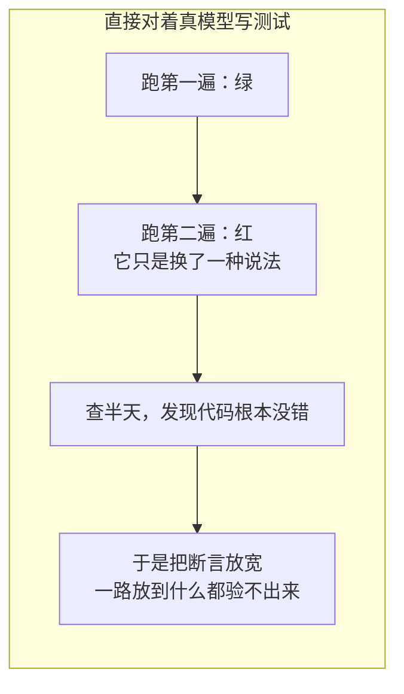
```mermaid
flowchart LR
    subgraph N["直接对着真模型写测试"]
        A1["跑第一遍：绿"] --> A2["跑第二遍：红<br/>它只是换了一种说法"]
        A2 --> A3["查半天，发现代码根本没错"]
        A3 --> A4["于是把断言放宽<br/>一路放到什么都验不出来"]
    end
```

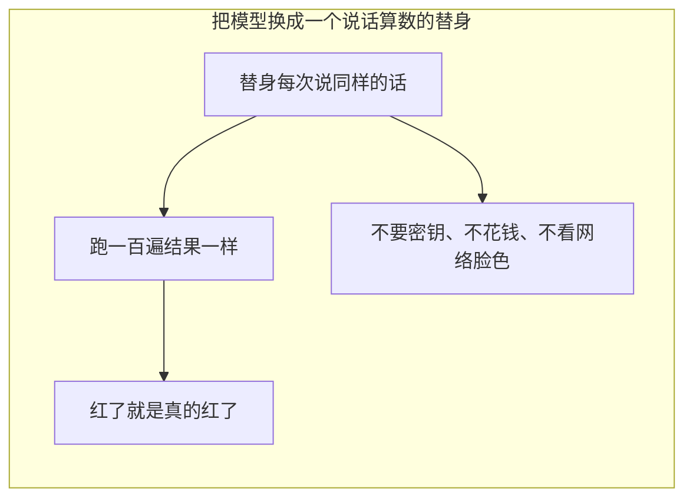
```mermaid
flowchart LR
    subgraph Y["把模型换成一个说话算数的替身"]
        B1["替身每次说同样的话"] --> B2["跑一百遍结果一样"]
        B2 --> B3["红了就是真的红了"]
        B1 --> B4["不要密钥、不花钱、不看网络脸色"]
    end
```

这四个包要摆平的不确定性其实是两种，各走一条路：

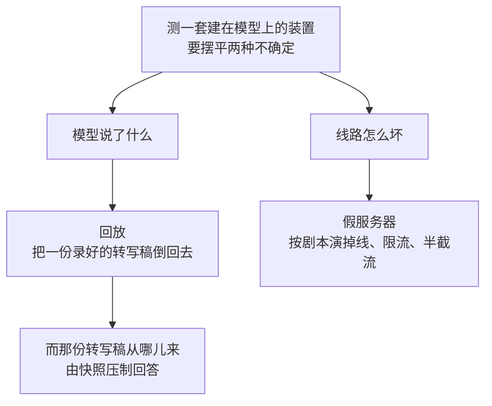
```mermaid
flowchart TD
    U["测一套建在模型上的装置<br/>要摆平两种不确定"] --> U1["模型说了什么"]
    U --> U2["线路怎么坏"]
    U1 --> R["回放<br/>把一份录好的转写稿倒回去"]
    U2 --> M["假服务器<br/>按剧本演掉线、限流、半截流"]
    R --> F["而那份转写稿从哪儿来<br/>由快照压制回答"]
```

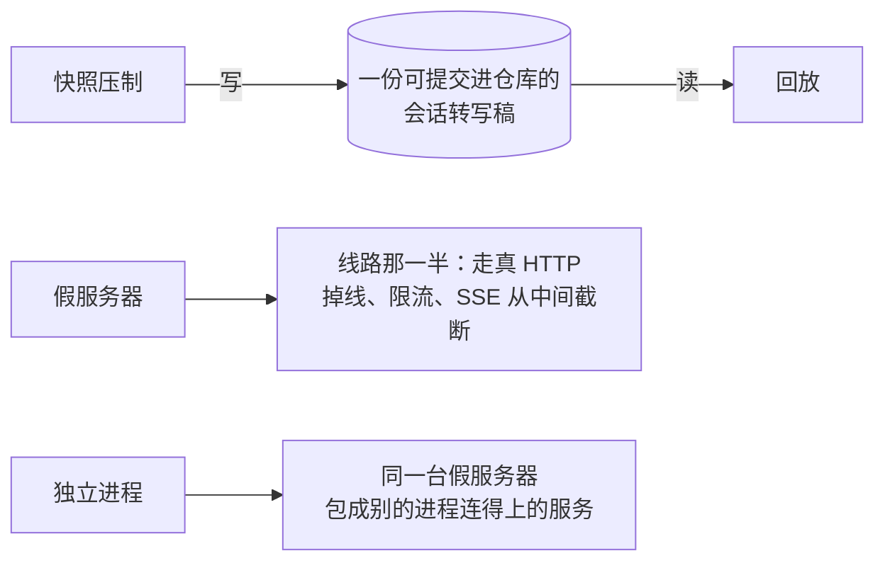
```mermaid
flowchart LR
    P1["快照压制"] -->|"写"| FX[("一份可提交进仓库的<br/>会话转写稿")]
    FX -->|"读"| P2["回放"]
    P3["假服务器"] --> W["线路那一半：走真 HTTP<br/>掉线、限流、SSE 从中间截断"]
    P4["独立进程"] --> W2["同一台假服务器<br/>包成别的进程连得上的服务"]
```

---

## 架构

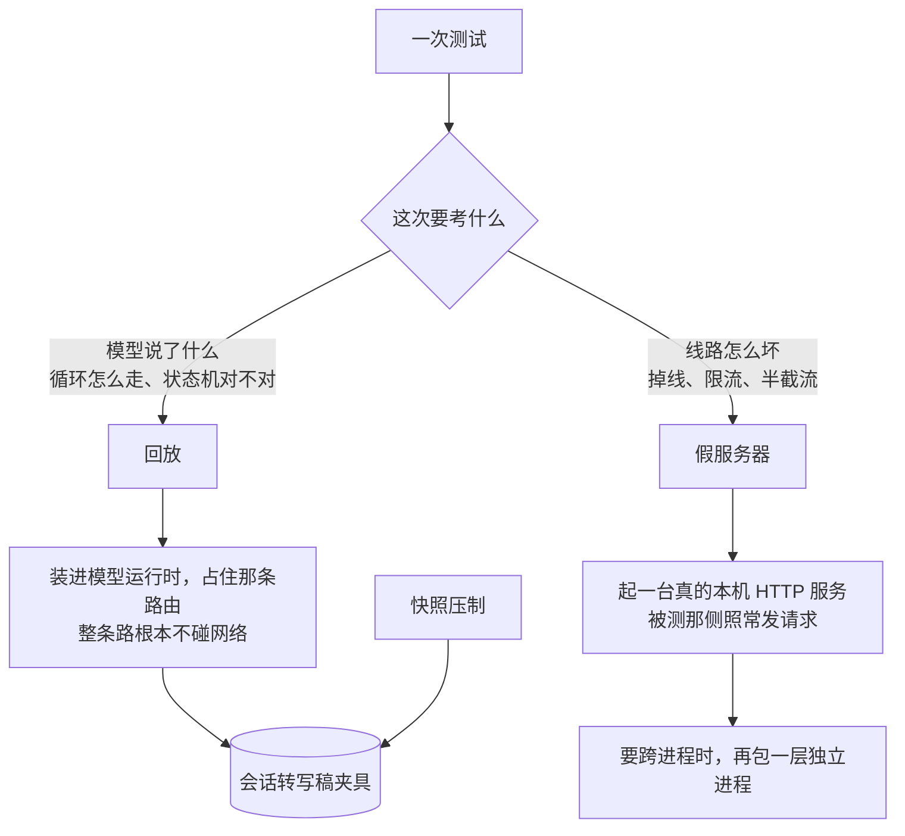
```mermaid
flowchart TD
    T["一次测试"] --> Q{"这次要考什么"}
    Q -->|"模型说了什么<br/>循环怎么走、状态机对不对"| RP["回放"]
    Q -->|"线路怎么坏<br/>掉线、限流、半截流"| MS["假服务器"]
    RP --> RIN["装进模型运行时，占住那条路由<br/>整条路根本不碰网络"]
    MS --> MIN["起一台真的本机 HTTP 服务<br/>被测那侧照常发请求"]
    MIN --> CP["要跨进程时，再包一层独立进程"]
    RIN --> FX[("会话转写稿夹具")]
    SN["快照压制"] --> FX
```

四个包各管一段，边界写在「不管什么」上：

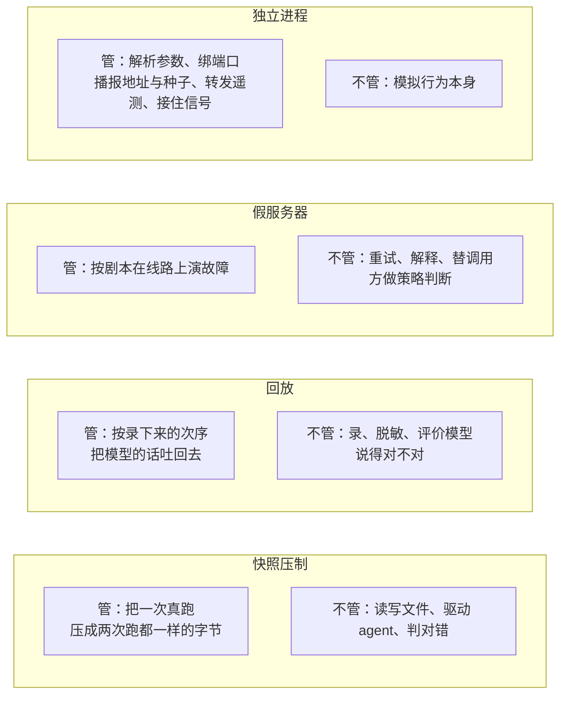
```mermaid
flowchart LR
    subgraph A["快照压制"]
        A1["管：把一次真跑<br/>压成两次跑都一样的字节"]
        A2["不管：读写文件、驱动 agent、判对错"]
    end
    subgraph B["回放"]
        B1["管：按录下来的次序<br/>把模型的话吐回去"]
        B2["不管：录、脱敏、评价模型说得对不对"]
    end
    subgraph C["假服务器"]
        C1["管：按剧本在线路上演故障"]
        C2["不管：重试、解释、替调用方做策略判断"]
    end
    subgraph D["独立进程"]
        D1["管：解析参数、绑端口<br/>播报地址与种子、转发遥测、接住信号"]
        D2["不管：模拟行为本身"]
    end
```

**假服务器不替调用方判断该不该重试**，因为那件事一混进来，测试自己就变成一个需要被测试的东西。

### 回放为什么获准碰磁盘

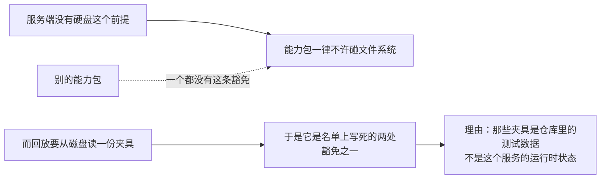
```mermaid
flowchart LR
    A["服务端没有硬盘这个前提"] --> B["能力包一律不许碰文件系统"]
    C["而回放要从磁盘读一份夹具"] --> D["于是它是名单上写死的两处豁免之一"]
    D --> E["理由：那些夹具是仓库里的测试数据<br/>不是这个服务的运行时状态"]
    F["别的能力包"] -.->|"一个都没有这条豁免"| B
```

---

## 录一次，放很多次

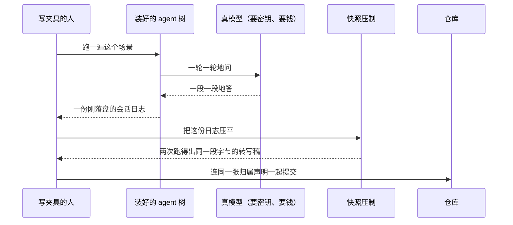
```mermaid
sequenceDiagram
    participant P as 写夹具的人
    participant T as 装好的 agent 树
    participant L as 真模型（要密钥、要钱）
    participant S as 快照压制
    participant G as 仓库
    P->>T: 跑一遍这个场景
    T->>L: 一轮一轮地问
    L-->>T: 一段一段地答
    T-->>P: 一份刚落盘的会话日志
    P->>S: 把这份日志压平
    S-->>P: 两次跑得出同一段字节的转写稿
    P->>G: 连同一张归属声明一起提交
```

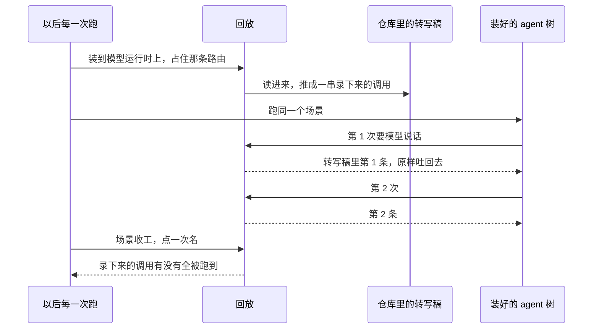
```mermaid
sequenceDiagram
    participant C as 以后每一次跑
    participant R as 回放
    participant G as 仓库里的转写稿
    participant T as 装好的 agent 树
    C->>R: 装到模型运行时上，占住那条路由
    R->>G: 读进来，推成一串录下来的调用
    C->>T: 跑同一个场景
    T->>R: 第 1 次要模型说话
    R-->>T: 转写稿里第 1 条，原样吐回去
    T->>R: 第 2 次
    R-->>T: 第 2 条
    C->>R: 场景收工，点一次名
    R-->>C: 录下来的调用有没有全被跑到
```

### 收工那一次点名，不能省

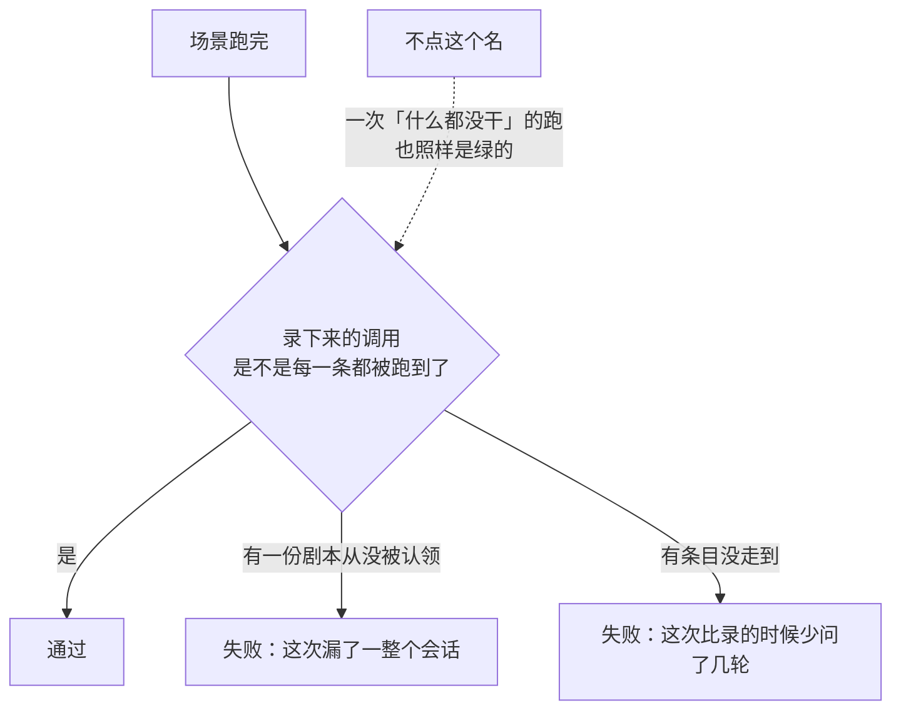
```mermaid
flowchart TD
    A["场景跑完"] --> B{"录下来的调用<br/>是不是每一条都被跑到了"}
    B -->|"是"| C["通过"]
    B -->|"有一份剧本从没被认领"| D["失败：这次漏了一整个会话"]
    B -->|"有条目没走到"| E["失败：这次比录的时候少问了几轮"]
    F["不点这个名"] -.->|"一次「什么都没干」的跑<br/>也照样是绿的"| B
```

---

## 快照压制：把一次真跑压成可以逐字节比的字节

### 压掉三样每跑一次都不同、又和这一轮无关的东西

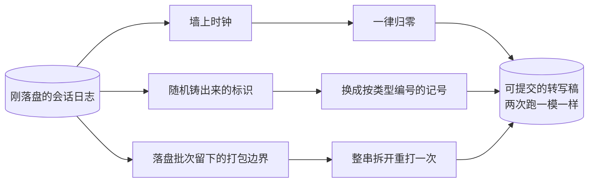
```mermaid
flowchart LR
    L[("刚落盘的会话日志")] --> Z1["墙上时钟"]
    L --> Z2["随机铸出来的标识"]
    L --> Z3["落盘批次留下的打包边界"]
    Z1 --> O1["一律归零"]
    Z2 --> O2["换成按类型编号的记号"]
    Z3 --> O3["整串拆开重打一次"]
    O1 --> S[("可提交的转写稿<br/>两次跑一模一样")]
    O2 --> S
    O3 --> S
```

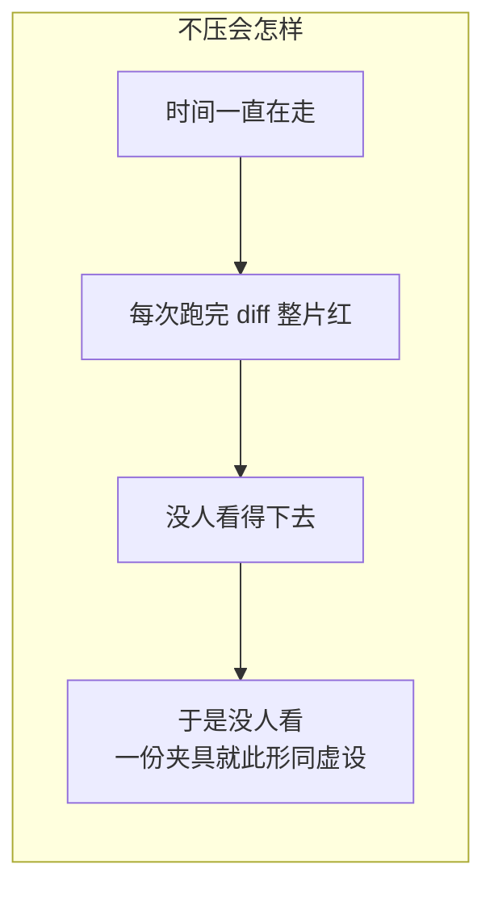
```mermaid
flowchart LR
    subgraph BAD["不压会怎样"]
        A1["时间一直在走"] --> A2["每次跑完 diff 整片红"] --> A3["没人看得下去"] --> A4["于是没人看<br/>一份夹具就此形同虚设"]
    end
```

### 标识为什么不是一律换成同一个记号

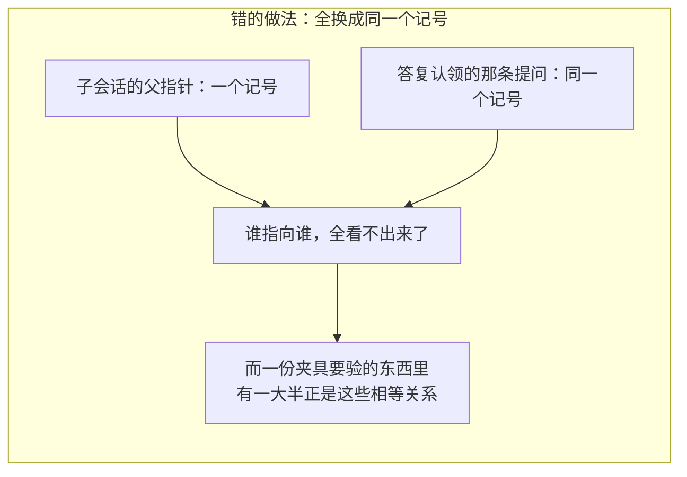
```mermaid
flowchart LR
    subgraph B2["错的做法：全换成同一个记号"]
        C1["子会话的父指针：一个记号"] --> C3["谁指向谁，全看不出来了"]
        C2["答复认领的那条提问：同一个记号"] --> C3
        C3 --> C4["而一份夹具要验的东西里<br/>有一大半正是这些相等关系"]
    end
```

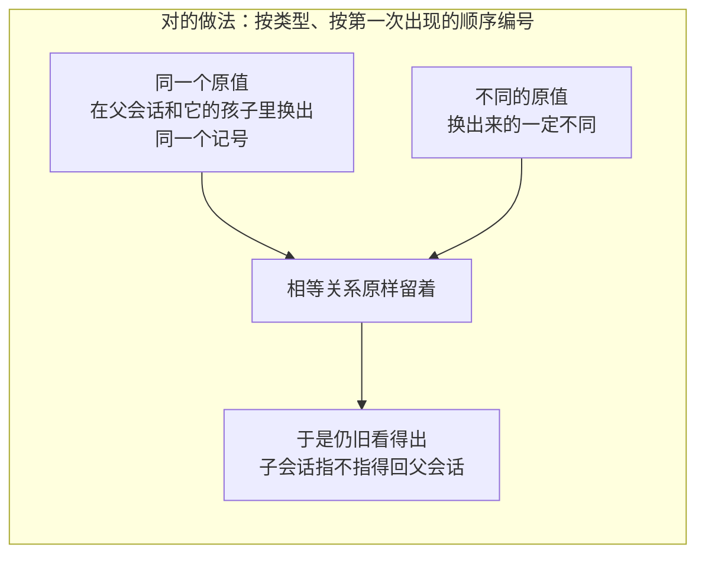
```mermaid
flowchart LR
    subgraph G2["对的做法：按类型、按第一次出现的顺序编号"]
        D1["同一个原值<br/>在父会话和它的孩子里换出同一个记号"] --> D3["相等关系原样留着"]
        D2["不同的原值<br/>换出来的一定不同"] --> D3
        D3 --> D4["于是仍旧看得出<br/>子会话指不指得回父会话"]
    end
```

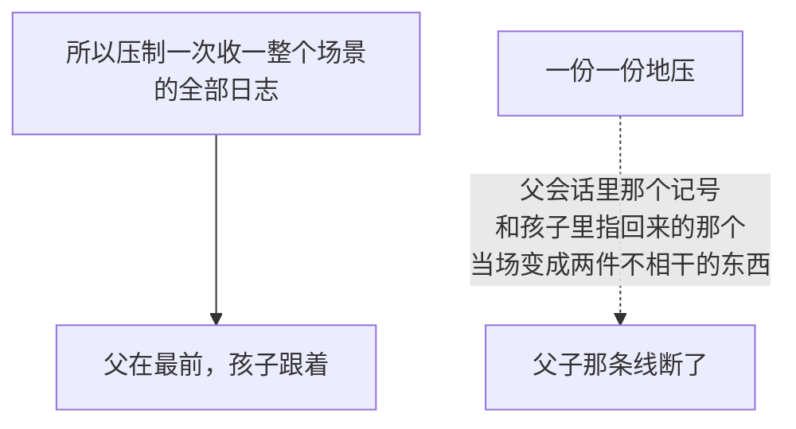
```mermaid
flowchart TD
    A["所以压制一次收一整个场景的全部日志"] --> B["父在最前，孩子跟着"]
    C["一份一份地压"] -.->|"父会话里那个记号<br/>和孩子里指回来的那个<br/>当场变成两件不相干的东西"| D["父子那条线断了"]
```

### 记号的类别由键名决定

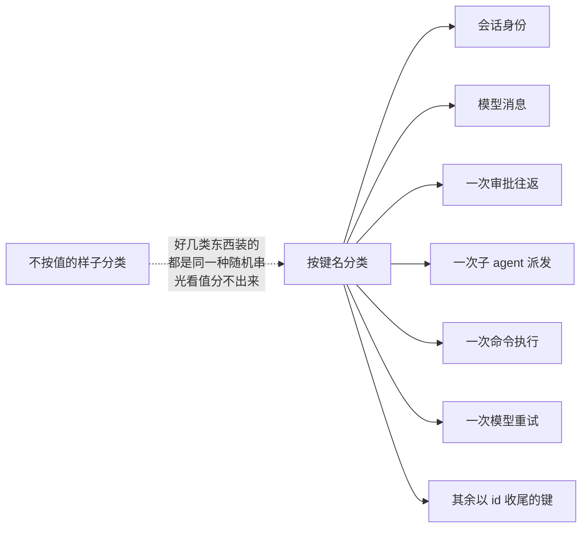
```mermaid
flowchart LR
    K["按键名分类"] --> K1["会话身份"]
    K --> K2["模型消息"]
    K --> K3["一次审批往返"]
    K --> K4["一次子 agent 派发"]
    K --> K5["一次命令执行"]
    K --> K6["一次模型重试"]
    K --> K7["其余以 id 收尾的键"]
    V["不按值的样子分类"] -.->|"好几类东西装的<br/>都是同一种随机串<br/>光看值分不出来"| K
```

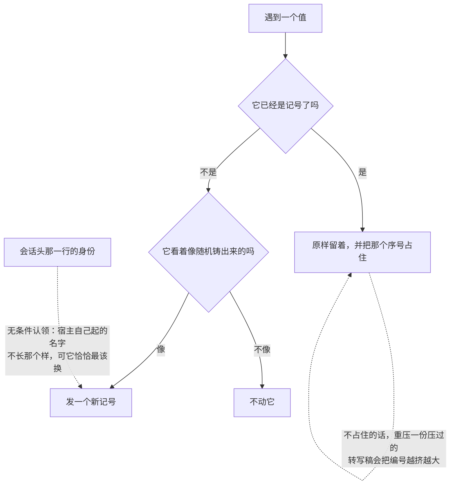
```mermaid
flowchart TD
    A["遇到一个值"] --> B{"它已经是记号了吗"}
    B -->|"是"| C["原样留着，并把那个序号占住"]
    C -.->|"不占住的话，重压一份压过的<br/>转写稿会把编号越挤越大"| C
    B -->|"不是"| D{"它看着像随机铸出来的吗"}
    D -->|"像"| E["发一个新记号"]
    D -->|"不像"| F["不动它"]
    G["会话头那一行的身份"] -.->|"无条件认领：宿主自己起的名字<br/>不长那个样，可它恰恰最该换"| E
```

### 重打包：把落盘那一刻的机器状态从夹具里剔出去

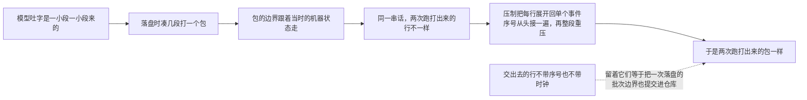
```mermaid
flowchart LR
    A["模型吐字是一小段一小段来的"] --> B["落盘时凑几段打一个包"]
    B --> C["包的边界跟着当时的机器状态走"]
    C --> D["同一串话，两次跑打出来的行不一样"]
    D --> E["压制把每行展开回单个事件<br/>序号从头接一遍，再整段重压"]
    E --> F["于是两次跑打出来的包一样"]
    G["交出去的行不带序号也不带时钟"] -.->|"留着它们等于把一次落盘的<br/>批次边界也提交进仓库"| F
```

### 请求头里那两大段

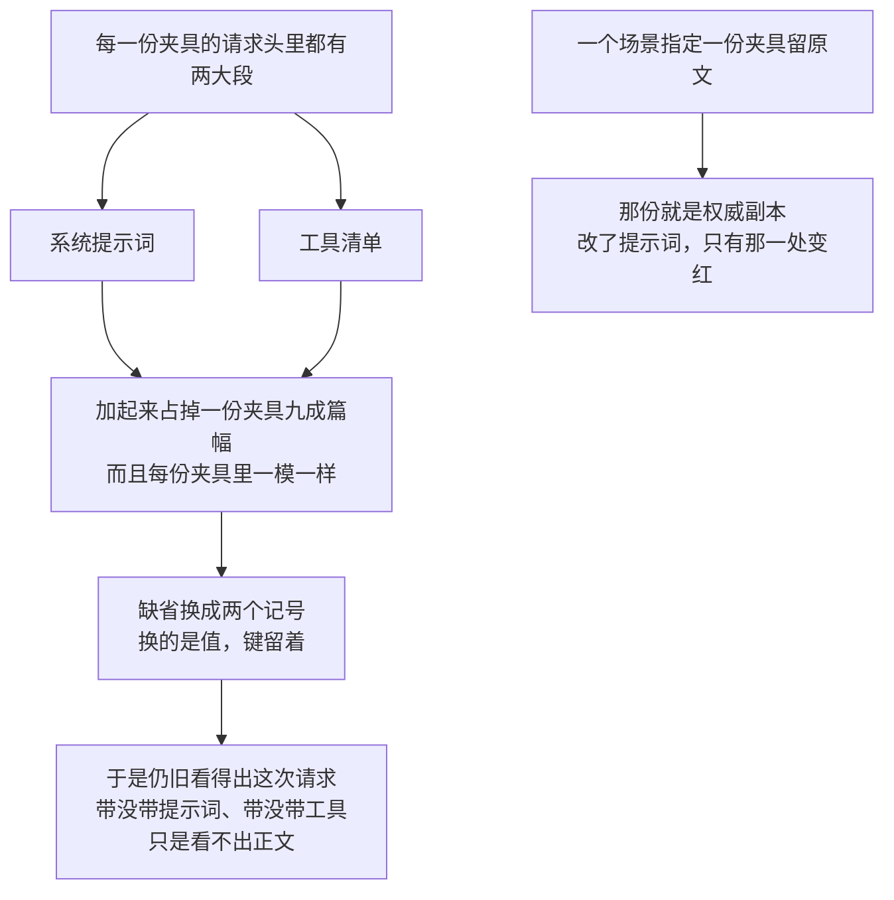
```mermaid
flowchart TD
    A["每一份夹具的请求头里都有两大段"] --> B["系统提示词"]
    A --> C["工具清单"]
    B --> D["加起来占掉一份夹具九成篇幅<br/>而且每份夹具里一模一样"]
    C --> D
    D --> E["缺省换成两个记号<br/>换的是值，键留着"]
    E --> F["于是仍旧看得出这次请求<br/>带没带提示词、带没带工具<br/>只是看不出正文"]
    G["一个场景指定一份夹具留原文"] --> H["那份就是权威副本<br/>改了提示词，只有那一处变红"]
```

### 光看日志补不回来的事，写在场景旁边那张归属声明里

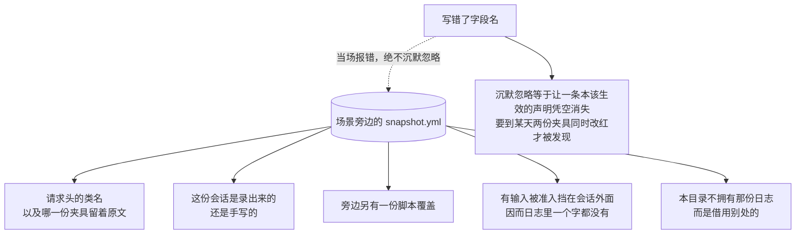
```mermaid
flowchart TD
    Y[("场景旁边的 snapshot.yml")] --> A["请求头的类名<br/>以及哪一份夹具留着原文"]
    Y --> B["这份会话是录出来的<br/>还是手写的"]
    Y --> C["旁边另有一份脚本覆盖"]
    Y --> D["有输入被准入挡在会话外面<br/>因而日志里一个字都没有"]
    Y --> E["本目录不拥有那份日志<br/>而是借用别处的"]
    F["写错了字段名"] -.->|"当场报错，绝不沉默忽略"| Y
    F --> G["沉默忽略等于让一条本该生效的声明凭空消失<br/>要到某天两份夹具同时改红才被发现"]
```

---

## 回放：把录好的话倒回去

### 剧本从哪里来

```mermaid
flowchart TD
    L[("一份录好的会话日志")] --> R["推导只读两种记录"]
    R --> R1["模型吐出来的那些分块<br/>按轮次与步次分组<br/>每见一个收尾就收一条"]
    R --> R2["压缩总结里那些明确标了记号的<br/>标记说明那次总结恰好走了模型这条缝"]
    R1 --> S[("一串录下来的调用")]
    R2 --> S
    X["没标记号的总结原文"] -.->|"不算：模板总结器和远端总结器<br/>都可能留下完整输出<br/>却根本没碰这个模型接缝"| R2
    Y["一组没有以收尾块结束的分块"] -.->|"那是一次抛出来的调用的指纹<br/>推导当场拒绝"| R1
```

### 两种从日志里恢复不出来的形状

```mermaid
flowchart TD
    A["一块都没吐就抛<br/>比如密钥不对"] --> C["日志里只剩一条带错的收尾<br/>倒推不回来"]
    B["挂住等取消"] --> D["那是时序，不是分块内容<br/>日志里根本没有它"]
    C --> E["由场景旁边一份旁挂文件明说"]
    D --> E
```

```mermaid
flowchart LR
    subgraph OV["旁挂文件的两种写法"]
        O1["整份条目数组：替换<br/>推导出来的那串一概不要"]
        O2["只写补丁：增补<br/>留下每一条推出来的调用<br/>只把点名的那几个换掉"]
    end
    O2 --> P["位置正好等于推导长度时是追加<br/>比如一次注入的瞬时故障之后那次重试"]
    Q["两条补丁指向同一个位置"] -.->|"当场拒绝"| O2
    W["整份文档、每一条补丁、每一个判别标签"] -.->|"读文件时全验一遍"| OV
```

### 一个静态文件不可能知道的值

有些值是这一跑当场铸出来的——比如一个随机的目标标识，模型必须把它原样回填。一份写死的转写稿知道不了，于是剧本里埋一个按模式取值的占位符，派流时拿活的请求解算：

```mermaid
sequenceDiagram
    participant A as agent 循环
    participant R as 回放
    participant E as 转写稿里的那一条
    Note over A: 这一跑随机铸了一个新的目标标识
    A->>R: 请求，消息里带着那个标识
    R->>E: 取下一条，里面埋着一个占位符
    R->>R: 把请求里每一个字符串叶子接起来当语料
    R->>R: 按模式匹配，最后一次匹配赢
    R-->>A: 把匹配到的那一段填回占位符，再吐出去
    Note over A: 于是模型「记得」它刚收到的那个标识
```

```mermaid
flowchart TD
    A["占位符解算"] --> B{"三件事当场失败"}
    B --> B1["匹配不上"]
    B --> B2["模式编译不了"]
    B --> B3["占位符没闭合"]
    C["Go 的正则不认反向引用和前后瞻"] -.->|"真写了它不认的东西<br/>会在编译那一步当场炸<br/>而不是悄悄换一种匹配语义"| B2
    D["语料按这份请求的书写顺序拼"] -.->|"因为「最后一次匹配赢」<br/>这条规则依赖顺序"| A
```

### 嵌套 agent：一个会话一份剧本

```mermaid
flowchart TD
    A["一个父 agent 派活给进程内子 agent"] --> B["录下来的不止一份日志"]
    B --> B1[("父的那份")]
    B --> B2[("每个孩子各一份")]
    C["活会话的身份每一跑都是新随机的<br/>绝不等于录下来的那些"] --> D["所以绑定不靠身份，靠第一次调用的次序"]
```

```mermaid
sequenceDiagram
    participant F as 活的父会话
    participant S as 活的子会话
    participant R as 回放
    Note over R: 转写稿按创建时刻排队，父在前<br/>它必须先说话，才谈得上派活
    F->>R: 第一个发起调用
    R-->>F: 认领第 1 份剧本，此后各推各的游标
    S->>R: 下一个新会话发起调用
    R-->>S: 认领第 2 份剧本
    Note over R: 活会话比录下来的剧本还多时，大声失败
```

```mermaid
flowchart LR
    A["一次不带会话身份的调用"] --> B["都算同一个匿名会话"] --> C["绑主剧本"]
```

---

## 假服务器：让「模型接口坏掉之后怎么办」可以被测

真的供应商不会在你想要的时候掉线、限流、或者把流从中间截断，而这三件事恰恰是恢复策略里最要紧的分支。

### 一次请求走的路

```mermaid
flowchart TD
    R["一个请求进来"] --> Q1{"方法、路径、令牌、请求体<br/>四道都合格吗"}
    Q1 -->|"任一道不合格"| E["按普通 4xx 回掉<br/>剧本游标一动不动"]
    E -.->|"一次拼错的地址不该把后面<br/>所有用例的剧本错开一格"| E
    Q1 -->|"全合格"| C["取剧本的下一条"]
    C --> D{"这一条写的是随机吗"}
    D -->|"是"| W["按权重挑一个具体行为"]
    D -->|"不是"| P["就演它"]
    W --> P
    P --> O["在线路上演出来，并记下这次的结局"]
```

### 剧本里能点的名字

```mermaid
flowchart LR
    F["能点的故障与正常路"] --> F1["连接层<br/>发头之前掐断 / 发完头就重置 / 吐了一半再重置"]
    F --> F2["流早退<br/>只发一个角色声明 / 发完一段文本 / 发完头一个事件都没有"]
    F --> F3["坏数据<br/>不是合法 JSON / 形状不对的事件 / 用错内容类型发流"]
    F --> F4["状态码<br/>401、400、429、500、503<br/>限流与余额不足同码不同因"]
    F --> F5["挂着不动<br/>发完头就停在那儿，等谁来取消"]
    F --> F6["正常路<br/>整段文本 / 先思考再答 / 一次工具调用<br/>以长度上限收尾 / 逐块带停顿"]
```

### 剧本用完了要大声失败

```mermaid
flowchart LR
    subgraph BAD2["错的做法：悄悄绕回第一条"]
        A1["一个多发了几次请求的测试"] --> A2["一直绿着"] --> A3["而它测的东西早就跑偏了"]
    end
```

```mermaid
flowchart LR
    subgraph GOOD2["当前做法：报一个 500，写明剧本用完了"]
        B1["测试当场红"] --> B2["红在真正出问题的那一次请求上"]
        B3["想让最后一条无限重复"] --> B4["得显式打开那个开关<br/>不能是默认行为"]
    end
```

### 随机与那颗种子

```mermaid
flowchart TD
    A["剧本里写随机的位置"] --> B["按带权重的伪随机挑一个具体行为"]
    B --> C{"种子谁给的"}
    C -->|"指定了"| D["用它"]
    C -->|"没指定"| E["生成一个，并从服务器身上交出来"]
    E -.->|"跑挂了的那一次必须能原样重放<br/>所以种子从来不是内部细节"| E
    F["随机挑不到随机自己"] -.->|"那是一句自指的话：挑中之后<br/>还要再挑一次，没有终点"| B
    G["那份默认权重是压力配方"] -.->|"不是对线上故障频率的估计"| B
```

### 为什么还要一个独立进程

```mermaid
flowchart LR
    A["被测的那一侧常常自己就是一个进程"] --> B["没法把假服务器当库嵌进去"]
    B --> C["于是把它包成一个进程"]
    C --> D["解析参数、绑端口、播报、转发遥测、接住信号"]
```

```mermaid
sequenceDiagram
    participant O as 编排脚本
    participant M as 独立进程
    O->>M: 带一串剧本名字启动
    M-->>O: 播报第一行：地址与这一跑的种子
    Note over O: 读第一行就知道往哪儿连
    O->>M: 被测那侧照常发请求
    M-->>O: 每次请求前后各播报一条遥测
    O->>M: 发一个终止信号
    M-->>O: 关掉服务器，按信号编号换算退出码
```

### 有一种故障只有独立进程演得出来

```mermaid
flowchart TD
    A["端口上根本没人"] --> B["客户端拿到的是连接层的拒绝<br/>而不是任何 HTTP 响应"]
    C["一个已经接下请求的处理器"] -.->|"演不出「端口上没人」"| B
    D["所以它只能写在剧本第一位"] --> E["进程先等一段时间再去绑端口"]
    E --> F["这段时间里连过来的一律被拒<br/>等完了才开始服务"]
```

---

## 生命周期与并发

```mermaid
flowchart TD
    A["回放句柄"] --> A1["装上去占住模型路由，用完必须摘"]
    A --> A2["按会话各推各的游标"]
    A --> A3["拆解时点名<br/>剧本没被跑完就是测试失败"]
    B["假服务器"] --> B1["一个连接一个协程，是真并发"]
    B --> B2["剧本游标、随机源、请求记录<br/>同一把锁护着"]
    B2 -.->|"不锁的话，两个同时进来的请求会拿到<br/>同一条剧本，而剧本的意义正是<br/>一次请求消费一条"| B2
    B --> B3["关闭是幂等的<br/>并强行掐断挂着不动的连接"]
    B3 -.->|"否则一个用了挂起的测试<br/>跑完之后进程退不掉"| B3
```

```mermaid
flowchart TD
    C["独立进程"] --> C1["遥测从各个处理器协程上来<br/>播报那一步自己上锁"]
    C1 -.->|"免得半行插进另外半行里"| C1
    C --> C2["还没绑端口的等待期里也接信号"]
    C2 -.->|"否则那段时间里<br/>进程对中断毫无反应"| C2
    D["快照压制"] --> D1["不读也不写文件<br/>收进来是正文，交出去也是正文"]
    D --> D2["按字典序遍历键<br/>于是同一份日志压两次编号一样"]
    D2 -.->|"照随机遍历顺序办，会让同一份日志<br/>压出两套编号——那正好毁掉本包存在的理由"| D2
```

---

## 失败语义

```mermaid
flowchart TD
    A["出了岔子"] --> B{"哪一类"}
    B -->|"回放：来了一个没录过的会话<br/>或者剧本用完了"| C["一块都还没吐就失败<br/>当作派发失败当场交出去"]
    B -->|"回放：录下来的调用没跑完"| D["收工点名时报<br/>说清是哪个会话少走了几步"]
    B -->|"回放：占位符解算不了"| E["当场失败，不拿空串顶上"]
    B -->|"回放：剧本里写着挂住"| F["等取消<br/>测试自己要设一个上限"]
    B -->|"假服务器：剧本之外的路径"| G["普通 4xx，游标不动"]
    B -->|"假服务器：剧本用完"| H["500 并写明剧本用完了<br/>绝不循环回第一条"]
    B -->|"假服务器：挂着不动"| I["靠客户端取消或者关服务器解除<br/>关服务器时强行掐断"]
    B -->|"压制：日志里有行不是合法 JSON"| J["报第几份日志第几行"]
    B -->|"压制：归属声明有不认识的字段"| K["拒绝，不沉默忽略"]
```

---

## 能力边界

```mermaid
flowchart TD
    Y["这几个包做的"] --> Y1["把模型的不确定性摁住<br/>让同一个场景跑一百遍结果一样"]
    Y --> Y2["把线路故障做成可以点名的剧本条目"]
    Y --> Y3["把一次真跑压成可提交、可逐字节比的转写稿"]
    N["不做的"] --> N1["不是生产模型代理<br/>真流量一律不该指过来"]
    N --> N2["不评价模型说得对不对<br/>验的是调用形状和状态机"]
    N --> N3["不脱敏<br/>剧本和录下来的日志可能带敏感文本<br/>存档前由调用方自己处理"]
    N --> N4["不录<br/>把真的 agent 跑一遍是装配那一侧的事"]
    N --> N5["不追求实现完整的模型接口<br/>只覆盖本项目用得到的那一小片"]
    N --> N6["不管工作区文件快照，也不管协议转写稿<br/>前者要本机硬盘，后者要起子进程<br/>本仓库两样都没有"]
```

## 对应的 DSH 能力

下表由 [`docs/packages.md`](../packages.md) 与 [能力覆盖表](../portmap/capability-coverage.tsv) 机器 join 得到：本篇覆盖的 Go 包，承接的是上游 DSH 的哪几条能力，以及各自还缺什么。落点列由源码里的 `// 源:` 注释反查，不是手写的。

| 上游能力 | DSH 包 | 裁决 | 落在哪个 Go 包 | 这里缺什么 |
|---|---|---|---|---|
| 可编脚本的 OpenAI 兼容 HTTP 服务器，无需密钥即可测试 LLM 适配器和 agent 循环 | `test-support/llm-mock-server` | 需要 | `cmd/llmmockserver` `llm/mockserver` | — |
| 从已记录会话日志回放 LLM 模型流，使快照测试无需 API 密钥 | `test-support/llm-replay` | 需要 | `feature/replay` | — |
| 无密钥已记录会话测试的共享支持：封闭 manifest、类型化身份脱敏、规范化、workspace 比较、fixture 保护，以及 headless、SDK、ACP 与 Web 的协议适配器 | `test-support/session-snapshot` | 需要 | `sessionlog/snapshot` | 工作区文件快照、四个协议适配器、vitest 套件工厂都没有：前者要本机硬盘，后两者要起子进程 |

## 相关源码

- `feature/replay/`
- `llm/mockserver/`
- `cmd/llmmockserver/`
- `sessionlog/snapshot/`
