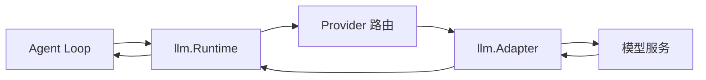

# LLM

覆盖模型无关词汇、路由运行时、适配器、重试、Token 计量、录制回放和测试服务。

## 定位

`llm` 把 Agent Loop 与具体模型提供方分开。上层只使用统一的消息、内容、工具 Schema、流式分块、调用配置和失败结构；具体协议由 `Adapter` 实现。

一个空的 `llm.Runtime` 不包含任何模型，也不会自动选择云厂商。

## 两层结构

| 层 | 内容 |
|---|---|
| 值与协议词汇 | Message、ContentBlock、ToolCall、StreamChunk、CallConfig、Failure、Usage |
| 运行时 | Adapter 注册、Provider 路由、模型目录、请求执行和策略解析 |

会话日志只依赖值类型，不依赖 Runtime 或具体 Adapter，因此持久化数据不会绑定某个模型 SDK。

## 消息与内容

统一内容支持文本、图片、工具调用、工具结果和未知可透传内容。关键身份使用 Go 具名字符串类型，例如 Message ID、Call ID 和 Provider ID，避免不同 ID 被误用。

消息和内容在跨边界时复制内部切片。调用方拿到值后不应修改其他组件持有的数据。

模型历史必须满足工具调用配对、角色顺序和提供方限制；这些结构问题应在发请求前暴露。

## Runtime 与 Adapter

`Runtime` 负责：

- 注册和注销具名 Adapter。
- 按 `CallConfig.Provider` 选择 Adapter。
- 解析模型目录和模型信息。
- 组合流式分块。
- 读取 Adapter 提供的可选能力。
- 统一失败和重试策略。

`Adapter` 是最小请求接口。模型发现、API Key、重试策略、重放状态和图片处理等能力通过可选接口提供，Adapter 不必实现不支持的功能。

## 调用配置

一次调用主要包含：

- Provider 路由名。
- Model 标识。
- 最大输出 Token。
- Reasoning Effort。
- 系统提示词、模型历史和工具定义。
- 取消 Context。

Provider 与 Model 由 Adapter 解释。运行时不假设所有提供方共享同一模型名或推理档位。

Agent 动态切换模型时，提示词变量与请求路由使用同一步骤快照，避免配置撕裂。

## 流式响应

Adapter 返回统一 `StreamChunk`。运行时和 Agent Loop处理：

- 文本增量。
- 推理或其他受支持内容块。
- 工具调用增量与参数组装。
- 使用量。
- 结束原因。
- 提供方失败。

流式分块可以逐条写入事件，最终完整消息也会落盘。恢复和界面展示不依赖当时的网络流仍然存在。

## 失败

`llm.Failure` 是可以写入日志和协议的失败事实，不是 Go error 基类。它包含稳定的失败代码、提供方信息和可展示说明。

主要失败类别包括：

- 请求参数或路由错误。
- 认证与权限错误。
- 限流。
- 上下文超限。
- 服务端暂时错误。
- 网络和流中断。
- 不支持的模型能力。

调用方应按结构化代码决策，不解析错误字符串。

## 重试

`feature/llmretry` 根据已解析的 Provider 策略决定是否重试。

- 普通模式受最大次数限制。
- Always 模式由策略明确允许持续重试。
- 延迟和抖动写入事件，重放时能解释实际发生过的尝试。
- `llm/retry` 表示重试已经安排。
- `llm/retry-started` 表示等待结束，下一次请求即将发出。
- 等待期间取消时，不会伪造一次已经发出的请求。
- 策略变化会开启新的重试链，不沿用旧策略计数。

Agent 的 `request-error` Observer 可以认领失败并要求重试；默认是不重试。

## OpenAI 兼容适配器

`adapter/openaicompat` 是 OpenAI Chat Completions 兼容协议的流式 Adapter。

支持：

- 自定义 Base URL。
- 自定义 Header 和 API Key 来源。
- 手工声明 Provider 与模型目录。
- 文本、工具调用和受支持的图片输入。
- 模型上下文窗口、最大输出和推理档位映射。
- 动态读取配置，使密钥、端点和模型设置可以在后续请求生效。

不承诺支持：

- OpenAI Responses API。
- Anthropic Messages API。
- Provider OAuth 登录。
- WebSocket 模型传输。
- 第三方 SDK 的全部兼容开关。
- 自动拥有所有厂商模型目录。

“OpenAI 兼容”只说明线上协议形状，不保证每个兼容服务的扩展字段完全一致。

## Token 计量

`feature/tokenmeter` 提供 Token 使用和估算：

- 优先使用模型返回的实际 Usage。
- 在缺少实际值时使用确定的启发式估算。
- 统计输入、输出、缓存和推理等可用维度。
- 从会话事件计算步骤、回合和会话级用量。
- 为压缩和预算策略提供输入。

估算不是提供方账单，不能直接作为精确计费依据。生产计费应以提供方实际 Usage 或独立计量为准。

## 录制与回放

`feature/replay` 用于可重复测试和故障复现：

- 录制模型请求对应的流式响应。
- 按稳定占位符处理动态 ID 和时间值。
- 回放预先记录的响应。
- 校验请求是否符合脚本预期。

`llm/mockserver` 提供独立假模型服务和命令行入口，用于手工联调、流式边界和异常行为测试。

回放只复现已记录的模型边界，不代替完整的持久化、工具或多 Agent 集成测试。

## 凭据

- API Key 不应进入会话事件、模型历史或普通日志。
- Adapter 可以通过 `credentials.Provider` 或宿主回调解析凭据。
- 配置展示应使用脱敏值。
- 动态密钥更新只影响后续请求，不应修改已经落盘的历史事实。
- 多租户部署必须在 Provider 路由前完成租户隔离。

## 并发

- Runtime 的 Adapter 注册和请求解析可并发使用。
- 一个 Adapter 是否支持并发由其实现保证。
- 模型流必须响应 Context 取消并关闭网络响应体。
- 动态配置读取要避免请求中途读取到两份不同版本。
- Observer 和 Adapter 回调不能在 Runtime 内部锁中执行长时间操作。

## 边界

LLM 模块负责：

- 统一模型消息、流、配置和失败词汇。
- Provider 路由和 Adapter 生命周期登记。
- 重试、Token 计量、录制回放和 OpenAI 兼容实现。

LLM 模块不负责：

- Agent 回合和工具循环。
- 系统提示词内容。
- 用户鉴权和租户计费。
- 自动保证所有模型行为一致。
- 保存 API Key 到会话。
- 提供所有厂商协议。

## 相关源码

| 路径 | 内容 |
|---|---|
| `llm/message.go`、`llm/content.go` | 消息和内容块 |
| `llm/stream.go`、`llm/assembler.go` | 流式词汇和消息组装 |
| `llm/runtime.go`、`llm/adapter.go` | 路由运行时和 Adapter 接口 |
| `llm/config.go`、`llm/modelinfo.go` | 调用配置和模型目录 |
| `feature/llmretry/` | 重试策略和耐久事件 |
| `adapter/openaicompat/` | OpenAI Chat Completions 兼容适配器 |
| `feature/tokenmeter/` | 用量统计和估算 |
| `feature/replay/`、`llm/mockserver/` | 测试录制、回放和假服务 |

## 深入阅读

[凭据](credentials.md) · [附件与图片](attachment.md) · [LLM 测试与回放](llm-testing.md)
