# LLM

对应包：`llm`、`adapter/openaicompat`、`feature/llmretry`、`feature/tokenmeter`

## 定位

这套装置要跟模型说话。但「模型」不是一个东西——不同厂商的线上协议不一样，模型名不一样，推理档位的写法不一样，报错的形状更不一样。

如果让 agent 循环直接对着某一家的协议写，换一家就得把循环重写一遍：

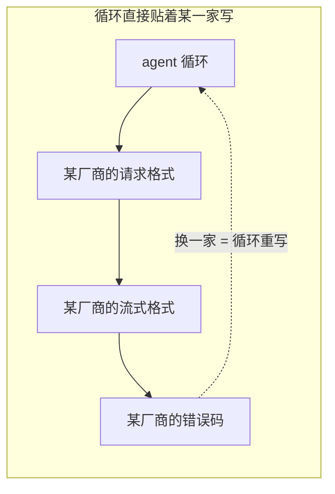

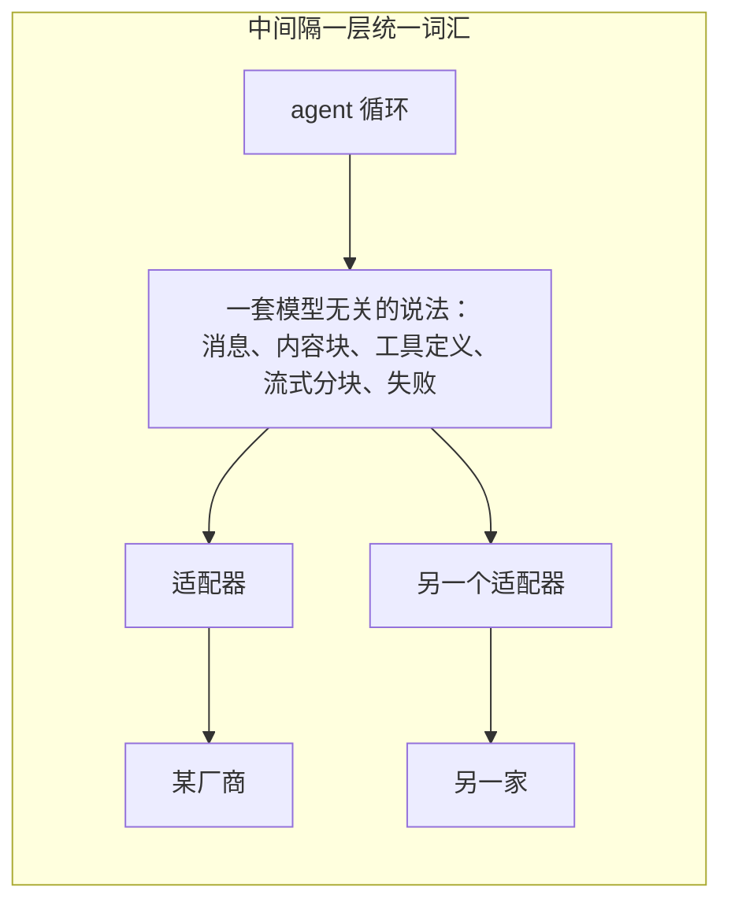

这一层就是那套统一词汇，加上一个把请求路由到某个适配器的运行时。

**它是空的。** 一个刚造出来的运行时不含任何模型，也不会自作主张去连哪家云。

---

## 架构：值和运行时，故意分开

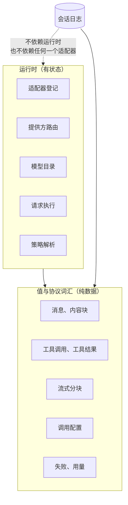

**为什么日志只能碰值那一半**：

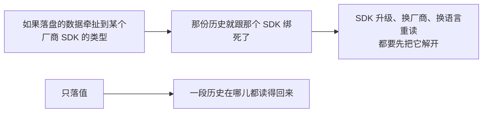

### 一次调用走过的路

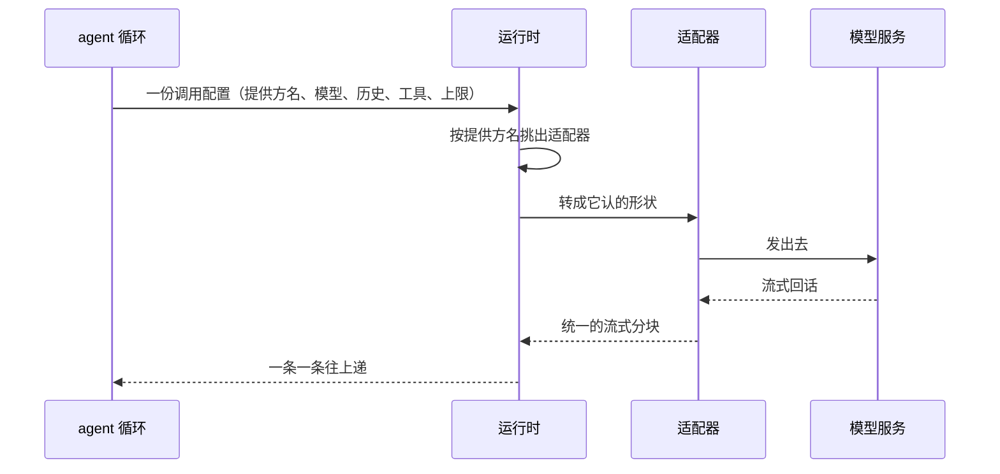

### 适配器只被要求做一件事

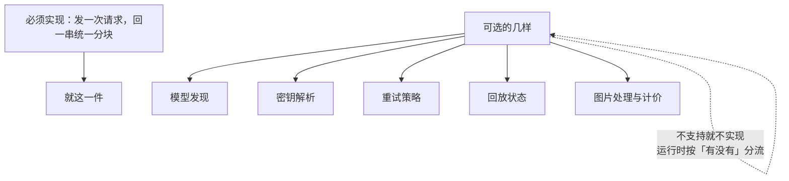

---

## 消息与内容

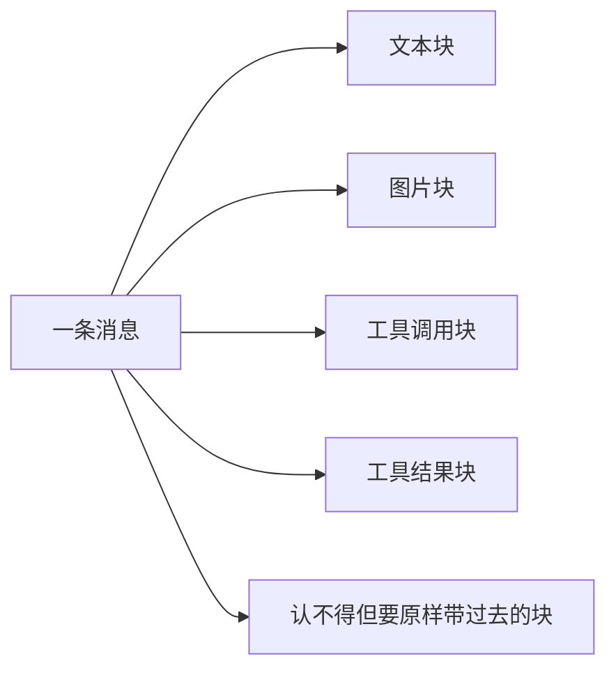

### 每种标识各有自己的类型

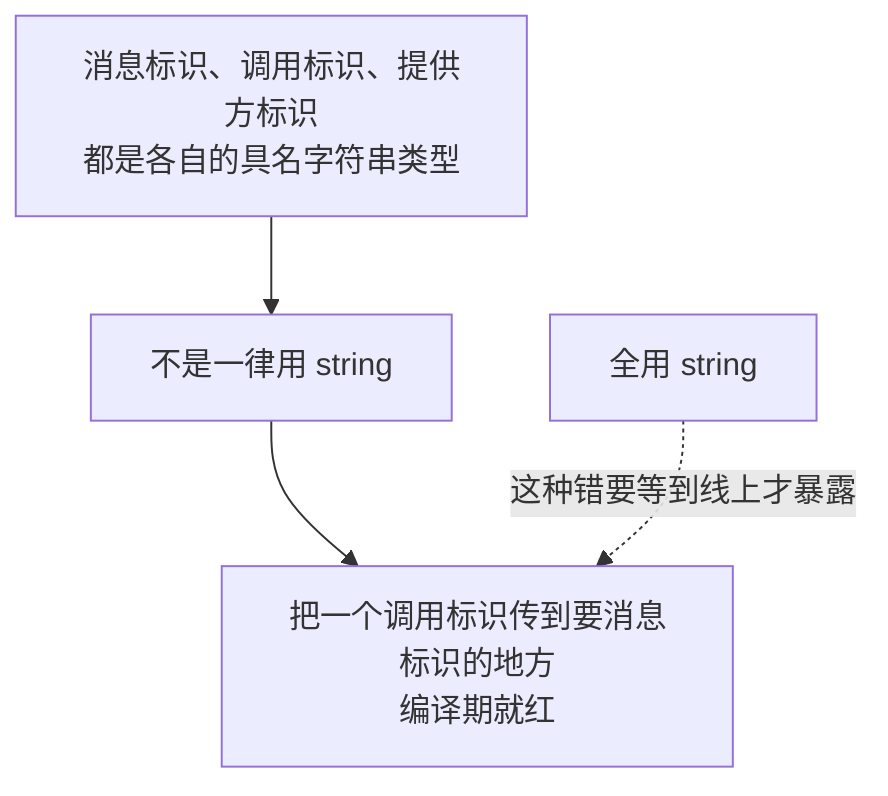

### 跨边界一律复制


### 结构问题要在发出去之前就暴露

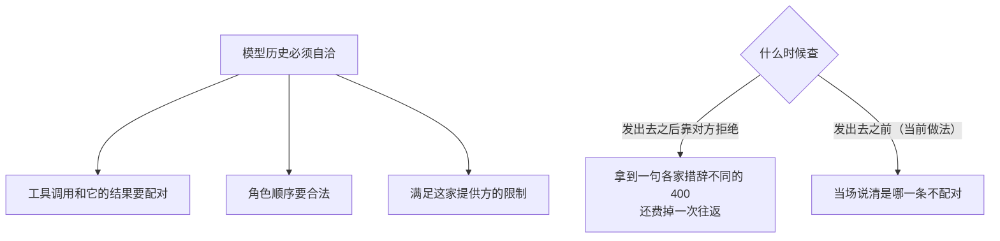

---

## 一次调用带什么

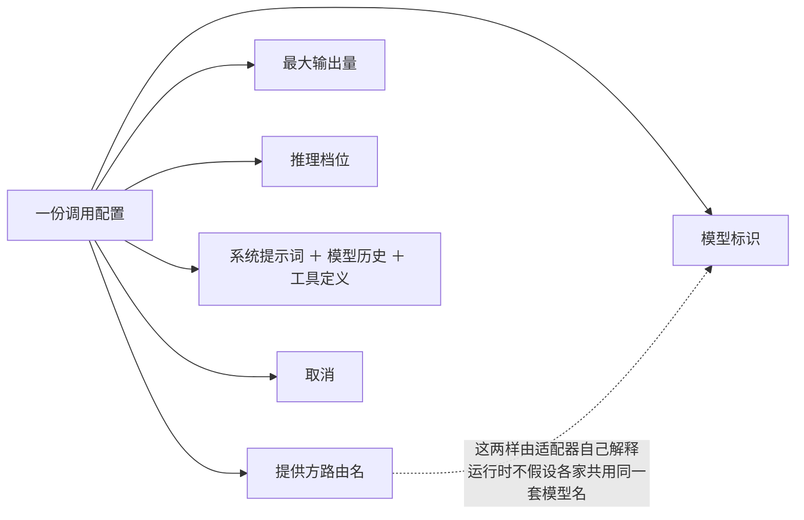

### agent 中途换模型时，两样东西必须取同一份快照

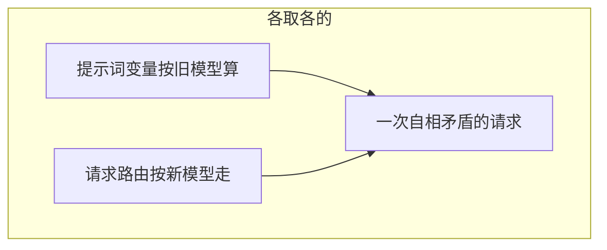

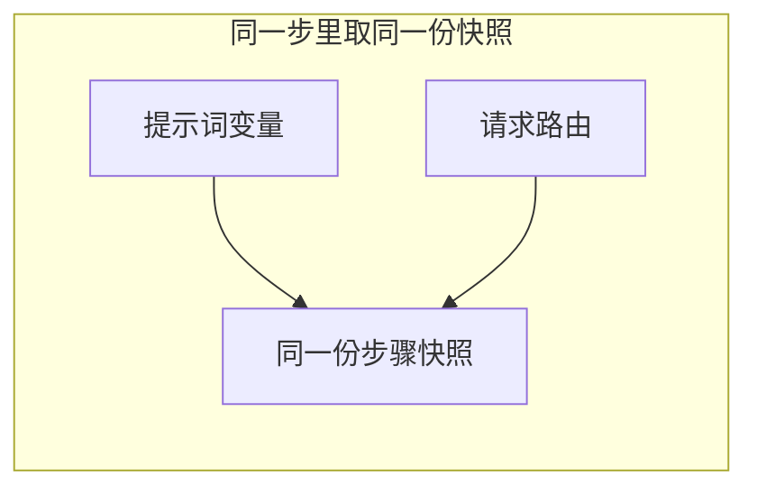

---

## 流式响应

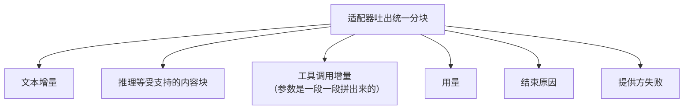

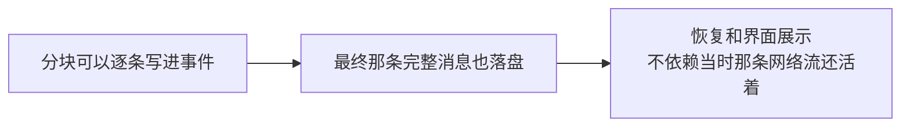

---

## 失败：一份能落盘的事实，不是一个 Go 错误基类

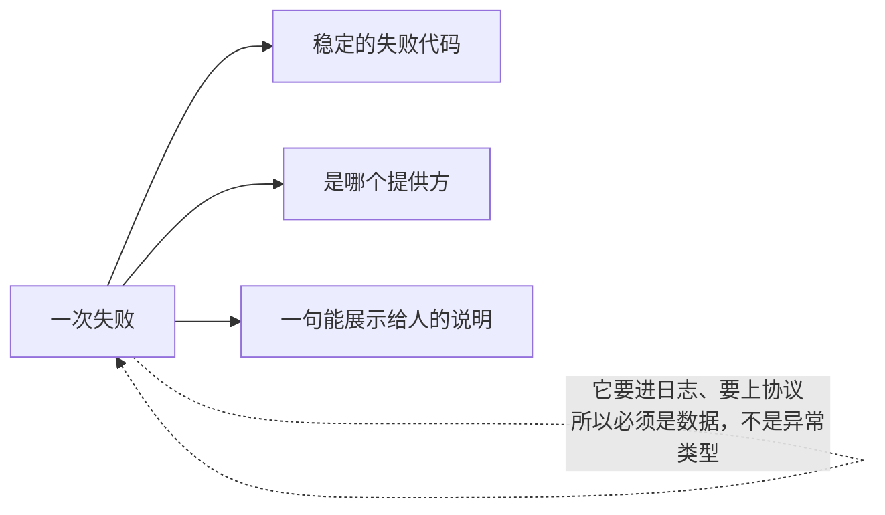

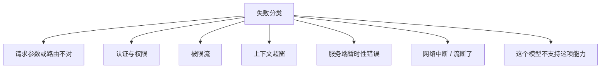

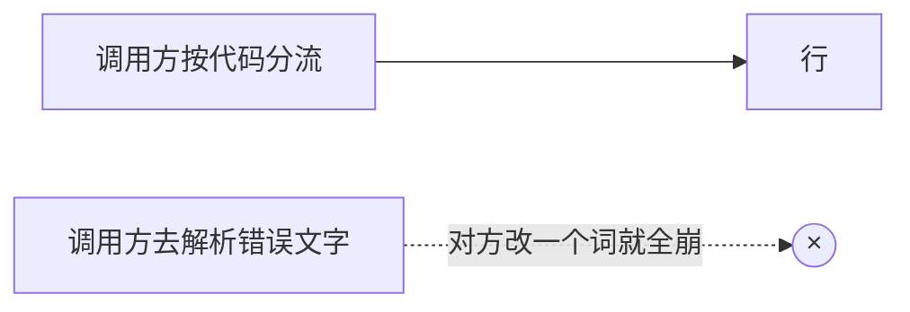

---

## 重试：等待这件事本身要落账

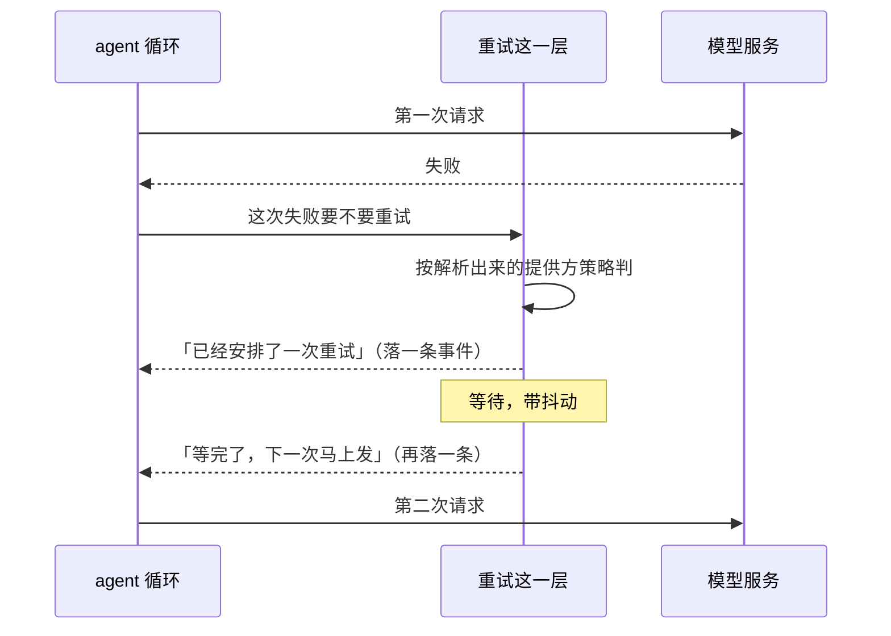

### 为什么等待要写两条事件

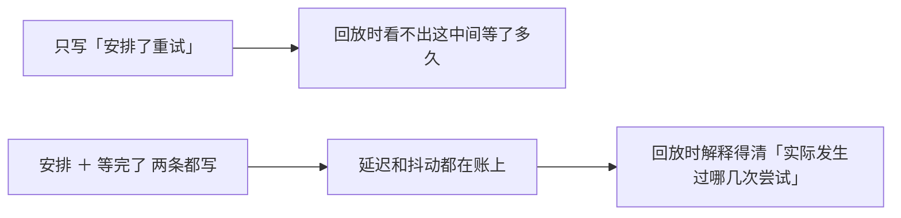

### 等待期间被取消

```mermaid
flowchart TD
    A["还在等，人取消了"] --> B["就此结束"]
    B -.->|"绝不伪造一次「已经发出去的请求」"| C(("×"))
```

### 两种模式，以及策略变了怎么办

```mermaid
flowchart LR
    A["普通模式"] --> A1["受最大次数限制"]
    B["always 模式"] --> B1["由策略明确允许一直重试"]
    C["策略变了"] --> C1["开一条新的重试链"]
    C1 -.->|"不沿用旧策略的计数"| C1
```

默认是**不重试**——要重试得有人（一个观察者）认领这次失败并明确要求。

---

## OpenAI 兼容适配器

```mermaid
flowchart TD
    A["它实现的是 OpenAI Chat Completions 那套线上形状"] --> B1["自定义地址"]
    A --> B2["自定义请求头与密钥来源"]
    A --> B3["手工声明提供方与模型目录"]
    A --> B4["文本、工具调用、受支持的图片输入"]
    A --> B5["上下文窗口、最大输出、推理档位的映射"]
    A --> B6["配置动态读取：密钥、端点、模型设置改了<br/>后续请求就生效"]
```

```mermaid
flowchart LR
    A["「OpenAI 兼容」"] --> B["只说明线上协议的形状"]
    B -.->|"不保证每个兼容服务的扩展字段都一样"| B
```

### 宿主自带的私有请求字段

有些部署要往每次请求上补一个自己的顶层字段。这里给的是一张**归属表**：

```mermaid
flowchart TD
    subgraph ASM["装配时"]
        A1["贡献方 A 认领「字段甲」"]
        A2["贡献方 B 认领「字段乙」"]
    end
    subgraph REQ["每次请求"]
        B1["适配器先把请求拼好"] --> B2["挨个问贡献方：这次要补什么"] --> B3["补上去，发出"]
    end
    ASM --> REQ
```

三条规矩，前两条在装配时就查：

```mermaid
flowchart TD
    R1["① 同一个字段被两方认领"] --> X1["装配就报错"]
    R2["② 认领了适配器自己的字段（比如对话历史）"] --> X2["装配就报错"]
    R3["③ 某个贡献方这次备不出来"] --> X3["整次请求不发"]
```

第三条是故意的：

```mermaid
flowchart LR
    A["贡献方备不出自己那个字段"] --> B["说明这次请求本来要带的东西没带上"]
    B --> C["照旧发出去"] --> D["换来一次「看起来成了、其实少了半份内容」的调用"]
    D -.->|"这种成功比失败难查得多"| D
```

### 明确不承诺的几样

```mermaid
flowchart TD
    N["不承诺"] --> N1["Responses API"]
    N --> N2["Anthropic Messages API"]
    N --> N3["提供方的 OAuth 登录"]
    N --> N4["WebSocket 传输"]
    N --> N5["第三方 SDK 的全部兼容开关"]
    N --> N6["自动拥有所有厂商的模型目录"]
    N --> N7["告诉贡献方「你补的字段这次真的发出去了」"]
```

最后一条展开：补字段是单向的，要「发成了才落账」得自己去盯会话日志里那条已提交的记录。

---

## Token 计量

```mermaid
flowchart TD
    A["这一步用了多少"] --> B{"模型报了实际用量吗"}
    B -->|"报了"| C["就用它报的"]
    B -->|"没报"| D["用一套确定的估算"]
    D -.->|"确定 ＝ 同样的输入永远估出同一个数<br/>否则回放对不上账"| D
```

```mermaid
flowchart LR
    A["统计的维度"] --> A1["输入"]
    A --> A2["输出"]
    A --> A3["缓存命中"]
    A --> A4["推理"]
    B["聚合的层级"] --> B1["一步"]
    B --> B2["一个回合"]
    B --> B3["整段会话"]
```

### 图片按当次那条路由计价

```mermaid
flowchart TD
    A["一张图值多少"] --> B{"这次请求路由到的那个适配器报价了吗"}
    B -->|"报了"| C["用它报的"]
    B -->|"没报"| D["退回启发式"]
    E["同一张图换一条路由"] -.->|"价钱可以不一样"| A
```

### 单回合的精确用量：一个字都不估

```mermaid
flowchart LR
    A["吃一段回合开始到回合结束的事件"] --> B["只加提供方亲口报过的数"]
    B --> C{"中间少一角"}
    C -->|"是"| D["整份不给"]
    D -.->|"一份掺了估算的「精确用量」<br/>比没有更糟"| D
```

### 这不是账单

```mermaid
flowchart LR
    A["估算"] --> B["够用来做压缩和预算决策"]
    A -.->|"不能当计费依据"| C["生产计费要以提供方的实际用量<br/>或者一套独立计量为准"]
```

---

## 凭据

```mermaid
flowchart TD
    K["一把密钥"] --> N1["不进会话事件 ✗"]
    K --> N2["不进模型历史 ✗"]
    K --> N3["不进普通日志 ✗"]
    K --> Y1["由适配器在发请求那一刻解析 ✓"]
    K --> Y2["配置展示一律脱敏 ✓"]
```

```mermaid
flowchart LR
    A["密钥换了"] --> B["只影响后续请求"]
    B -.->|"绝不回头改已经落盘的历史事实"| C(("×"))
    D["多租户部署"] --> E["租户隔离必须在提供方路由之前完成"]
```

---

## 生命周期与并发

```mermaid
flowchart TD
    A["登记适配器、解析路由"] --> A1["可以并发用"]
    B["某个适配器自己支不支持并发"] --> B1["由它自己保证<br/>这一层不替它承诺"]
    C["模型流"] --> C1["必须响应取消<br/>并且关掉网络响应体"]
    D["动态配置读取"] --> D1["一次请求中途不许读到两份不同版本"]
    E["观察者和适配器回调"] --> E1["不许在运行时的锁里做长活儿"]
```

---

## 失败语义

```mermaid
flowchart TD
    A["出了岔子"] --> B{"哪一类"}
    B -->|"参数、认证、限流、超窗、服务端、网络、能力不支持"| C["各配一个稳定代码<br/>连同提供方和一句人读的说明落进日志"]
    B -->|"历史结构不自洽"| D["发请求之前就报<br/>不浪费一次往返"]
    B -->|"私有字段的贡献方备不出来"| E["整次请求不发"]
    B -->|"等待重试期间被取消"| F["就此结束<br/>不伪造一次已发出的请求"]
    B -->|"单回合用量缺一角"| G["整份不给<br/>不拿估算填缝"]
```

---

## 能力边界

```mermaid
flowchart TD
    Y["这几个包做的"] --> Y1["统一模型消息、流、配置和失败的说法"]
    Y --> Y2["提供方路由和适配器的登记与注销"]
    Y --> Y3["重试、用量计量、一个 OpenAI 兼容实现"]
    N["不做的"] --> N1["不管 agent 回合和工具循环"]
    N --> N2["不定义系统提示词的内容"]
    N --> N3["不做用户鉴权，也不做租户计费"]
    N --> N4["不保证不同模型行为一致"]
    N --> N5["不把密钥存进会话"]
    N --> N6["不提供所有厂商的协议"]
```

## 对应的 DSH 能力

下表由 [`docs/packages.md`](../packages.md) 与 [能力覆盖表](../portmap/capability-coverage.tsv) 机器 join 得到：本篇覆盖的 Go 包，承接的是上游 DSH 的哪几条能力，以及各自还缺什么。落点列由源码里的 `// 源:` 注释反查，不是手写的。

| 上游能力 | DSH 包 | 裁决 | 落在哪个 Go 包 | 这里缺什么 |
|---|---|---|---|---|
| 浏览器 Chat target，渲染 transcript 节点与详情、历史图片、操作、本地化与滚动位置恢复，并直接折叠打包的 assistant 历史 run | `client/ui-chat` | 不需要 | `llm` | 服务端替代实现见 llm；缺前置：浏览器运行时（DOM／ESM／React） |
| 提供方无关的 LLM 词汇与抽象，注册适配器、捕获重试策略、支持模型发现与流式调用 | `llm/llm` | 需要 | `adapter/openaicompat` `llm` | — |
| 基于@earendil-works/pi-ai的多提供方通用适配器，支持OpenAI兼容端点与私有网关 | `llm/llm-pi-ai` | 需要 | `adapter/openaicompat` | — |
| DeepSeek 官方请求的顶层字段扩展注册表，贡献插件各认领一个经声明合并的字段，基础请求序列化后准备当前贡献 | `llm/deepseek-llm-api-extensions` | 取形重写 | `adapter/openaicompat` | 只取注册表形状：字段归属在登记那一刻定死（Go 没有声明合并），DeepSeek 那套具体字段一个都不带；accept() 那半个事务不做，它唯一的上游用户 session/session-log-deepseek 判了不需要 |
| 通过agent/request-error事件应用提供方重试策略，支持normal与always两种模式 | `llm/llm-retry` | 需要 | `feature/llmretry` | — |
| 通过单例ctx.tokenMeter进行回放感知的token测量与上下文占用率投影 | `llm/token-meter` | 需要 | `feature/tokenmeter` | 缺两角已补：（一）单回合精确用量落在 `DeriveTurnUsage`——吃一段 turn/start..turn/end 的事件切片，一个字都不估，只加提供方亲口报过的数；对残缺一点都不宽容，少一角就整份不给。（二）路由感知的图片计价落在 `llm` 的图片计价接缝加 `feature/tokenmeter` 的表面重估——按当次请求头那条路由重估图片那一份 |

## 相关源码

| 路径 | 内容 |
|---|---|
| `llm/message.go`、`llm/content.go` | 消息和内容块 |
| `llm/stream.go`、`llm/assembler.go` | 流式词汇和消息组装 |
| `llm/runtime.go`、`llm/adapter.go` | 路由运行时和 Adapter 接口 |
| `llm/config.go`、`llm/modelinfo.go` | 调用配置和模型目录 |
| `feature/llmretry/` | 重试策略和耐久事件 |
| `adapter/openaicompat/` | OpenAI Chat Completions 兼容适配器，含私有请求字段的归属表 |
| `feature/tokenmeter/` | 用量统计和估算 |
| `feature/replay/`、`llm/mockserver/` | 测试录制、回放和假服务 |

## 深入阅读

[凭据](credentials.md) · [附件与图片](attachment.md) · [LLM 测试与回放](llm-testing.md)
