# MCP 客户端

对应包：`protocol/mcp`

## 定位

这套装置自带的工具是有限的。真正的活儿常常要用到别人已经做好的东西——一个查数据库的、一个开工单的、一个读内部文档的。

MCP（Model Context Protocol）是这些外部工具报家门的一套规矩。这个包是它的**客户端那一半**：连上一台外部 MCP 服务器，把对方报出来的工具接进本装置的工具注册表，让模型可以像调本地工具一样调它们。

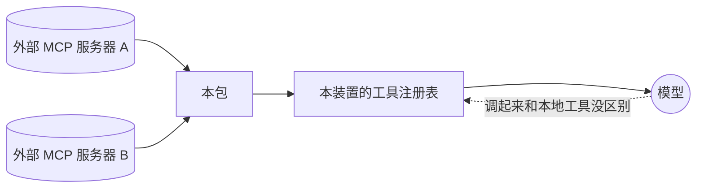

四件事：连上去、同步清单、转发调用、断了重连。

---

## MCP 标准到底规定了什么

完整中文规范见：[MCP 协议规范中文版（2026-07-28）](../mcp-protocol-spec-zh.md)。本节只保留理解当前客户端实现所需的最短说明。

MCP 是一套公开协议，不是某个网站私有的接口。规范最初由 Anthropic 发布，现在由 Linux Foundation 旗下的 Agentic AI Foundation 管理。

官方规范：<https://modelcontextprotocol.io/specification/2026-07-28>

对 Tool 来说，最关键的是三种标准请求：

| 标准请求 | 用途 |
|---|---|
| `server/discover` | 获取支持的协议版本、能力和身份 |
| `tools/list` | 获取可用 Tool 的名称、说明和参数 Schema |
| `tools/call` | 按名称和 JSON 参数调用一个 Tool |

因此，同一份 MCP Client 代码可以连接不同系统。Client 本身不知道股票、天气、GitHub 或 DeepSeek 的业务逻辑；装配方给它不同的连接地址和鉴权配置，它仍然发送相同形状的 MCP 请求。

```text
同一份 MCP Client 代码
          |
          +-- 地址 A + 鉴权 A
          |
          +-- 地址 B + 鉴权 B
```

但普通网站不能直接由 MCP Client 调用。对方必须提供符合 MCP 标准的入口，至少能完成发现、列出 Tool 和调用 Tool。只提供普通网页、REST API 或私有协议，不等于提供了 MCP。

### `tools/list` 返回什么

下面是协议数据的简化形状：

```json
{
  "tools": [
    {
      "name": "query_product",
      "description": "按商品 ID 查询商品",
      "inputSchema": {
        "type": "object",
        "properties": {
          "productId": { "type": "string" }
        },
        "required": ["productId"]
      }
    }
  ]
}
```

Client 拿到这份清单后，才知道有哪些 Tool。它不会猜测，也不会扫描网站页面。

### `tools/call` 发送什么

```json
{
  "name": "query_product",
  "arguments": {
    "productId": "SKU-100"
  }
}
```

`tools/call` 是 MCP Client 的标准调用方法；`query_product` 才是被调用的 Tool。

### 模型看到什么

模型只看到从 `tools/list` 转换出来的 Tool 定义，并产生 Tool Call。连接地址、鉴权信息和 MCP 协议收发都不交给模型。

### 模型究竟在什么时候看到 MCP Tool

这里有两个不同的时机，不能把它们说成一件事：

1. **进入工具注册表**：`Host.Connect` 建立连接，`connection.go` 取得完整的 `tools/list`，然后 `bridge.go` 把这些 Tool 注册进 `tools.Runtime`。`Connect` 默认等首次同步完成才返回。
2. **进入模型请求**：Agent 每个步骤开始前装配系统提示词。装配器调用 `tools.Runtime.Schemas(agentScope)` 取得该 Agent 当时可见的 Tool，再把这份快照放进本次模型请求的 `tools` 字段。到这一步，模型才真正看到它们。

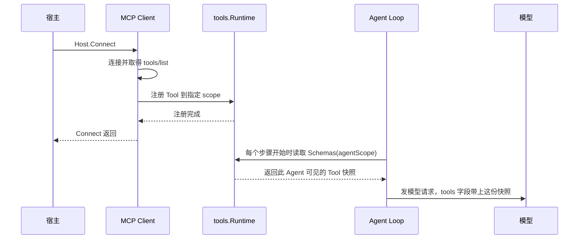

因此有三个确定结论：

- 注册到某个 Agent 的 `scope`，只有该 Agent 及其后代能够看到；注册到全局层，所有 Agent 都能看到。
- Tool 在本次请求装配完成之后才注册或更新，不会改变已经发出的请求；它最早出现在该 Agent 的下一个步骤，若当前回合已经结束，则出现在下一回合。
- 当前实现没有延迟发现。只要一个 MCP Tool 通过 `scope` 可见，它就会和本地 Tool 一起直接放进模型请求。

### 与 DSH、Codex、Grok 的实现有什么区别

四种实现都先取得 MCP Tool，再在构造模型请求时决定本次给模型什么。主要差别是具体 MCP Tool 全量发送，还是先隐藏再按需搜索。

| 实现 | 模型最初看到什么 | 怎样调用 MCP Tool |
|---|---|---|
| 本项目 | 当前 `scope` 可见的全部 MCP Tool | 模型按公开名称直接调用 |
| DSH 默认 `native` 模式 | 当前 `scope` 可见的全部 MCP Tool | 模型按公开名称直接调用，和本项目相同 |
| DSH `ptc` 模式 | 模型请求只暴露 `run_code`；系统提示词中提供可用 Tool 的生成式 SDK | 模型写代码，通过 `run_code` 调用；这是调用入口合并，不是 Tool 搜索 |
| Codex | 可直接暴露，也可把具体 MCP Tool 标成 Deferred，只暴露 `tool_search` | 模型调用 `tool_search`，取得匹配 Tool 的可加载定义，再调用具体 Tool |
| Grok | 隐藏具体 MCP Tool，暴露 `search_tool` 和 `use_tool`，并提示已连接的服务器摘要 | 模型用 `search_tool` 取得名称、说明和参数 Schema，再用 `use_tool` 转发调用 |

Codex 和 Grok 都由模型决定什么时候搜索，Harness 不替模型分析用户意图。它们的区别是搜索之后怎样调用：Codex 把搜索结果作为可加载的 Tool 定义交给模型；Grok 保持模型侧 Tool 清单稳定，始终通过统一的 `use_tool` 调用。

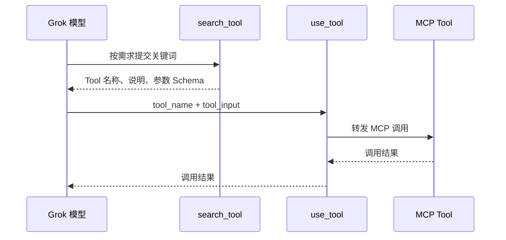

无论采用哪一种方式，已经发出的模型请求都不会被中途修改。Tool 清单发生变化后，只能在后续模型步骤中生效。

---

## 架构

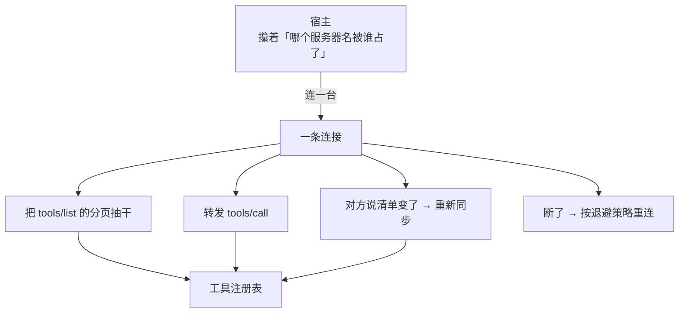

### 名字：稳定身份 vs 模型看见的那个

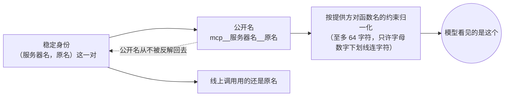

---

## 一次同步分两步：先取，再换

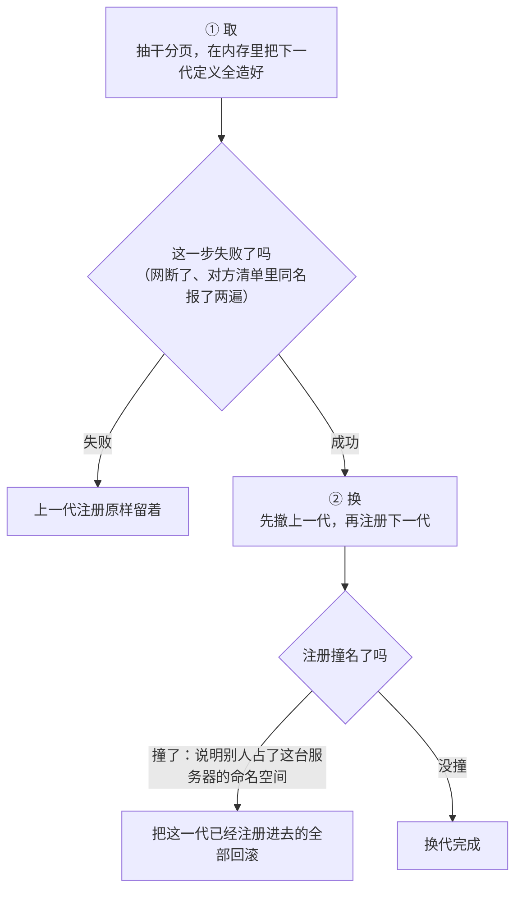

**为什么非要全成或全败**：

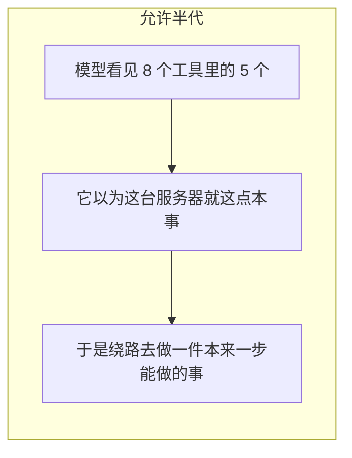

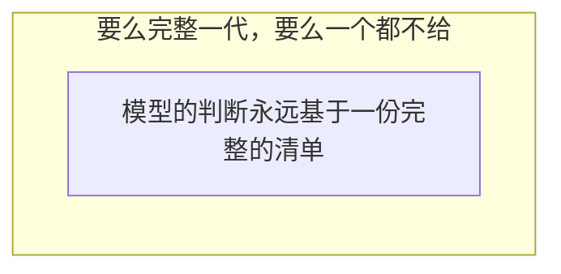

---

## 一次工具调用

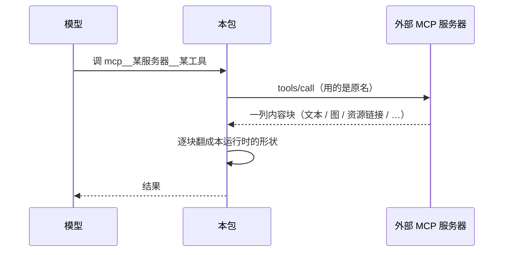

### 对方说「这次是错的」，不算本进程出错

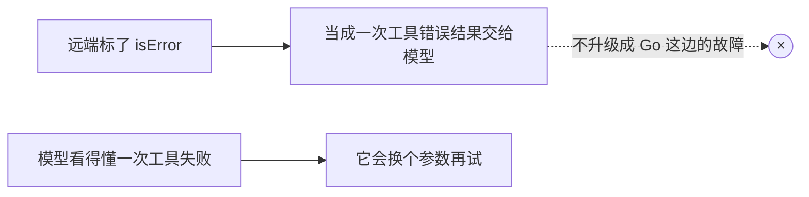

---

## 图片这一路

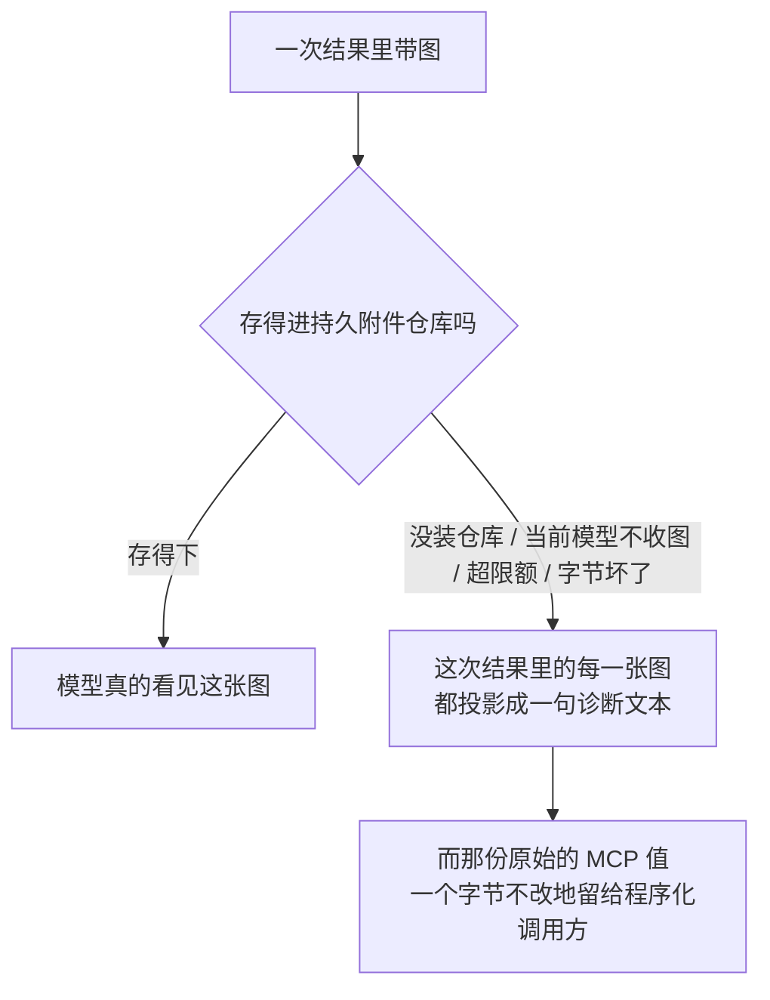

「能不能收图」这个判断不在本包：

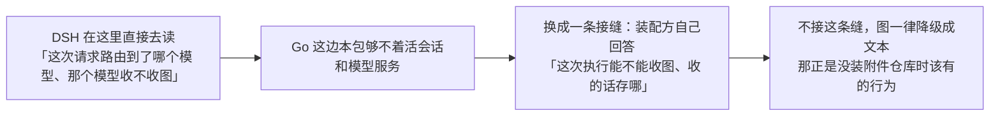

---

## 和 DSH 不一样的四处

### ① 只支持 Streamable HTTP，不支持 stdio

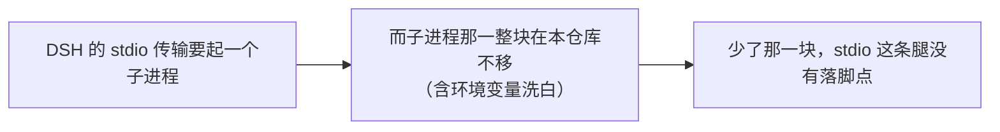

### ② 没有插件容器，换成一对普通类型

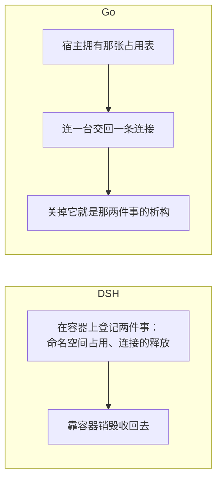

### ③ 不认得的内容类型：整次失败，而不是逐块降级

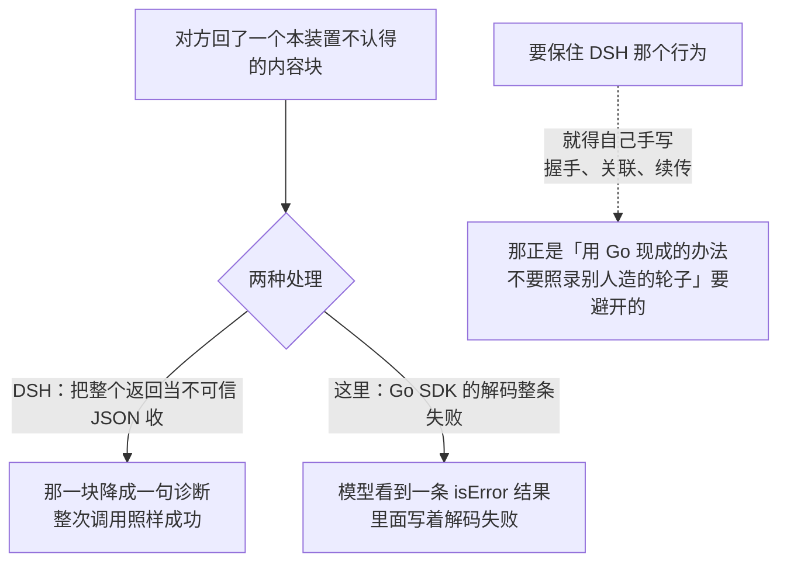

**认得但缺字段**的块仍然逐块降级，和 DSH 一字不差：

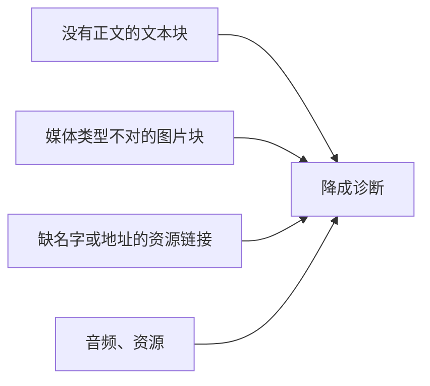

### ④ 只能按 task 执行的工具，这里拦不住

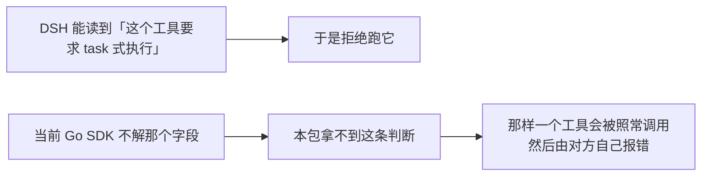

---

## 生命周期与并发

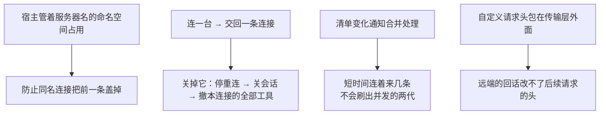

### 重连

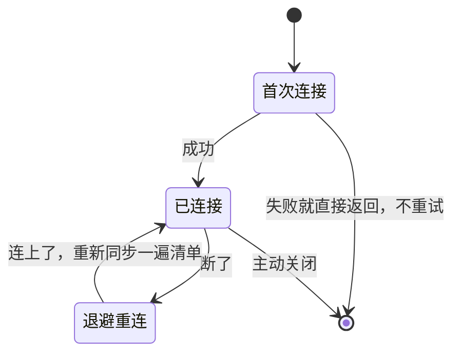

首次连不上就直接报错，是因为那多半是配置写错了——退避重试只会把一个当场能看见的错误拖成一段沉默。

---

## 失败语义

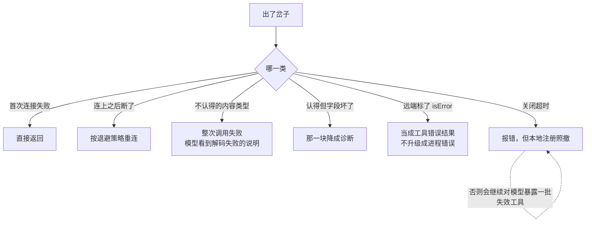

---

## 能力边界

```mermaid
flowchart TD
    Y["这个包做的"] --> Y1["连接、同步清单、命名、转发调用、重连"]
    Y --> Y2["把 MCP 的内容块翻成本运行时的形状"]
    N["不做的"] --> N1["不实现 MCP 服务器<br/>本包是客户端那一半"]
    N --> N2["不做 stdio 传输，也不起子进程"]
    N --> N3["不做 OAuth 登录<br/>请求头与凭据由装配方配好交进来"]
    N --> N4["不拥有工具的执行<br/>注册进去的东西最终由工具运行时来调"]
    N --> N5["不自己存图，也不自己判模型收不收图"]
    N --> N6["不在注册前拒绝只能按 task 执行的工具"]
```

## 对应的 DSH 能力

下表由 [`docs/packages.md`](../packages.md) 与 [能力覆盖表](../portmap/capability-coverage.tsv) 机器 join 得到：本篇覆盖的 Go 包，承接的是上游 DSH 的哪几条能力，以及各自还缺什么。落点列由源码里的 `// 源:` 注释反查，不是手写的。

| 上游能力 | DSH 包 | 裁决 | 落在哪个 Go 包 | 这里缺什么 |
|---|---|---|---|---|
| MCP客户端桥接插件，连接外部MCP服务器并把工具注册到ctx.tools | `mcp/mcp-client` | 需要 | `protocol/mcp` | — |

## 相关源码

| 文件 | 负责什么 | 在运行流程中的位置 |
|---|---|---|
| `protocol/mcp/doc.go` | 说明整个包的设计、能力边界和与 DSH 的差异，不执行运行逻辑 | 开发者阅读入口 |
| `protocol/mcp/config.go` | 定义并校验服务器地址、请求 Header、Tool 调用超时、启动失败策略和重连参数 | 建立连接之前 |
| `protocol/mcp/host.go` | 提供 `Host.Connect`；占用服务器名，创建连接；关闭时释放连接和名称 | 业务层进入 MCP 模块的入口 |
| `protocol/mcp/connection.go` | 建连、首次同步 Tool、监听 `tools/list_changed`、重新同步、断线重连和最终撤销 Tool | 管理一台 MCP 服务器的完整连接生命周期 |
| `protocol/mcp/bridge.go` | 读取分页的 `tools/list`，把 MCP Tool 转成 `tools.Definition` 并注册到指定 `scope`；执行时转发为 `tools/call` | MCP 协议与 Harness Tool 运行时之间的桥 |
| `protocol/mcp/content.go` | 把 MCP 返回的文本、图片、音频、资源链接和资源内容转换为 Harness/LLM 内容，并保留结构化结果 | `tools/call` 返回之后 |
| `protocol/mcp/naming.go` | 生成 `mcp__<serverName>__<toolName>` 公共名称，处理非法字符、长度限制和重名风险 | Tool 注册之前 |

按一次正常运行串起来，就是：

```text
config.go 提供配置
    ↓
host.go 接收 Connect
    ↓
connection.go 建连并取得 Tool 清单
    ↓
bridge.go 转换并注册 Tool；调用时负责转发
    ↓
content.go 转换调用结果

naming.go 在 Tool 注册时提供公共名称
doc.go 只负责包说明
```
