# 移植与文档门禁工具

对应包：`internal/devtools/` 底下的十一个包

## 定位

这个仓库是把一套 TypeScript 的东西重做成 Go。这件事有两个说不清楚的地方：

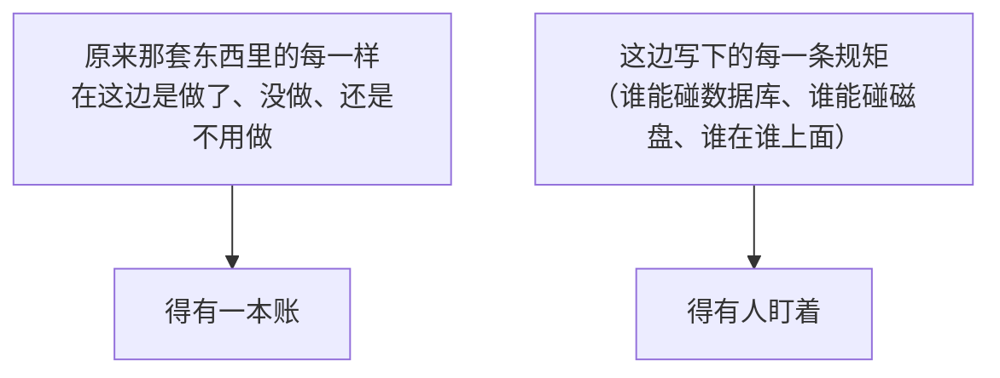

靠人记是记不住的：

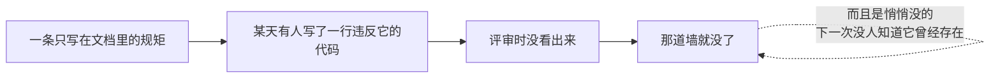

所以这些工具存在的理由是同一句话：**把规矩变成会变红的东西。**


---

## 架构与工具清单

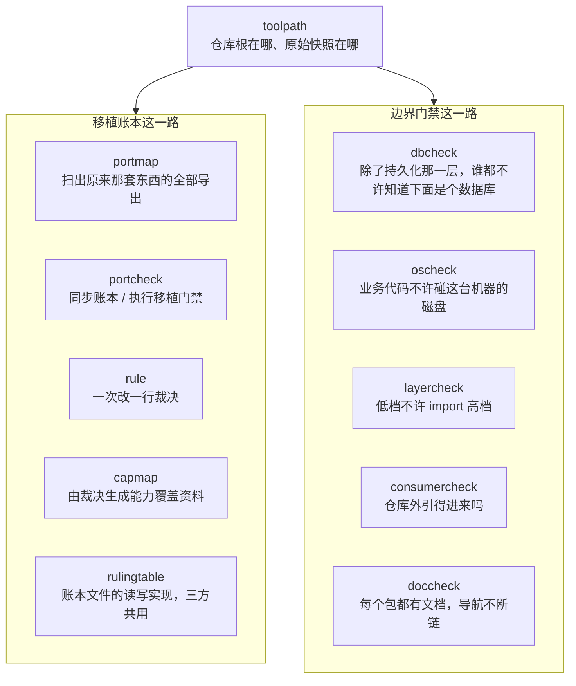

| 工具 | 吃什么 | 答什么 |
|---|---|---|
| `portmap` | 原来那套 TypeScript 源码 | 一份导出符号清单 |
| `portcheck` | 符号清单 ＋ 裁决表 ＋ Go 源码 | 同步裁决表，或执行移植门禁 |
| `rule` | 一个包、一个符号、一个裁决 | 安全地更新一行裁决记录 |
| `capmap` | 能力定义 ＋ 包裁决 | 能力覆盖资料 |
| `doccheck` | 包清单 ＋ 包映射 ＋ Markdown | 每个包都有文档，且导航完整 |
| `consumercheck` | 包清单 ＋ 本仓库的模块声明 | 在仓库外建一个模块，验公开路径和每个公开包对外可引 |
| `dbcheck` | 整棵目录树的 Go 源码 | 谁在碰数据库 |
| `oscheck` | 整棵目录树的非测试 Go 源码 | 谁在碰本机磁盘 |
| `layercheck` | 整棵目录树的 import 关系 | 有没有反方向的依赖 |

---

## 路径解析：两个问题

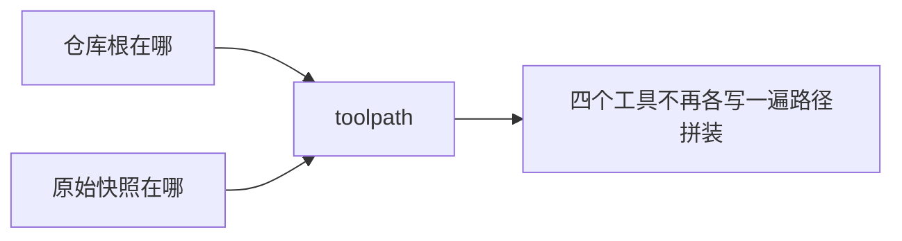

### 认模块声明，不认文件名

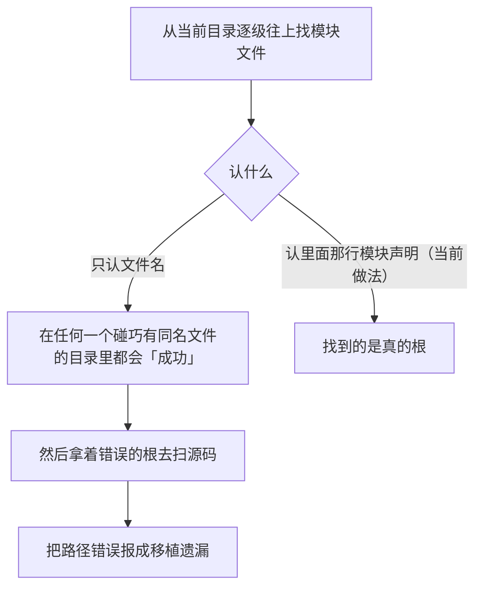

### 快照不在的时候

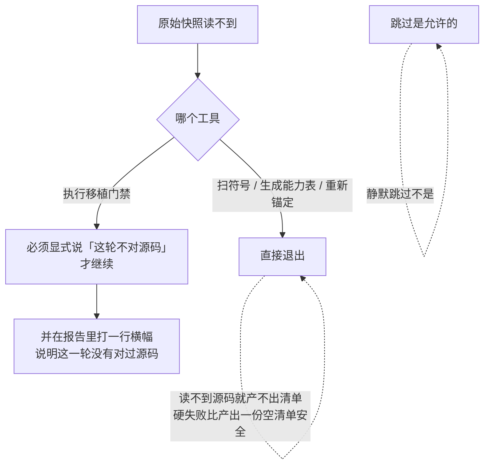

---

## 仓库外消费门禁

### 它解决的是一类仓库内部验不出来的错

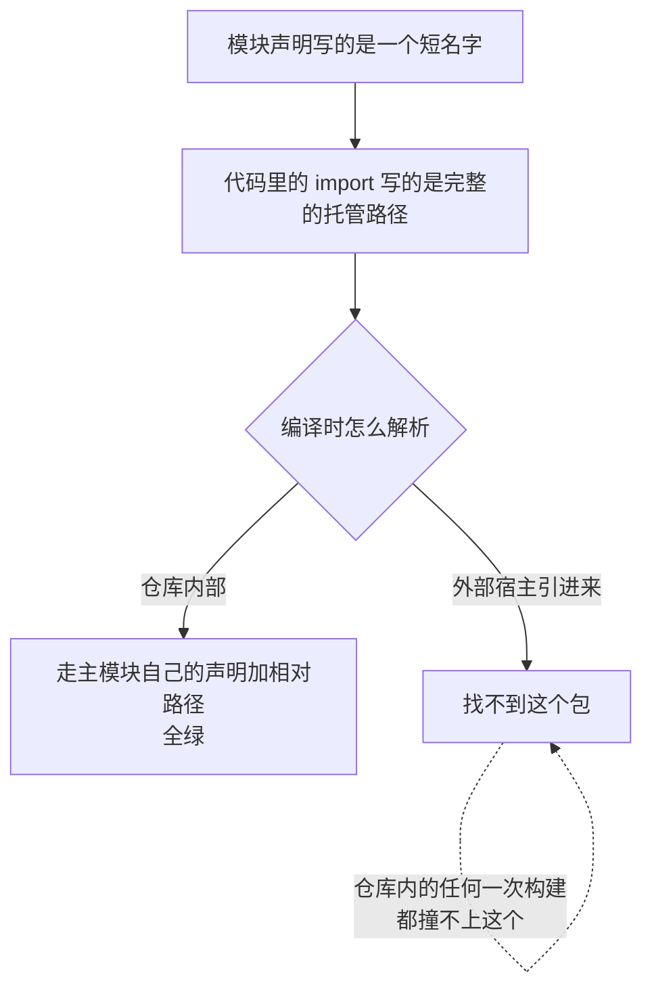

### 它怎么验

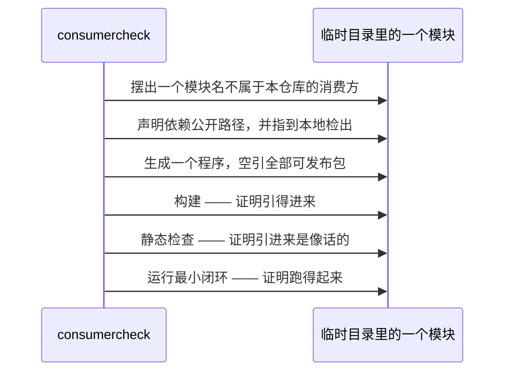

最小闭环那一步做的事：建作用域 → 建会话存储 → 建会话 → 追加一条用户消息 → 读回来。

### 依赖清单直接照录，不重新解一遍

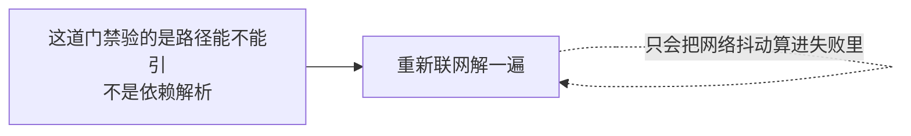

### 那个程序里还压着一条接缝

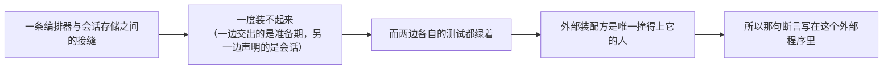

---

## 数据库边界门禁

它守的就是[持久化抽象层](datastore.md)那条界线。

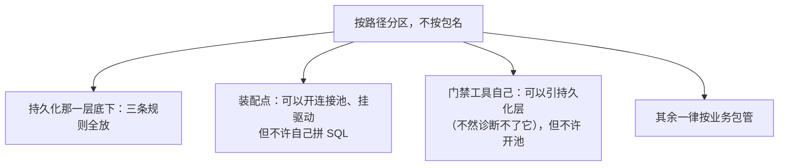

### 它自己整个跳过自己


### 为什么可以做成阻断式的

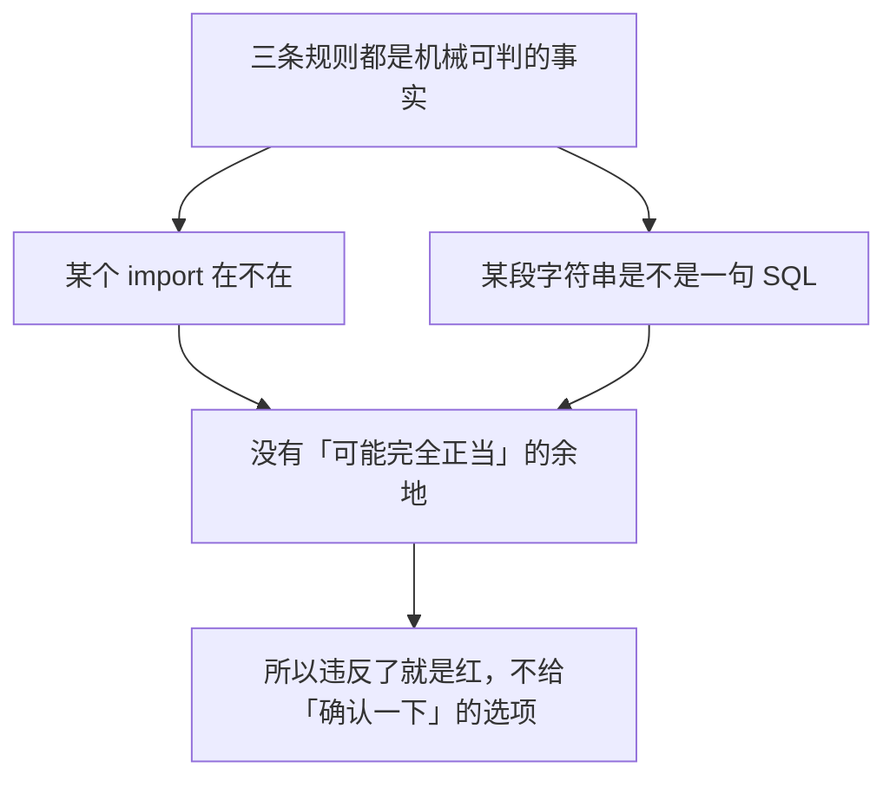

### 认语句骨架，不认单个关键词

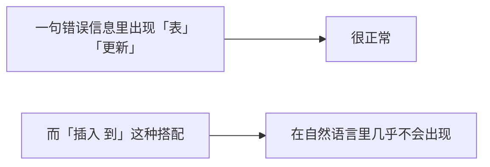

### 驱动名单之外还有一条兜底

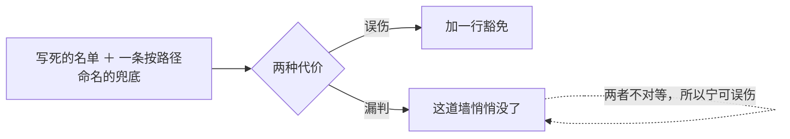

### 走文件系统，不走包清单


---

## 文件系统边界门禁

它是同一件事的另一半：数据库那一半管库，这一半管内容存储。

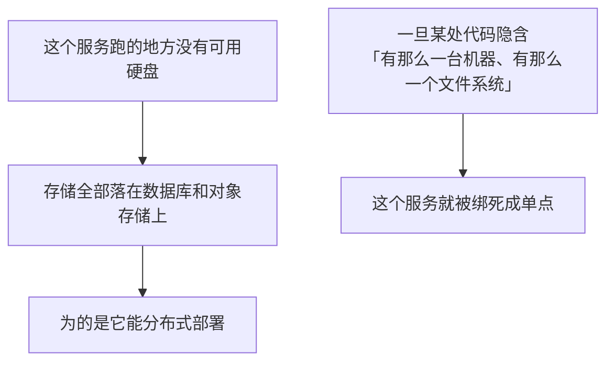


### 两条规则

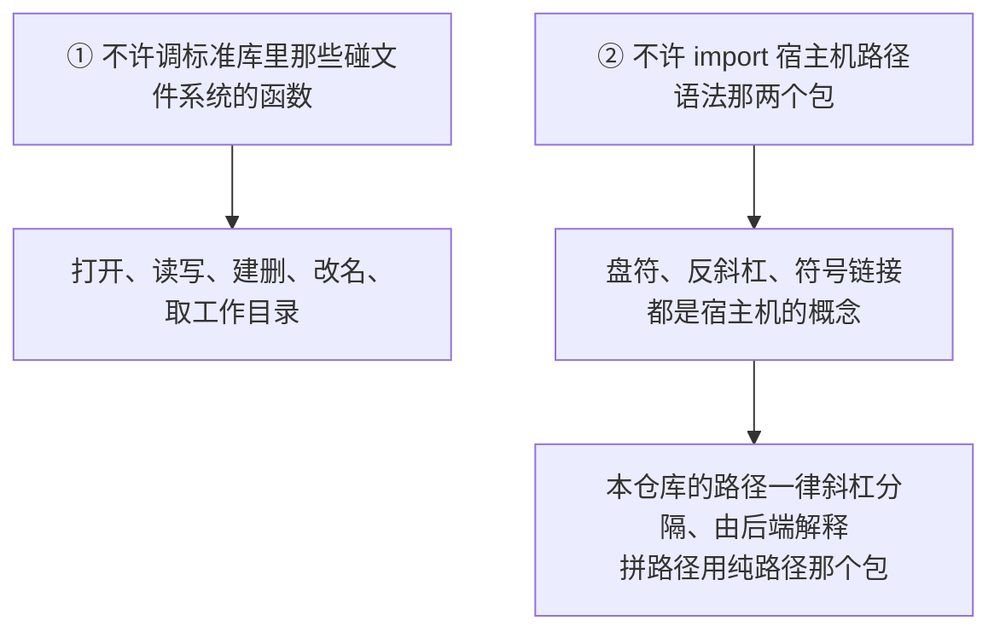

```mermaid
flowchart LR
    A["那个标准库包的其余部分不管"] --> B["读环境变量、退出进程、写标准输出"]
    B --> C["和磁盘没有关系"]
```

### 只查非测试文件

```mermaid
flowchart LR
    A["测试要造夹具、要临时目录"] --> B["那是测试进程自己的事"]
```

### 分区与豁免

```mermaid
flowchart TD
    A["按路径分区"] --> A1["门禁工具和装配点：整个放行"]
    A1 --> A2["它们跑在本机上<br/>一个装配点从磁盘读一份配置正是它的活儿"]
    A --> A3["其余按业务包管"]
    B["豁免名单只有两项"] --> B1["数据库测试夹具<br/>（必须供别的包的测试引，所以不能写成测试文件）"]
    B --> B2["快照测试用的假模型<br/>（从磁盘读回放脚本）"]
```

```mermaid
flowchart LR
    A["这份名单是封闭的"] --> B["将来真写一个本地磁盘后端时再加一条"]
    B --> C["那时它是唯一一个<br/>被允许碰宿主机磁盘的业务包"]
    C -.->|"而这正是它存在的全部理由"| C
```

---

## 移植账本

### 每个导出只能处于五种状态之一

```mermaid
flowchart TD
    S{"一个原始导出"}
    S --> S1["还没裁决"] --> X1["门禁失败"]
    S --> S2["已经实现"] --> X2["必须给出 Go 这边的符号引用"]
    S --> S3["Go 已有等价物"] --> X3["必须说明依据"]
    S --> S4["明确不做"] --> X4["必须说明原因"]
    S --> S5["当前范围外"] --> X5["产品外壳这类"]
```

### 一次只许改一行

```mermaid
flowchart TD
    A["改一行裁决"] --> B{"三种情况拒绝写入"}
    B --> B1["匹配有歧义"]
    B --> B2["要覆盖一行已经裁决过的"]
    B --> B3["没给依据"]
    A --> C["这样每次判断在版本历史里都看得清"]
```

### 主流程

```mermaid
flowchart LR
    A["扫出原始导出"] --> B["同步进账本"] --> C["逐个符号裁决"]
    C --> D["移植门禁"]
    D --> E["能力表与发布门禁"]
```

```mermaid
flowchart LR
    F["列出全部 Go 包"] --> G["包映射文档"] --> H["文档门禁"] --> I["文档覆盖"]
```

---

## 生命周期与并发

```mermaid
flowchart LR
    A["这些命令都按一次性进程跑"] --> B["不持有后台资源"]
    C["生成器先在内存里把解析做完"] --> D["再写文件"]
```

---

## 失败语义

```mermaid
flowchart TD
    A["出了岔子"] --> B{"哪一类"}
    B -->|"某个导出解析不出来"| C["保留成「没解出来」这个状态<br/>不静默丢弃"]
    B -->|"账本文件里有制表符、换行、重复键、非法状态"| D["门禁失败"]
    B -->|"原始快照读不到"| E["产清单的直接退出<br/>做检查的必须显式声明并打横幅"]
```

---

## 能力边界

```mermaid
flowchart TD
    Y["这些工具能证明的"] --> Y1["有裁决、有映射、格式自洽"]
    N["证明不了的"] --> N1["设计判断是对的"]
    N --> N2["标了「已经实现」不等于行为完全等价<br/>仍然要测试和人工审查"]
    N --> N3["生成的文件替代不了源码与许可证审查"]
```

```mermaid
flowchart TD
    A["各道门禁各自的盲区"] --> A1["文档门禁只校验覆盖和本地链接<br/>不评价文字质量"]
    A --> A2["数据库门禁认的是 import 和字符串字面量<br/>拦不住把 SQL 拼在运行期的写法"]
    A --> A3["磁盘门禁认的是语法上的调用<br/>拦不住经由反射或第三方库间接摸到磁盘"]
    A --> A4["消费方门禁指的是本地检出<br/>所以证明不了「这个版本在模块代理上取得到」"]
    A4 -.->|"那要等打了标签之后才验得了"| A4
```

```mermaid
flowchart LR
    A["两道边界门禁守的是同一句话"] --> B["「别在别处开这扇门」"]
    B -.->|"不是「别写出坏 SQL」<br/>也不是「别做坏 IO」"| B
```

## 对应的 DSH 能力

下表由 [`docs/packages.md`](../packages.md) 与 [能力覆盖表](../portmap/capability-coverage.tsv) 机器 join 得到：本篇覆盖的 Go 包，承接的是上游 DSH 的哪几条能力，以及各自还缺什么。落点列由源码里的 `// 源:` 注释反查，不是手写的。

| 上游能力 | DSH 包 | 裁决 | 落在哪个 Go 包 | 这里缺什么 |
|---|---|---|---|---|
| 能力账本工具 | （无上游出处） | 本仓库自有 | `internal/devtools/capmap` | 门禁 |
| 消费方 import 路径校验 | （无上游出处） | 本仓库自有 | `internal/devtools/consumercheck` | 门禁：全仓库唯一按路径索引的地方 |
| 数据库约定校验 | （无上游出处） | 本仓库自有 | `internal/devtools/dbcheck` | 门禁 |
| 分层校验 | （无上游出处） | 本仓库自有 | `internal/devtools/layercheck` | 门禁：docs/layers.tsv 的执行者 |
| 本机资源禁用校验 | （无上游出处） | 本仓库自有 | `internal/devtools/oscheck` | 门禁：服务端无磁盘这条的执行者 |
| 符号账本工具 | （无上游出处） | 本仓库自有 | `internal/devtools/portmap` | 门禁 |
| 规则库 | （无上游出处） | 本仓库自有 | `internal/devtools/rule` | 门禁共用 |
| 裁决表工具 | （无上游出处） | 本仓库自有 | `internal/devtools/rulingtable` | 门禁共用 |
| 工具路径校验 | （无上游出处） | 本仓库自有 | `internal/devtools/toolpath` | 门禁 |

## 相关源码

- `internal/devtools/portmap/`
- `internal/devtools/portcheck/`
- `internal/devtools/rule/`
- `internal/devtools/capmap/`
- `internal/devtools/rulingtable/`
- `internal/devtools/toolpath/`
- `internal/devtools/doccheck/`
- `internal/devtools/consumercheck/`
- `internal/devtools/dbcheck/`
- `internal/devtools/oscheck/`
