# 计划与待办

对应包：`feature/plan/planmode`、`feature/todo`

## 定位

这两个包管的是同一个阶段的两件事：**动手之前先把要干什么说清楚**，以及**动手之中让人看得见干到哪儿了**。

### 计划模式：不让模型在没对齐之前就开改

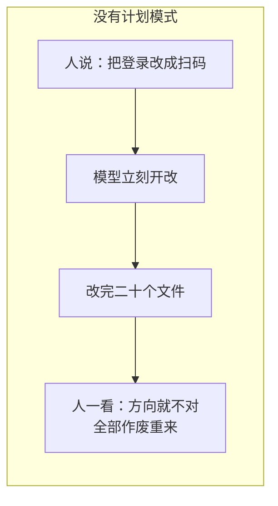
```mermaid
flowchart LR
    subgraph N["没有计划模式"]
        A1["人说：把登录改成扫码"] --> A2["模型立刻开改"] --> A3["改完二十个文件"] --> A4["人一看：方向就不对<br/>全部作废重来"]
    end
```

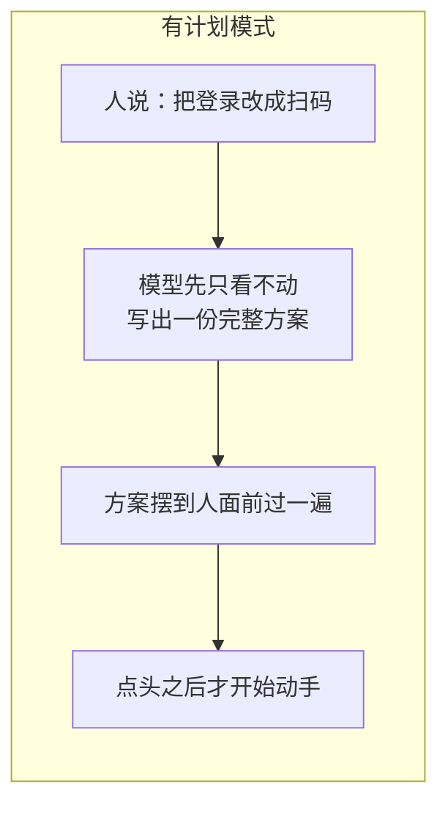
```mermaid
flowchart LR
    subgraph Y["有计划模式"]
        B1["人说：把登录改成扫码"] --> B2["模型先只看不动<br/>写出一份完整方案"]
        B2 --> B3["方案摆到人面前过一遍"]
        B3 --> B4["点头之后才开始动手"]
    end
```

### 待办清单：让八步活儿的进度是看得见的

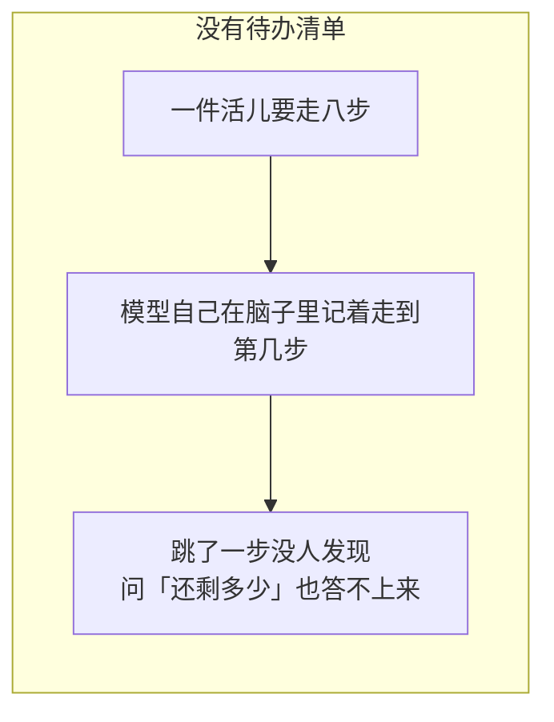
```mermaid
flowchart LR
    subgraph N2["没有待办清单"]
        C1["一件活儿要走八步"] --> C2["模型自己在脑子里记着走到第几步"]
        C2 --> C3["跳了一步没人发现<br/>问「还剩多少」也答不上来"]
    end
```

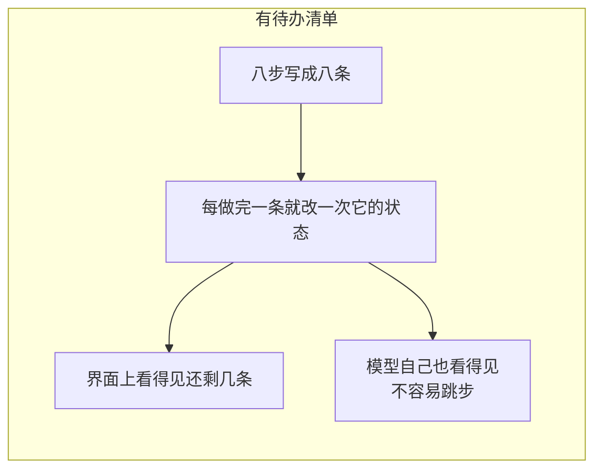
```mermaid
flowchart LR
    subgraph Y2["有待办清单"]
        D1["八步写成八条"] --> D2["每做完一条就改一次它的状态"]
        D2 --> D3["界面上看得见还剩几条"]
        D2 --> D4["模型自己也看得见<br/>不容易跳步"]
    end
```

### 两件事各改各的，互不读也互不写

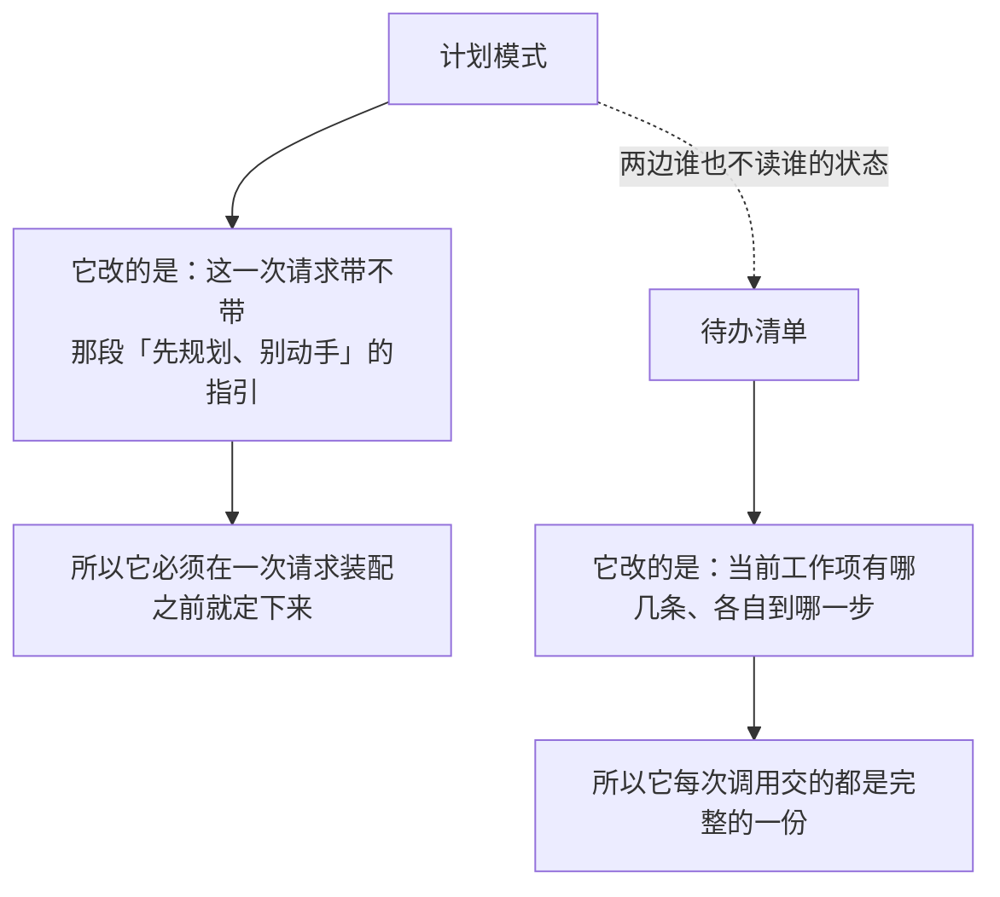
```mermaid
flowchart TD
    P["计划模式"] --> P1["它改的是：这一次请求带不带<br/>那段「先规划、别动手」的指引"]
    P1 --> P2["所以它必须在一次请求装配之前就定下来"]
    T["待办清单"] --> T1["它改的是：当前工作项有哪几条、各自到哪一步"]
    T1 --> T2["所以它每次调用交的都是完整的一份"]
    P -.->|"两边谁也不读谁的状态"| T
```

两者共有的一条纪律：**当下生效的那个状态只从会话日志折出来，内存里不留第二份。**重启、分叉、另开一个页面、一次冷读，读到的都是同一件事。

---

## 架构

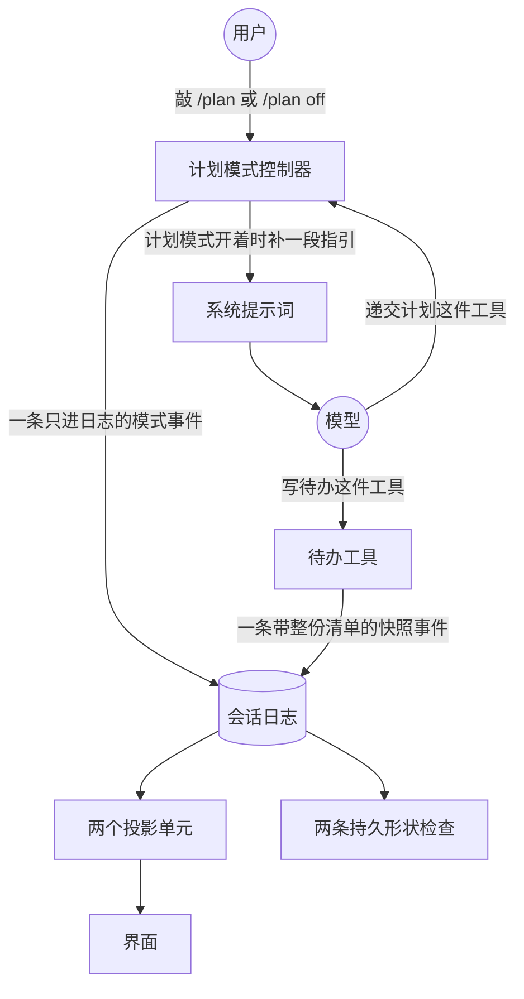
```mermaid
flowchart TD
    U(("用户")) -->|"敲 /plan 或 /plan off"| CTL["计划模式控制器"]
    M(("模型")) -->|"递交计划这件工具"| CTL
    M -->|"写待办这件工具"| TODO["待办工具"]
    CTL -->|"一条只进日志的模式事件"| LOG[("会话日志")]
    TODO -->|"一条带整份清单的快照事件"| LOG
    LOG --> PROJ["两个投影单元"]
    PROJ --> UI["界面"]
    LOG --> INV["两条持久形状检查"]
    CTL -->|"计划模式开着时补一段指引"| PROMPT["系统提示词"]
    PROMPT --> M
```

### 计划模式一次装五条胳膊，三必两选

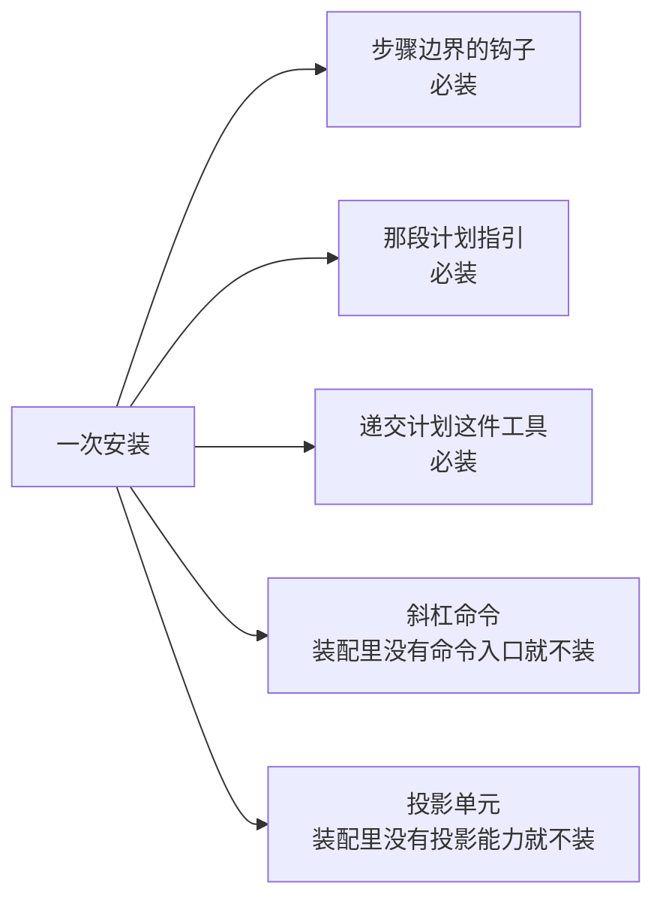
```mermaid
flowchart LR
    INS["一次安装"] --> A1["步骤边界的钩子<br/>必装"]
    INS --> A2["那段计划指引<br/>必装"]
    INS --> A3["递交计划这件工具<br/>必装"]
    INS --> A4["斜杠命令<br/>装配里没有命令入口就不装"]
    INS --> A5["投影单元<br/>装配里没有投影能力就不装"]
```

### 半装上去比装不上更坏

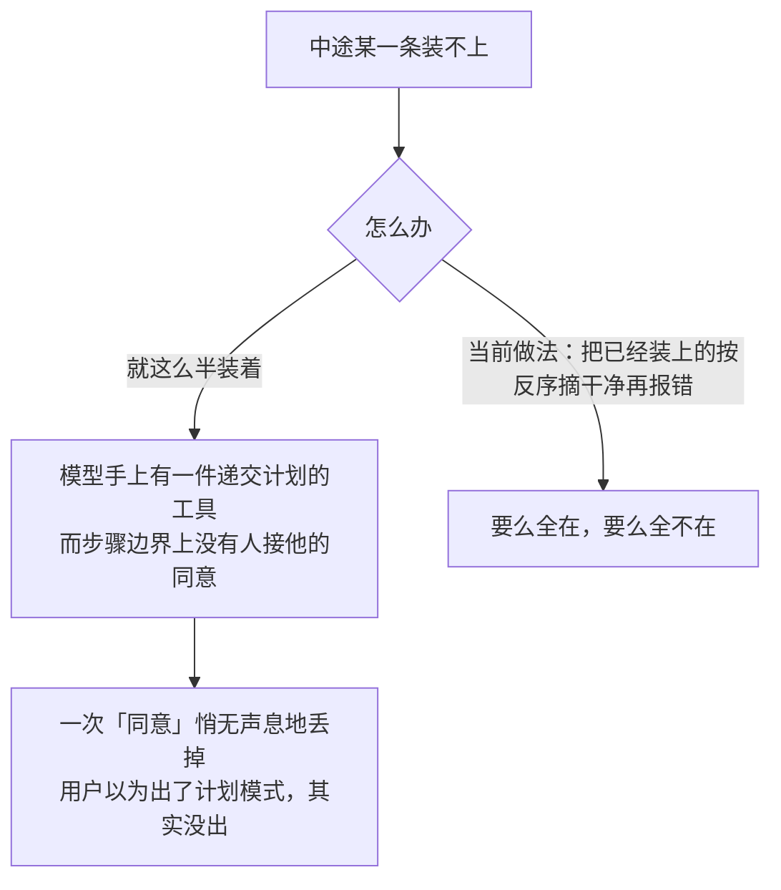
```mermaid
flowchart TD
    A["中途某一条装不上"] --> B{"怎么办"}
    B -->|"就这么半装着"| C["模型手上有一件递交计划的工具<br/>而步骤边界上没有人接他的同意"]
    C --> D["一次「同意」悄无声息地丢掉<br/>用户以为出了计划模式，其实没出"]
    B -->|"当前做法：把已经装上的按反序摘干净再报错"| E["要么全在，要么全不在"]
```

待办那边同理，只是它的三条胳膊是三个各自独立的函数：工具本身是必须的，投影和形状检查装不装由装配方定——**本包既不代劳，也不因为它们缺席而报错**。

---

## 计划模式：一次翻转为什么要等到下一步

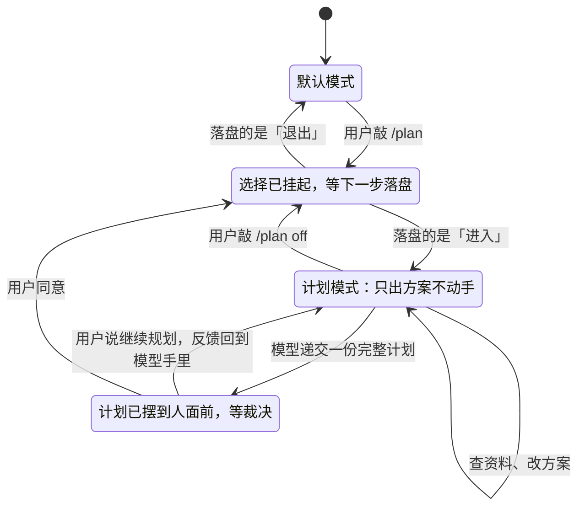
```mermaid
stateDiagram-v2
    state "默认模式" as S0
    state "计划模式：只出方案不动手" as S1
    state "计划已摆到人面前，等裁决" as S2
    state "选择已挂起，等下一步落盘" as S3
    [*] --> S0
    S0 --> S3: 用户敲 /plan
    S1 --> S1: 查资料、改方案
    S1 --> S2: 模型递交一份完整计划
    S2 --> S1: 用户说继续规划，反馈回到模型手里
    S2 --> S3: 用户同意
    S1 --> S3: 用户敲 /plan off
    S3 --> S1: 落盘的是「进入」
    S3 --> S0: 落盘的是「退出」
```

那个「已挂起」的中间态是整段设计的重心。为什么不能当场翻：

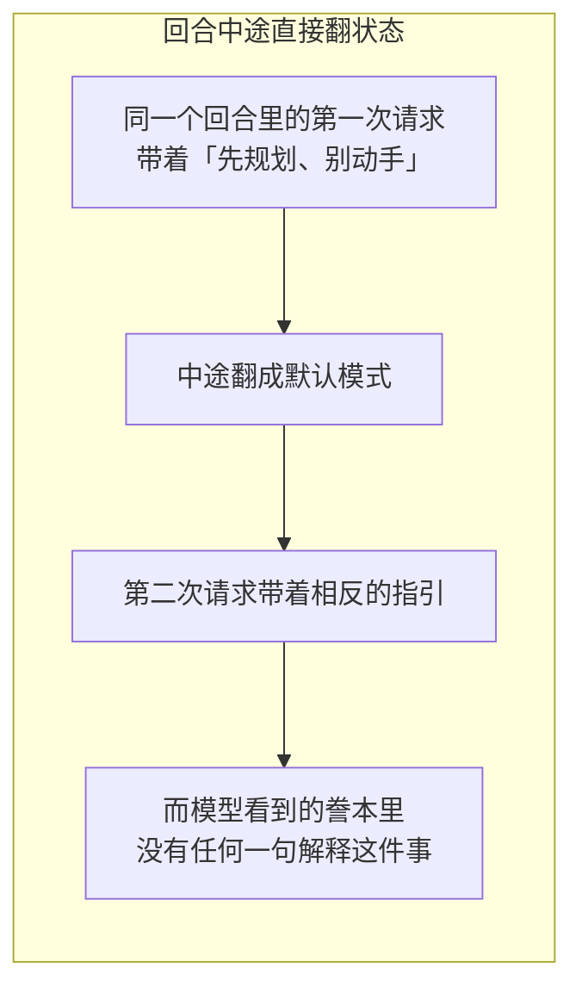
```mermaid
flowchart LR
    subgraph BAD["回合中途直接翻状态"]
        A1["同一个回合里的第一次请求<br/>带着「先规划、别动手」"] --> A2["中途翻成默认模式"]
        A2 --> A3["第二次请求带着相反的指引"]
        A3 --> A4["而模型看到的誊本里<br/>没有任何一句解释这件事"]
    end
```

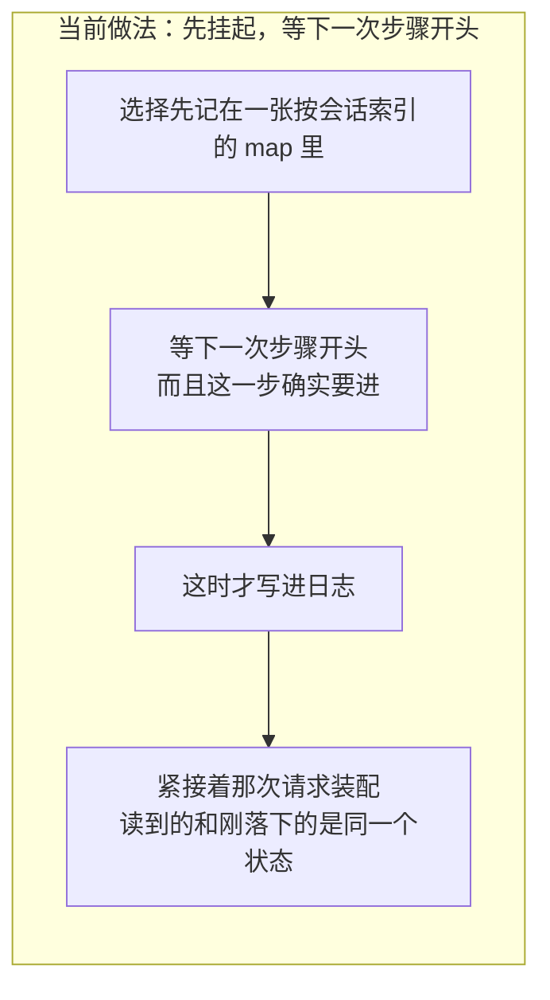
```mermaid
flowchart LR
    subgraph GOOD["当前做法：先挂起，等下一次步骤开头"]
        B1["选择先记在一张按会话索引的 map 里"] --> B2["等下一次步骤开头<br/>而且这一步确实要进"]
        B2 --> B3["这时才写进日志"]
        B3 --> B4["紧接着那次请求装配<br/>读到的和刚落下的是同一个状态"]
    end
```

### 回合之间那一下则立刻落盘

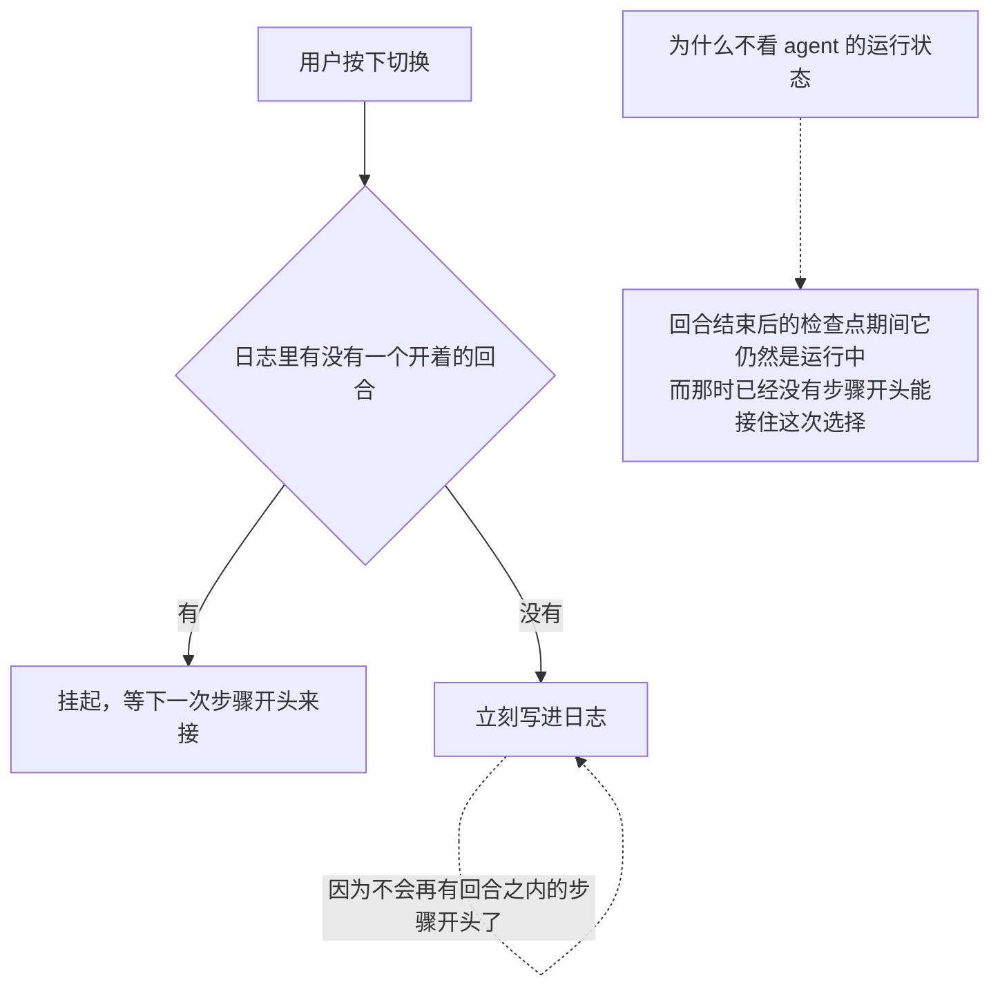
```mermaid
flowchart TD
    A["用户按下切换"] --> B{"日志里有没有一个开着的回合"}
    B -->|"有"| C["挂起，等下一次步骤开头来接"]
    B -->|"没有"| D["立刻写进日志"]
    D -.->|"因为不会再有回合之内的步骤开头了"| D
    E["为什么不看 agent 的运行状态"] -.-> F["回合结束后的检查点期间它仍然是运行中<br/>而那时已经没有步骤开头能接住这次选择"]
```

### 进出计划模式，工具清单纹丝不动

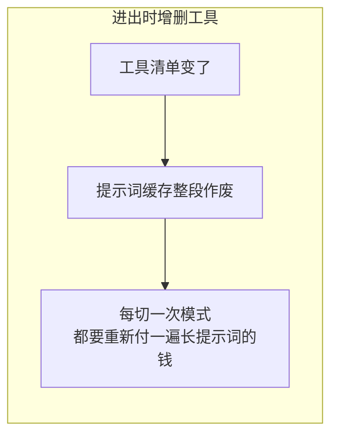
```mermaid
flowchart LR
    subgraph BAD2["进出时增删工具"]
        A1["工具清单变了"] --> A2["提示词缓存整段作废"]
        A2 --> A3["每切一次模式<br/>都要重新付一遍长提示词的钱"]
    end
```

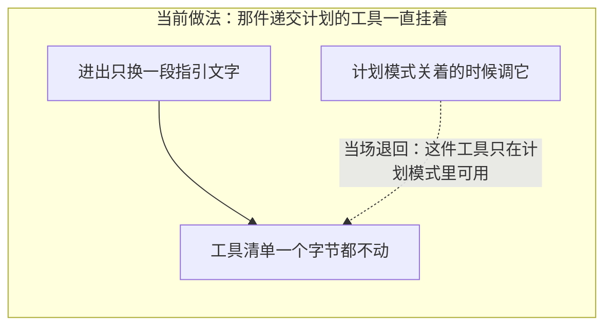
```mermaid
flowchart LR
    subgraph GOOD2["当前做法：那件递交计划的工具一直挂着"]
        B1["进出只换一段指引文字"] --> B2["工具清单一个字节都不动"]
        B3["计划模式关着的时候调它"] -.->|"当场退回：这件工具只在计划模式里可用"| B2
    end
```

同一条纪律还管着「有没有人能接评审」这件事：它是**调用那一刻**才去问的，不是注册那一刻。注册时就问，就意味着装配里没有提问通道时工具清单会少一件，而那正是这里要避免的。

### 递交计划：五道门，一道都不合并

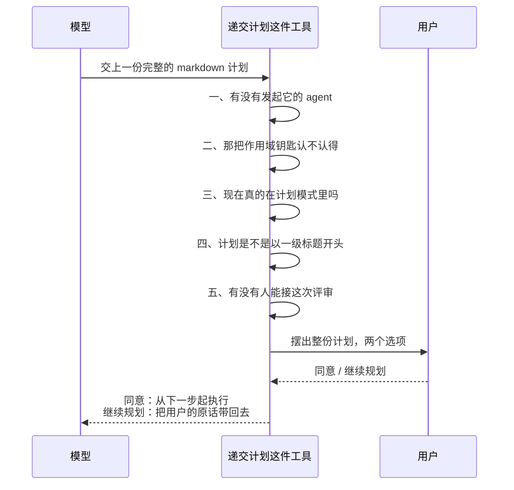
```mermaid
sequenceDiagram
    participant M as 模型
    participant T as 递交计划这件工具
    participant U as 用户
    M->>T: 交上一份完整的 markdown 计划
    T->>T: 一、有没有发起它的 agent
    T->>T: 二、那把作用域钥匙认不认得
    T->>T: 三、现在真的在计划模式里吗
    T->>T: 四、计划是不是以一级标题开头
    T->>T: 五、有没有人能接这次评审
    T->>U: 摆出整份计划，两个选项
    U-->>T: 同意 / 继续规划
    T-->>M: 同意：从下一步起执行<br/>继续规划：把用户的原话带回去
```

五道门各报各的话，因为**报出去的那句话是模型下一步唯一的依据**：「不在计划模式里」它该停手，「标题不对」它该改格式，「没人能评审」它该请用户自己切模式——合成一句「不行」，模型只能瞎猜。

### 「同意」的定义故意很窄

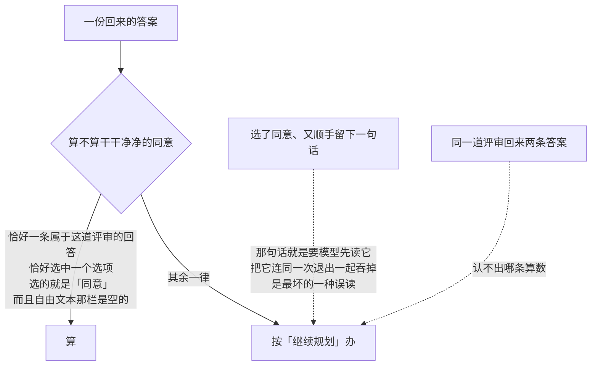
```mermaid
flowchart TD
    A["一份回来的答案"] --> B{"算不算干干净净的同意"}
    B -->|"恰好一条属于这道评审的回答<br/>恰好选中一个选项<br/>选的就是「同意」<br/>而且自由文本那栏是空的"| C["算"]
    B -->|"其余一律"| D["按「继续规划」办"]
    E["选了同意、又顺手留下一句话"] -.->|"那句话就是要模型先读它<br/>把它连同一次退出一起吞掉<br/>是最坏的一种误读"| D
    F["同一道评审回来两条答案"] -.->|"认不出哪条算数"| D
```

### 同意之后也不当场落盘

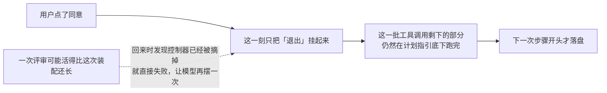
```mermaid
flowchart LR
    A["用户点了同意"] --> B["这一刻只把「退出」挂起来"]
    B --> C["这一批工具调用剩下的部分<br/>仍然在计划指引底下跑完"]
    C --> D["下一次步骤开头才落盘"]
    E["一次评审可能活得比这次装配还长"] -.->|"回来时发现控制器已经被摘掉<br/>就直接失败，让模型再摆一次"| B
```

### 四种结局，四句不同的回话

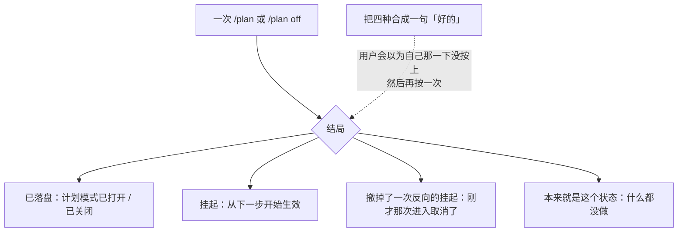
```mermaid
flowchart TD
    A["一次 /plan 或 /plan off"] --> B{"结局"}
    B --> C["已落盘：计划模式已打开 / 已关闭"]
    B --> D["挂起：从下一步开始生效"]
    B --> E["撤掉了一次反向的挂起：刚才那次进入取消了"]
    B --> F["本来就是这个状态：什么都没做"]
    G["把四种合成一句「好的」"] -.->|"用户会以为自己那一下没按上<br/>然后再按一次"| B
```

### 「有一次切换在路上」是纯回放出来的

```mermaid
flowchart LR
    A["命令开始那条事件<br/>记下用户选的方向"] --> B["它那条配对的完成事件<br/>只留下成功的那些选择"]
    B --> C["模式事件记下它已经生效<br/>并把这条挂起清掉"]
    C --> D["于是宿主重启、另开一个页面、一次冷读<br/>都能只凭日志还原出「有一次切换还没生效」"]
```

界面上那个「正在切换」的提示因此不依赖任何活着的镜像——它和已生效的状态是同一份日志折出来的。

---

## 待办清单：每次交完整的一份

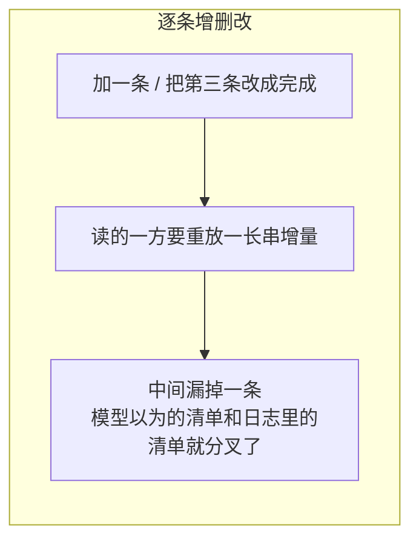
```mermaid
flowchart LR
    subgraph BAD3["逐条增删改"]
        A1["加一条 / 把第三条改成完成"] --> A2["读的一方要重放一长串增量"]
        A2 --> A3["中间漏掉一条<br/>模型以为的清单和日志里的清单就分叉了"]
    end
```

```mermaid
flowchart LR
    subgraph GOOD3["当前做法：每次交完整的一份"]
        B1["一条事件 = 一份完整的当下清单"] --> B2["折叠就是「最后写的那份算数」"]
        B2 --> B3["界面、检查点、冷读<br/>三方读到的必然是同一份"]
        B4["一次被拒的调用"] -.->|"校验全在写之前，日志上不留痕迹"| B2
    end
```

### 一次调用的走向

```mermaid
flowchart TD
    A["模型交上一份清单"] --> B["注册表那道门：字段齐不齐、状态认不认得<br/>条目里多一个键当场拒"]
    B --> C["这一层再查三条门那边说不出来的"]
    C --> C1["条目去掉首尾空白之后不能是空的"]
    C --> C2["条目之间不能重样"]
    C --> C3["不允许并行时，最多一条在做"]
    C1 --> D{"全过了吗"}
    C2 --> D
    C3 --> D
    D -->|"没过"| E["当场退回<br/>日志上什么都没发生"]
    D -->|"过了"| F["写进日志<br/>并回一句「三种状态各几条」"]
    B -.->|"为什么多一个键就要拒<br/>落进日志的那份必须和模型以为自己写下的那份一模一样"| B
```

### 折叠只有三条规矩

```mermaid
flowchart TD
    A["从日志折出「现在的清单」"] --> B["遇到一条写入：整份换成它"]
    A --> C["遇到一个新回合开始：清空"]
    A --> D["遇到一个回合结束：不动"]
    C -.->|"上一个回合的计划<br/>不该挂在这一个回合头上"| C
    D -.->|"一个回合刚做完时<br/>那份做完的清单正是最该被看见的"| D
```

### 当下的策略不写进持久规则

```mermaid
flowchart TD
    A["允不允许同时有好几条在做"] --> B["它改两样东西"]
    B --> B1["给模型看的那段说明怎么写"]
    B --> B2["一次标了好几条的调用收不收"]
    A --> C{"要不要把它也写进持久形状检查"}
    C -->|"写进去"| D["一份在允许并行时写下的日志<br/>会因为今天收紧策略而变得不合法"]
    D -.->|"等于让一段历史<br/>因为今天的一个选择而作废"| D
    C -->|"当前做法：形状检查对「有几条在做」一个字不说"| E["昨天的日志永远回放得了"]
```

配置漏填只会更严不会更松：布尔的零值就是「最多一条在做」这条更紧的纪律。

---

## 生命周期与并发

```mermaid
flowchart TD
    A["两个包都只有显式的安装函数<br/>每个都交回一个摘除函数"] --> B["装配方决定装哪几条<br/>本包不替它决定"]
    C["持久状态只有一处：会话日志"] --> D["内存里只留一样<br/>那次还没落盘的模式选择"]
    E["同一个 agent 的追加由 agent 循环串成一条线"] --> F["从外面并发调进来的<br/>仍然要自己接住追加失败"]
    G["不装投影，事件照样能回放"] --> H["投影只是给界面看的一个便利<br/>不是事实来源"]
```

### 两条线会同时碰到同一份状态

```mermaid
flowchart TD
    A["一次评审在工具执行那条协程上等着"] --> C{"这中间控制器被摘掉了"}
    B["而摘除发生在装配方自己那条协程上"] --> C
    C --> D["所以「有没有被摘掉」那面旗必须是原子的"]
    E["挂起的那张 map 由一把互斥锁护着"] --> F["步骤开头那一侧的读写<br/>和命令那一侧的读写不在同一条线上"]
```

### 一处 Go 特有的收尾

```mermaid
flowchart LR
    A["DSH 把挂起的选择<br/>挂在以会话对象为键的弱引用结构上"] --> B["会话被回收时那一条跟着没了"]
    C["Go 没有弱引用"] --> D["换成一张按会话标识索引的 map<br/>必须有人来删"]
    D --> E["所以多出一个「这个会话散掉了」的通知口"]
    E -.->|"不叫它的后果只是留下一条永远读不到的记录<br/>会话标识不复用，所以它不会被误当成别人的"| E
```

---

## 失败语义

```mermaid
flowchart TD
    A["出了岔子"] --> B{"哪一类"}
    B -->|"模式事件里那个开关不是布尔<br/>待办快照不是数组、条目重样、状态不认识"| C["在写进日志之前就拒掉<br/>四种坏法各报各的，不挤成一句「读不回来」"]
    B -->|"用户选了「继续规划」"| D["回一个说清楚的结果<br/>不伪装成一次工具执行故障"]
    B -->|"用户把评审撤掉、改成自己说话"| E["单独一句：停在计划模式里等他开口"]
    B -->|"翻转没能写进日志"| F["当前模式原样不动<br/>那次选择留着，下一次步骤开头再试"]
    B -->|"步骤开头那次追加失败"| G["记一条警告并放行<br/>指引没跟上不该让 agent 停摆"]
    B -->|"折叠时读到一条读不回来的负载"| H["保持前一个状态<br/>不把「坏了一条」放大成「状态莫名变了」"]
    E -.->|"必须单独说，因为通用那句话里<br/>点的是另一件工具的名字，而模型从没调过它"| E
```

---

## 能力边界

```mermaid
flowchart TD
    Y["这两个包做的"] --> Y1["把「现在是不是先规划后执行」<br/>记成一条能回放的事实"]
    Y --> Y2["把一份计划摆到人面前，接住他的裁决"]
    Y --> Y3["把模型当下的工作项记成一份完整快照"]
    N["不做的"] --> N1["不是沙箱，也不是审批策略<br/>那两样各自独立地施加限制，和这里互不读写"]
    N --> N2["不写那段计划指引的正文<br/>正文归部署方，本包一个字都不替它写"]
    N --> N3["不评价计划写得好不好<br/>也不评判待办条目写得对不对"]
    N --> N4["待办不做调度<br/>没有依赖图、没有截止时间、没有提醒"]
    N --> N5["不跨会话同步<br/>一份清单是这个会话自己的事"]
    N --> N6["不自己找 agent<br/>从一把作用域钥匙到一个 agent 的路，由装配方交进来"]
```

第一条要多说一句：**计划模式是一条软引导，不是一道闸。**模型在计划模式里仍然调得动写文件的工具——真正拦住它的是沙箱和审批策略。把这里当成安全边界是一种误用。

## 对应的 DSH 能力

下表由 [`docs/packages.md`](../packages.md) 与 [能力覆盖表](../portmap/capability-coverage.tsv) 机器 join 得到：本篇覆盖的 Go 包，承接的是上游 DSH 的哪几条能力，以及各自还缺什么。落点列由源码里的 `// 源:` 注释反查，不是手写的。

| 上游能力 | DSH 包 | 裁决 | 落在哪个 Go 包 | 这里缺什么 |
|---|---|---|---|---|
| 软引导的plan协作状态，提供/plan命令、/plan off命令和经用户评审的exit_plan_mode退出方式 | `plan/plan-mode` | 需要 | `feature/plan/planmode` | — |
| 面向模型的todo_write工具，agent的完整任务列表每次调用整体替换 | `todo/tool-todo` | 需要 | `feature/todo` | — |

## 相关源码

- `feature/plan/planmode/`
- `todo/`
