# Agent 预设与 Persona

`feature/preset/agentpresets` 和 `feature/preset/persona` 的架构文档。全文只用代码里真实存在的名字：`Preset`、`Root`、`Trust`、`Config`、`Roster`、`Composer`、`Mount`、`ComposeFrom`、`Recompose`、`standingMount`。

---

## 定位

一个 Agent 能用哪些工具、系统提示词里写着它是谁——这两件事得有人定。最省事的做法是写死在代码里，改一个字就得重新编译发版。

`agentpresets` 换成另一种做法：**把「装哪些工具 + 是什么人设」写成磁盘上的一个目录**，建 Agent 时点一个目录名。

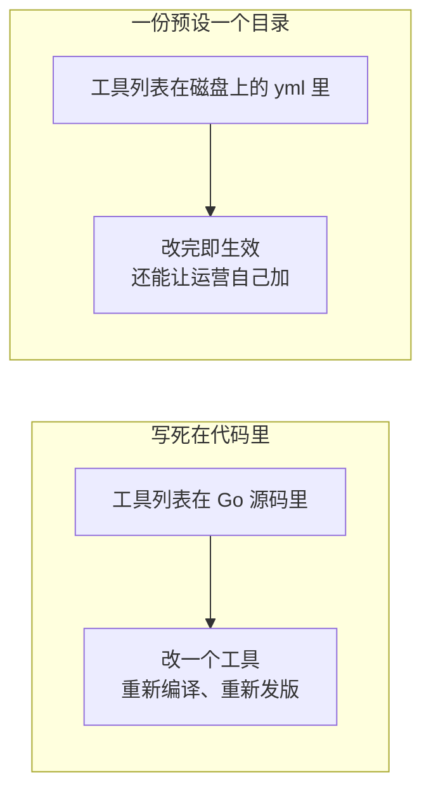

DSH 那边自带四份：`standard`（完整编码 Agent）、`minimal`（只有 bash 和文件编辑）、`ptc`（工具通过 TypeScript SDK 暴露）、`cordis`（用来造新预设的那份）。**Go 这边一份都没搬**——那四份全是编码 Agent 的工具，只搬机制不搬内容。

### 一份预设在磁盘上是什么

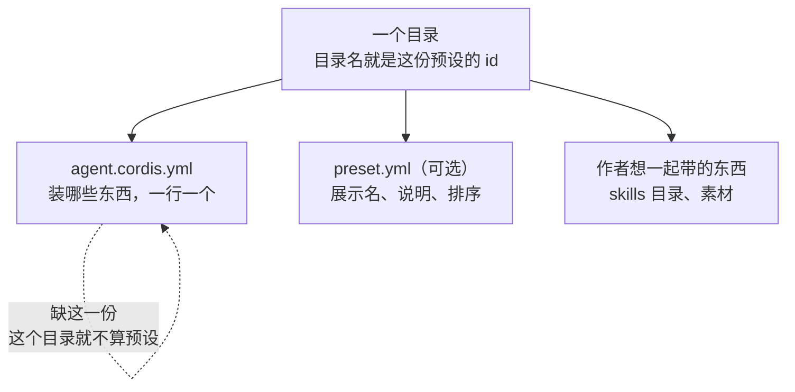

两个文件名是常量：`discovery.CompositionFile = "agent.cordis.yml"`、`metadata.MetadataFile = "preset.yml"`。

`agent.cordis.yml` 的每一行长这样：

```yaml
- id: persona
  name: '@deepseek-ai/dsh-persona'
  config:
    text: You are a helpful software engineer assistant.
    complete: true
```

`id` 是这一行在这份组合里的名字，`name` 点的是哪个能力，`config` 是给它的参数。

---

## 架构

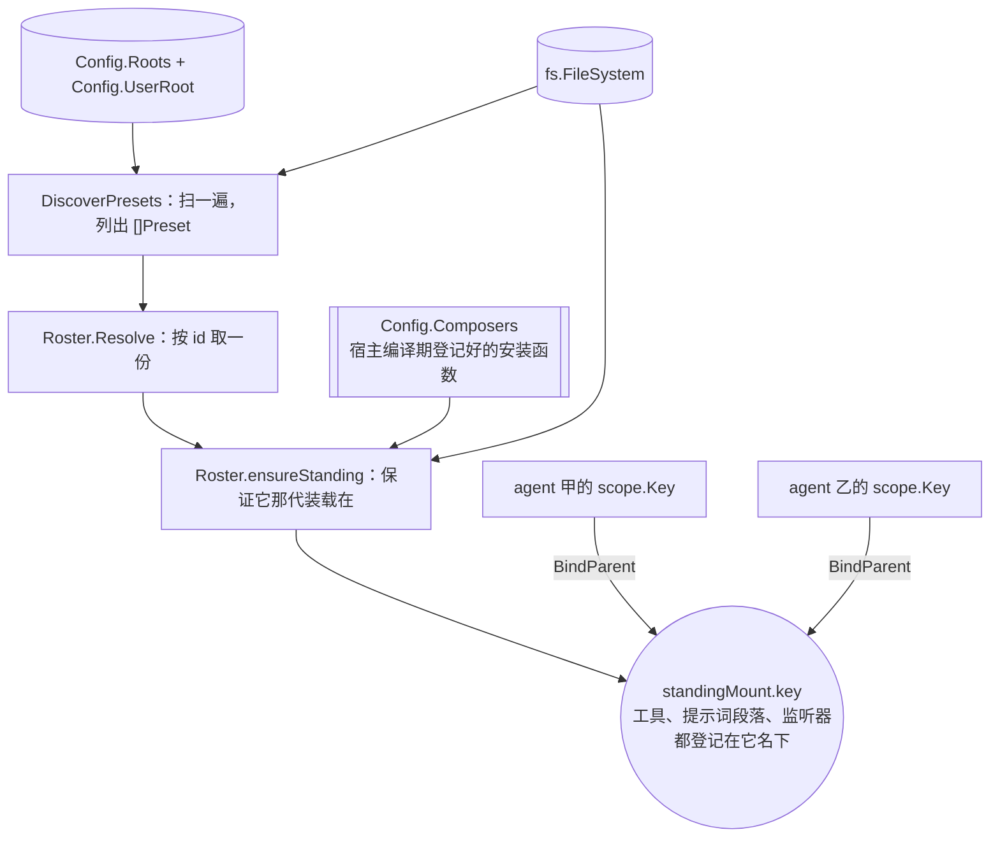

### `Preset`：扫出来的一份

```go
type Preset struct {
    ID          string   // 目录名
    Trust       Trust    // 由它所在的 Root 决定，不由它自己声明
    Path        string   // 它那份 agent.cordis.yml 的绝对路径
    Name        string   // preset.yml 里的展示名，空串回落到 ID
    Description string
    Order       *float64 // nil = 没声明，排在声明了的后面
    Broken      string   // 非空 = 这份装不起来，这句话说为什么
}
```

`Order` 用指针是因为 `0` 是一个有意义的位次，Go 的零值分不出「没声明」和「声明了 0」。

`Trust` 只有两个值：`TrustSystem`、`TrustUser`。**它不写在预设自己身上**——一份本地创作的预设要是能自称是随部署发出去的，跟着就免疫删除。

`Broken` 非空的预设**留在名单上**：藏起来的话那个目录仍旧占着 id，而界面上看不到任何可删的东西。判 `Broken` 只做一次**浅**检查——yml 读不读得动、是不是一份行列表、每一行有没有 `name`。它刻意做得比装载器少，抓的是那种让装载器连开始都开始不了的手改。

### `Root`：预设住在哪几个目录

```go
type Root struct {
    Path  string // 绝对目录，里面一个子目录一份预设
    Trust Trust  // 这个根下发现的每一份预设继承的信任
}
```

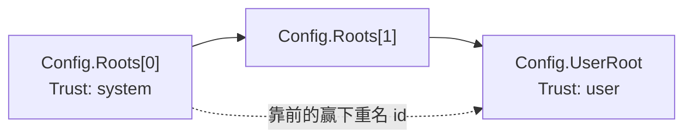

顺序就是优先级：`Config.resolvedRoots()` 把 `Roots` 按序排好，`UserRoot` **追加在最后**。所以一个占了同名的本地目录会被发出去的那一份遮蔽。

`Roster.roots` 构造时算一次、之后不再变：一组根如果在 `List()` 和照着它答案走的 `Copy()` 之间变了，创作就会写进一个调用方从没见过的目录。

### `Roster`：这个包的主体

```go
type Roster struct {
    config       Config
    fsys         fs.FileSystem                     // 内容读写只透过这一个接口
    roots        []Root                            // 构造时算一次
    defaults     DefaultSource                     // 用户设置层，可为 nil
    standingRoot *scope.Scope                      // 所有 standingMount 挂在它下面

    mutex    sync.Mutex
    mounts   map[string]*standingMount             // 按预设 id
    loading  map[string]*loadingMount              // 正在装的那些
    bindings map[*scope.Key]*scope.ParentBinding   // 组装过的 agent
}
```

`bindings` 那一张最值得看：`scope.ParentBinding` 是 `scope` 包里**唯一**的改链权力，攥在这里就让 `Roster` 成为整个进程里唯一能把一个 Agent 从一份预设挪到另一份的东西。

发现是**不记忆的**——`List` 和 `Resolve` 每次都重扫根，不缓存名单：

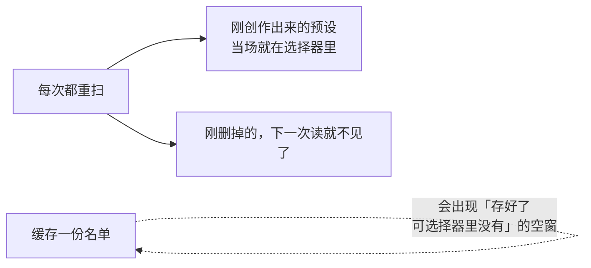

### `Mount`：从一个目录到一个能开口的 Agent

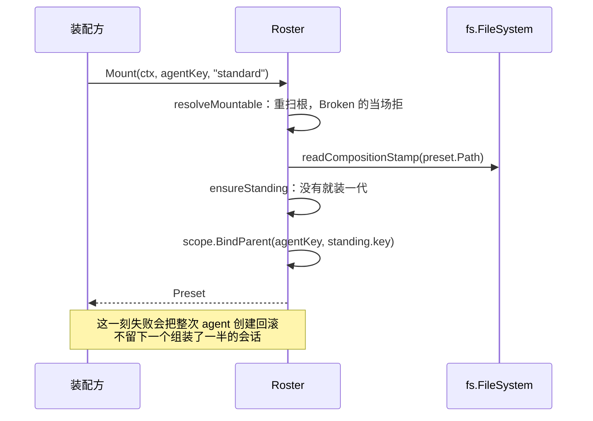

最后那一步是全部的关键：**Agent 的 `scope.Key` 认预设的 `scope.Key` 作父**。

预设装起来的工具、提示词段落、监听器全都登记在预设那把 `Key` 名下（也就是 `scope.Layers` 里那一层）；Agent 装配时沿 `parent` 往上走，就把这一层叠进了自己能看见的范围。

> **「层」是什么**：`scope.Layers` 里，一个 `Key` 名下的那批登记就是一层。预设的 `Key` 名下挂了五个工具，那五个就是预设这一层。Agent 能用的 = 自己这一层 + 所有祖先的层 + `global` 那一层。

### `ComposeFrom` 与 `Recompose`：另外两条认父的路

| 方法 | 干什么 | 会失败吗 |
|---|---|---|
| `Mount` | 按 id 装一份预设，把 agent 认上去 | 会：id 不认识、组合装不起来 |
| `ComposeFrom` | 认到**另一个 agent 正跑着的那一份**上 | 不会：不读 `Roster`、不装东西、不碰文件 |
| `Recompose` | 把一个 agent 改认到另一份预设上 | 会：同 `Mount` |

子 Agent 就是靠 `ComposeFrom` 继承父的能力：

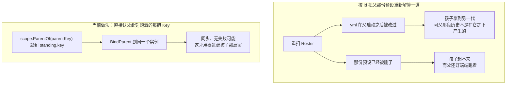

父要是一份预设都没认，`ComposeFrom` 返回空串、不报错——那里模型看得见的东西本来就在 `global` 层里，孩子够得着。

`Recompose` 是**先保证新的在，再挪链**：

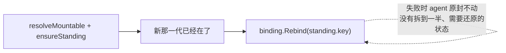

只在这个 Agent **什么都还没产出**时合法：对话中途换掉工具，会留下一批新组合根本做不出来的、已经记进日志的工具调用。那道检查归**调用方**——`Recompose` 不读会话历史。

### `Composer`：Go 没有运行时装载别人的代码

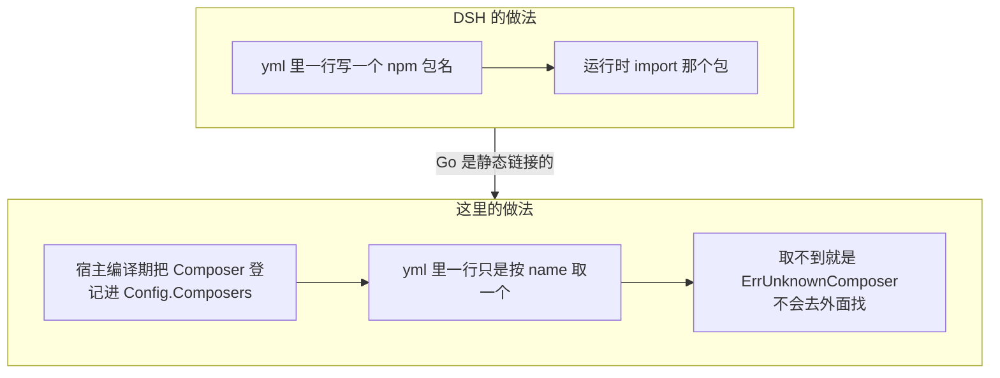

```go
type Composer func(ctx context.Context, owner *scope.Scope, config json.RawMessage) (func(context.Context) error, error)
type ComposerSet map[string]Composer
```

装载器整个换掉了，但**看得见的规矩一条没变**：一份预设一份装载、点它的共享；任何一行装不起来整份回滚一行不留；加入靠 `BindParent`、改嫁靠 `Rebind`。

`Config.Composers` 留 nil 表示这套部署装不了任何一行——`Roster` 照样发现、照样读写，但每一次 `Mount` 都会失败。

### `fs.FileSystem`：本包不知道内容住在哪儿

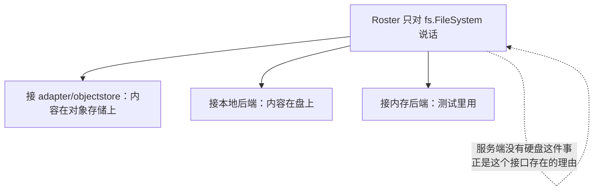

这个接口上有一条**只能由装配方守**的规矩：

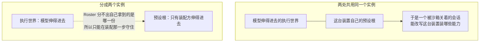

### `Copy` 与 `Remove`：创作只有整目录复制这一种写

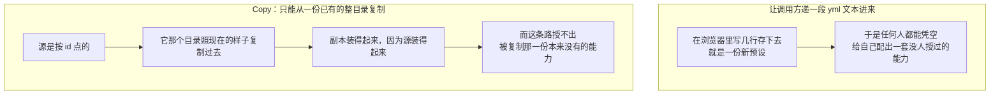

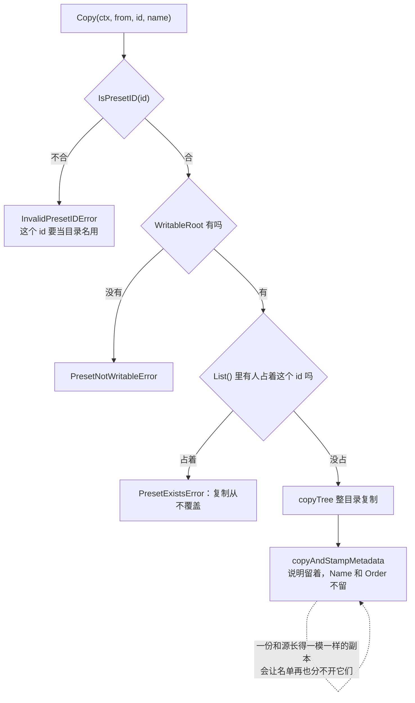

`Copy` 检查的是**任何一个根**供得出的 id——包括发出去的那些，因为一个和发出去的预设同名的用户目录会被它遮蔽。复制到一半砸了，刚建的那棵目录整个删掉，**且不带调用方的取消**：请求废了也得把写下去的收回来。

`Remove` 删掉的正好是当前默认时，要把用户那一层的默认清掉：

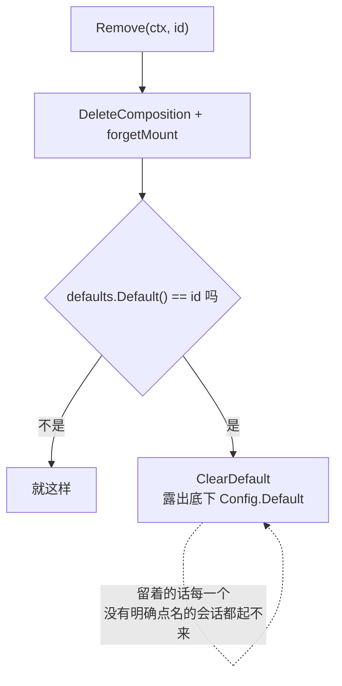

平时为什么允许存一个**还不存在**的默认：`Roster` 扫的是一批活目录，此刻不在的名字等会话来要时可能已经在了。而刚被这次调用删掉的那个不是这种情况。

删掉正被使用的那一份**不拒**：`forgetMount` 只把它从 `mounts` 里摘掉、**不释放**——已经认进去的 Agent 还跑在上面，它由 `Close` 回收。只有新建的会话在名单里看不到它了。

### `persona`：换一行身份

`agentpresets` 换得掉工具，却够不着「你是谁」那一段系统提示词——那个槽位是 `harness/systemprompt` 注册表**自己**的配置，一份预设伸不进去。`persona` 就是补这一条的。

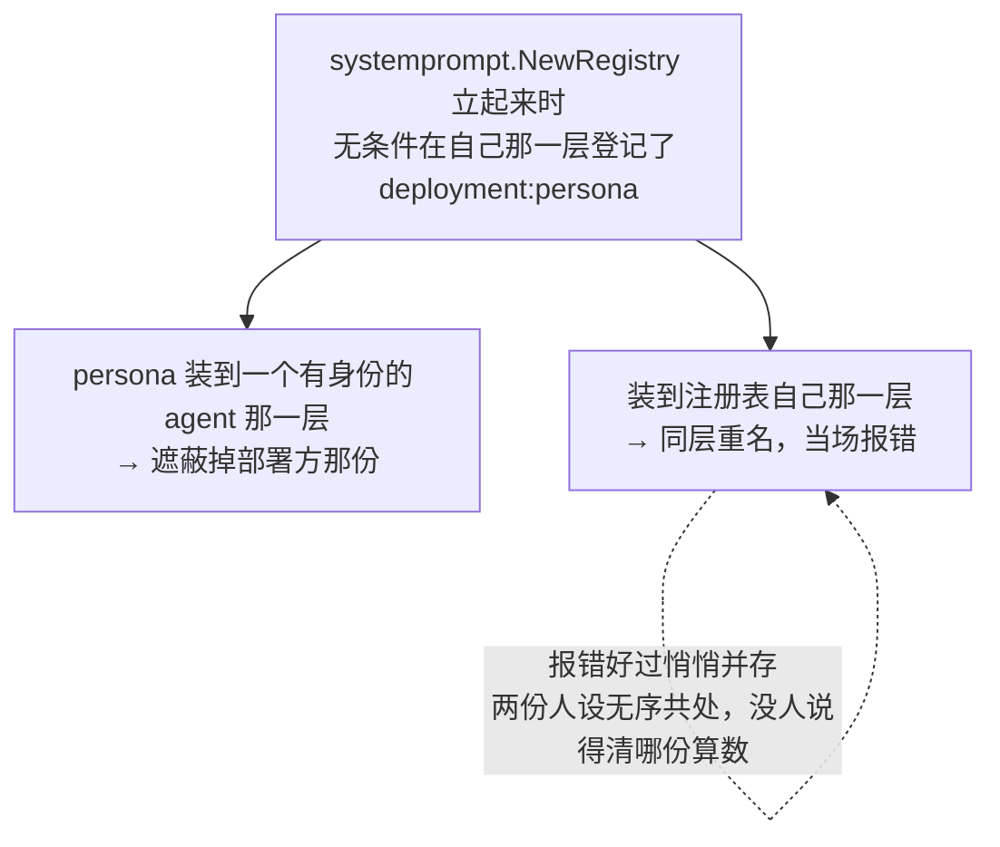

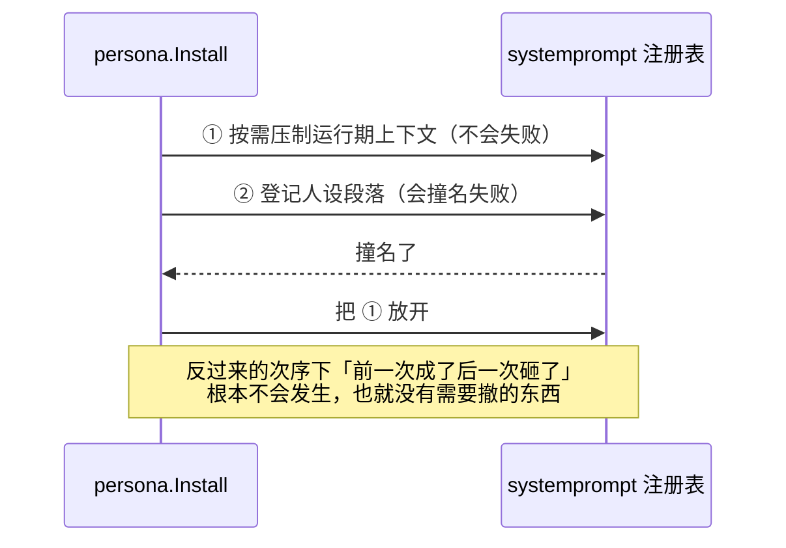

放开那一步自己再砸了，两条错**一起**交出去——吞掉后一条，会让「压制还生效着、却再没人撤得掉」这件事从诊断里整个消失。

`Config.SuppressRuntimeContext` 是取反过的（DSH 是 `includeRuntimeContext?: boolean` 默认 true），这样 Go 的零值就是「照常带上运行期上下文」。

### 一条不变式：组装了 `Roster` 就不许有没认预设的 Agent 开口

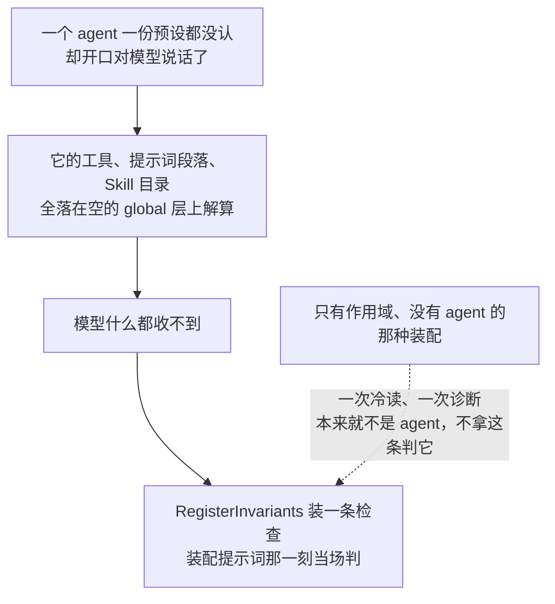

`invariant.go` 里的 `AssemblingAgent` 就是那个「这次装配到底是不是一个 agent」的判定，由装配方交进来。

---

## 生命周期与并发

### 一份预设只装一次：`standingMount`

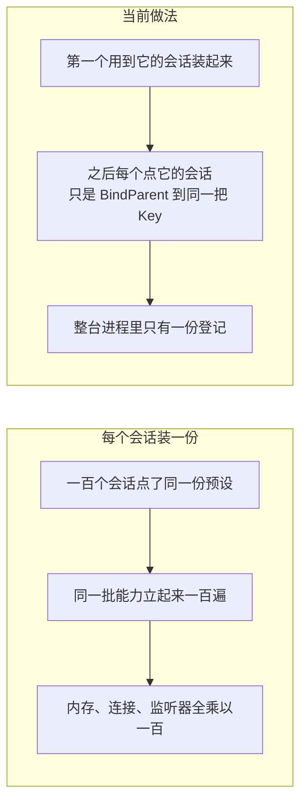

```go
type standingMount struct {
    key     *scope.Key                    // agent 认作父的那把
    scope   *scope.Scope                  // 释放边界，只在 Close 时回收
    dispose func(context.Context) error   // 这份组合的摘除函数
    stamp   string                        // 装它时那份 yml 的版本戳
}
```

`scope` 字段**绝不按会话释放**——一百个会话共用它，谁走都不能拆。它由 `Roster.Close` 在整棵树拆解时统一回收，摘除按装的**反序**跑，和一次失败装载的回滚同序。

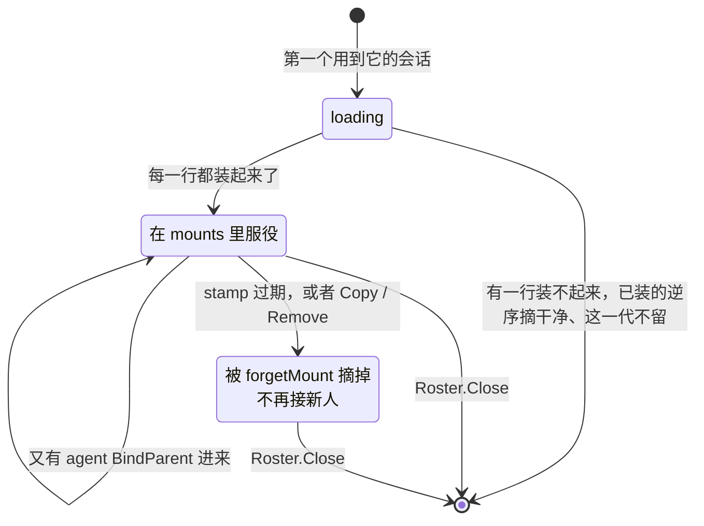

### 两个会话同时要同一份

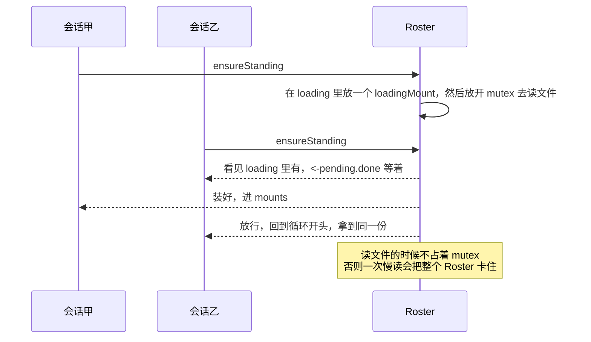

装失败的那一代**不留**（`err != nil` 时不写进 `mounts`），于是文件被修好之后下一个会话会重试。

### `stamp`：什么时候开下一代

```mermaid
flowchart TD
    A["ensureStanding 命中 mounts"] --> B["readCompositionStamp 读一次当前戳"]
    B --> C{"读得出来吗"}
    C -->|"读不出来"| D["继续用当前这一代"]
    D -.->|"一份装载必须熬得过它那个文件消失<br/>为一次 stat 让会话起不来说不过去"| D
    C -->|"读得出来"| E{"和 mounted.stamp 一样吗"}
    E -->|"一样"| F["用当前这一代"]
    E -->|"不一样"| G["带守卫地从 mounts 里删掉，循环重来"]
    G --> H["已经认进去的会话<br/>留在它们跑着的那一代上"]
```

那道守卫（`if r.mounts[preset.ID] == mounted`）是必需的：一个和这里抢的调用方可能已经开出了下一代，把**那个**指针丢掉会分出第三代来。

`stamp` 是 `fs.Info.Version` 给的一枚**不必读得懂的令牌**：对象存储给它自己那套版本标记，本地介质给它自己那套。这里只做一件事——和上一次比一比。两次都答不出身份（都是空串）时不换代：为一份看不出变没变过的组合每次都开一代，等于把单飞整个作废。

盖戳必须在读文件**之前**：

```mermaid
flowchart LR
    subgraph BADS["先读内容再盖戳"]
        A1["读到一半有人改了它"] --> A2["盖上去的是改后的戳"] --> A3["装进去的却是改前的内容<br/>而且从此一直显得当前"]
    end
    subgraph GOODS["先盖戳再读（composeStanding 的做法）"]
        B1["一次和装载抢跑的编辑"] --> B2["让戳显得过期"] --> B3["下一个会话去换代"]
    end
```

### 并发上的几条

```mermaid
flowchart TD
    A["一把 mutex 护住 mounts / loading / bindings"] --> B["读文件、跑 Composer 一律在锁外"]
    C["standingMount.scope 绝不按会话释放"] --> D["只由 Roster.Close 回收"]
    E["扫根的顺序、[]Preset 的排序都是显式定死的"] --> F["否则同样的一批目录<br/>会排出不同顺序的选择器"]
    G["Recompose：新那一代先保证在，再 Rebind"] --> H["失败时这个 agent 原封不动"]
```

---

## 失败语义

| 错误 | 什么时候 | 谁该动手 |
|---|---|---|
| `UnknownPresetError` | 点了个 `Roster` 里没有的 id，附带此刻有哪些 | **调用方**打错了 |
| `PresetMountError` | 预设在，但它那份组合装不起来 | **部署方**要去修 |
| `InvalidPresetIDError` | `Copy` 的新 id 不合 `^[a-z0-9][a-z0-9-]*$` | 调用方 |
| `PresetNotWritableError` | 这套部署没有 `TrustUser` 的根 | 装配方 |
| `PresetExistsError` | 这个 id 已经被某个根占了 | 调用方 |
| `ErrUnknownComposer` | yml 里一行点了个 `Composers` 里没有的 name | 部署方 |
| `ErrInvalidConfig` | `New` 时配置本身不成立 | 装配方 |

前两类为什么必须分开：一个不认识的 id 是**调用方**打错了，一份用不了的组合是**部署方**要去修的东西——合成一句「不行」，两边都不知道该谁动手。

两处刻意降级、不报错：

- `preset.yml` 读不出来，名单上回落到显示目录名，组合照样装得起来。反过来做的话，一个写错的展示名会变成一个起不来的 Agent。
- `stamp` 读不出来，继续服役、不换代。

`persona.Install` 那次登记撞名时，会把已经生效的压制放开；放开本身再失败，两条错一起交出去。

---

## 能力边界

```mermaid
flowchart TD
    Y["这两个包做的"] --> Y1["把一批目录扫成一份 []Preset<br/>并当场判它们健康不健康"]
    Y --> Y2["一份预设装一次，点它的 agent 共享"]
    Y --> Y3["yml 变了就为之后的会话开下一代"]
    Y --> Y4["记住一个会话实际跑在哪一份上"]
    Y --> Y5["给一个 agent 换一段人设"]
```

```mermaid
flowchart TD
    N["不做的"] --> N1["不下载、不编译、不动态执行任意代码<br/>一行只能取一个编译期登记好的 Composer"]
    N --> N2["不决定预设住在哪儿<br/>根路径和 fs.FileSystem 都由装配方给"]
    N --> N3["不替调用方写 yml<br/>创作只有 Copy 这一种写法"]
    N --> N4["不给 agent 授权<br/>加入只是 BindParent，看得见什么由 scope 的分层规矩定"]
    N --> N5["不判「现在换预设合不合适」<br/>Recompose 不读会话历史"]
    N --> N6["persona 只影响系统提示词<br/>不授予工具，也不授予任何外部权限"]
```

---

## 谁在用它

**目前没有非测试调用方。** `Roster` 能力完整、测过，但仓库里没有装配点组装它，第一个接入方 `aiboys-go` 也没有 import。

原因是它只有一种 Agent 形态、用户也不选。哪天要做「用户自己配团队」，这条路是现成的：人设放磁盘上，改完即生效，不用重新编译。

---

## 对应的 DSH 能力

下表由 [`docs/packages.md`](../packages.md) 与 [能力覆盖表](../portmap/capability-coverage.tsv) 机器 join 得到：本篇覆盖的 Go 包，承接的是 DSH 的哪几条能力，以及各自还缺什么。落点列由源码里的 `// 源:` 注释反查，不是手写的。

| DSH 能力 | DSH 包 | 裁决 | 落在哪个 Go 包 | 这里缺什么 |
|---|---|---|---|---|
| 按preset组装agent，工具和提示词仅存在一份供所有已加入agent使用 | `preset/agent-presets` | 需要 | `feature/preset/agentpresets` | — |
| 可组装的agent人设，可遮蔽部署级人设或成为完整系统提示词 | `preset/persona` | 需要 | `feature/preset/persona` | — |

## 相关源码

| 路径 | 内容 |
|---|---|
| `feature/preset/agentpresets/preset.go` | `Preset`、`Root`、`Trust`、`Config`、两个错误类型 |
| `feature/preset/agentpresets/roster.go` | `Roster`、`Mount`、`ComposeFrom`、`Recompose`、`ensureStanding` |
| `feature/preset/agentpresets/discovery.go` | `ScanRoot`、`DiscoverPresets`、`Broken` 那道浅检查 |
| `feature/preset/agentpresets/mount.go` | `Composer`、`ComposerSet`、`mountComposition`、`readCompositionStamp` |
| `feature/preset/agentpresets/authoring.go` | `CopyComposition`、`DeleteComposition`、`WritableRoot` |
| `feature/preset/agentpresets/session.go` | 会话日志里记「这次选了哪一份」 |
| `feature/preset/agentpresets/invariant.go` | `RegisterInvariants`、`AssemblingAgent` |
| `feature/preset/persona/persona.go` | `Config`、`Install` |

---

## 深入阅读

[scope](scope.md) · [systemprompt](systemprompt.md) · [Agent](agent.md) · [子 Agent](subagent.md)
