# Agent 预设与 Persona

对应包：`feature/preset/agentpresets`、`feature/preset/persona`

## 定位

一套装置里装着几十种能力：读写文件、跑命令、查网页、管计划、开子 agent。但**不是每个会话都该看到全部**——给客服用的那一套不该有 shell，给运维用的那一套不该能对外发帖。

于是需要一个东西来回答：这一次会话，模型手上到底有哪几件工具、系统提示词里写着它是谁。

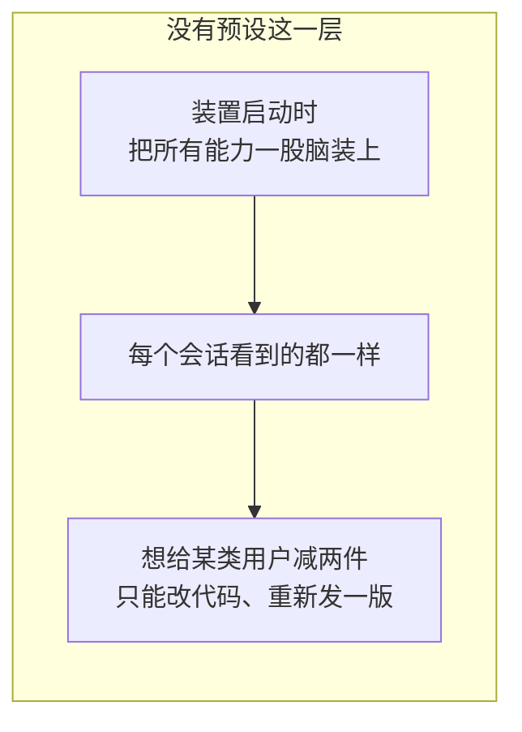

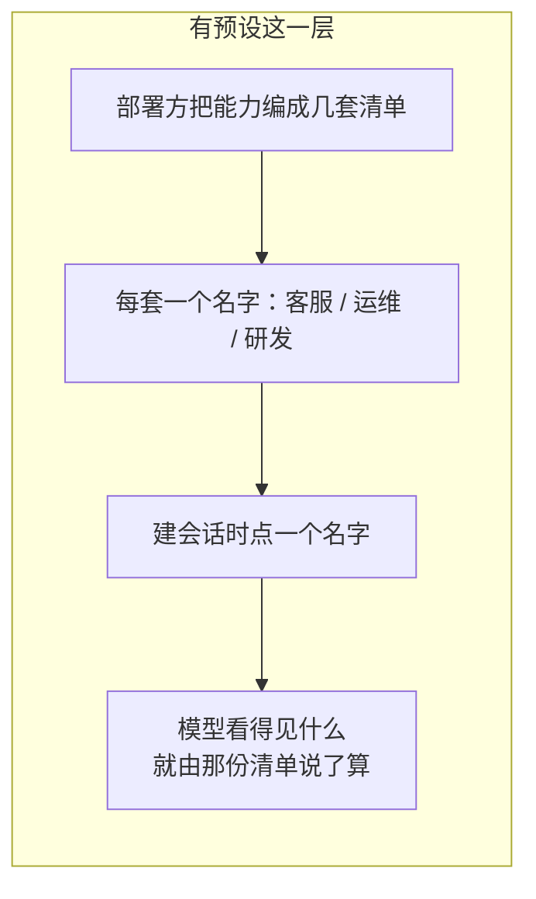

一份预设不是一个配置项，是**磁盘上（或者对象存储上）的一个目录**：

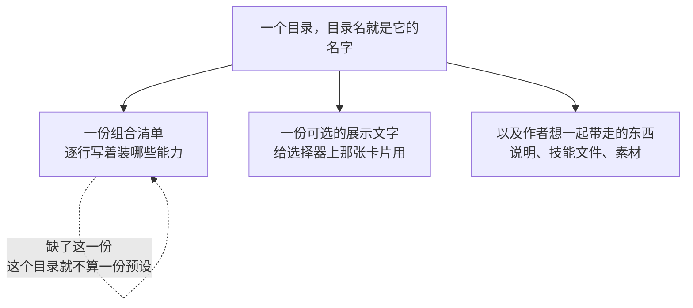

而 persona 补的是预设**够不着**的那一样：


---

## 架构

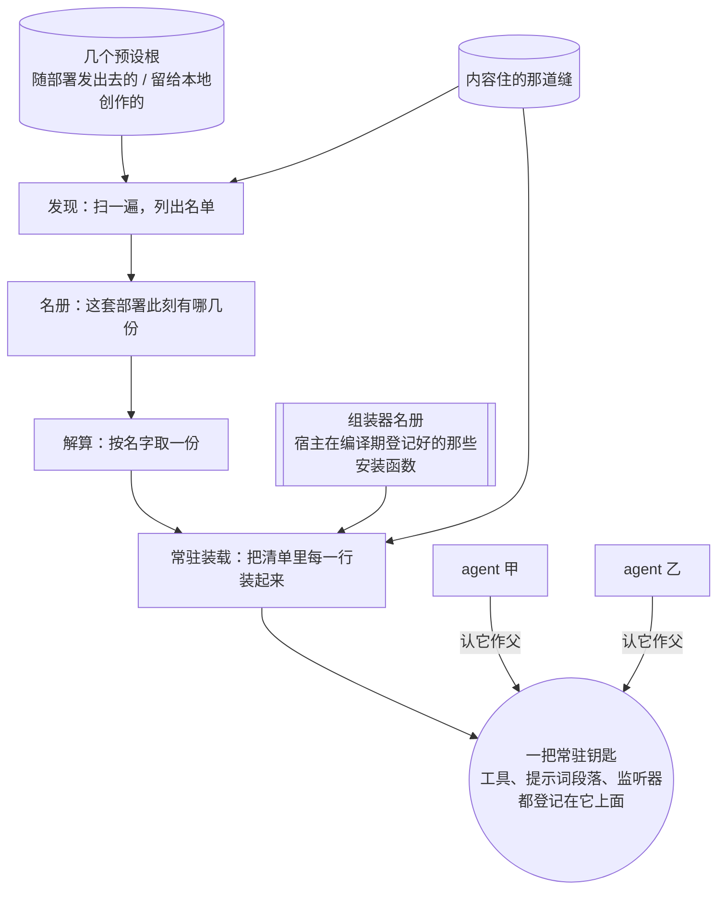

### 一份预设只装一次

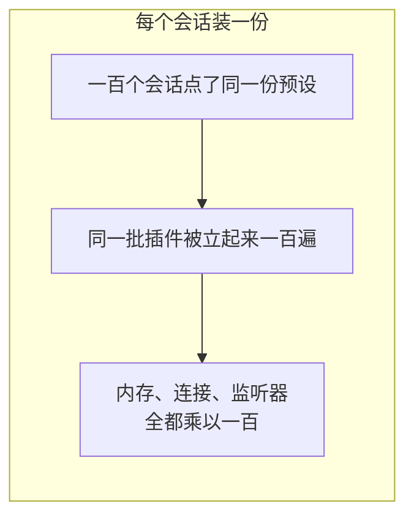

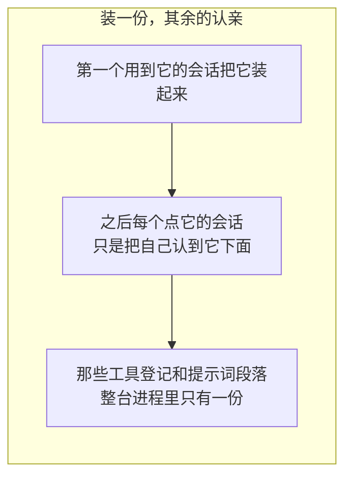

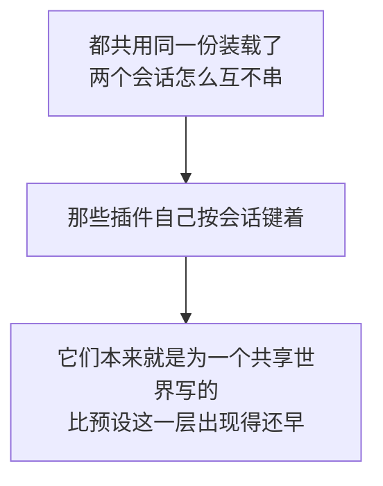

### 静态组装：换掉的那一半

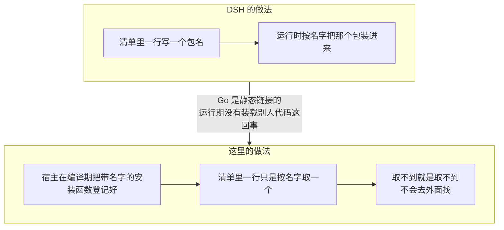

装载器整个换掉了，但**看得见的规矩一条没变**：

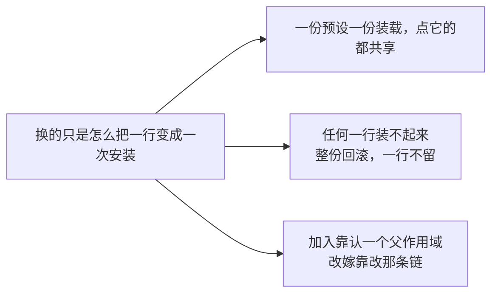

### 内容住在哪儿，本包一概不知

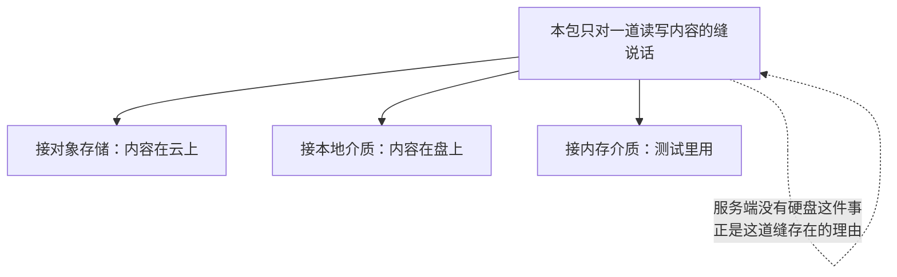

这道缝上有一条**只能由装配方守**的规矩：

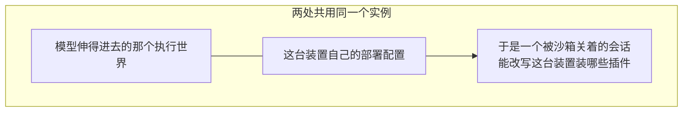

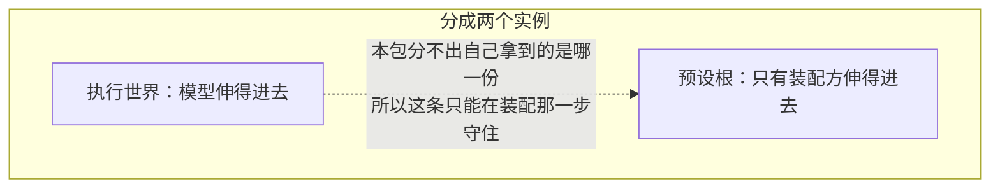

### 根的顺序就是优先级，根的信任就是预设的信任

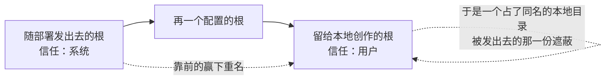

信任不写在预设自己身上，是因为它自己说了不算：目录名决定它叫什么，所在的根决定它是谁发的——不然一份本地创作的预设可以自称是随部署发出去的，跟着就免疫删除。

### 组装了名册，就不许有没认预设的 agent 开口

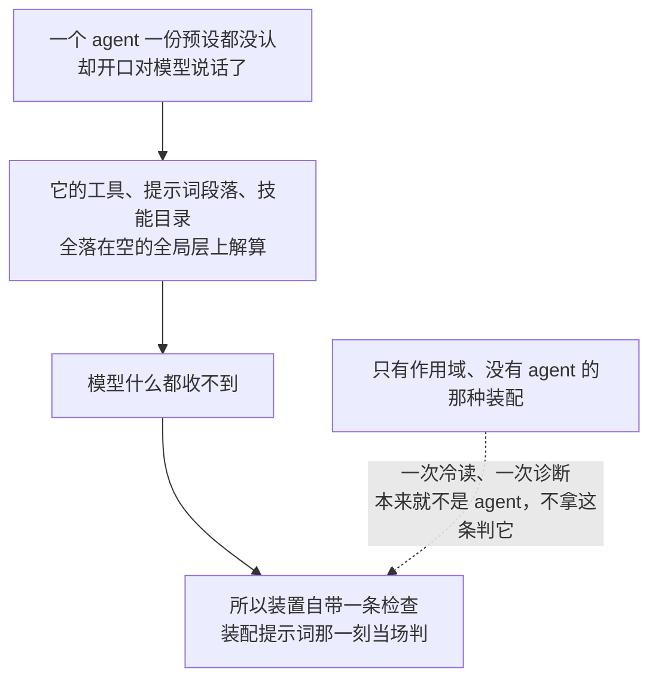

---

## 从一个目录到一个开得了口的 agent

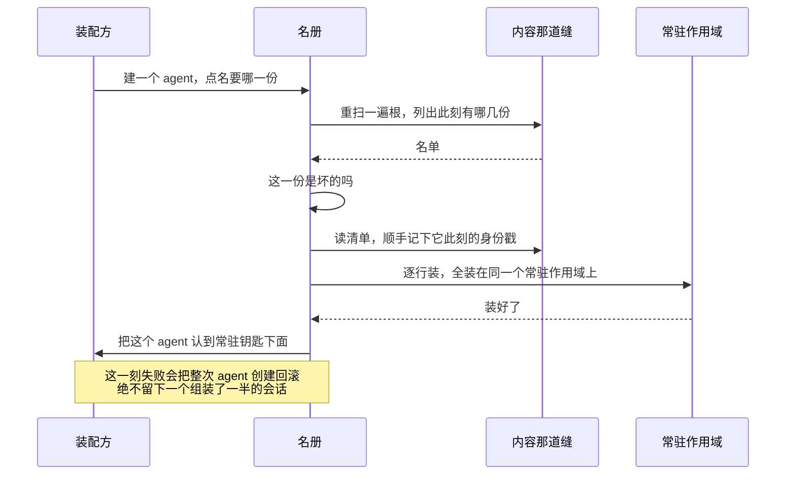

### 坏掉的预设留在名单上，但装不了

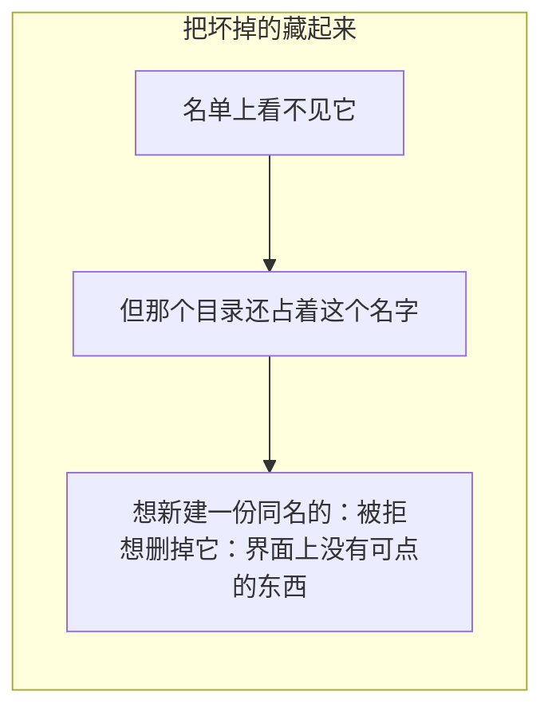

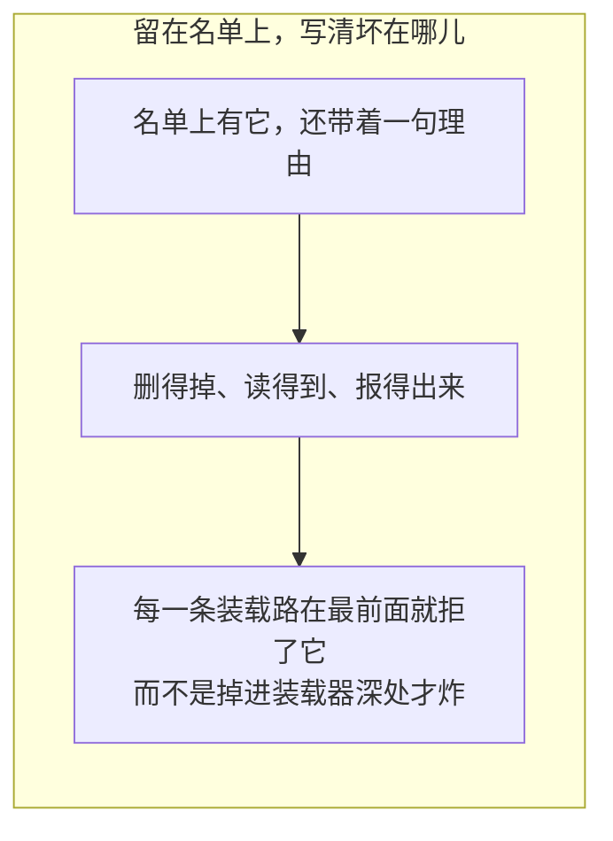

判健康只做一次**浅**检查：那份清单读不读得动、是不是一份行列表、每一行有没有点名字。它刻意做得比装载器少——不解算名字、不套用配置——抓的是那种让装载器连开始都开始不了的手改。

### 展示文字坏了绝不致命

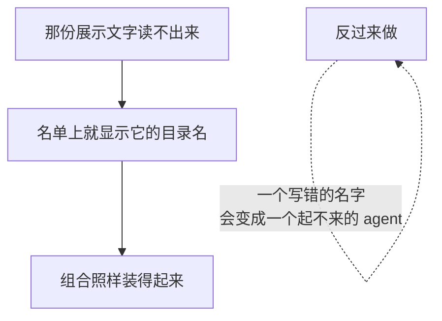

展示不是能力，所以它不进那条判健康的路。

### 子 agent 靠认亲继承父的能力

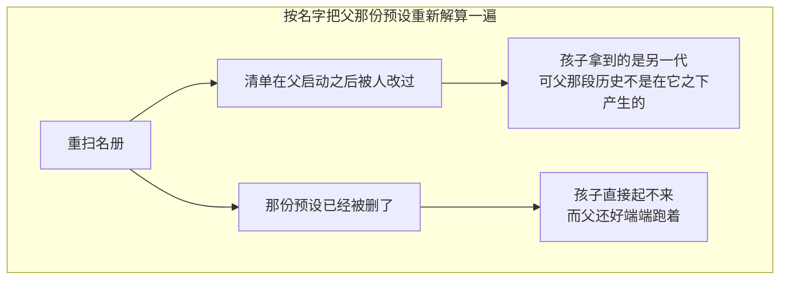

```mermaid
flowchart LR
    subgraph GOODC["认亲：直接认父此刻跑着的那一份"]
        B1["不读名册、不装东西、不碰内容"] --> B2["拿到的正是同一个实例"]
        B2 --> B3["于是它同步、而且自己没有失败的可能<br/>这才用得进建孩子那扇窗"]
    end
```

父要是一份预设都没认（一套不组装名册的部署），既不认亲也不报错——那里模型看得见的东西本来就在宿主组合里，孩子透过全局层已经够得着。

### 一个会话实际跑在哪一份上

```mermaid
flowchart TD
    A["一个还空着的会话可以换预设"] --> B{"之后重建时读什么"}
    B -->|"只读创建时记的那一栏"| C["按它建出来时那份组合重建"]
    C -.->|"可它那段历史<br/>根本不是在那份组合之下产生的"| C
    B -->|"当前做法：从后往前扫日志<br/>最后一次选择算数"| D["按它真正跑过的那一份重建"]
```

```mermaid
flowchart LR
    A["为什么这次更改必须落账"] --> B["预设决定模型看得见的工具和提示词段落"]
    B --> C["而这套装置的规矩是<br/>模型看得见的，都要记进日志"]
    D["这条记录只进日志"] -.->|"不上模型可见的表面<br/>也不进派生历史"| D
```

### 手上没有 agent 也解算得出来

```mermaid
flowchart LR
    A["翻一段历史转写稿"] --> B["要拿会话记下的那份预设<br/>解算工具当时怎么呈现"]
    B --> C["保证那份常驻装载在，就够了"]
    C --> D["没起 agent、没起会话、没跑任何一轮"]
```

---

## 本地创作：只有整目录复制这一种写

```mermaid
flowchart TD
    subgraph BADA["让调用方递一段组合文本进来"]
        A1["在浏览器里写几行<br/>存下去就是一份新预设"] --> A2["于是任何人都能凭空<br/>给自己配出一套没人授过的能力"]
    end
```

```mermaid
flowchart LR
    subgraph GOODA["只有从一份已有的整目录复制"]
        B1["源是按名字点的"] --> B2["它那个目录照它现在的样子复制过去"]
        B2 --> B3["副本装得起来，因为源装得起来"]
        B3 --> B4["而这条路授不出<br/>被复制的那一份本来没有的能力"]
    end
```

### 复制路上的几道闸

```mermaid
flowchart TD
    A["要建一份新的"] --> B{"名字合文法吗"}
    B -->|"不合"| X1["拒：名字要当目录名用<br/>别的形状能跑到根外面去"]
    B -->|"合"| C{"这套部署有可写的根吗"}
    C -->|"没有"| X2["拒：发出去的那一套属于部署"]
    C -->|"有"| D{"任何一个根上有人占着这个名字吗"}
    D -->|"占着"| X3["拒：复制从不覆盖"]
    D -->|"没占"| E["整目录复制过去，链接按它指的实体取"]
    E --> F["重写展示文字：说明留着<br/>名字和名册位次不留"]
    F -.->|"一份和源长得一模一样的副本<br/>会让名册再也分不开它们"| F
```

```mermaid
flowchart LR
    A["复制到一半砸了"] --> B["刚建的那棵目录整个删掉"]
    B --> C["撤销这一步不带调用方的取消<br/>请求废了也得把写下去的收回来"]
    D["不撤的话"] -.->|"轻则名单上看不见它<br/>重则一份装得起来却缺东西的预设"| D
```

### 删掉的那一份如果正是默认

```mermaid
flowchart TD
    A["删掉一份本地创作的预设"] --> B{"它正好是用户挑的那个默认吗"}
    B -->|"不是"| C["就这样"]
    B -->|"是"| D["把用户那一层的默认清掉<br/>露出底下部署自己的那个"]
    D -.->|"留着的话<br/>每一个没有明确点名的会话都起不来"| D
    E["平时为什么允许存一个还不存在的默认"] --> F["名册是一个活的目录<br/>此刻不在的名字，等会话来要时可能已经在了"]
```

### 删掉正被使用的那一份，不拒

```mermaid
flowchart LR
    A["一份预设正有活会话装着"] --> B["照样删得掉"]
    B --> C["那些会话留在它们已经装好的那一代上"]
    C --> D["只有新建的会话<br/>在名单里看不到它了"]
```

---

## Persona：换一行身份

```mermaid
flowchart TD
    R["提示词注册表立起来时<br/>无条件在自己这一层放了一份部署方的人设"] --> L1["这一行装到一个有身份的 agent 那一层<br/>→ 遮蔽掉部署方那份"]
    R --> L2["装到注册表自己那一层<br/>→ 同层重名，当场报错"]
    L2 -.->|"报错好过悄悄并存<br/>两份人设无序共处，没人说得清哪份算数"| L2
```

```mermaid
sequenceDiagram
    participant P as 这一行
    participant R as 提示词注册表
    P->>R: ① 先按需压制运行期上下文（这一步不会失败）
    P->>R: ② 再登记人设段落（这一步会撞名失败）
    R-->>P: 撞名了
    P->>R: 把 ① 放开
    Note over P,R: 反过来的次序下「前一次成了后一次砸了」<br/>根本不会发生，也就没有需要撤的东西
```

放开那一步自己再砸了，两条错一起交出去——吞掉后一条，会让「压制还生效着、却再没人撤得掉」这件事从诊断里整个消失。

```mermaid
flowchart LR
    A["这一行做的"] --> A1["往提示词注册表放一段身份正文"]
    A --> A2["两个开关：当成整份提示词 / 压掉运行期上下文"]
    B["不做的"] --> B1["不给工具、不给权限"]
    B --> B2["不负责渲染，也不负责插值"]
    B --> B3["不决定自己该装在哪一层"]
```

---

## 生命周期与并发

```mermaid
stateDiagram-v2
    state "装载中" as LOADING
    state "服役中" as SERVING
    state "退居：不再接新人" as RETIRED
    [*] --> LOADING: 第一个用到它的会话
    LOADING --> SERVING: 每一行都装起来了
    LOADING --> [*]: 有一行装不起来，已装的逆序摘干净
    SERVING --> SERVING: 又有 agent 认进来
    SERVING --> RETIRED: 清单的身份戳变了
    SERVING --> [*]: 整棵树拆解
    RETIRED --> [*]: 整棵树拆解
```

装失败的那一代**不留**，于是内容被修好之后，下一个会话会重试。

### 单飞：两个会话同时要同一份

```mermaid
sequenceDiagram
    participant A as 会话甲
    participant B as 会话乙
    participant R as 名册
    A->>R: 要这一份
    R->>R: 立一块「正在装」的牌子，然后去读内容
    B->>R: 也要这一份
    R-->>B: 看见牌子，排队等着
    R-->>A: 装好了
    R-->>B: 放行，拿到的是同一份
    Note over R: 读内容的时候不占着锁<br/>否则一次慢读会把整个名册卡住
```

### 换代看的是身份戳

```mermaid
flowchart TD
    A["有人要这一份"] --> B["读一次清单此刻的身份戳"]
    B --> C{"读得出来吗"}
    C -->|"读不出来"| D["继续用当前这一代"]
    D -.->|"一份装载必须熬得过它那个文件消失<br/>为一次探问让会话起不来说不过去"| D
    C -->|"读得出来"| E{"和这一代记着的那个一样吗"}
    E -->|"一样"| F["用当前这一代"]
    E -->|"不一样"| G["为之后建出来的会话开下一代"]
    G --> H["已经认进去的会话<br/>留在它们跑着的那一代上"]
```

```mermaid
flowchart LR
    subgraph BADS["先读内容再盖戳"]
        A1["读到一半有人改了它"] --> A2["盖上去的是改后的戳"] --> A3["装进去的却是改前的内容<br/>而且从此一直显得当前"]
    end
```

```mermaid
flowchart LR
    subgraph GOODS["先盖戳再读（当前做法）"]
        B1["一次和装载抢跑的编辑"] --> B2["让戳显得过期"] --> B3["下一个会话去换代<br/>而不是信任一份比戳还老的组合"]
    end
```

身份戳本身是一枚**不必读得懂的令牌**：对象存储给的是它自己那套版本标记，本地介质给的是它自己那套。这里拿它只做一件事——和上一次比一比。两次都答不出身份时不换代：为一份看不出变没变过的组合每次都开一代，等于把单飞整个作废。

### 发现不记忆

```mermaid
flowchart LR
    A["每次列举、每次解算<br/>都重扫一遍根"] --> B["进程跑着的时候<br/>刚创作出来的当场就在名单上"]
    A --> C["刚被删掉的，下一次读时就不见了"]
    D["缓存一份名单"] -.->|"会让创作流出现一段<br/>「存好了，可选择器里没有」的空窗"| D
```

### 并发上的几条

```mermaid
flowchart TD
    A["一把锁护住那两份按名字排的记录"] --> B["读内容、装东西一律在锁外"]
    C["常驻装载绝不按会话释放"] --> D["它由整棵树拆解时统一回收"]
    E["扫根的顺序、名单的排序都是显式定死的"] --> F["否则同样的一批目录<br/>会排出不同顺序的选择器"]
    G["改嫁：新那一代先保证在，再挪链"] --> H["于是失败时这个 agent 原封不动<br/>没有拆到一半、需要还原的状态"]
```

---

## 失败语义

```mermaid
flowchart TD
    A["出了岔子"] --> B{"哪一类"}
    B -->|"点了个名册里没有的名字"| C["报「不认识」，并把此刻有哪些一并交出去<br/>这是一次坏请求"]
    B -->|"预设在，可它的组合装不起来"| D["报「装不起来」，逐行列出哪一行为什么<br/>这是一份部署要去修的坏预设"]
    B -->|"名字不合文法 / 没有可写的根 / 名字被占了"| E["三种各报各的<br/>不合并成一句「不行」"]
    B -->|"展示文字读不出来"| F["降级：回落到显示目录名，照样装得起来"]
    B -->|"身份戳读不出来"| G["继续服役，不换代"]
    B -->|"装到一半有一行失败"| H["已装的逆序摘干净，这一代不留<br/>内容修好后下一个会话会重试"]
    B -->|"人设那次登记撞名"| I["报错，并把已经生效的压制放开"]
```

前两类为什么必须分开：一个不认识的名字是**调用方**打错了，一份用不了的组合是**部署方**要去修的东西——合成一句话，两边都不知道该谁动手。

---

## 能力边界

```mermaid
flowchart TD
    Y["这两个包做的"] --> Y1["把一批目录变成一份名单<br/>并当场判它们健康不健康"]
    Y --> Y2["一份预设装一次，让点它的 agent 共享"]
    Y --> Y3["记住一个会话实际跑在哪一份上"]
    Y --> Y4["给一个 agent 换一段身份"]
    N["不做的"] --> N1["不下载、不编译、不动态执行任意代码<br/>清单里一行只能取一个编译期登记好的安装函数"]
    N --> N2["不决定预设住在哪儿<br/>根路径和背后接哪个后端都由装配方给"]
    N --> N3["不替调用方写组合文本<br/>创作只有整目录复制这一种写法"]
    N --> N4["不给 agent 授权<br/>加入只是认一个父作用域<br/>看得见什么由作用域的分层规矩定"]
    N --> N5["不判「现在换预设合不合适」<br/>会话中途换掉工具会不会留下做不出来的历史，归调用方判"]
    N --> N6["人设只影响系统提示词<br/>不授予工具，也不授予任何外部权限"]
```

## 对应的 DSH 能力

下表由 [`docs/packages.md`](../packages.md) 与 [能力覆盖表](../portmap/capability-coverage.tsv) 机器 join 得到：本篇覆盖的 Go 包，承接的是上游 DSH 的哪几条能力，以及各自还缺什么。落点列由源码里的 `// 源:` 注释反查，不是手写的。

| 上游能力 | DSH 包 | 裁决 | 落在哪个 Go 包 | 这里缺什么 |
|---|---|---|---|---|
| 按preset组装agent，工具和提示词仅存在一份供所有已加入agent使用 | `preset/agent-presets` | 需要 | `feature/preset/agentpresets` | — |
| 可组装的agent人设，可遮蔽部署级人设或成为完整系统提示词 | `preset/persona` | 需要 | `feature/preset/persona` | — |

## 相关源码

- `feature/preset/agentpresets/`
- `feature/preset/persona/`
- `fs/`
- `scope/`
- `harness/systemprompt/`
