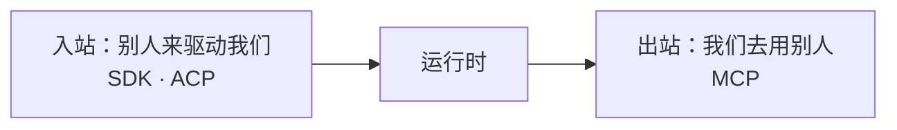
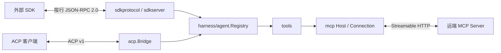
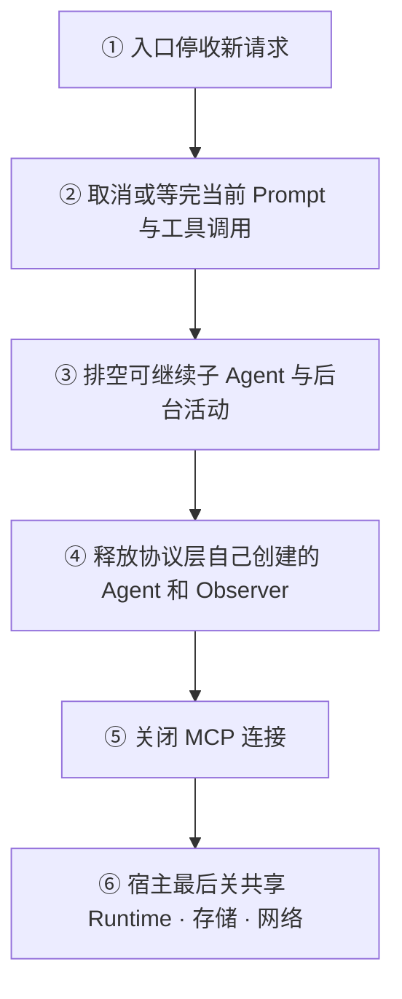
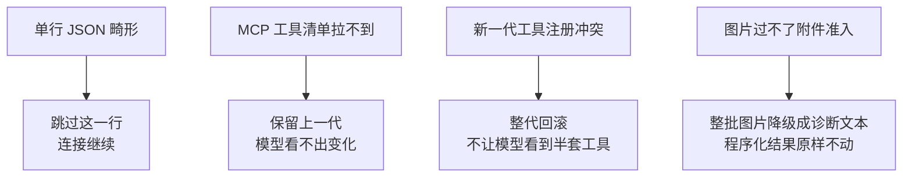

# 协议适配

本模块把运行时接到进程外客户端和远端工具服务。协议层只做编解码、生命周期桥接和内容准入，不拥有 Agent 核心运行时。

## 定位

协议层是运行时**唯一朝外开的那几扇门**，方向有两个，别混：

它只做三件事——**编解码、生命周期桥接、内容准入**。三件事之外的一律不做：它不拥有 Agent，不决定进程怎么起怎么停，不建 HTTP Listener，也不替宿主做认证和租户隔离。

这样划的理由是宿主已经有自己的传输层和身份体系。协议层一旦自带一个，宿主就得在两套之间挑一套，而挑错的那次是在生产环境上暴露的。

## 架构：协议边界

SDK 和 ACP 是入站 Agent 接口；MCP 是出站工具接口。MCP Server 不因此获得 Agent、会话或宿主服务的控制权。

## SDK JSON-RPC

`protocol/sdk/sdkprotocol` 定义按行分帧的 JSON-RPC 2.0 传输和稳定线上类型。畸形单行会被跳过，不会终止整个连接；并发写入保持每个消息独占一行。请求取消和连接关闭通过 `context.Context` 与传输 Done 信号传播。

`protocol/sdk/sdkserver` 处理十三个请求。三个是这条线本身的事：

| 请求 | 行为 |
|---|---|
| `initialize` | 保存该连接的工作目录、Provider、模型和输出上限 |
| `session/prompt` | 首次创建 Agent，把用户输入排入指定会话并返回消息 ID 回执 |
| `shutdown` | 停止接收新会话并释放该 Server 创建的 Agent |

另外十个是会话控制面：建、续、分叉、改名、列举、检索、取消、换模型、改排队、翻历史。它们自己不产生能力，是把 Agent 注册表、会话查询引擎和 LLM 适配器上已有的能力挂到线上；逐条的语义与两路分界见 [SDK 协议与服务端](sdk.md)。握手之前进来的任何一个请求都会被拒。

服务端转发四类通知：会话事件、Agent 状态、子 Agent 开始和子 Agent 完成。Prompt 的后续执行结果通过通知流观察，不包含在入队回执中。它不创建 HTTP Listener，不决定进程退出，也不关闭宿主共享的 Runtime；输入输出流和进程模型由宿主提供。

同一会话的并发首次请求通过单飞创建，避免产生两个 Agent。关闭会等待正在创建的 Agent，并把已创建对象按所有权释放。

## ACP

`protocol/acp` 实现 ACP 的 Agent 端，面向受信任的自动化客户端。它支持：

- 文本、资源链接和通过附件服务准入的内联图片提示。
- 已提交的助手文本和图片输出。
- 当前会话取消。
- 一次性工具审批决定。

原始流分块、推理内容、工具轨迹、计划、标题和重试标记不发送给 ACP 客户端。图片能力只有在模型路由和附件 Store 都确认可用时才对外声明；一批输入先全部校验，再写入任何图片。

Bridge 只拥有自己创建的 Agent。关闭时先停止接收请求、结算活动 Prompt、排空可继续子 Agent，再释放父 Agent。认证钩子本身不建立用户身份体系，宿主必须在连接进入 Bridge 前完成认证和租户绑定。

## MCP

`mcp` 把远端 MCP Server 的工具注册到 `tools`。公开名称按 `mcp__<server>__<tool>` 生成并稳定归一化；线上调用仍使用远端原名。

一次工具清单同步先完整获取下一代定义，再原子替换当前注册。拉取失败时保留上一代；注册冲突时回滚本代，模型不会看到半套工具。连接断开按配置退避重连，`tools/list_changed` 触发重新同步。

当前只支持 Streamable HTTP，不支持 stdio。仓库不启动 MCP 子进程。自定义请求头通过宿主提供的 HTTP Transport 注入，认证内容不能进入工具参数或模型历史。

远端内容经过类型检查和规范化后再变成工具结果。图片只有通过附件准入才能进入模型上下文；否则整批图片降级为诊断文本，原始程序化结果不被改写。

## 生命周期与并发

协议层只拥有**自己创建的那些 Agent**，不拥有共享 Runtime、存储和 Listener。所以关闭有次序，从外往里：

并发上有两条：同一会话的并发首次请求走单飞创建，不会冒出两个 Agent；关闭会等正在创建的那一个走完，再按所有权释放。

## 失败语义

协议层的总规矩是**一处坏掉不许扩散成整条连接坏掉**：

其余几条：

- **重复关闭必须幂等**；某一项释放失败继续释放其余的，最后汇总错误一起交出去。
- **错误只回稳定的协议错误码**，不把内部堆栈、凭据或后端连接信息发给客户端。
- **取消沿 `context` 往下传**，连接关闭靠传输的 Done 信号，两条都不靠轮询。
- **Prompt 的回执只说「排进去了」**，跑成什么样要看通知流——把执行结果塞进回执会让客户端误以为一次请求就是一整轮。

## 安全边界

- 协议中的会话 ID、工作目录、Provider 和模型名都属于不可信输入，必须映射到已授权资源。
- SDK Server 和 ACP Bridge 不提供完整认证、限流、配额或租户隔离。
- MCP Server 的工具 Schema 不是授权证明，工具运行时仍需 Guard、审批和宿主策略。
- 错误返回稳定协议错误，不把内部堆栈、凭据或后端连接信息发送给客户端。
- 协议层不能绕过 `harness/agent` 直接改写会话当前状态。

## 能力边界

本模块不负责：

- 提供开箱即用的 HTTP/gRPC 服务进程。
- 管理 TLS 证书、OAuth、用户目录或 API Key 生命周期。
- 实现 MCP Server 或 stdio MCP 客户端。
- 向 ACP 暴露完整交互式界面事件。
- 保证跨连接、跨进程的会话唯一性；这需要宿主路由和存储约束。

## 对应的 DSH 能力

本篇是汇总文档，下表是它覆盖的各篇详细模块文档的并集，由 [`docs/packages.md`](../packages.md) 与 [能力覆盖表](../portmap/capability-coverage.tsv) join 得到。

| 上游能力 | DSH 包 | 裁决 | 落在哪个 Go 包 | 这里缺什么 |
|---|---|---|---|---|
| Agent Client Protocol仅自动化JSON-RPC服务器，通过stdio驱动harness agent | `acp/acp` | 需要 | `protocol/acp` | — |
| Host 的 ctx.sessionController 服务与生成的 Client session／skills／fileReferences namespace，负责会话生命周期与历史、模型目录、工作区路径打开、可调用 skill 发现与文件引用 | `api/session-controller` | 取形重写 | `protocol/sdk/sdkprotocol` `protocol/sdk/sdkserver` | 缺口：实时投影推送不做（同一语义走 sessionlog/projection 的整值投影，重连重取整值）；工作区路径打开、skill 发现、文件引用三个 namespace 各有自己的门面，不并进这条线 |
| 纯自动化 ACP stdio 应用 profile 组合包，在 base 之上设 coding persona 与默认模型路由，命令提供方接受调用后才启动 ACP bridge | `bundle/acp-app` | 取形重写 | `protocol/acp` | 走 HTTP 不走 stdio，进程外壳那半不要。ACP 场景关掉 session-title-llm 这条取舍已记在裁决里 |
| SDK stdio 应用 profile 组合包，在 base 之上设 coding persona，命令提供方接受调用后才启动 JSON-RPC server | `bundle/sdk-app` | 取形重写 | `protocol/sdk/sdkserver` | 走 HTTP 不走 stdio JSON-RPC，要的只是「协议服务端／进程生命周期」的分界 |
| MCP客户端桥接插件，连接外部MCP服务器并把工具注册到ctx.tools | `mcp/mcp-client` | 需要 | `protocol/mcp` | — |
| DeepSeek Harness SDK运行时共享协议格式，换行分帧JSON-RPC | `sdk/protocol` | 需要 | `protocol/sdk/sdkprotocol` | — |
| stdio JSON-RPC服务器插件使进程外SDK客户端驱动harness agent | `sdk/server` | 需要 | `protocol/sdk/sdkprotocol` `protocol/sdk/sdkserver` | — |

## 相关源码

| 路径 | 内容 |
|---|---|
| `protocol/sdk/sdkprotocol/` | 线上类型、按行 JSON-RPC 传输和错误映射 |
| `protocol/sdk/sdkserver/` | SDK 请求处理、通知和 Agent 所有权 |
| `protocol/acp/` | ACP Bridge、内容准入、取消和审批 |
| `protocol/mcp/host.go`、`protocol/mcp/connection.go` | MCP 连接、命名空间和重连 |
| `protocol/mcp/bridge.go`、`protocol/mcp/content.go` | 工具注册、调用和结果内容转换 |

## 深入阅读

[SDK 协议与服务端](sdk.md) · [ACP 接入](acp.md) · [MCP 客户端](mcp.md)
