# 协议适配

本篇是汇总：三扇朝外开的门各自的详细文档在最后一节。

## 定位

这套装置本身不是一个可以直接用的产品。它得被装进别人的进程里，也得能用上别人已经做好的东西。所以要有几扇朝外开的门。

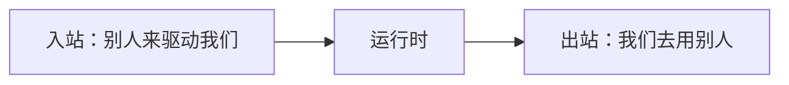

方向有两个，别混：

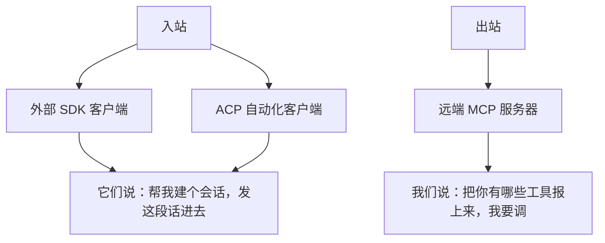

### 只做三件事

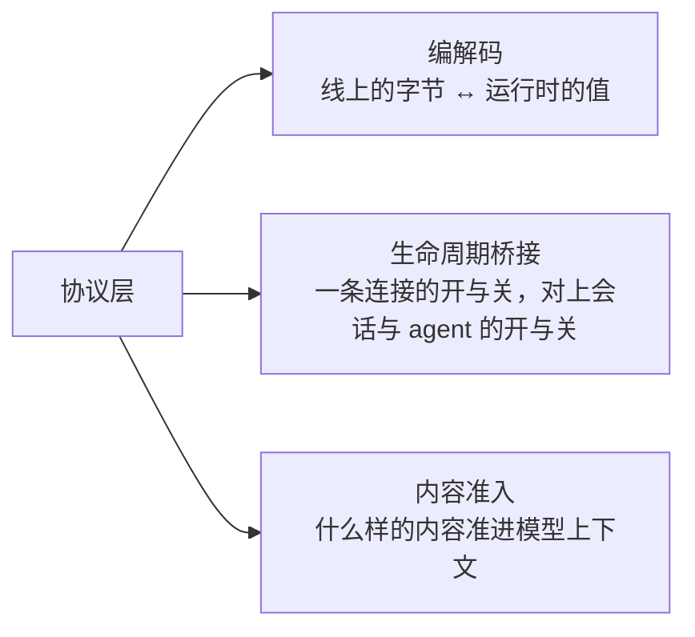

### 三件事之外一律不做

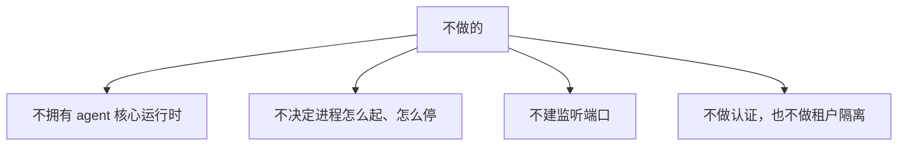

为什么这么划：

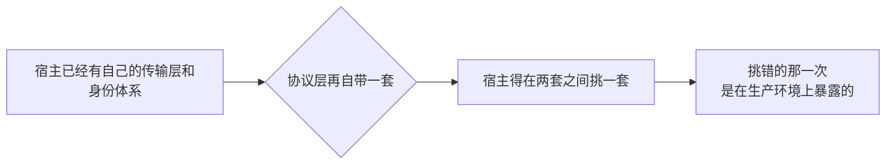

---

## 架构：三扇门和它们通向哪儿

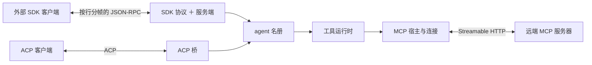

### 出站那一扇不换来任何权力

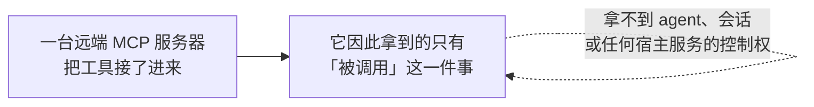

---

## 入站之一：SDK 这条线

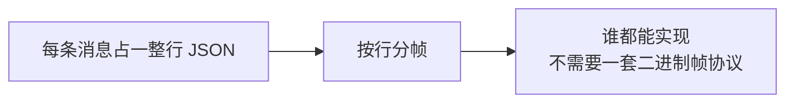

### 一行坏了，不要整条连接跟着坏

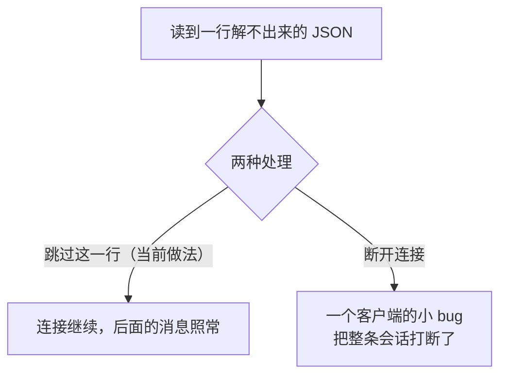

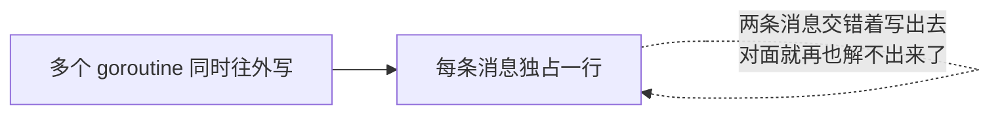

### 握手之前什么都不接

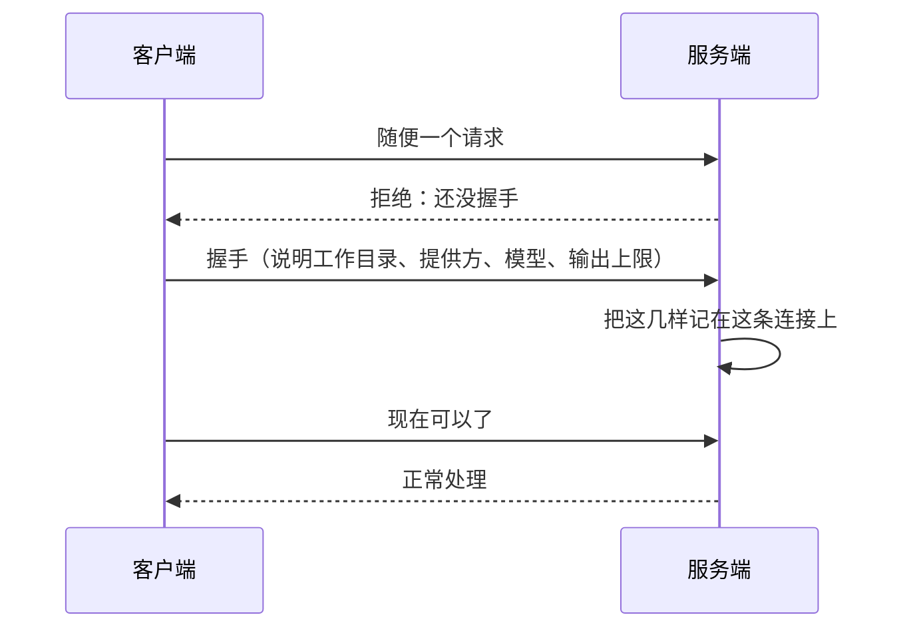

### 十三个请求分两类

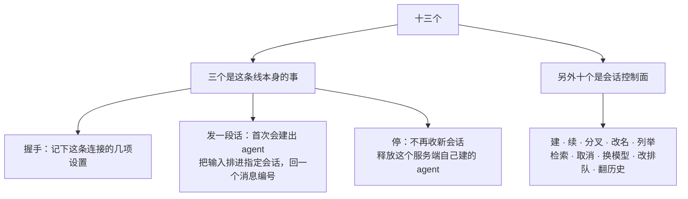

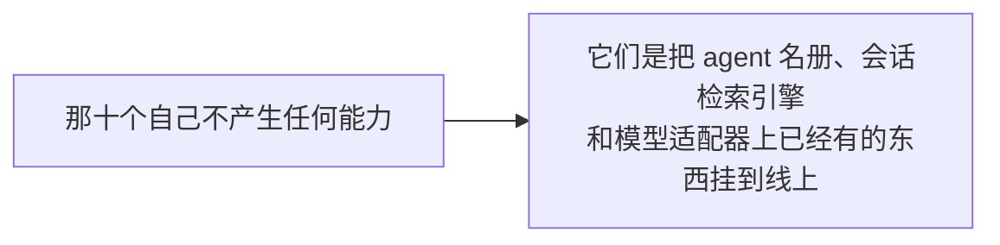

### 发一段话，回执只说「排进去了」

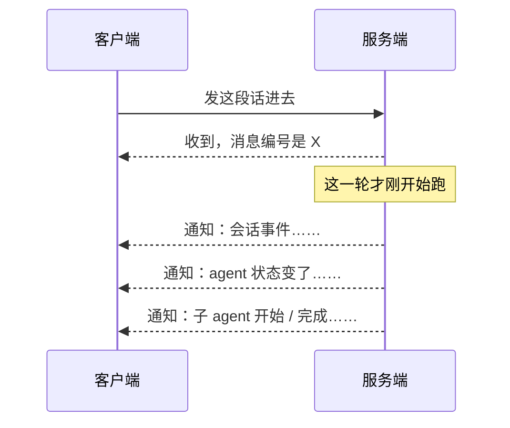

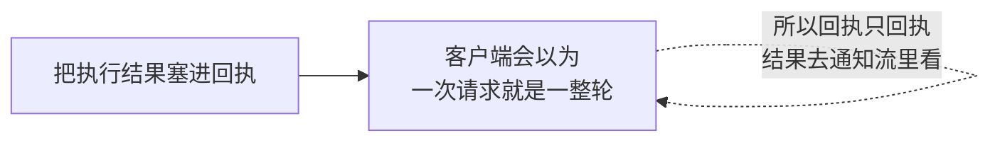

### 同一个会话被同时敲了两次

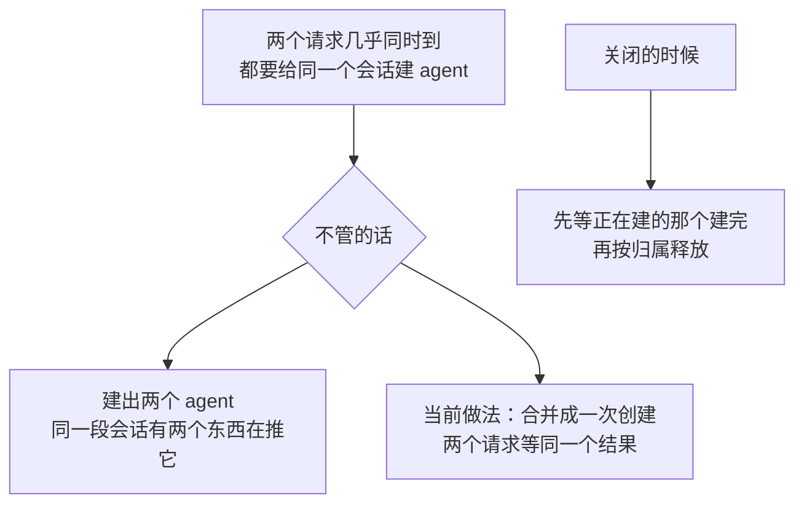

---

## 入站之二：ACP 这条线

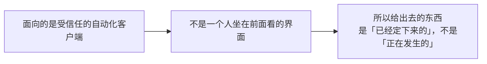

### 给什么，不给什么

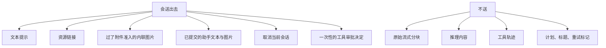

### 图片能力：两方都点头才对外声明

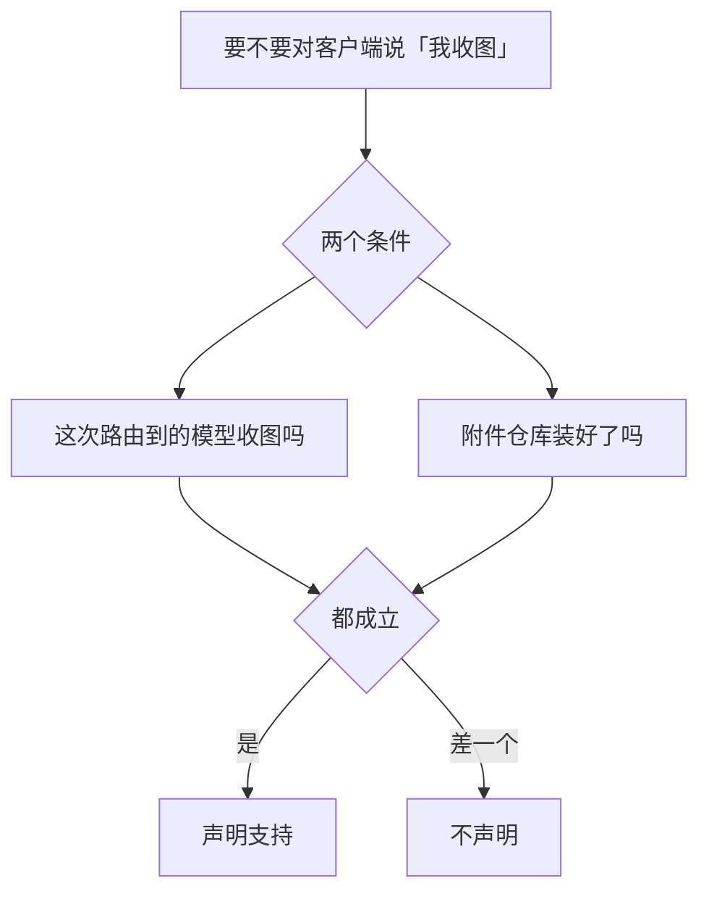

### 一批图先全验完，再写任何一张

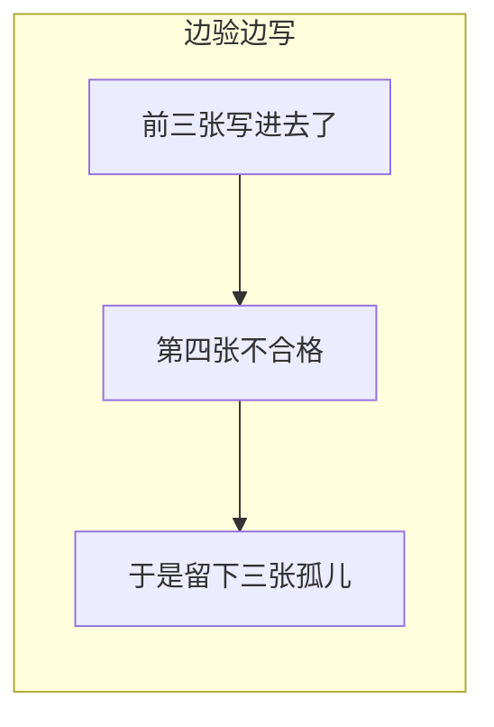

```mermaid
flowchart LR
    subgraph GOOD["当前做法"]
        B1["整批先验"] --> B2["全过了才开始写"]
        B2 --> B3["要么都在，要么一张都没有"]
    end
```

### 桥只拥有自己建的那些 agent

```mermaid
flowchart LR
    A["认证钩子不建立用户身份体系"] --> B["宿主必须在连接进桥之前<br/>把认证和租户绑定做完"]
```

---

## 出站：MCP 这条线

```mermaid
flowchart LR
    A["远端服务器报出它有哪些工具"] --> B["注册进本装置的工具运行时"]
    B --> C["模型调起来<br/>和调本地工具没区别"]
```

### 名字要改，调用不改

```mermaid
flowchart LR
    A["远端原名"] --> B["公开名<br/>mcp__服务器名__原名"]
    B --> C["按提供方对函数名的约束归一化"]
    C --> M(("模型看见这个"))
    A --> W["线上调用用的还是原名"]
```

### 一次清单同步：先全造好，再整代换

```mermaid
flowchart TD
    S1["① 取：抽干分页<br/>在内存里把下一代定义全造出来"] --> Q1{"这一步成了吗"}
    Q1 -->|"没成"| K["上一代原样留着<br/>模型看不出发生过什么"]
    Q1 -->|"成了"| S2["② 换：撤上一代，注册下一代"]
    S2 --> Q2{"注册撞名了吗"}
    Q2 -->|"撞了"| RB["把这一代已经注册进去的全部回滚"]
    Q2 -->|"没撞"| OK["换代完成"]
```

```mermaid
flowchart LR
    A["如果允许半代"] --> B["模型看见 8 个工具里的 5 个"]
    B --> C["它以为这台服务器就这点本事"]
    C --> D["于是绕远路去做一件本来一步能做的事"]
```

### 断了就退避重连

```mermaid
stateDiagram-v2
    [*] --> 首次连接
    首次连接 --> 已连接: 成功
    首次连接 --> [*]: 失败直接报，不重试
    已连接 --> 退避重连: 断了
    退避重连 --> 已连接: 连上后重新同步一遍清单
    已连接 --> [*]: 主动关闭
```

### 只支持一种传输

```mermaid
flowchart LR
    A["只走 Streamable HTTP"] --> B["不走 stdio"]
    B --> C["因为 stdio 要起一个子进程<br/>而本仓库不起子进程"]
```

### 请求头和凭据走在外面

```mermaid
flowchart LR
    A["自定义请求头由宿主提供的传输层注入"] --> B["包在协议外面"]
    B --> C["认证内容进不了工具参数<br/>也进不了模型历史"]
```

### 远端回来的图

```mermaid
flowchart TD
    A["一次工具结果里带图"] --> B{"过得了附件准入吗"}
    B -->|"过得了"| C["模型真的看见这张图"]
    B -->|"过不了"| D["这次结果里的图整批降级成诊断文本"]
    D --> E["而那份原始的程序化结果<br/>一个字节不改"]
```

---

## 生命周期与并发

协议层只拥有**自己建的那些 agent**，不拥有共享运行时、存储和监听端口。所以关闭有次序，从外往里：

```mermaid
flowchart TB
    S1["① 入口停收新请求"] --> S2["② 取消或等完当前的这一轮与工具调用"]
    S2 --> S3["③ 排空可继续的子 agent 与后台活动"]
    S3 --> S4["④ 释放协议层自己建的 agent 与观察者登记"]
    S4 --> S5["⑤ 关掉 MCP 连接"]
    S5 --> S6["⑥ 宿主最后关共享运行时、存储、网络"]
```

```mermaid
flowchart LR
    A["顺序反过来"] --> B["先把共享运行时关了"]
    B --> C["正在收尾的那一轮<br/>脚下的东西没了"]
```

### 并发上的两条

```mermaid
flowchart TD
    A["同一会话的并发首次请求"] --> A1["合并成一次创建<br/>不会冒出两个 agent"]
    B["关闭时"] --> B1["等正在创建的那个走完<br/>再按归属释放"]
```

### 取消和断开都不靠轮询

```mermaid
flowchart LR
    A["取消沿着 context 往下传"] --> C["立即到达"]
    B["连接关闭靠传输层的完成信号"] --> C
```

---

## 失败语义

总规矩是**一处坏掉不许扩散成整条连接坏掉**：

```mermaid
flowchart TB
    A["单行 JSON 畸形"] --> A2["跳过这一行，连接继续"]
    B["MCP 工具清单拉不到"] --> B2["保留上一代，模型看不出变化"]
    C["新一代工具注册撞名"] --> C2["整代回滚，不让模型看到半套工具"]
    D["图片过不了附件准入"] --> D2["整批降级成诊断文本<br/>程序化结果原样不动"]
```

其余几条：

```mermaid
flowchart TD
    A["重复关闭"] --> A1["幂等"]
    B["关闭时某一项释放失败"] --> B1["继续释放其余的<br/>最后把错误汇总交出去"]
    C["任何错误回给客户端"] --> C1["只回稳定的协议错误码"]
    C1 --> C2["不带内部堆栈、凭据<br/>或后端连接信息"]
```

---

## 安全边界

```mermaid
flowchart TD
    A["线上来的这几样都是不可信输入"] --> A1["会话标识"]
    A --> A2["工作目录"]
    A --> A3["提供方名与模型名"]
    A1 --> B["一律映射到已授权的资源上<br/>不直接当真"]
    A2 --> B
    A3 --> B
```

```mermaid
flowchart TD
    N["协议层不提供的"] --> N1["完整认证"]
    N --> N2["限流与配额"]
    N --> N3["租户隔离"]
    N1 --> H["这几样由宿主在连接进来之前做完"]
    N2 --> H
    N3 --> H
```

```mermaid
flowchart LR
    A["远端 MCP 服务器声明的工具形状"] --> B["不是一份授权证明"]
    B --> C["工具运行时那边的守卫、审批<br/>和宿主策略照样要过"]
```

```mermaid
flowchart LR
    A["协议层不能绕过 agent 那一层<br/>直接改写会话的当前状态"] --> B["所有改动都得走同一个入口"]
```

---

## 能力边界

```mermaid
flowchart TD
    Y["这一块做的"] --> Y1["三种线上协议的编解码"]
    Y --> Y2["连接生命周期与 agent、会话生命周期的对接"]
    Y --> Y3["内容准入：什么准进模型上下文"]
    N["不做的"] --> N1["不提供开箱即用的服务进程"]
    N --> N2["不管证书、登录、用户目录、密钥的生命周期"]
    N --> N3["不实现 MCP 服务器那一半，也不做 stdio 客户端"]
    N --> N4["不向 ACP 暴露完整的交互式界面事件"]
    N --> N5["不保证跨连接、跨进程的会话唯一性<br/>那要宿主的路由和存储约束"]
```

## 对应的 DSH 能力

本篇是汇总文档，下表是它覆盖的各篇详细模块文档的并集，由 [`docs/packages.md`](../packages.md) 与 [能力覆盖表](../portmap/capability-coverage.tsv) join 得到。

| 上游能力 | DSH 包 | 裁决 | 落在哪个 Go 包 | 这里缺什么 |
|---|---|---|---|---|
| Agent Client Protocol仅自动化JSON-RPC服务器，通过stdio驱动harness agent | `acp/acp` | 需要 | `protocol/acp` | — |
| Host 的 ctx.sessionController 服务与生成的 Client session／skills／fileReferences namespace，负责会话生命周期与历史、模型目录、工作区路径打开、可调用 skill 发现与文件引用 | `api/session-controller` | 取形重写 | `protocol/sdk/sdkprotocol` `protocol/sdk/sdkserver` | 缺口：实时投影推送不做（同一语义走 sessionlog/projection 的整值投影，重连重取整值）；工作区路径打开、skill 发现、文件引用三个 namespace 各有自己的门面，不并进这条线 |
| 纯自动化 ACP stdio 应用 profile 组合包，在 base 之上设 coding persona 与默认模型路由，命令提供方接受调用后才启动 ACP bridge | `bundle/acp-app` | 取形重写 | `protocol/acp` | 走 HTTP 不走 stdio，进程外壳那半不要。ACP 场景关掉 session-title-llm 这条取舍已记在裁决里 |
| SDK stdio 应用 profile 组合包，在 base 之上设 coding persona，命令提供方接受调用后才启动 JSON-RPC server | `bundle/sdk-app` | 取形重写 | `protocol/sdk/sdkserver` | 走 HTTP 不走 stdio JSON-RPC，要的只是「协议服务端／进程生命周期」的分界 |
| MCP客户端桥接插件，连接外部MCP服务器并把工具注册到ctx.tools | `mcp/mcp-client` | 需要 | `protocol/mcp` | — |
| DeepSeek Harness SDK运行时共享协议格式，换行分帧JSON-RPC | `sdk/protocol` | 需要 | `protocol/sdk/sdkprotocol` | — |
| stdio JSON-RPC服务器插件使进程外SDK客户端驱动harness agent | `sdk/server` | 需要 | `protocol/sdk/sdkprotocol` `protocol/sdk/sdkserver` | — |

## 相关源码

| 路径 | 内容 |
|---|---|
| `protocol/sdk/sdkprotocol/` | 线上类型、按行 JSON-RPC 传输和错误映射 |
| `protocol/sdk/sdkserver/` | SDK 请求处理、通知和 Agent 所有权 |
| `protocol/acp/` | ACP Bridge、内容准入、取消和审批 |
| `protocol/mcp/host.go`、`protocol/mcp/connection.go` | MCP 连接、命名空间和重连 |
| `protocol/mcp/bridge.go`、`protocol/mcp/content.go` | 工具注册、调用和结果内容转换 |

## 深入阅读

[SDK 协议与服务端](sdk.md) · [ACP 接入](acp.md) · [MCP 客户端](mcp.md)
