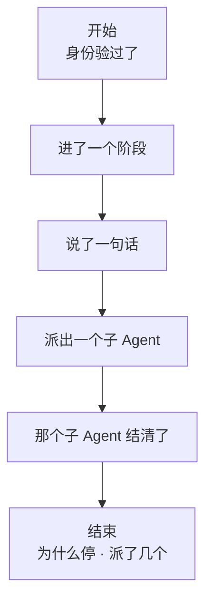

# 工作流与 Ralph

## 定位

这一篇覆盖两个包，一个是**接缝**，一个是**跑在这类接缝上的那件事**：

| 包 | 是什么 |
|---|---|
| `feature/workflow` | 编排工作流的能力接缝：一次运行怎么开工、怎么结清、中途往外说什么。只有契约 |
| `feature/workflow/toolralph` | 固定的多轮子 Agent 工作流。父 Agent 发起一个目标，控制器按轮创建子 Agent、收集报告、决定是否继续，最终结果作为工具结果返回 |

**这个仓库里没有工作流引擎。**上游那台引擎跑的是 JavaScript 编排脚本、载体是一条 Node worker 线程，两样这里都没有，所以引擎和它那件通用脚本工具都裁掉了。留下的是接缝本身和 Ralph——Ralph 不读脚本，它的编排是写死的。

## 架构

```text
父 Agent 调用 Ralph Tool
          |
          v
Controller
  |  round 1 -> Subagent -> RoundReport
  |  round 2 -> Subagent -> RoundReport
  |  ...
  +-> 完成 / 失败 / 达到轮次上限
          |
          v
规范化工具结果
```

`Config` 控制最大轮次、提示模板和输出预算；`Deps.Subagents` 是创建和等待子 Agent 的显式接缝。`RoundReport` 保存每轮状态和可供下一轮使用的摘要。

## 主流程

1. 校验调用参数并建立本次工作流状态。
2. 为当前轮生成提示，创建受父作用域约束的子 Agent。
3. 等待子 Agent 结算，解析本轮报告。
4. 报告要求继续时进入下一轮；完成时返回最终答案。
5. 任一轮失败、取消或超过轮次上限时生成明确终态。

## 工作流接缝

一段编排交给引擎，引擎一路往外说它在干什么。**说话的那条线和控制那条线是分开的**：


虚线那一侧只看得见**发生了什么**，看不见那个运行句柄。所以一个装了观察者的插件不可能取消别人的运行——这是接缝上最要紧的一条分工。

六条边围着一次运行凑成一份账：



阶段只是**进度分组**，对执行结构一个字都没说；派出与结清按序号配对，无论怎么停都得配上。

这份账由本包自己的运行期检查看着，五条：

| 查什么 | 不查会怎样 |
|---|---|
| 一次运行的身份自始至终不变 | 中途改名，观察方按 id 聚合时一次运行会裂成两次 |
| 派出与结清逐条配对，身份一致 | 界面上留下永远转圈的子 Agent |
| 收尾时不许有挂着的子 Agent | 引擎在被强杀那条路上偷懒不补结清，没人发现 |
| 报的派出数不小于真看见的 | 计数对不上，用量统计悄悄少算 |
| 完成的不带失败描述，没完成的必须带 | 一次静默的失败——说失败了却说不出为什么 |

Ralph 不经过这条接缝：它的编排就是一个循环，没有脚本、没有引擎。接缝留着是因为观察方可以先于引擎存在，将来补一台 Go 引擎不必推翻已经装上去的观察者。

## 生命周期与并发

- 一次工具调用拥有它创建的所有轮次子 Agent，退出时必须释放未结算资源。
- 同一 Controller 可服务多个并发调用，每次调用状态彼此隔离。
- 父 Context 取消会传给当前子 Agent，并阻止创建下一轮。
- 安装函数只注册工具和不变量，卸载不会终止其他作用域已经拥有的调用。

## 失败语义

- 子 Agent 的 `error`、`aborted`、`max-tokens` 或 `refusal` 都不会被写成完成。
- 报告格式不合法属于当前轮失败，并保留可诊断内容。
- 达到轮次上限返回明确限制状态，而不是无限续跑。
- 输出经过统一保留策略，截断会显式说明。

## 能力边界

- Ralph 是固定控制流，不是通用工作流 DSL。
- 不持久化进行中的轮次，进程重启后不能从中间自动恢复。
- 不自行选择外部模型或工具权限，子 Agent 仍受宿主配置约束。
- 不保证子 Agent 报告的事实正确。

## 对应的 DSH 能力

下表由 [`docs/packages.md`](../packages.md) 与 [能力覆盖表](../portmap/capability-coverage.tsv) 机器 join 得到：本篇覆盖的 Go 包，承接的是上游 DSH 的哪几条能力，以及各自还缺什么。落点列由源码里的 `// 源:` 注释反查，不是手写的。

| 上游能力 | DSH 包 | 裁决 | 落在哪个 Go 包 | 这里缺什么 |
|---|---|---|---|---|
| 基于已配置provider的面向模型委派工具，前台或后台执行subagent任务 | `subagent/tool-subagent` | 需要 | `feature/workflow/toolralph` | 缺一角：子 agent 的模型选择授权表。descriptor.go 的 AgentProvider／AgentModel 是装配期定死的，模型自己挑不了，也没有「许挑哪几条路由」的授权表。补的入口：工具 schema 加 provider／model／reasoning_effort，授权表以 subagent/model-selection-policy 事件进日志（只进日志不进模型历史），配一个投影单元读回来 |
| 面向模型的ralph工具，运行固定的前台工作流把目标依次交给多个全新子agent | `workflow/tool-ralph` | 需要 | `feature/workflow/toolralph` | — |
| 工作流seam定义脚本、运行、结果、错误和事件契约，worker-thread是当前引擎实现 | `workflow/workflow` | 需要 | `feature/workflow` | 缺一角：只有接缝没有引擎。脚本正文、meta 校验、组合子那套 API 都留给实现方兑现，本仓库不带产出方；Ralph 不经过这条接缝，它的编排写死在循环里 |

## 相关源码

| 目录 | 装的是什么 |
|---|---|
| `feature/workflow/` | 接缝：开工请求与运行句柄、六条生命周期边、带码失败、那条运行期检查 |
| `feature/workflow/toolralph/` | Ralph 工具：轮次循环、每轮报告、配置与工具描述 |
