# 工作流与 Ralph

对应包：`feature/workflow`、`feature/workflow/toolralph`

## 定位

一件长活儿交给一个模型从头做到尾，做着做着会出一件事：早先那些试错、走岔的路、已经作废的假设，全堆在同一段对话里。越往后，它要读的废话越多，也越容易被自己早先的错误判断绕进去。

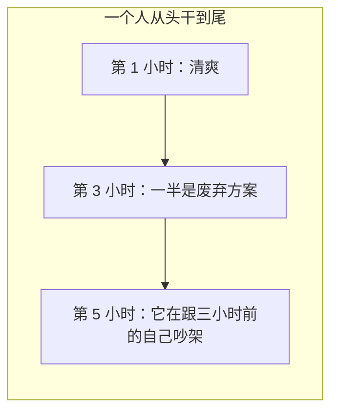
```mermaid
flowchart LR
    subgraph N["一个人从头干到尾"]
        A1["第 1 小时：清爽"] --> A2["第 3 小时：一半是废弃方案"] --> A3["第 5 小时：它在跟三小时前的自己吵架"]
    end
```

Ralph 的答案是**每一轮换一个人**：

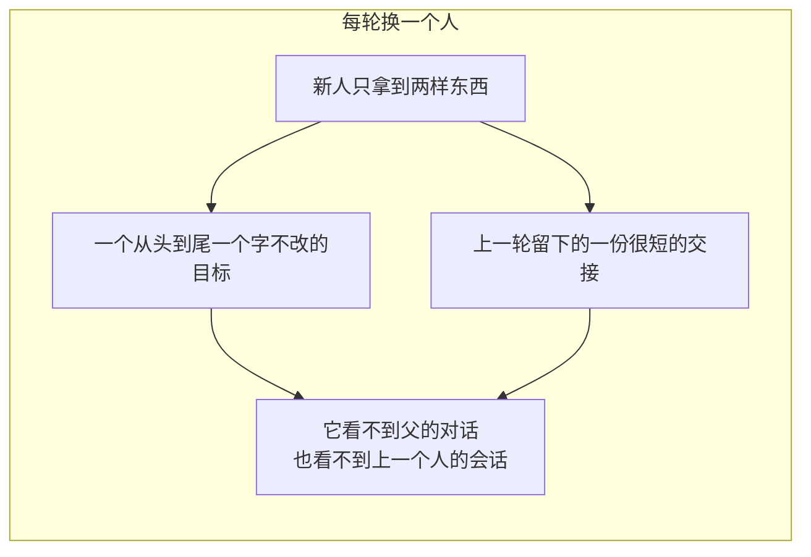
```mermaid
flowchart LR
    subgraph Y["每轮换一个人"]
        B1["新人只拿到两样东西"] --> B2["一个从头到尾一个字不改的目标"]
        B1 --> B3["上一轮留下的一份很短的交接"]
        B2 --> B4["它看不到父的对话<br/>也看不到上一个人的会话"]
        B3 --> B4
    end
```

关键的一步不在「换人」，在**长期记忆搬了家**：

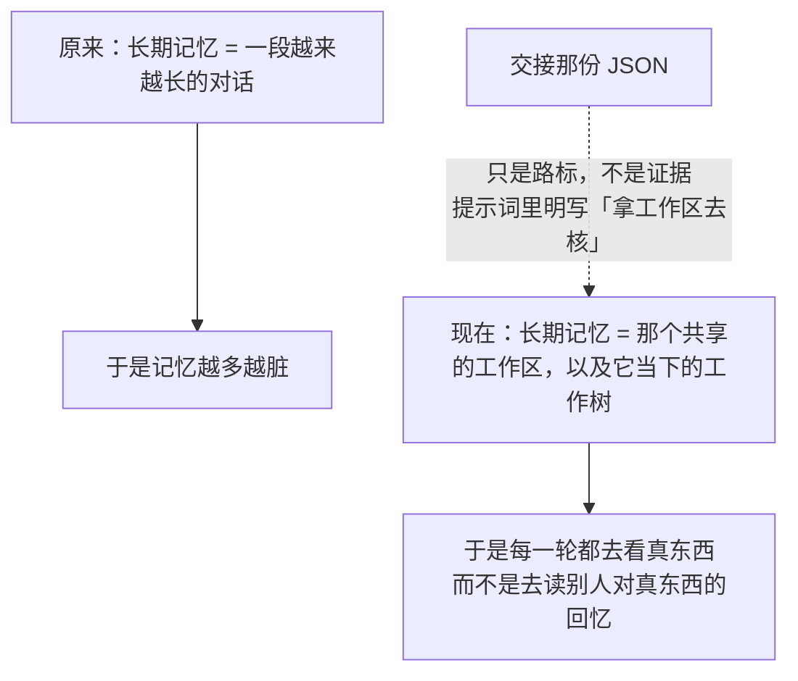
```mermaid
flowchart TD
    A["原来：长期记忆 = 一段越来越长的对话"] --> B["于是记忆越多越脏"]
    C["现在：长期记忆 = 那个共享的工作区，以及它当下的工作树"] --> D["于是每一轮都去看真东西<br/>而不是去读别人对真东西的回忆"]
    E["交接那份 JSON"] -.->|"只是路标，不是证据<br/>提示词里明写「拿工作区去核」"| C
```

这一篇覆盖两个包，一个是**接缝**，一个是**跑在这类接缝上的那件事**：

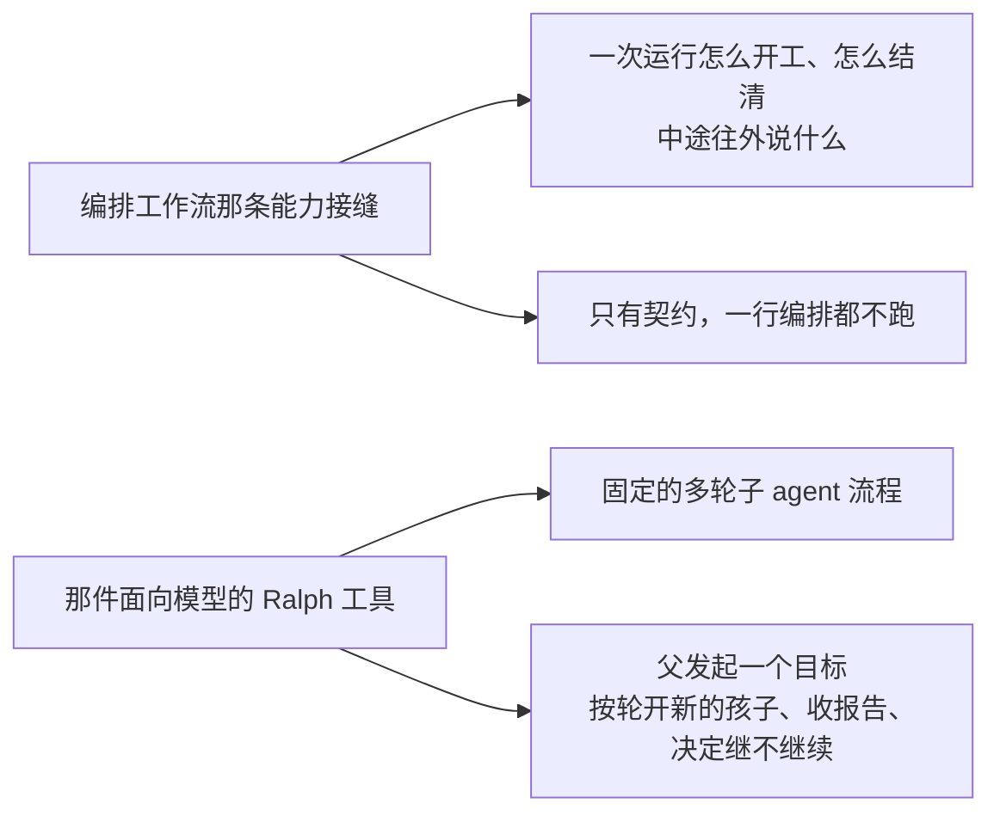
```mermaid
flowchart LR
    S["编排工作流那条能力接缝"] --> S1["一次运行怎么开工、怎么结清<br/>中途往外说什么"]
    S --> S2["只有契约，一行编排都不跑"]
    R["那件面向模型的 Ralph 工具"] --> R1["固定的多轮子 agent 流程"]
    R --> R2["父发起一个目标<br/>按轮开新的孩子、收报告、决定继不继续"]
```

### 这个仓库里没有工作流引擎

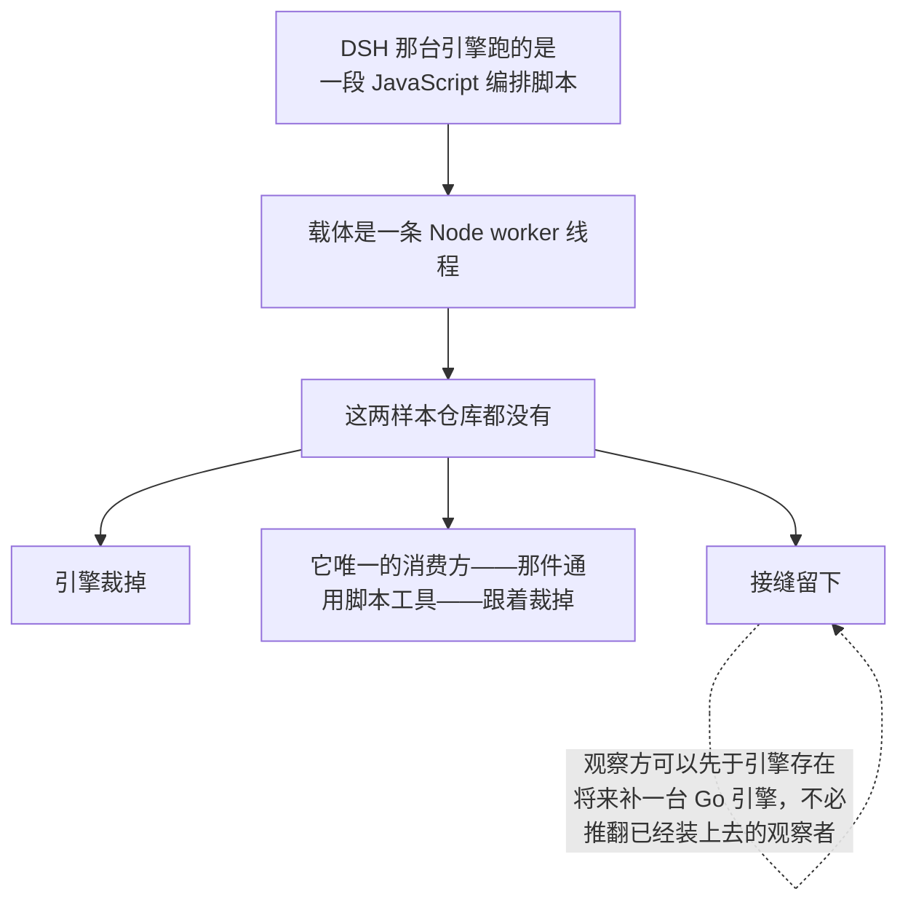
```mermaid
flowchart TD
    A["DSH 那台引擎跑的是<br/>一段 JavaScript 编排脚本"] --> B["载体是一条 Node worker 线程"]
    B --> C["这两样本仓库都没有"]
    C --> D["引擎裁掉"]
    C --> E["它唯一的消费方——那件通用脚本工具——跟着裁掉"]
    C --> F["接缝留下"]
    F -.->|"观察方可以先于引擎存在<br/>将来补一台 Go 引擎，不必推翻已经装上去的观察者"| F
```

Ralph 不读脚本：它的编排在这里就是一个写死的循环。

---

## 架构

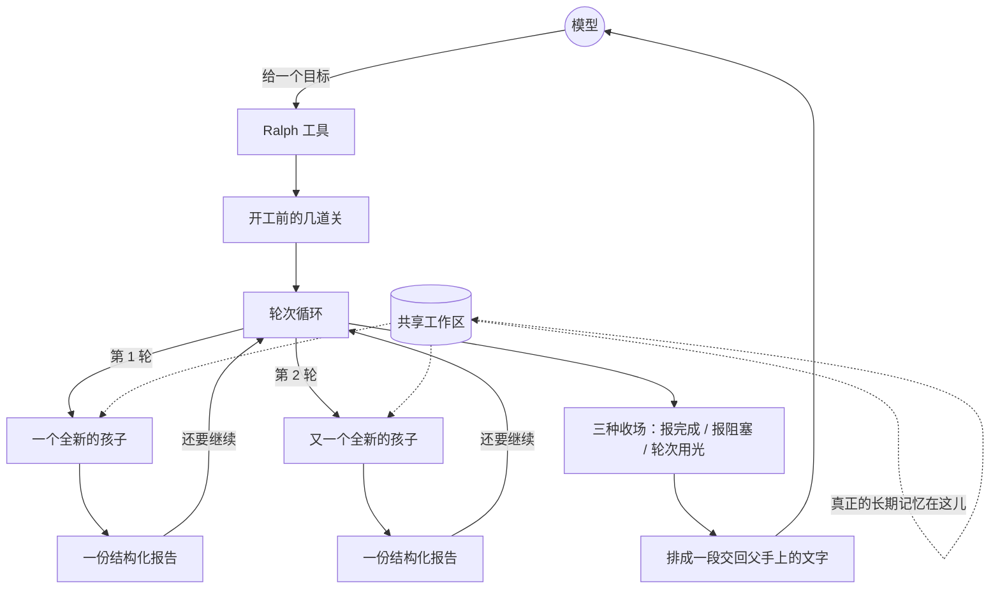
```mermaid
flowchart TD
    M(("模型")) -->|"给一个目标"| T["Ralph 工具"]
    T --> G["开工前的几道关"]
    G --> L["轮次循环"]
    L -->|"第 1 轮"| C1["一个全新的孩子"] --> P1["一份结构化报告"]
    P1 -->|"还要继续"| L
    L -->|"第 2 轮"| C2["又一个全新的孩子"] --> P2["一份结构化报告"]
    P2 -->|"还要继续"| L
    L --> F["三种收场：报完成 / 报阻塞 / 轮次用光"]
    F --> O["排成一段交回父手上的文字"]
    O --> M
    W[("共享工作区")] -.-> C1
    W -.-> C2
    W -.->|"真正的长期记忆在这儿"| W
```

### 接缝：说话的那条线和控制的那条线是分开的

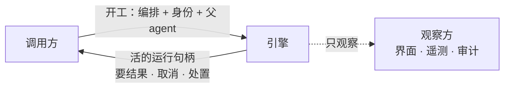
```mermaid
flowchart LR
    C["调用方"] -->|"开工：编排 + 身份 + 父 agent"| E["引擎"]
    E -->|"活的运行句柄<br/>要结果 · 取消 · 处置"| C
    E -.只观察.-> O["观察方<br/>界面 · 遥测 · 审计"]
```

虚线那一侧只看得见**发生了什么**，看不见那个运行句柄。所以一个装了观察者的插件不可能取消别人的运行——这是接缝上最要紧的一条分工。

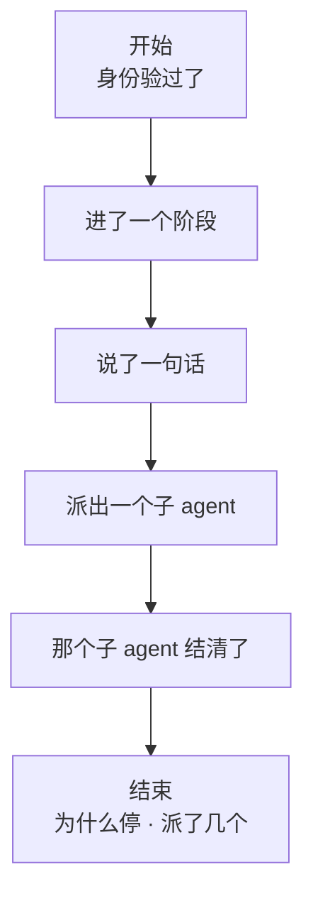
```mermaid
flowchart TB
    S["开始<br/>身份验过了"] --> P["进了一个阶段"]
    P --> L["说了一句话"]
    L --> AS["派出一个子 agent"]
    AS --> AE["那个子 agent 结清了"]
    AE --> N["结束<br/>为什么停 · 派了几个"]
```

阶段只是**进度分组**，对执行结构一个字都没说；派出与结清按序号配对，无论怎么停都得配上。

### 六条边围着一次运行凑成一份账，这份账有人查

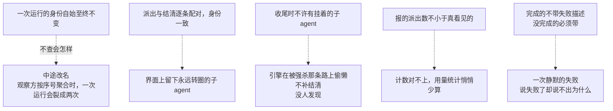
```mermaid
flowchart TD
    Q1["一次运行的身份自始至终不变"] -.->|"不查会怎样"| A1["中途改名<br/>观察方按序号聚合时，一次运行会裂成两次"]
    Q2["派出与结清逐条配对，身份一致"] -.-> A2["界面上留下永远转圈的子 agent"]
    Q3["收尾时不许有挂着的子 agent"] -.-> A3["引擎在被强杀那条路上偷懒不补结清<br/>没人发现"]
    Q4["报的派出数不小于真看见的"] -.-> A4["计数对不上，用量统计悄悄少算"]
    Q5["完成的不带失败描述<br/>没完成的必须带"] -.-> A5["一次静默的失败<br/>说失败了却说不出为什么"]
```

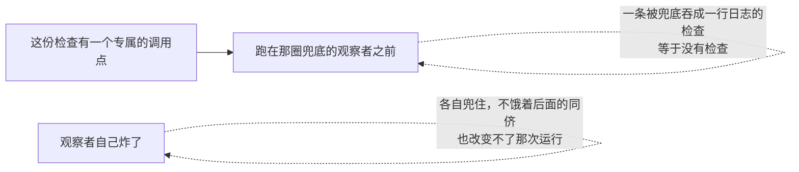
```mermaid
flowchart LR
    A["这份检查有一个专属的调用点"] --> B["跑在那圈兜底的观察者之前"]
    B -.->|"一条被兜底吞成一行日志的检查<br/>等于没有检查"| B
    C["观察者自己炸了"] -.->|"各自兜住，不饿着后面的同侪<br/>也改变不了那次运行"| C
```

Ralph 不经过这条接缝：它的编排就是一个循环，没有脚本、没有引擎。

---

## Ralph 那条循环

### 一次调用的主干

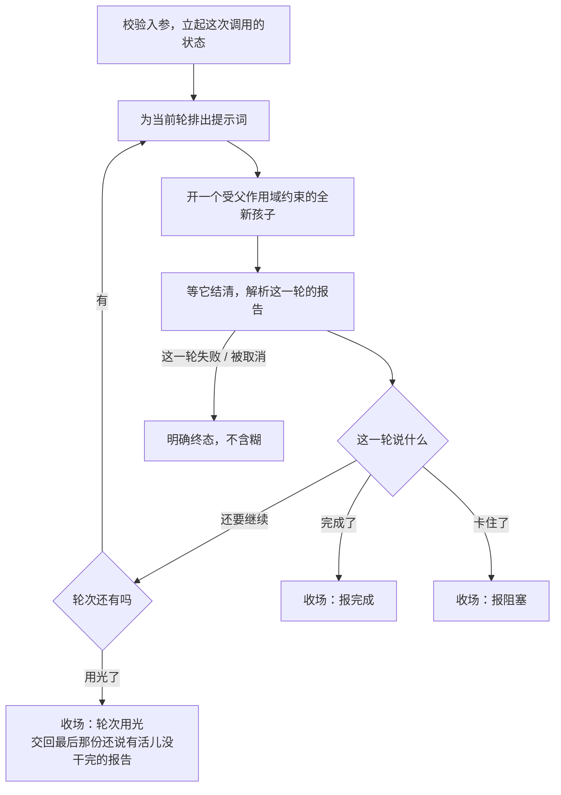
```mermaid
flowchart TD
    A["校验入参，立起这次调用的状态"] --> B["为当前轮排出提示词"]
    B --> C["开一个受父作用域约束的全新孩子"]
    C --> D["等它结清，解析这一轮的报告"]
    D --> E{"这一轮说什么"}
    E -->|"还要继续"| F{"轮次还有吗"}
    F -->|"有"| B
    F -->|"用光了"| G["收场：轮次用光<br/>交回最后那份还说有活儿没干完的报告"]
    E -->|"完成了"| H["收场：报完成"]
    E -->|"卡住了"| I["收场：报阻塞"]
    D -->|"这一轮失败 / 被取消"| J["明确终态，不含糊"]
```

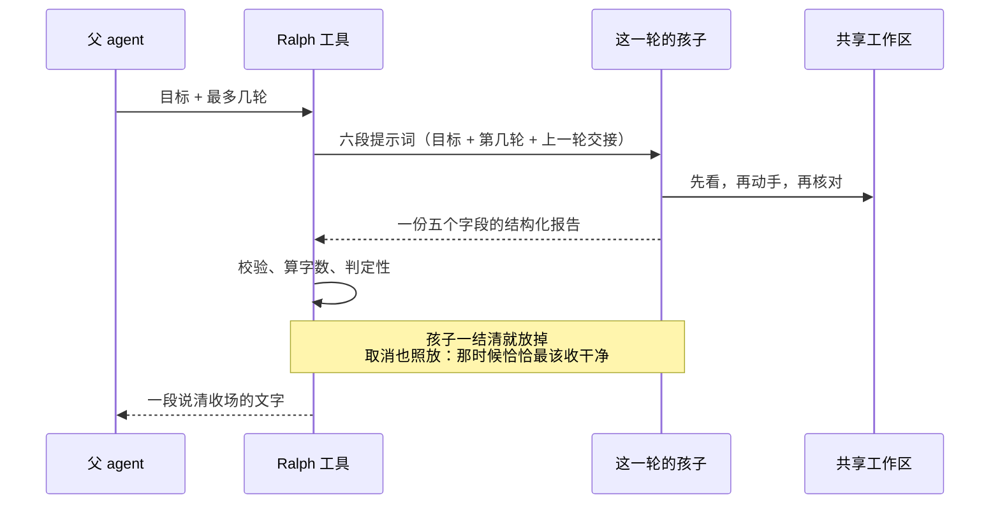
```mermaid
sequenceDiagram
    participant P as 父 agent
    participant R as Ralph 工具
    participant K as 这一轮的孩子
    participant W as 共享工作区
    P->>R: 目标 + 最多几轮
    R->>K: 六段提示词（目标 + 第几轮 + 上一轮交接）
    K->>W: 先看，再动手，再核对
    K-->>R: 一份五个字段的结构化报告
    R->>R: 校验、算字数、判定性
    Note over R,K: 孩子一结清就放掉<br/>取消也照放：那时候恰恰最该收干净
    R-->>P: 一段说清收场的文字
```

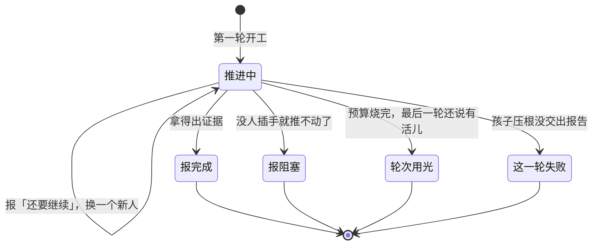
```mermaid
stateDiagram-v2
    [*] --> 推进中: 第一轮开工
    推进中 --> 推进中: 报「还要继续」，换一个新人
    推进中 --> 报完成: 拿得出证据
    推进中 --> 报阻塞: 没人插手就推不动了
    推进中 --> 轮次用光: 预算烧完，最后一轮还说有活儿
    推进中 --> 这一轮失败: 孩子压根没交出报告
    报完成 --> [*]
    报阻塞 --> [*]
    轮次用光 --> [*]
    这一轮失败 --> [*]
```

### 发给每一轮的那六段话，各堵一种跑偏

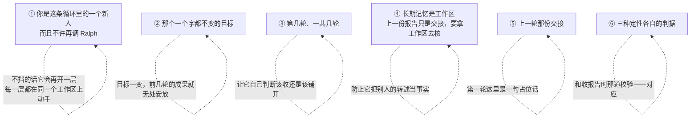
```mermaid
flowchart TD
    S1["① 你是这条循环里的一个新人<br/>而且不许再调 Ralph"] -.->|"不挡的话它会再开一层<br/>每一层都在同一个工作区上动手"| S1
    S2["② 那个一个字都不变的目标"] -.->|"目标一变，前几轮的成果就无处安放"| S2
    S3["③ 第几轮、一共几轮"] -.->|"让它自己判断该收还是该铺开"| S3
    S4["④ 长期记忆是工作区<br/>上一份报告只是交接，要拿工作区去核"] -.->|"防止它把别人的转述当事实"| S4
    S5["⑤ 上一轮那份交接"] -.->|"第一轮这里是一句占位话"| S5
    S6["⑥ 三种定性各自的判据"] -.->|"和收报告时那道校验一一对应"| S6
```

### 轮与轮之间只让这一份东西过去

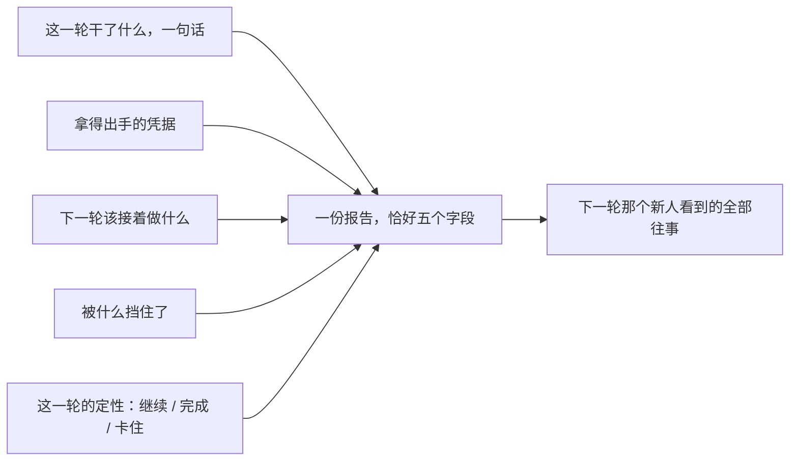
```mermaid
flowchart LR
    A["这一轮干了什么，一句话"] --> Z["一份报告，恰好五个字段"]
    B["拿得出手的凭据"] --> Z
    C["下一轮该接着做什么"] --> Z
    D["被什么挡住了"] --> Z
    E["这一轮的定性：继续 / 完成 / 卡住"] --> Z
    Z --> N["下一轮那个新人看到的全部往事"]
```

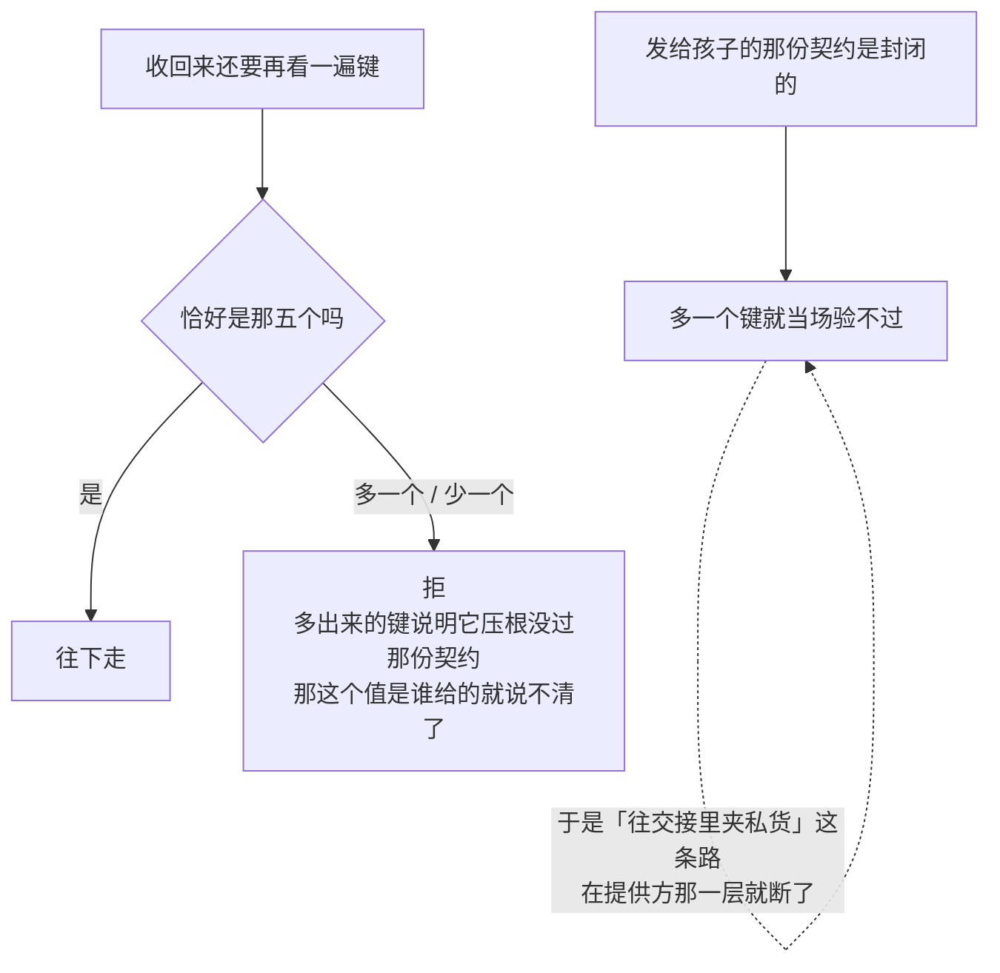
```mermaid
flowchart TD
    A["发给孩子的那份契约是封闭的"] --> B["多一个键就当场验不过"]
    B -.->|"于是「往交接里夹私货」这条路<br/>在提供方那一层就断了"| B
    C["收回来还要再看一遍键"] --> D{"恰好是那五个吗"}
    D -->|"是"| E["往下走"]
    D -->|"多一个 / 少一个"| F["拒<br/>多出来的键说明它压根没过那份契约<br/>那这个值是谁给的就说不清了"]
```

### 三种定性各有硬判据

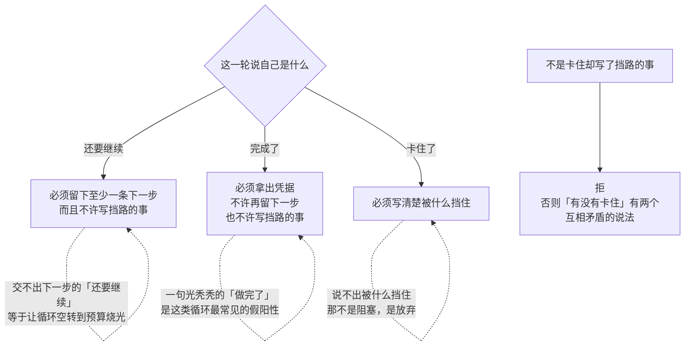
```mermaid
flowchart TD
    A{"这一轮说自己是什么"} -->|"还要继续"| B["必须留下至少一条下一步<br/>而且不许写挡路的事"]
    B -.->|"交不出下一步的「还要继续」<br/>等于让循环空转到预算烧光"| B
    A -->|"完成了"| C["必须拿出凭据<br/>不许再留下一步<br/>也不许写挡路的事"]
    C -.->|"一句光秃秃的「做完了」<br/>是这类循环最常见的假阳性"| C
    A -->|"卡住了"| D["必须写清楚被什么挡住"]
    D -.->|"说不出被什么挡住<br/>那不是阻塞，是放弃"| D
    E["不是卡住却写了挡路的事"] --> F["拒<br/>否则「有没有卡住」有两个互相矛盾的说法"]
```

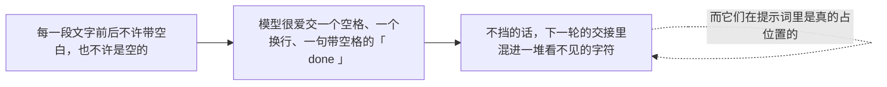
```mermaid
flowchart LR
    A["每一段文字前后不许带空白，也不许是空的"] --> B["模型很爱交一个空格、一个换行、一句带空格的「 done 」"]
    B --> C["不挡的话，下一轮的交接里混进一堆看不见的字符"]
    C -.->|"而它们在提示词里是真的占位置的"| C
```

### 那道字数闸是 Ralph 的另一半

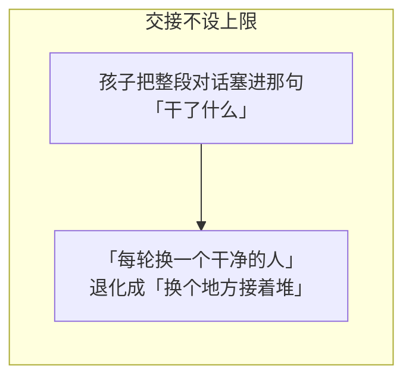
```mermaid
flowchart LR
    subgraph BAD["交接不设上限"]
        A1["孩子把整段对话塞进那句「干了什么」"] --> A2["「每轮换一个干净的人」<br/>退化成「换个地方接着堆」"]
    end
```

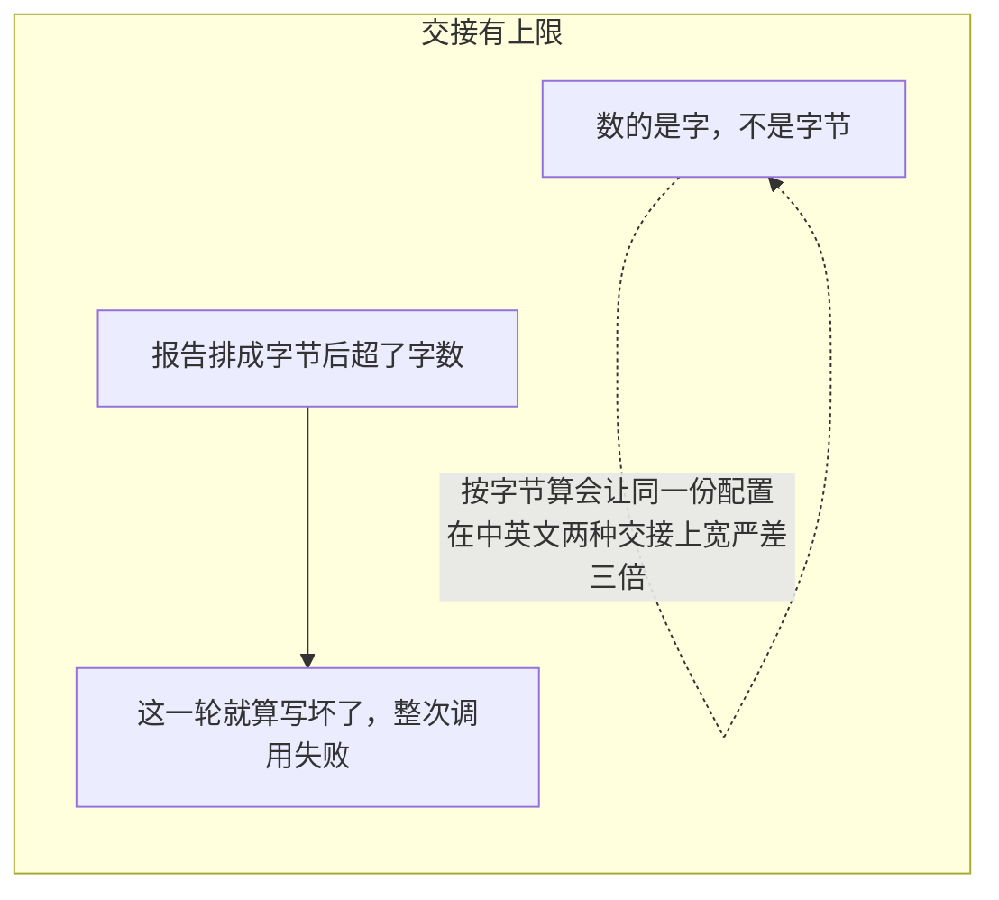
```mermaid
flowchart LR
    subgraph GOOD["交接有上限"]
        B1["报告排成字节后超了字数"] --> B2["这一轮就算写坏了，整次调用失败"]
        B3["数的是字，不是字节"] -.->|"按字节算会让同一份配置<br/>在中英文两种交接上宽严差三倍"| B3
    end
```

### 开工之前先把注定跑不成的挡掉

```mermaid
flowchart TD
    A["① 找得回那个发起调用的父 agent 吗"] --> B["② 目标是不是一段非空的话"]
    B --> C["③ 模型挑的轮数在部署天花板以内吗"]
    C --> D["④ 点名那条路线真的意味着一个全新的孩子吗"]
    D --> E["都过了，才开第一个孩子"]
    E -.->|"四道关全在花掉第一分钱之前"| E
```

```mermaid
flowchart TD
    A["那条路线要过三条，缺一不可"] --> B["没登记：压根开不出孩子"]
    A --> C["不支持结构化输出：<br/>那份报告是轮与轮之间唯一的载荷<br/>没有它，循环退化成「反复叫人从头干同一件事」"]
    A --> D["会把父的对话带给孩子：<br/>正好把 Ralph 存在的理由抵消掉"]
    E["这道关落在执行那一刻，不落在装配那一刻"] -.->|"提供方可以在装配之后才登记上来"| E
```

```mermaid
flowchart LR
    A["模型挑的轮数比天花板大"] --> B{"两种处理"}
    B -->|"悄悄夹到天花板"| C["模型不知道<br/>它会拿着一份跑不完的计划去写目标"]
    B -->|"当场报错（当前做法）"| D["它重新挑一个自己算得清的数"]
```

### 一轮失败：那份交接不能扔

```mermaid
flowchart TD
    A["这一轮的孩子没交出报告"] --> B["开工失败 / 跑挂了 / 被取消 / 结果是空的"]
    B --> C["把上一轮那份交接一起呈给父"]
    C -.->|"孩子在工作区上真干过的活儿还在那儿<br/>这份交接是父唯一看得见的「干到哪儿了」"| C
    D["扔掉它"] -.->|"父就只知道「挂了」，接不下去"| E(("×"))
    F["顺带把「为什么挂的」也说出来"] --> C
```

```mermaid
flowchart LR
    A{"两种错要分清"} -->|"没交出报告"| B["带着交接呈上去<br/>这是一次可以被理解的失败"]
    A -->|"交出来了但不合规矩"| C["普通的硬错，不糊过去"]
    C -.->|"那说明这条路上有人没按契约办事<br/>糊过去只会让下一次更难查"| C
```

### 两处措辞上的克制

```mermaid
flowchart LR
    A["工具说的是「有个人报告说完成了」"] --> B["不是「完成了」"]
    B -.->|"这条循环一个字的证据都没验过<br/>说成后者就是替孩子作证"| B
    C["工具描述里一半篇幅在划边界"] --> D["只有人明说要 Ralph 或者要换人迭代时才用"]
    D -.->|"一轮一个孩子，这件工具很贵<br/>而模型看见「反复推进直到完成」是会主动去够的"| D
```

---

## 生命周期与并发

```mermaid
flowchart TD
    A["一次工具调用拥有它开出来的所有孩子"] --> A1["退出时必须把没结清的资源放掉"]
    B["同一个控制器可以服务多个并发调用"] --> B1["每次调用的状态彼此隔离"]
    C["父被取消"] --> C1["传给当前这个孩子<br/>并且不再开下一轮"]
    D["装配函数只登记工具和那段用法指引"] --> D1["卸载不会终止别的作用域已经拥有的调用"]
    E["处置孩子不跟着调用方的取消走"] -.->|"一次已经被取消的等待<br/>恰恰最需要把孩子收干净"| E
```

```mermaid
flowchart LR
    A["这件工具没有标成并发安全"] --> B["于是同一时刻不会有两条 Ralph 并排跑"]
    C["若允许并排"] -.->|"两条循环轮流覆盖对方刚写下的东西<br/>而两边都以为那是自己上一轮的成果"| D(("×"))
```

---

## 失败语义

```mermaid
flowchart TD
    A["出了岔子"] --> B{"哪一类"}
    B -->|"孩子报错、被取消、撞上词元上限、拒绝任务"| C["都不会被写成完成<br/>连认不出的终态也当失败"]
    C -.->|"否则下一轮会拿着半截交接接着跑"| C
    B -->|"报告格式不合法"| D["算这一轮失败<br/>但保留可诊断的那部分"]
    B -->|"轮次用光"| E["返回一个明确的受限状态<br/>不无限续跑"]
    B -->|"交回父的那段文字太长"| F["按统一策略截断<br/>并在末尾显式标出截过"]
```

---

## 能力边界

```mermaid
flowchart TD
    Y["这两个包做的"] --> Y1["定下一次编排运行怎么开工、怎么结清、往外说什么"]
    Y --> Y2["把一个不变的目标反复交给全新的人，直到有个结论"]
    N["不做的"] --> N1["Ralph 是固定控制流<br/>不是一门通用的编排语言"]
    N --> N2["不持久化进行中的轮次<br/>进程重启后接不上，只能重开一次循环"]
    N --> N3["不自己挑外部模型，也不自己发工具权限<br/>孩子仍受宿主配置约束"]
    N --> N4["不保证孩子报告的事实正确<br/>完成和阻塞都是它自己说的"]
    N --> N5["不碰工作区<br/>那是孩子手上的工具去读写的"]
    N --> N6["不做后台化<br/>要后台就用普通的子 agent 派发"]
```

## 对应的 DSH 能力

下表由 [`docs/packages.md`](../packages.md) 与 [能力覆盖表](../portmap/capability-coverage.tsv) 机器 join 得到：本篇覆盖的 Go 包，承接的是上游 DSH 的哪几条能力，以及各自还缺什么。落点列由源码里的 `// 源:` 注释反查，不是手写的。

| 上游能力 | DSH 包 | 裁决 | 落在哪个 Go 包 | 这里缺什么 |
|---|---|---|---|---|
| 基于已配置provider的面向模型委派工具，前台或后台执行subagent任务 | `subagent/tool-subagent` | 需要 | `feature/workflow/toolralph` | 缺一角：子 agent 的模型选择授权表。descriptor.go 的 AgentProvider／AgentModel 是装配期定死的，模型自己挑不了，也没有「许挑哪几条路由」的授权表。补的入口：工具 schema 加 provider／model／reasoning_effort，授权表以 subagent/model-selection-policy 事件进日志（只进日志不进模型历史），配一个投影单元读回来 |
| 面向模型的ralph工具，运行固定的前台工作流把目标依次交给多个全新子agent | `workflow/tool-ralph` | 需要 | `feature/workflow/toolralph` | — |
| 工作流seam定义脚本、运行、结果、错误和事件契约，worker-thread是当前引擎实现 | `workflow/workflow` | 需要 | `feature/workflow` | 缺一角：只有接缝没有引擎。脚本正文、meta 校验、组合子那套 API 都留给实现方兑现，本仓库不带产出方；Ralph 不经过这条接缝，它的编排写死在循环里 |

## 相关源码

| 目录 | 装的是什么 |
|---|---|
| `feature/workflow/` | 接缝：开工请求与运行句柄、六条生命周期边、带码失败、那条运行期检查 |
| `feature/workflow/toolralph/` | Ralph 工具：轮次循环、每轮报告、配置与工具描述 |
