# 耐久提醒

对应包：`feature/schedule`

## 定位

人对这套装置说的话里，有一类不是「现在做」，而是「过一会儿做」：

- 二十分钟后提醒我看构建结果
- 明天早上九点（东京时间）提醒我交周报
- 每小时提醒我起来走两步

模型接不住这种话。一个回合跑完它就停了，没有任何东西替它数着时间。

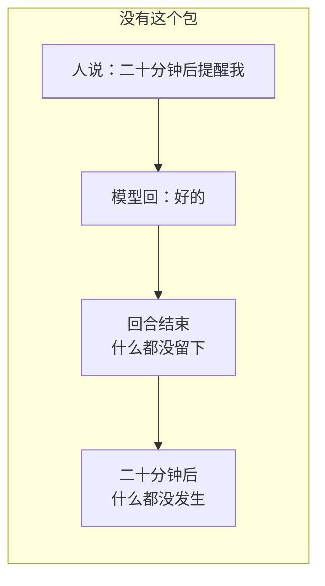
```mermaid
flowchart LR
    subgraph N["没有这个包"]
        A1["人说：二十分钟后提醒我"] --> A2["模型回：好的"] --> A3["回合结束<br/>什么都没留下"] --> A4["二十分钟后<br/>什么都没发生"]
    end
```

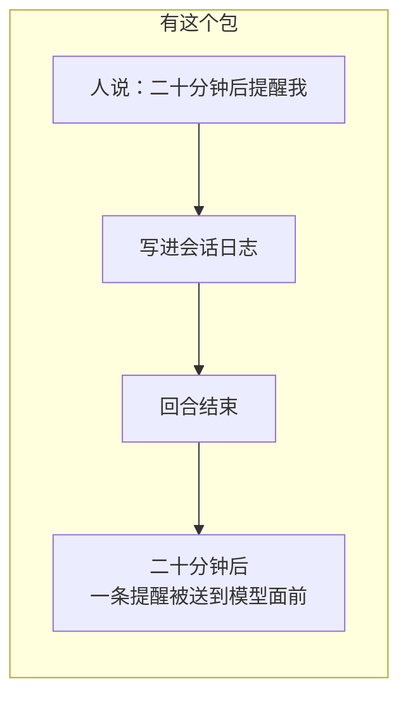
```mermaid
flowchart LR
    subgraph Y["有这个包"]
        B1["人说：二十分钟后提醒我"] --> B2["写进会话日志"] --> B3["回合结束"] --> B4["二十分钟后<br/>一条提醒被送到模型面前"]
    end
```

模型能定的规则只有三种，多一种都不认：

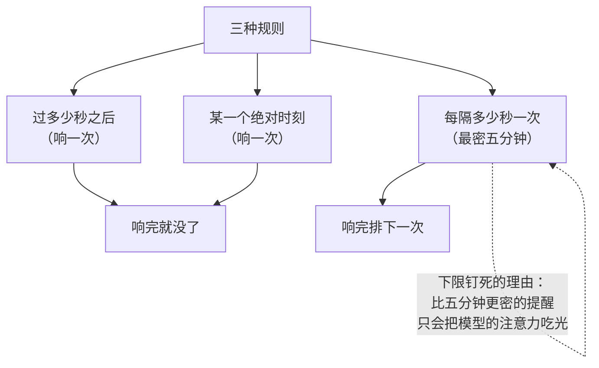
```mermaid
flowchart TD
    R["三种规则"] --> A["过多少秒之后<br/>（响一次）"]
    R --> B["某一个绝对时刻<br/>（响一次）"]
    R --> C["每隔多少秒一次<br/>（最密五分钟）"]
    A --> Z["响完就没了"]
    B --> Z
    C --> Z2["响完排下一次"]
    C -.->|"下限钉死的理由：<br/>比五分钟更密的提醒<br/>只会把模型的注意力吃光"| C
```

---

## 架构

整个包只有一条主张：**提醒的事实在会话日志里，定时器只是它的影子。**

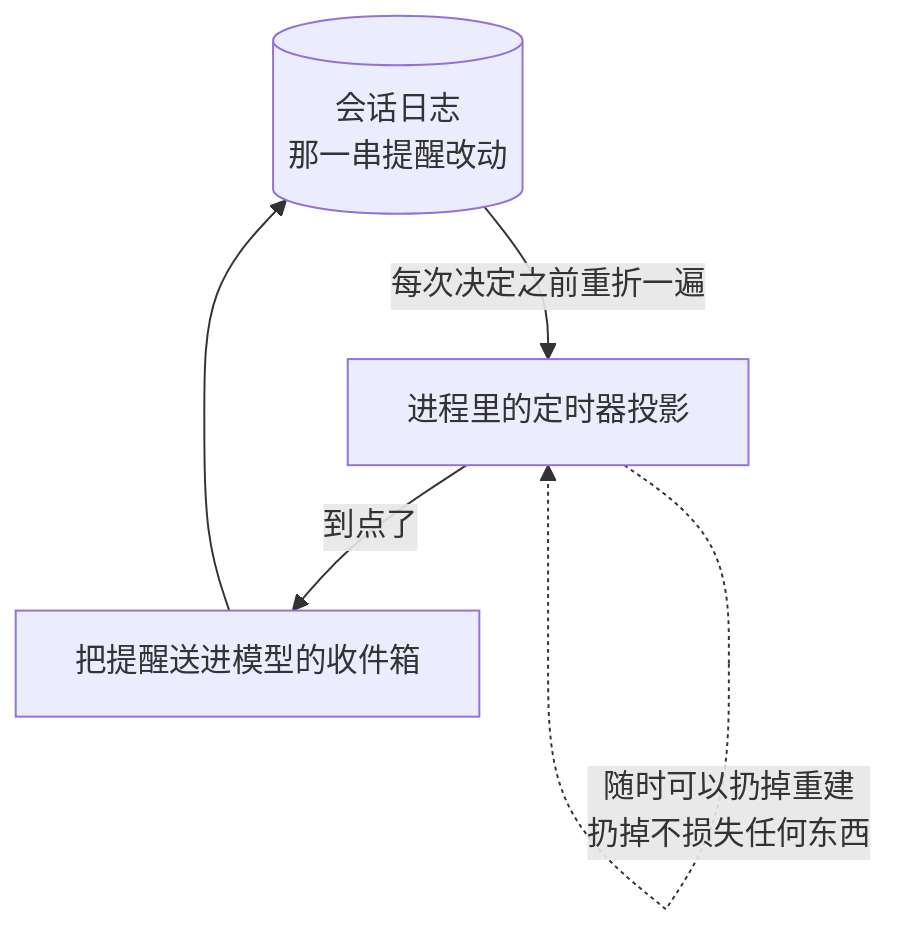
```mermaid
flowchart TD
    LOG[("会话日志<br/>那一串提醒改动")] -->|"每次决定之前重折一遍"| PROJ["进程里的定时器投影"]
    PROJ -->|"到点了"| DEL["把提醒送进模型的收件箱"]
    DEL --> LOG
    PROJ -.->|"随时可以扔掉重建<br/>扔掉不损失任何东西"| PROJ
```

这条主张决定了后面几乎每一处形状：改动先落进日志再说，落不下去就当没发生；每一次决定之前重折一遍，绝不信上一次折出来的结果。

装上去之后长这样：

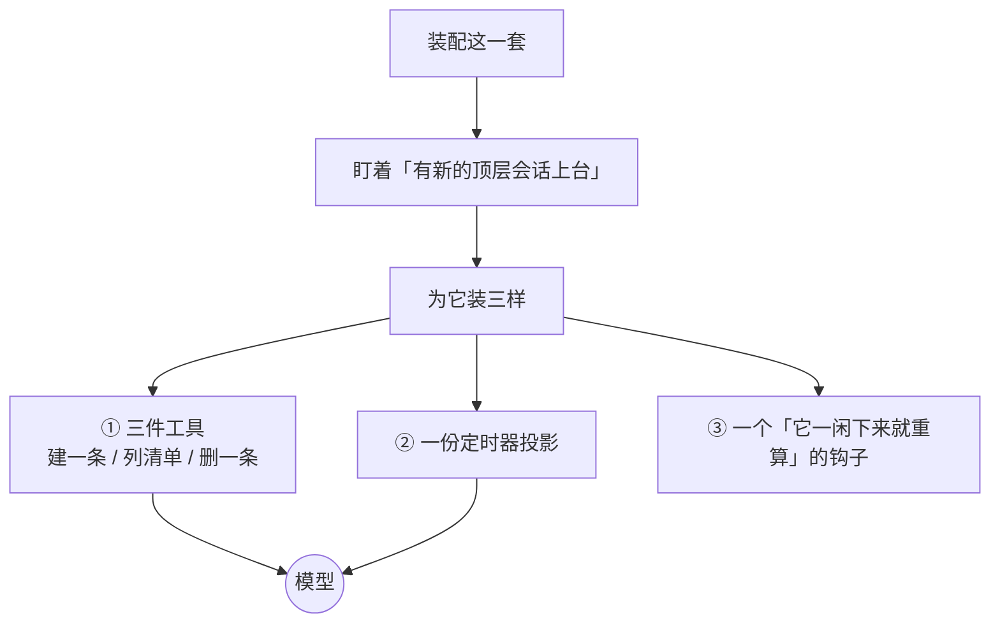
```mermaid
flowchart TD
    INS["装配这一套"] --> W["盯着「有新的顶层会话上台」"]
    W --> ONE["为它装三样"]
    ONE --> T["① 三件工具<br/>建一条 / 列清单 / 删一条"]
    ONE --> P["② 一份定时器投影"]
    ONE --> H["③ 一个「它一闲下来就重算」的钩子"]
    T --> M(("模型"))
    P --> M
```

两条只装给谁的规矩：

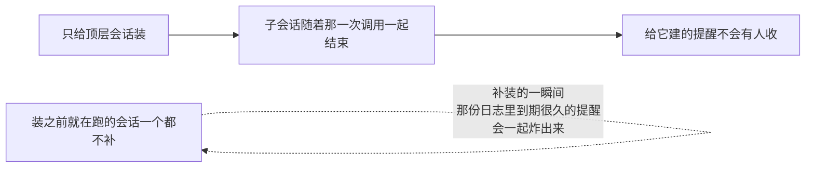
```mermaid
flowchart LR
    A["只给顶层会话装"] --> B["子会话随着那一次调用一起结束"]
    B --> C["给它建的提醒不会有人收"]
    D["装之前就在跑的会话一个都不补"] -.->|"补装的一瞬间<br/>那份日志里到期很久的提醒会一起炸出来"| D
```

模型这一侧只看得见三件事：

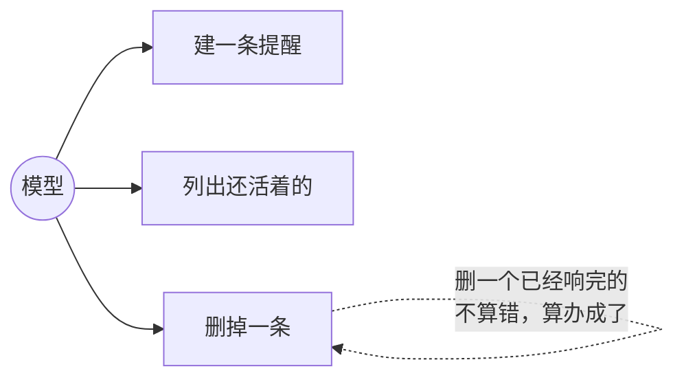
```mermaid
flowchart LR
    M(("模型")) --> C1["建一条提醒"]
    M --> C2["列出还活着的"]
    M --> C3["删掉一条"]
    C3 -.->|"删一个已经响完的<br/>不算错，算办成了"| C3
```

最后那条注解不是随手写的：删一条已经响完的提醒是一次正常的、重复做也无所谓的操作，把它报成错误会逼模型去处理一件根本不用处理的事。

---

## 一条提醒的一生

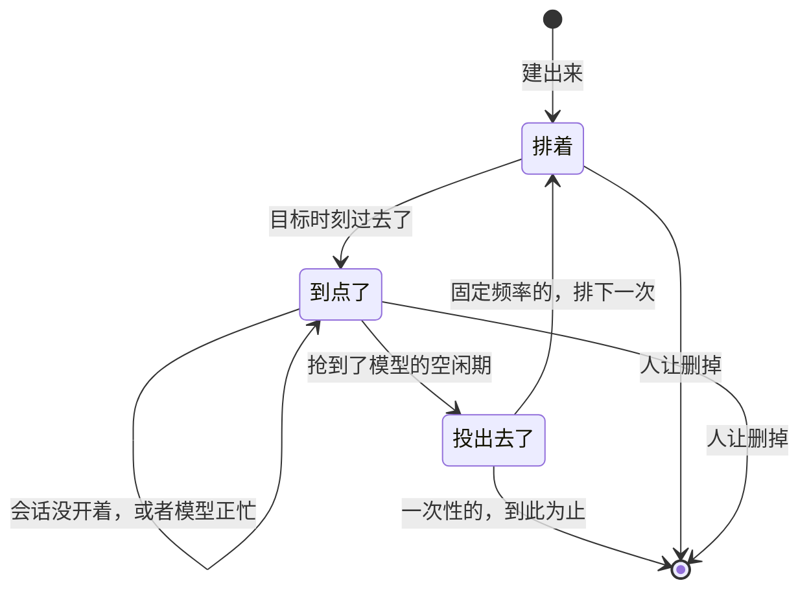
```mermaid
stateDiagram-v2
    [*] --> 排着: 建出来
    排着 --> 到点了: 目标时刻过去了
    到点了 --> 到点了: 会话没开着，或者模型正忙
    到点了 --> 投出去了: 抢到了模型的空闲期
    投出去了 --> 排着: 固定频率的，排下一次
    投出去了 --> [*]: 一次性的，到此为止
    排着 --> [*]: 人让删掉
    到点了 --> [*]: 人让删掉
```

### 建一条：前后各一道落盘屏障

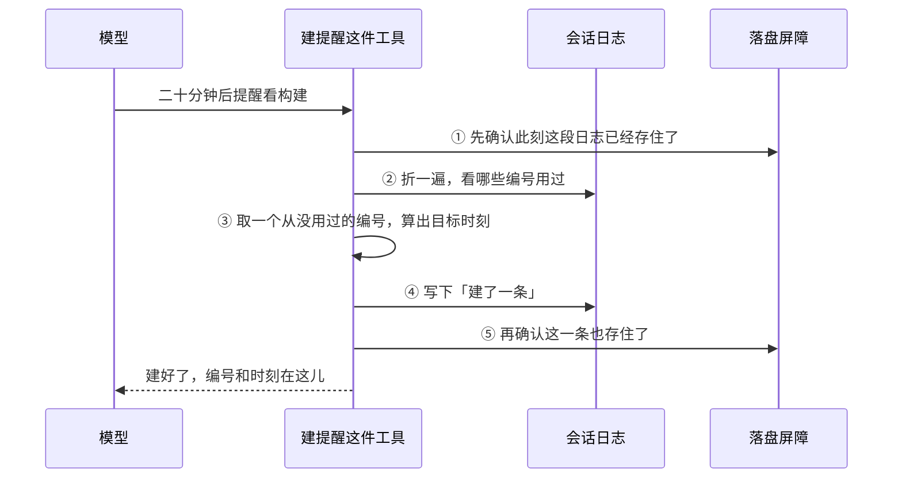
```mermaid
sequenceDiagram
    participant M as 模型
    participant T as 建提醒这件工具
    participant L as 会话日志
    participant S as 落盘屏障
    M->>T: 二十分钟后提醒看构建
    T->>S: ① 先确认此刻这段日志已经存住了
    T->>L: ② 折一遍，看哪些编号用过
    T->>T: ③ 取一个从没用过的编号，算出目标时刻
    T->>L: ④ 写下「建了一条」
    T->>S: ⑤ 再确认这一条也存住了
    T-->>M: 建好了，编号和时刻在这儿
```

两道屏障各挡一件事：

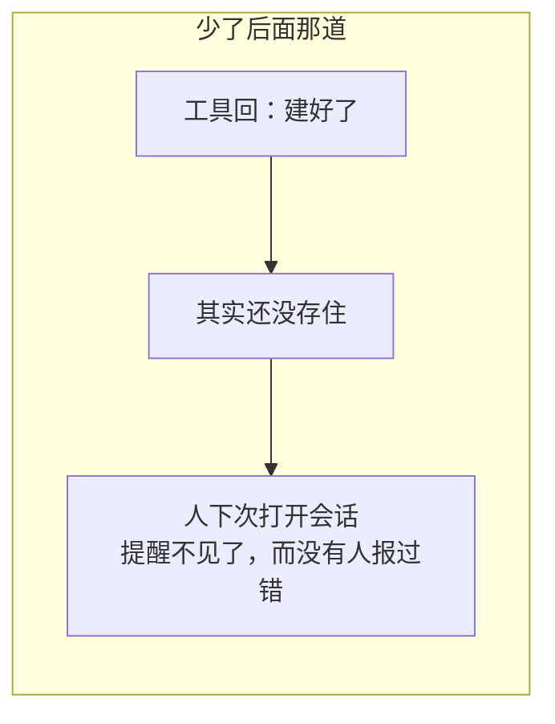
```mermaid
flowchart LR
    subgraph BAD["少了后面那道"]
        A1["工具回：建好了"] --> A2["其实还没存住"] --> A3["人下次打开会话<br/>提醒不见了，而没有人报过错"]
    end
```

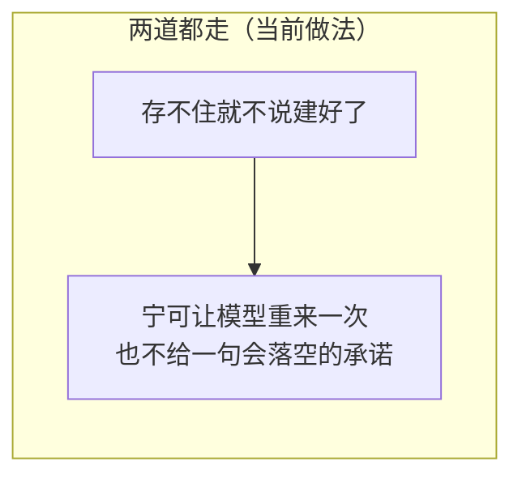
```mermaid
flowchart LR
    subgraph GOOD["两道都走（当前做法）"]
        B1["存不住就不说建好了"] --> B2["宁可让模型重来一次<br/>也不给一句会落空的承诺"]
    end
```

### 到点了：投递那一趟

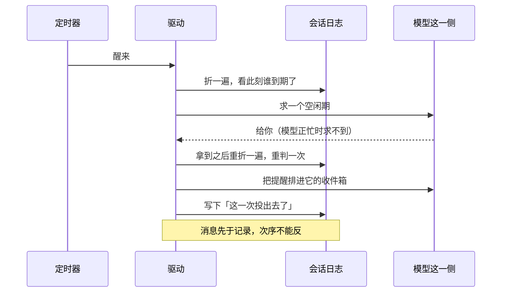
```mermaid
sequenceDiagram
    participant K as 定时器
    participant D as 驱动
    participant L as 会话日志
    participant A as 模型这一侧
    K->>D: 醒来
    D->>L: 折一遍，看此刻谁到期了
    D->>A: 求一个空闲期
    A-->>D: 给你（模型正忙时求不到）
    D->>L: 拿到之后重折一遍，重判一次
    D->>A: 把提醒排进它的收件箱
    D->>L: 写下「这一次投出去了」
    Note over D,L: 消息先于记录，次序不能反
```

拿到空闲期之后为什么要重来一遍：

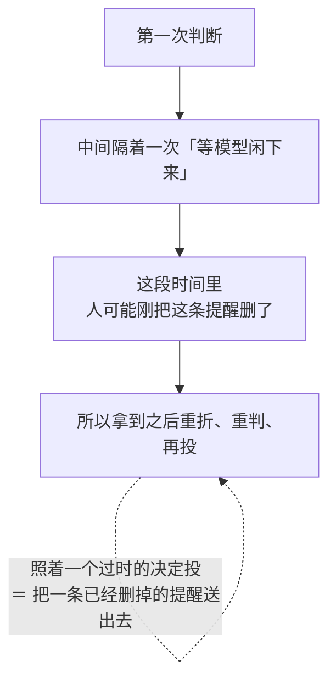
```mermaid
flowchart TD
    A["第一次判断"] --> B["中间隔着一次「等模型闲下来」"]
    B --> C["这段时间里<br/>人可能刚把这条提醒删了"]
    C --> D["所以拿到之后重折、重判、再投"]
    D -.->|"照着一个过时的决定投<br/>＝ 把一条已经删掉的提醒送出去"| D
```

消息和记录的次序：

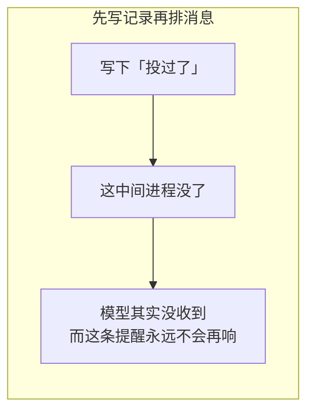
```mermaid
flowchart LR
    subgraph BAD2["先写记录再排消息"]
        A1["写下「投过了」"] --> A2["这中间进程没了"] --> A3["模型其实没收到<br/>而这条提醒永远不会再响"]
    end
```

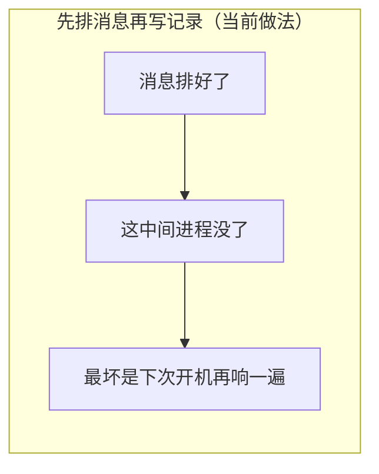
```mermaid
flowchart LR
    subgraph GOOD2["先排消息再写记录（当前做法）"]
        B1["消息排好了"] --> B2["这中间进程没了"] --> B3["最坏是下次开机再响一遍"]
    end
```

重复响一次，人一眼看得出来；永远不响，没有人会发现。

### 机器睡了三天，醒来只响最新那一次

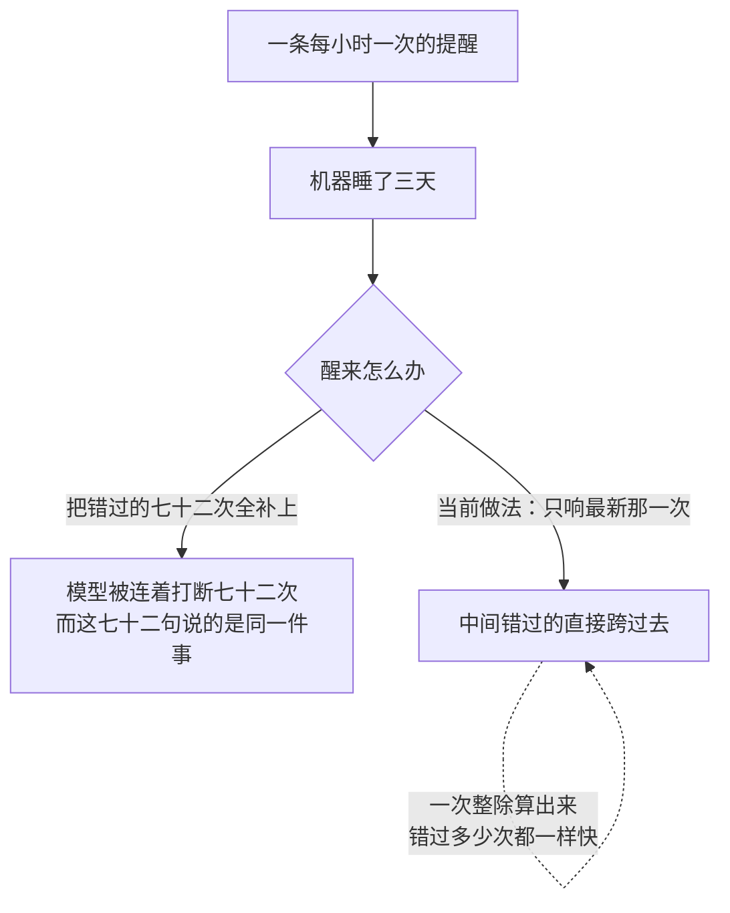
```mermaid
flowchart TD
    A["一条每小时一次的提醒"] --> B["机器睡了三天"]
    B --> C{"醒来怎么办"}
    C -->|"把错过的七十二次全补上"| D["模型被连着打断七十二次<br/>而这七十二句说的是同一件事"]
    C -->|"当前做法：只响最新那一次"| E["中间错过的直接跨过去"]
    E -.->|"一次整除算出来<br/>错过多少次都一样快"| E
```

投出去的那条记录带着「在哪一刻做的这个决定」，为的是让回放算出同一个答案：

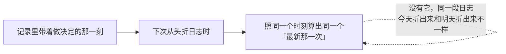
```mermaid
flowchart LR
    A["记录里带着做决定的那一刻"] --> B["下次从头折日志时"]
    B --> C["照同一个时刻算出同一个「最新那一次」"]
    C -.->|"没有它，同一段日志<br/>今天折出来和明天折出来不一样"| C
```

一次性提醒的那条记录**不许**带这个时刻。带了说明写它的一方把两种规则搞混了，而那条日志后面的每一次回放都会跟着错，所以它在读回来的那一步就被拒。

### 会话没开着就不响

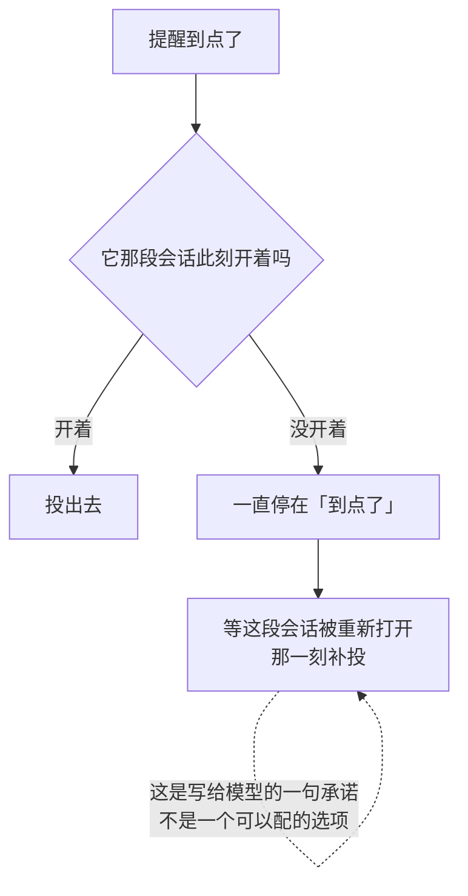
```mermaid
flowchart TD
    A["提醒到点了"] --> B{"它那段会话此刻开着吗"}
    B -->|"开着"| C["投出去"]
    B -->|"没开着"| D["一直停在「到点了」"]
    D --> E["等这段会话被重新打开<br/>那一刻补投"]
    E -.->|"这是写给模型的一句承诺<br/>不是一个可以配的选项"| E
```

---

## 时间这一段为什么这么小心

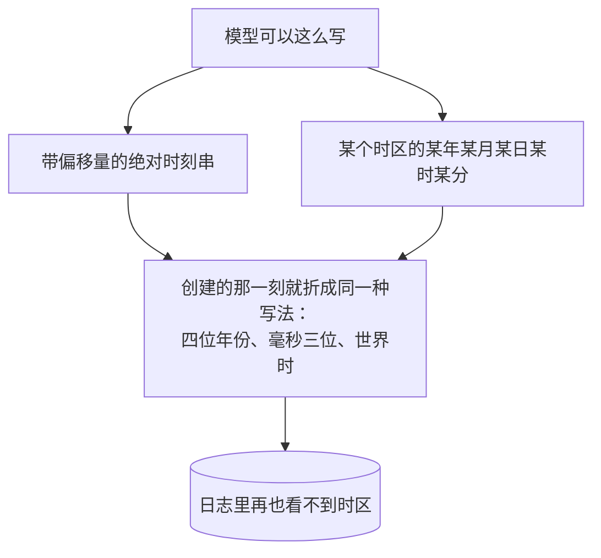
```mermaid
flowchart TD
    A["模型可以这么写"] --> A1["带偏移量的绝对时刻串"]
    A --> A2["某个时区的某年某月某日某时某分"]
    A1 --> N["创建的那一刻就折成同一种写法：<br/>四位年份、毫秒三位、世界时"]
    A2 --> N
    N --> L[("日志里再也看不到时区")]
```

折成一种写法的好处是：两个互为别名的时区名折出来是同一个瞬间，日志因此不必关心这台机器认不认得那个名字。

夏令时那两个坑各挡各的：

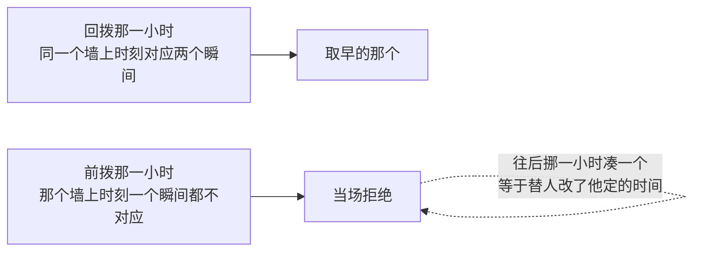
```mermaid
flowchart LR
    A["回拨那一小时<br/>同一个墙上时刻对应两个瞬间"] --> A1["取早的那个"]
    B["前拨那一小时<br/>那个墙上时刻一个瞬间都不对应"] --> B1["当场拒绝"]
    B1 -.->|"往后挪一小时凑一个<br/>等于替人改了他定的时间"| B1
```

编号也归在这一节里，因为它同样是「回放必须算出同一个答案」的一部分：

```mermaid
flowchart LR
    A["新编号从「一共用过多少个」往后取"] --> B["不是从「此刻还活着几条」"]
    C["删掉一条之后再建一条<br/>若重用了旧号"] -.->|"一条指着旧号的历史记录<br/>回放时会接到新提醒身上"| C
```

---

## 生命周期与并发

同一段会话上的提醒读写必须一件一件来：

```mermaid
flowchart TD
    subgraph BAD3["两次创建并排跑"]
        A1["各折各的日志"] --> A2["各算出同一个下一个编号"] --> A3["各写一条「建了」"] --> A4["回放时编号撞车<br/>整条日志当场作废"]
    end
```

```mermaid
flowchart LR
    subgraph GOOD3["一段会话一把闸（当前做法）"]
        B1["三件工具和那份定时器投影共用同一把"] --> B2["读写一件一件来"]
        B2 --> B3["还没轮到就被取消的那一次<br/>当场退出，一个字节都不写"]
    end
```

装和摘的次序是反过来的，而且不能将就：

```mermaid
flowchart TD
    A["装：一个新的顶层会话上台"] --> A1["三件工具 → 定时器投影 → 空闲钩子"]
    B["摘：钩子和工具先走，投影最后走"] --> B1["反过来的话，投影没了工具还在"]
    B1 --> B2["模型建的提醒会写进日志<br/>却永远没人来响，而它拿到的是一个成功的答复"]
```

驱动这一侧的三条：

```mermaid
flowchart TD
    C["驱动只有一条协程"] --> C1["一次一件，绝不并发"]
    D["紧挨着的多次重算请求"] --> D1["就地并成一次<br/>反正每次都会把日志重折一遍，结果一样"]
    E["定时器不一口气睡到目标时刻"] --> E1["分段睡，每段醒来重看一眼墙上时钟"]
    E1 --> E2["机器休眠、系统时间被人往前拨<br/>这几种情况下只错一段"]
```

模型正忙、求不到空闲期时：

```mermaid
flowchart TD
    A["求不到空闲期"] --> B{"怎么办"}
    B -->|"上个定时器过会儿再试"| C["重试多少次都一样求不到<br/>每一次还白折一遍日志"]
    B -->|"当前做法：等它自己静下来"| D["它一闲下来就补一次重算"]
```

每次干活之前先问两句「我还作数吗」：

```mermaid
flowchart LR
    A["干活之前"] --> A1["注册处认的还是我这段会话吗"]
    A --> A2["它此刻还是顶层的吗"]
    A1 --> B["有一句不成立就闭嘴"]
    A2 --> B
    B -.->|"不问的话<br/>会往一段不归它管的会话里写东西"| B
```

---

## 失败语义

```mermaid
flowchart TD
    A["出了岔子"] --> B{"哪一类"}
    B -->|"模型给的规则立不住<br/>正文是空的 / 时刻在过去 / 频率太密 / 时区不认得"| C["原样告诉模型哪儿不对<br/>它据此改一次再来"]
    B -->|"落盘证明不了"| D["不说建好了<br/>并让模型重新列一次清单再判断"]
    B -->|"这段提醒日志坏了"| E["这个会话的提醒从此不再响<br/>但会话本身照常跑"]
    B -->|"删一个不存在的编号"| F["不是错误<br/>回一句「没有这条」"]
```

日志坏了为什么不重试、又为什么不外露细节：

```mermaid
flowchart LR
    A["坏掉的日志不会自己好"] --> B["一直重试只会把同一句告警刷满"]
    C["报给模型的只有一句<br/>「这条流不可信」"] --> D["具体破了哪一条留给读日志的人"]
    D -.->|"那句话里有日志内部的形状<br/>模型拿它做不了任何事"| D
```

---

## 能力边界

```mermaid
flowchart TD
    Y["这个包做的"] --> Y1["把三种规则的提醒写进会话日志"]
    Y --> Y2["到点把它送进一段活着的会话"]
    Y --> Y3["跨过错过的那些，只响最新一次"]
    N["不做的"] --> N1["不是一台调度服务<br/>会话没开着就不响，没有任何外部唤醒"]
    N --> N2["不认 cron 表达式，也不认日历规则"]
    N --> N3["提醒不到别人的会话去"]
    N --> N4["不保证提醒之后那件事做成了<br/>它只保证话送到了"]
    N --> N5["不自己落盘<br/>那道屏障由装配方交进来"]
```

最后一条连着一句给装配方的要求：会话的事件词汇里必须并进本包那一种事件，否则读日志的一方会认为自己读到了一条不认识的必需事件。

## 对应的 DSH 能力

下表由 [`docs/packages.md`](../packages.md) 与 [能力覆盖表](../portmap/capability-coverage.tsv) 机器 join 得到：本篇覆盖的 Go 包，承接的是上游 DSH 的哪几条能力，以及各自还缺什么。落点列由源码里的 `// 源:` 注释反查，不是手写的。

| 上游能力 | DSH 包 | 裁决 | 落在哪个 Go 包 | 这里缺什么 |
|---|---|---|---|---|
| 为未来创建的live根agent提供三个会话范围内的工具管理持久提醒 | `schedule/schedule` | 需要 | `feature/schedule` | — |

## 相关源码

- `feature/schedule/domain.go`
- `feature/schedule/runtime.go`
- `feature/schedule/install.go`
- `feature/schedule/timeparse.go`
- `feature/schedule/invariant.go`
