# scope

`scope` 包的架构文档。全文只用代码里真实存在的名字：`Key`、`Scope`、`Layers`、`Layer`、`NamedEntries`、`AnonymousEntries`、`Carrier`。

---

## 定位

一个进程里同时活着很多 Agent，每个 Agent 可能挂在一个预设（persona / preset）下面。于是有了一棵树：

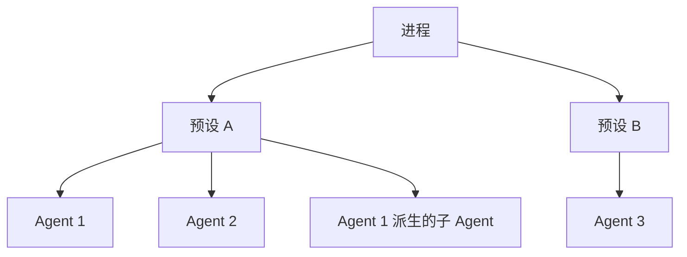

**树只有两级**：预设一级，Agent 一级。子 Agent 不在它父亲下面——`ApplyChildComposition` 走 `Roster.ComposeFrom`，认的是**父认的那份预设**，所以它是父的兄弟。父自己那层登记的东西，孩子一样看不见（`feature/subagent/childagent.go:230` 那段注释说的就是这件事）。

有了这棵树，两件事必须沿着它走，**方向相反**：

| | 方向 | 例子 |
|---|---|---|
| 注册物继承 | 往下 | 挂在预设 A 上的工具，Agent 1 和 Agent 2 都该看得见 |
| 事件传播 | 往上 | Agent 1 发出的事件，预设 A 的监听器该收到 |

`scope` 提供的就是这棵树本身，外加一条硬规则：**事件只往上，绝不往下**。

反过来会怎样：Agent 1 的事件先传到预设 A，再从预设 A 下发给 Agent 2 —— Agent 2 就看见了它兄弟的事件。兄弟之间本来就该互相看不见。

除此之外还有第二件事：**一个 Agent 关掉时，它开的东西要一起关掉**。这件事和树无关，但共用同一批身份对象，所以放在同一个包里。

### 它为什么长这样：DSH 的插件模型

这个形状不是凭空设计的。DSH 底下是 cordis 那套插件框架，**一样东西装进来就要能撤出去**——装一个插件要注册工具、提示词段落、监听器，卸载时得原样撤干净，而且只能影响装它的那个 Agent。`scope` 就是给这件事兜底的：注册往哪儿放（`Layers`）、卸载怎么撤（`Scope.Defer`）、谁看得见（`parent` 链）。预设那套（一个目录一份 yml，一行装一个插件）整个建在它上面。

Go 这边**没有运行期插件**——静态链接装不了没编译进来的包，所以 `Composer` 改成编译期登记。地基照搬了，上面暂时是空的：仓库里 `Config.Composers` 一个实现都没注册过。

---

## 架构

### 四个类型

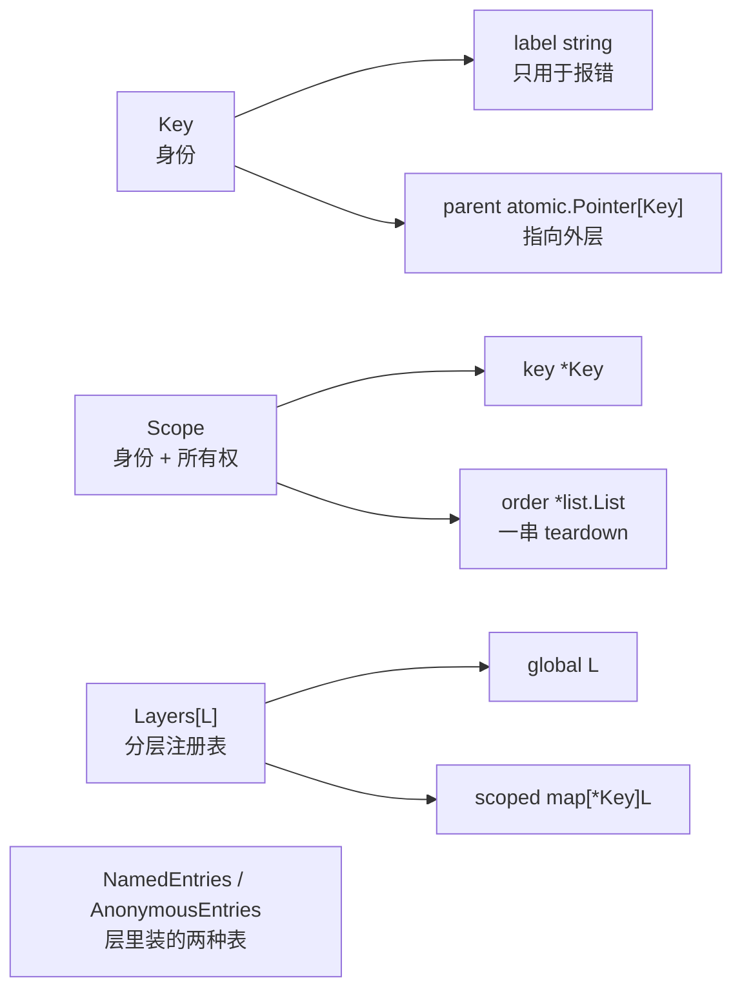

| 类型 | 文件 | 职责 |
|---|---|---|
| `Key` | `scope.go` | 身份。只有一个诊断名和一个指向父 `Key` 的原子指针 |
| `Scope` | `scope.go` | 一个 `Key` 加一串待跑的清理函数（`teardown`） |
| `Layers[L]` | `layers.go` | 一张注册表的分层存储：全局一份 + 每个 `Key` 一份 |
| `NamedEntries[V]` / `AnonymousEntries[V]` | `entries.go` | 层里可以装的两种表 |

`Key` 里**没有任何容器**——它不知道谁在用它，也不知道 `Layers` 里存了什么。

---

### `Key`：身份为什么是指针

`Key` 按指针比较。两个 `NewKey("agent")` 是两个不同的作用域，`label` 一点都不参与身份判定。

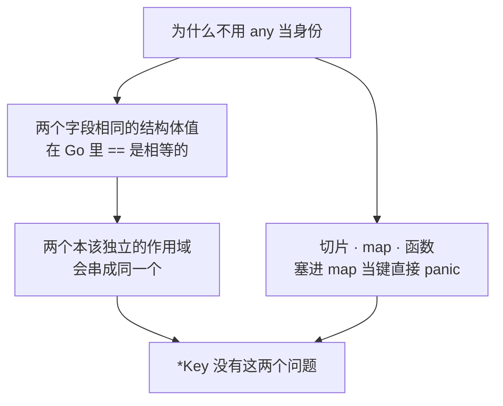

第二个理由更实际：`parent` 可以直接做成 `Key` 的字段。DSH（TypeScript 那份）用 `WeakMap` 在旁边记父链，因为它没法往别人的对象上加字段；Go 这边 `Key` 是自己的类型，两张全局 `WeakMap` 一张都不需要——既没有全局表要加锁，也没有生命周期问题。

`Key.String()` 特意带上内存地址，因为 `label` 不参与身份判定，两个同名的 `Key` 必须能在报错里分开。

---

### 父链：三条硬规则

#### `BindParent` 只能成功一次

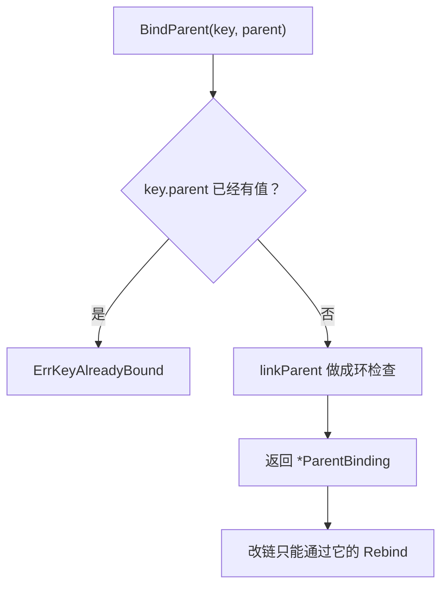

为什么锁得这么死：链决定了谁收得到谁的事件。任何拿到 `*Key` 的代码都能改链的话，它可以把一个 Agent 从它的预设下挪走，也可以把自己塞进别的预设下面偷看事件。所以归属只能由**当初把它接进来的那一方**改——那一方手里握着 `ParentBinding`。

`New(key, Options{Parent: p})` 这条便捷路径把 `ParentBinding` 当场丢掉了，所以走它建出来的链此后改不了。仓库里唯一需要改链的是 Agent 名册，它自己调 `BindParent`、自己收好 `ParentBinding`、再自己造 `Scope`。

#### 成环必须在写入时拦

`ChainOf`、`Admits`、`Layers.ChainLayers` 都要一路走到根，没有任何一处带深度上限或访问标记。所以环不能靠读的一侧兜住，只能在 `linkParent` 里拒绝。`Rebind` 走的是同一个函数，同样查。

#### 改链合不合法这个包不查

只有「旧父作用域下产出的东西全都没被留存」时改链才干净。`scope` 看不见一个会话记了什么、一张表里存了什么，所以这一条由持有 `ParentBinding` 的那一方保证。

---

### 事件路由：`Admits` 一个函数说了算

```go
func Admits(listenerTag, dispatchKey *Key) bool
```

从 `dispatchKey` 沿 `parent` 往上爬，看路上有没有撞见 `listenerTag`。**永远不从 `listenerTag` 往下找**——方向性就是这么来的。

| `listenerTag` | `dispatchKey` | 结果 |
|---|---|---|
| `nil` | 任何 | `true`（没声明作用域，收全部） |
| 预设的 `Key` | 它底下 Agent 的 `Key` | `true` |
| Agent 的 `Key` | 它自己 | `true` |
| Agent 的 `Key` | 它所在预设的 `Key` | `false` |
| Agent 甲的 `Key` | Agent 乙的 `Key` | `false` |
| 任何非 nil | `nil` | `false` |

#### `Carrier[T]`：只暴露路由键，不暴露内容

`Target(subject, key)` 造一个 `Carrier[T]`。`subject` 是非导出字段，拿到 `Carrier` 的人取不出它——只能问 `Key()` 和 `Admits()`。DSH 用一个品牌类型 `Scoped<T>` 达到同样效果，Go 里非导出字段直接就够了。

`TargetFiltered` 多带一个基础过滤器，它先跑，否决了就直接不收，`Admits` 不再参与——对象自己那份可见性判断优先级更高，作用域只在它之上再收窄。

`CarrierKeyOf` 返回两个值，第二个区分「不是 Carrier」和「是 Carrier 但无作用域」——两者的 `key` 都是 `nil`，而分派侧的检查恰恰要靠这个区分：一个本该带 `Carrier` 分派的事件如果压根没带，那是必须报出来的错误。

#### 这套判定目前没有调用方

`Admits` 和 `Carrier` 能力完整、测过，但仓库里没有任何非测试代码调用它们。

真正在跑的路由走的是第 6 节那条路：监听器按作用域存进 `Layers`，派发时把 `Global()` 和 `ChainLayers()` 的结果接起来。两条路效果一样——等价的过滤由「这个监听器登记在哪一层」完成，而不是由「它带什么 `listenerTag`」完成。

---

### `Layers[L]`：分层注册表

**先说清「层」是什么**：一个 `Key` 名下的那批登记，就是一层。预设的 `Key` 名下挂了五个工具，那五个就是预设这一层；Agent 自己又注册了两个，那两个是 Agent 这一层。还有一层没有 `Key`，叫 `global`，宿主装配时注册的东西落在那里，谁都看得见。

一个 Agent 能用的 = `global` 那一层 + 所有祖先的层 + 自己这一层。

`Layers` 就是这些层的总表：一个 `global`，加一张 `map[*Key]层`。层里装什么由使用方给的 `L` 决定，`Layers` 只管叠放结构。

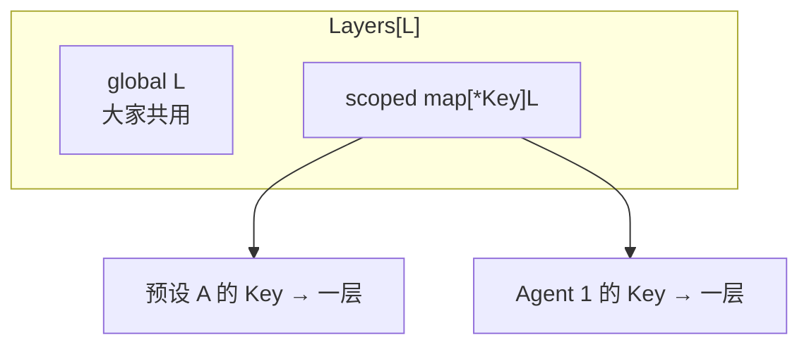

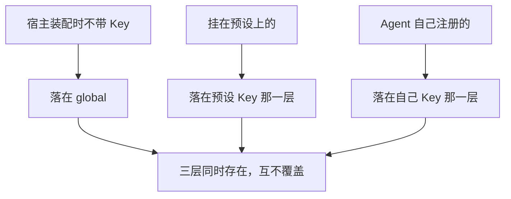

#### 三个读入口，用途各不相同

| 方法 | 看父链吗 | 用来回答 |
|---|---|---|
| `Global()` | — | 大家共用的那一份 |
| `Peek(key)` | **不看** | 「这个作用域**自己**贡献了什么」 |
| `ChainLayers(key)` | 看 | 「这个作用域**能看见**哪些层」，远祖在前、自己在最后 |

`Peek` 故意不看父链：问「这个 Agent 自己配了哪些限制、哪些守卫」的人，不该被悄悄塞进祖先那一份。要继承就明确说要继承。

`ChainLayers` 的顺序是反过来的（`ChainOf` 给的是近的在前），因为调用方要按这个顺序依次叠加，最近的那个作用域说了算。

#### 三条不变式

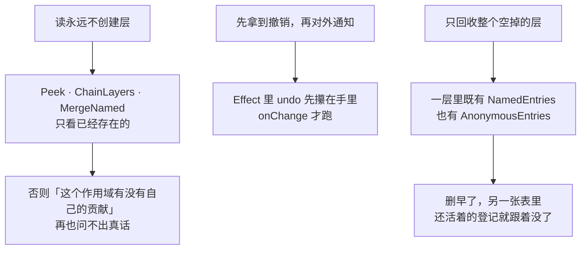

#### `MergeNamed`：同名覆盖只改值，不挪位置

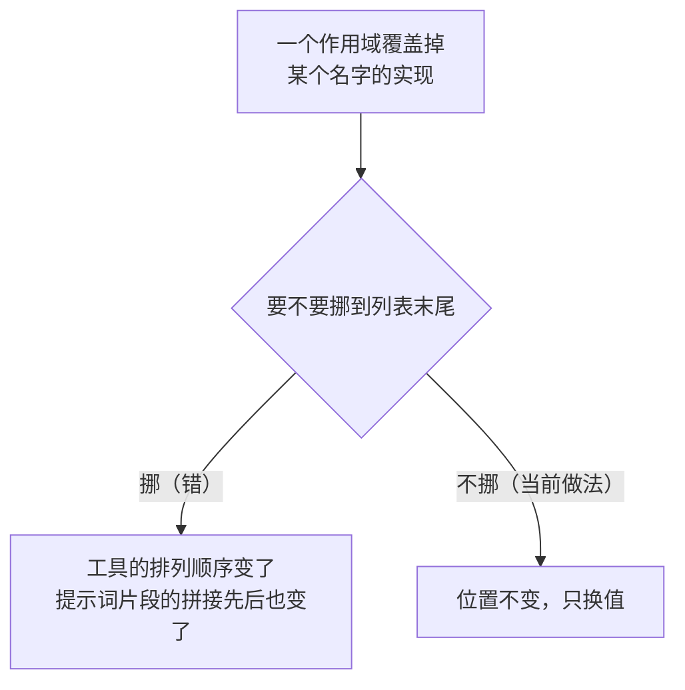

`MergeNamed` 写成自由函数而不是 `Layers` 的方法，因为 Go 的方法不能再带自己的类型参数，而值的类型 `V` 和层的类型 `L` 本来就是两回事。

返回的是 `[]NamedValue[V]` 而不是 map：顺序**就是语义**，而 Go 的 map 没有顺序。

---

### `Layers.Effect`：登记和撤销一起挂

这是全仓库 41 张表的登记方法内部共用的那一个。

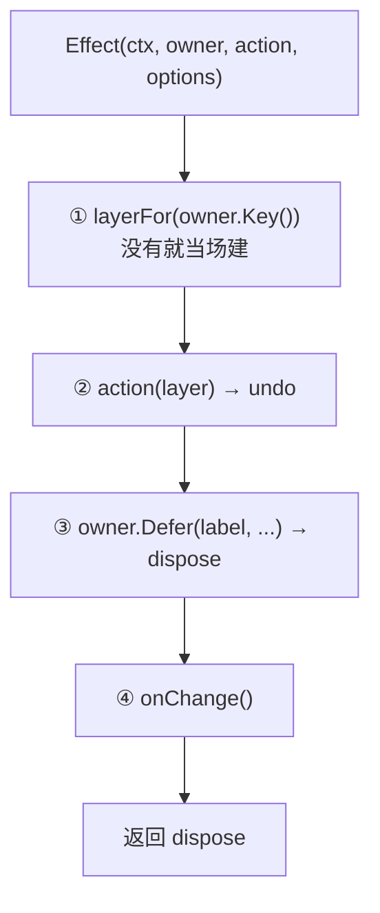

第 ①步的分支就是「宿主装配的东西对所有作用域可见」的实现方式：`owner` 是 `NewRoot()` 造的，`Key()` 返回 `nil`，`layerFor` 直接返回 `global`。

#### 每一步失败都原路退回，不留半截状态

| 哪一步失败 | 怎么退 |
|---|---|
| `action` | 若这一层是刚建的且现在是空的就删掉；**已存在的层绝不删** |
| `Defer`（owner 已释放） | 跑 `undo`，然后同上 |
| `onChange` | 跑一遍完整的 `dispose`（undo + 回收 + 再通知），然后报 `onChange` 的错 |

第 ③ 步必须在第 ④ 步之前：先把 `undo` 攥在手里再对外说。反过来的话，`onChange` 一旦失败，这次登记就成了一份**撤不掉**的东西。

回滚走的是同一个 `dispose`，所以回滚和正常释放是同一条代码路径，不会各走各的。

#### `reclaimIfEmpty` 的两个条件

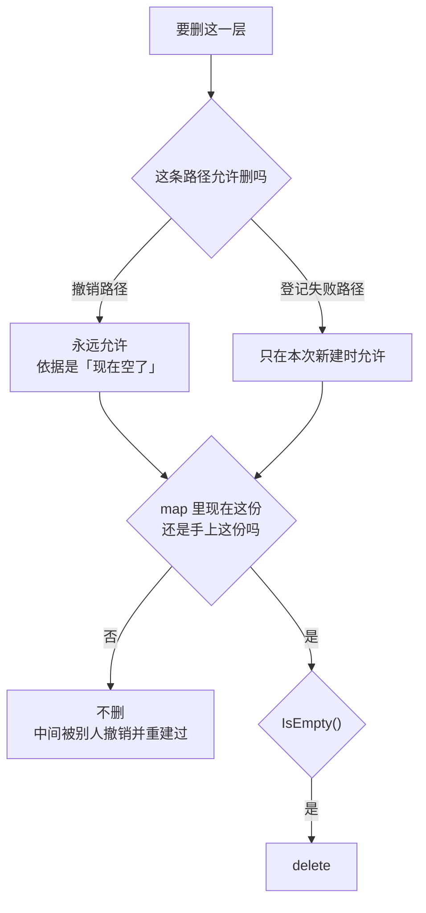

`Layer` 接口的约束里带 `comparable`，就是为了做 `current != layer` 这次身份比较——写进约束是编译期保证，而不是运行时才 panic。

---

### `NamedEntries` 与 `AnonymousEntries`

`Layer` 里装什么由使用方决定，包里给了两种现成的表。

| | `NamedEntries[V]` | `AnonymousEntries[V]` |
|---|---|---|
| 有名字 | 有，必须唯一 | 没有 |
| 重复登记 | 返回 `DuplicateNameError` | 允许，每次是独立的一份 |
| 登记方法 | `Insert(name, value)` | `Append(value)` |
| 用在哪 | 工具、Skill、斜杠命令：一个名字一份实现 | 观察者、中间件、拦截器：只有先后，本来就允许重复 |
| 非测试引用 | 11 处 | 72 处 |

#### 三条共用约定

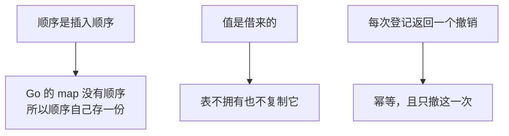

#### 重名报什么话由调用方给

`NewNamedEntries` 收一个 `duplicateError func(name string) error`。表自己不知道它装的是工具还是 Skill，所以诊断文字是构造时传进来的：

「工具 echo 已经注册过了」比「名字 echo 重复」有用得多。

#### 遍历是快照

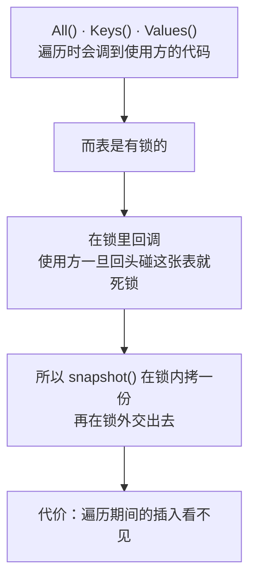

---

### `Scope`：所有权边界

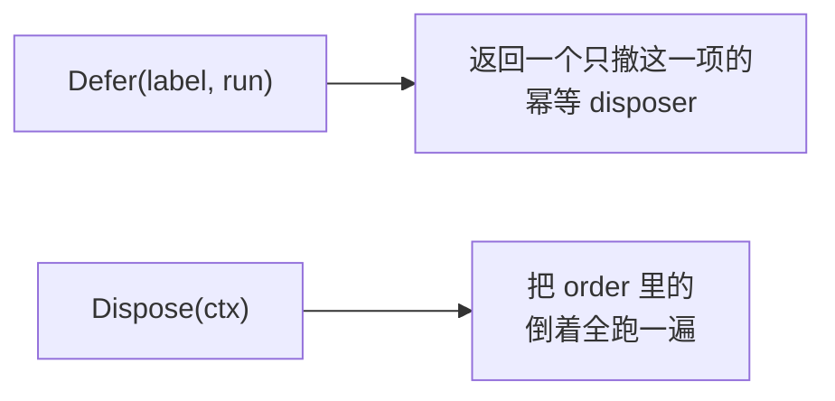

#### 为什么用 `container/list` 而不是切片

一项清理在整个作用域释放之前被单独撤掉是常事（`Defer` 返回的那个 disposer）。链表删除是 O(1)，而且不打乱其余顺序。

#### 后进先出

后登记的东西可能依赖先登记的。正着跑会让一项清理在它依赖的东西已经没了之后才执行。

#### 全部跑完，错误 `errors.Join` 合起来

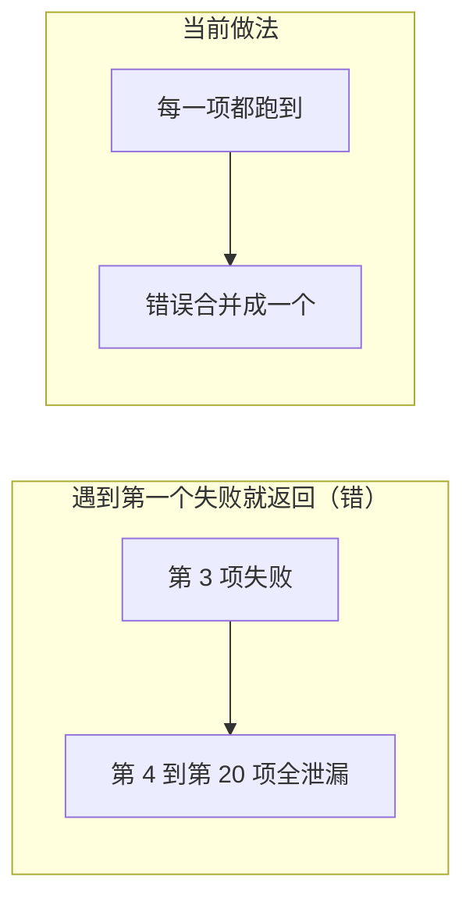

#### 幂等且并发共享

`Dispose` 靠 `sync.Once`：重复调用、并发调用，都等同一次完成并拿到同一个错误。并发时第一个进来的那个 `ctx` 决定超时，其余调用方的 `ctx` 不参与。

#### 已释放的作用域上再 `Defer` 会报错

返回 `ErrScopeDisposed`。静默放行的话那份清理永远跑不到，也就是资源泄漏，而且没有任何症状。

#### 单项 disposer 与整体 `Dispose` 的竞争

`Dispose` 把每个链表元素的 `Value` 置为 `nil`，单项 disposer 靠 `element.Value != nil` 判断这一项还在不在。

只调 `order.Init()` 是不够的：那只重置链表头尾，元素自己仍然认为它在链表里，于是一个在释放**之后**才被调到的单项 disposer 会去 `Remove` 一个已经不在链上的元素，把链表长度改成负数。

#### `NewRoot()`：没有身份的 `Scope`

`Key()` 返回 `nil`。它照样拥有登记在它上面的清理，但不参与任何路由，往 `Layers` 上登记时落在 `global`。

这是全仓库最常见的用法——大多数调用方要的只是一摞会一起跑掉的清理，并不需要参与路由。

---

### 可见性和拆解责任是分开的

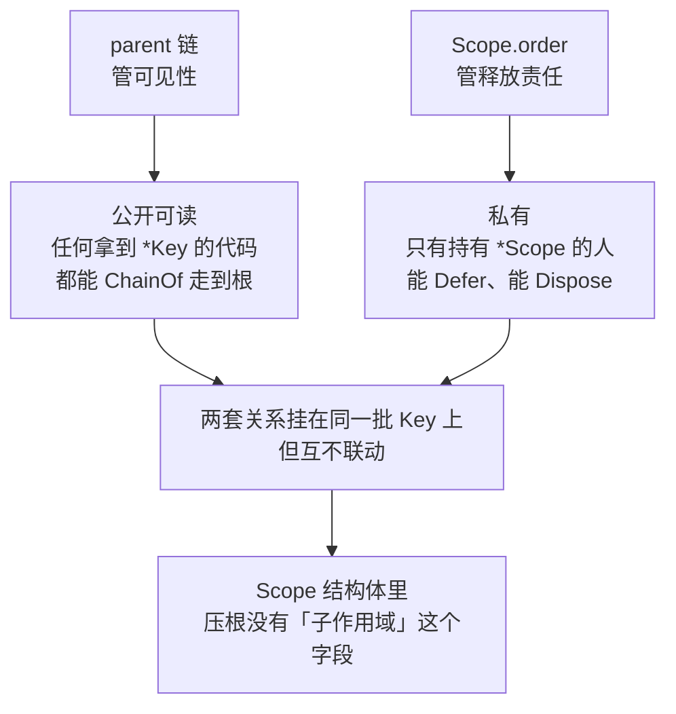

**关掉父作用域不会关掉子作用域。**

为什么不做级联：

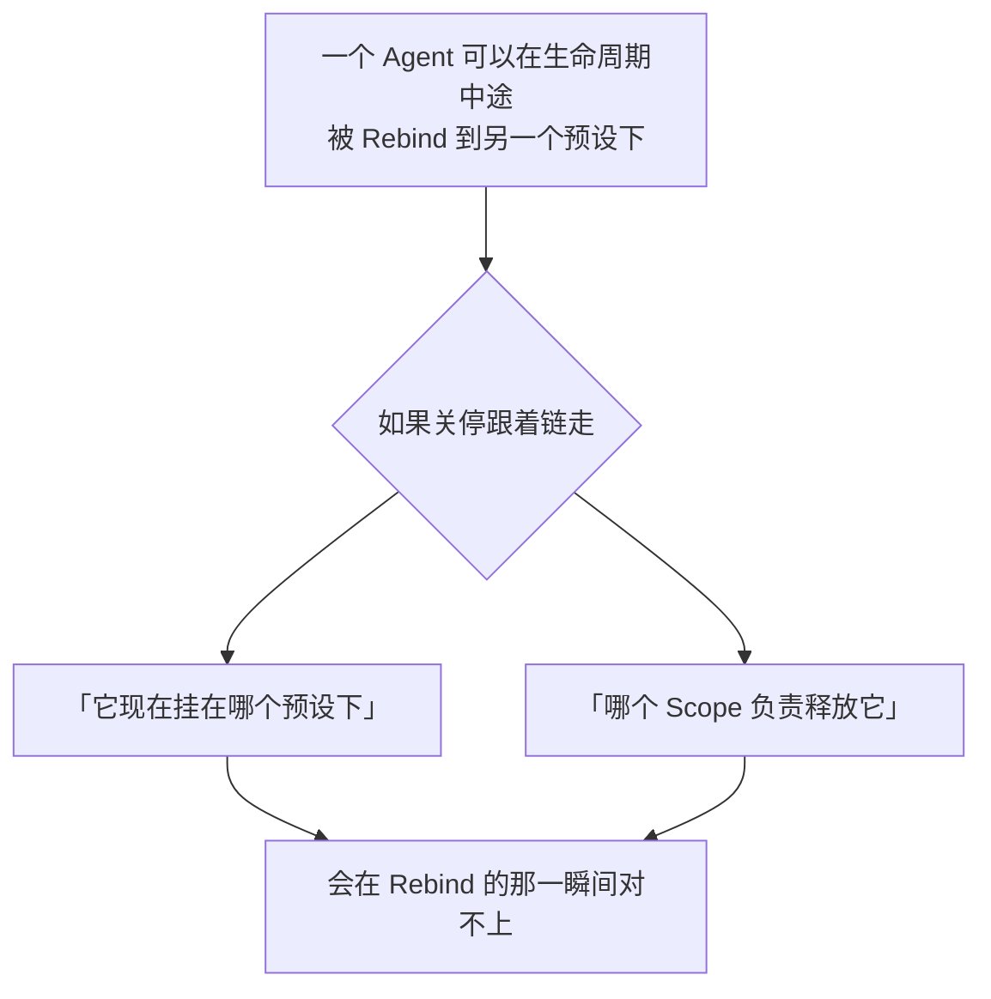

拆开之后，`Rebind` 只影响可见性，不影响任何已经发出去的 `dispose`。

要「预设倒了，它底下的 Agent 也倒」，那是上层显式把子 `Scope.Dispose` 用父 `Scope.Defer` 挂上去。这个包不替它做。

---

## 生命周期与并发

DSH 是单线程 JS，链和表都不需要并发保护。Go 这边会被多个 goroutine 同时碰，所以下面这些是 Go 侧的必需品，不是照录来的。

### 父链：原子读，包级锁写


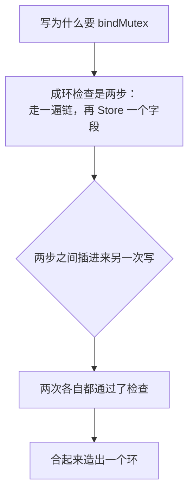

`bindMutex` 是包级的，全进程所有作用域树的链写入都在它上面排队。可以接受：改链只发生在作用域诞生、或一个 Agent 换预设时，不在任何热路径上。

### 两处刻意放在锁外

`Scope.Dispose` 跑清理函数、`NamedEntries` 遍历时的回调。这两处是使用方代码回头碰同一个对象最可能的地方，在锁里跑就自锁了。

---

## 失败语义

| 错误 | 什么时候 | 怎么办 |
|---|---|---|
| `ErrKeyAlreadyBound` | 给一个已有父的 `Key` 调 `BindParent` | 改链要用当初的 `ParentBinding.Rebind` |
| `ErrParentCycle` | 这次连接会成环 | 检查层级，父不能是自己的后代 |
| `ErrScopeDisposed` | 往已释放的 `Scope` 上 `Defer` | 查是不是拆解顺序反了 |
| `DuplicateNameError` | `NamedEntries.Insert` 重名 | 换名字 |
| `errNilCreateLayer` 等四条 | 必填函数传了 nil | 补上参数 |

`Dispose` 返回的是 `errors.Join` 合并后的错误，不是第一个失败——所有清理都会被跑到。

---

## 能力边界

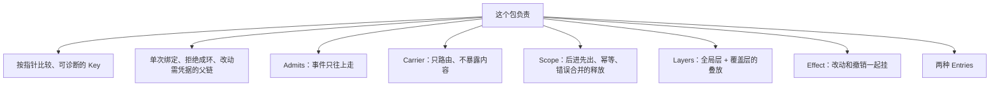

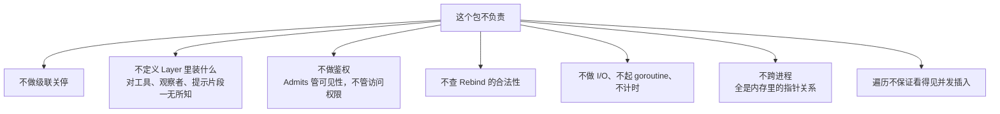

没有超时、没有 TTL、没有后台回收。层的回收是 `reclaimIfEmpty` 在撤销时顺带做的，不是定时扫的。

---

## 谁在用它

50 个包在非测试代码里引用 `scope`。

| 用的是哪一面 | 引用方 | 规模 |
|---|---|---|
| `Scope`（所有权边界） | 几乎所有包 | 199 处；`NewRoot()` 是最常见的构造 |
| `Layers` | 10 个包各一套 | `Effect` 44 处 |
| `NamedEntries` / `AnonymousEntries` | 同上，作为 `Layer` 的内容 | 匿名 72 处，具名 11 处 |
| `BindParent` / `Rebind` | 只有 Agent 名册 | 各 4 处 |
| `ChainOf` | Skill 目录：父链参与缓存键 | 1 处 |
| `ParentOf` | Agent 名册：从 Agent 反查它认了哪份预设 | 1 处 |
| `Admits` / `Carrier` | **没有调用方** | 0 |

那 10 套 `Layers` 里一共 41 张表。数量最多的三个：

| 包 | 张数 | 内容 |
|---|---|---|
| `harness/agent` | 12 | Agent 建好/摘除、状态跳变、Inbox 进出、每步开始前、模型请求前后、回合收尾/出错 |
| `tools` | 7 | 工具定义、限制、守卫、执行前/派发/执行后规则、结果观察者 |
| `harness/systemprompt` | 6 | 提示词片段、上下文、变量提供方、抑制器、工具提供方、装配规则 |

其余七个包共 16 张：活会话 4、子 Agent 4、后台作业 3、Skill 2、斜杠命令 1、审批应答 1、目标变化 1。

41 张里 7 张是 `NamedEntries`（装数据，按名字查，近的盖远的），34 张是 `AnonymousEntries`（装函数，到点了按登记顺序挨个调）。

---

## 没有照录 DSH 的部分

DSH 侧这个包大半篇幅在处理 cordis（它自研的依赖注入 / 插件框架）。那部分不照搬，换成 Go 里的直接对应物：

| DSH（cordis） | Go |
|---|---|
| Context 上的作用域标签 + 派生上下文继承 | `Scope` 自己持有 `Key`，没有隐式继承 |
| `ctx.plugin()` 起的 fiber | `Scope.order`，后进先出 |
| `ctx.effect()` 登记的副作用 | `Scope.Defer`，disposer 语义相同 |
| `Context.filter` 分派钩子 | `Carrier` 与 `Admits`，纯判定函数 |
| 侧挂父链和载体键的两张 `WeakMap` | 直接做成 `Key` 的字段 / 一次类型断言 |

保留下来的是**行为**：单次绑定、成环拒绝、链的走法、准入方向、释放的幂等与顺序。

---

## 对应的 DSH 能力

下表由 [`docs/packages.md`](../packages.md) 与 [能力覆盖表](../portmap/capability-coverage.tsv) 机器 join 得到。落点列由源码里的 `// 源:` 注释反查，不是手写的。

| DSH 能力 | DSH 包 | 裁决 | 落在哪个 Go 包 | 这里缺什么 |
|---|---|---|---|---|
| 带作用域的注册原语，为每个存活agent创建一个作用域 | `core/scope` | 需要 | `scope` | — |

## 相关源码

| 路径 | 内容 |
|---|---|
| `scope/scope.go` | `Key`、`ParentBinding`、`Admits`、`Carrier`、`Scope` |
| `scope/layers.go` | `Layer`、`Layers`、`MergeNamed`、`Effect`、`reclaimIfEmpty` |
| `scope/entries.go` | `NamedEntries`、`AnonymousEntries` |
| `scope/bench_test.go` | 关停路径的压力基线，数字见[性能与压力基线](../performance-baseline.md) |

---

## 深入阅读

[Agent](agent.md) · [活会话](livesession.md) · [Tools](tools.md) · [Agent 预设与 Persona](presets.md)
