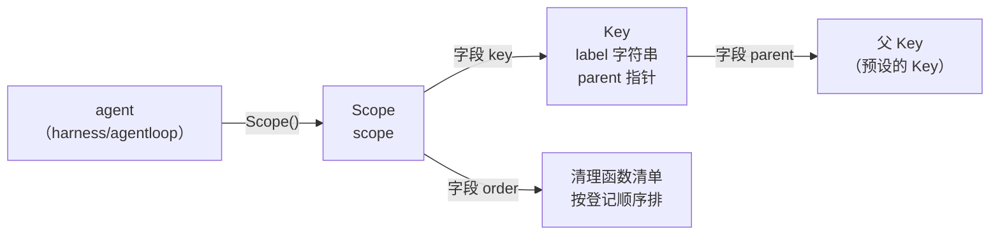
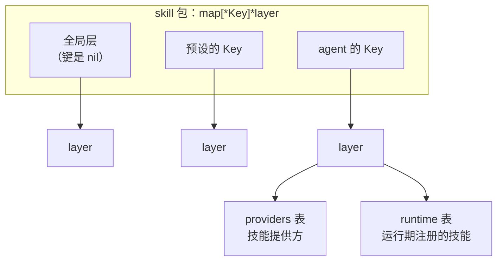
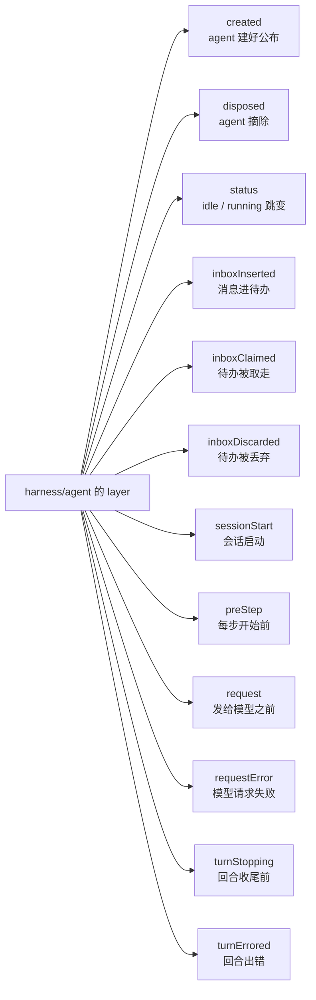
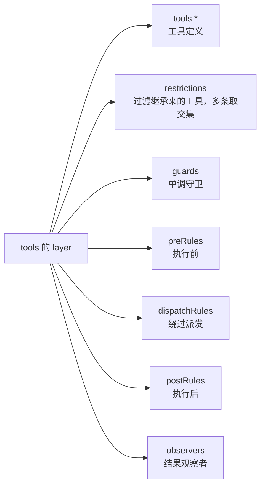
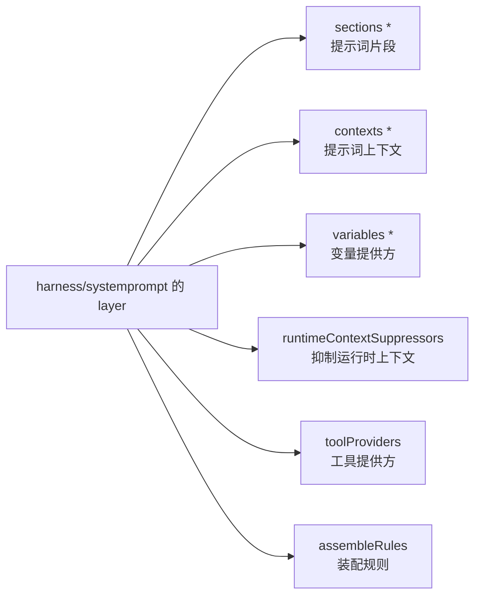
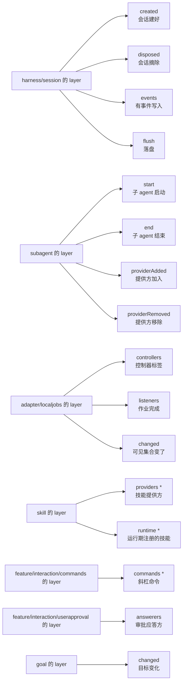
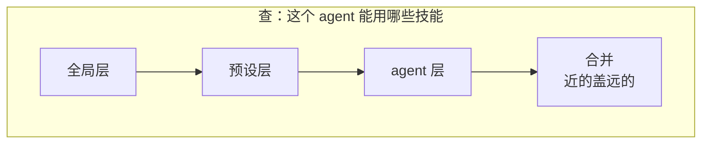

# scope

本文只讲 `scope` 一个包。用它搭出来的东西——工具运行时、Skill 目录、Agent 名册、活会话注册表——各有各的文档，不在这里。

---

## 它管什么

两件事，就这两件：

1. **一个 agent 能看见哪些工具、哪些 Skill、哪些提示词片段、哪些观察者。**
2. **这个 agent 关掉的时候，哪些东西要跟着一起清掉。**

---

## 对象和关系

整个包只有三个对象：`Key`、`Scope`、`Layers`。第四个 `Entries` 是使用方往层里放的表。

### 一、agent 这边持有什么

`Key` 里没有任何容器，就一个诊断用的名字和一个指向父 `Key` 的指针。`Scope` 里除了这把 `Key`，只有一张清理函数清单，agent 关掉时倒着跑一遍。

### 二、这把 Key 在 10 个 map 里各占一层

10 个包各建一个 `map[*Key]*layer`。同一把 `Key` 会同时出现在这 10 个 map 里，各自查出一个只属于这个包的层。层里装什么由这个包自己定，`scope` 一无所知。

### 三、一个 map 内部长什么样

以 `skill` 为例：

宿主装配时不带 `Key`，装出来的东西落在全局层；挂在预设上的落在预设那一层；agent 自己注册的落在自己那一层。三层同时存在，互不覆盖。

### 三点五、10 个层里的 41 张表

`skill` 那两张是最小的。下面是全部 41 张，带 `*` 的是**有名字的表**（一个名字一份，重名报错），其余是**没名字的表**（允许重复，只讲先后）。

`harness/agent` 的层，12 张（`observer.go:198`）：

`tools` 的层，7 张（`runtime.go:95`）：

`harness/systemprompt` 的层，6 张（`registry.go:56`）：

其余七个包，共 16 张：

7 张有名字，34 张没名字，合计 41。

有名字的装的是数据——工具、技能、命令、提示词片段，按名字查，agent 自己那份盖住预设那份。没名字的装的是函数——到点了按注册顺序挨个调，同一个时机挂几个都行。

### 四、查的时候往上走，事件也往上走

查询从 `Key` 沿 `parent` 指针一路走到根，把路上每一层取出来，**远祖在前、自己在最后**交给调用方，调用方依次叠加。同名的后面盖前面，所以 agent 自己配的盖住预设配的。

事件走的是同一条链，方向相同——从事件发出的那把 `Key` 往上爬。预设上的监听器收得到它底下 agent 的事件；agent 上的监听器收不到预设的事件，也收不到兄弟 agent 的事件。

---

## 为什么需要它

一个进程里同时活着很多 agent：主 agent 派生的子 agent、挂在不同预设下的 agent。这就有了层级。

层级一出现，两件事必须顺着它走，而且方向相反：

- **注册的东西往下传。**挂在预设上的工具、限制、提示词，它下面每个 agent 都该看得见，不用逐个重配。
- **发生的事往上报。**某个 agent 发出的动静，它自己的监听器要收到，它所在预设的监听器也要收到。

仓库里有 **10 个包**各建了一套分层注册表来回答"一个作用域能看见哪些登记"这个问题，层里一共 **41 张登记表**。它们的叠加逻辑一模一样，所以放在一处，不用各写一遍。

第二件是清理。需要在关停时释放资源的地方——agent、会话、观察者登记、通道、持久化编排器——各自往自己的作用域上挂一份清理函数，关停就是把这摞函数跑完。

---

## 能力一：算出一个作用域能看见什么

每张注册表都长成"全局一份 + 每个作用域自己一份"。查的时候，把全局那份和这个作用域父链上**已经存在**的各份取出来，按**远祖在前、自己在最后**的顺序交给调用方，调用方依次叠加，**近的盖远的**。

**同名覆盖只改值，不挪位置。**一个作用域覆盖掉某个工具的实现，不该顺带把它挪到列表末尾去。位置决定了工具的排列顺序和提示词片段的拼接先后。

**读永远不会顺手建一层。**问"这个作用域能看见什么"不会给它凭空造出一份贡献。否则"这个作用域到底有没有自己的东西"这个问题就再也问不出真话了。

**问"自己有什么"和问"能看见什么"是两个入口。**前者故意不看父链——查"这个作用域自己配了哪些限制、哪些守卫"时，不该被悄悄塞进祖先那一份。要继承得明确说要继承。

---

## 能力二：决定一个事件送到哪些监听器

判定只有一条走法：**从事件发出的地方往上爬，看路上有没有遇到这个监听器所属的作用域。永远不从监听器往下找。**

| 监听器挂在 | 事件从哪发出 | 收得到吗 |
|---|---|---|
| 没声明作用域 | 任何地方 | 收得到 |
| 预设 | 它底下的 agent | 收得到 |
| agent | 它自己 | 收得到 |
| agent | 它所在的预设 | **收不到** |
| agent 甲 | agent 乙（兄弟） | **收不到** |

关键在倒数第二行。如果预设的事件会往下流到它底下每个 agent，那么甲发的事先上传到预设，再从预设下传到乙，乙就间接看见甲了。

**这套判定目前没有调用方。**这个包提供了完整的准入判定和一个"只路由、不暴露内容"的事件载体，但仓库里没有任何非测试代码调用它们（只有 `jobs` 的包注释提了一句）。

真正在跑的路由走的是另一条路：观察者按作用域分层存着，派发时把全局层和父链上各层的名单接起来。**等价的过滤是由"这个观察者登记在哪一层"完成的，而不是由"这个观察者带什么标签"完成的。**两条路效果一样，代价不同——前者每个监听器判一次，后者每次派发走一遍链拼名单。仓库选了后者。

---

## 能力三：把清理收在一起

一个作用域就是一摞待跑的清理函数。往上挂一份，换回一个"单独撤掉这一份"的能力；整体关掉就是把这摞跑完。

**倒着跑。**后登记的先跑，因为后登记的东西可能依赖先登记的。正着跑会让一项清理在它依赖的东西已经没了之后才执行。

**全部跑完，错误合起来报。**遇到第一个失败就返回的话，剩下的资源全泄漏了。

**释放之后再往上挂，当场报错，不静默接受。**放行的话那个清理函数永远不会被跑到——资源静默泄漏，而且**没有任何症状**。报错至少能查。

**整体释放和单项撤销，两种先后顺序都必须安全。**这两个能力由不同的调用方各自持有，先后顺序没有保证。所以整体释放之后才被调到的单项撤销，什么都不做，而不是崩掉。

**清理函数跑在锁外。**一个清理函数很可能回头碰同一个作用域（比如撤销它挂的另一项）。在锁里跑就自锁了。

---

## 能力四：登记一次改动，同时把撤销挂好

那 41 张登记表的 `OnXxx` 方法内部都是它。

一次登记做四件事，顺序是刻意的：

1. 按登记者的身份找到该落在哪一层。**没有身份的落在全局层**——这就是"一个不带作用域的宿主装配出来的东西对所有作用域可见"的实现方式；有身份的落在它自己那层，没有就当场建。
2. 跑登记动作，换回一个撤销。
3. **把撤销挂到登记者自己的作用域上。**
4. 再对外通知"这张表变了"。

**第 3 步必须在第 4 步之前。**先把撤销攥在手里，再对外说。反过来的话，通知那一步一旦失败，这次登记就成了一份无法撤销的东西。

---

## 两类登记表

层里装什么由使用方决定，包里给了两张现成的表。

|  | 具名表 | 匿名表 |
|---|---|---|
| 有名字 | 有，且必须唯一 | 没有 |
| 重复登记 | 报错 | 允许，每次是独立的一份 |
| 用在哪 | 工具、Skill、命令这类"一个名字一份实现" | 观察者、中间件、拦截器这类"只有先后，本来就允许重复" |
| 非测试引用 | 11 处 | 72 处 |

两张表共用三条约定：**顺序是插入顺序**（使用方按登记先后决定生效次序，而 Go 的 map 没有顺序，所以顺序必须自己存）；**值是借来的**，表不拥有也不复制；**每次登记换回一个只撤这一次的幂等撤销**。

**重名报什么话由调用方给。**这张表自己压根不知道它装的是工具还是 Skill，所以诊断信息是构造时传进来的。「工具 echo 已经注册过了」比「名字 echo 重复」有用得多。

**遍历是快照，不是实时视图。**遍历的过程中会调到使用方的代码，而这张表是有锁的——在锁里回调使用方，使用方一旦回头碰这张表就是死锁。所以先在锁内拷一份顺序，再在锁外交出去。代价是遍历期间的插入看不见，换来的是不死锁、也不会在遍历中途被并发修改弄乱。

---

## 可见性和拆解责任是分开的

**关掉一个父作用域，不会连带关掉它的子作用域。**

父链管可见性，它是公开可读的，任何拿到身份的代码都能一路走到根。清理摞管释放责任，它是私有的，只有持有那个作用域的调用方能往上挂、能把它拆掉。这两套关系挂在同一批身份上，但互不联动——作用域这个结构体里压根没有"子作用域"这个字段。

**一个 agent 可以在生命周期中途被改挂到另一个预设下面。**如果关停跟着链走，那么"这个 agent 现在挂在哪个预设下"和"哪个作用域负责释放它"会在改链的那一瞬间对不上。

拆开之后，改链只影响可见性，不影响任何已经发放出去的拆解责任。

要"预设倒了，它底下的 agent 也倒"，那是上层显式把子作用域的关停挂到父作用域上。这个包不替它做。

---

## 身份是指针，不是名字

两个用同一个名字造出来的作用域是**两个不同**的作用域。名字只用于报错和看日志，一点都不参与身份判定。

做成一个专门的不透明类型、按指针传，有两个理由：

**拿任意值当身份会出事。**两个字段相同的结构体在 Go 里**比较相等**，两个本该独立的作用域会串成一个；而切片、map、函数这类不可比较的值当键会直接崩。指针没有这两个问题。

**父链能直接做成字段。**身份是自己定义的类型，可以往上加字段，不需要另外拿全局表侧挂父链——既没有全局表要加锁，也没有生命周期问题。

报错信息里特意带上地址，也是因为名字不参与身份：两个同名的作用域必须能在报错里区分开，否则一条「父链成环」的诊断会指向两个看起来一模一样的名字。

---

## 父链的三条硬规则

**绑定是一次性的。**一个身份只能认一次父。之后**没有任何公开的改链路径**——除非持有当初那次绑定换回来的凭据。链决定了一个监听器能收到哪些事件，如果任何拿到身份的代码都能改链，它就能把一个 agent 从它的预设下面挪走，或者塞到另一个预设下面去偷看事件。归属只能由当初把它接进来的那一方来改。

**成环必须在写入的时候拦。**包里每一个用到链的地方都要一路走到根，没有任何一处带深度上限或者访问过标记。环不能靠读的一侧兜住，只能在写入时拒绝。改链同样查。

**改链合不合法这个包不查。**只有在"旧父作用域下产出的东西全都没有被留存"时改链才是干净的，但这个包看不见一个会话记了什么、一张表里存了什么。这一条由持有凭据的那一方保证。

另外：造作用域时顺手指定父作用域的那条路，**凭据当场就被丢掉了**。后果是这条链此后**无法再改**——外面再绑撞"已经绑过"，而能改它的凭据不存在。需要改链的调用方（仓库里只有 Agent 名册一处）走的是另一条路：自己绑、自己收好凭据、自己造作用域。

---

## 并发

这些结构会被多个 goroutine 同时碰到。

**读父链不加锁，写父链全进程串行。**读是最热的路径——每分派一次事件就要走一遍链——所以用原子读，没有锁竞争。写必须串起来，因为成环检查是"先走一遍链，再写一个字段"两步，这两步之间如果有另一次写入插进来，两次各自都通过了检查的绑定合起来就能造出一个环。

这把写锁是**包级的**：整个进程里所有作用域树的链写入都在它上面排队。可以接受，因为改链只发生在作用域诞生或者一个 agent 换预设的时候，不在任何热路径上。

**别的地方各自带锁，互相不嵌套。**有两处外部代码的调用点是刻意放在锁外的：清理函数、以及遍历时的回调。这两处是使用方代码回头碰同一个对象最可能的地方。

---

## 失败语义

| 什么时候 | 调用方该做什么 |
|---|---|
| 给一个已经有父的身份绑父 | 改链只能由持有绑定凭据的一方发起 |
| 这次连接会让链成环 | 检查层级，父不能是自己的后代 |
| 往已经关掉的作用域上挂清理 | 这份资源已经晚了；查是不是拆解顺序反了 |
| 具名表重名 | 换名字；顺便考虑给构造函数补一个说得清的诊断 |
| 必填的函数漏了（四条） | 补上参数 |

整体释放返回的是合并后的错误，不是第一个失败。所有清理都会被跑到。

---

## 能力边界

**这个包负责：**

- 提供一个按指针比较、不透明、可诊断的作用域身份。
- 维护一条单次绑定、拒绝成环、改动需要凭据的父子链。
- 定义"事件只往上走"这条方向，并提供一个只路由、不暴露内容的事件载体。
- 提供所有权边界：后进先出、幂等、并发共享、错误合并的整体释放，加上精确到单项的撤销。
- 提供"全局一份 + 每个作用域一份"这套叠放结构，以及把一次改动和它的撤销一起挂到登记者身上的登记原语。
- 提供两张按插入顺序排、撤销精确到单次的登记表。

**这个包不负责：**

- **不做级联关停。**关掉父作用域不会关掉子作用域。
- **不定义注册表里装什么。**层的内容完全由使用方给的类型决定，包里对工具、观察者、提示片段一无所知。
- **不做鉴权。**准入管的是可见性，不是访问权限。
- **不查改链的合法性。**它看不见旧父作用域下产出的东西有没有被留存。
- **不做 I/O，不起 goroutine，不计时。**没有超时、没有 TTL、没有后台回收；层的回收是登记撤销时顺带发生的，不是定时扫的。
- **不跨进程。**全是内存里的指针关系，进程一停全没。
- **不保证遍历看得见并发插入。**快照语义，拿实时性换的不死锁。

---

## 引用它的包

50 个包在非测试代码里引用它。用法高度集中：

| 用的是哪一面 | 引用方 | 规模 |
|---|---|---|
| **所有权边界** | 几乎所有包 | 199 处非测试引用；"无身份的作用域"是最常见的构造 |
| **分层注册表** | 10 个包各一套：Agent 名册 12 张表、工具运行时 7、系统提示 6、活会话 4、子 Agent 生命周期 4、后台作业 3、Skill 2、命令 1、审批 1、目标 1 | 登记原语 44 处 |
| **两张登记表** | 同上，作为层的内容 | 匿名表 72 处，具名表 11 处 |
| **改链** | 只有 Agent 名册：一个 agent 认进预设、或改认到另一个预设 | 绑定 4 处，凭据 4 处 |
| **走链** | Skill 目录：拿父链参与缓存键 | 1 处 |
| **读父** | Agent 名册：从 agent 的父反查它认了哪份预设 | 1 处 |
| **准入判定与载体** | **没有调用方** | 0 |

三处值得记的事实：

**最常见的用法是"无身份的所有权边界"。**大多数调用方要的只是"一摞会一起跑掉的清理"，并不需要参与路由——而这两件事在同一个类型上，不需要为此拆出两个概念。

**分层注册表是引用最多的一面。**41 张表长得一模一样，"怎么按作用域叠加、怎么保证撤销精确、怎么回收空层"写在一处，10 个包各自复用。

**准入判定那一半目前是死的。**能力完整、测过，但仓库选了用分层注册表做等价的过滤。

---

## 相关源码

| 路径 | 内容 |
|---|---|
| `scope/scope.go` | 身份、父链、准入、事件载体、所有权边界 |
| `scope/layers.go` | 全局层与覆盖层的叠放、登记原语与三条回滚、空层回收 |
| `scope/entries.go` | 两张登记表、精确撤销、快照遍历 |
| `scope/bench_test.go` | 关停路径的压力基线 |

---

## 深入阅读

[Agent](agent.md) · [活会话](livesession.md) · [Tools](tools.md) · [Agent 预设与 Persona](presets.md)
