# scope

本文只讲 `scope` 一个包。用它搭出来的东西——工具运行时、Skill 目录、Agent 名册、活会话名册——各有各的文档，不在这里。

---

## 定位

### 一个进程里同时活着很多 agent

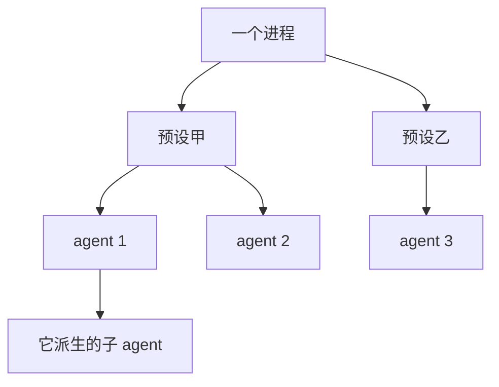

层级一出现，两件事必须顺着它走，**而且方向相反**：

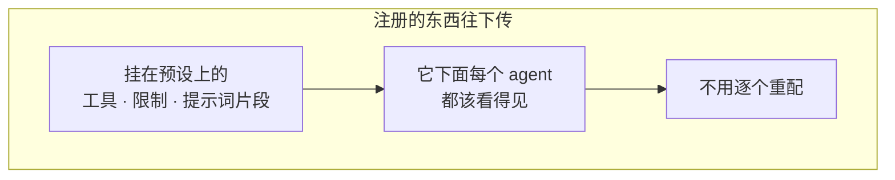

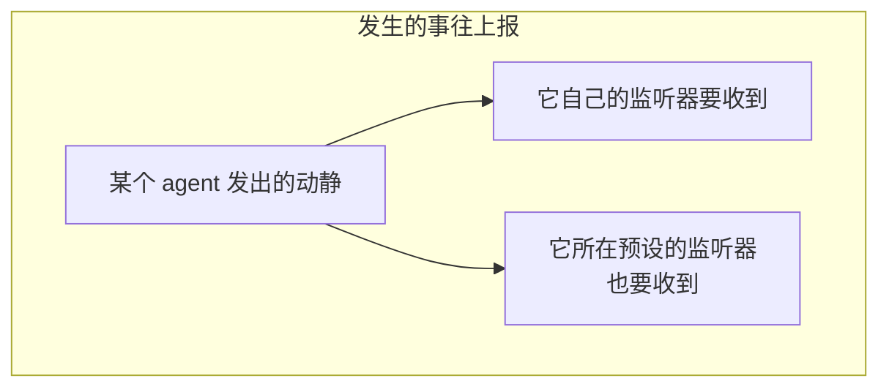

### 所以这个包只回答两个问题

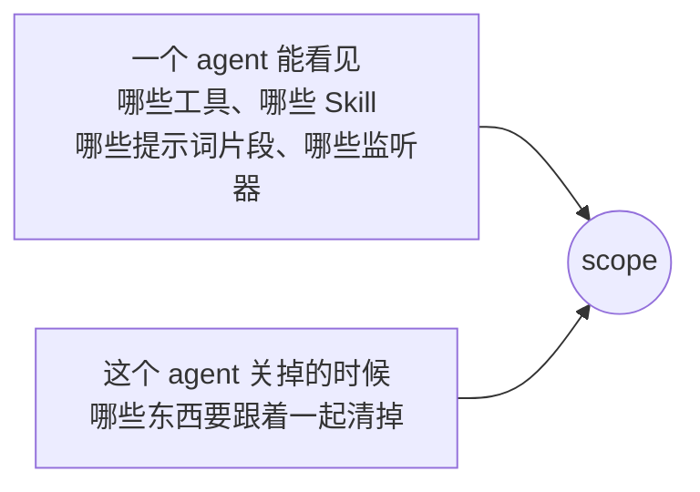

### 为什么值得单独做一个包

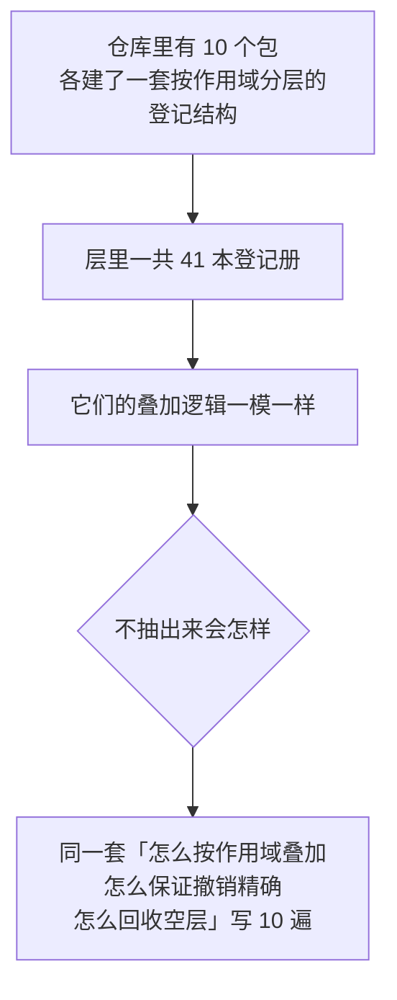


---

## 架构

### 整个包只有三个对象

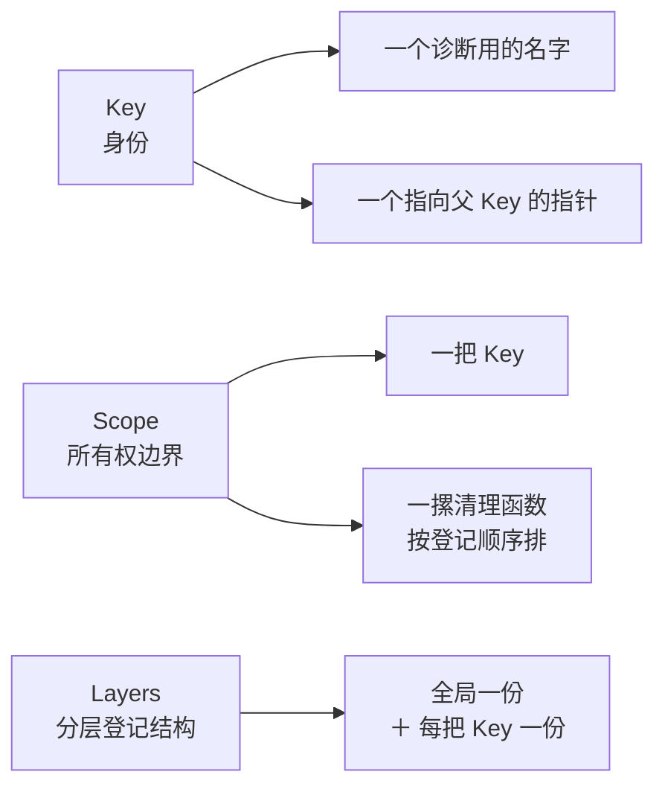


### agent 这边持有什么

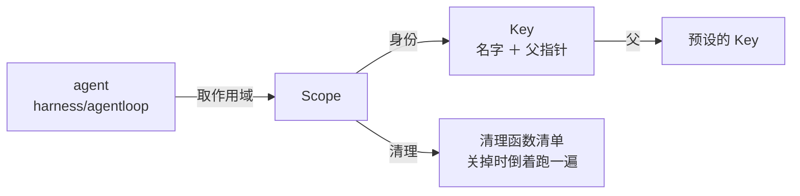

### 同一把 Key 同时出现在 10 个 map 里

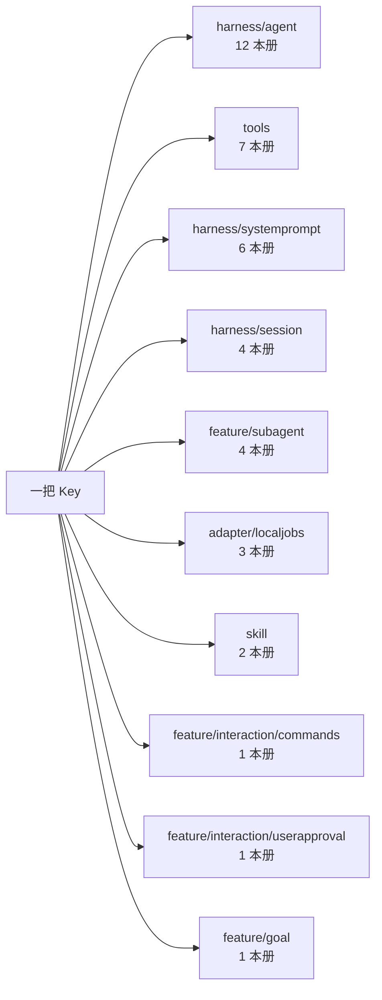

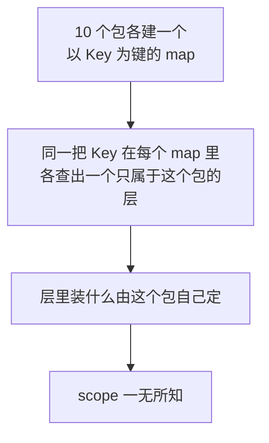

### 一个 map 内部长什么样

以 `skill` 为例：

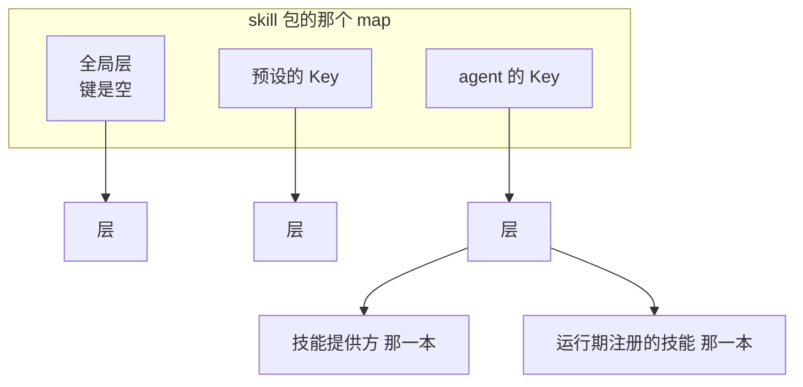

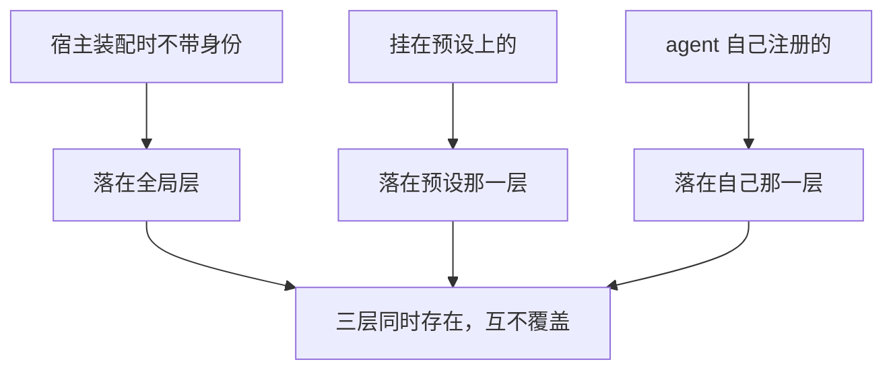

### 10 个层里的 41 本册

`harness/agent` 的层，12 本：

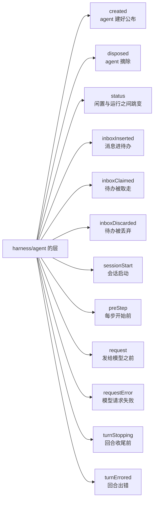

`tools` 的层，7 本：

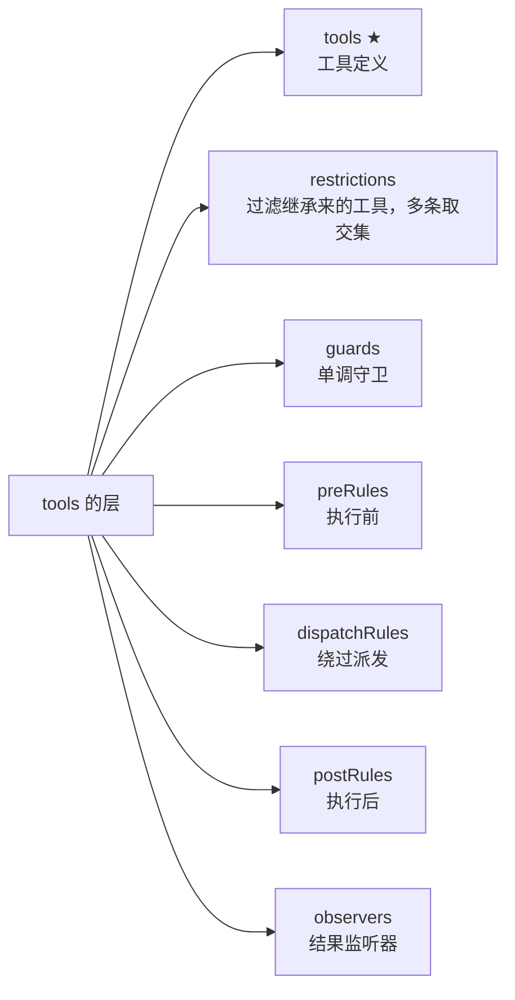

`harness/systemprompt` 的层，6 本：

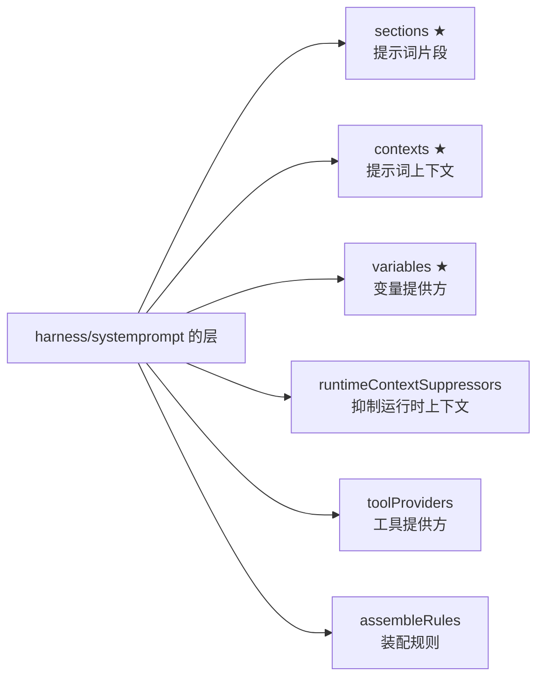

其余七个包，共 16 本：

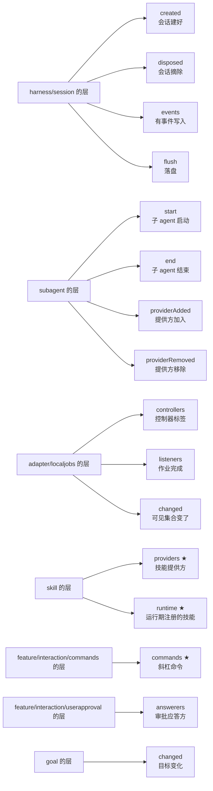

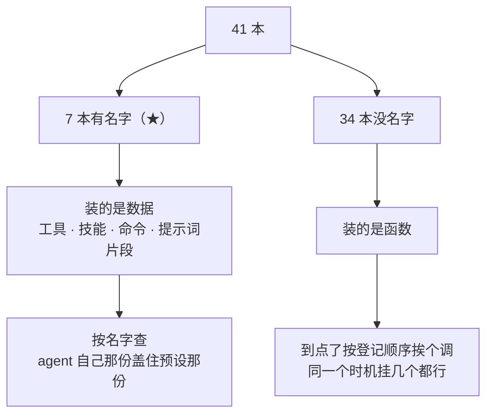

### 查往上走，事件也往上走

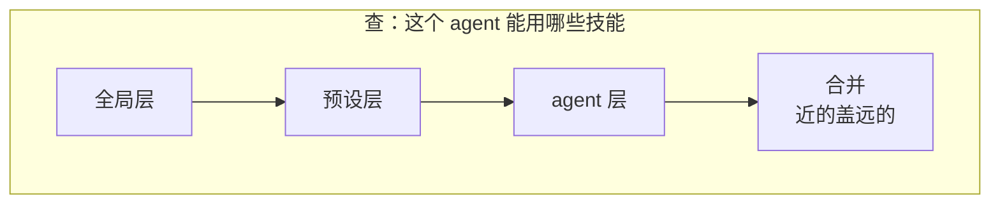

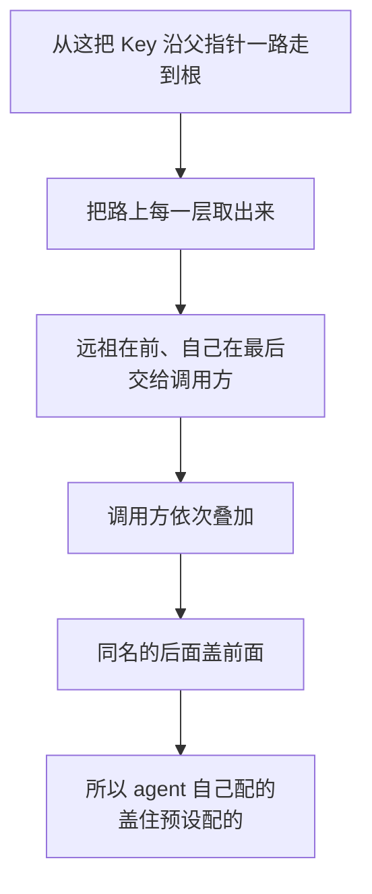

```mermaid
flowchart LR
    A["事件走的是同一条链<br/>方向相同"] --> B["从事件发出的那把 Key 往上爬"]
```

---

## 能力一：算出一个作用域能看见什么

```mermaid
flowchart LR
    A["每套分层登记结构都长成"] --> B["全局一份<br/>＋ 每个作用域自己一份"]
```

```mermaid
flowchart TD
    S1["① 取全局那份"] --> S2["② 取这个作用域父链上<br/>已经存在的各份"]
    S2 --> S3["③ 远祖在前、自己在最后"]
    S3 --> S4["④ 调用方依次叠加<br/>近的盖远的"]
```

### 同名覆盖只改值，不挪位置

```mermaid
flowchart TD
    A["一个作用域覆盖掉<br/>某个工具的实现"] --> B{"要不要把它挪到列表末尾"}
    B -->|"挪（错）"| C["工具的排列顺序变了<br/>提示词片段的拼接先后也变了"]
    B -->|"不挪（当前做法）"| D["位置保持不变<br/>只换掉那个值"]
```

### 读永远不会顺手建一层

```mermaid
flowchart TD
    A["问「这个作用域能看见什么」"] --> B{"顺手给它建一层空的吗"}
    B -->|"建"| C["「这个作用域到底有没有自己的东西」<br/>这个问题再也问不出真话"]
    B -->|"不建（当前做法）"| D["只读不写"]
```

### 问「自己有什么」和问「能看见什么」是两个入口

```mermaid
flowchart LR
    A["自己有什么"] --> A1["故意不看父链"]
    A1 --> A2["查「这个作用域自己配了<br/>哪些限制、哪些守卫」时<br/>不该被悄悄塞进祖先那一份"]
    B["能看见什么"] --> B1["走父链，叠加"]
```

```mermaid
flowchart LR
    A["要继承"] --> B["得明确说要继承"]
```

---

## 能力二：决定一个事件送到哪些监听器

```mermaid
flowchart LR
    A["判定只有一条走法"] --> B["从事件发出的地方往上爬<br/>看路上有没有遇到<br/>这个监听器所属的作用域"]
    B -.->|"永远不从监听器往下找"| B
```

| 监听器挂在 | 事件从哪发出 | 收得到吗 |
|---|---|---|
| 没声明作用域 | 任何地方 | 收得到 |
| 预设 | 它底下的 agent | 收得到 |
| agent | 它自己 | 收得到 |
| agent | 它所在的预设 | **收不到** |
| agent 甲 | agent 乙（兄弟） | **收不到** |

### 倒数第二行是关键

```mermaid
flowchart TD
    A["假设预设的事件<br/>会往下流到它底下每个 agent"] --> B["甲发的事先上传到预设"]
    B --> C["再从预设下传到乙"]
    C --> D["乙就间接看见甲了"]
    D -.->|"所以事件只许往上，不许往下"| D
```

### 这套判定目前没有调用方

```mermaid
flowchart TD
    A["包里提供了完整的准入判定<br/>和一个只路由、不暴露内容的事件载体"] --> B["但仓库里没有任何<br/>非测试代码调用它们"]
```

```mermaid
flowchart LR
    A["真正在跑的路由走的是另一条路"] --> B["监听器按作用域分层存着"]
    B --> C["派发时把全局层和父链上各层的<br/>名单接起来"]
```

```mermaid
flowchart TD
    A["两条路效果一样，代价不同"] --> B["按标签判：<br/>每个监听器判一次"]
    A --> C["按登记在哪一层：<br/>每次派发走一遍链拼名单"]
    B --> D["仓库选了后者"]
    C --> D
    D --> E["等价的过滤由「这个监听器登记在哪一层」完成<br/>不是由「它带什么标签」完成"]
```

---

## 能力三：把清理收在一起

```mermaid
flowchart LR
    A["一个作用域就是<br/>一摞待跑的清理函数"] --> B["往上挂一份<br/>换回一个「单独撤掉这一份」的能力"]
    B --> C["整体关掉就是把这摞跑完"]
```

### 倒着跑

```mermaid
flowchart TD
    A["后登记的先跑"] --> B{"为什么"}
    B --> C["后登记的东西<br/>可能依赖先登记的"]
    C --> D["正着跑会让一项清理<br/>在它依赖的东西已经没了之后才执行"]
```

### 全部跑完，错误合起来报

```mermaid
flowchart LR
    subgraph BAD["遇到第一个失败就返回"]
        A1["第 3 项失败"] --> A2["第 4 到第 20 项<br/>全泄漏了"]
    end
```

```mermaid
flowchart LR
    subgraph GOOD["当前做法"]
        B1["每一项都跑到"] --> B2["错误合并成一个交出去"]
    end
```

### 释放之后再往上挂，当场报错

```mermaid
flowchart TD
    A["往一个已经释放的作用域上<br/>挂清理函数"] --> B{"两种处理"}
    B -->|"静默放行"| C["那个清理函数永远不会被跑到"]
    C --> D["资源静默泄漏<br/>而且没有任何症状"]
    B -->|"当场报错（当前做法）"| E["至少能查"]
```

### 整体释放和单项撤销，两种先后顺序都必须安全

```mermaid
flowchart TD
    A["这两个能力<br/>由不同的调用方各自持有"] --> B["先后顺序没有保证"]
    B --> C["所以整体释放之后<br/>才被调到的单项撤销"]
    C --> D["什么都不做，而不是崩掉"]
```

### 清理函数跑在锁外

```mermaid
flowchart LR
    A["一个清理函数很可能<br/>回头碰同一个作用域"] --> B["比如撤销它挂的另一项"]
    B --> C["在锁里跑就自锁了"]
```

---

## 能力四：登记一次改动，同时把撤销挂好

那 41 本登记册的登记方法内部都是它。

```mermaid
flowchart TD
    S1["① 按登记者的身份<br/>找到该落在哪一层"] --> S2["② 跑登记动作<br/>换回一个撤销"]
    S2 --> S3["③ 把撤销挂到<br/>登记者自己的作用域上"]
    S3 --> S4["④ 再对外通知「这本册变了」"]
```

```mermaid
flowchart TD
    A["第 ① 步的分支"] --> B{"登记者带身份吗"}
    B -->|"不带"| C["落在全局层"]
    C --> D["这就是「一个不带作用域的宿主装配<br/>出来的东西对所有作用域可见」<br/>的实现方式"]
    B -->|"带"| E["落在它自己那层<br/>没有就当场建"]
```

### 第 ③ 步必须在第 ④ 步之前

```mermaid
flowchart TD
    A["先把撤销攥在手里<br/>再对外说"] --> B{"反过来会怎样"}
    B --> C["通知那一步一旦失败"]
    C --> D["这次登记就成了<br/>一份无法撤销的东西"]
```

---

## 两类登记册

层里装什么由使用方决定，包里给了两本现成的册子。

|  | 具名册 | 匿名册 |
|---|---|---|
| 有名字 | 有，且必须唯一 | 没有 |
| 重复登记 | 报错 | 允许，每次是独立的一份 |
| 用在哪 | 工具、Skill、命令这类「一个名字一份实现」 | 监听器、中间件、拦截器这类「只有先后，本来就允许重复」 |
| 非测试引用 | 11 处 | 72 处 |

### 两本册共用三条约定

```mermaid
flowchart TD
    A["顺序是插入顺序"] --> A1["使用方按登记先后决定生效次序"]
    A1 --> A2["而 Go 的 map 没有顺序<br/>所以顺序必须自己存"]
    B["值是借来的"] --> B1["册子不拥有<br/>也不复制"]
    C["每次登记换回一个<br/>只撤这一次的幂等撤销"] --> C1["撤销精确到单次"]
```

### 重名报什么话由调用方给

```mermaid
flowchart LR
    A["这本册自己压根不知道<br/>它装的是工具还是 Skill"] --> B["所以诊断文字是构造时传进来的"]
```

```mermaid
flowchart LR
    A["「工具 echo 已经注册过了」"] --> C(("比"))
    B["「名字 echo 重复」"] --> C
    C --> D["有用得多"]
```

### 遍历是快照，不是实时视图

```mermaid
flowchart TD
    A["遍历的过程中<br/>会调到使用方的代码"] --> B["而这本册是有锁的"]
    B --> C{"在锁里回调会怎样"}
    C --> D["使用方一旦回头碰这本册<br/>就是死锁"]
```

```mermaid
flowchart LR
    A["所以先在锁内拷一份顺序"] --> B["再在锁外交出去"]
    B --> C["代价：遍历期间的插入看不见"]
    C --> D["换来：不死锁<br/>也不会在遍历中途被并发修改弄乱"]
```

---

## 可见性和拆解责任是分开的

```mermaid
flowchart LR
    A["关掉一个父作用域"] --> B["不会连带关掉它的子作用域"]
```

```mermaid
flowchart TD
    A["父链管可见性"] --> A1["公开可读<br/>任何拿到身份的代码都能一路走到根"]
    B["清理摞管释放责任"] --> B1["私有<br/>只有持有那个作用域的调用方<br/>能往上挂、能把它拆掉"]
    A1 --> C["两套关系挂在同一批身份上<br/>但互不联动"]
    B1 --> C
    C --> D["作用域这个结构体里<br/>压根没有「子作用域」这个字段"]
```

### 为什么不让关停跟着链走

```mermaid
flowchart TD
    A["一个 agent 可以在生命周期中途<br/>被改挂到另一个预设下面"] --> B{"如果关停跟着链走"}
    B --> C["「这个 agent 现在挂在哪个预设下」"]
    B --> D["「哪个作用域负责释放它」"]
    C --> E["会在改链的那一瞬间对不上"]
    D --> E
```

```mermaid
flowchart LR
    A["拆开之后"] --> B["改链只影响可见性"]
    B --> C["不影响任何<br/>已经发放出去的拆解责任"]
```

```mermaid
flowchart LR
    A["要「预设倒了<br/>它底下的 agent 也倒」"] --> B["那是上层显式把子作用域的关停<br/>挂到父作用域上"]
    B --> C["这个包不替它做"]
```

---

## 身份是指针，不是名字

```mermaid
flowchart LR
    A["两个用同一个名字<br/>造出来的作用域"] --> B["是两个不同的作用域"]
    B --> C["名字只用于报错和看日志<br/>一点都不参与身份判定"]
```

### 为什么做成一个专门的不透明类型、按指针传

```mermaid
flowchart TD
    A["理由一：拿任意值当身份会出事"] --> B["两个字段相同的结构体<br/>在 Go 里比较相等"]
    B --> C["两个本该独立的作用域<br/>会串成一个"]
    A --> D["而切片、map、函数这类<br/>不可比较的值当键会直接崩"]
    C --> E["指针没有这两个问题"]
    D --> E
```

```mermaid
flowchart TD
    A["理由二：父链能直接做成字段"] --> B["身份是自己定义的类型<br/>可以往上加字段"]
    B --> C["不需要另外拿一个全局 map<br/>侧挂父链"]
    C --> D["既没有全局 map 要加锁<br/>也没有生命周期问题"]
```

### 报错里特意带上地址

```mermaid
flowchart LR
    A["因为名字不参与身份"] --> B["两个同名的作用域<br/>必须能在报错里区分开"]
    B --> C["否则一条「父链成环」的诊断<br/>会指向两个看起来一模一样的名字"]
```

---

## 父链的三条硬规则

### 一、绑定是一次性的

```mermaid
flowchart TD
    A["一个身份只能认一次父"] --> B["之后没有任何公开的改链路径"]
    B --> C["除非持有当初那次绑定<br/>换回来的凭据"]
```

```mermaid
flowchart TD
    A["为什么锁得这么死"] --> B["链决定了一个监听器<br/>能收到哪些事件"]
    B --> C{"如果任何拿到身份的代码都能改链"}
    C --> D["它能把一个 agent<br/>从它的预设下面挪走"]
    C --> E["也能把自己塞到另一个预设下面<br/>去偷看事件"]
    D --> F["所以归属只能由<br/>当初把它接进来的那一方来改"]
    E --> F
```

### 二、成环必须在写入的时候拦

```mermaid
flowchart TD
    A["包里每一个用到链的地方<br/>都要一路走到根"] --> B["没有任何一处带深度上限<br/>或者访问过标记"]
    B --> C["环不能靠读的一侧兜住"]
    C --> D["只能在写入时拒绝"]
    D --> E["改链同样查"]
```

### 三、改链合不合法这个包不查

```mermaid
flowchart TD
    A["只有在「旧父作用域下产出的东西<br/>全都没有被留存」时<br/>改链才是干净的"] --> B{"这个包判得了吗"}
    B --> C["它看不见一个会话记了什么"]
    B --> D["也看不见一本册里存了什么"]
    C --> E["所以这一条<br/>由持有凭据的那一方保证"]
    D --> E
```

### 另外：造作用域时顺手指定父作用域的那条路

```mermaid
flowchart TD
    A["那条便捷路径<br/>凭据当场就被丢掉了"] --> B["后果：这条链此后无法再改"]
    B --> C["外面再绑撞「已经绑过」"]
    B --> D["而能改它的凭据不存在"]
```

```mermaid
flowchart LR
    A["需要改链的调用方<br/>仓库里只有 Agent 名册一处"] --> B["走的是另一条路"]
    B --> C["自己绑、自己收好凭据<br/>自己造作用域"]
```

---

## 生命周期与并发

这些结构会被多个 goroutine 同时碰到。

### 读父链不加锁，写父链全进程串行

```mermaid
flowchart LR
    A["读是最热的路径"] --> B["每分派一次事件<br/>就要走一遍链"]
    B --> C["所以用原子读<br/>没有锁竞争"]
```

```mermaid
flowchart TD
    A["写为什么必须串起来"] --> B["成环检查是两步：<br/>先走一遍链，再写一个字段"]
    B --> C{"两步之间插进来另一次写入"}
    C --> D["两次各自都通过了检查"]
    D --> E["合起来却造出一个环"]
```

```mermaid
flowchart TD
    A["这把写锁是包级的"] --> B["整个进程里所有作用域树的<br/>链写入都在它上面排队"]
    B --> C{"可以接受吗"}
    C --> D["改链只发生在<br/>作用域诞生、或一个 agent 换预设的时候"]
    D --> E["不在任何热路径上"]
```

### 别的地方各自带锁，互相不嵌套

```mermaid
flowchart LR
    A["两处外部代码的调用点<br/>是刻意放在锁外的"] --> B["清理函数"]
    A --> C["遍历时的回调"]
    B --> D["这两处是使用方代码<br/>回头碰同一个对象最可能的地方"]
    C --> D
```

### 关停这条路径的实测形状

```mermaid
flowchart LR
    A["登记一个清理再取消它"] --> A1["必须是常数时间"]
    B["整体释放"] --> B1["随挂载数线性是应该的<br/>它就是要把每一个都跑一遍"]
```

数字见[性能与压力基线](../performance-baseline.md)。

---

## 失败语义

```mermaid
flowchart TD
    E1["给一个已经有父的身份绑父"] --> R1["改链只能由<br/>持有绑定凭据的一方发起"]
    E2["这次连接会让链成环"] --> R2["检查层级<br/>父不能是自己的后代"]
    E3["往已经关掉的作用域上挂清理"] --> R3["这份资源已经晚了<br/>查是不是拆解顺序反了"]
    E4["具名册重名"] --> R4["换名字<br/>顺便考虑给构造函数<br/>补一个说得清的诊断"]
    E5["必填的函数漏了（四条）"] --> R5["补上参数"]
```

```mermaid
flowchart LR
    A["整体释放返回的是合并后的错误"] --> B["不是第一个失败"]
    B --> C["所有清理都会被跑到"]
```

---

## 能力边界

```mermaid
flowchart TD
    Y["这个包负责"] --> Y1["一个按指针比较、不透明<br/>可诊断的作用域身份"]
    Y --> Y2["一条单次绑定、拒绝成环<br/>改动需要凭据的父子链"]
    Y --> Y3["「事件只往上走」这条方向<br/>以及一个只路由、不暴露内容的事件载体"]
    Y --> Y4["所有权边界：后进先出、幂等<br/>并发共享、错误合并的整体释放<br/>加上精确到单项的撤销"]
    Y --> Y5["「全局一份 ＋ 每个作用域一份」<br/>这套叠放结构"]
    Y --> Y6["把一次改动和它的撤销<br/>一起挂到登记者身上的登记原语"]
    Y --> Y7["两张按插入顺序排<br/>撤销精确到单次的登记册"]
```

```mermaid
flowchart TD
    N["这个包不负责"] --> N1["不做级联关停<br/>关掉父作用域不会关掉子作用域"]
    N --> N2["不定义层里装什么<br/>对工具、监听器、提示片段一无所知"]
    N --> N3["不做鉴权<br/>准入管的是可见性，不是访问权限"]
    N --> N4["不查改链的合法性<br/>它看不见旧父作用域下产出的东西<br/>有没有被留存"]
    N --> N5["不做 I/O、不起 goroutine、不计时"]
    N --> N6["不跨进程<br/>全是内存里的指针关系，进程一停全没"]
    N --> N7["不保证遍历看得见并发插入<br/>快照语义，拿实时性换的不死锁"]
```

```mermaid
flowchart LR
    A["没有超时、没有过期时间<br/>没有后台回收"] --> B["层的回收是<br/>登记撤销时顺带发生的"]
    B --> C["不是定时扫的"]
```

---

## 引用它的包

50 个包在非测试代码里引用它。用法高度集中：

| 用的是哪一面 | 引用方 | 规模 |
|---|---|---|
| **所有权边界** | 几乎所有包 | 199 处非测试引用；「无身份的作用域」是最常见的构造 |
| **分层登记结构** | 10 个包各一套：Agent 名册 12 本、工具运行时 7、系统提示 6、活会话 4、子 Agent 生命周期 4、后台作业 3、Skill 2、命令 1、审批 1、目标 1 | 登记原语 44 处 |
| **两本登记册** | 同上，作为层的内容 | 匿名册 72 处，具名册 11 处 |
| **改链** | 只有 Agent 名册：一个 agent 认进预设、或改认到另一个预设 | 绑定 4 处，凭据 4 处 |
| **走链** | Skill 目录：拿父链参与缓存键 | 1 处 |
| **读父** | Agent 名册：从 agent 的父反查它认了哪份预设 | 1 处 |
| **准入判定与载体** | **没有调用方** | 0 |

```mermaid
flowchart TD
    A["最常见的用法是<br/>「无身份的所有权边界」"] --> B["大多数调用方要的只是<br/>一摞会一起跑掉的清理"]
    B --> C["并不需要参与路由"]
    C --> D["而这两件事在同一个类型上<br/>不需要为此拆出两个概念"]
```

```mermaid
flowchart LR
    A["分层登记结构是引用最多的一面"] --> B["41 本册子长得一模一样"]
    B --> C["怎么按作用域叠加<br/>怎么保证撤销精确<br/>怎么回收空层"]
    C --> D["写在一处，10 个包各自复用"]
```

```mermaid
flowchart LR
    A["准入判定那一半目前是死的"] --> B["能力完整、测过"]
    B --> C["但仓库选了<br/>用分层登记结构做等价的过滤"]
```

---

## 对应的 DSH 能力

下表由 [`docs/packages.md`](../packages.md) 与 [能力覆盖表](../portmap/capability-coverage.tsv) 机器 join 得到：本篇覆盖的 Go 包，承接的是上游 DSH 的哪几条能力，以及各自还缺什么。落点列由源码里的 `// 源:` 注释反查，不是手写的。

| 上游能力 | DSH 包 | 裁决 | 落在哪个 Go 包 | 这里缺什么 |
|---|---|---|---|---|
| 带作用域的注册原语，为每个存活agent创建一个作用域 | `core/scope` | 需要 | `scope` | — |

## 相关源码

| 路径 | 内容 |
|---|---|
| `scope/scope.go` | 身份、父链、准入、事件载体、所有权边界 |
| `scope/layers.go` | 全局层与覆盖层的叠放、登记原语与三条回滚、空层回收 |
| `scope/entries.go` | 两张登记表、精确撤销、快照遍历 |
| `scope/bench_test.go` | 关停路径的压力基线 |

---

## 深入阅读

[Agent](agent.md) · [活会话](livesession.md) · [Tools](tools.md) · [Agent 预设与 Persona](presets.md)
