# SDK 协议与服务端

对应包：`protocol/sdk/sdkprotocol`、`protocol/sdk/sdkserver`

## 定位

运行时跑在一个进程里。想驱动它的那个人，写的可能是 Python，跑在另一台机器上。

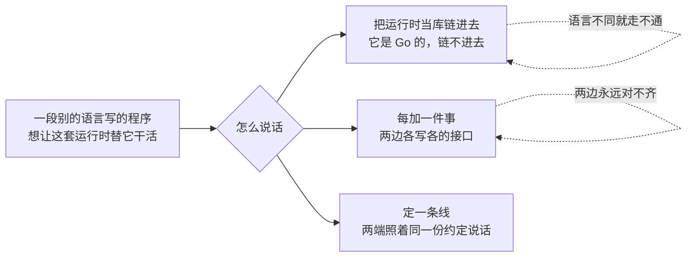
```mermaid
flowchart LR
    A["一段别的语言写的程序<br/>想让这套运行时替它干活"] --> B{"怎么说话"}
    B --> C["把运行时当库链进去<br/>它是 Go 的，链不进去"]
    B --> D["每加一件事<br/>两边各写各的接口"]
    B --> E["定一条线<br/>两端照着同一份约定说话"]
    C -.->|"语言不同就走不通"| C
    D -.->|"两边永远对不齐"| D
```

这两个包就是那条线的两半：

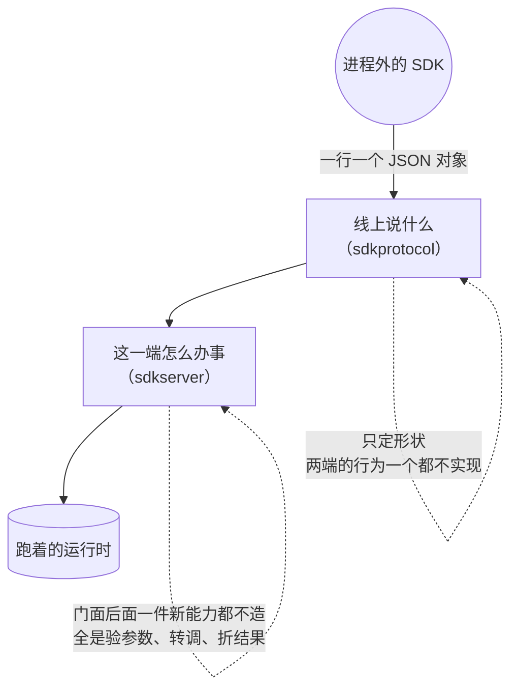
```mermaid
flowchart TD
    SDK(("进程外的 SDK")) -->|"一行一个 JSON 对象"| P["线上说什么<br/>（sdkprotocol）"]
    P --> S["这一端怎么办事<br/>（sdkserver）"]
    S --> RT[("跑着的运行时")]
    P -.->|"只定形状<br/>两端的行为一个都不实现"| P
    S -.->|"门面后面一件新能力都不造<br/>全是验参数、转调、折结果"| S
```

---

## 架构

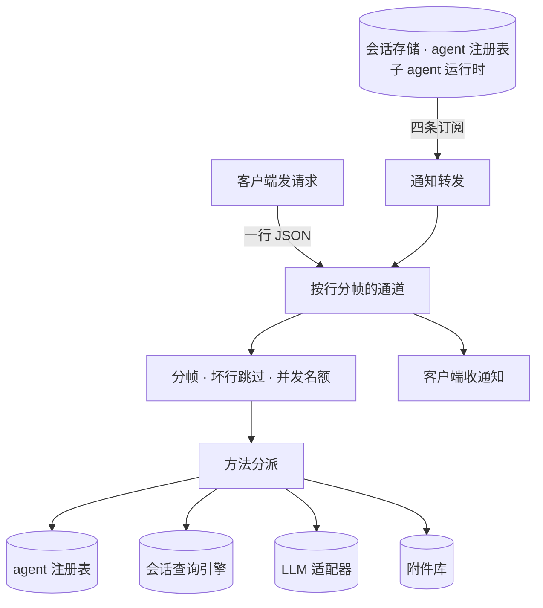
```mermaid
flowchart TD
    C1["客户端发请求"] -->|"一行 JSON"| T["按行分帧的通道"]
    T --> F["分帧 · 坏行跳过 · 并发名额"]
    F --> H["方法分派"]
    H --> R1[("agent 注册表")]
    H --> R2[("会话查询引擎")]
    H --> R3[("LLM 适配器")]
    H --> R4[("附件库")]
    SUB[("会话存储 · agent 注册表<br/>子 agent 运行时")] -->|"四条订阅"| N["通知转发"]
    N --> T
    T --> C2["客户端收通知"]
```

### 线上一共有多少种话

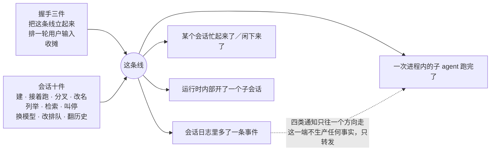
```mermaid
flowchart LR
    REQ["握手三件<br/>把这条线立起来<br/>排一轮用户输入<br/>收摊"] --> LINE(("这条线"))
    SES["会话十件<br/>建 · 接着跑 · 分叉 · 改名<br/>列举 · 检索 · 叫停<br/>换模型 · 改排队 · 翻历史"] --> LINE
    LINE --> N1["会话日志里多了一条事件"]
    LINE --> N2["某个会话忙起来了／闲下来了"]
    LINE --> N3["运行时内部开了一个子会话"]
    LINE --> N4["一次进程内的子 agent 跑完了"]
    N1 -.->|"四类通知只往一个方向走<br/>这一端不生产任何事实，只转发"| N4
```

### 会话那十件各自转给谁

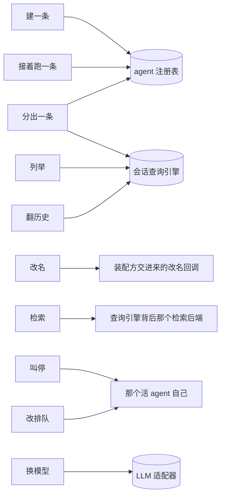
```mermaid
flowchart LR
    M1["建一条"] --> A1[("agent 注册表")]
    M2["接着跑一条"] --> A1
    M3["分出一条"] --> A2[("会话查询引擎")]
    M3 --> A1
    M4["改名"] --> A3["装配方交进来的改名回调"]
    M5["列举"] --> A2
    M6["检索"] --> A4["查询引擎背后那个检索后端"]
    M7["叫停"] --> A5["那个活 agent 自己"]
    M8["换模型"] --> A6[("LLM 适配器")]
    M9["改排队"] --> A5
    M10["翻历史"] --> A2
```

十件事里没有一件是这一层自己发明的。这一层做的只有三下：把入参验干净、转给真正干活的那一位、把结果折成线上的形状。

### 握手交回去的那个名字是协议的一部分

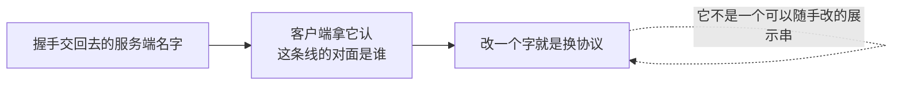
```mermaid
flowchart LR
    A["握手交回去的服务端名字"] --> B["客户端拿它认<br/>这条线的对面是谁"]
    B --> C["改一个字就是换协议"]
    C -.->|"它不是一个可以随手改的展示串"| C
```

### 装配面：缺什么当场说，不等第一个请求

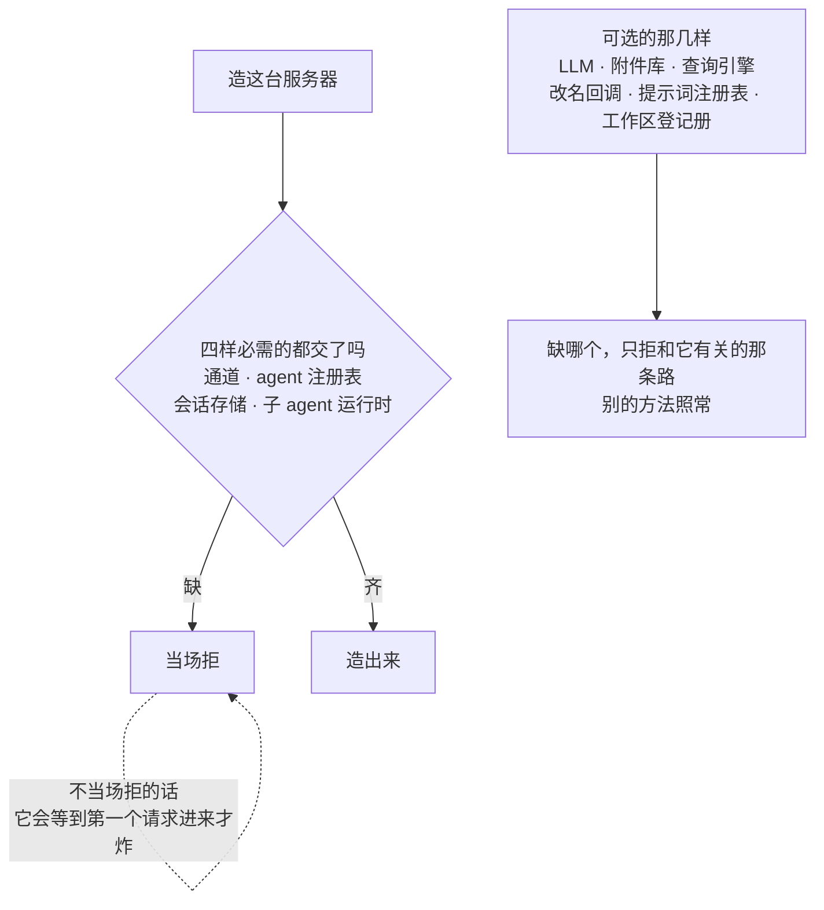
```mermaid
flowchart TD
    A["造这台服务器"] --> B{"四样必需的都交了吗<br/>通道 · agent 注册表<br/>会话存储 · 子 agent 运行时"}
    B -->|"缺"| C["当场拒"]
    B -->|"齐"| D["造出来"]
    E["可选的那几样<br/>LLM · 附件库 · 查询引擎<br/>改名回调 · 提示词注册表 · 工作区登记册"] --> F["缺哪个，只拒和它有关的那条路<br/>别的方法照常"]
    C -.->|"不当场拒的话<br/>它会等到第一个请求进来才炸"| C
```

---

## 一次连接：从握手到收摊

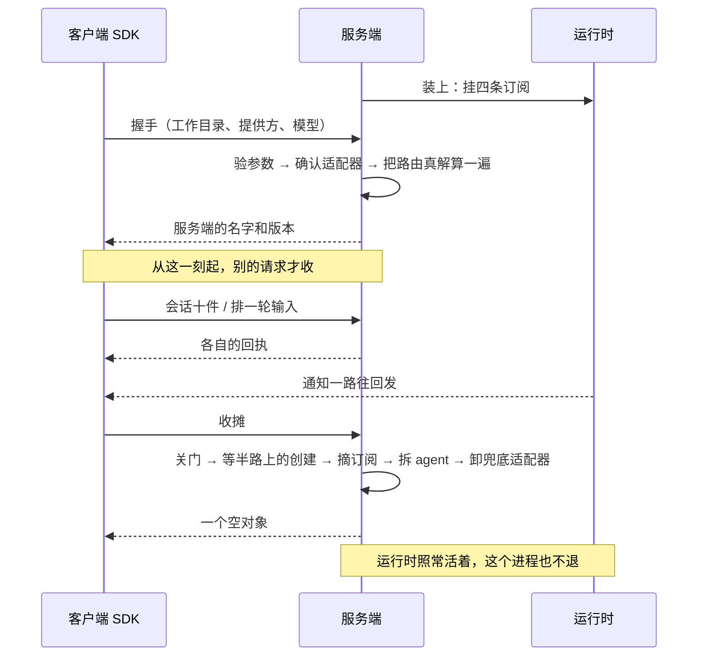
```mermaid
sequenceDiagram
    participant C as 客户端 SDK
    participant S as 服务端
    participant R as 运行时
    S->>R: 装上：挂四条订阅
    C->>S: 握手（工作目录、提供方、模型）
    S->>S: 验参数 → 确认适配器 → 把路由真解算一遍
    S-->>C: 服务端的名字和版本
    Note over C,S: 从这一刻起，别的请求才收
    C->>S: 会话十件 / 排一轮输入
    S-->>C: 各自的回执
    R-->>C: 通知一路往回发
    C->>S: 收摊
    S->>S: 关门 → 等半路上的创建 → 摘订阅 → 拆 agent → 卸兜底适配器
    S-->>C: 一个空对象
    Note over S,R: 运行时照常活着，这个进程也不退
```

握手之前进来的**任何**请求都被拒，连只读的那几件也拒：

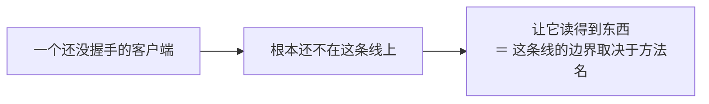
```mermaid
flowchart LR
    A["一个还没握手的客户端"] --> B["根本还不在这条线上"]
    B --> C["让它读得到东西<br/>＝ 这条线的边界取决于方法名"]
```

---

## 一次请求：一轮用户输入怎么进队

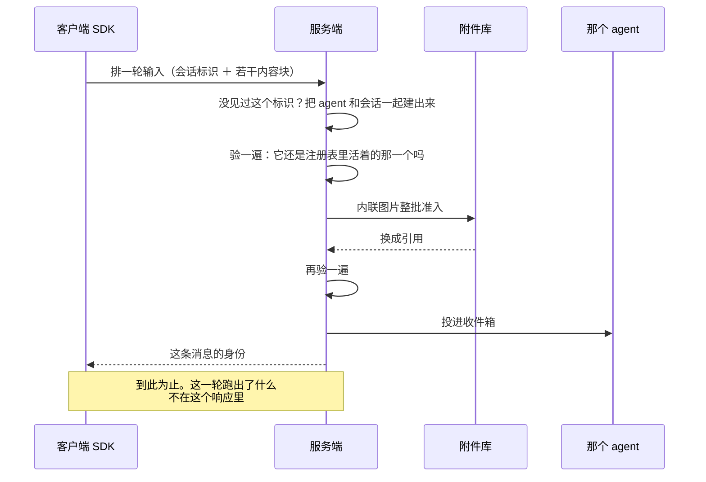
```mermaid
sequenceDiagram
    participant C as 客户端 SDK
    participant S as 服务端
    participant A as 附件库
    participant G as 那个 agent
    C->>S: 排一轮输入（会话标识 ＋ 若干内容块）
    S->>S: 没见过这个标识？把 agent 和会话一起建出来
    S->>S: 验一遍：它还是注册表里活着的那一个吗
    S->>A: 内联图片整批准入
    A-->>S: 换成引用
    S->>S: 再验一遍
    S->>G: 投进收件箱
    S-->>C: 这条消息的身份
    Note over S,C: 到此为止。这一轮跑出了什么<br/>不在这个响应里
```

两次「它还活着吗」不是冗余：

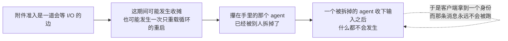
```mermaid
flowchart LR
    A["附件准入是一道会等 I/O 的边"] --> B["这期间可能发生收摊<br/>也可能发生一次只重载循环的重启"]
    B --> C["攥在手里的那个 agent<br/>已经被别人拆掉了"]
    C --> D["一个被拆掉的 agent 收下输入之后<br/>什么都不会发生"]
    D -.->|"于是客户端拿到一个身份<br/>而那条消息永远不会被跑"| D
```

图片走的是引用，不是字节：

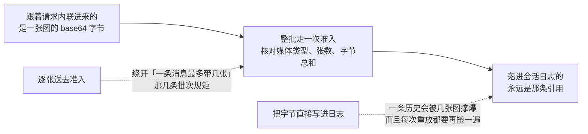
```mermaid
flowchart LR
    A["跟着请求内联进来的<br/>是一张图的 base64 字节"] --> B["整批走一次准入<br/>核对媒体类型、张数、字节总和"]
    B --> C["落进会话日志的<br/>永远是那条引用"]
    D["逐张送去准入"] -.->|"绕开「一条消息最多带几张」那几条批次规矩"| B
    E["把字节直接写进日志"] -.->|"一条历史会被几张图撑爆<br/>而且每次重放都要再搬一遍"| C
```

---

## 一次流式回话：结果为什么不等在响应里

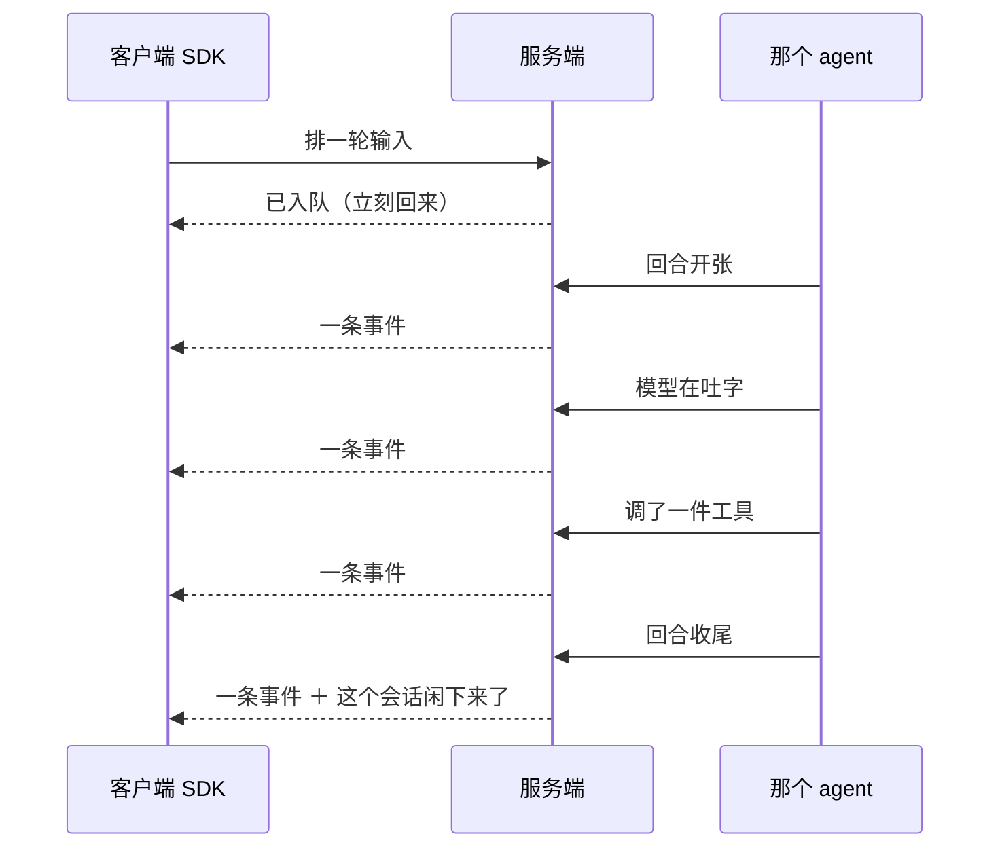
```mermaid
sequenceDiagram
    participant C as 客户端 SDK
    participant S as 服务端
    participant G as 那个 agent
    C->>S: 排一轮输入
    S-->>C: 已入队（立刻回来）
    G->>S: 回合开张
    S-->>C: 一条事件
    G->>S: 模型在吐字
    S-->>C: 一条事件
    G->>S: 调了一件工具
    S-->>C: 一条事件
    G->>S: 回合收尾
    S-->>C: 一条事件 ＋ 这个会话闲下来了
```

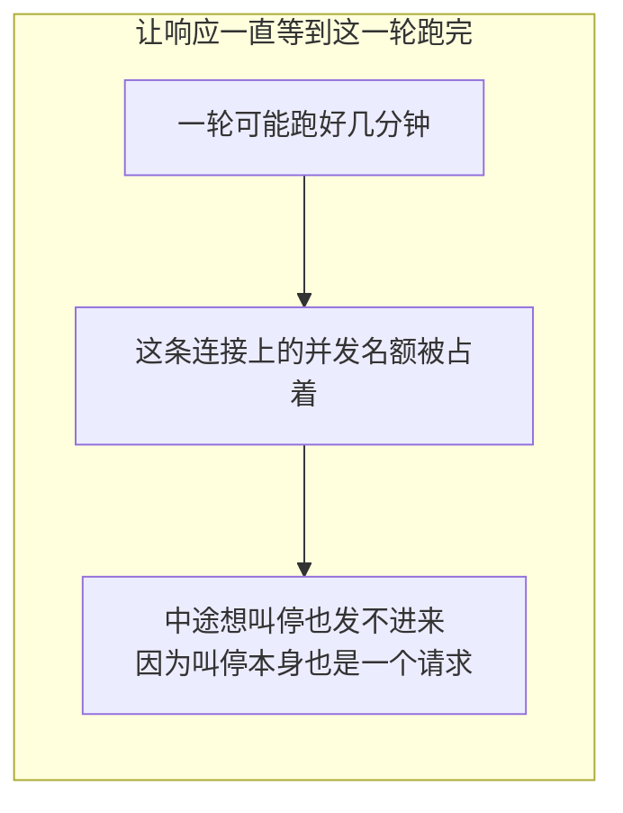
```mermaid
flowchart LR
    subgraph BAD["让响应一直等到这一轮跑完"]
        A1["一轮可能跑好几分钟"] --> A2["这条连接上的并发名额被占着"]
        A2 --> A3["中途想叫停也发不进来<br/>因为叫停本身也是一个请求"]
    end
```

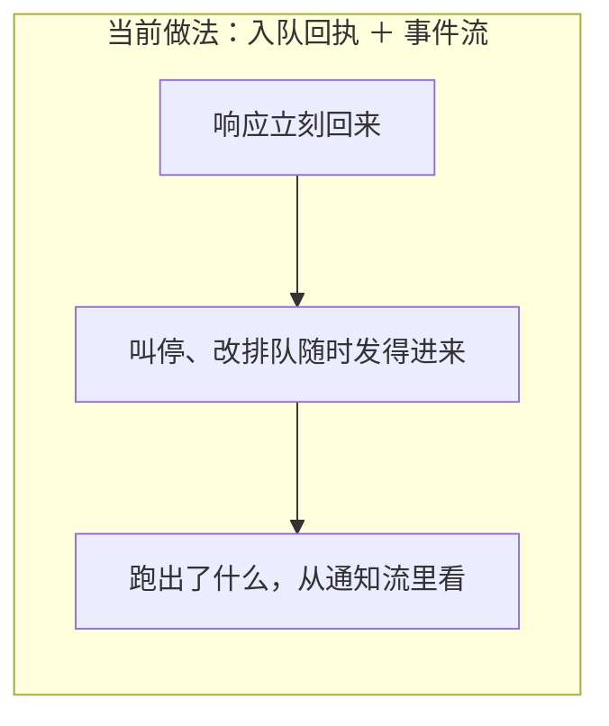
```mermaid
flowchart LR
    subgraph GOOD["当前做法：入队回执 ＋ 事件流"]
        B1["响应立刻回来"] --> B2["叫停、改排队随时发得进来"]
        B2 --> B3["跑出了什么，从通知流里看"]
    end
```

---

## 一次中断

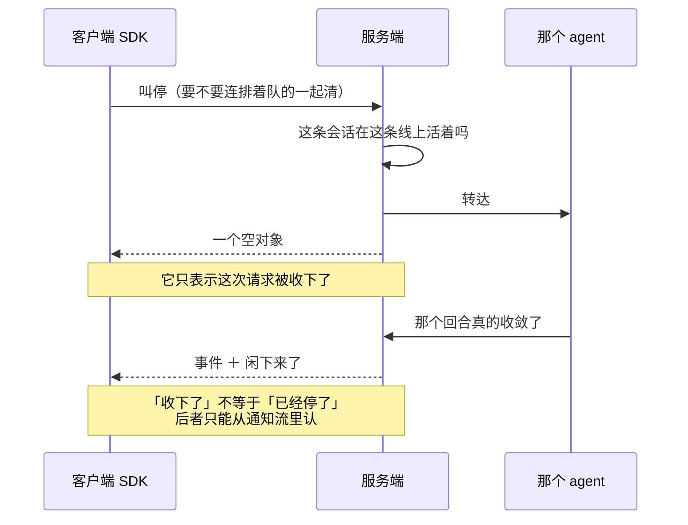
```mermaid
sequenceDiagram
    participant C as 客户端 SDK
    participant S as 服务端
    participant G as 那个 agent
    C->>S: 叫停（要不要连排着队的一起清）
    S->>S: 这条会话在这条线上活着吗
    S->>G: 转达
    S-->>C: 一个空对象
    Note over S,C: 它只表示这次请求被收下了
    G->>S: 那个回合真的收敛了
    S-->>C: 事件 ＋ 闲下来了
    Note over C,S: 「收下了」不等于「已经停了」<br/>后者只能从通知流里认
```

---

## 握手：整个走完才算数

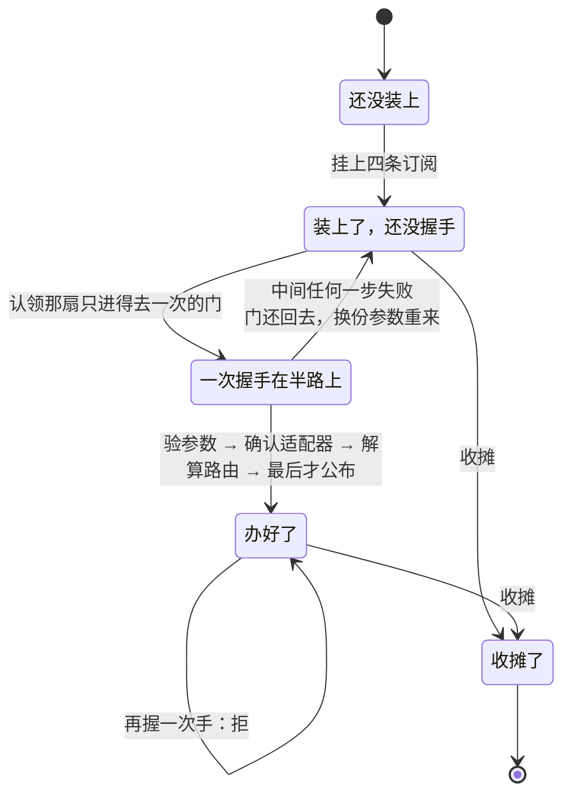
```mermaid
stateDiagram-v2
    state "还没装上" as A
    state "装上了，还没握手" as B
    state "一次握手在半路上" as C
    state "办好了" as D
    state "收摊了" as E
    [*] --> A
    A --> B: 挂上四条订阅
    B --> C: 认领那扇只进得去一次的门
    C --> B: 中间任何一步失败<br/>门还回去，换份参数重来
    C --> D: 验参数 → 确认适配器 → 解算路由 → 最后才公布
    D --> D: 再握一次手：拒
    B --> E: 收摊
    D --> E: 收摊
    E --> [*]
```

「最后才公布」是这件事的全部内容：

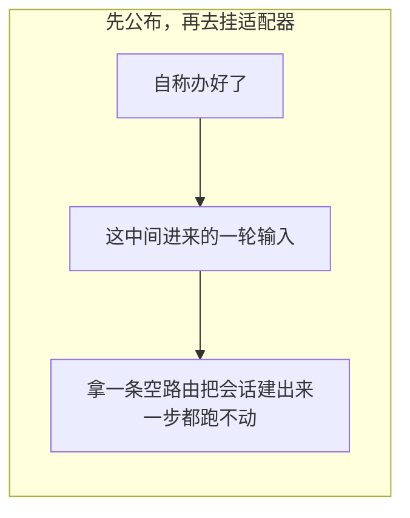
```mermaid
flowchart LR
    subgraph BADI["先公布，再去挂适配器"]
        A1["自称办好了"] --> A2["这中间进来的一轮输入"] --> A3["拿一条空路由把会话建出来<br/>一步都跑不动"]
    end
```

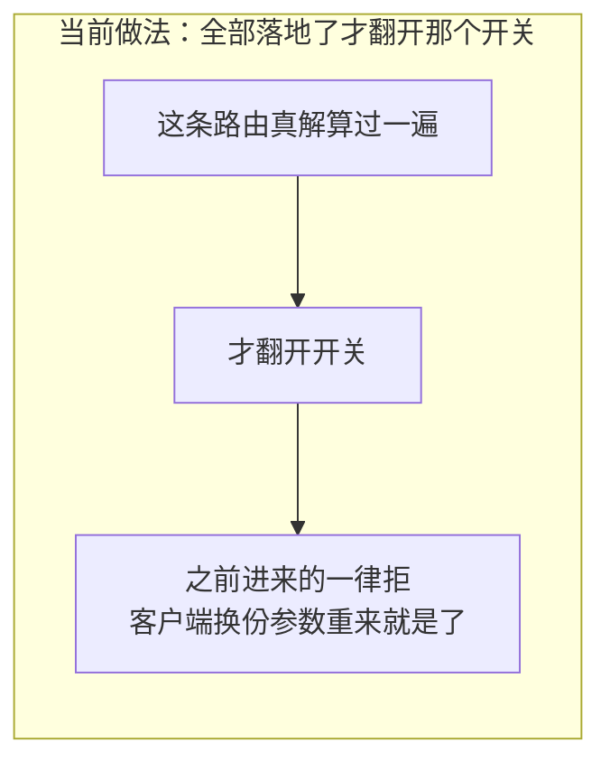
```mermaid
flowchart LR
    subgraph GOODI["当前做法：全部落地了才翻开那个开关"]
        B1["这条路由真解算过一遍"] --> B2["才翻开开关"] --> B3["之前进来的一律拒<br/>客户端换份参数重来就是了"]
    end
```

还得另立一个「在半路上」的记号，因为两次握手真的会同时进来：

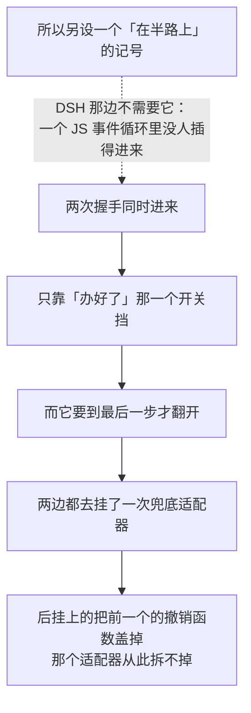
```mermaid
flowchart TD
    A["两次握手同时进来"] --> B["只靠「办好了」那一个开关挡"]
    B --> C["而它要到最后一步才翻开"]
    C --> D["两边都去挂了一次兜底适配器"]
    D --> E["后挂上的把前一个的撤销函数盖掉<br/>那个适配器从此拆不掉"]
    F["所以另设一个「在半路上」的记号"] -.->|"DSH 那边不需要它：<br/>一个 JS 事件循环里没人插得进来"| A
```

---

## 活的一路和冷的一路

```mermaid
flowchart TD
    M["一个会话方法进来"] --> Q{"它要求这条会话此刻活着吗"}
    Q -->|"要：改名 · 叫停 · 换模型 · 改排队"| L{"在这条线上吗"}
    L -->|"在"| L1["办"]
    L -->|"不在"| L2["当场拒"]
    Q -->|"不要：列举 · 检索 · 翻历史 · 分叉"| C1["直接冷读日志<br/>不惊动任何 agent"]
    L2 -.->|"不隐式把它读回来"| L3["一次拼错标识的叫停<br/>不该悄悄启动一条陈年会话<br/>还为此起一整套 agent"]
```

要接着跑就显式说「接着跑一条」——那条路本来就在。

---

## 坏行跳过去，而不是把连接掐了

```mermaid
flowchart TD
    F["另一端是别人写的 SDK"] --> A["读到一行"]
    A --> B{"认得出吗"}
    B -->|"是个合法的 JSON 对象"| C["办"]
    B -->|"断在半路 / 空行 / 混进来的调试输出"| D["丢掉这一行，接着读下一行"]
    E["把连接关掉"] -.->|"那会把一次可恢复的手滑<br/>变成一次不可恢复的掉线"| D
```

「别人写的 SDK」这句话同时意味着：那一端可以写坏，也可以写得没完没了。

```mermaid
flowchart LR
    subgraph OVER["一行永远不来的换行符"]
        A1["读缓冲一直往上攒"] --> A2["攒到这个进程被杀"]
    end
```

```mermaid
flowchart LR
    subgraph FLOOD["每一行都一发了之"]
        B1["对面洪泛"] --> B2["同时在办多少件<br/>完全由对面说了算"]
    end
```

```mermaid
flowchart TD
    A["超长的那一行"] --> B["按坏行处理：丢掉，连接照常"]
    C["同时在办的帧数满了"] --> D["读循环停下来等"]
    D --> E["压力顺着流还给对面<br/>而不是在本端堆协程"]
    E -.->|"代价是一条约束"| G["一个处理器不能一边占着名额<br/>一边等这条同一条连接上回来的响应"]
    G -.->|"这条协议上不会发生：<br/>请求只从 SDK 单向流向服务端"| G
```

两条上限都是**部署口径**，可调，协议这一层不表态。

---

## 四个字段：「没给」和「给了零值」不是一回事

```mermaid
flowchart TD
    F1["分叉点"] --> N1["没给：从最后一个收了尾的回合分"]
    F1 --> Z1["给 0：从包住第 0 条的那个回合分"]
    F2["翻页起点"] --> N2["没给：从最新那头翻起"]
    F2 --> Z2["给 0：翻第 0 条之前，那是空的一页"]
    F3["推理档位"] --> N3["没给：不选档位，随适配器的默认"]
    F3 --> Z3["给空串：明说一个空档位，解不开"]
    F4["标题"] --> N4["没有过：这条会话从没被命名过"]
    F4 --> Z4["空串：有人把它改成了空标题"]
```

这四处要是折成值类型，出的错**不会报出来**——它只是行为和调用方以为的不一样，而且要到很久以后才现形。

---

## 分叉和翻页为什么按下标算而不按序号算

```mermaid
flowchart LR
    subgraph DSHLOG["DSH 的会话日志"]
        A1["从 0 起，只增不删"] --> A2["序号恰好等于下标"]
    end
```

```mermaid
flowchart LR
    subgraph OURLOG["这个仓库的会话日志"]
        B1["有封顶，满了从最老那头弹"] --> B2["弹过之后<br/>头一条的序号不再是 0"]
    end
```

```mermaid
flowchart LR
    A["直接拿序号当下标使"] -.->|"弹掉多少条<br/>就翻空多少条"| B["先取头一条的序号当基准<br/>再换算（当前做法）"]
```

封顶那件事本身见[会话日志封顶](../session-log-limit.md)。

分叉还多一步——切点要往后推：

```mermaid
flowchart TD
    A["给一个分叉点"] --> B["先找一条回合收尾当边界"]
    B --> C["再把切点往后推<br/>一直推到下一个回合开张之前"]
    C -.->|"收尾之后、下一个开张之前的那些<br/>（落地的工具产物、压缩标记之类）<br/>属于前一个回合"| D["甩掉它们<br/>＝ 分出来的会话缺一截自己的历史"]
```

翻页则是**按消息**切的，不是按事件切的：

```mermaid
flowchart LR
    A["从这一页的尾巴往回数<br/>数满约定的条数"] --> B["切点落在那条消息所属那一组的开头"]
    B --> C["一页永远不会把一条消息劈成两半"]
    B --> D["也不会把装配出它的那些流式分块<br/>甩到上一页去"]
```

---

## 生命周期与并发

```mermaid
flowchart TD
    A["通道不拥有两头的流"] --> A1["生产上它们就是本进程的标准输入输出<br/>关掉等于把整个进程的输入输出拆了"]
    B["服务端只拥有它自己建出来的 agent"] --> B1["运行时、通道、这个进程<br/>一个都不拥有"]
    C["收摊只真的跑一次"] --> C1["之后每次都交回同一个结论"]
    D["多条会话的请求可以并发"] --> D1["同一个 agent 的回合<br/>仍然由 agent 循环串行推进"]
```

收摊的次序是定死的：

```mermaid
flowchart LR
    A["① 关门<br/>不再接新会话"] --> B["② 等半路上那几次创建落地"]
    B --> C["③ 摘订阅<br/>按装上的反序"]
    C --> D["④ 拆自己建出来的 agent"]
    D --> E["⑤ 卸兜底适配器<br/>同样反序"]
    B -.->|"不等的话：一个刚建出来的 agent<br/>会错过这次拆解，从此没人拆得掉"| B
```

两处并发要害：

```mermaid
flowchart TD
    A["同一个会话标识<br/>两次创建同时进来"] --> B["合成一次真的创建<br/>两边拿到同一个 agent"]
    C["不合的话"] -.->|"建出两个<br/>后一个把前一个从记录里挤掉<br/>被挤掉的那个没人拆得掉"| B
```

```mermaid
flowchart TD
    A["一个 agent 刚建出来"] --> B{"这会儿收摊已经把记录清空了吗"}
    B -->|"没有"| C["记进去"]
    B -->|"清了"| D["当场就地拆掉<br/>并告诉调用方正在收摊"]
    D -.->|"记进一份已经清空的记录<br/>＝ 一个谁都拆不掉的 agent"| D
```

发通知这条路不能反过来拖累运行时：

```mermaid
flowchart LR
    A["一条通知发不出去"] --> B["说明这条连接不可用了"]
    B --> C["记一行，到此为止"]
    C -.->|"一条发失败的通知<br/>改变不了运行时里已经发生的那件事"| D["更不该把发出这条边的<br/>那次追加或那次拆解带崩"]
```

---

## 失败语义

```mermaid
flowchart TD
    A["出了岔子"] --> B{"哪一类"}
    B -->|"还没握手 / 又握了一次 / 认不出的方法名 / 参数解不动"| C["各报各的错"]
    B -->|"这条线上没有活着的那条会话"| D["拒，不隐式把它读回来"]
    B -->|"某样可选协作者没挂"| E["只拒和它有关的那条路<br/>并说清缺的是什么"]
    B -->|"入队成功"| F["只表示这条消息被收下了<br/>不表示这一轮跑成了"]
    B -->|"通知发不出去"| G["记一行<br/>不回滚已经写进日志的事实"]
    B -->|"收摊时有几处拆不掉"| H["攒起来一起报<br/>不因为头一个错就漏掉后面的清理"]
```

「认不出的方法名」为什么单独拎出来：

```mermaid
flowchart LR
    A["报成「这边炸了」"] --> B["客户端会去重试<br/>一件永远不会成立的事"]
    C["报成「没有这个方法」"] --> D["客户端知道这是版本对不上<br/>不必重试"]
    A -.->|"所以两者必须分开"| C
```

列举会话时单条标题读不出来，也不让整次列举失败：

```mermaid
flowchart LR
    A["某一条会话的标题折不出来"] --> B["那一条在列表上显示成「没有标题」"]
    C["让整次列举失败"] -.->|"一条坏掉的标题<br/>不该把别的每一条会话也从列表上抹掉"| B
```

---

## 能力边界

```mermaid
flowchart TD
    Y["这两个包做的"] --> Y1["定一条按行分帧的线<br/>两端照着它说话"]
    Y --> Y2["把运行时里已经有的能力挂上线"]
    Y --> Y3["把运行时那四类动静往回转发"]
    N["不做的"] --> N1["不是对外那两条协议<br/>ACP 和 MCP 各有自己的门面"]
    N --> N2["不建 HTTP、不建 WebSocket、不碰进程的标准流<br/>两头的流由装配方交进来"]
    N --> N3["不认证对面，也不加密<br/>这条线默认已经在一条可信通道上"]
    N --> N4["不自带会话落地后端，也不自带检索后端<br/>检索没挂就报「检索没开」，不降级成全量扫一遍"]
    N --> N5["不做增量推送<br/>重连就重取整值"]
    N --> N6["不把一次换模型记成整份部署的默认"]
    N --> N7["不拥有这个进程<br/>收摊之后运行时照常活着"]
```

最后两条各补一句。DSH 给浏览器前端准备的那套流式增量和重放游标都不落地，同一语义走 [Session 投影](session.md) 的整值投影。而换模型只改这一条会话：一条线上一个客户端换了模型，不该让别的每一条会话下次都跟着变——DSH 那样做说得通，是因为它服务的是一个桌面应用，「上次挑的那个」本来就是那份部署的默认。

## 对应的 DSH 能力

下表由 [`docs/packages.md`](../packages.md) 与 [能力覆盖表](../portmap/capability-coverage.tsv) 机器 join 得到：本篇覆盖的 Go 包，承接的是上游 DSH 的哪几条能力，以及各自还缺什么。落点列由源码里的 `// 源:` 注释反查，不是手写的。

| 上游能力 | DSH 包 | 裁决 | 落在哪个 Go 包 | 这里缺什么 |
|---|---|---|---|---|
| Host 的 ctx.sessionController 服务与生成的 Client session／skills／fileReferences namespace，负责会话生命周期与历史、模型目录、工作区路径打开、可调用 skill 发现与文件引用 | `api/session-controller` | 取形重写 | `protocol/sdk/sdkprotocol` `protocol/sdk/sdkserver` | 缺口：实时投影推送不做（同一语义走 sessionlog/projection 的整值投影，重连重取整值）；工作区路径打开、skill 发现、文件引用三个 namespace 各有自己的门面，不并进这条线 |
| SDK stdio 应用 profile 组合包，在 base 之上设 coding persona，命令提供方接受调用后才启动 JSON-RPC server | `bundle/sdk-app` | 取形重写 | `protocol/sdk/sdkserver` | 走 HTTP 不走 stdio JSON-RPC，要的只是「协议服务端／进程生命周期」的分界 |
| DeepSeek Harness SDK运行时共享协议格式，换行分帧JSON-RPC | `sdk/protocol` | 需要 | `protocol/sdk/sdkprotocol` | — |
| stdio JSON-RPC服务器插件使进程外SDK客户端驱动harness agent | `sdk/server` | 需要 | `protocol/sdk/sdkprotocol` `protocol/sdk/sdkserver` | — |

## 相关源码

- `protocol/sdk/sdkprotocol/`
- `protocol/sdk/sdkserver/`
