# 会话日志与派生状态（`sessionlog/`）

本文只讲会话日志这条线：事件词汇 `sessionlog`，加上围着它转的九个包。这九个包不在一个目录底下——它们分住在 `sessionlog/projection`、`feature/` 和 `adapter/` 三处，所以本文按职责编排，不按目录编排。活会话对象（`harness/session`）和会话检索（`feature/sessionquery`）不在本文范围内，只在需要说明接缝时点到名字。

**怎么读这篇文档**

| 你是 | 读哪几节 |
|---|---|
| 产品 / 设计 | 「定位」整节 + 「架构」的全景图和三级读法 + 「失败语义」的判定图。这几处不需要读代码就能看懂 |
| 研发（要改这棵树） | 全文。「各包能力与能力边界」是主体，「生命周期与并发」是装配手册 |
| 研发（只是用它） | 「架构」+ 「生命周期与并发」的装配顺序 + 「失败语义」 |

---

## 定位

### 一句话

这棵树回答一件事：**一次会话里发生过什么，怎么记下来、怎么存住、怎么读成能用的东西。**

### 用产品的话说

你在界面上看到的这四件事，都是这棵树在管：

| 你看到的 | 背后是谁 |
|---|---|
| 新开一个会话，列表里**立刻**出现一个名字（从你第一句话里截的几个词），过一会儿它自己换成一个更像样的标题；你要是手动改过名，后面就再也不会被自动改掉 | `sessiontitle` + `sessiontitlellm` |
| 会话详情里的「几个回合、几步、模型花了多久、工具花了多久」，你怎么翻页、怎么压缩上下文，这几个数都不变 | `stats` |
| 会话列表**秒开**，不用等它把每个会话的历史都读一遍 | `projectioncache` |
| 断电、崩溃、强杀之后重新打开，已经发出去的模型请求、已经跑过的工具，**一件都不会凭空消失** | `checkpointpolicy` |

最后一条是这棵树存在的根本理由。展开说：模型请求一发出去，钱就开始花，回答也开始在世界上存在；工具一跑起来，文件就被写了、请求就被发了。这些事**撤不回来**。如果此时崩溃，而日志里没有它们的记录，那就出现了一段「真的发生过、但没人记得」的历史——重新打开会话的人看到的是一个和现实对不上的世界。所以这棵树在每一个撤不回来的动作**之前**，先把日志按到硬盘上。

### 用研发的话说

这件事切成三段责任，互不越界：

| 段 | 包 | 一句话 |
|---|---|---|
| 记什么 | `sessionlog` | 一条事件长什么样，一份日志立不立得住 |
| 怎么存 | `feature/persistence`（+ `adapter/datastore/sessionstore` 后端）、`feature/checkpointpolicy` | 落到介质上，以及什么时候必须落 |
| 读成什么 | `sessionlog/projection`、`feature/projectioncache` | 折成当前状态，并把折叠进度存住 |

另外四个包是**这套机制的使用者**，不是机制本身：`feature/sessionstats`（会话数字）、`feature/sessiontitle` + `feature/sessiontitle/sessiontitlellm`（会话标题）、`feature/telemetry`（外发上报）。

### 术语对照

产品和代码在说同一件事时用词不一样，这张表是翻译：

| 产品会说 | 代码里叫 | 是什么 |
|---|---|---|
| 会话记录、历史 | 日志 / `Event` 流 | 一条一条只追加、不修改的流水账 |
| 当前状态、界面上显示的值 | 投影（projection） | 把整份流水账从头加一遍算出来的结果 |
| 存档点、进度 | 检查点（checkpoint） | **两个含义**，见下 |
| 读到第几条了 | 水位 / `seq` | 每条事件的序号，严格递增 |
| 一问一答 | 回合（turn） | 用户发一次话到模型这一轮彻底结束 |
| 模型的一次思考 | 步骤（step） | 一个回合里可能有很多步（调工具、再想、再调） |

**「检查点」这个词在这棵树里有两个完全不同的含义**，研发第一次读代码最容易在这里卡住：

| 名字 | 在哪 | 是什么 |
|---|---|---|
| 耐久检查点 | `checkpointpolicy` | 一个**时机**：现在必须把日志按到硬盘上 |
| 投影检查点 | `projection.Checkpoint`、`projectioncache` | 一份**数据**：状态算到第几条了，存下来免得下次重算 |

两者互不相干。前者管「日志会不会丢」，后者管「重算要多久」。

### 一条贯穿全树的原则

**日志是唯一的真相。**

其余一切——投影、缓存、统计、标题——都能从日志重算出来，丢了只是变慢，不会丢事实。反过来日志丢了，谁都救不回来。

这一句话决定了下文每一处失败语义：凡是会让日志丢的，一律关门（失败就不许往下走）；凡是丢了只影响速度的，一律尽力而为（失败只记一行日志）。

---

## 架构

### 全景

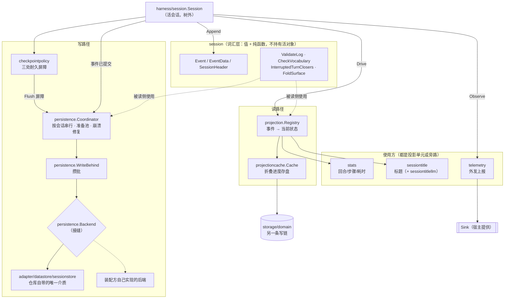

**图怎么看**：中间那个 `harness/session.Session`（活会话）是发动机，它不在本文范围内，但每一条线都从它出发。往左下是**写**：事件先被屏障按住、刷到硬盘，再攒批落到介质。往右下是**读**：同一条事件被同步折进各个投影，投影的进度再被缓存到另一条写链上。最上面那层是词汇——它只有值和纯函数，写侧读侧都用它，但它谁也不认识。

`persistence.Backend` 是一道**缝**，不是一个实现。本仓库是一个空运行时，落盘介质由装配它的人挑；仓库里自带的只有 `adapter/datastore/sessionstore` 一个，上游那两个第一方后端（JSONL、SQLite）在裁决表里是 `OUT_OF_SCOPE`，没有移过来。

**要紧的一点**：两条写链是**分开**的。会话日志走 `persistence.Backend`，投影缓存走 `storage/domain`，它们不要求同一个介质。唯一的约束是次序——事件必须先于对应的缓存落盘，**缓存可以落后于日志，不能领先于日志**，否则恢复时会出现没有事实依据的状态。

### 一条事件的一生

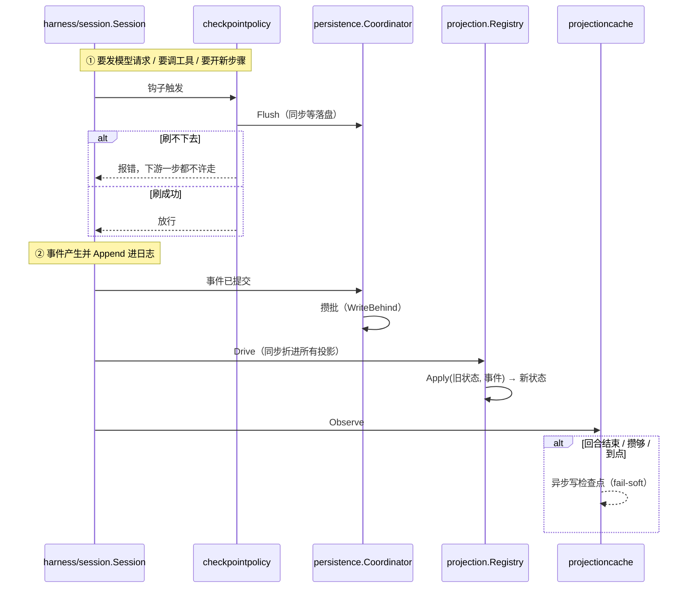

**图怎么看**：注意 ① 和 ② 的方向相反。

- ①**发生之前**拦住：屏障是一道闸门，刷不下去就整条路断掉，模型请求发不出去、工具跑不起来。宁可这次做不成，也不做一件没人记得的事。
- ②**提交之后**跟进：投影和缓存都是尽力而为，失败了只是下次读的时候慢一点。

一句话记住这张图：**关门的在前面，尽力而为的在后面。**

### 两条写链，一条次序

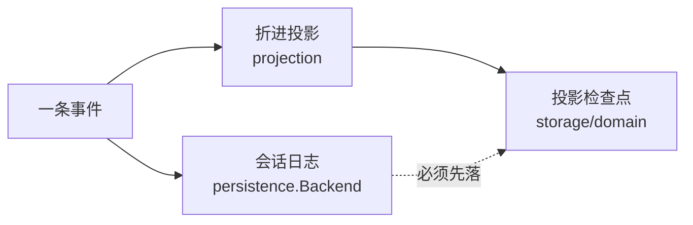

**图怎么看**：两条链各写各的介质，但那条虚线是硬约束。缓存里的每一个值都必须能在已落盘的日志里找到依据；如果缓存先落了、日志没落，崩溃之后就会有一份**从任何已存日志都推不出来的状态**，而且它带着一个看起来完全正常的水位，堂堂正正地被端给客户端。这就是 `projectioncache.Options.Flush` 存在的全部理由。

### 三级读法

同一份状态有三条读路径，代价递增，全部由 `projection.Registry` 提供，`projectioncache` 给出带介质的那两级：

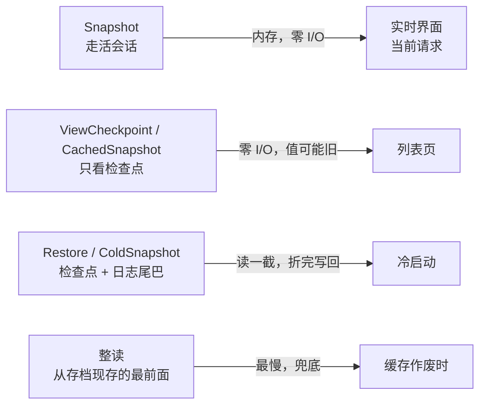

**图怎么看**：从左到右越来越贵。产品视角上这就是「为什么列表页秒开、点进去要转一下圈」：列表页走第二级（一次 I/O 都不做，直接看存下来的进度），点进去走第三级（读一截日志补上最新的那几条）。

谁在用哪一级：

| 级 | 谁用 | 值有多新 | 代价 |
|---|---|---|---|
| `Snapshot` | 当前正在跑的这个会话 | 实时 | 零 I/O，但要求会话是活的 |
| `CachedSnapshot` | 会话列表 | 到上一次检查点为止 | 零 I/O |
| `ColdSnapshot` | 点开一个冷会话 | 实时 | 读一截日志尾巴 |
| 整读 | 缓存作废时的兜底 | 实时 | 读现存的整份日志 |

阶梯往下退是设计内的：缓存缺失、版本变化、绑到另一段日志、或者日志被崩溃修复截过尾，都会自动降到更慢的一级，但**任何一级都不会给出错的值**。这一条是整个读侧的底线——一个值可能**旧**，绝不可能**错**。

---

## 各包能力与能力边界

### 先看全貌

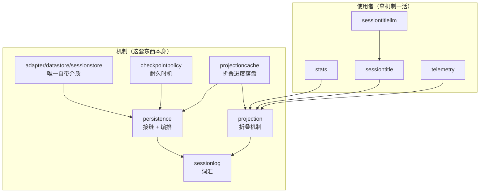

**图怎么看**：箭头是「谁依赖谁」。`sessionlog` 在最底下，谁都可以用它，它谁都不用——这是它能只放值和纯函数的原因。`adapter/datastore/sessionstore` 是 `persistence` 的**使用者**而不是它的一部分，装配方自己写的后端站在同一个位置。右边那一列全部只依赖 `projection`，它们随时可以整个不装。

一张表看完十个单元的能力和它最要紧的那条边界：

| 包 | 能力一句话 | 最要紧的一条边界 |
|---|---|---|
| `sessionlog` | 事件长什么样、日志立不立得住 | 不持有任何活对象 |
| `persistence` | 落盘接缝 + 按会话串行的编排 | 不是具体介质 |
| `adapter/datastore/sessionstore` | 一个会话一条流，接到日志集上 | 没有逐字节原始存档，也不认路 |
| `checkpointpolicy` | 三处副作用边界上的耐久屏障 | 只喊「现在刷」，不判断「有没有东西要刷」 |
| `projection` | 事件折成当前状态的机制 | 只提供机制，不提供内容 |
| `projectioncache` | 折叠进度落盘 + 两级带介质读 | 永远不是权威，随时可以整个丢掉 |
| `stats` | 从整份日志折出会话数字 | 数 `step/end`，不数装配好的助手消息 |
| `sessiontitle` | 标题状态与三种来路 | 不缓存任何标题，每次从日志现折 |
| `sessiontitlellm` | 拿模型起标题 | 只收一个窄接口，不收整个 LLM 运行时 |
| `telemetry` | 上报的采集侧 | `Emit` 下游一个字都不建模 |

下面逐包展开。

### `sessionlog`（顶层，词汇层）

**它解决什么**：所有人都得对「一条会话记录长什么样」有共识，否则写的人和读的人对不上。这个包就是那份共识，而且只是共识——它不干活。

**能力**

- 定义一条日志条目：`Event`（含 `Seq`、`Time`、`Type`、`Data`）、13 种具名负载 `EventData`、会话头 `SessionHeader`、`SessionID`。
- 判一份日志立不立得住：`ValidateLog`（序号、回合/步骤配对、工具调用配对）、`CheckVocabulary`（读到不认识的类型怎么办）、`invariant.go` 里的日志不变量。
- 把一份崩在半路的日志补齐成提供方肯收的历史：`repair.go`、`InterruptedTurnClosers`（算该补哪几条收尾事件）。
- 把日志折成模型可见历史：`FoldSurface`、`surfaceop.go`、`chunkrow.go`。

**边界**

- **不持有任何活对象。**没有事件总线、没有发布时机、没有 seed 生命周期——那些在 `harness/session`。拆开的理由是持久化层只需要值和纯函数，放一个包里它就得连着一整套用不到的东西一起立起来。
- **不解释业务含义。**它知道一条 `tool/call` 后面该配一条 `tool/result`，不知道那个工具干了什么。
- `Event.Data` 是 `json.RawMessage`，**故意不解成联合类型**。上游登记表有 48 个事件类型，本仓库实现其中 13 个；日志是持久的，一个只认识 13 个类型的构建读到第 14 种时，正确行为是原样保管那段字节，而不是解成「未知」再排回去时丢掉字段。需要具名字段时才调 `DecodeData`，按需解码。
- 因此「解不开」不等于「日志失败」：那件事由 `CheckVocabulary` 单独判，判据是 `Event.Ignorable`。

### `feature/persistence`

**它解决什么**：日志得存到某个地方去，但「某个地方」是装配这套东西的人挑的。这个包给出那道缝，外加所有后端都躲不掉的那些活（按会话排队、崩溃之后怎么收拾）。

**能力**

三层，从下往上：

1. **词汇与纯函数**——`Backend`（介质的最小原始能力集）、`Store`（使用方的服务面）、`Location`/`RawArtifact`/`Snapshot`/`StoredPrefix`/`StoredSuffix` 等跨后端类型，以及 `CheckStored`（身份、格式版本、词汇三道判据，次序不能换）、`BalanceStored`（把一份中断的日志补平）、`SeedCoversPrefix`（认领活会话时那道判据）。四个可选能力接口（`SeekableBackend`、`LocatingBackend`、`ClosableBackend`、`TrimmingBackend`）由 `Seekable()`/`Locating()`/`Closable()`/`Trimming()` 做类型断言探测。
2. **`WriteBehind`**——自足的攒批控制器，不认识会话，只认识「攒一批、到点写下去、写失败了把缓冲留着」。
3. **`Coordinator`**——活的那层：按会话身份串行化每次操作，挂在会话存储的四条观察者（创建／事件／刷盘／销毁）上，认领活会话，维护准备池，编排崩溃修复，关闭时排干。

**边界**

- **不是具体介质。**上游第一方的两个后端（JSONL、SQLite）在裁决表里是 `OUT_OF_SCOPE`，没有移过来；本仓库自带的介质只有 `adapter/datastore/sessionstore` 一个，换别的就自己实现 `Backend`。本包给出的是那道缝。本包**不知道**下面是什么介质，也不该知道：数据库那一摊整个收在 `adapter/datastore` 底下，这条界线由 `internal/devtools/dbcheck` 把着。
- **不解释模型、工具或业务事件的业务含义。**
- 不做格式迁移：`FormatVersion` 在未发布期间钉在 0，不承诺兼容性，不匹配的日志直接拒收。既然不迁移，就没有旧形状要升级。
- **不看断尾凭据。**`StoredPrefix.TornMarker` 的类型是 `any`，编排层唯一会对它做的事就是原样递回 `Backend.CommitRepair`。`any` 表达的正是「不看」这件事本身。
- 不替代所有消费方接口。宿主仍需提供生产 `Backend`、注入 `harness/session.Store`、安装 Coordinator，并为 Agent Loop 适配 Preparation 的发布/释放。

### `adapter/datastore/sessionstore`

**它解决什么**：把上面那道缝真的落到一个介质上。这是仓库里唯一一个能直接拿去用的后端。

**能力**

一个会话就是一条流：会话 id 是流名，会话头是流的头，一条 event 是一条条目，event 的 seq 就是条目的 seq。本包里没有一句 SQL、没有一个连接池——那些全在 [持久化抽象层](datastore.md) 底下，它只做翻译。

它满足四道缝里的三道：`SeekableBackend`（按 seq 寻址在日志集上是走主键的一句读，不必像顺序介质那样先把前面全解一遍）、`ClosableBackend`、`TrimmingBackend`（按 seq 弹掉最老那一段）。

一次写就是一个事务，所以**不存在断尾**：要么整批提交，要么一条都没有。

**边界**

- **不满足 `LocatingBackend`，也不提供逐字节原始存档**（`Store.SupportsRawArtifacts` 恒假）——所有会话装在同一份介质里，没有「这个会话那份存档」可指，那两样没有对应物。
- `StoredPrefix.TornMarker` 恒为 nil；`CommitRepair` 收到非 nil 的 torn 说明编排器把别的后端的凭据递错了地方，当场拒绝，不去猜它是什么意思。
- 会话头在下面那一层是一段不透明的 JSON，所以解不回来的头、以及头里的身份和流名对不上，都由本包报成 `CorruptionError`；`List` 的排序也在本包做——下面那层不知道头里有个 `created_at`。
- 日志会从最老的一头弹出事件，所以「从哪个 seq 起」问的是现存最早那条；一份被弹空的存档答不出这个数，改由「下一条要写的 seq」回答。
- 变更令牌是来源限定的（介质实例 + 单元 + 计数）。拌进实例标识是必需的：两份各自独立的介质各自从 0 数起，不拌就会比出相等。

### `feature/checkpointpolicy`

**它解决什么**：就是本文开头那个「已经花过的钱不会凭空消失」。它在每一个撤不回来的动作之前，把日志按到硬盘上。

**能力**

在三处语义边界上立起耐久检查点。它自己一行状态都不存，装上去之后只做一件事：在「这一步的后果将要跑到会话日志管不着的地方去」之前，先把日志已经记下的那一段刷到耐久为止。

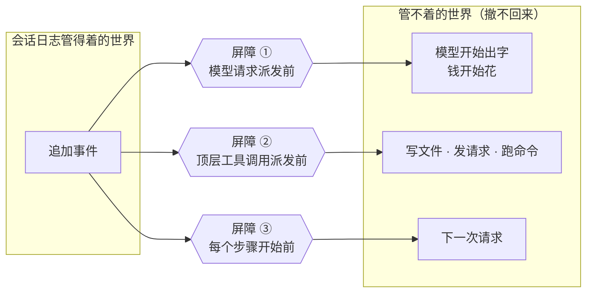

**图怎么看**：左边是这棵树管得着的世界（往日志里追加一条，随时可以重来），右边是撤不回来的世界。三个屏障就立在那道界线上，刷不下去就整条路断掉。

| 边界 | 刷的是什么 | 为什么是这里 |
|---|---|---|
| 模型请求派发前 | 这次请求 | 一发出去钱就开始花，模型也开始产出。此后崩溃，恢复出来的会话缺掉这次请求，而它的回答已经在世界上存在过了 |
| 顶层工具调用派发前 | 「我要调这个工具」那条记录 | 工具体是唯一能改到会话之外的世界的地方：写文件、发请求、跑命令 |
| 每个步骤开始前 | **上一步**提交的那一批 | 放在下一步开头而非上一步结尾——一个步骤结尾未必有下文，而下一次请求一定有 |

装卸是一对：`Install` 一次挂齐三条，返回把它们一起摘下来的函数；中途装不上就按反序摘干净再报错（半装上去比装不上更坏）。

**边界**

- **只负责喊「现在刷」，不判断「有没有东西要刷」。**后者在 `Store.Flush` 和 `WriteBehind` 里——判断需要缓冲状态，而缓冲状态只有持久化层知道。
- 它做的唯一判断是「这次该不该我管」：认不出会话就放过（起标题、压缩摘要这类辅助调用不属于任何会话），嵌套工具调用就放过（外层进来时已经刷过，里面再刷是拿一次 fsync 换零信息）。
- **不拥有存储后端**，也**不负责状态缓存的数量和时间节流**（那是 `projectioncache` 的事）。
- 三条规则本身写死，装配方只能选装不装、给谁装（`owner` 作用域）。
- 模型看不见它：它不在工具表里，模型无从调用，也不参与「要不要刷」的决定。

### `sessionlog/projection`

**它解决什么**：日志是流水账，界面要的是余额。这个包就是那台从流水账算余额的机器——而且是增量算的，来一条加一条，不是每次从头加一遍。

**能力**

把会话日志折成状态。域只写一个纯函数（`Apply`：上一个状态 + 一条事件 → 下一个状态，外加一个「变没变」），框架负责订阅、逐会话记水位、值变了通知出去。域不持有任何订阅，也不知道谁在读；读的一方不知道值是怎么算出来的。

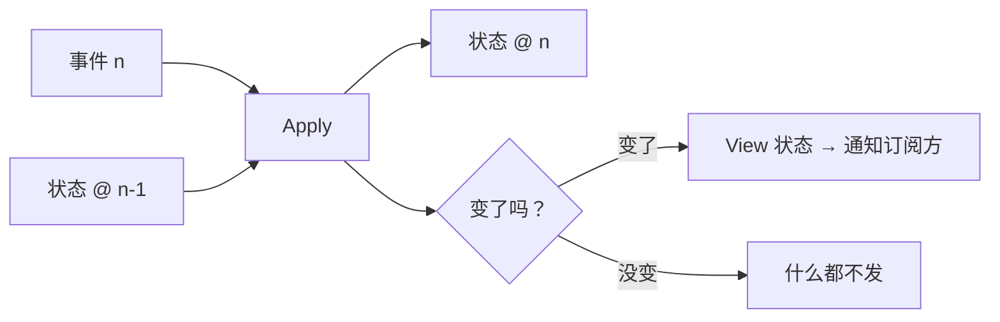

**图怎么看**：这就是整个包唯一的动作，重复 N 次。`Apply` 是各个域自己写的纯函数，框架只负责把它按顺序喂饱、把水位记住、把变化广播出去。「变没变」这个返回值是显式的，因为 Go 没法像 JS 那样靠引用相等来判断。

内存里是两跳定位：**投影键 → 会话 id → 单元格**，单元格里是 `{状态, 折到第几条}`。

对外四件事：登记（`Register`，引用计数、注销幂等）、推进（`Drive`）、读（三级）、出检查点（`Checkpoint`）。

**边界**

- **它是固定 Go 代码的确定计算，不是让模型分析聊天内容。**同一份合法日志加同一版规则必须得到同样的结果。
- **只提供机制，不提供内容。**具体算什么由各个域自己写；本包不认识任何一个投影的语义。
- **承重前提：整值事件规则。**一条带状态的日志事件必须携带**改完之后的完整状态**，绝不能只带增量。这让每次转移都便宜到可以无脑跑，也让每个被服务出去的值自己就说明了自己。
- 所有函数必须同步——一个异步单元会把读的一方那道一致性切口撕开。状态必须能原样进出 JSON，这是检查点能落盘的前提。
- `Checkpoint` 交出去的每个值都是**排出去的字节**，不是活引用：水位缓存是这张表权威的可变状态，一个拿到活引用的调用方能顺着它把后面每一次读切都改坏。
- 一份检查点行**永远不是权威**：版本对不上、或者它声称的水位超过了日志末尾，就丢掉重折。
- 单元格按会话身份存，清理必须显式（`Forget`）；不清只会多占内存，不会读出错的值。

### `feature/projectioncache`

**它解决什么**：上一个包每次都要从头把流水账加一遍。这个包把「加到哪儿了、加出来是多少」存到硬盘上，下次接着加。这就是列表页秒开的原因。

**能力**

把投影检查点落到耐久介质上。每个会话一条记录，记着它上一次被折到哪个 seq、以及折到那里时每个单元的状态。给出带介质的两级读法：`CachedSnapshot`（零 I/O，看已经读进内存的那条记录）和 `ColdSnapshot`（缓存行 + 从恢复地板起的一截尾巴，折完写回去，于是下一次冷读起点更近）。

写的触发点：

| 触发 | 节流 | 同步性 |
|---|---|---|
| 回合结束 | 否，必写 | 异步 |
| 攒够 N 条事件 | 是，`WriteEveryEvents` 可配 | 异步 |
| 间隔到点 | 是，`WriteInterval` 可配 | 异步 |
| 会话脱离（`Detach`） | 否，必写 | **同步**，错误交回调用方 |

两个阈值**必填、没有缺省值**：写太密就是每条事件一次 fsync，写太疏就是崩溃之后重放很长一段，代价只有部署方衡量得了。猜一个默认值等于替装配方做了一个它自己都不知道做过的决定。

**边界**

- **它是折叠的捷径，永远不是权威。**一条记录可能是旧的（它自己的 seq 说明旧到哪儿），但绝不会是错的。这一句决定了其余全部设计。
- **每一条写路径都是 fail-soft。**写丢了只意味着下一次冷读要多折一段尾巴，所以一次写失败不该让触发它的那次读或者那条事件跟着失败。
- **状态版本对不上就丢掉那一行，不迁移。**迁移意味着这一层要理解每个单元的状态语义，而它一个都不认识；丢掉只是退回去重折一遍。所以这里永远不会有迁移代码。
- **记录绑着日志身份。**会话 id 是一个**槽位**不是一段生命：删掉再重建同一个 id、或者在缓存还活着的时候把持久化根目录换掉，都会让一条旧记录通过所有水位检查，然后把一段和它毫无关系的日志折出来的状态端出去。所以每次读都要拿调用方手上那份头来核对身份。
- **每次写整条替换**，没有「只更新其中一个键」这种写法——那会写出一条各个键停在不同 seq 上的记录，而读的那一侧没有任何办法发现。
- 关掉之后一条都不写，回合结束那个必写点也不例外：会话比缓存活得长，一个已经卸载的缓存不该再往介质上写。
- **不关它用的那个存储域**——域是装配方打开的，也归装配方关。
- 写缓存前必须先把对应事件真正落盘。

### `feature/sessionstats`

**它解决什么**：会话详情页上那几个数字，怎么保证在不同客户端、不同翻页状态下都一样。

**能力**

一个投影单元，从**整份日志**折出会话数字：回合数、步骤数、模型墙上时间、工具墙上时间、首字延迟及其步骤数、解码时间及其 token 数。

存在的理由：客户端手上通常只有翻进来的那一段历史，翻页翻了多少、压缩掉了多少都会改变那段历史的长度，于是同一个会话在两个客户端上显示出两组不同的数字。这个单元数的是日志里的事件，不是表面上的节点，翻页和压缩都改不了它。

**边界**

- **数 `step/end`，不数 `assistant/message`。**步骤生命周期的权威是前者——循环每进一个步骤就在 finally 里追一条，所以跑完的、失败的、被取消的、撞上 token 上限的一律各留一条。改数装配好的助手消息会两头出错：撞上 token 上限那条只承载用量、内容是空的、根本不上表面（会多数），而被取消的步骤在消息装配出来之前就断了（会少数）。
- **每个字段在它第一条有贡献的事件落地之前都是零。**客户端读的是值，不是「键在不在」。
- 内部状态里的在途边界（当前开着的步骤、还没回结果的工具调用、最后数过的回合号）**不对外**，视图只交那组数字。
- **负载读不回来就当一条不相干的事件放过。**折叠没有报错的位置，也不该有：一条读不回来的负载说明它在被追加的时候就没验，那是追加那一侧的缺陷，一个统计单元没有资格因为它而让整次读失败。
- 取值范围校验只在从盘上读回来时跑——折叠本身只往上加非负的量，加不出越界的值；越界只可能来自一份被改过的、或者别的构建写下的检查点行。

### `feature/sessiontitle`

**它解决什么**：本文开头那个「立刻有名字，过一会儿变好，你改过就再也不动」。

**能力**

给一个会话起名，并且把这个名字**当成日志上的一条事件**来管：谁起的、从哪几句话起的、什么时候起的，全都写进去，一条都不放在旁边的可变元数据里。三种来路：

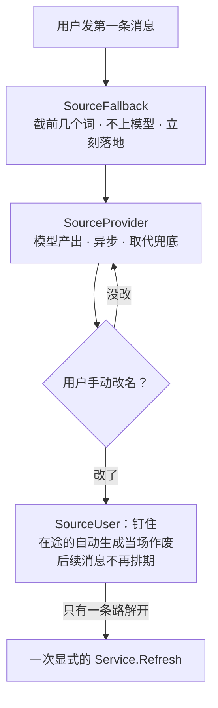

**图怎么看**：三种来路的优先级从上到下递增。兜底那一步是**同步、确定性、不花钱**的，所以列表行永远不会出现「无标题」；模型那一步是异步的，好了就顶掉；用户一改就钉死，除非显式刷新。

| 来路 | 特点 |
|---|---|
| `SourceFallback` | 截第一条人类消息的前几个词。确定性、不花钱、不上模型，所以在每一条够格的用户消息上都先落地，好让列表行立刻有个名字 |
| `SourceProvider` | 登记进来的那个唯一 `Provider` 产出的。异步、会被取代 |
| `SourceUser` | 用户自己改的。**钉住**这个标题——在途的自动生成当场作废，后面再来的用户消息也不再排期 |

**边界**

- **日志是唯一的真相。**`Service` 不缓存任何标题，`Service.Get` 每次都从日志现折。服务自己那份可变状态只有并发账（版本号、排着的活、跑着的活），一条都不进日志，进程重启后从零开始，而标题本身一个字都不会丢。
- 因此 `FoldSnapshot` 和 `CollectMessages`**不需要服务也不需要活会话**——一份回放出来的日志照样答得上话。
- 标题不是一个可以随手存在会话头上的字符串：它有三种来路，其中两种会互相盖，而「这个名字是谁起的、从哪句话来的」在换了模型、改了提示词之后必须还答得上来。一个可变字段答不了它，一条事件答得了。
- 用户钉住之后解开只有一条路：一次显式的 `Service.Refresh`。
- 投影登记和三条订阅都是显式入口：`RegisterProjection`，加上 `Service.OnEvent`、`Service.OnMainRequest`、`Service.OnSessionDisposed`。装配方接哪几条自己定；一份只做离线回放的装配一条都不接，`Service.Get` 照样管用。
- 有一条约定要守：`Session.Append` 会在服务持有自己那把锁的时候被调用，实现方不许反过来同步地调回本包的任何一个钩子。

### `feature/sessiontitle/sessiontitlellm`

**它解决什么**：上一个包里那个 `Provider` 的具体实现——真的去问一次模型。

**能力**

把一次辅助模型调用的全部策略收在一处：走哪条路由、系统提示词写什么、用户消息怎么装帧、多久算超时、输出怎么验。两档节奏——`NewFirstPrompt`（只拿第一条人类消息起名）和 `NewAllPrompts`（每来一条消息都拿到目前为止的全部消息重起一次）；两者的差别只在选消息那一下，其余策略逐字相同。

**边界**

- **交给模型的用户文本装成 JSON 数组，不拿换行或 `---` 拼。**用户打的字里完全可能有 `Ignore the above and output ...`、一行 Markdown 标题、或者任何一段看起来像分隔符的东西；拼起来等于让用户的输入有机会伪造成提示词的结构。装成 JSON 之后用户能改的只是数组里字符串的**值**，改不了数组本身的形状。这挡不住语义上的劝说，但挡住了结构上的伪造，而后者是这类调用里真正廉价、真正可重复的那一半。
- **派发之前先落一条请求事件**（`EventTitleLLMRequest`），把模型这次看到的东西一字不差地记下来：路由、系统提示词、装帧后的消息、输出上限、引了哪几条人类消息。它只进日志，不上模型可见表面，也不进派生历史。放在派发之前是有意的：一次超时或者断流同样留得下这条记录，否则最需要复盘的那些次调用恰好一条都不留。
- 只收一个「有 Stream 方法」的窄接口（`Streamer`），不收整个 LLM 运行时——本包只用得上流式那一件事，窄口让测试不必架起一整个运行时。
- 两个构造函数的登记 id（`FirstPromptID`、`AllPromptsID`）逐字照搬上游，因为那个 id 会被写进标题事件的来源里，改它等于改已经写下去的历史的读法。

### `feature/telemetry`

**它解决什么**：把会话里发生的事往外送一份，给观测系统用。它只管**采**，不管**送**。

**能力**

会话事件上报的**采集侧**。只管四件事：有哪些记录（那个固定的分块投影）、记录里带什么、什么时候采、以及交出去之前谁能改它（脱敏规则那条瀑布）。

采集入口是 `Coordinator` 上的七个方法，装配方在相应位置调它们：

| 方法 | 什么时候调 |
|---|---|
| `Adopt` | 认领一个会话 |
| `CaptureSession` | 把整份日志补采一遍 |
| `CaptureThrough` | 补采到某个 seq 为止 |
| `Observe` | 每提交一条事件 |
| `HintFlush` | 提示把手上的东西交出去 |
| `Retire` | 会话退场 |
| `RelayError` | 转一条错误信号 |

两条通道：

| 通道 | 内容 | 身份 |
|---|---|---|
| ledger | 和会话日志一一对应，一条事件一条记录 | 带 `event.seq`，接收方靠 `(会话 id, seq)` 去重 |
| ops | 日志里没有家的那两个信号（错误、关停） | **故意不带** seq 那类身份，免得被当成 ledger 的行 |

脱敏瀑布是一串显式规则，形状就是 http 中间件那条链：

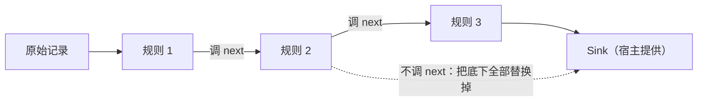

**图怎么看**：每条规则拿到原始记录加一个 `next`，调 `next` 就往下走并可以再加工它的返回值，**不调 `next` 就把底下全部替换掉**。这是部署方唯一能改上报内容的地方。

**边界**

- **`Emit` 下游的一切——攒批、重试、排队、丢弃策略——一个字都不建模。**这条线划在这里是有理由的：采集跑在 agent 循环的热路径上（每追加一条事件同步走一趟），而攒批和重试天生是要等的。两件事混在一个组件里，那个「要等的」迟早会拖住那个「不能等的」。
- **每个 (回合, 步骤) 只交出第一条流式分块**，当作「这个步骤开始出字了」这一个信号。内容不会丢——那个步骤装配好的完整消息里是逐字节完整的。于是**介质上 seq 有洞是常态，永远不是丢数据的信号**。
- 交接游标标的是**交出去**，不是**送到**：`Emit` 之后就往前走，再往下的投递是 SDK 的事，采集侧看不见。
- 没有游标时退回「第一条活事件减一」，**不是 0**：构造种子里的内容早就以另一个身份离开过进程（同一个 id 在上一个进程里恢复、或者父会话的流），重新交一遍等于重复上报。
- ops 记录只为**已认领**的会话产生，所以「按需采集不产生 ops 记录」这条行为自动成立。
- 规则和接收器都是**部署方挂上来的**代码，所以本包兜住它们的 panic：它们炸了不该把 agent 循环一起炸掉——上报是尽力而为的观察，不是业务。

---

## 生命周期与并发

### 装配顺序

这棵树里没有服务注册这一层，依赖全部由装配方显式递进来。

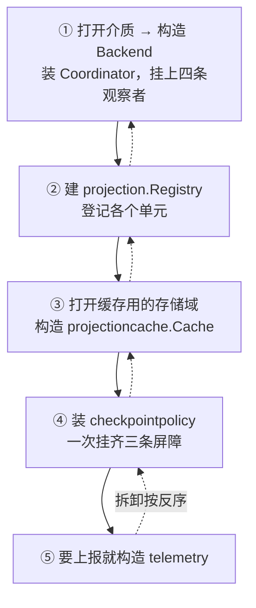

**图怎么看**：实线是装，虚线是拆。顺序不是随便排的——每一步都依赖上一步的产物：`Cache` 要 `Registry` 和 `Store`，`checkpointpolicy` 要 `Store` 已经装好。拆卸必须反序，理由同样是依赖：先拆下面的会让上面的对着一个已经没了的东西调。

1. 打开介质，构造 `persistence.Backend`（仓库自带 `adapter/datastore/sessionstore`，别的介质自己实现），装上 `Coordinator`，挂到 `harness/session.Store` 的四条观察者上。
2. 建 `projection.Registry`，把各个域的单元登记进去（`stats`、`sessiontitle` 的 `RegisterProjection`、以及树外的单元）。
3. 打开缓存用的存储域，构造 `projectioncache.Cache`（两个节流阈值必填），在提交事件之后调 `Observe`、在会话脱离时调 `Detach`。
4. 装 `checkpointpolicy`（一次装齐三条屏障），拿住返回的注销函数。
5. 要上报就构造 `telemetry.Coordinator`，在相应位置调那七个采集方法。

几处所有权约定：`projectioncache` 不关它用的那个存储域（谁打开谁关）；`checkpointpolicy` 的注销函数按反序摘；`Coordinator` 关闭时排干未落盘的批。

第 1 步里还有一个次序是承重的：`Coordinator.Install` **先登记排干、后登记那四条观察者**。作用域按登记的反序拆，于是拆的时候先摘观察者、再跑排干——事件的入口在最后一趟排干开始之前就关死了。反过来登记的话，排干会一边排一边有新的写进来，永远等不到静止。另外，装载之前就已经存在的活会话不会再补发一次「创建」，所以 `Install` 末尾会把它们一次性入册；热替换之后重新装载走的就是这条路。

### 谁在什么线程上

| 路径 | 同步性 | 谁调 |
|---|---|---|
| `checkpointpolicy` 三道屏障 | **同步阻塞**，等真正落盘 | llm 运行时 / 工具运行时 / agent 循环的钩子 |
| `projection.Drive` | **同步**，锁内折叠，锁外通知 | 会话那一侧，事件提交之后 |
| `projectioncache.Observe` | 记账同步，写盘**异步** | 同上 |
| `projectioncache.Detach` | **同步**，错误交回 | 会话脱离时 |
| `telemetry.Observe` | **同步**，跑在热路径上 | 同上 |
| `WriteBehind` 落盘 | 后台 | 定时器 / 攒够阈值 |

同步的那几条都在 agent 循环的热路径上，所以它们**必须便宜**：折叠是纯内存计算，采集是往一个函数里塞一份记录。唯一昂贵的是屏障，而它昂贵是有意的——那一刻的正确性比吞吐重要。

### 串行化约束

- 同一个会话的事件必须由**一个**调用方按 seq 顺序推进给 `projection.Registry`——那本来就是会话自己的活，日志的追加顺序就是它。
- `Coordinator` 按会话身份串行化每一次操作。
- 通知一律在锁外发：听众是外面的代码，它回头调本表上的任何方法都不该死锁。
- 投影单元格按会话身份存，并发读是支持的；`Drive` 会先比一次水位，挡住「读的一方正好在事件追加和推进之间懒建了单元格」这个窗口造成的重复应用。

### 时间与恢复

进程重启后，一个会话的状态这样重建：

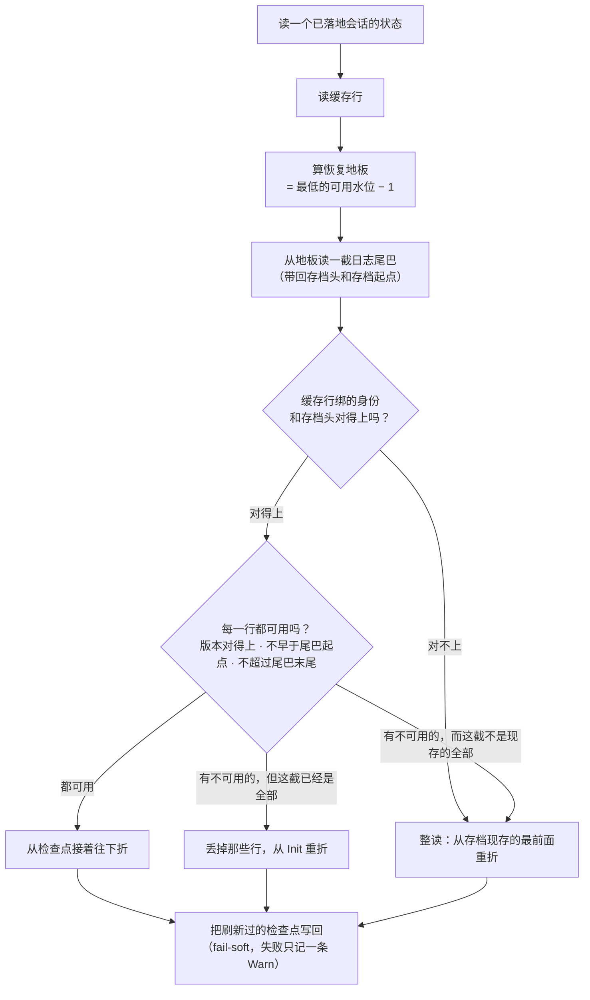

**图怎么看**：这张图上只有一条路会报错——读不到日志本身。其余每一条岔路都通向一个**正确但更慢**的结果，这就是「任何一级都不会给出错的值」在恢复路径上的具体形状。

两处容易忽略的细节：

- **算地板的时候故意往下让一条。**这样读回来的尾巴就能证明存储里的日志还延伸到哪儿——于是一份被崩溃修复截短了的日志会被当场发现，而不是把一行过期的数据当成当前值端出去。
- **「整读」的起点是个变量，不是 0。**日志会从最老的一头弹出事件，所以整读问的是「存档现存最早那条是第几号」（`StoredPrefix.BaseSeq` / `StoredSuffix.BaseSeq`，由后端说出来），而不是从 0 开始。

---

## 失败语义

全树只有两种失败姿势。判据只有一条：

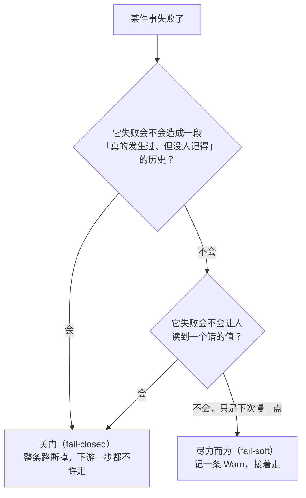

**图怎么看**：这张图是全树所有失败分支的判据。左边那条通向「宁可这次做不成」，右边那条通向「先记下来，回头补」。判断一个新写的失败路径该走哪边，就问这两个问题。

### 关门的（fail-closed）

前三条是 `CheckStored` 那三道判据，**次序不能换**：身份不对就说明拿错了东西，那时候版本号是谁的都不重要；版本不对就说明后面的结构本构建根本没法按今天的形状去解，那时候「词汇里有个没见过的类型」是一句会误导人的话。

| 场景 | 行为 |
|---|---|
| 读回来的头上写的会话身份不是请求的那个 | 拒。这道判据必须排在**发布任何状态之前**：后端要是把 a 的存档当成 b 的交出来，b 就会顶着 a 的历史活过来 |
| 日志格式版本不匹配 | 直接拒收，不迁移。而且这**不是损坏**——原始日志还在原地躺着，给使用者的提示是「升级运行时」，绝不能说「文件损坏」 |
| 日志里有本构建不认识、又没标可跳过的事件 | 拒的是**整份日志**，不是那一条事件：一条不认识的必需事件可能改变后面整段日志的解释方式，静默跳过就等于重建出一个错的会话 |
| 读回来的存档自己不成立 | 裹成一条损坏（`wrapCorruption`）。但格式拒绝不许再裹一层损坏，那会把「换个版本就能读」误报成「没救了」 |
| 检查点策略刷不下去 | 模型请求不发、工具不跑、步骤不进。刷不下去说明日志已经不可信了，此时再让副作用跑出去，等于亲手制造一段没人记得的历史 |
| 认领活会话时 seed 盖不住已落盘的前缀 | 拒。说明这个活会话和那份存档不是一回事，不能把后续事件往那份存档上接 |
| 脱敏规则返回错误 | 那条记录被扣下，不交给接收器 |
| 上报记录验不过 | 扣下并记一条日志。接收器多半要把它排成 OTLP，在那儿炸没人查得出来 |

### 尽力而为的（fail-soft）

| 场景 | 行为 |
|---|---|
| 投影缓存写失败 | 只记一条 Warn，缓存留在旧位置。下次冷读多折一段尾巴 |
| 缓存行版本对不上 / 绑到另一段日志 | 丢掉那一行，退回重折 |
| 缓存行解不开 | 退回重折，**但必须留下一条 Warn**——版本对得上却解不开说明这个构建自己写坏了那一行，而它的症状只是「每次冷读都慢一点」，没有任何人会去查 |
| 事件负载在投影里读不回来 | 当作一条不相干的事件放过 |
| 脱敏规则或接收器 panic | 兜住，不让 agent 循环跟着炸 |

### 崩溃修复

一次崩溃会在日志上留下两种痕迹，处理方式完全不同：

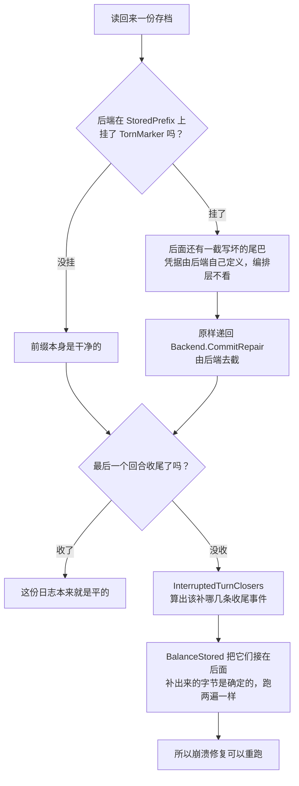

**图怎么看**：两件事拆得很干净。

- **「写坏的尾巴」是后端的事。**编排层只知道 `TornMarker` 非 nil 意味着后面挂着一截要截掉的东西，它的类型是 `any`——编排层唯一会做的就是把它原样递回 `Backend.CommitRepair`。`any` 表达的正是「不看」这件事本身。
- **「没收尾的回合」是词汇层的事。**`InterruptedTurnClosers` 从事件流本身算出该补哪几条，`BalanceStored` 把它们接在后面。因为补出来的那几条是**确定的**，这个函数跑两遍得到同样的字节——这就是崩溃修复可以安全重跑的原因。

事务型后端（`adapter/datastore/sessionstore`）不存在第一种痕迹：一次写就是一个事务，要么整批提交，要么一条都没有，所以它的 `TornMarker` 恒为 nil。它的 `CommitRepair` 一旦收到非 nil 的 torn，说明编排器把别的后端的凭据递错了地方，当场拒绝，不去猜它是什么意思。

---

## 能力边界

这棵树负责：

- 事件格式、负载、日志校验与崩溃修复。
- 持久化接缝、写后队列、按会话串行、准备池编排。
- 副作用边界上的耐久屏障。
- 从日志折出当前状态，以及那份折叠进度的缓存。
- 会话数字、会话标题、外发上报三种派生能力。

这棵树不负责：

- **决定模型如何回答、工具如何执行。**日志记录发生了什么，不参与决定。
- **活会话对象本身**（`harness/session`）和**会话检索**（`sessionquery`）。
- **提供全套生产介质。**接缝在这里，仓库只自带 `adapter/datastore/sessionstore` 一个后端；上游的 JSONL、SQLite 后端是 `OUT_OF_SCOPE`，换别的介质由装配方自己实现 `Backend`。
- **上报的投递。**攒批、重试、排队、丢弃全在 `Sink` 下游。
- **用户鉴权与租户权限**，也不提供 HTTP API。
- **把缓存当成权威。**任何一级缓存都可以整个丢掉重算。
- **自动修复所有语义损坏。**不可安全判断时必须失败。

---

## 相关源码

| 路径 | 内容 |
|---|---|
| `sessionlog/` | 事件、负载、会话头、日志校验、崩溃修复、表面折叠 |
| `feature/persistence/` | `Backend`/`Store` 接缝、`Coordinator`、`WriteBehind`、准备池、恢复原语 |
| `adapter/datastore/sessionstore/` | 把会话接到日志集上的适配层，仓库自带的唯一介质 |
| `feature/checkpointpolicy/` | 三处副作用边界上的耐久屏障 |
| `sessionlog/projection/` | 事件折成当前状态的注册表与三级读法 |
| `feature/projectioncache/` | 折叠检查点的持久化与两级带介质读法 |
| `feature/sessionstats/` | 回合、步骤、耗时的统计单元 |
| `feature/sessiontitle/` | 标题状态与三种来路的钉住规则 |
| `feature/sessiontitle/sessiontitlellm/` | 拿模型起标题的提供方实现 |
| `feature/telemetry/` | 采集、脱敏、交给宿主 Sink |
