# 会话日志与派生状态（`sessionlog/`）

本文讲会话日志这一条线：事件词汇，加上围着它转的九个包。这九个包分住在 `sessionlog/projection`、`feature/` 和 `adapter/` 三处，所以本文按职责编排，不按目录编排。活会话对象和会话检索不在本文范围内，只在需要说明接缝时点到名字。

下文的运行链路需要宿主显式接线：创建投影注册表、登记投影定义，并在会话事件提交后调用投影驱动和缓存观察入口。仅注册投影函数或创建缓存对象，不会自动订阅所有会话。`sessionlog/snapshot` 是测试日志快照工具，不参与正常的日志读写和会话恢复。

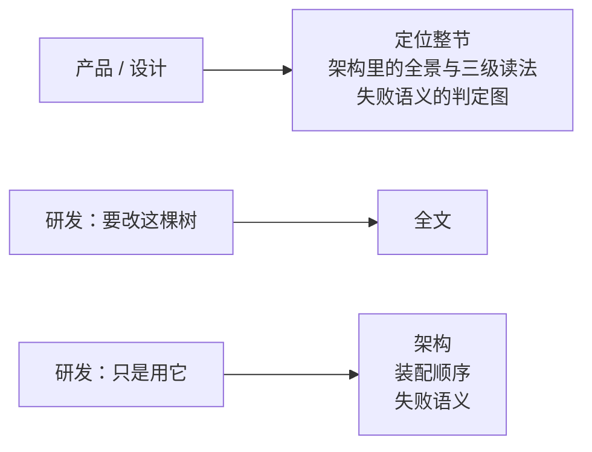
```mermaid
flowchart LR
    P["产品 / 设计"] --> P1["定位整节<br/>架构里的全景与三级读法<br/>失败语义的判定图"]
    D1["研发：要改这棵树"] --> D2["全文"]
    D3["研发：只是用它"] --> D4["架构<br/>装配顺序<br/>失败语义"]
```

---

## 定位

### 为什么需要这棵树

一次会话里发生过的事，如果只活在内存里，那么进程一没，它就等于没发生过。

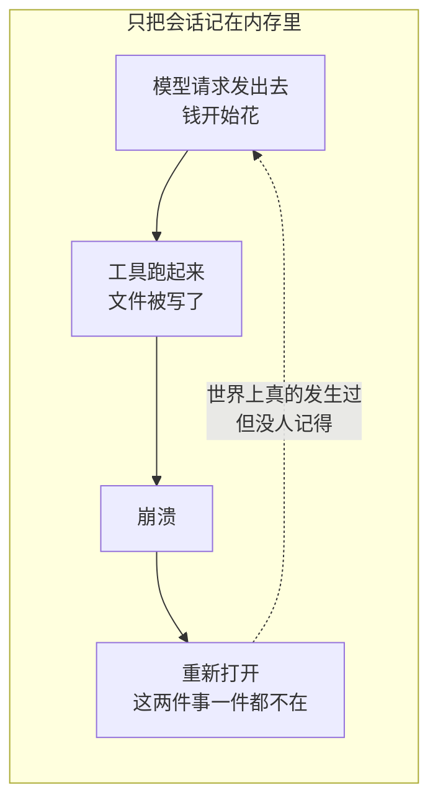
```mermaid
flowchart LR
    subgraph BAD["只把会话记在内存里"]
        A1["模型请求发出去<br/>钱开始花"] --> A2["工具跑起来<br/>文件被写了"]
        A2 --> A3["崩溃"]
        A3 --> A4["重新打开<br/>这两件事一件都不在"]
        A4 -.->|"世界上真的发生过<br/>但没人记得"| A1
    end
```

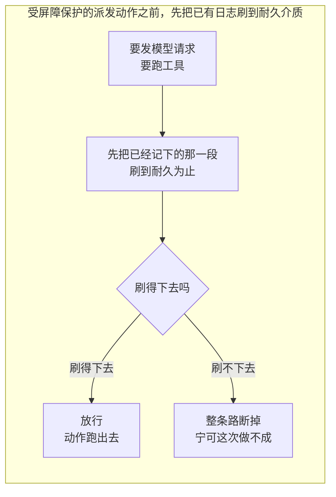
```mermaid
flowchart LR
    subgraph GOOD["受屏障保护的派发动作之前，先把已有日志刷到耐久介质"]
        B1["要发模型请求<br/>要跑工具"] --> B2["先把已经记下的那一段<br/>刷到耐久为止"]
        B2 --> B3{"刷得下去吗"}
        B3 -->|"刷得下去"| B4["放行<br/>动作跑出去"]
        B3 -->|"刷不下去"| B5["整条路断掉<br/>宁可这次做不成"]
    end
```

这棵树回答的就是这一件事：**一次会话里发生过什么，怎么记下来、怎么存住、怎么读成能用的东西。**

### 产品在界面上看到的四件事

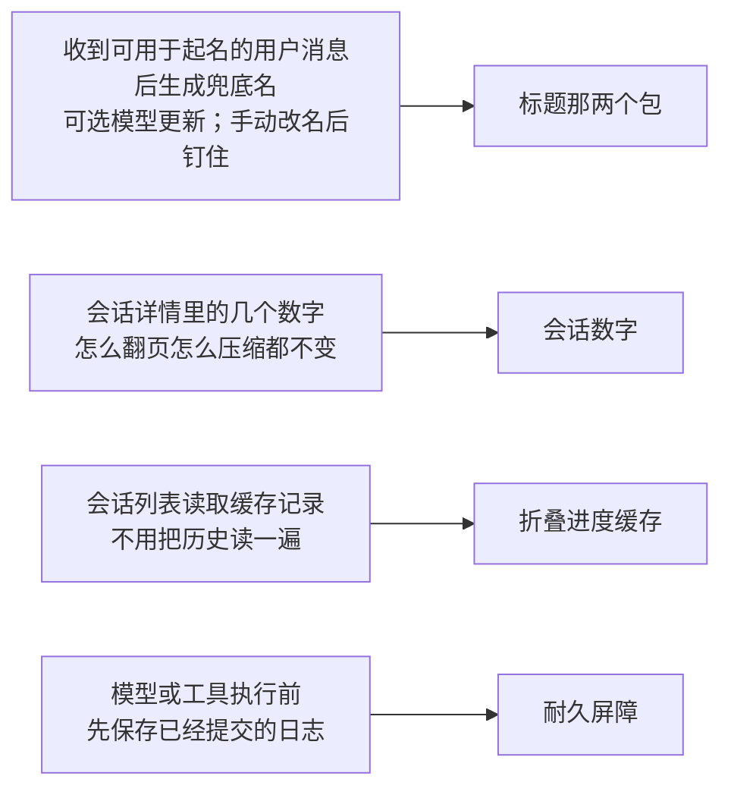
```mermaid
flowchart LR
    U1["收到可用于起名的用户消息后生成兜底名<br/>可选模型更新；手动改名后钉住"] --> T1["标题那两个包"]
    U2["会话详情里的几个数字<br/>怎么翻页怎么压缩都不变"] --> T2["会话数字"]
    U3["会话列表读取缓存记录<br/>不用把历史读一遍"] --> T3["折叠进度缓存"]
    U4["模型或工具执行前<br/>先保存已经提交的日志"] --> T4["耐久屏障"]
```

第四条是这棵树存在的根本理由。模型请求一发出去钱就开始花、回答也开始在世界上存在；工具一跑起来文件就被写了、请求就被发了。这些事撤不回来。

屏障保证的是执行前已有日志的耐久性，不保证完整记录所有已发生的费用或工具结果。请求发出后、用量返回前，或者结果追加后尚未落盘时崩溃，仍可能缺少结果和用量记录；外部副作用是否已经发生，也不能仅凭缺少结果事件判断。

### 三段责任，互不越界

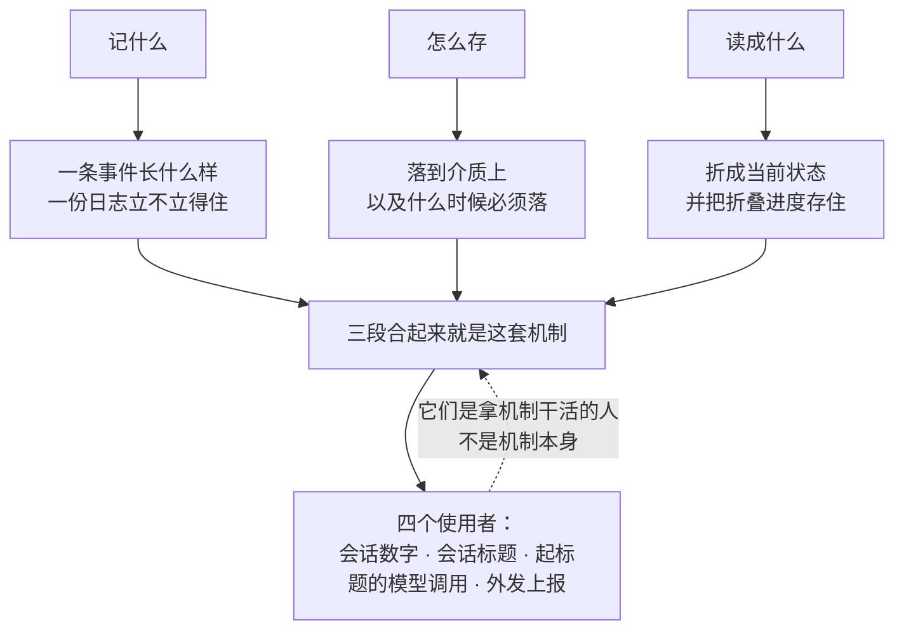
```mermaid
flowchart TB
    Q1["记什么"] --> A1["一条事件长什么样<br/>一份日志立不立得住"]
    Q2["怎么存"] --> A2["落到介质上<br/>以及什么时候必须落"]
    Q3["读成什么"] --> A3["折成当前状态<br/>并把折叠进度存住"]
    A1 --> M["三段合起来就是这套机制"]
    A2 --> M
    A3 --> M
    M --> U["四个使用者：<br/>会话数字 · 会话标题 · 起标题的模型调用 · 外发上报"]
    U -.->|"它们是拿机制干活的人<br/>不是机制本身"| M
```

### 术语对照

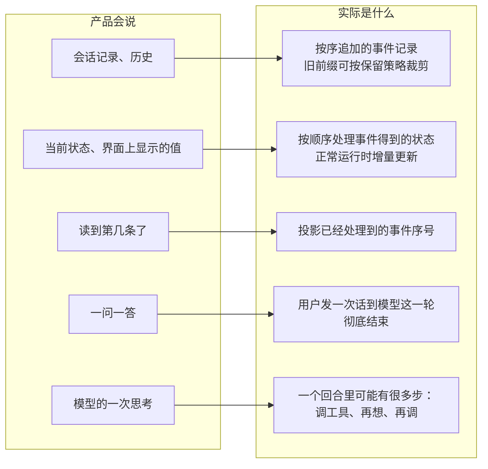
```mermaid
flowchart LR
    subgraph SAY["产品会说"]
        S1["会话记录、历史"]
        S2["当前状态、界面上显示的值"]
        S3["读到第几条了"]
        S4["一问一答"]
        S5["模型的一次思考"]
    end
    subgraph MEAN["实际是什么"]
        M1["按序追加的事件记录<br/>旧前缀可按保留策略裁剪"]
        M2["按顺序处理事件得到的状态<br/>正常运行时增量更新"]
        M3["投影已经处理到的事件序号"]
        M4["用户发一次话到模型这一轮彻底结束"]
        M5["一个回合里可能有很多步：调工具、再想、再调"]
    end
    S1 --> M1
    S2 --> M2
    S3 --> M3
    S4 --> M4
    S5 --> M5
```

「检查点」这个词在这棵树里有两个完全不同的含义，研发第一次读代码最容易在这里卡住：

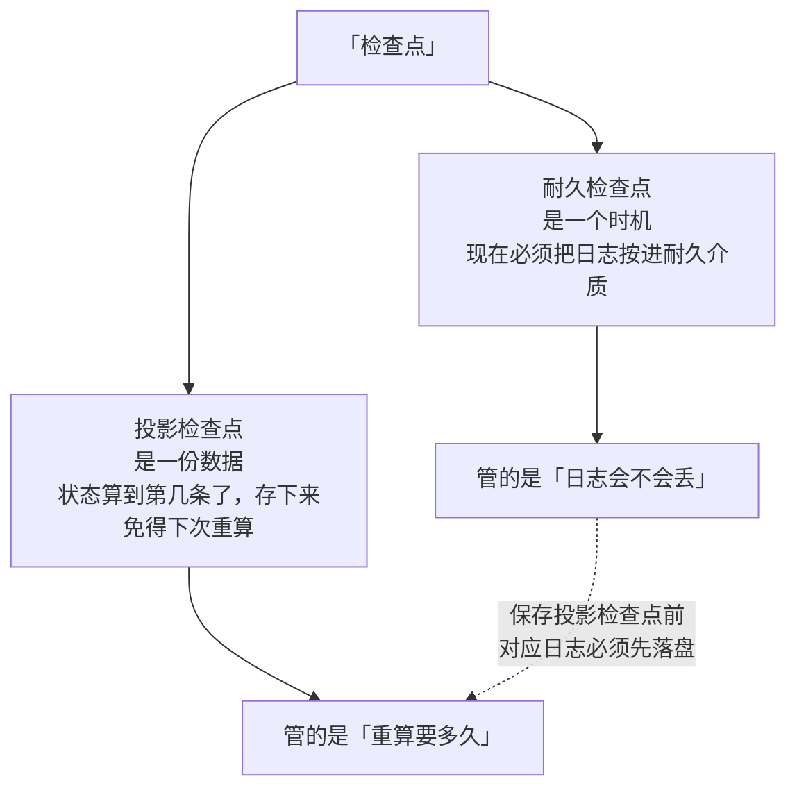
```mermaid
flowchart TD
    CP["「检查点」"] --> C1["耐久检查点<br/>是一个时机<br/>现在必须把日志按进耐久介质"]
    CP --> C2["投影检查点<br/>是一份数据<br/>状态算到第几条了，存下来免得下次重算"]
    C1 --> R1["管的是「日志会不会丢」"]
    C2 --> R2["管的是「重算要多久」"]
    R1 -.->|"保存投影检查点前<br/>对应日志必须先落盘"| R2
```

### 一条贯穿全树的原则

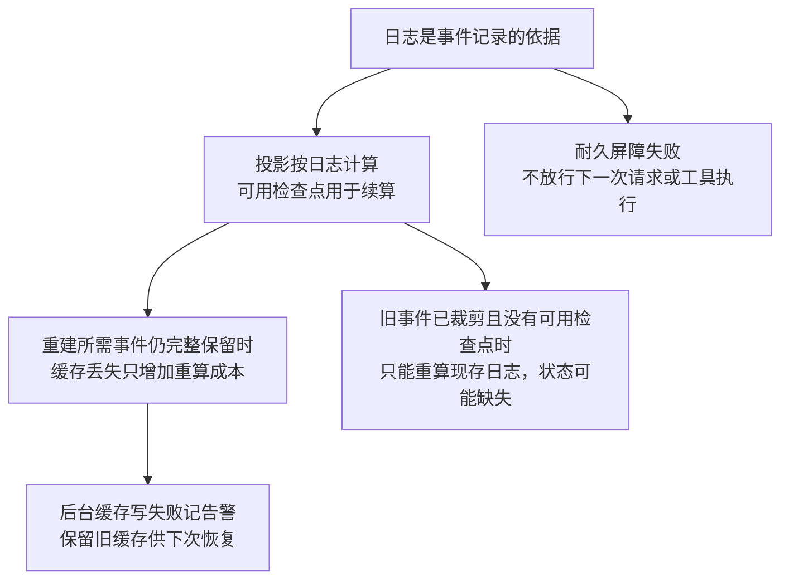
```mermaid
flowchart TD
    L["日志是事件记录的依据"] --> A["投影按日志计算<br/>可用检查点用于续算"]
    A --> B["重建所需事件仍完整保留时<br/>缓存丢失只增加重算成本"]
    A --> C["旧事件已裁剪且没有可用检查点时<br/>只能重算现存日志，状态可能缺失"]
    B --> D["后台缓存写失败记告警<br/>保留旧缓存供下次恢复"]
    L --> E["耐久屏障失败<br/>不放行下一次请求或工具执行"]
```

本仓库明确允许裁剪日志头部，也接受重算后丢失被裁剪事件对应的状态，见[会话日志上限](../session-log-limit.md)。因此，不能把“缓存随时可丢”理解成“业务数据永远可恢复”；若用投影承载必须长期保留的商品卡片等数据，需另行保证其完整恢复所需的事件或状态仍被保留。

---

## 架构

### 全景

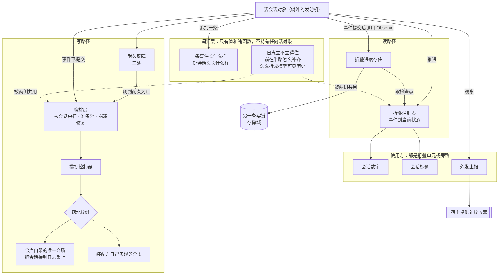
```mermaid
flowchart TB
    subgraph vocab["词汇层：只有值和纯函数，不持有任何活对象"]
        Event["一条事件长什么样<br/>一份会话头长什么样"]
        Rules["日志立不立得住<br/>崩在半路怎么补齐<br/>怎么折成模型可见历史"]
    end

    Live["活会话对象（树外的发动机）"]

    subgraph write["写路径"]
        Policy["耐久屏障<br/>三处"]
        Coord["编排层<br/>按会话串行 · 准备池 · 崩溃修复"]
        WB["攒批控制器"]
        Backend{"落地接缝"}
        PG["仓库自带的唯一介质<br/>把会话接到日志集上"]
        Other["装配方自己实现的介质"]
    end

    subgraph read["读路径"]
        Reg["折叠注册表<br/>事件到当前状态"]
        Cache["折叠进度存住"]
    end

    subgraph users["使用方：都是折叠单元或旁路"]
        Stats["会话数字"]
        Title["会话标题"]
        Tele["外发上报"]
    end

    Live -->|"追加一条"| Event
    Live --> Policy
    Policy -->|"刷到耐久为止"| Coord
    Live -->|"事件已提交"| Coord
    Coord --> WB
    WB --> Backend
    Backend --> PG
    Backend -.-> Other

    Live -->|"推进"| Reg
    Reg --> Stats
    Reg --> Title
    Live -->|"事件提交后调用 Observe"| Cache
    Cache -->|"取检查点"| Reg
    Cache --> Domain[("另一条写链<br/>存储域")]
    Live -->|"观察"| Tele
    Tele --> Sink[["宿主提供的接收器"]]

    Rules -.被两侧共用.-> Coord
    Rules -.被两侧共用.-> Reg
```

**图怎么看**：中间那个活会话是发动机，它不在本文范围内，但每一条线都从它出发。往左下是写，往右下是读。最上面那层是词汇——它只有值和纯函数，写侧读侧都用它，但它谁也不认识。

### 落地是一道缝，不是一个实现

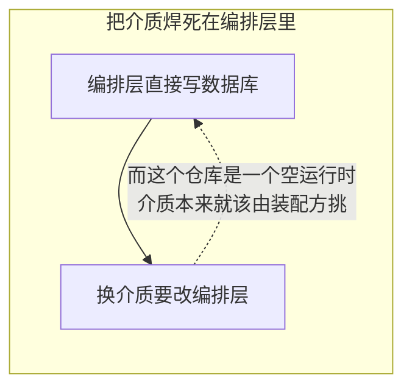
```mermaid
flowchart LR
    subgraph BAD2["把介质焊死在编排层里"]
        X1["编排层直接写数据库"] --> X2["换介质要改编排层"]
        X2 -.->|"而这个仓库是一个空运行时<br/>介质本来就该由装配方挑"| X1
    end
```

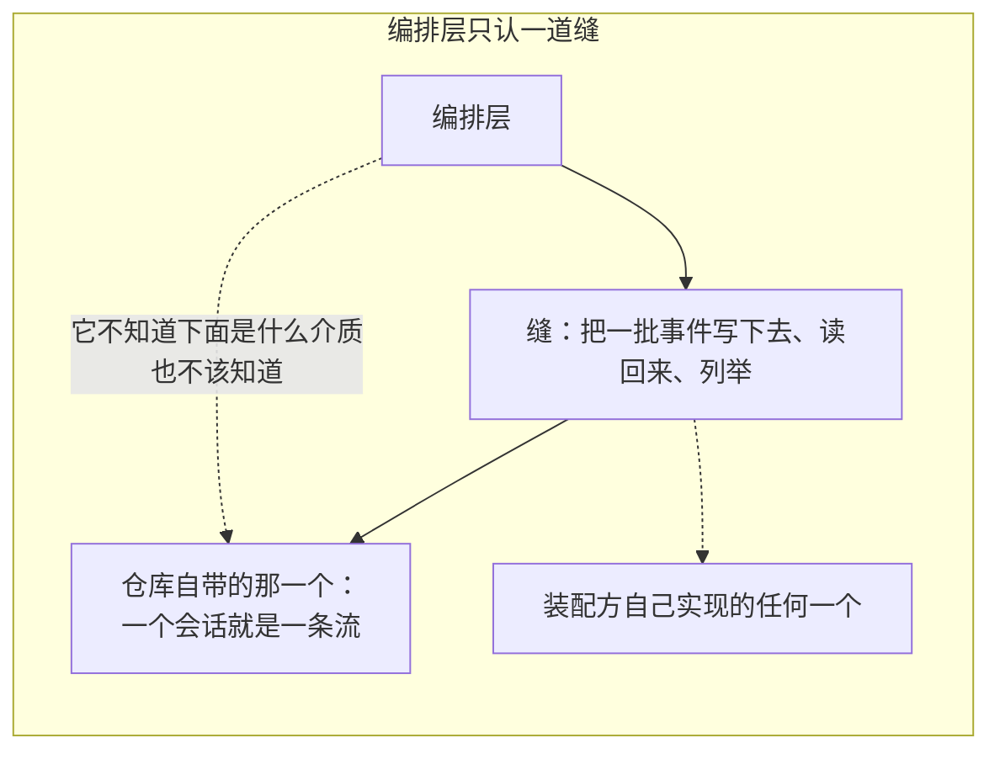
```mermaid
flowchart LR
    subgraph GOOD2["编排层只认一道缝"]
        Y1["编排层"] --> Y2["缝：把一批事件写下去、读回来、列举"]
        Y2 --> Y3["仓库自带的那一个：<br/>一个会话就是一条流"]
        Y2 -.-> Y4["装配方自己实现的任何一个"]
        Y1 -.->|"它不知道下面是什么介质<br/>也不该知道"| Y3
    end
```

DSH 那两个第一方介质在裁决表里是不做，没有移过来；仓库自带的只有一个。数据库那一摊整个收在持久化适配层底下，这条界线由仓库的数据库门禁把着。

### 两条写链，一条次序

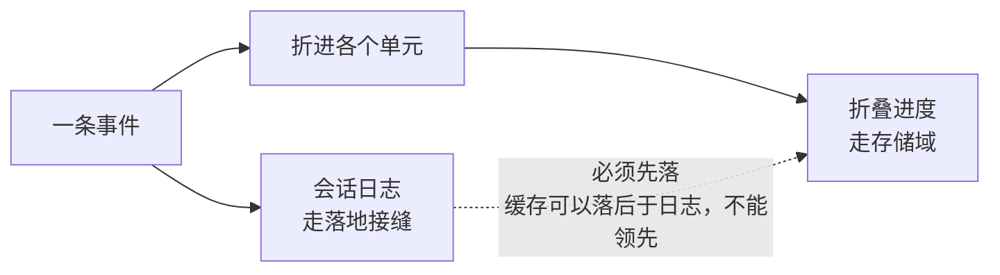
```mermaid
flowchart LR
    E["一条事件"] --> L1["会话日志<br/>走落地接缝"]
    E --> P1["折进各个单元"]
    P1 --> K1["折叠进度<br/>走存储域"]
    L1 -.->|"必须先落<br/>缓存可以落后于日志，不能领先"| K1
```

两条链各写各的介质，不要求同一个。唯一的约束是那条虚线。为什么：

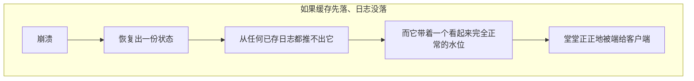
```mermaid
flowchart TD
    subgraph BAD3["如果缓存先落、日志没落"]
        Z1["崩溃"] --> Z2["恢复出一份状态"]
        Z2 --> Z3["从任何已存日志都推不出它"]
        Z3 --> Z4["而它带着一个看起来完全正常的水位"]
        Z4 --> Z5["堂堂正正地被端给客户端"]
    end
```

### 一条事件的一生

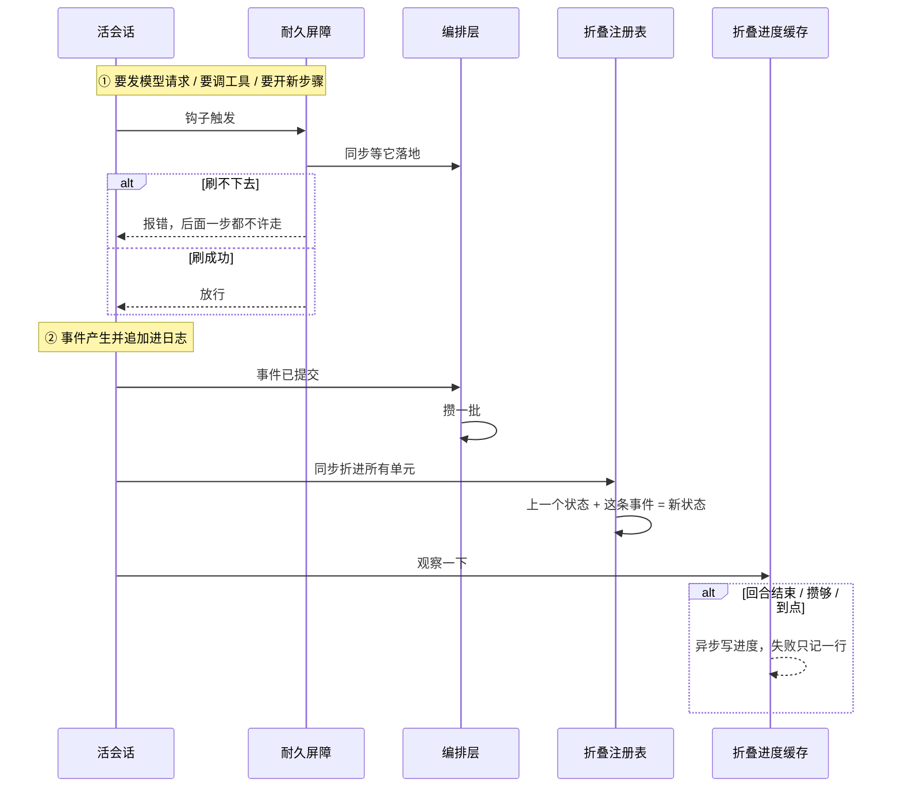
```mermaid
sequenceDiagram
    participant L as 活会话
    participant P as 耐久屏障
    participant C as 编排层
    participant R as 折叠注册表
    participant K as 折叠进度缓存

    Note over L,P: ① 要发模型请求 / 要调工具 / 要开新步骤
    L->>P: 钩子触发
    P->>C: 同步等它落地
    alt 刷不下去
        P-->>L: 报错，后面一步都不许走
    else 刷成功
        P-->>L: 放行
    end

    Note over L: ② 事件产生并追加进日志
    L->>C: 事件已提交
    C->>C: 攒一批
    L->>R: 同步折进所有单元
    R->>R: 上一个状态 + 这条事件 = 新状态
    L->>K: 观察一下
    alt 回合结束 / 攒够 / 到点
        K-->>K: 异步写进度，失败只记一行
    end
```

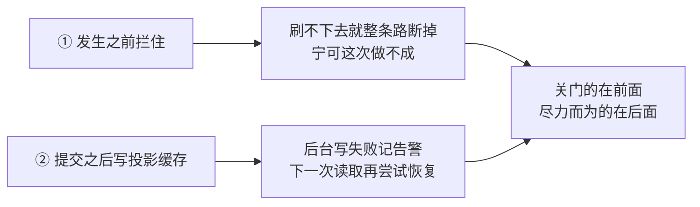
```mermaid
flowchart LR
    A["① 发生之前拦住"] --> A1["刷不下去就整条路断掉<br/>宁可这次做不成"]
    B["② 提交之后写投影缓存"] --> B1["后台写失败记告警<br/>下一次读取再尝试恢复"]
    A1 --> C["关门的在前面<br/>尽力而为的在后面"]
    B1 --> C
```

### 三级读法

同一份状态有三条读路径，代价递增：

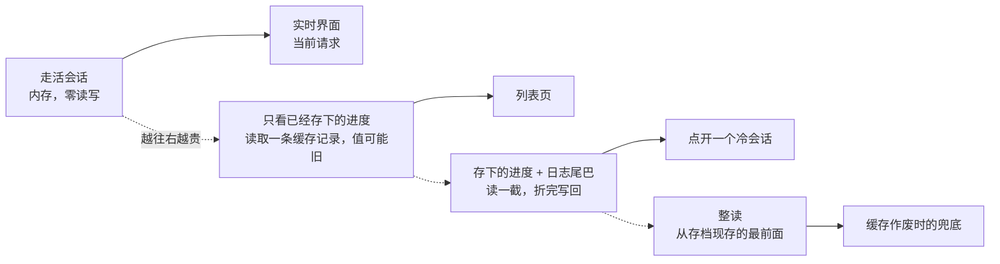
```mermaid
flowchart LR
    A["走活会话<br/>内存，零读写"] --> A1["实时界面<br/>当前请求"]
    B["只看已经存下的进度<br/>读取一条缓存记录，值可能旧"] --> B1["列表页"]
    C["存下的进度 + 日志尾巴<br/>读一截，折完写回"] --> C1["点开一个冷会话"]
    D["整读<br/>从存档现存的最前面"] --> D1["缓存作废时的兜底"]
    A -.->|"越往右越贵"| B
    B -.-> C
    C -.-> D
```

列表页可以走第二级，详情页需要较新状态时可以走第三级。实际延迟取决于存储和日志尾巴长度，缓存机制不保证固定的响应时间。

阶梯往下退是设计内的：

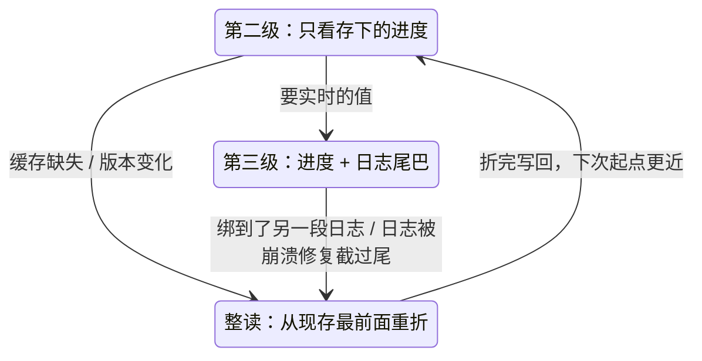
```mermaid
stateDiagram-v2
    state "第二级：只看存下的进度" as L2
    state "第三级：进度 + 日志尾巴" as L3
    state "整读：从现存最前面重折" as L4
    L2 --> L3 : 要实时的值
    L2 --> L4 : 缓存缺失 / 版本变化
    L3 --> L4 : 绑到了另一段日志 / 日志被崩溃修复截过尾
    L4 --> L2 : 折完写回，下次起点更近
```

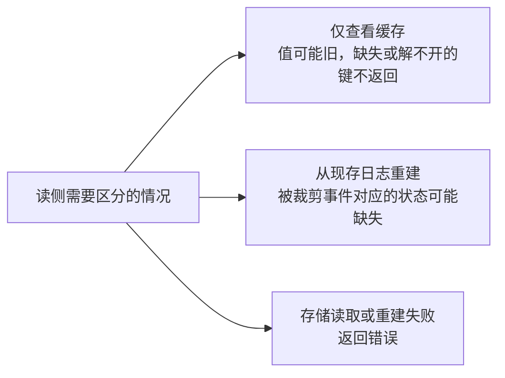
```mermaid
flowchart LR
    A["读侧需要区分的情况"] --> B["仅查看缓存<br/>值可能旧，缺失或解不开的键不返回"]
    A --> C["从现存日志重建<br/>被裁剪事件对应的状态可能缺失"]
    A --> D["存储读取或重建失败<br/>返回错误"]
```

---

## 十个单元各管什么

### 依赖全貌

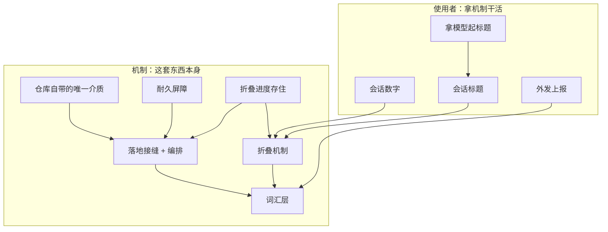
```mermaid
flowchart TB
    subgraph mech["机制：这套东西本身"]
        direction TB
        V["词汇层"]
        PE["落地接缝 + 编排"]
        PG2["仓库自带的唯一介质"]
        CP["耐久屏障"]
        PJ["折叠机制"]
        PC["折叠进度存住"]
    end

    subgraph use["使用者：拿机制干活"]
        direction TB
        ST["会话数字"]
        TI["会话标题"]
        TL["拿模型起标题"]
        TE["外发上报"]
    end

    PE --> V
    PG2 --> PE
    CP --> PE
    PJ --> V
    PC --> PJ
    PC --> PE
    ST --> PJ
    TI --> PJ
    TL --> TI
    TE --> V
```

箭头是本图所列单元之间的依赖，不是完整的 Go 导入关系。词汇层不依赖活会话服务，但会使用 `llm` 的消息类型。自带介质是接缝的使用者，装配方自己的介质站在同一个位置。右侧使用者可按需装配：统计和标题使用投影机制，标题模型实现依赖标题接口，遥测直接消费会话事件。

一张表看完十个单元的能力和它最要紧的那条边界：

| 单元 | 能力一句话 | 最要紧的一条边界 |
|---|---|---|
| 词汇层 | 事件长什么样、日志立不立得住 | 不持有任何活对象 |
| 落地接缝 + 编排 | 那道缝 + 按会话串行的编排 | 不是具体介质 |
| 自带的那个介质 | 一个会话一条流，接到日志集上 | 没有逐字节原始存档，也不认路 |
| 耐久屏障 | 三处副作用边界上的屏障 | 只喊「现在刷」，不判断「有没有东西要刷」 |
| 折叠机制 | 事件折成当前状态 | 只提供机制，不提供内容 |
| 折叠进度 | 进度落地 + 两级带介质读 | 是恢复缓存；丢弃后只能依赖现存日志重建 |
| 会话数字 | 从整份日志折出那几个数 | 数步骤收尾事件，不数装配好的助手消息 |
| 会话标题 | 标题状态与三种来路 | 服务查询从日志折叠；注册的标题投影另有内存状态 |
| 拿模型起标题 | 一次辅助模型调用的全部策略 | 只收一个窄接口，不收整个模型运行时 |
| 外发上报 | 上报的采集侧 | 交出去之后的那一段一个字都不建模 |

---

### 词汇层

它定义一条会话记录的结构，并提供校验、折叠和修复的纯函数；不负责订阅会话事件或操作存储。

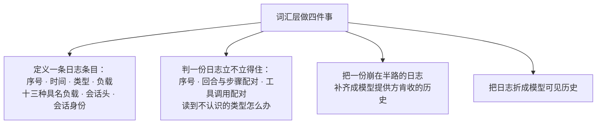
```mermaid
flowchart TB
    V["词汇层做四件事"] --> V1["定义一条日志条目：<br/>序号 · 时间 · 类型 · 负载<br/>十三种具名负载 · 会话头 · 会话身份"]
    V --> V2["判一份日志立不立得住：<br/>序号 · 回合与步骤配对 · 工具调用配对<br/>读到不认识的类型怎么办"]
    V --> V3["把一份崩在半路的日志<br/>补齐成模型提供方肯收的历史"]
    V --> V4["把日志折成模型可见历史"]
```

事件负载**故意不解成联合类型**：

```mermaid
flowchart LR
    subgraph BAD4["解成一个封闭联合"]
        A1["核心词汇表登记 13 种类型<br/>其他包可以扩展自己的事件类型"] --> A2["核心解码器读到其他类型"]
        A2 --> A3["解成「未知」"]
        A3 --> A4["排回去时把它的字段丢掉"]
        A4 -.->|"而日志是持久的<br/>丢掉的是别人写下的历史"| A2
    end
```

```mermaid
flowchart LR
    subgraph GOOD4["负载就是一段原始字节"]
        B1["读到不认识的类型"] --> B2["原样保管那段字节"]
        B2 --> B3["需要具名字段时才按需解一次"]
    end
```

不认识的负载可以原样保管；是否允许恢复这份日志，由词汇检查另行判断。已知类型的负载格式损坏，则可能在解码或日志校验时返回错误。

```mermaid
flowchart TD
    E["读到一条事件"] --> Q{"本构建认识这个类型吗"}
    Q -->|"认识"| OK["按具名字段用"]
    Q -->|"不认识"| Q2{"这条标了可跳过吗"}
    Q2 -->|"标了"| SKIP["放过，原样保管字节"]
    Q2 -->|"没标"| REJ["拒的是整份日志"]
    REJ -.->|"一条不认识的必需事件<br/>可能改变后面整段日志的解释方式<br/>静默跳过等于重建出一个错的会话"| REJ
```

它还有一条边界：**不解释业务含义**。它知道一条「要调这个工具」后面该配一条「工具给了什么」，不知道那个工具干了什么。拆出来单放一个包的理由是落地那一层只需要值和纯函数，混在一起它就得连着一整套用不到的东西一起立起来。

---

### 落地接缝与编排

```mermaid
flowchart TB
    L3["第三层：编排<br/>按会话身份串行化每次操作<br/>挂在会话存储的四条观察者上<br/>认领活会话 · 维护准备池 · 编排崩溃修复 · 关闭时排干"] --> L2["第二层：攒批控制器<br/>不认识会话，只认识<br/>「攒一批、到点写下去、写失败了把缓冲留着」"]
    L2 --> L1["第一层：词汇与纯函数<br/>介质的最小原始能力集 · 使用方的服务面<br/>跨介质的那几种值 · 三道判据 · 把中断的日志补平 · 认领时那道判据"]
```

介质的五项可选本事由类型探测发现，有就用、没有就当场说清楚：按序号直接寻址、可关闭、可从最老一头弹掉、能整份删掉、能指出一份逐字节的原始存档。前三项和第五项缺席时退回慢做法或降级；**删除缺席时是一句明确的拒绝**——回报一句「删成功了」而其实什么都没删，会让使用方的列表刷新之后那一条又冒出来。

「整份删掉」和「从最老一头弹掉」不是一回事：

```mermaid
flowchart TD
    A["弹掉一段"] --> A1["那份存档还在<br/>答得出「下一条写在哪儿」"]
    A1 --> A2["读的一方靠起点认出前面那截没了"]
    B["整份删掉"] --> B1["这个身份不存在了"]
    B1 --> B2["再问它得到「会话不存在」<br/>同一个身份重新建得起来"]
    C{"拿「弹到末尾」顶删除"} -.->|"会造出一份空存档<br/>而空存档是一个合法的、还能接着写的会话"| C
```

删除排在三道拦之后，次序是要紧的：

```mermaid
flowchart TD
    S["要删一份存档"] --> G1{"介质删得动吗"}
    G1 -->|"删不动"| X1["当场拒<br/>不假装删过"]
    G1 -->|"删得动"| G2["先等这个身份上<br/>正在跑的退场收手"]
    G2 -.->|"退场跑在自己的协程上<br/>赶在它前面删<br/>那趟最后一次刷盘会把事件<br/>写回一个刚被删掉的身份"| G2
    G2 --> G3{"准备池里有人独占着吗"}
    G3 -->|"有"| X2["拒<br/>那份预留一发布就会照自己的游标往下写"]
    G3 -->|"没有"| G4{"还绑在活会话上吗"}
    G4 -->|"是"| X3["拒<br/>先让它退场再删"]
    G4 -->|"否"| OK["删掉，并把这个身份从册子上划走"]
```

**四条边界**：

```mermaid
flowchart TD
    N["这一层不做什么"] --> N1["不是具体介质<br/>它给出的是那道缝"]
    N --> N2["不解释模型、工具或业务事件的业务含义"]
    N --> N3["不做格式迁移<br/>格式版本在未发布期间钉在 0<br/>不承诺兼容性，不匹配的日志直接拒收"]
    N --> N4["不看断尾凭据"]
    N3 -.->|"既然不迁移<br/>就没有旧形状要升级"| N3
```

断尾凭据这一条值得单说：

```mermaid
flowchart LR
    A["介质说：后面还挂着一截写坏的尾巴"] --> B["凭据的类型是「任意」"]
    B --> C["编排层唯一会做的事<br/>就是把它原样递回给那个介质"]
    C -.->|"「任意」这个类型<br/>表达的正是「不看」这件事本身"| B
```

这一层也不替代所有消费方接口：宿主仍需提供生产介质、把服务面注入会话存储、装上编排层，并为 agent 循环适配准备池的发布与释放。

---

### 仓库自带的那一个介质

```mermaid
flowchart LR
    S1["一个会话"] --> S2["就是一条流"]
    A1["会话身份"] --> A2["流名"]
    B1["会话头"] --> B2["流的头"]
    C1["一条事件"] --> C2["一条条目"]
    D1["事件的序号"] --> D2["条目的序号"]
    S2 -.->|"本包里没有一句 SQL、没有一个连接池<br/>那些全在持久化适配层底下<br/>它只做翻译"| S2
```

五项可选本事它满足其中四项：

```mermaid
flowchart TD
    Y["满足"] --> Y1["按序号直接寻址<br/>在日志集上是走主键的一句读<br/>不必像顺序介质那样先把前面全解一遍"]
    Y --> Y2["可关闭"]
    Y --> Y3["可从最老一头弹掉一段"]
    Y --> Y4["能整份删掉<br/>一条流连同它的条目在同一个事务里删完<br/>所以删不出「头还在、事件没了」的半截存档"]
    N["不满足"] --> N1["指出一份逐字节的原始存档"]
    N1 -.->|"所有会话装在同一份介质里<br/>没有「这个会话那份存档」可指<br/>这一样在这里没有对应物"| N1
```

```mermaid
flowchart LR
    T1["一次写就是一个事务"] --> T2["要么整批提交，要么一条都没有"]
    T2 --> T3["所以这个介质上不存在断尾"]
    T3 --> T4["它交出的断尾凭据恒为空"]
    T4 --> T5["一旦收到一个非空的凭据<br/>说明编排层把别的介质的凭据递错了地方<br/>当场拒绝，不去猜它是什么意思"]
```

还有三条判断落在这个包里：

```mermaid
flowchart TD
    H["会话头在下面那一层是一段不透明的 JSON"] --> H1["解不回来的头<br/>以及头里的身份和流名对不上<br/>都由本包报成损坏"]
    H --> H2["列举的排序也在本包做<br/>下面那一层不知道头里有个建会话时间"]
    P["日志会从最老的一头弹出事件"] --> P1["「从哪个序号起」问的是现存最早那条"]
    P1 --> P2["一份被弹空的存档答不出这个数<br/>改由「下一条要写的序号」回答"]
```

```mermaid
flowchart LR
    V1["变更令牌是来源限定的<br/>介质实例 + 单元 + 计数"] --> V2["拌进实例标识是必需的"]
    V2 --> V3["两份各自独立的介质各自从 0 数起<br/>不拌就会比出相等"]
```

---

### 耐久屏障

它自己一行状态都不存，装上去之后只做一件事：在「这一步的后果将要跑到会话日志管不着的地方去」之前，先把日志已经记下的那一段刷到耐久为止。

```mermaid
flowchart LR
    subgraph inside["会话日志管得着的世界"]
        S1["追加事件<br/>随时可以重来"]
    end
    B1{{"屏障 ①<br/>模型请求派发前"}}
    B2{{"屏障 ②<br/>顶层工具调用派发前"}}
    B3{{"屏障 ③<br/>每个步骤开始前"}}
    subgraph outside["管不着的世界：撤不回来"]
        O1["模型开始出字<br/>钱开始花"]
        O2["写文件 · 发请求 · 跑命令"]
        O3["下一次请求"]
    end
    S1 --> B1 --> O1
    S1 --> B2 --> O2
    S1 --> B3 --> O3
```

| 边界 | 刷的是什么 | 为什么是这里 |
|---|---|---|
| 模型请求派发前 | 这次请求 | 一发出去钱就开始花，模型也开始产出。此后崩溃，恢复出来的会话缺掉这次请求，而它的回答已经在世界上存在过了 |
| 顶层工具调用派发前 | 「我要调这个工具」那条记录及此前已提交事件 | 工具体可能执行写文件、发请求等外部副作用 |
| 每个步骤开始前 | **上一步**提交的那一批 | 放在下一步开头而非上一步结尾——一个步骤结尾未必有下文，而下一次请求一定有 |

装卸是一对：

```mermaid
flowchart LR
    A["一次挂齐三条"] --> B["返回一个把它们一起摘下来的函数"]
    A --> C{"中途装不上"}
    C --> D["按反序摘干净再报错"]
    D -.->|"半装上去比装不上更坏"| D
```

它做的唯一判断是「这次该不该我管」：

```mermaid
flowchart TD
    Q["一次钩子触发"] --> Q1{"认得出是哪个会话吗"}
    Q1 -->|"认不出"| P1["放过<br/>模型调用未带会话 ID 或找不到活会话<br/>工具调用缺少发起 Agent 上下文"]
    Q1 -->|"认得出"| Q2{"是有父调用的嵌套工具调用吗"}
    Q2 -->|"是"| P2["工具派发屏障放过<br/>该策略只保护顶层工具调用"]
    Q2 -->|"否"| GO["刷"]
```

是否属于“辅助调用”不是模型屏障的判断条件。标题模型实现会传入会话 ID；只要经过装有该规则的模型运行时，且能找到活会话，也会先刷日志。嵌套调用的跳过规则只适用于工具派发屏障。

```mermaid
flowchart TD
    N["它不做什么"] --> N1["只喊「现在刷」<br/>不判断「有没有东西要刷」"]
    N --> N2["不拥有存储介质"]
    N --> N3["不负责状态缓存的数量和时间节流"]
    N --> N4["三条规则本身写死<br/>装配方只能选装不装、给谁装"]
    N --> N5["模型看不见它<br/>它不在工具表里，模型无从调用<br/>也不参与「要不要刷」的决定"]
    N1 -.->|"判断需要缓冲状态<br/>而缓冲状态只有落地那一层知道"| N1
```

---

### 折叠机制

日志是流水账，界面要的是余额。这就是那台从流水账算余额的机器——而且是增量算的，来一条加一条。

```mermaid
flowchart LR
    E1["事件 n"] --> A1["折一次"]
    S0["状态停在 n-1"] --> A1
    A1 --> S1["状态推到 n"]
    A1 --> C{"变了吗"}
    C -->|"变了"| N["把新值通知出去"]
    C -->|"没变"| X["什么都不发"]
    C -.->|"「变没变」是显式返回的<br/>Go 没法像 JS 那样靠引用相等判断"| C
```

开发者注册一份投影定义，提供键、初始状态、状态更新函数、状态版本、解码函数，以及可选的对外视图。宿主在事件提交后调用 `Registry.Drive`；注册表负责逐会话更新状态、记录已处理序号并发出变更通知。注册表本身不订阅会话，也不操作数据库。

同一份注册表中的投影规则适用于送入它的所有会话，投影状态按会话 ID 隔离。它不是进程级的全局注册表，也不会自动对所有 Agent 生效。

```mermaid
flowchart LR
    K1["折叠键"] --> K2["会话身份"] --> K3["单元格：状态 + 折到第几条"]
    K3 -.->|"内存里就是这两跳定位"| K1
```

对外四件事：登记（引用计数、注销幂等）、推进、读（三级）、出检查点。

**事件可以携带完整状态，也可以携带增量。**

```mermaid
flowchart TD
    subgraph DELTA["增量事件：例如步骤结束"]
        A1["当前步骤数"] --> A2["收到一条步骤结束事件，加一"]
        A2 --> A3["依赖已有状态<br/>恢复时需要可用检查点或足够的历史"]
    end
```

```mermaid
flowchart TD
    subgraph FULL["完整状态事件：例如待办清单"]
        B1["事件携带更新后的完整清单"] --> B2["用这一份替换当前清单"]
    end
```

投影机制不强制事件必须携带整值。内置会话统计就是累加事件得到的状态；如何更新由各自的 `Apply` 决定。完整状态事件也需要保留到可恢复的日志范围内，才能在缓存丢失后重建。

检查点交出去的是**排出去的字节**，不是活引用：

```mermaid
flowchart LR
    subgraph BAD6["交出活引用"]
        C1["水位缓存是这张表权威的可变状态"] --> C2["一个拿到活引用的调用方"]
        C2 --> C3["能顺着它把后面每一次读切都改坏"]
    end
```

```mermaid
flowchart TD
    N2["它不做什么"] --> N21["它是固定代码的确定计算<br/>不是让模型分析聊天内容<br/>同一份合法日志加同一版规则<br/>必须得到同样的结果"]
    N2 --> N22["只提供机制，不提供内容<br/>本包不认识任何一个折叠单元的语义"]
    N2 --> N23["所有函数必须同步<br/>一个异步单元会把读的一方那道一致性切口撕开"]
    N2 --> N24["状态必须能原样进出 JSON<br/>这是检查点能落地的前提"]
    N2 --> N25["一份检查点行永远不是权威：<br/>版本对不上、或它声称的水位超过日志末尾<br/>就丢掉重折"]
    N2 --> N26["单元格按会话身份存，清理必须显式<br/>同 ID 对应另一段日志前必须清理旧状态"]
```

---

### 折叠进度存住

投影注册表在正常运行时增量更新内存状态，读取已经建立的状态不会从头重算。这个缓存模块把状态和已处理序号保存下来，让没有活会话时的读取、进程重启后的冷读可以少重放日志。仅注册投影函数不会产生持久检查点，还需要接上此缓存模块。

```mermaid
flowchart LR
    R["每个会话一条记录"] --> R1["上一次被折到哪个序号"]
    R --> R2["折到那里时每个单元的状态"]
    R1 --> U1["最快的持久缓存读法：<br/>从存储读取一条记录，不读取日志"]
    R2 --> U1
    R1 --> U2["冷读那一级：<br/>记录 + 从恢复地板起的一截尾巴<br/>折完写回去，下一次起点更近"]
```

四个写触发点：

```mermaid
flowchart TD
    W["什么时候写"] --> W1["回合结束<br/>不节流，必写，异步"]
    W --> W2["攒够 N 条事件<br/>节流，阈值可配，异步"]
    W --> W3["间隔到点<br/>节流，阈值可配，异步"]
    W --> W4["会话脱离<br/>不节流，必写，同步，错误交回调用方"]
```

这些触发依赖宿主在事件提交后调用 `Cache.Observe`、在会话卸载时调用 `Cache.Detach`。间隔计时从出现待保存的新事件时启动，不是空闲期间一直写。另有两条显式路径：宿主可以直接调用 `Cache.Write`；`ColdSnapshot` 重建完成后也会尝试写回检查点。

两个阈值**必填、没有缺省值**：

```mermaid
flowchart LR
    subgraph BAD7["给一个默认值"]
        A1["写太密"] --> A2["每条事件一次强制落地"]
        B1["写太疏"] --> B2["崩溃之后重放很长一段"]
        A2 -.->|"代价只有部署方衡量得了<br/>猜一个默认值等于替装配方<br/>做了一个它自己都不知道做过的决定"| B2
    end
```

**记录绑着日志身份**，这是最容易被忽略的一条：

```mermaid
flowchart TD
    A["会话身份是一个槽位，不是一段生命"] --> B1["删掉再重建同一个身份"]
    A --> B2["缓存还活着的时候把落地换到另一份介质上"]
    B1 --> C["一条旧记录通过所有水位检查"]
    B2 --> C
    C --> D["然后把一段和它毫无关系的日志折出来的状态端出去"]
    D --> E["所以每次读都要拿调用方手上那份头来核对身份"]
```

```mermaid
flowchart LR
    subgraph PARTIAL["读取各键序号不同的缓存记录"]
        X1["各键都保留自己的已处理序号"] --> X2["对外报告可见键中的最低序号<br/>不把较旧的值说成最新"]
    end
```

```mermaid
flowchart LR
    subgraph GOOD8["每次写整条替换"]
        Y1["正常按序驱动后取所有单元的检查点<br/>将整份记录一次替换"]
    end
```

```mermaid
flowchart TD
    N3["其余几条边界"] --> N31["缓存可能旧或不可用<br/>重建范围受现存日志限制"]
    N3 --> N32["后台写和冷读写回失败记告警<br/>显式 Write、Detach 失败返回错误"]
    N3 --> N33["状态版本对不上就丢掉那一行，不迁移"]
    N3 --> N34["Close 停止事件和计时器触发的新写入<br/>不等待已启动的后台写完成"]
    N3 --> N35["不关它用的那个存储域<br/>域是装配方打开的，也归装配方关"]
    N3 --> N36["写缓存前必须先把对应事件真正落地"]
    N33 -.->|"迁移意味着这一层要理解每个单元的状态语义<br/>而它一个都不认识<br/>所以这里永远不会有迁移代码"| N33
    N34 -.->|"显式 Write、Detach 不由 closed 开关拦截<br/>关闭存储前须安排好调用顺序"| N34
```

---

### 会话数字

会话详情页上那几个数字：回合数、步骤数、模型墙上时间、工具墙上时间、首字延迟及其步骤数、解码时间及其 token 数。

```mermaid
flowchart LR
    subgraph BAD9["数客户端手上那段历史"]
        A1["客户端通常只有翻进来的那一段"] --> A2["翻页翻了多少<br/>压缩掉了多少"]
        A2 --> A3["同一个会话在两个客户端上<br/>显示出两组不同的数字"]
    end
```

```mermaid
flowchart LR
    subgraph GOOD9["数整份日志里的事件"]
        B1["数的是日志里的事件<br/>不是表面上的节点"] --> B2["翻页和压缩都改不了它"]
    end
```

数哪一种事件也是一个判断：

```mermaid
flowchart TD
    Q["步骤生命周期的权威是谁"] --> A["步骤收尾事件"]
    A --> A1["循环每进一个步骤<br/>就在收尾处追一条"]
    A1 --> A2["跑完的、失败的、被取消的、<br/>撞上 token 上限的<br/>一律各留一条"]
    Q -.->|"改数装配好的助手消息会两头出错"| B["装配好的助手消息"]
    B --> B1["撞上 token 上限那条<br/>只承载用量、内容是空的、根本不上表面<br/>→ 会多数"]
    B --> B2["被取消的步骤<br/>在消息装配出来之前就断了<br/>→ 会少数"]
```

```mermaid
flowchart TD
    N4["其余四条"] --> N41["每个字段在它第一条有贡献的事件落地之前都是零<br/>客户端读的是值，不是「键在不在」"]
    N4 --> N42["内部状态里的在途边界不对外<br/>当前开着的步骤、还没回结果的工具调用、最后数过的回合号"]
    N4 --> N43["负载读不回来就当一条不相干的事件放过"]
    N4 --> N44["取值范围校验只在从介质上读回来时跑"]
    N43 -.->|"Apply 接口没有错误返回值<br/>该统计实现选择忽略解码失败的事件<br/>不能据此认为负载已经完整校验"| N43
    N44 -.->|"范围校验保护从介质加载的状态<br/>不替代写入侧的事件校验"| N44
```

---

### 会话标题

```mermaid
stateDiagram-v2
    state "没有名字" as S0
    state "兜底名：截第一条人类消息的前几个词" as S1
    state "模型起的名" as S2
    state "用户自己改的名：钉住" as S3
    S0 --> S1 : 用户发第一条消息，同步、确定、不花钱、立刻落地
    S1 --> S2 : 模型那一步异步跑完，顶掉兜底
    S1 --> S3 : 用户手动改名
    S2 --> S3 : 用户手动改名
    S3 --> S3 : 后续消息不再排期，在途的自动生成当场作废
    S3 --> S2 : 显式刷新且模型成功生成
    S3 --> S1 : 显式刷新且未登记模型生成器
```

接好标题服务后，有可用于起名的用户消息且追加成功时，会同步生成确定性的兜底名。空会话、尚无可用消息或写入失败时，仍可能没有标题。可选的模型生成成功后更新标题，用户手动改名后则停止自动覆盖，直到显式刷新。

标题为什么必须是日志上的一条事件，而不是会话头上一个可以随手改的字符串：

```mermaid
flowchart TD
    subgraph BAD10["存成会话头上一个可变字段"]
        A1["它有三种来路<br/>其中两种会互相盖"] --> A2["「这个名字是谁起的、从哪句话来的」"]
        A2 --> A3["换了模型、改了提示词之后<br/>就再也答不上来了"]
    end
```

```mermaid
flowchart TD
    subgraph GOOD10["当成日志上的一条事件"]
        B1["谁起的 · 从哪几句话起的 · 什么时候起的"] --> B2["全都写进去<br/>一条都不放在旁边的可变元数据里"]
        B2 --> B3["服务查询从日志现折<br/>标题投影另行维护供客户端读取的内存状态"]
        B3 --> B4["进程重启后重新建立服务状态<br/>标题恢复仍受日志保留范围影响"]
    end
```

因此折出一份标题快照、以及把够格的消息收集出来，这两件事**不需要服务也不需要活会话**——一份回放出来的日志照样答得上话。

```mermaid
flowchart LR
    A["投影登记和三条订阅都是显式入口"] --> B["装配方接哪几条自己定"]
    B --> C["一份只做离线回放的装配一条都不接<br/>「取一个会话的标题」照样管用"]
    D["有一条约定要守"] --> E["追加事件会在服务持有自己那把锁的时候被调用"]
    E --> F["实现方不许反过来<br/>同步地调回本包的任何一个钩子"]
```

---

### 拿模型起标题

把一次辅助模型调用的全部策略收在一处：走哪条路由、系统提示词写什么、用户消息怎么装帧、多久算超时、输出怎么验。

```mermaid
flowchart LR
    A["两档节奏"] --> A1["只拿第一条人类消息起名"]
    A --> A2["每来一条消息<br/>都拿到目前为止的全部消息重起一次"]
    A1 -.->|"两者的差别只在选消息那一下<br/>其余策略逐字相同"| A2
```

交给模型的用户文本装成 JSON 数组，不拿换行或分隔线拼：

```mermaid
flowchart TD
    subgraph BAD11["用换行或分隔线把几段用户文字拼起来"]
        X1["用户打的字里完全可能有<br/>一行像分隔符的东西<br/>或者一句「忽略上面的，改为输出……」"] --> X2["拼起来等于让用户的输入<br/>有机会伪造成提示词的结构"]
    end
```

```mermaid
flowchart TD
    subgraph GOOD11["装成 JSON 数组"]
        Y1["用户能改的只是数组里字符串的值"] --> Y2["改不了数组本身的形状"]
        Y2 --> Y3["挡不住语义上的劝说<br/>但挡住了结构上的伪造"]
        Y3 -.->|"后者是这类调用里<br/>真正廉价、真正可重复的那一半"| Y1
    end
```

派发之前先落一条请求事件：

```mermaid
sequenceDiagram
    participant S as 起标题的那一步
    participant L as 会话日志
    participant M as 模型

    S->>L: 先记一条：路由 · 系统提示词 · 装帧后的消息 · 输出上限 · 引了哪几条人类消息
    Note over L: 只进日志<br/>不上模型可见表面<br/>也不进派生历史
    S->>M: 再派发
    alt 超时或断流
        M-->>S: 什么都没有
        Note over L: 请求事件已追加<br/>是否耐久保存取决于持久化接线和刷盘
    end
```

放在派发之前是有意的：否则最需要复盘的那些次调用恰好一条都不留。

```mermaid
flowchart LR
    A["只收一个「有流式方法」的窄接口"] --> B["不收整个模型运行时"]
    B --> C["本包只用得上流式那一件事<br/>窄口让测试不必架起一整个运行时"]
    D["两个构造函数的登记标识<br/>照 DSH 原样落地"] --> E["那个标识会被写进标题事件的来源里"]
    E --> F["改它等于改已经写下去的历史的读法"]
```

---

### 外发上报

它只管**采**，不管**送**。

```mermaid
flowchart LR
    A1["认领一个会话"] --> C["采集侧"]
    A2["把整份日志补采一遍"] --> C
    A3["补采到某个序号为止"] --> C
    A4["每提交一条事件"] --> C
    A5["提示把手上的东西交出去"] --> C
    A6["会话退场"] --> C
    A7["转一条错误信号"] --> C
    C --> S["宿主提供的接收器"]
```

两条通道：

```mermaid
flowchart TD
    T1["流水通道"] --> T11["按事件生成上报记录<br/>重复流式分块会被过滤"]
    T11 --> T12["带序号<br/>接收方靠「会话身份 + 序号」去重"]
    T2["运维通道"] --> T21["日志里没有家的那两个信号：<br/>错误、关停"]
    T21 --> T22["故意不带序号那类身份"]
    T22 -.->|"免得被当成流水通道的行"| T21
```

脱敏是一串显式规则，形状就是中间件那条链：

```mermaid
flowchart LR
    R0["原始记录"] --> R1["规则 1"]
    R1 -->|"往下走"| R2["规则 2"]
    R2 -->|"往下走"| R3["规则 3"]
    R3 --> S2["接收器"]
    R2 -.->|"不往下走：把后面的全部替换掉"| S2
```

每条规则拿到原始记录加一个「往下走」的入口，往下走就可以再加工返回来的东西，不往下走就把后面的整段替换掉。这是部署方唯一能改上报内容的地方。

交出去之后的那一段一个字都不建模——攒批、重试、排队、丢弃策略全都不在这里：

```mermaid
flowchart LR
    subgraph BAD12["把攒批和重试也收进采集侧"]
        A1["采集跑在 agent 循环的热路径上<br/>每追加一条事件同步走一趟"] --> A2["而攒批和重试天生是要等的"]
        A2 --> A3["那个「要等的」<br/>迟早会拖住那个「不能等的」"]
    end
```

```mermaid
flowchart TD
    F["每个「回合 + 步骤」只交出第一条流式分块"] --> F1["作为该步骤的首个分块信号<br/>不保证这一块已经含文字"]
    F1 --> F2["正常完成的消息由助手消息事件上报<br/>不逐块重复发送全文"]
    F2 --> F3["因此上报流的序号可能不连续<br/>不能单凭缺号判断日志丢失"]
```

```mermaid
flowchart TD
    N5["其余三条"] --> N51["交接游标标的是「交出去」，不是「送到」<br/>再往后的投递是宿主的事，采集侧看不见"]
    N5 --> N52["没有游标时退回「第一条活事件减一」，不是 0"]
    N5 --> N53["运维记录只为已认领的会话产生<br/>所以「按需采集不产生运维记录」自动成立"]
    N52 -.->|"构造种子里的内容早就以另一个身份离开过进程：<br/>同一个身份在上一个进程里恢复、或者父会话的流<br/>重新交一遍等于重复上报"| N52
```

规则和接收器都是**部署方挂上来的**代码，所以本包兜住它们的崩溃：它们炸了不该把 agent 循环一起炸掉——上报是尽力而为的观察，不是业务。

---

## 生命周期与并发

### 装配顺序

这棵树里没有服务注册这一层，依赖全部由装配方显式递进来。

```mermaid
flowchart TB
    A1["① 打开介质，构造那道缝的实现<br/>装上编排层，挂到会话存储的四条观察者上"] --> A2["② 建折叠注册表<br/>把各个域的单元登记进去"]
    A2 --> A3["③ 打开缓存用的存储域<br/>构造缓存，提供 Flush 和两个阈值"]
    A3 --> Wire["接好会话通知：<br/>提交后先 Drive，再 Observe<br/>卸载时 Detach"]
    Wire --> A4["④ 装耐久屏障<br/>一次挂齐三条，拿住返回的注销函数"]
    A4 --> A5["⑤ 要上报就构造采集侧<br/>在相应位置调那七个方法"]
    A5 -.->|"拆卸按反序"| A4
    A4 -.-> Wire
    Wire -.-> A3
    A3 -.-> A2
    A2 -.-> A1
```

这是满足依赖的一种装配顺序，不是每个模块都依赖紧邻的前一个：缓存依赖注册表、存储和刷盘入口，屏障依赖会话、模型和工具运行时。关键是先准备依赖，再连接通知；卸载时先停止新工作，在存储关闭前完成会话卸载和必要的刷盘。

`Registry.Drive`、`Cache.Observe`、`Cache.Detach` 都是显式入口。`Session.Append` 会通知会话观察者，但不会自动发现某个投影注册表或缓存实例。宿主必须接好这些调用。缓存的 `Flush` 也必须连接到真正的日志落盘屏障，不能只把日志排进后台队列就返回成功。

几处所有权约定：折叠进度缓存不关它用的那个存储域（谁打开谁关）；屏障的注销函数按反序摘；编排层关闭时排干未落地的批。

第一步里还有一个次序是承重的：

```mermaid
flowchart LR
    subgraph BAD13["先登记那四条观察者、后登记排干"]
        A1["拆的时候先跑排干"] --> A2["一边排一边有新的写进来"]
        A2 --> A3["永远等不到静止"]
    end
```

```mermaid
flowchart LR
    subgraph GOOD13["先登记排干、后登记那四条观察者"]
        B1["作用域按登记的反序拆"] --> B2["拆的时候先摘观察者、再跑排干"]
        B2 --> B3["事件的入口<br/>在最后一趟排干开始之前就关死了"]
    end
```

另外，装载之前就已经存在的活会话不会再补发一次「创建」，所以装载的末尾会把它们一次性入册；热替换之后重新装载走的就是这条路。

### 谁在什么线程上

```mermaid
flowchart TD
    HOT["agent 循环的热路径上，同步"] --> H1["三道耐久屏障<br/>阻塞，等真正落地"]
    HOT --> H2["折叠推进<br/>锁内折叠，锁外通知"]
    HOT --> H3["上报采集<br/>往一个函数里塞一份记录"]
    HOT --> H4["折叠进度：记账同步"]
    OFF["后台执行"] --> O1["Observe 触发的检查点写入"]
    OFF --> O2["攒批落地：后台，定时器或攒够阈值"]
    SYN["在调用方流程中同步执行"] --> S1["显式 Write、会话 Detach<br/>失败返回错误"]
    SYN --> S2["ColdSnapshot 重建后的写回<br/>写回失败仅记告警"]
    H1 -.->|"屏障会等待 I/O<br/>投影和上报回调应避免阻塞"| H1
```

### 串行化约束

```mermaid
flowchart TD
    C["四条"] --> C1["同一个会话的事件必须由一个调用方按序号顺序推进<br/>那本来就是会话自己的活，日志的追加顺序就是它"]
    C --> C2["编排层按会话身份串行化每一次操作"]
    C --> C3["投影变更通知在注册表锁外发<br/>回调可以重新读取注册表"]
    C --> C4["单元格按会话身份存，并发读是支持的"]
    C4 --> C5["推进时会先比一次水位<br/>挡住「读的一方正好在事件追加和推进之间懒建了单元格」<br/>这个窗口造成的重复应用"]
```

### 时间与恢复

```mermaid
flowchart TB
    S["读一个已落地会话的状态"] --> R["读缓存行"]
    R --> F["所有行存在且版本匹配：<br/>从最小的已处理序号开始读，最低为 0<br/>有缺行或版本不匹配：从现存日志最前面读"]
    F --> T["从地板读一截日志尾巴<br/>带回存档头和存档起点"]
    T --> I{"缓存行绑的身份<br/>和存档头对得上吗"}
    I -->|"对不上"| W["整读：从存档现存的最前面重折"]
    I -->|"对得上"| U{"每一行都可用吗<br/>版本对得上 · 序号至少为尾巴起点减一<br/>不超过尾巴末尾"}
    U -->|"都可用"| G["从检查点接着往下折"]
    U -->|"有不可用的，而这截不是现存的全部"| W
    U -->|"有不可用的，但这截已经是全部"| Z["丢掉那些行，从初值重折"]
    G --> P["把刷新过的检查点写回<br/>尽力而为，失败只记一条告警"]
    Z --> P
    W --> P
```

缓存身份不符、检查点不可用或解码失败时，冷读会尝试从现存日志重建。缓存读取、日志读取以及重建过程本身仍可能返回错误。若所需旧事件已被裁剪，重建结果可能缺少此前的状态；写回失败则记告警，不改变本次已经得到的读结果。

两处容易忽略的细节：

```mermaid
flowchart LR
    subgraph BAD14["从已处理序号的下一条开始读"]
        A1["读回来的尾巴证明不了<br/>存储里的日志还延伸到哪儿"] --> A2["一份被崩溃修复截短了的日志发现不了"]
        A2 --> A3["一行过期的数据被当成当前值端出去"]
    end
```

```mermaid
flowchart LR
    subgraph GOOD14["从下一条往回让一条，包含已处理的那条"]
        B1["读回来的尾巴<br/>就能证明日志还延伸到哪儿"] --> B2["被截短的日志会被当场发现"]
    end
    subgraph POINT["「整读」的起点也是个变量，不是 0"]
        C1["日志会从最老的一头弹出事件"] --> C2["整读问的是<br/>「存档现存最早那条是第几号」<br/>由介质那一侧说出来"]
    end
```

例如所有已注册投影中最小的已处理序号为 100，就从序号 100 开始读取，用它检查日志末尾；各投影只计算大于自己已处理序号的事件，不会重复计算已经处理的部分。若日志头部已裁剪到 100 之后，读取从现存起点开始，再按该起点判断检查点是否可用。

---

## 失败语义

运行控制和后台观察采用不同的失败处理；读取与显式保存接口还会把错误交给调用方。

```mermaid
flowchart TB
    Q["某件事失败了"] --> A{"它失败会不会造成一段<br/>「真的发生过、但没人记得」的历史"}
    A -->|"会"| FC["关门<br/>整条路断掉，后面一步都不许走"]
    A -->|"不会"| B{"它失败会不会让人<br/>读到一个错的值"}
    B -->|"会"| FC
    B -->|"不会，只是下次慢一点"| FS["尽力而为<br/>记一条告警，接着走"]
```

这是设计上的取舍方向，不表示所有存储故障都会立即停止整个 Agent。屏障失败会阻止对应动作；追加后的观察者错误由会话记录；缓存后台写失败记告警；显式读取、写入和卸载的错误由调用方处理。

### 三道判据的次序不能换

```mermaid
flowchart LR
    D1["① 身份对不对"] --> D2["② 格式版本对不对"] --> D3["③ 词汇里有没有不认识又必需的类型"]
    D1 -.->|"身份不对就说明拿错了东西<br/>那时候版本号是谁的都不重要"| D2
    D2 -.->|"版本不对说明后面的结构<br/>本构建根本没法按今天的形状去解<br/>那时候「有个没见过的类型」是一句会误导人的话"| D3
```

### 关门的

| 场景 | 行为 |
|---|---|
| 读回来的头上写的会话身份不是请求的那个 | 拒。这道判据必须排在**发布任何状态之前**：介质要是把甲的存档当成乙的交出来，乙就会顶着甲的历史活过来 |
| 日志格式版本不匹配 | 直接拒收，不迁移。而且这**不是损坏**——原始日志还在原地躺着，给使用者的提示是「升级运行时」，绝不能说「数据损坏」 |
| 日志里有本构建不认识、又没标可跳过的事件 | 拒的是**整份日志**，不是那一条事件 |
| 读回来的存档自己不成立 | 裹成一条损坏。但格式拒绝不许再裹一层损坏，那会把「换个版本就能读」误报成「没救了」 |
| 耐久屏障刷不下去 | 模型请求不发、工具不跑、步骤不进 |
| 认领活会话时构造种子盖不住已落地的前缀 | 拒。说明这个活会话和那份存档不是一回事 |
| 脱敏规则返回错误 | 那条记录被扣下，不交给接收器 |
| 上报记录验不过 | 扣下并记一条日志。接收器多半要把它排成一种线格式，在那儿炸没人查得出来 |

### 尽力而为的

| 场景 | 行为 |
|---|---|
| 后台检查点写入或冷读写回失败 | 记告警，后续再尝试恢复；恢复能力受日志保留范围限制。显式 `Write` 和 `Detach` 的错误仍返回调用方 |
| 缓存行版本对不上 / 绑到另一段日志 | 冷读舍弃不适用的检查点后重建；身份不符时整份缓存都不用。只查看缓存时不返回对应值 |
| 缓存行解不开 | 冷读记告警并退回重折；只查看缓存的读法会省略解不开的键 |
| 内置统计、标题投影读不回事件负载 | 保留原状态；其他投影按各自实现处理，不由注册表统一忽略 |
| 脱敏规则或接收器崩了 | 兜住，不让 agent 循环跟着炸 |

冷读发现「缓存行解不开」时为什么要留告警：

```mermaid
flowchart LR
    A["版本对得上却解不开"] --> B["可能是写入缺陷、数据损坏<br/>或状态结构变化却没升级版本"]
    B --> C["而它的症状只是「每次冷读都慢一点」"]
    C --> D["没有任何人会去查"]
```

### 崩溃修复

一次崩溃会在日志上留下两种痕迹，处理方式完全不同：

```mermaid
flowchart TB
    C["读回来一份存档"] --> A{"介质挂了断尾凭据吗"}
    A -->|"挂了"| T["后面还有一截写坏的尾巴<br/>凭据由介质自己定义，编排层不看"]
    A -->|"没挂"| B["前缀本身是干净的"]
    T --> R["原样递回给那个介质<br/>由它去截"]
    B --> D{"最后一个回合收尾了吗"}
    R --> D
    D -->|"收了"| OK["这份日志本来就是平的"]
    D -->|"没收"| E["从事件流本身算出该补哪几条收尾事件"]
    E --> F["把它们接在后面<br/>补出来的字节是确定的，跑两遍一样"]
    F --> G["所以崩溃修复可以安全重跑"]
```

两件事拆得很干净：「写坏的尾巴」是介质的事，编排层只知道凭据非空意味着后面挂着一截要截掉的东西；「没收尾的回合」是词汇层的事，它算出来的那几条是确定的。

事务型的那个自带介质不存在第一种痕迹：

```mermaid
flowchart LR
    A["一次写就是一个事务"] --> B["要么整批提交，要么一条都没有"]
    B --> C["它的断尾凭据恒为空"]
    C --> D["一旦收到非空的凭据"]
    D --> E["说明编排层把别的介质的凭据递错了地方<br/>当场拒绝，不去猜它是什么意思"]
```

---

## 能力边界

```mermaid
flowchart TD
    Y["这棵树负责"] --> Y1["事件格式、负载、日志校验与崩溃修复"]
    Y --> Y2["落地接缝、写后队列、按会话串行、准备池编排"]
    Y --> Y3["副作用边界上的耐久屏障"]
    Y --> Y4["从日志折出当前状态<br/>以及那份折叠进度的缓存"]
    Y --> Y5["会话数字、会话标题、外发上报三种派生能力"]
```

```mermaid
flowchart TD
    N["这棵树不负责"] --> N1["不决定模型如何回答、工具如何执行<br/>日志记录发生了什么，不参与决定"]
    N --> N2["不管活会话对象本身，也不管会话检索"]
    N --> N3["不提供全套生产介质<br/>接缝在这里，仓库只自带一个<br/>DSH 的两个第一方介质在裁决表里是不做"]
    N --> N4["不管上报的投递<br/>攒批、重试、排队、丢弃全在接收器那一边"]
    N --> N5["不做用户鉴权与租户权限，也不提供 HTTP 接口"]
    N --> N6["不承诺缓存丢失后仍能完整恢复<br/>重算只能使用仍保留的日志"]
    N --> N7["不自动修复所有语义损坏<br/>不可安全判断时必须失败"]
```

## 对应的 DSH 能力

本篇是汇总文档，下表是它覆盖的各篇详细模块文档的并集，由 [`docs/packages.md`](../packages.md) 与 [能力覆盖表](../portmap/capability-coverage.tsv) join 得到。

| 上游能力 | DSH 包 | 裁决 | 落在哪个 Go 包 | 这里缺什么 |
|---|---|---|---|---|
| 事件溯源的会话日志和内存存储，为agent保留全部交互历史 | `core/session` | 需要 | `sessionlog` | — |
| 在模型适配器前与工具正文前为事件溯源会话创建检查点，持久化前一响应与工具结果 | `session/session-checkpoint-policy` | 需要 | `feature/checkpointpolicy` | — |
| 会话持久化能力接缝，定义会话事件存储、加载与列表接口 | `session/session-persistence` | 需要 | `feature/persistence` | — |
| 会话投影Service Definition与驱动注册表，对已提交事件驱动客户端读模型 | `session/session-projection` | 需要 | `sessionlog/projection` | — |
| 持久投影缓存，把投影单元状态保存为检查点 | `session/session-projection-cache` | 需要 | `feature/projectioncache` | — |
| 折叠会话日志事件为step计数、轮数、LLM时间、工具时间等数字 | `session/session-stats` | 需要 | `feature/sessionstats` | — |
| 遥测Service Definition，捕获会话记录传给上报后端 | `session/session-telemetry` | 需要 | `feature/telemetry` | — |
| 日志支持的会话标题，提供确定性回退与可选异步提供方 | `session/session-title` | 需要 | `feature/sessiontitle` | — |
| 通过LLM总结所有用户消息的会话标题提供方 | `session/session-title-all-prompts-llm` | 需要 | `feature/sessiontitle/sessiontitlellm` | — |
| 通过LLM总结第一条用户消息的会话标题提供方 | `session/session-title-first-prompt-llm` | 需要 | `feature/sessiontitle/sessiontitlellm` | — |
| 模型支持的会话标题提供方共享实现 | `session/session-title-llm` | 需要 | `feature/sessiontitle/sessiontitlellm` | — |
| 无损 JSON 校验、分离式快照、深度冻结、JSON 结构相等与封闭联合的穷尽失败 | `util/values` | Go 已有等价物 | `sessionlog` | 整包在防 JS 对象图的危险（伪造原型、取值器、稀疏数组、环、-0、非有限数），Go 里要么不存在要么 encoding/json 自己就拒。逐条对照写在 sessionlog/doc.go |

## 相关源码

| 路径 | 内容 |
|---|---|
| `sessionlog/` | 事件、负载、会话头、日志校验、崩溃修复、表面折叠 |
| `sessionlog/snapshot/` | 测试日志归一化与对比快照，不参与生产日志读写 |
| `feature/persistence/` | `Backend`/`Store` 接缝、`Coordinator`、`WriteBehind`、准备池、恢复原语 |
| `adapter/datastore/sessionstore/` | 把会话接到日志集上的适配层，仓库自带的唯一介质 |
| `feature/checkpointpolicy/` | 三处副作用边界上的耐久屏障 |
| `sessionlog/projection/` | 事件折成当前状态的注册表与三级读法 |
| `feature/projectioncache/` | 折叠检查点的持久化与两级带介质读法 |
| `feature/sessionstats/` | 回合、步骤、耗时的统计单元 |
| `feature/sessiontitle/` | 标题状态与三种来路的钉住规则 |
| `feature/sessiontitle/sessiontitlellm/` | 拿模型起标题的提供方实现 |
| `feature/telemetry/` | 采集、脱敏、交给宿主 Sink |
